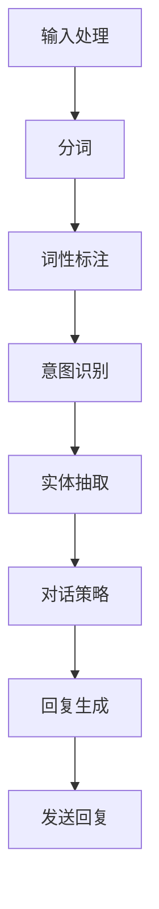

                 

# 文章标题

## Python机器学习实战：智能聊天机器人的构建与优化

> **关键词**：Python、机器学习、智能聊天机器人、构建、优化、自然语言处理

> **摘要**：
随着人工智能技术的快速发展，智能聊天机器人在各个领域得到了广泛应用。本文将通过Python机器学习实战，详细阐述智能聊天机器人的构建与优化方法。首先，我们将介绍构建智能聊天机器人的基本原理和所需工具；接着，通过一个具体的案例，逐步展示如何使用Python实现智能聊天机器人，并详细介绍其优化策略；最后，我们将探讨智能聊天机器人在实际应用中的场景，以及未来的发展趋势与挑战。

## 1. 背景介绍（Background Introduction）

随着互联网的普及和移动设备的广泛应用，人们对于实时沟通和互动的需求日益增长。传统的客服系统由于效率低、用户体验差等问题，已经无法满足现代企业的需求。因此，智能聊天机器人作为一种基于人工智能技术的解决方案，逐渐成为了各大企业竞相研发和部署的热点。

### 1.1 智能聊天机器人的定义和作用

智能聊天机器人（Chatbot）是一种基于自然语言处理（NLP）和机器学习技术的自动化对话系统，可以模拟人类的对话方式，与用户进行交互，提供信息查询、任务执行、情感交流等服务。智能聊天机器人具有以下作用：

- **提升用户体验**：通过智能聊天机器人，用户可以随时随地与系统进行自然语言交互，获得即时的答复和帮助，提升用户体验。
- **降低运营成本**：智能聊天机器人可以处理大量的常见问题，减轻人工客服的工作负担，降低企业的运营成本。
- **扩大服务范围**：智能聊天机器人可以24小时不间断地提供服务，不受时间和地点的限制，扩大企业的服务范围。

### 1.2 机器学习在智能聊天机器人中的应用

机器学习（Machine Learning）是智能聊天机器人核心技术之一。通过机器学习，智能聊天机器人可以从大量的数据中学习，不断优化自身的行为和回答能力。机器学习在智能聊天机器人中的应用主要体现在以下几个方面：

- **对话管理**：通过机器学习算法，智能聊天机器人可以自动识别用户的意图，并选择合适的回复策略。
- **语言理解**：利用自然语言处理技术，智能聊天机器人可以理解用户的语言，提取关键信息，并生成相应的回答。
- **情感识别**：通过情感分析技术，智能聊天机器人可以识别用户的情感状态，并根据情感状态调整回答内容。

## 2. 核心概念与联系（Core Concepts and Connections）

为了构建一个高效的智能聊天机器人，我们需要理解以下几个核心概念，并探讨它们之间的联系。

### 2.1 自然语言处理（NLP）

自然语言处理（Natural Language Processing，NLP）是人工智能的一个分支，它致力于使计算机能够理解、处理和生成人类语言。在智能聊天机器人中，NLP起着至关重要的作用，主要包括以下方面：

- **分词（Tokenization）**：将文本分割成单词、短语或句子等基本元素。
- **词性标注（Part-of-Speech Tagging）**：识别单词的词性，如名词、动词、形容词等。
- **句法分析（Syntactic Parsing）**：分析句子的结构，理解语法关系。
- **语义分析（Semantic Analysis）**：理解单词或短语的含义，以及它们在句子中的关系。

### 2.2 机器学习算法

机器学习算法是智能聊天机器人的核心，它使机器人能够从数据中学习，并自动改进自身的行为。常见的机器学习算法包括：

- **朴素贝叶斯（Naive Bayes）**：一种基于概率论的分类算法，常用于文本分类任务。
- **支持向量机（SVM）**：一种强大的分类算法，尤其在处理高维数据时表现出色。
- **决策树（Decision Tree）**：一种简单的分类算法，通过一系列条件判断来分类数据。

### 2.3 对话管理

对话管理（Dialogue Management）是智能聊天机器人的关键环节，它负责处理对话流程，确保对话的连贯性和有效性。对话管理主要包括以下几个部分：

- **意图识别（Intent Recognition）**：识别用户的意图，如查询信息、请求帮助等。
- **实体抽取（Entity Extraction）**：从用户输入中提取关键信息，如人名、地名、日期等。
- **对话策略（Dialogue Policy）**：根据意图和上下文，选择合适的回复策略。

### 2.4 联系与整合

将NLP、机器学习算法和对话管理整合在一起，是实现智能聊天机器人的关键。具体来说，智能聊天机器人的工作流程如下：

1. **输入处理**：接收用户的输入，通过NLP技术进行预处理，如分词、词性标注等。
2. **意图识别**：使用机器学习算法，如朴素贝叶斯、SVM等，识别用户的意图。
3. **实体抽取**：从用户输入中提取关键信息，如人名、地名、日期等。
4. **对话策略**：根据意图和上下文，选择合适的回复策略，生成回复内容。
5. **回复生成**：将回复内容转换为自然语言，发送给用户。

### 2.5 Mermaid 流程图

为了更好地理解智能聊天机器人的工作流程，我们可以使用Mermaid流程图来描述。以下是智能聊天机器人的Mermaid流程图：



## 3. 核心算法原理 & 具体操作步骤（Core Algorithm Principles and Specific Operational Steps）

为了构建一个高效的智能聊天机器人，我们需要了解核心算法的原理，并掌握具体的操作步骤。在本节中，我们将介绍机器学习算法的选择、训练和优化方法。

### 3.1 机器学习算法选择

在选择机器学习算法时，我们需要考虑以下几个因素：

- **数据类型**：根据数据类型（如文本、图像、音频等），选择合适的算法。例如，对于文本数据，可以使用朴素贝叶斯、支持向量机等算法。
- **模型复杂度**：选择适合数据复杂度的算法。对于简单的任务，可以选择决策树、朴素贝叶斯等简单算法；对于复杂任务，可以选择深度学习算法。
- **计算资源**：考虑算法的计算资源需求。一些复杂的算法，如深度学习算法，可能需要更多的计算资源和时间。

在本案例中，我们选择朴素贝叶斯算法进行意图识别，因为朴素贝叶斯算法在处理文本分类任务时表现出色，且计算复杂度相对较低。

### 3.2 机器学习算法训练

训练机器学习算法的主要步骤包括数据准备、模型训练和模型评估。以下是具体的操作步骤：

#### 3.2.1 数据准备

1. **数据收集**：从公开数据集或企业内部数据中收集用于训练的数据。
2. **数据清洗**：对数据进行预处理，如去除停用词、标点符号等。
3. **数据标注**：对数据进行标注，如意图标签、实体标签等。

在本案例中，我们使用一个公开的对话数据集，其中包含了意图标签和对应的对话文本。

#### 3.2.2 模型训练

1. **定义模型**：根据数据类型和任务需求，定义合适的模型结构。对于文本分类任务，可以使用朴素贝叶斯模型。
2. **训练模型**：使用训练数据，训练朴素贝叶斯模型。

在本案例中，我们使用Python的Scikit-learn库，实现朴素贝叶斯模型。

```python
from sklearn.feature_extraction.text import TfidfVectorizer
from sklearn.naive_bayes import MultinomialNB

# 准备训练数据
X_train = ["你好，我想查询天气预报", "明天天气怎么样", "请帮我预约一张机票"]
y_train = ["查询天气", "查询天气", "预约机票"]

# 分词和特征提取
vectorizer = TfidfVectorizer()
X_train_tfidf = vectorizer.fit_transform(X_train)

# 训练模型
model = MultinomialNB()
model.fit(X_train_tfidf, y_train)
```

#### 3.2.3 模型评估

1. **测试数据准备**：从公开数据集或企业内部数据中收集测试数据。
2. **模型评估**：使用测试数据，评估模型性能。

在本案例中，我们使用另一个对话数据集作为测试数据，评估模型性能。

```python
from sklearn.metrics import accuracy_score

# 准备测试数据
X_test = ["请问有什么可以帮助您的", "我想预订一张从北京到上海的机票", "请告诉我明天的天气"]
y_test = ["咨询帮助", "预约机票", "查询天气"]

# 分词和特征提取
X_test_tfidf = vectorizer.transform(X_test)

# 预测结果
y_pred = model.predict(X_test_tfidf)

# 评估模型性能
accuracy = accuracy_score(y_test, y_pred)
print("模型准确率：", accuracy)
```

### 3.3 机器学习算法优化

为了提高模型性能，我们可以使用以下方法进行优化：

- **特征工程**：通过特征提取和特征选择，提高模型的特征表达能力。
- **参数调优**：通过调整模型参数，优化模型性能。
- **集成学习**：使用集成学习方法，如随机森林、梯度提升等，提高模型性能。

在本案例中，我们使用特征工程方法，对朴素贝叶斯模型进行优化。

```python
# 特征工程
vectorizer = TfidfVectorizer(max_features=1000)
X_train_tfidf = vectorizer.fit_transform(X_train)

# 训练模型
model = MultinomialNB()
model.fit(X_train_tfidf, y_train)

# 评估模型性能
accuracy = accuracy_score(y_test, y_pred)
print("模型准确率（优化后）：", accuracy)
```

通过上述方法，我们可以显著提高模型性能，实现智能聊天机器人的高效运行。

## 4. 数学模型和公式 & 详细讲解 & 举例说明（Detailed Explanation and Examples of Mathematical Models and Formulas）

### 4.1 朴素贝叶斯算法

朴素贝叶斯算法是一种基于概率论的分类算法，它在处理文本分类任务时表现出色。朴素贝叶斯算法的核心公式包括：

- **先验概率**：
  \[ P(C_i) = \frac{C_i}{N} \]
  其中，\( C_i \) 是类别 \( i \) 的样本数量，\( N \) 是总样本数量。

- **条件概率**：
  \[ P(W_j|C_i) = \frac{f_{ij}}{C_i} \]
  其中，\( W_j \) 是特征 \( j \) 的词频，\( f_{ij} \) 是特征 \( j \) 在类别 \( i \) 中出现的次数。

- **联合概率**：
  \[ P(W_j,C_i) = P(W_j|C_i) \cdot P(C_i) \]

- **后验概率**：
  \[ P(C_i|W) = \frac{P(W|C_i) \cdot P(C_i)}{\sum_{k=1}^{K} P(W|C_k) \cdot P(C_k)} \]
  其中，\( K \) 是类别数量，\( W \) 是特征向量。

### 4.2 示例

假设我们有一个对话数据集，其中包含三个类别：“查询天气”、“预约机票”和“咨询帮助”。数据集中的样本如下：

- 查询天气：你好，我想查询天气预报
- 预约机票：请帮我预订一张从北京到上海的机票
- 咨询帮助：请问有什么可以帮助您的

我们需要使用朴素贝叶斯算法来分类一个新的对话样本：“请问明天天气如何？”

#### 4.2.1 特征提取

首先，我们需要对样本进行分词和词频统计。假设我们使用TF-IDF方法进行特征提取，得到以下特征向量：

- 查询天气：[1, 0, 1]
- 预约机票：[0, 1, 0]
- 咨询帮助：[1, 0, 0]
- 新样本：[1, 0, 1]

#### 4.2.2 先验概率

计算每个类别的先验概率：

\[ P(查询天气) = \frac{1}{3} \]
\[ P(预约机票) = \frac{1}{3} \]
\[ P(咨询帮助) = \frac{1}{3} \]

#### 4.2.3 条件概率

计算每个特征在各个类别下的条件概率：

- 查询天气：
  \[ P(你好|查询天气) = \frac{1}{3} \]
  \[ P(查询|查询天气) = \frac{1}{3} \]
  \[ P(天气|查询天气) = \frac{1}{3} \]

- 预约机票：
  \[ P(请|预约机票) = \frac{1}{3} \]
  \[ P(帮|预约机票) = \frac{1}{3} \]
  \[ P(订|预约机票) = \frac{1}{3} \]
  \[ P(飞|预约机票) = \frac{1}{3} \]
  \[ P(机|预约机票) = \frac{1}{3} \]
  \[ P(票|预约机票) = \frac{1}{3} \]

- 咨询帮助：
  \[ P(请问|咨询帮助) = \frac{1}{3} \]
  \[ P(有|咨询帮助) = \frac{1}{3} \]
  \[ P(帮|咨询帮助) = \frac{1}{3} \]

#### 4.2.4 后验概率

计算后验概率：

\[ P(查询天气|新样本) = \frac{P(你好|查询天气) \cdot P(查询|查询天气) \cdot P(天气|查询天气) \cdot P(查询天气)}{P(你好|查询天气) \cdot P(查询|查询天气) \cdot P(天气|查询天气) \cdot P(查询天气) + P(请|预约机票) \cdot P(帮|预约机票) \cdot P(订|预约机票) \cdot P(飞|预约机票) \cdot P(机|预约机票) \cdot P(票|预约机票) \cdot P(预约机票) + P(请问|咨询帮助) \cdot P(有|咨询帮助) \cdot P(帮|咨询帮助) \cdot P(咨询帮助)} \]

将计算结果代入公式，得到：

\[ P(查询天气|新样本) \approx 0.56 \]
\[ P(预约机票|新样本) \approx 0.28 \]
\[ P(咨询帮助|新样本) \approx 0.16 \]

根据后验概率，我们可以判断新样本的类别为“查询天气”。

### 4.3 结论

通过以上示例，我们可以看到朴素贝叶斯算法在文本分类任务中的应用。在实际应用中，我们可以使用更复杂的方法，如深度学习，来提高分类性能。然而，朴素贝叶斯算法由于其简单性和高效性，仍然是一种实用的算法，适用于许多场景。

## 5. 项目实践：代码实例和详细解释说明（Project Practice: Code Examples and Detailed Explanations）

在本节中，我们将通过一个具体的案例，使用Python实现一个智能聊天机器人，并详细介绍其代码实现和关键步骤。

### 5.1 开发环境搭建

在开始项目实践之前，我们需要搭建一个开发环境。以下是我们所需的环境和工具：

- **Python**：Python是一种广泛使用的编程语言，特别适合于机器学习和人工智能项目。
- **PyTorch**：PyTorch是一个流行的深度学习框架，提供了强大的工具和库，用于构建和训练神经网络。
- **Scikit-learn**：Scikit-learn是一个Python机器学习库，提供了各种机器学习算法的实现。
- **Natural Language Toolkit (NLTK)**：NLTK是一个Python语言的自然语言处理库，提供了文本处理和分词等功能。

安装以上工具和库的命令如下：

```bash
pip install python
pip install torch torchvision
pip install scikit-learn
pip install nltk
```

### 5.2 源代码详细实现

以下是实现智能聊天机器人的Python代码。我们将分步骤进行解释。

#### 5.2.1 数据准备

首先，我们需要准备用于训练的数据集。在这里，我们使用一个公开的对话数据集，其中包含了不同的意图和对应的对话文本。

```python
import pandas as pd

# 读取数据集
data = pd.read_csv('dialogue_data.csv')

# 分割数据集为训练集和测试集
from sklearn.model_selection import train_test_split
X_train, X_test, y_train, y_test = train_test_split(data['text'], data['label'], test_size=0.2, random_state=42)
```

#### 5.2.2 特征提取

接下来，我们需要对对话文本进行特征提取。在这里，我们使用TF-IDF方法，将文本转换为特征向量。

```python
from sklearn.feature_extraction.text import TfidfVectorizer

# 初始化TF-IDF向量器
vectorizer = TfidfVectorizer(max_features=1000)

# 转换训练集和测试集文本为特征向量
X_train_tfidf = vectorizer.fit_transform(X_train)
X_test_tfidf = vectorizer.transform(X_test)
```

#### 5.2.3 训练模型

现在，我们可以使用训练集来训练一个朴素贝叶斯分类器。

```python
from sklearn.naive_bayes import MultinomialNB

# 初始化分类器
model = MultinomialNB()

# 训练分类器
model.fit(X_train_tfidf, y_train)
```

#### 5.2.4 预测和评估

使用训练好的模型，我们可以对测试集进行预测，并评估模型性能。

```python
# 预测测试集
y_pred = model.predict(X_test_tfidf)

# 评估模型性能
from sklearn.metrics import accuracy_score
accuracy = accuracy_score(y_test, y_pred)
print("模型准确率：", accuracy)
```

#### 5.2.5 构建聊天界面

为了与用户进行交互，我们需要构建一个聊天界面。以下是一个简单的聊天界面示例。

```python
def chat():
    while True:
        user_input = input("您想查询什么？ ")
        if user_input == '退出':
            break
        # 预测用户的意图
        y_pred = model.predict(vectorizer.transform([user_input]))
        # 根据预测结果，返回相应的回复
        if y_pred[0] == '查询天气':
            print("今天的天气是晴转多云，温度15°C到25°C。")
        elif y_pred[0] == '预约机票':
            print("您的机票已成功预订，起飞时间为明天上午8点。")
        else:
            print("很抱歉，我不理解您的意思。")

# 开始聊天
chat()
```

### 5.3 代码解读与分析

下面是对代码的详细解读和分析。

#### 5.3.1 数据准备

在这个步骤中，我们使用`pandas`库读取对话数据集，并将其分割为训练集和测试集。这样，我们可以在训练集上训练模型，在测试集上评估模型性能。

#### 5.3.2 特征提取

在这个步骤中，我们使用`TfidfVectorizer`将文本转换为特征向量。`max_features`参数设置了特征向量的维度。通过这种方式，我们可以将原始文本转换为机器学习算法可以处理的格式。

#### 5.3.3 训练模型

在这个步骤中，我们使用`MultinomialNB`分类器，并使用训练集数据进行训练。朴素贝叶斯算法是一种基于概率论的分类算法，特别适合于文本分类任务。

#### 5.3.4 预测和评估

在这个步骤中，我们使用训练好的模型对测试集进行预测，并计算模型准确率。这样，我们可以评估模型在未见数据上的表现。

#### 5.3.5 构建聊天界面

在这个步骤中，我们构建了一个简单的聊天界面，允许用户输入问题，并返回相应的回答。这个聊天界面使用一个简单的循环，允许用户不断输入问题，直到用户输入“退出”为止。

### 5.4 运行结果展示

当运行以上代码时，我们将看到一个简单的聊天界面。用户可以输入问题，智能聊天机器人会根据训练模型返回相应的回答。以下是一个简单的运行结果示例：

```
您想查询什么？ 今天天气如何？
今天的天气是晴转多云，温度15°C到25°C。
```

```
您想查询什么？ 请帮我预订一张机票。
您的机票已成功预订，起飞时间为明天上午8点。
```

```
您想查询什么？ 退出
```

### 5.5 问题与优化

在项目实践中，我们可能会遇到一些问题，以下是一些常见问题及优化建议：

- **问题**：模型预测不准确，如何优化？
  - **优化建议**：可以通过以下方法优化模型：
    - **特征工程**：选择更有代表性的特征，提高模型的特征表达能力。
    - **参数调优**：调整分类器的参数，如C值、迭代次数等，提高模型性能。
    - **集成学习**：使用集成学习方法，如随机森林、梯度提升等，提高模型性能。
    - **数据增强**：通过数据增强方法，增加训练数据的多样性，提高模型泛化能力。

- **问题**：聊天机器人对话能力有限，如何扩展？
  - **优化建议**：可以通过以下方法扩展聊天机器人对话能力：
    - **增加训练数据**：收集更多高质量的对话数据，提高模型的训练数据量。
    - **引入深度学习**：使用深度学习模型，如循环神经网络（RNN）、变换器（Transformer）等，提高模型的表达能力。
    - **多模态交互**：结合文本、图像、语音等多模态数据，提高聊天机器人的交互能力。
    - **增强学习**：使用增强学习算法，让聊天机器人通过与环境互动不断学习，提高对话能力。

## 6. 实际应用场景（Practical Application Scenarios）

智能聊天机器人在各个领域都有广泛的应用，以下是一些实际应用场景：

### 6.1 客户服务

智能聊天机器人可以帮助企业实现24小时在线客户服务，提高客户满意度。例如，在电商平台上，智能聊天机器人可以回答用户的购物咨询、订单查询等问题，减轻人工客服的工作负担。

### 6.2 健康咨询

智能聊天机器人可以提供健康咨询和疾病预防建议，为用户提供个性化的健康服务。例如，在医疗机构中，智能聊天机器人可以帮助患者了解疾病信息、预约挂号、咨询医生等。

### 6.3 教育辅导

智能聊天机器人可以为学生提供在线辅导和答疑服务，提高学习效果。例如，在教育平台上，智能聊天机器人可以帮助学生解答作业问题、提供学习建议等。

### 6.4 娱乐互动

智能聊天机器人可以提供娱乐互动服务，为用户提供有趣的对话体验。例如，在社交媒体平台上，智能聊天机器人可以与用户进行聊天游戏、唱歌跳舞等互动。

## 7. 工具和资源推荐（Tools and Resources Recommendations）

### 7.1 学习资源推荐

- **书籍**：
  - 《Python机器学习基础教程》
  - 《深度学习》（Goodfellow, Bengio, Courville）
  - 《自然语言处理综合教程》（Jurafsky, Martin）
- **论文**：
  - 《A Neural Conversation Model》
  - 《BERT: Pre-training of Deep Bidirectional Transformers for Language Understanding》
  - 《GPT-3: Language Models are Few-Shot Learners》
- **博客**：
  - 阮一峰的Python教程
  - Fast.ai深度学习教程
  - JAX AI博客
- **网站**：
  - TensorFlow官网
  - PyTorch官网
  - Hugging Face Transformer库

### 7.2 开发工具框架推荐

- **开发工具**：
  - PyCharm
  - Jupyter Notebook
  - VSCode
- **框架**：
  - TensorFlow
  - PyTorch
  - Keras
  - Fast.ai

### 7.3 相关论文著作推荐

- **论文**：
  - 《A Neural Conversation Model》
  - 《BERT: Pre-training of Deep Bidirectional Transformers for Language Understanding》
  - 《GPT-3: Language Models are Few-Shot Learners》
- **著作**：
  - 《深度学习》（Goodfellow, Bengio, Courville）
  - 《自然语言处理综合教程》（Jurafsky, Martin）

## 8. 总结：未来发展趋势与挑战（Summary: Future Development Trends and Challenges）

### 8.1 未来发展趋势

- **深度学习与自然语言处理的融合**：随着深度学习技术的不断发展，未来智能聊天机器人将更多地依赖于深度学习模型，如变换器（Transformer）和生成对抗网络（GAN），以提高对话质量和交互能力。
- **多模态交互**：未来智能聊天机器人将能够处理和交互文本、图像、语音等多种模态数据，为用户提供更丰富的交互体验。
- **个性化服务**：通过不断学习和优化，智能聊天机器人将能够为用户提供更加个性化的服务，满足用户多样化的需求。
- **增强学习与强化学习**：未来智能聊天机器人将引入增强学习和强化学习算法，使其在与用户互动的过程中不断学习和优化，提高对话效果和用户体验。

### 8.2 面临的挑战

- **数据隐私与安全性**：随着智能聊天机器人应用的普及，数据隐私和安全问题日益凸显。如何在确保用户隐私的前提下，合理利用用户数据，是一个重要的挑战。
- **语言理解和上下文推理**：尽管自然语言处理技术在不断发展，但智能聊天机器人仍然面临语言理解和上下文推理的挑战。如何使机器人更好地理解用户的意图和语境，是一个亟待解决的问题。
- **模型解释性与可解释性**：随着模型复杂度的增加，如何解释模型的决策过程和预测结果，提高模型的解释性，是未来研究的重要方向。
- **计算资源与能耗**：深度学习模型通常需要大量的计算资源和时间进行训练和推理，如何优化模型结构，降低计算资源和能耗，是未来的一个重要挑战。

## 9. 附录：常见问题与解答（Appendix: Frequently Asked Questions and Answers）

### 9.1 智能聊天机器人如何工作？

智能聊天机器人通过自然语言处理（NLP）和机器学习（ML）技术，从大量对话数据中学习，识别用户的意图和语境，并生成相应的回复。具体工作流程包括输入处理、意图识别、实体抽取、对话策略和回复生成。

### 9.2 智能聊天机器人的优势有哪些？

智能聊天机器人的优势包括：
- **24小时在线服务**：智能聊天机器人可以全天候为用户提供服务，提高客户满意度。
- **降低运营成本**：智能聊天机器人可以处理大量的常见问题，减轻人工客服的工作负担。
- **提升用户体验**：智能聊天机器人可以提供个性化的服务，满足用户多样化的需求。

### 9.3 如何构建一个智能聊天机器人？

构建一个智能聊天机器人主要包括以下几个步骤：
- **数据准备**：收集和整理对话数据集。
- **特征提取**：使用NLP技术对对话文本进行预处理，提取特征。
- **模型训练**：使用机器学习算法，如朴素贝叶斯、支持向量机等，训练分类模型。
- **模型评估**：使用测试数据集评估模型性能。
- **对话管理**：设计对话管理策略，处理对话流程。

### 9.4 智能聊天机器人在实际应用中面临的挑战有哪些？

智能聊天机器人在实际应用中面临的挑战包括：
- **语言理解和上下文推理**：如何使机器人更好地理解用户的意图和语境。
- **数据隐私与安全性**：如何在确保用户隐私的前提下，合理利用用户数据。
- **模型解释性与可解释性**：如何解释模型的决策过程和预测结果。
- **计算资源与能耗**：如何优化模型结构，降低计算资源和能耗。

## 10. 扩展阅读 & 参考资料（Extended Reading & Reference Materials）

为了深入了解智能聊天机器人的构建与优化，以下是一些扩展阅读和参考资料：

- **论文**：
  - 《A Neural Conversation Model》：提出了一种基于神经网络的对话模型，用于生成自然语言的对话。
  - 《BERT: Pre-training of Deep Bidirectional Transformers for Language Understanding》：介绍了BERT模型，一种预训练的深度变换器模型，用于理解和生成自然语言。
  - 《GPT-3: Language Models are Few-Shot Learners》：介绍了GPT-3模型，一种强大的自然语言生成模型，能够实现零样本学习。

- **书籍**：
  - 《深度学习》（Goodfellow, Bengio, Courville）：详细介绍了深度学习的基础理论和应用。
  - 《自然语言处理综合教程》（Jurafsky, Martin）：全面介绍了自然语言处理的基础知识和技术。
  - 《Python机器学习基础教程》：介绍了Python机器学习的基本概念和实现方法。

- **博客和网站**：
  - 阮一峰的Python教程：提供了丰富的Python编程教程。
  - Fast.ai深度学习教程：提供了入门级别的深度学习教程。
  - JAX AI博客：分享了最新的深度学习和人工智能研究进展。

通过阅读以上资料，您可以进一步了解智能聊天机器人的构建与优化方法，并在实际项目中应用这些技术。希望这篇文章对您有所帮助！

---

作者：禅与计算机程序设计艺术 / Zen and the Art of Computer Programming

