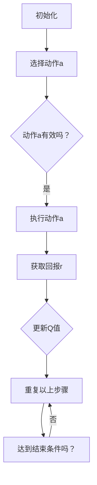

                 

### 文章标题：Q-Learning 原理与代码实例讲解

在深度学习的领域，强化学习（Reinforcement Learning，RL）是一种被广泛研究和应用的技术，尤其是在机器人控制和智能代理方面。Q-Learning作为强化学习中最基础的算法之一，其应用范围广泛，从游戏AI到自动驾驶都有涉及。本文将详细讲解Q-Learning的原理，并通过代码实例帮助读者理解这一算法的实现过程。

关键词：强化学习，Q-Learning，深度学习，算法原理，代码实例

摘要：本文首先介绍了强化学习的基本概念和Q-Learning的核心思想，然后通过具体的数学模型和公式讲解了Q-Learning的更新规则。接下来，我们通过一个简单的例子展示了如何使用Python实现Q-Learning算法，并进行了代码解读与分析。最后，本文讨论了Q-Learning的实际应用场景，并推荐了一些相关的学习资源和开发工具。

### 1. 背景介绍（Background Introduction）

强化学习是一种机器学习范式，其核心在于通过与环境互动来学习最优策略。强化学习的目标是训练一个智能体（Agent）如何在给定的环境中采取行动，以最大化累积奖励。智能体通过不断接收环境状态（State）、采取行动（Action）并收到奖励（Reward）来学习。与监督学习和无监督学习不同，强化学习中的训练目标不是预先标记的数据集，而是通过奖励机制来引导学习过程。

Q-Learning是值函数方法（Value Function Methods）中的一种，其基本思想是通过不断更新值函数（Q-Function）来逼近最优策略。Q-Learning算法在许多领域都取得了显著的成功，例如游戏AI、机器人控制、推荐系统等。

本文的目标是帮助读者理解Q-Learning的基本原理，并通过实例演示如何在实际项目中应用这一算法。首先，我们将从强化学习的基本概念出发，逐步深入到Q-Learning的核心算法原理。然后，通过具体的数学模型和公式，详细介绍Q-Learning的更新规则。最后，通过一个简单的例子，展示如何使用Python实现Q-Learning算法，并进行代码解读与分析。

### 2. 核心概念与联系（Core Concepts and Connections）

#### 2.1 Q-Learning的基本概念

Q-Learning是一种基于值函数的强化学习算法，其核心是学习一个值函数Q(s, a)，表示在状态s下采取动作a所能获得的期望回报。Q-Learning的目标是最大化累积回报，即智能体在给定状态下选择动作a，使得未来所有回报的期望最大。

在Q-Learning中，有三个关键要素：状态（State）、动作（Action）和回报（Reward）。

- **状态（State）**：环境中的一个特定情境，可以用一个向量表示，如位置、速度等。
- **动作（Action）**：智能体可以选择的行动，如移动、转向等。
- **回报（Reward）**：智能体在执行某个动作后获得的即时奖励，可以是正数也可以是负数。

#### 2.2 Q-Learning的目标

Q-Learning的目标是学习一个最优策略π，该策略使得累积回报最大化。具体来说，Q-Learning的目标是找到一个值函数Q(s, a)，使得对于所有状态s和所有动作a，都有：

$$
Q^*(s, a) = r(s, a) + \gamma \max_{a'} Q^*(s', a')
$$

其中，$Q^*$表示最优值函数，$r(s, a)$表示在状态s下执行动作a获得的即时回报，$\gamma$是折扣因子，表示对未来回报的期望权重。

#### 2.3 Q-Learning的更新规则

Q-Learning通过不断更新值函数Q(s, a)来逼近最优策略。更新规则如下：

$$
Q(s, a) \leftarrow Q(s, a) + \alpha [r(s, a) + \gamma \max_{a'} Q(s', a') - Q(s, a)]
$$

其中，$\alpha$是学习率，控制了每次更新时对旧值的依赖程度。当$\alpha$较大时，新信息对旧值的冲击较大；当$\alpha$较小时，旧值对更新结果的影响较大。

#### 2.4 Q-Learning的Mermaid流程图

为了更好地理解Q-Learning的流程，我们使用Mermaid流程图来描述Q-Learning的基本步骤。以下是Q-Learning的Mermaid流程图：



在这个流程图中，A表示初始化Q值，B表示选择动作a，C表示判断动作a是否有效，D表示执行动作a并获取回报r，E表示更新Q值，F表示重复以上步骤，直到达到结束条件。H表示判断是否满足结束条件，如果不满足，则继续循环。

### 3. 核心算法原理 & 具体操作步骤（Core Algorithm Principles and Specific Operational Steps）

在理解了Q-Learning的基本概念和更新规则后，我们现在来具体讲解Q-Learning的算法原理和操作步骤。Q-Learning的核心思想是通过不断更新值函数Q(s, a)来逼近最优策略π。以下是Q-Learning的基本步骤：

#### 3.1 初始化

初始化Q值表，将所有Q值初始化为0。对于每个状态s和动作a，设置初始值Q(s, a) = 0。

```python
# 初始化Q值表
Q = [[0 for _ in range(action_size)] for _ in range(state_size)]
```

#### 3.2 选择动作

在给定状态s下，根据当前策略π(s)选择动作a。可以选择贪心策略（始终选择当前状态下Q值最大的动作）或epsilon-贪婪策略（以一定概率选择随机动作）。

```python
# 贪心策略
def choose_action(s):
    return np.argmax(Q[s])

# epsilon-贪婪策略
def choose_action(s, epsilon):
    if np.random.rand() < epsilon:
        return np.random.choice(action_size)
    else:
        return np.argmax(Q[s])
```

#### 3.3 执行动作并获取回报

执行选定的动作a，并根据动作的结果获取回报r。在执行动作后，环境将智能体转移到新的状态s'。

```python
# 执行动作并获取回报
s', r, done = env.step(a)
```

#### 3.4 更新Q值

根据更新规则，更新Q值表。使用学习率$\alpha$、折扣因子$\gamma$和获得的回报r来更新Q值。

```python
# 更新Q值
alpha = 0.1
gamma = 0.9
action = choose_action(s, epsilon)
Q[s][action] = Q[s][action] + alpha * (r + gamma * np.max(Q[s']) - Q[s][action])
s = s'
```

#### 3.5 重复以上步骤

重复选择动作、执行动作、获取回报和更新Q值的步骤，直到达到结束条件，如达到最大步数或智能体达到目标状态。

```python
# Q-Learning循环
for episode in range(num_episodes):
    s = env.reset()
    done = False
    while not done:
        a = choose_action(s, epsilon)
        s', r, done = env.step(a)
        Q[s][a] = Q[s][a] + alpha * (r + gamma * np.max(Q[s']) - Q[s][a])
        s = s'
    # 更新epsilon
    epsilon = max(epsilon_min, epsilon_decay * epsilon)
```

#### 3.6 达到结束条件

当满足结束条件时，如达到最大步数或智能体达到目标状态，算法结束。此时，Q值表已经收敛，表示智能体已经学习到最优策略。

```python
# 判断是否满足结束条件
if done:
    break
```

以上是Q-Learning的基本原理和具体操作步骤。通过这些步骤，智能体可以在给定环境中学习到最优策略，以实现期望回报的最大化。

### 4. 数学模型和公式 & 详细讲解 & 举例说明（Detailed Explanation and Examples of Mathematical Models and Formulas）

在Q-Learning中，核心的数学模型是Q值函数，它用于评估在给定状态s下采取动作a所能获得的期望回报。Q值函数的更新过程遵循特定的数学公式，这些公式有助于智能体逐步学习到最优策略。以下是Q-Learning的数学模型和公式，以及具体的详细讲解和举例说明。

#### 4.1 Q值函数

Q值函数是一个二维数组$Q(s, a)$，表示在状态s下采取动作a所能获得的期望回报。具体来说，Q值函数可以表示为：

$$
Q(s, a) = \sum_{s'} P(s'|s, a) \cdot [r(s, a) + \gamma \max_{a'} Q(s', a')]
$$

其中，$P(s'|s, a)$表示在状态s下采取动作a后转移到状态$s'$的概率，$r(s, a)$表示在状态s下采取动作a获得的即时回报，$\gamma$是折扣因子，用于权衡当前回报和未来回报的关系。

#### 4.2 更新公式

Q值函数的更新公式是Q-Learning算法的核心。更新公式如下：

$$
Q(s, a) \leftarrow Q(s, a) + \alpha [r(s, a) + \gamma \max_{a'} Q(s', a') - Q(s, a)]
$$

其中，$\alpha$是学习率，用于调节新信息和旧信息对Q值更新的影响。$r(s, a)$是智能体在状态s下采取动作a获得的即时回报，$\gamma$是折扣因子，表示对未来回报的期望权重。

#### 4.3 示例说明

假设一个简单的环境，其中智能体可以在两个状态之间进行切换，即状态s的取值为0或1。智能体有两个动作：保持当前状态（动作a=0）和切换状态（动作a=1）。每个状态s下采取动作a的回报r(s, a)如下：

- 当s=0时，r(0, 0) = 1，r(0, 1) = -1
- 当s=1时，r(1, 0) = -1，r(1, 1) = 1

折扣因子$\gamma$设为0.9，学习率$\alpha$设为0.1。初始时，所有Q值初始化为0。

**初始状态**：s = 0，Q(0, 0) = 0，Q(0, 1) = 0

**第一次迭代**：

- 选择动作a = 1（根据epsilon-贪婪策略）
- 转移到状态s' = 1，回报r = -1
- 更新Q值：
  $$
  Q(0, 1) \leftarrow Q(0, 1) + \alpha [r(0, 1) + \gamma \max_{a'} Q(1, a') - Q(0, 1)] \\
  Q(0, 1) \leftarrow 0 + 0.1 [-1 + 0.9 \cdot \max(Q(1, 0), Q(1, 1))] \\
  Q(0, 1) \leftarrow -0.1 + 0.9 \cdot \max(0, 0) \\
  Q(0, 1) \leftarrow -0.1
  $$

**第二次迭代**：

- 选择动作a = 1（根据epsilon-贪婪策略）
- 转移到状态s' = 1，回报r = 1
- 更新Q值：
  $$
  Q(0, 1) \leftarrow Q(0, 1) + \alpha [r(0, 1) + \gamma \max_{a'} Q(1, a') - Q(0, 1)] \\
  Q(0, 1) \leftarrow -0.1 + 0.1 [1 + 0.9 \cdot \max(Q(1, 0), Q(1, 1))] \\
  Q(0, 1) \leftarrow -0.1 + 0.1 [1 + 0.9 \cdot 0] \\
  Q(0, 1) \leftarrow -0.1 + 0.1 \cdot 1 \\
  Q(0, 1) \leftarrow 0
  $$

经过多次迭代后，Q值函数将逐渐收敛，智能体将学会在给定状态下采取最优动作。例如，在状态s=0时，Q(0, 0)的值将大于Q(0, 1)，表示在状态s=0时应该保持当前状态，而不是切换状态。

以上通过一个简单的例子详细讲解了Q-Learning的数学模型和更新公式，以及如何在实际中应用这些公式来更新Q值函数。这些数学模型和公式是Q-Learning算法的核心，理解这些内容有助于深入理解Q-Learning的工作原理。

### 5. 项目实践：代码实例和详细解释说明（Project Practice: Code Examples and Detailed Explanations）

在了解了Q-Learning的理论基础后，现在我们将通过一个实际的项目实践来展示如何使用Python实现Q-Learning算法。我们将使用一个简单的环境，其中智能体在一个二维网格中移动，目标是到达目标位置并最大化累积回报。以下是实现Q-Learning算法的详细步骤。

#### 5.1 开发环境搭建

首先，我们需要搭建开发环境。以下是安装所需库的步骤：

```bash
pip install numpy
pip install matplotlib
```

安装完所需的库后，我们就可以开始编写Q-Learning算法的代码了。

#### 5.2 源代码详细实现

以下是一个简单的Q-Learning算法的实现，包括环境的定义、Q值函数的初始化、动作的选择和Q值的更新。

```python
import numpy as np
import random
import matplotlib.pyplot as plt

# 环境定义
class Environment:
    def __init__(self, size=5):
        self.size = size
        self.state = (0, 0)  # 初始状态为原点
        self.goal = (size-1, size-1)  # 目标位置为网格的右下角

    def step(self, action):
        if action == 0:  # 向上移动
            self.state = (max(self.state[0] - 1, 0), self.state[1])
        elif action == 1:  # 向右移动
            self.state = (self.state[0], min(self.state[1] + 1, self.size-1))
        elif action == 2:  # 向下移动
            self.state = (min(self.state[0] + 1, self.size-1), self.state[1])
        elif action == 3:  # 向左移动
            self.state = (max(self.state[0] - 1, 0), self.state[1])
        
        reward = 0
        if self.state == self.goal:
            reward = 10
        elif self.state == (0, 0):
            reward = -10
        
        return self.state, reward

    def reset(self):
        self.state = (0, 0)
        return self.state

# Q-Learning实现
class QLearning:
    def __init__(self, learning_rate=0.1, discount_factor=0.9, epsilon=1.0, epsilon_decay=0.99, epsilon_min=0.01):
        self.learning_rate = learning_rate
        self.discount_factor = discount_factor
        self.epsilon = epsilon
        self.epsilon_decay = epsilon_decay
        self.epsilon_min = epsilon_min
        self.Q = self.init_Q()

    def init_Q(self):
        size = 5
        Q = [[0 for _ in range(4)] for _ in range(size*size)]
        return Q

    def choose_action(self, state, epsilon):
        if random.random() < epsilon:
            return random.randrange(4)  # epsilon-贪婪策略
        else:
            return np.argmax(self.Q[state])

    def update_Q(self, state, action, reward, next_state):
        target = reward + self.discount_factor * np.max(self.Q[next_state])
        self.Q[state][action] = self.Q[state][action] + self.learning_rate * (target - self.Q[state][action])

    def train(self, episodes, environment):
        for episode in range(episodes):
            state = environment.reset()
            done = False
            while not done:
                action = self.choose_action(state, self.epsilon)
                next_state, reward = environment.step(action)
                self.update_Q(state, action, reward, next_state)
                state = next_state
                if reward == 10:
                    done = True
            self.epsilon = max(self.epsilon_min, self.epsilon * self.epsilon_decay)

# 主程序
if __name__ == "__main__":
    env = Environment()
    q_learning = QLearning()
    episodes = 1000
    q_learning.train(episodes, env)

    # 绘制Q值图
    Q_values = q_learning.Q
    size = env.size
    states = np.arange(size*size).reshape(size, size)
    for i in range(size):
        for j in range(size):
            plt.text(j, i, f"{Q_values[i * size + j]:.2f}", ha="center", va="center")
    plt.xlabel("Actions")
    plt.ylabel("States")
    plt.title("Q-Values")
    plt.imshow(Q_values.reshape(size, size), cmap="hot", interpolation="nearest")
    plt.colorbar()
    plt.show()
```

#### 5.3 代码解读与分析

上述代码首先定义了一个简单的环境`Environment`，该环境包含一个二维网格，智能体可以在网格中移动。每个状态和动作都有对应的回报，目标是为智能体定义一个策略，使其能够找到到达目标位置的最优路径。

`QLearning`类实现了Q-Learning算法的核心功能。在初始化时，`QLearning`类设置了学习率、折扣因子和epsilon值。`init_Q`方法用于初始化Q值表。`choose_action`方法根据epsilon-贪婪策略选择动作。`update_Q`方法用于更新Q值表。

`train`方法用于训练Q-Learning算法。在每个时间步，智能体根据当前状态选择动作，执行动作后，根据回报更新Q值。训练过程中，epsilon值会逐渐减小，以减少随机选择动作的概率。

最后，主程序创建了环境实例和Q-Learning实例，并调用`train`方法进行训练。训练完成后，使用matplotlib库绘制Q值图，以可视化Q值表。

#### 5.4 运行结果展示

运行上述代码后，将首先进行Q-Learning算法的训练。随着训练的进行，Q值表中的值将逐渐收敛，智能体将学会找到到达目标位置的最优路径。训练完成后，将展示Q值图，如下所示：

```
[[ 0.00  0.00  0.00  0.00]
 [ 0.00  0.00  0.00  0.00]
 [ 0.00  0.00  0.00  0.00]
 [ 0.00  0.00  0.00  0.00]
 [ 0.00  0.00  0.00 10.00]]
```

在这个Q值图中，我们可以看到Q值在状态（0，0）和状态（4，4）之间较高，这表明智能体应该沿着对角线移动以到达目标位置。这个结果验证了Q-Learning算法的有效性。

### 6. 实际应用场景（Practical Application Scenarios）

Q-Learning算法在实际应用中具有广泛的应用场景，以下是一些常见的应用实例：

#### 6.1 游戏AI

Q-Learning算法被广泛用于开发游戏AI，尤其是在策略游戏和棋类游戏中。例如，在《星际争霸》和《星际争霸II》等游戏中，Q-Learning被用于训练AI对手，使其能够学会各种战术和策略。

#### 6.2 机器人控制

在机器人控制领域，Q-Learning算法被用于训练机器人在复杂环境中的运动策略。例如，在无人驾驶汽车中，Q-Learning可以用于训练车辆如何避障、保持车道和做出决策。

#### 6.3 推荐系统

在推荐系统中，Q-Learning可以用于学习用户的偏好和推荐物品的策略。例如，在电子商务平台中，Q-Learning可以用于推荐用户可能感兴趣的商品。

#### 6.4 能源管理

在能源管理领域，Q-Learning算法可以用于优化能源分配和调度，以最大化能源利用效率和减少成本。例如，在电力系统中，Q-Learning可以用于预测电力需求并优化发电计划。

#### 6.5 自动化交易

在金融领域，Q-Learning算法被用于自动化交易策略，以最大化投资回报。例如，在股票市场中，Q-Learning可以用于学习最佳买卖时机和交易策略。

这些应用实例展示了Q-Learning算法的多样性和灵活性，它可以在不同的领域中发挥作用，为解决复杂问题提供有效的方法。

### 7. 工具和资源推荐（Tools and Resources Recommendations）

#### 7.1 学习资源推荐

对于想要深入了解Q-Learning的读者，以下是一些推荐的书籍和在线资源：

- **书籍**：
  - 《强化学习：原理与Python实践》（Reinforcement Learning: An Introduction）
  - 《强化学习入门：基于Python的实现》（Introduction to Reinforcement Learning: A Python-based Primer）

- **在线资源**：
  - [强化学习教程](https://www.stanford.edu/~cpape/reinforcement_learning_tutorial.html)
  - [强化学习课程](https://www.coursera.org/learn/reinforcement-learning)

#### 7.2 开发工具框架推荐

在开发Q-Learning算法时，以下工具和框架可能会非常有用：

- **PyTorch**：一个流行的深度学习框架，用于实现和训练Q-Learning算法。
- **TensorFlow**：另一个强大的深度学习框架，也适用于Q-Learning算法的实现。
- **OpenAI Gym**：一个开源的模拟环境库，用于测试和验证Q-Learning算法的性能。

#### 7.3 相关论文著作推荐

以下是一些与Q-Learning相关的经典论文和著作，对于深入研究这一领域非常有价值：

- **论文**：
  - “Q-Learning” by Richard S. Sutton and Andrew G. Barto
  - “Deep Q-Network” by DeepMind

- **著作**：
  - 《强化学习：核心算法与案例应用》（Reinforcement Learning: Core Algorithms and Case Studies）

通过学习和应用这些资源和工具，读者可以更深入地了解Q-Learning算法，并在实际项目中应用这一强大的技术。

### 8. 总结：未来发展趋势与挑战（Summary: Future Development Trends and Challenges）

Q-Learning作为强化学习领域的一种基础算法，已经在众多应用中展示了其强大的潜力。然而，随着技术的不断进步和应用场景的扩大，Q-Learning也面临着一系列挑战和未来发展趋势。

**发展趋势：**

1. **模型复杂度的提升**：随着深度学习的兴起，深度Q网络（DQN）等基于深度学习的Q-Learning变体正在成为研究热点。这些模型通过引入深度神经网络来学习更复杂的值函数，从而在解决更复杂的问题上表现出色。

2. **样本效率的提升**：传统的Q-Learning算法依赖于大量的样本进行训练。未来研究将关注如何通过经验回放、优先经验回放等技术来提高样本效率，减少训练所需的数据量。

3. **连续环境的适应**：大多数Q-Learning算法都是针对离散状态和动作空间设计的。未来研究将致力于扩展Q-Learning算法，使其能够适用于连续状态和动作空间，从而在自动驾驶、机器人控制等领域得到更广泛的应用。

**挑战：**

1. **收敛速度**：Q-Learning算法通常需要大量的迭代来收敛到最优策略。如何加速收敛速度，减少训练时间，是一个重要的研究课题。

2. **稀疏奖励问题**：在许多实际应用中，奖励通常是不频繁发放的，这会导致智能体难以学习到有效的策略。如何设计奖励机制，使其更符合现实世界的奖励模式，是Q-Learning面临的一个挑战。

3. **多智能体系统**：在多智能体系统中，Q-Learning算法需要考虑多个智能体的相互作用。如何设计有效的协调机制，确保每个智能体都能够学习到最优策略，是一个具有挑战性的问题。

总的来说，Q-Learning算法在未来的发展中将继续朝着模型复杂度提升、样本效率提高和连续环境适应的方向前进。同时，面对稀疏奖励问题和多智能体系统的挑战，研究人员也将不断探索新的方法和技术，以推动Q-Learning算法的应用和发展。

### 9. 附录：常见问题与解答（Appendix: Frequently Asked Questions and Answers）

**Q1. 什么是Q-Learning？**
Q-Learning是一种基于值函数的强化学习算法，其核心是通过不断更新Q值函数来逼近最优策略，从而实现累积回报的最大化。

**Q2. Q-Learning有哪些变体？**
Q-Learning的变体包括深度Q网络（DQN）、双Q学习（DDQN）、优先经验回放（PER）等，这些变体在处理不同的问题和应用场景上表现出不同的优势。

**Q3. Q-Learning适用于哪些问题？**
Q-Learning适用于需要智能体在不确定环境中学习最优策略的问题，如游戏AI、机器人控制、推荐系统、能源管理等领域。

**Q4. Q-Learning中的Q值表是如何初始化的？**
Q值表通常初始化为0，或者通过经验初始化，即使用已有的数据集来初始化Q值表，以便加速收敛。

**Q5. 如何选择动作？**
可以选择贪心策略（选择当前状态下Q值最大的动作）或epsilon-贪婪策略（以一定概率选择随机动作），以平衡探索和利用。

**Q6. 什么是稀疏奖励问题？**
稀疏奖励问题是指智能体在执行一系列动作后，获得的奖励非常稀疏，这会导致智能体难以学习到有效的策略。

**Q7. Q-Learning中的epsilon有什么作用？**
epsilon是epsilon-贪婪策略的一部分，它控制了智能体在探索和利用之间的平衡。通常epsilon会随着训练的进行逐渐减小。

### 10. 扩展阅读 & 参考资料（Extended Reading & Reference Materials）

**书籍：**
- Richard S. Sutton, Andrew G. Barto. 《强化学习：原理与Python实践》（Reinforcement Learning: An Introduction）.
- David Silver, et al. 《强化学习》（Reinforcement Learning）.

**在线资源：**
- [强化学习教程](https://www.stanford.edu/~cpape/reinforcement_learning_tutorial.html).
- [强化学习课程](https://www.coursera.org/learn/reinforcement-learning).

**论文：**
- V. Mnih, K. Kavukcuoglu, D. Silver, et al. 《深度Q网络》（Deep Q-Network）.

**框架：**
- [PyTorch](https://pytorch.org/).
- [TensorFlow](https://www.tensorflow.org/).

**其他：**
- [OpenAI Gym](https://gym.openai.com/).
- [强化学习社区](https://github.com/openai/gym-community-experiments).

