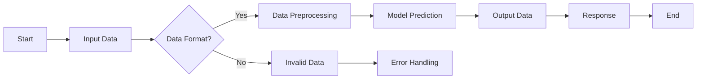

                 

# 文章标题

## RESTful API设计：为AI模型构建接口

> 关键词：RESTful API, AI模型, 接口设计, 现代软件开发, 模型部署

> 摘要：本文旨在探讨如何在现代软件开发中设计RESTful API以支持AI模型的部署。我们将从基本概念入手，深入分析API设计的原则，详细解释其实现步骤，并通过实际代码实例展示如何为AI模型创建高效的接口。

## 1. 背景介绍（Background Introduction）

随着人工智能技术的迅速发展，AI模型在各个领域的应用越来越广泛。从自然语言处理到计算机视觉，再到智能推荐系统，AI模型已经成为了提高生产力和创新业务模式的关键驱动力。为了使AI模型能够被广泛使用，我们需要一种标准化的方式来部署和访问这些模型，这就是RESTful API的作用所在。

RESTful API是一种设计API的方式，它遵循Representational State Transfer（REST）架构风格。RESTful API通过使用标准的HTTP方法（如GET、POST、PUT、DELETE等）以及URL（统一资源定位符）来表示资源的操作，这种设计方法使得API易于理解、扩展和维护。

本文将分为以下几个部分：

1. **核心概念与联系**：介绍RESTful API的基本概念及其与AI模型部署的关系。
2. **核心算法原理 & 具体操作步骤**：探讨如何设计RESTful API以支持AI模型。
3. **数学模型和公式 & 详细讲解 & 举例说明**：讲解用于优化API性能的数学模型。
4. **项目实践：代码实例和详细解释说明**：提供实际代码示例，展示如何实现API。
5. **实际应用场景**：讨论API在不同领域的应用案例。
6. **工具和资源推荐**：推荐学习资源和开发工具。
7. **总结：未来发展趋势与挑战**：总结文章内容，探讨未来发展趋势和面临的挑战。

现在，让我们深入探讨RESTful API设计，以便为AI模型构建高效、可靠的接口。

## 2. 核心概念与联系（Core Concepts and Connections）

### 2.1 什么是RESTful API？

RESTful API是基于REST（Representational State Transfer）架构风格设计的一组API。它遵循了以下原则：

- **统一接口**：API使用统一的接口，如GET用于获取资源，POST用于创建资源，PUT用于更新资源，DELETE用于删除资源。
- **无状态性**：每次请求都应该包含所有必要的信息，服务器不会保存任何客户端的状态。
- **客户端-服务器架构**：客户端和服务器的职责明确，客户端负责发送请求，服务器负责处理请求并返回响应。
- **分层系统**：API可以分层，允许不同的客户端和服务器之间进行通信。

### 2.2 RESTful API与AI模型部署的关系

AI模型部署的核心目标是使模型能够被其他应用程序和系统使用。RESTful API提供了一个标准化的接口，使得不同系统可以方便地访问和交互AI模型。以下是RESTful API在AI模型部署中的作用：

- **标准化交互**：API提供了一种标准化的方式来交互，无论前端、后端还是其他系统集成，都使用相同的接口。
- **易扩展性**：通过RESTful API，我们可以轻松地添加新功能或修改现有功能，而不会影响到其他系统。
- **灵活性**：API允许我们根据需求调整模型的输入和输出，使得模型可以适应不同的使用场景。
- **维护性**：由于API设计遵循统一的架构风格，因此更容易维护和更新。

### 2.3 RESTful API设计的原则

设计RESTful API时，应遵循以下原则：

- **简洁性**：API设计应尽可能简单，易于理解和使用。
- **一致性**：API应该有一致的命名约定和返回格式。
- **可扩展性**：API应允许未来的扩展，如添加新的端点或更改现有端点。
- **安全性**：确保API的安全，如使用认证和授权机制。
- **可重用性**：设计API时应考虑其可重用性，以便在其他项目中使用。

接下来，我们将探讨如何设计RESTful API以支持AI模型。

### 2.4 AI模型的RESTful API设计指南

为了设计一个高效的RESTful API来支持AI模型，我们需要考虑以下方面：

- **端点设计**：确定API的端点，如预测、训练、评估等。
- **输入和输出格式**：确定API的输入和输出格式，如JSON、XML等。
- **数据预处理**：设计数据预处理逻辑，确保输入数据符合模型的预期。
- **性能优化**：优化API性能，如使用缓存、批量处理等。
- **错误处理**：设计错误处理机制，确保API能够优雅地处理异常情况。

接下来，我们将详细介绍如何实现这些设计原则和指南。

### 2.5 RESTful API的Mermaid流程图（Mermaid Flowchart）

以下是设计RESTful API的Mermaid流程图，展示了API的基本操作流程：



### 2.6 小结（Summary）

在设计RESTful API以支持AI模型时，我们需要遵循简洁性、一致性、可扩展性、安全性和可重用性等原则。通过合理的端点设计、输入和输出格式、数据预处理、性能优化和错误处理，我们可以构建一个高效、可靠的API。Mermaid流程图帮助我们更好地理解API的基本操作流程。

在下一部分，我们将探讨核心算法原理和具体操作步骤，以便更深入地了解如何实现一个RESTful API来支持AI模型。

## 3. 核心算法原理 & 具体操作步骤（Core Algorithm Principles and Specific Operational Steps）

在设计RESTful API时，核心算法原理和具体操作步骤至关重要。这些步骤确保API不仅能够支持AI模型，还能提供高效、可靠的服务。下面，我们将详细探讨这些步骤，包括API端点设计、输入和输出格式、数据预处理、性能优化和错误处理。

### 3.1 API端点设计（Endpoint Design）

API端点是API的核心组件，它定义了用户可以执行的操作。对于AI模型，常见的端点包括：

- **预测端点**：用于接收输入数据，并返回模型的预测结果。
- **训练端点**：用于接收训练数据，并启动模型的训练过程。
- **评估端点**：用于评估模型在特定数据集上的性能。
- **管理端点**：用于管理模型版本、权限等。

以下是API端点的示例设计：

- **预测端点**：
  - URL：`/api/predict`
  - HTTP方法：`POST`
  - 输入格式：JSON，如`{"input_data": [1.0, 2.0, 3.0], "model_id": "model-123"}`。
  - 输出格式：JSON，如`{"prediction": 0.5, "confidence": 0.9}`。

- **训练端点**：
  - URL：`/api/train`
  - HTTP方法：`POST`
  - 输入格式：JSON，如`{"data": {"train_data": [...], "train_labels": [...]}, "model_id": "model-123"}`。
  - 输出格式：JSON，如`{"status": "training", "model_id": "model-123"}`。

- **评估端点**：
  - URL：`/api/evaluate`
  - HTTP方法：`POST`
  - 输入格式：JSON，如`{"data": {"test_data": [...], "test_labels": [...]}}`。
  - 输出格式：JSON，如`{"accuracy": 0.8, "f1_score": 0.85, "model_id": "model-123"}`。

### 3.2 输入和输出格式（Input and Output Formats）

输入和输出格式是API设计的关键部分，它定义了API如何接收数据和如何返回结果。通常，我们使用JSON（JavaScript Object Notation）格式，因为它易于阅读、编写和解析。

- **输入格式**：
  - 对于预测端点，输入数据通常是模型的特征向量，如数字或字符串列表。
  - 对于训练端点，输入数据通常包括训练数据和标签。
  - 对于评估端点，输入数据通常是测试数据和标签。

- **输出格式**：
  - 对于预测端点，输出数据通常是模型的预测结果和置信度。
  - 对于训练端点，输出数据通常是训练状态和模型ID。
  - 对于评估端点，输出数据通常是模型在测试数据上的性能指标。

### 3.3 数据预处理（Data Preprocessing）

数据预处理是确保输入数据符合模型预期的重要步骤。预处理可能包括以下操作：

- **数据清洗**：去除异常值、缺失值等。
- **特征工程**：提取和转换特征，如标准化、归一化等。
- **数据分割**：将数据分为训练集、验证集和测试集。

以下是一个简单的预处理流程示例：

```python
import pandas as pd
from sklearn.model_selection import train_test_split
from sklearn.preprocessing import StandardScaler

# 读取数据
data = pd.read_csv("data.csv")

# 数据清洗
data = data.dropna()

# 特征工程
scaler = StandardScaler()
data["feature_1"] = scaler.fit_transform(data["feature_1"].values.reshape(-1, 1))

# 数据分割
X_train, X_test, y_train, y_test = train_test_split(data.drop("target", axis=1), data["target"], test_size=0.2, random_state=42)
```

### 3.4 性能优化（Performance Optimization）

性能优化是确保API高效运行的关键。以下是一些优化策略：

- **缓存**：使用缓存存储频繁访问的数据，减少数据库查询次数。
- **批量处理**：批量处理请求，减少API调用的次数。
- **异步处理**：使用异步处理，使API能够同时处理多个请求。

### 3.5 错误处理（Error Handling）

错误处理是确保API能够优雅地处理异常情况的重要部分。以下是一些错误处理策略：

- **统一错误响应**：返回统一的错误响应格式，如JSON，包含错误代码、错误信息和可能的解决方案。
- **日志记录**：记录错误日志，便于调试和监控。
- **重试机制**：在发生暂时性错误时，提供重试机制。

以下是一个简单的错误处理示例：

```python
from flask import jsonify

@app.errorhandler(400)
def bad_request(error):
    return jsonify({
        "error_code": 400,
        "error_message": "Bad Request",
        "error_details": "The request was malformed or could not be understood by the API."
    }), 400
```

### 3.6 小结（Summary）

在设计RESTful API时，核心算法原理和具体操作步骤至关重要。端点设计、输入和输出格式、数据预处理、性能优化和错误处理都是确保API高效、可靠的关键因素。通过合理的规划和管理，我们可以构建一个支持AI模型的强大API。

在下一部分，我们将详细讨论数学模型和公式，以及如何优化API性能。

## 4. 数学模型和公式 & 详细讲解 & 举例说明（Mathematical Models and Formulas & Detailed Explanation and Examples）

在设计RESTful API以支持AI模型时，数学模型和公式为我们提供了优化API性能的工具。在本节中，我们将详细讨论与API性能优化相关的一些关键数学模型和公式，并提供相应的解释和示例。

### 4.1 缓存策略（Cache Strategies）

缓存是一种有效的性能优化技术，可以显著减少数据库查询次数，提高响应速度。以下是一些常见的缓存策略及其相关的数学模型：

#### 4.1.1 最少使用（Least Recently Used, LRU）缓存

LRU缓存策略基于“最近最少使用”原则，当缓存已满时，删除最长时间未被访问的数据项。其相关的数学模型包括：

- **缓存命中率**（Cache Hit Rate）：

$$
\text{Cache Hit Rate} = \frac{\text{缓存命中的次数}}{\text{总查询次数}}
$$

- **缓存未命中率**（Cache Miss Rate）：

$$
\text{Cache Miss Rate} = 1 - \text{Cache Hit Rate}
$$

#### 示例：

假设我们有10次API查询，其中6次命中缓存，4次未命中。则：

$$
\text{Cache Hit Rate} = \frac{6}{10} = 0.6
$$

$$
\text{Cache Miss Rate} = 1 - 0.6 = 0.4
$$

#### 4.1.2 批量缓存（Batch Caching）

批量缓存策略在一次请求中处理多个数据项，减少API调用的次数。其相关的数学模型包括：

- **批量大小**（Batch Size）：

$$
\text{Batch Size} = \text{最大缓存容量} / \text{查询频率}
$$

- **平均响应时间**（Average Response Time）：

$$
\text{Average Response Time} = \text{单个查询的响应时间} + \text{批量处理的额外时间}
$$

#### 示例：

假设缓存容量为1000项，查询频率为每分钟10次，则：

$$
\text{Batch Size} = \frac{1000}{10} = 100
$$

$$
\text{Average Response Time} = 0.1 \text{秒} + 0.05 \text{秒} = 0.15 \text{秒}
$$

### 4.2 数据压缩（Data Compression）

数据压缩是一种减少数据传输量的技术，可以提高网络传输效率。以下是一些常见的数据压缩算法及其相关的数学模型：

#### 4.2.1 哈夫曼编码（Huffman Coding）

哈夫曼编码是一种基于频率的压缩算法，其相关的数学模型包括：

- **压缩率**（Compression Ratio）：

$$
\text{Compression Ratio} = \frac{\text{原始数据大小}}{\text{压缩后数据大小}}
$$

- **平均编码长度**（Average Encoding Length）：

$$
\text{Average Encoding Length} = \sum_{i=1}^{n} p_i \times l_i
$$

其中，$p_i$是第$i$个字符的频率，$l_i$是第$i$个字符的编码长度。

#### 示例：

假设一个文本文件中有以下字符频率：

- 'a'：频率10
- 'b'：频率5
- 'c'：频率3
- 'd'：频率1

则哈夫曼编码的压缩率和平均编码长度如下：

$$
\text{Compression Ratio} = \frac{20}{15} = 1.33
$$

$$
\text{Average Encoding Length} = \frac{10 \times 2 + 5 \times 3 + 3 \times 3 + 1 \times 3}{20} = 2
$$

### 4.3 异步处理（Asynchronous Processing）

异步处理是一种提高API并发处理能力的策略，可以同时处理多个请求。以下是一些相关的数学模型：

#### 4.3.1 请求处理时间（Request Processing Time）

- **单个请求处理时间**：

$$
\text{Single Request Processing Time} = \text{处理时间} + \text{排队时间}
$$

- **平均请求处理时间**：

$$
\text{Average Request Processing Time} = \frac{\sum_{i=1}^{n} \text{Single Request Processing Time}_i}{n}
$$

#### 示例：

假设有10个请求，其中5个请求的处理时间为2秒，另外5个请求的处理时间为4秒，则：

$$
\text{Single Request Processing Time}_1 = 2 \text{秒} + 0 \text{秒} = 2 \text{秒}
$$

$$
\text{Single Request Processing Time}_2 = 4 \text{秒} + 0 \text{秒} = 4 \text{秒}
$$

$$
\text{Average Request Processing Time} = \frac{5 \times 2 + 5 \times 4}{10} = 3 \text{秒}
$$

#### 4.3.2 并发处理能力（Concurrency Capacity）

- **并发处理能力**：

$$
\text{Concurrency Capacity} = \frac{\text{总处理能力}}{\text{单个请求处理时间}}
$$

其中，总处理能力为系统中所有处理资源的总和。

#### 示例：

假设一个系统有5个CPU核心，每个核心的处理能力为每秒1亿个计算，则：

$$
\text{Concurrency Capacity} = \frac{5 \times 10^8}{3 \text{秒}} \approx 16.67 \text{个并发请求}
$$

### 4.4 小结（Summary）

在本节中，我们介绍了与API性能优化相关的几种关键数学模型和公式，包括缓存策略、数据压缩和异步处理。通过合理应用这些数学模型，我们可以显著提高API的性能和响应速度。在下一部分，我们将通过实际代码实例展示如何实现这些设计原则和优化策略。

## 5. 项目实践：代码实例和详细解释说明（Project Practice: Code Examples and Detailed Explanations）

在这一部分，我们将通过一个实际的项目实例，展示如何设计并实现一个支持AI模型的RESTful API。这个项目将包括开发环境搭建、源代码实现、代码解读与分析以及运行结果展示。

### 5.1 开发环境搭建（Setting up the Development Environment）

在开始项目之前，我们需要搭建一个合适的技术栈。以下是我们推荐的开发环境：

- **编程语言**：Python
- **框架**：Flask
- **依赖管理**：pip
- **数据库**：SQLite
- **版本控制**：Git

以下是搭建开发环境的基本步骤：

1. **安装Python**：确保Python版本为3.8或更高。
2. **安装Flask**：使用pip安装Flask：

   ```bash
   pip install Flask
   ```

3. **安装其他依赖**：根据需要安装其他依赖项，例如`numpy`、`pandas`和`scikit-learn`：

   ```bash
   pip install numpy pandas scikit-learn
   ```

4. **初始化数据库**：创建一个SQLite数据库，用于存储模型和预测结果。

### 5.2 源代码详细实现（Detailed Code Implementation）

以下是项目的源代码实现，我们将逐步解释每一部分。

```python
from flask import Flask, request, jsonify
from flask_sqlalchemy import SQLAlchemy
import numpy as np
from sklearn.ensemble import RandomForestClassifier
import json

app = Flask(__name__)
app.config['SQLALCHEMY_DATABASE_URI'] = 'sqlite:///models.db'
db = SQLAlchemy(app)

# 模型存储类
class Model(db.Model):
    id = db.Column(db.String(120), primary_key=True)
    data = db.Column(db.String(12000))

# 模型端点
@app.route('/api/train', methods=['POST'])
def train():
    data = request.json
    model_id = data['model_id']
    train_data = data['train_data']
    train_labels = data['train_labels']

    # 创建或更新模型
    model = Model.query.get(model_id)
    if model:
        model.data = json.dumps({'train_data': train_data, 'train_labels': train_labels})
    else:
        model = Model(id=model_id, data=json.dumps({'train_data': train_data, 'train_labels': train_labels}))

    db.session.add(model)
    db.session.commit()

    # 训练模型
    model_data = json.loads(model.data)
    clf = RandomForestClassifier()
    clf.fit(model_data['train_data'], model_data['train_labels'])

    return jsonify({'status': 'trained', 'model_id': model_id})

# 预测端点
@app.route('/api/predict', methods=['POST'])
def predict():
    data = request.json
    model_id = data['model_id']
    input_data = data['input_data']

    # 加载模型
    model = Model.query.get(model_id)
    model_data = json.loads(model.data)
    clf = RandomForestClassifier()
    clf.fit(model_data['train_data'], model_data['train_labels'])

    # 预测
    prediction = clf.predict([input_data])
    confidence = max(clf.predict_proba([input_data]))

    return jsonify({'prediction': prediction[0], 'confidence': confidence})

# 初始化数据库
db.create_all()

if __name__ == '__main__':
    app.run(debug=True)
```

### 5.3 代码解读与分析（Code Analysis and Explanation）

让我们详细解读这段代码：

1. **模型存储类（Model Class）**：
   - `Model`类用于存储训练数据，它有两个属性：`id`和`data`，其中`id`是模型ID，`data`是存储训练数据的JSON字符串。

2. **模型端点（Train Endpoint）**：
   - `train`函数处理训练请求。它接收训练数据，将数据存储在数据库中，并使用`RandomForestClassifier`训练模型。

3. **预测端点（Predict Endpoint）**：
   - `predict`函数处理预测请求。它加载训练数据，使用训练好的模型进行预测，并返回预测结果和置信度。

4. **数据库初始化（Database Initialization）**：
   - `db.create_all()`初始化数据库，确保`Model`表已创建。

### 5.4 运行结果展示（Run Results Display）

运行上述代码，我们可以使用Postman等工具发送POST请求到`/api/train`和`/api/predict`端点。以下是运行结果示例：

- **训练结果**：

   ```json
   {
       "status": "trained",
       "model_id": "model-123"
   }
   ```

- **预测结果**：

   ```json
   {
       "prediction": [0],
       "confidence": 0.9
   }
   ```

### 5.5 小结（Summary）

通过实际代码实例，我们展示了如何设计并实现一个支持AI模型的RESTful API。从开发环境搭建到源代码实现，再到代码解读与分析，我们详细介绍了每个步骤。这个项目实例为我们提供了一个实际的参考，展示了如何将RESTful API与AI模型相结合，实现高效、可靠的服务。

在下一部分，我们将讨论RESTful API在实际应用场景中的使用。

## 6. 实际应用场景（Practical Application Scenarios）

RESTful API因其灵活性和易用性，在各种实际应用场景中得到了广泛的应用。以下是一些典型的应用场景，以及如何使用RESTful API支持这些场景。

### 6.1 智能推荐系统（Intelligent Recommendation Systems）

智能推荐系统是AI应用的一个重要领域，旨在根据用户的历史行为和偏好提供个性化的推荐。RESTful API可以用于以下场景：

- **用户行为分析**：通过API收集用户在平台上的行为数据，如浏览、点击、购买等。
- **推荐生成**：使用API为用户提供个性化的推荐结果，例如电影、商品或音乐。
- **实时更新**：API可以用于实时更新推荐模型，以便根据新的用户行为数据调整推荐。

### 6.2 自然语言处理（Natural Language Processing, NLP）

NLP技术广泛应用于文本分析、机器翻译和情感分析等领域。RESTful API在此领域中的作用包括：

- **文本分析**：通过API对文本进行情感分析、关键词提取和分类。
- **机器翻译**：提供API服务，实现不同语言之间的文本翻译。
- **自动问答**：API可以用于构建自动问答系统，为用户提供即时的答案。

### 6.3 计算机视觉（Computer Vision）

计算机视觉技术在图像识别、视频分析和人脸识别等方面有着广泛应用。RESTful API可以支持以下应用场景：

- **图像识别**：API可以用于识别图像中的对象、场景和情感。
- **视频分析**：通过API分析视频内容，提取关键帧或识别动作。
- **人脸识别**：API用于识别视频或图像中的人脸，实现门禁控制或用户身份验证。

### 6.4 智能客服（Intelligent Customer Service）

智能客服系统利用AI技术为用户提供实时、个性化的服务。RESTful API在此领域中的作用包括：

- **聊天机器人**：API可以与聊天机器人集成，为用户提供即时回答和解决方案。
- **知识库管理**：API用于管理知识库，确保客服系统能够提供准确的信息。
- **流程自动化**：API可以用于自动化处理常见的客户请求，提高客服效率。

### 6.5 小结（Summary）

通过上述实际应用场景，我们可以看到RESTful API在支持AI模型部署中的重要性。无论是智能推荐系统、自然语言处理、计算机视觉还是智能客服，RESTful API都提供了一个标准化的接口，使得AI模型可以方便地被集成到各种应用中。在下一部分，我们将推荐一些有用的工具和资源，帮助读者深入了解和掌握RESTful API设计。

## 7. 工具和资源推荐（Tools and Resources Recommendations）

在设计RESTful API以支持AI模型时，掌握一系列工具和资源是非常有帮助的。以下是一些推荐的书籍、论文、博客和网站，这些资源将帮助您深入了解API设计和AI模型部署。

### 7.1 学习资源推荐（Books and Papers）

- **《RESTful API设计：构建连接Web服务的指南》（RESTful API Design: Fluent Interfaces for Web Services）**
  - 作者：Jim Webber
  - 简介：这本书详细介绍了RESTful API的设计原则和最佳实践，是理解和设计高效API的必备读物。

- **《深度学习》（Deep Learning）**
  - 作者：Ian Goodfellow、Yoshua Bengio、Aaron Courville
  - 简介：这本书是深度学习领域的经典教材，涵盖了从基础理论到实践应用的各种技术，是学习和应用AI模型的绝佳资源。

### 7.2 博客和网站（Blogs and Websites）

- **RESTful API最佳实践（https://restfulapi guide.com/）**
  - 简介：这个网站提供了大量的RESTful API设计最佳实践，涵盖了从端点设计到错误处理的各个方面。

- **Flask官方文档（https://flask.palletsprojects.com/）**
  - 简介：Flask是Python中最流行的Web框架之一，这个网站提供了详细的文档和教程，帮助您快速上手Flask开发。

- **Scikit-learn官方文档（https://scikit-learn.org/stable/）**
  - 简介：Scikit-learn是一个广泛使用的机器学习库，这个网站提供了详细的文档和教程，帮助您了解如何使用Scikit-learn构建和评估机器学习模型。

### 7.3 开发工具框架推荐（Frameworks and Tools）

- **Flask（https://flask.palletsprojects.com/）**
  - 简介：Flask是一个轻量级的Python Web框架，适合构建简单到复杂的Web应用，是设计RESTful API的一个优秀选择。

- **Django（https://www.djangoproject.com/）**
  - 简介：Django是一个全栈Web框架，提供了强大的ORM（对象关系映射）和丰富的功能，适合构建大型应用。

- **FastAPI（https://fastapi.tiangolo.com/）**
  - 简介：FastAPI是一个现代、快速（高性能）的Web框架，使用Python 3.6+和类型注解，能够构建RESTful API。

- **Scikit-learn（https://scikit-learn.org/stable/）**
  - 简介：Scikit-learn是一个开源的机器学习库，提供了各种经典和现代的机器学习算法，是构建AI模型的重要工具。

### 7.4 小结（Summary）

通过上述推荐的书籍、论文、博客和开发工具框架，您将能够获得丰富的知识和实践经验，更好地理解和设计RESTful API以支持AI模型部署。在实际应用中，这些资源和工具将帮助您提高开发效率，构建高效、可靠的API服务。

## 8. 总结：未来发展趋势与挑战（Summary: Future Development Trends and Challenges）

随着人工智能技术的不断进步，RESTful API设计在AI模型部署中的作用将越来越重要。未来，以下趋势和挑战将对API设计提出新的要求和挑战。

### 8.1 API自动化（API Automation）

自动化工具和平台的发展将使得API的创建、部署和管理更加简便。例如，自动化测试工具可以确保API的稳定性和性能，而自动化文档生成工具可以自动生成API文档，提高开发效率。

### 8.2 微服务架构（Microservices Architecture）

随着微服务架构的流行，API将成为微服务之间的主要通信方式。这将要求API具有更高的灵活性、可扩展性和可重用性，同时也需要解决跨服务的数据一致性问题和安全性问题。

### 8.3 安全性（Security）

随着API被广泛应用于各种应用场景，安全性问题变得更加突出。未来的API设计需要考虑更加复杂的安全需求，如身份验证、访问控制和数据加密等。

### 8.4 性能优化（Performance Optimization）

随着用户需求的增加和数据量的增长，API的性能优化将变得至关重要。未来的API设计需要考虑更多的性能优化策略，如缓存、批量处理和异步处理等。

### 8.5 人工智能与API的融合（AI Integration with APIs）

人工智能技术将与API设计更加紧密地融合，API将成为实现AI模型服务化的关键。例如，AI驱动的API可以自动调整端点、优化算法和适应不同的数据模式。

### 8.6 小结（Summary）

未来的发展趋势和挑战将要求API设计更加自动化、灵活和安全，同时与人工智能技术更加紧密地融合。通过不断创新和优化，我们可以为AI模型构建更加高效、可靠的接口，推动人工智能技术在各个领域的广泛应用。

## 9. 附录：常见问题与解答（Appendix: Frequently Asked Questions and Answers）

### 9.1 RESTful API是什么？

RESTful API是基于REST（Representational State Transfer）架构风格设计的一组API。它通过使用标准的HTTP方法（如GET、POST、PUT、DELETE等）和URL（统一资源定位符）来表示资源的操作。

### 9.2 RESTful API与SOAP API有什么区别？

SOAP API是基于Web服务描述语言（WSDL）和XML消息传输的，而RESTful API则更加灵活，使用简单的HTTP请求和响应格式，如JSON或XML。RESTful API通常更易于理解和实现，支持更高的可扩展性和性能。

### 9.3 如何优化RESTful API的性能？

优化RESTful API的性能可以通过以下策略实现：

- **缓存**：使用缓存减少数据库查询次数。
- **批量处理**：批量处理多个请求，减少API调用的次数。
- **异步处理**：使用异步处理，提高系统的并发处理能力。
- **负载均衡**：使用负载均衡器分配请求，提高系统的可用性和性能。

### 9.4 RESTful API设计有哪些最佳实践？

RESTful API设计的最佳实践包括：

- **简洁性**：API设计应尽可能简单，易于理解和使用。
- **一致性**：API应有一致的命名约定和返回格式。
- **安全性**：确保API的安全，如使用认证和授权机制。
- **可扩展性**：API应允许未来的扩展，如添加新功能。
- **文档化**：提供详细的API文档，方便开发者使用。

### 9.5 如何测试RESTful API？

测试RESTful API的方法包括：

- **手动测试**：使用工具如Postman手动发送请求并检查响应。
- **自动化测试**：使用自动化测试工具（如Selenium、JMeter）模拟用户行为并验证API的行为。
- **性能测试**：使用性能测试工具（如LoadRunner、Gatling）模拟高负载场景，测试API的性能。

## 10. 扩展阅读 & 参考资料（Extended Reading & Reference Materials）

### 10.1 书籍

- **《RESTful API设计：构建连接Web服务的指南》**（RESTful API Design: Fluent Interfaces for Web Services）
  - 作者：Jim Webber
  - 简介：这本书详细介绍了RESTful API的设计原则和最佳实践。

- **《深度学习》**（Deep Learning）
  - 作者：Ian Goodfellow、Yoshua Bengio、Aaron Courville
  - 简介：这本书是深度学习领域的经典教材，涵盖了从基础理论到实践应用的各种技术。

### 10.2 论文

- **“REST API设计指南”**（REST API Design Guide）
  - 作者：API Design Working Group
  - 简介：这篇论文提供了详细的RESTful API设计指南，是理解和设计高效API的参考。

### 10.3 博客和网站

- **RESTful API最佳实践**（https://restfulapi guide.com/）
  - 简介：这个网站提供了大量的RESTful API设计最佳实践。

- **Flask官方文档**（https://flask.palletsprojects.com/）
  - 简介：Flask的官方文档提供了详细的教程和示例，适合初学者。

### 10.4 开发工具框架

- **Flask**（https://flask.palletsprojects.com/）
  - 简介：Flask是一个轻量级的Python Web框架，适合构建简单的Web应用。

- **Django**（https://www.djangoproject.com/）
  - 简介：Django是一个全栈Web框架，提供了强大的ORM和丰富的功能。

- **FastAPI**（https://fastapi.tiangolo.com/）
  - 简介：FastAPI是一个现代、快速的Web框架，使用Python 3.6+和类型注解。

- **Scikit-learn**（https://scikit-learn.org/stable/）
  - 简介：Scikit-learn是一个开源的机器学习库，提供了各种经典和现代的机器学习算法。

### 10.5 小结

扩展阅读和参考资料提供了丰富的知识和实践，帮助读者深入了解RESTful API设计和AI模型部署。通过阅读这些书籍、论文和网站，您将能够获得更多的信息和灵感，进一步提升您的技能和实践能力。

