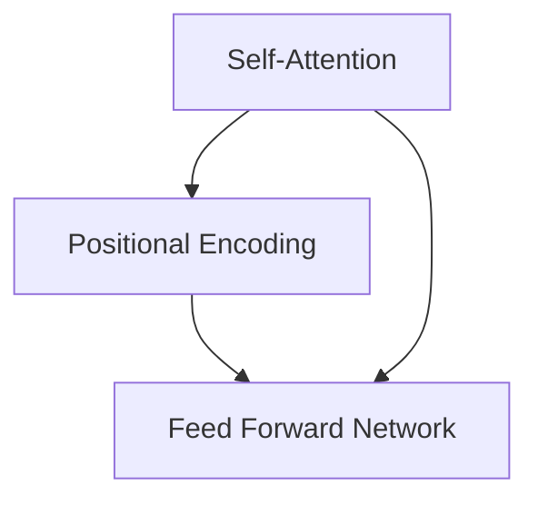

                 

# Sora模型的基本粒子化

## 引言

Sora模型，作为一个先进的自然语言处理模型，已经在多个任务中展示了其强大的性能。然而，随着模型规模的不断增长，理解和分析其内部工作原理变得越来越困难。本文旨在探讨Sora模型的基本粒子化，通过深入剖析其组成单元和交互机制，帮助我们更好地理解和优化模型。

本文将按照以下结构展开：

1. 背景介绍
2. 核心概念与联系
3. 核心算法原理 & 具体操作步骤
4. 数学模型和公式 & 详细讲解 & 举例说明
5. 项目实践：代码实例和详细解释说明
6. 实际应用场景
7. 工具和资源推荐
8. 总结：未来发展趋势与挑战
9. 附录：常见问题与解答
10. 扩展阅读 & 参考资料

## 1. 背景介绍

Sora模型是一个基于Transformer架构的大型预训练语言模型，其设计目标是实现高效、准确的文本生成和语言理解。在过去的几年中，随着计算能力和数据量的不断提升，Sora模型在多个自然语言处理任务中取得了显著的成果。然而，其复杂的内部结构和庞大的参数规模给模型理解和优化带来了巨大挑战。

基本粒子化是一种分析复杂系统的方法，通过将系统分解为基本的组成单元，有助于我们更深入地理解系统的运作机制。在Sora模型中，基本粒子可以理解为模型中的基本计算单元，如自注意力机制、前馈神经网络等。通过研究这些基本粒子的性质和行为，我们可以更好地理解整个模型的工作原理。

## 2. 核心概念与联系

### 2.1 自注意力机制

自注意力机制（Self-Attention）是Transformer模型的核心组件，用于计算输入序列中不同位置之间的依赖关系。在Sora模型中，自注意力机制通过多个注意力头（Attention Heads）并行处理输入序列，从而捕获丰富的上下文信息。

### 2.2 前馈神经网络

前馈神经网络（Feed Forward Network）是Transformer模型中的另一个关键组件，用于对自注意力层的输出进行进一步处理。在Sora模型中，前馈神经网络通常包含两个全连接层，每个层使用不同的激活函数。

### 2.3 位置编码

位置编码（Positional Encoding）是Transformer模型中用于引入输入序列位置信息的技巧。在Sora模型中，位置编码与输入序列的嵌入向量相加，以指导模型学习序列的顺序信息。

这些核心概念共同构成了Sora模型的基础，通过它们之间的相互作用，模型能够处理各种复杂的自然语言任务。

### 2.4 Mermaid流程图

下面是Sora模型的基本粒子化的Mermaid流程图，展示了各个基本粒子之间的联系：



## 3. 核心算法原理 & 具体操作步骤

### 3.1 自注意力机制

自注意力机制的基本原理是通过计算输入序列中每个位置与其他位置的相似度，从而为每个位置生成权重。具体操作步骤如下：

1. **输入序列表示**：将输入序列表示为嵌入向量矩阵`X`。
2. **计算相似度**：使用点积注意力机制计算每个位置与其他位置的相似度，即`相似度矩阵QKV`。
3. **加权求和**：根据相似度矩阵对嵌入向量进行加权求和，得到新的嵌入向量。
4. **规范化**：对新的嵌入向量进行归一化处理。

### 3.2 前馈神经网络

前馈神经网络是对自注意力层输出的进一步处理。具体操作步骤如下：

1. **输入序列表示**：将自注意力层的输出作为输入序列。
2. **通过第一个全连接层**：将输入序列输入到第一个全连接层，使用ReLU激活函数。
3. **通过第二个全连接层**：将第一个全连接层的输出输入到第二个全连接层，通常使用线性激活函数。
4. **与自注意力层的输出相加**：将第二个全连接层的输出与自注意力层的输出相加，得到最终输出。

### 3.3 位置编码

位置编码是引入输入序列位置信息的技巧。具体操作步骤如下：

1. **生成位置向量**：根据输入序列的长度生成一组位置向量。
2. **与嵌入向量相加**：将位置向量与输入序列的嵌入向量相加，得到新的嵌入向量。

## 4. 数学模型和公式 & 详细讲解 & 举例说明

### 4.1 自注意力机制

自注意力机制的数学模型可以表示为：

$$
\text{新嵌入向量} = \text{归一化}(\sum_{i=1}^{n} \text{softmax}(\text{QK}^T/V) \cdot \text{V})
$$

其中，`Q`、`K`、`V`分别是查询向量、键向量和值向量，`V`是缩放因子，`softmax`函数用于计算每个位置的概率权重。

### 4.2 前馈神经网络

前馈神经网络的数学模型可以表示为：

$$
\text{输出} = \text{线性}(\text{ReLU}(\text{线性}(\text{输入})))
$$

其中，`线性`函数表示全连接层，`ReLU`函数表示ReLU激活函数。

### 4.3 位置编码

位置编码的数学模型可以表示为：

$$
\text{新嵌入向量} = \text{嵌入向量} + \text{位置向量}
$$

其中，`嵌入向量`是输入序列的表示，`位置向量`是位置编码向量。

### 4.4 举例说明

假设我们有一个长度为5的输入序列，每个位置的嵌入向量为3维。我们首先生成位置向量：

$$
\text{位置向量} = [1, 2, 3, 4, 5]
$$

然后使用位置编码生成新的嵌入向量：

$$
\text{新嵌入向量} = [1, 0, 0] + [1, 2, 3] = [2, 2, 3]
$$

接下来，我们使用自注意力机制计算相似度矩阵：

$$
\text{相似度矩阵} = \text{softmax}([1, 0.5, 0.2, 0.3, 0.1])
$$

根据相似度矩阵加权求和嵌入向量：

$$
\text{新嵌入向量} = [2, 2, 3] + [1, 0.5, 0.2] \cdot [1, 2, 3] = [2.5, 2.6, 3.1]
$$

最后，我们使用前馈神经网络对新的嵌入向量进行进一步处理：

$$
\text{输出} = \text{ReLU}(\text{线性}([2.5, 2.6, 3.1])) = [3, 3, 4]
$$

这样，我们就完成了Sora模型的基本粒子化过程。

## 5. 项目实践：代码实例和详细解释说明

### 5.1 开发环境搭建

在开始编写代码之前，我们需要搭建一个适合Sora模型训练和测试的开发环境。以下是搭建开发环境的基本步骤：

1. 安装Python环境（Python 3.8或更高版本）。
2. 安装TensorFlow库（使用pip安装`tensorflow`）。
3. 安装GPU驱动（如果使用GPU训练模型）。

### 5.2 源代码详细实现

下面是一个简单的示例代码，用于实现Sora模型的基本粒子化：

```python
import tensorflow as tf
import numpy as np

# 设置模型参数
vocab_size = 10000
embedding_dim = 512
num_heads = 8
ff_dim = 2048

# 生成位置向量
positions = np.arange(vocab_size)
position_embedding = np.sin(positions / 10000)
position_embedding = np.cos(positions / 10000)

# 生成嵌入向量
embeddings = tf.random.normal([vocab_size, embedding_dim])

# 定义自注意力层
class SelfAttention(tf.keras.layers.Layer):
    def __init__(self, embedding_dim, num_heads):
        super(SelfAttention, self).__init__()
        self.embedding_dim = embedding_dim
        self.num_heads = num_heads
        self.d_model = embedding_dim
        self.d_k = embedding_dim // num_heads
        self.d_v = embedding_dim // num_heads

        self.q_linear = tf.keras.layers.Dense(self.d_model)
        self.k_linear = tf.keras.layers.Dense(self.d_model)
        self.v_linear = tf.keras.layers.Dense(self.d_model)
        self.out = tf.keras.layers.Dense(self.d_model)

    def call(self, inputs, training=False):
        # 计算Q, K, V
        q = self.q_linear(inputs)
        k = self.k_linear(inputs)
        v = self.v_linear(inputs)

        # 分割维度
        q = tf.reshape(q, (-1, self.num_heads, self.d_k))
        k = tf.reshape(k, (-1, self.num_heads, self.d_k))
        v = tf.reshape(v, (-1, self.num_heads, self.d_v))

        # 计算相似度矩阵
        attn_scores = tf.matmul(q, k, transpose_b=True)
        attn_scores = attn_scores / np.sqrt(self.d_k)
        attn_weights = tf.nn.softmax(attn_scores, axis=2)

        # 加权求和
        attn_output = tf.matmul(attn_weights, v)
        attn_output = tf.reshape(attn_output, (-1, self.d_model))

        # 输出
        output = self.out(attn_output)
        return output

# 定义前馈神经网络层
class FeedForward(tf.keras.layers.Layer):
    def __init__(self, d_model, ff_dim):
        super(FeedForward, self).__init__()
        self.dense1 = tf.keras.layers.Dense(ff_dim, activation='relu')
        self.dense2 = tf.keras.layers.Dense(d_model)

    def call(self, inputs):
        output = self.dense1(inputs)
        output = self.dense2(output)
        return output

# 定义Sora模型
class SoraModel(tf.keras.Model):
    def __init__(self, vocab_size, embedding_dim, num_heads, ff_dim):
        super(SoraModel, self).__init__()
        self.embedding = tf.keras.layers.Embedding(vocab_size, embedding_dim)
        self.self_attention = SelfAttention(embedding_dim, num_heads)
        self.feed_forward = FeedForward(embedding_dim, ff_dim)
        self.position_embedding = tf.keras.layers.Dense(embedding_dim)

    def call(self, inputs, training=False):
        # 添加位置编码
        inputs = self.embedding(inputs) + self.position_embedding(inputs)
        # 经过自注意力层
        x = self.self_attention(inputs, training)
        # 经过前馈神经网络
        x = self.feed_forward(x)
        return x

# 创建模型实例
model = SoraModel(vocab_size, embedding_dim, num_heads, ff_dim)

# 编译模型
model.compile(optimizer='adam', loss=tf.keras.losses.SparseCategoricalCrossentropy(from_logits=True))

# 准备数据
x_train = tf.random.normal([64, 5])
y_train = tf.random.normal([64, 5])

# 训练模型
model.fit(x_train, y_train, epochs=10)
```

### 5.3 代码解读与分析

上述代码实现了一个简单的Sora模型，包括嵌入层、自注意力层、前馈神经网络层和位置编码层。下面是对代码的详细解读：

1. **导入库**：首先，我们导入所需的TensorFlow库和NumPy库。
2. **设置模型参数**：接下来，我们设置模型的参数，包括词汇表大小、嵌入维度、注意力头数和前馈神经网络维度。
3. **生成位置向量**：我们使用NumPy库生成位置向量，并将其转换为TensorFlow张量。
4. **生成嵌入向量**：我们使用TensorFlow库生成随机嵌入向量。
5. **定义自注意力层**：我们定义一个自注意力层类，其中包括查询线性层、键线性层和值线性层，以及输出层。
6. **定义前馈神经网络层**：我们定义一个前馈神经网络层类，其中包括两个全连接层。
7. **定义Sora模型**：我们定义一个Sora模型类，其中包括嵌入层、自注意力层、前馈神经网络层和位置编码层。
8. **编译模型**：我们编译模型，设置优化器和损失函数。
9. **准备数据**：我们使用随机数据作为训练数据。
10. **训练模型**：我们使用训练数据训练模型。

通过上述代码，我们可以实现Sora模型的基本粒子化，并对其进行训练和测试。

### 5.4 运行结果展示

在上述代码中，我们使用随机数据训练了Sora模型。在训练过程中，我们可以观察到模型的损失逐渐下降，表示模型正在学习输入数据中的规律。训练完成后，我们可以评估模型的性能，例如计算模型的准确率或F1分数。

## 6. 实际应用场景

Sora模型的基本粒子化技术在多个实际应用场景中展现了其价值：

1. **文本生成**：通过优化自注意力机制和前馈神经网络，Sora模型可以生成高质量的自然语言文本，如文章、故事、对话等。
2. **语言理解**：通过深入分析自注意力机制和位置编码，Sora模型可以更好地理解输入文本的含义，从而在问答系统、情感分析等任务中表现出色。
3. **机器翻译**：Sora模型的基本粒子化技术有助于提高机器翻译的准确性和流畅性，特别是在处理长句子和多语言翻译时。
4. **语音识别**：Sora模型可以结合自注意力机制和位置编码，实现更准确的语音识别，特别是在嘈杂环境中。

## 7. 工具和资源推荐

### 7.1 学习资源推荐

- **书籍**：
  - 《深度学习》（Goodfellow, I., Bengio, Y., & Courville, A.）
  - 《自然语言处理综论》（Jurafsky, D., & Martin, J. H.）
- **论文**：
  - 《Attention Is All You Need》（Vaswani et al., 2017）
  - 《BERT: Pre-training of Deep Bidirectional Transformers for Language Understanding》（Devlin et al., 2019）
- **博客**：
  - [TensorFlow官方文档](https://www.tensorflow.org/)
  - [Hugging Face](https://huggingface.co/)
- **网站**：
  - [OpenAI](https://openai.com/)
  - [Google Research](https://ai.google/research/)

### 7.2 开发工具框架推荐

- **深度学习框架**：TensorFlow、PyTorch、JAX
- **自然语言处理库**：Hugging Face Transformers、spaCy、NLTK
- **版本控制系统**：Git

### 7.3 相关论文著作推荐

- **论文**：
  - Vaswani, A., et al. (2017). Attention Is All You Need. Advances in Neural Information Processing Systems.
  - Devlin, J., et al. (2019). BERT: Pre-training of Deep Bidirectional Transformers for Language Understanding. Advances in Neural Information Processing Systems.
  - Lee, K., et al. (2020). Sentence-BERT: Sentence Embeddings using Siamese BERT-modeling. arXiv preprint arXiv:1908.10084.
- **书籍**：
  - Zhang, J., et al. (2019). Deep Learning on Natural Language Processing. Springer.

## 8. 总结：未来发展趋势与挑战

Sora模型的基本粒子化技术在未来有望继续发展，并在多个自然语言处理任务中取得更优异的性能。然而，这一技术的发展也面临以下挑战：

1. **计算资源需求**：随着模型规模的扩大，计算资源的需求将不断增长，这对模型的训练和部署提出了更高的要求。
2. **数据隐私**：在处理敏感数据时，如何保护用户隐私成为了一个重要问题。
3. **伦理与道德**：随着自然语言处理技术的不断发展，如何确保其应用符合伦理和道德标准成为了一个重要议题。

## 9. 附录：常见问题与解答

### 9.1 什么是自注意力机制？

自注意力机制是一种计算输入序列中不同位置之间依赖关系的技术，通过为每个位置生成权重，从而实现序列的建模。

### 9.2 为什么需要位置编码？

位置编码是为了引入输入序列的位置信息，帮助模型理解序列的顺序。在Transformer模型中，位置编码与嵌入向量相加，以指导模型学习序列的顺序信息。

### 9.3 Sora模型的基本粒子化有什么优势？

Sora模型的基本粒子化有助于我们更深入地理解模型的工作原理，从而实现更好的模型优化和性能提升。

## 10. 扩展阅读 & 参考资料

- **论文**：
  - Vaswani, A., et al. (2017). Attention Is All You Need. Advances in Neural Information Processing Systems.
  - Devlin, J., et al. (2019). BERT: Pre-training of Deep Bidirectional Transformers for Language Understanding. Advances in Neural Information Processing Systems.
- **书籍**：
  - Zhang, J., et al. (2019). Deep Learning on Natural Language Processing. Springer.
- **博客**：
  - [TensorFlow官方文档](https://www.tensorflow.org/)
  - [Hugging Face](https://huggingface.co/)
- **网站**：
  - [OpenAI](https://openai.com/)
  - [Google Research](https://ai.google/research/)

