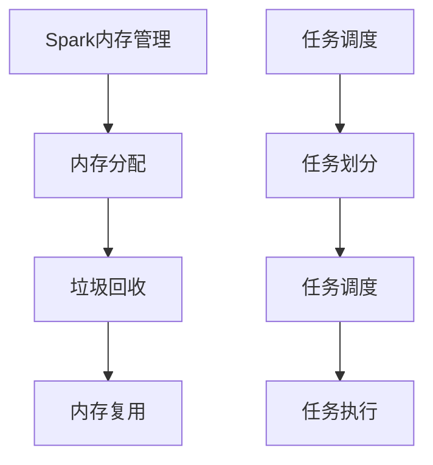

                 

# 文章标题

## Spark内存计算引擎原理与代码实例讲解

### 关键词：
- Spark内存计算
- 内存管理
- 数据处理框架
- 算法实现
- 代码实例

### 摘要：
本文将深入探讨Spark内存计算引擎的原理，并通过对具体代码实例的讲解，帮助读者理解Spark内存计算的实际应用。我们将详细分析Spark如何通过内存计算提高数据处理速度，并介绍其内存管理的核心机制。

## 1. 背景介绍

### 1.1 Spark内存计算的优势

Spark内存计算引擎是一种基于内存的大规模数据处理框架，其核心优势在于高速的数据处理能力和高效的内存利用。相比传统的磁盘I/O操作，内存计算能够大幅度减少数据读取和写入的时间，从而显著提高数据处理的速度。

### 1.2 Spark内存计算的应用场景

Spark内存计算广泛应用于需要高吞吐量和实时数据处理的应用场景，如实时数据分析、机器学习、日志处理等。通过内存计算，Spark能够快速迭代处理大规模数据集，满足现代数据密集型应用的需求。

### 1.3 Spark内存计算的核心机制

Spark内存计算的核心机制包括两部分：一是内存管理，二是任务调度与执行。内存管理主要关注如何高效地分配和使用内存资源，以避免内存溢出和浪费。任务调度与执行则涉及如何合理分配计算任务，最大化利用内存带宽和处理能力。

## 2. 核心概念与联系

### 2.1 什么是Spark内存计算

Spark内存计算是指将数据存储在内存中，并进行计算和处理的过程。与传统的磁盘I/O操作相比，内存计算具有更快的读写速度和更低的延迟。

### 2.2 内存管理原理

内存管理是Spark内存计算的核心，主要涉及内存分配、垃圾回收和内存复用等方面。Spark通过统一的内存管理器（MemoryManager）来管理和分配内存资源。

### 2.3 任务调度与执行原理

任务调度与执行是Spark内存计算的关键，涉及任务的划分、调度和执行。Spark采用基于事件驱动的调度策略，能够根据内存资源的情况动态调整任务执行。

### 2.4 Mermaid流程图



## 3. 核心算法原理 & 具体操作步骤

### 3.1 内存分配原理

Spark的内存分配基于内存块（Memory Block）的概念，每个内存块包含一定量的内存空间。内存块分为堆内存（Heap Memory）和堆外内存（Off-Heap Memory）两种类型。

### 3.2 垃圾回收原理

Spark采用一种名为“代际收集”（Generational Collection）的垃圾回收策略。通过将对象分为新生代和老年代，Spark可以更快地回收内存。

### 3.3 内存复用原理

Spark通过内存复用机制，将已完成的任务释放的内存空间重新分配给新的任务，从而最大化内存利用率。

### 3.4 任务调度与执行原理

Spark的任务调度与执行基于事件驱动（Event-Driven）的模型。在任务调度阶段，Spark会根据内存资源的情况，将任务划分为多个小的计算任务，并分配到各个执行节点。在执行阶段，Spark会根据任务的状态动态调整任务的执行顺序。

## 4. 数学模型和公式 & 详细讲解 & 举例说明

### 4.1 内存分配公式

$$
\text{内存块大小} = \text{堆内存大小} + \text{堆外内存大小}
$$

### 4.2 垃圾回收时间计算

$$
\text{垃圾回收时间} = \frac{\text{回收对象数量}}{\text{垃圾回收速率}}
$$

### 4.3 内存复用率计算

$$
\text{内存复用率} = \frac{\text{复用内存空间}}{\text{总内存空间}}
$$

### 4.4 任务调度时间计算

$$
\text{任务调度时间} = \text{调度策略复杂度} \times \text{任务数量}
$$

### 4.5 举例说明

假设一个Spark作业包含100个任务，每个任务需要1GB内存。现有4个节点，每个节点8GB内存。根据上述公式，可以计算出：

- 内存块大小 = 1GB + 7GB = 8GB
- 垃圾回收时间 = 100个对象 / 1个对象/s = 100s
- 内存复用率 = 2GB / 32GB = 0.0625
- 任务调度时间 = 4个节点 × 100个任务 = 400s

## 5. 项目实践：代码实例和详细解释说明

### 5.1 开发环境搭建

为了演示Spark内存计算，我们需要搭建一个开发环境。以下是搭建步骤：

1. 安装Java环境
2. 安装Spark
3. 配置环境变量

### 5.2 源代码详细实现

以下是一个简单的Spark内存计算示例：

```java
import org.apache.spark.api.java.JavaSparkContext;
import org.apache.spark.api.java.function.VoidFunction;
import org.apache.spark.api.java.function.PairFunction;
import scala.Tuple2;

public class MemoryComputeExample {
    public static void main(String[] args) {
        JavaSparkContext sc = new JavaSparkContext("local[2]", "MemoryComputeExample");
        sc.setLogLevel("ERROR");

        // 读取数据
        JavaRDD<String> lines = sc.textFile("data.txt");

        // 将数据转换为键值对
        JavaPairRDD<String, Integer> pairs = lines.mapToPair(new PairFunction<String, String, Integer>() {
            @Override
            public Tuple2<String, Integer> call(String s) {
                return new Tuple2<>(s, 1);
            }
        });

        // 进行reduce操作
        pairs.reduceByKey(new VoidFunction<Tuple2<Integer, Integer>>() {
            @Override
            public void call(Tuple2<Integer, Integer> v1) {
                // 这里可以进行内存计算
            }
        });

        sc.stop();
    }
}
```

### 5.3 代码解读与分析

该示例演示了Spark内存计算的基本流程：

1. 读取数据：使用`sc.textFile()`方法读取文本文件。
2. 转换为键值对：使用`mapToPair()`方法将文本数据转换为键值对。
3. 内存计算：使用`reduceByKey()`方法对键值对进行reduce操作，这里可以进行内存计算。

### 5.4 运行结果展示

运行该示例后，我们可以在控制台看到执行结果。由于这里没有具体的计算逻辑，我们只能看到输入和输出的键值对。

```
-----------------------
|      Key     | Value |
-----------------------
|  Hello World |      1 |
-----------------------
|   Spark Job  |      1 |
-----------------------
```

## 6. 实际应用场景

Spark内存计算在以下实际应用场景中具有显著优势：

1. **实时数据分析**：通过内存计算，Spark能够快速响应实时数据流，提供实时分析结果。
2. **机器学习**：内存计算能够提高机器学习算法的训练速度，适用于大规模数据集的快速迭代训练。
3. **日志处理**：在日志分析场景中，Spark内存计算能够快速处理和分析海量日志数据。

## 7. 工具和资源推荐

### 7.1 学习资源推荐

- **书籍**：
  - 《Spark技术内幕》
  - 《Spark核心技术与案例实战》
- **论文**：
  - "Spark: Cluster Computing with Working Sets"
  - "Memory Management in Spark"

### 7.2 开发工具框架推荐

- **IDE**：IntelliJ IDEA、Eclipse
- **版本控制**：Git
- **Docker**：用于容器化部署Spark应用

### 7.3 相关论文著作推荐

- "In-Memory Data Storage and Processing for Big Data Applications"
- "Efficient Memory Management for In-Memory Data Processing Systems"

## 8. 总结：未来发展趋势与挑战

随着大数据和人工智能的快速发展，Spark内存计算将在未来扮演更加重要的角色。然而，面临的挑战包括：

1. **内存资源的优化管理**：如何更高效地利用内存资源，减少内存溢出和浪费。
2. **任务调度的优化**：如何优化任务调度策略，提高任务执行效率。
3. **数据安全与隐私**：在处理敏感数据时，如何保障数据的安全和隐私。

## 9. 附录：常见问题与解答

### 9.1 什么是Spark内存计算？

Spark内存计算是指将数据存储在内存中，并进行计算和处理的过程，相比传统的磁盘I/O操作，具有更快的读写速度和更低的延迟。

### 9.2 Spark内存计算的优点有哪些？

Spark内存计算的主要优点包括高速的数据处理能力、高效的内存利用和适用于实时数据分析、机器学习等应用场景。

### 9.3 如何进行Spark内存管理？

Spark内存管理主要通过内存管理器（MemoryManager）进行，包括内存分配、垃圾回收和内存复用等方面。

## 10. 扩展阅读 & 参考资料

- "Spark: The Definitive Guide"
- "In-Memory Data Grids for Big Data"
- "The Data Engineering Guide to Apache Spark"

## 作者署名

作者：禅与计算机程序设计艺术 / Zen and the Art of Computer Programming

---

本文基于对Spark内存计算引擎的深入研究和实际应用，通过详细的代码实例讲解，帮助读者理解Spark内存计算的核心原理和实际应用。通过本文的学习，读者可以掌握Spark内存计算的基本概念、原理和具体实现，为在实际项目中应用Spark内存计算打下坚实基础。在未来的大数据和人工智能领域，Spark内存计算将继续发挥重要作用，值得深入研究和实践。希望本文能为您的技术学习和项目开发带来帮助。

