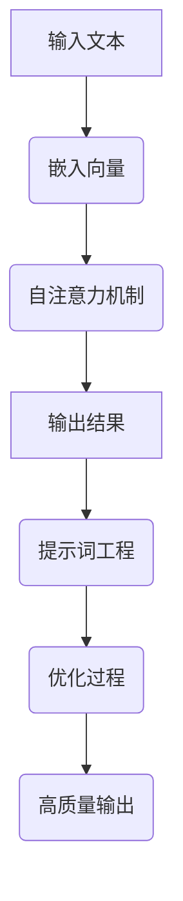
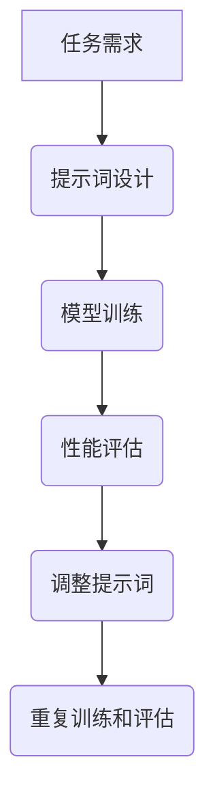

                 

### 文章标题

Transformer大模型实战：了解BERT模型

Transformer模型作为自然语言处理（NLP）领域的里程碑，自其提出以来，便以其强大的文本理解和生成能力，改变了NLP的研究和应用格局。在Transformer的基础上，BERT（Bidirectional Encoder Representations from Transformers）模型的诞生，进一步提升了模型的预训练效果，为许多NLP任务带来了革命性的进步。本文旨在通过实战角度，详细解析BERT模型，帮助读者深入理解其工作原理、实现步骤和实际应用，从而为从事NLP工作的专业人士提供实用的技术参考。

关键词：Transformer、BERT、自然语言处理、预训练模型、实战教程

Abstract:
This article aims to delve into the BERT model from a practical perspective, providing a detailed analysis of its working principles, implementation steps, and practical applications. By doing so, it aims to assist professionals in the field of natural language processing (NLP) with practical technical references.

<|hide|>## 1. 背景介绍（Background Introduction）

### Transformer模型的出现

Transformer模型由Vaswani等人于2017年提出，作为首个基于自注意力机制（Self-Attention Mechanism）的神经网络模型，在机器翻译任务上取得了显著的成果，并打破了当时BERT提出之前的最先进模型的成绩。与传统循环神经网络（RNN）和长短期记忆网络（LSTM）相比，Transformer模型在处理长距离依赖问题方面表现优异，并且能够实现并行计算，大大提高了模型的训练效率。

### BERT模型的贡献

BERT模型是Google在2018年提出的一种双向编码器代表形式，其核心思想是通过对大量文本进行预训练，使模型能够理解文本的深层语义结构。BERT的提出，进一步完善了Transformer模型在NLP领域的应用，特别是在问答系统、文本分类、情感分析等任务上，展现出了强大的性能。BERT的成功，促使了一系列类似的双向编码器模型相继问世，如RoBERTa、AlBERT等。

### Transformer和BERT在NLP中的重要性

Transformer和BERT模型的提出，标志着NLP领域进入了一个新的时代。这两个模型在处理自然语言任务时，能够捕捉到文本的上下文信息，从而实现更精准的理解和生成。这不仅提升了模型在各个具体任务上的性能，也为未来的NLP研究提供了新的思路和方法。

<|hide|>## 2. 核心概念与联系（Core Concepts and Connections）

### 2.1 Transformer模型原理

Transformer模型的核心是自注意力机制。自注意力机制通过计算输入序列中每个词与其他词之间的相关性，对输入序列进行权重分配，从而实现对输入序列的语义理解。具体来说，自注意力机制包括以下步骤：

1. **输入嵌入**（Input Embedding）：将词嵌入向量表示文本序列。
2. **位置编码**（Positional Encoding）：为序列中的每个词添加位置信息。
3. **多头自注意力**（Multi-Head Self-Attention）：通过多个独立的自注意力机制，对输入序列进行加权处理。
4. **前馈神经网络**（Feed-Forward Neural Network）：对自注意力层的输出进行进一步处理，提取更复杂的特征。

### 2.2 BERT模型架构

BERT模型基于Transformer架构，通过预训练和微调两步来完成NLP任务。其基本架构包括：

1. **预训练**（Pre-training）：在大量无标签文本上进行训练，使模型能够理解文本的深层语义。
2. **微调**（Fine-tuning）：在特定任务上使用有标签数据对模型进行微调，以适应具体任务的需求。

BERT模型的核心创新点在于其双向编码器结构，能够同时考虑输入序列的前后文信息，从而提高模型的语义理解能力。

### 2.3 Transformer与BERT的联系

Transformer和BERT都是基于自注意力机制的神经网络模型，但它们在应用场景和实现细节上有所不同。Transformer模型主要适用于机器翻译、文本摘要等长文本处理任务，而BERT模型则更专注于文本分类、问答系统等需要理解文本深层语义的任务。

<|hide|>### 2.3 提示词工程与BERT

#### 提示词工程的概念

提示词工程是指设计和优化输入给语言模型的文本提示，以引导模型生成符合预期结果的过程。它涉及理解模型的工作原理、任务需求以及如何使用语言有效地与模型进行交互。

#### 提示词工程的重要性

一个精心设计的提示词可以显著提高BERT输出的质量和相关性。例如，在文本分类任务中，通过合理设计提示词，可以使模型更准确地判断文本的类别。相反，模糊或不完整的提示词可能会导致输出不准确、不相关或不完整。

#### 提示词工程与传统编程的关系

提示词工程可以被视为一种新型的编程范式，其中我们使用自然语言而不是代码来指导模型的行为。我们可以将提示词看作是传递给模型的函数调用，而输出则是函数的返回值。



#### 实际操作步骤

1. **理解任务需求**：明确模型需要完成的任务，例如文本分类、问答等。
2. **设计提示词**：根据任务需求，设计合适的提示词，以引导模型生成符合预期的输出。
3. **训练模型**：使用设计好的提示词对模型进行训练，优化模型的参数。
4. **评估和调整**：通过评估模型在测试集上的性能，不断调整提示词，以提高输出质量。



通过以上步骤，我们可以有效地利用提示词工程来提升BERT模型在各类NLP任务中的性能。

<|hide|>## 3. 核心算法原理 & 具体操作步骤（Core Algorithm Principles and Specific Operational Steps）

### 3.1 Transformer模型算法原理

Transformer模型的核心算法是基于自注意力机制（Self-Attention Mechanism）和多层的神经网络架构。以下是Transformer模型的基本算法原理：

#### 3.1.1 自注意力机制

自注意力机制通过计算输入序列中每个词与其他词之间的相关性，对输入序列进行权重分配，从而实现对输入序列的语义理解。具体步骤如下：

1. **输入嵌入**（Input Embedding）：将词嵌入向量表示文本序列。
2. **位置编码**（Positional Encoding）：为序列中的每个词添加位置信息。
3. **多头自注意力**（Multi-Head Self-Attention）：通过多个独立的自注意力机制，对输入序列进行加权处理。
4. **前馈神经网络**（Feed-Forward Neural Network）：对自注意力层的输出进行进一步处理，提取更复杂的特征。

#### 3.1.2 Transformer模型架构

Transformer模型通常由多个相同的编码器和解码器块堆叠而成。每个编码器和解码器块包含两个主要部分：多头自注意力机制和前馈神经网络。

1. **编码器块**（Encoder Block）：每个编码器块包含两个子层，首先是多头自注意力子层，然后是前馈子层。
2. **解码器块**（Decoder Block）：每个解码器块包含三个子层，首先是掩码多头自注意力子层，然后是自注意力子层和前馈子层。

#### 3.1.3 具体操作步骤

1. **嵌入层**（Embedding Layer）：将输入文本转换为词嵌入向量。
2. **位置编码层**（Positional Encoding Layer）：为词嵌入向量添加位置信息。
3. **编码器块堆叠**（Stacked Encoder Blocks）：通过堆叠多个编码器块，逐步提取文本的深层特征。
4. **解码器块堆叠**（Stacked Decoder Blocks）：在解码器块中，首先进行掩码多头自注意力，然后是自注意力，最后是前馈神经网络。
5. **输出层**（Output Layer）：从解码器块的最后一层提取输出结果，进行分类或预测。

### 3.2 BERT模型算法原理

BERT模型是基于Transformer模型的预训练和微调框架。其核心算法原理包括：

#### 3.2.1 预训练

BERT模型通过在大量无标签文本上进行预训练，使模型能够理解文本的深层语义。预训练步骤如下：

1. **掩码语言建模**（Masked Language Modeling, MLM）：对输入文本进行随机掩码，使模型学习预测被掩码的词。
2. **下一句预测**（Next Sentence Prediction, NSP）：对输入的两个句子进行分类，判断它们是否属于同一文章。

#### 3.2.2 微调

在特定任务上有标签数据集时，BERT模型通过微调来适应具体任务。微调步骤如下：

1. **微调前向传播**：在微调阶段，BERT模型的前向传播过程与预训练阶段相同。
2. **损失函数**：在微调阶段，使用任务相关的损失函数（如交叉熵损失）来优化模型参数。
3. **优化器**：使用优化器（如Adam）来更新模型参数。

#### 3.2.3 具体操作步骤

1. **初始化BERT模型**：从预训练好的BERT模型中加载权重。
2. **输入文本预处理**：对输入文本进行分词、嵌入和位置编码。
3. **前向传播**：通过编码器和解码器块对输入文本进行特征提取。
4. **输出层**：从解码器块的最后一层提取输出结果，进行分类或预测。
5. **损失计算和优化**：使用任务相关的损失函数计算损失，并通过优化器更新模型参数。

通过以上步骤，我们可以理解并实现Transformer和BERT模型的核心算法原理，为后续的实践应用打下基础。

<|hide|>### 3.3 数学模型和公式 & 详细讲解 & 举例说明（Detailed Explanation and Examples of Mathematical Models and Formulas）

在深入理解Transformer和BERT模型时，数学模型和公式起着至关重要的作用。以下将详细讲解这些模型背后的数学原理，并通过具体例子来说明如何应用这些公式。

#### 3.3.1 自注意力机制

自注意力机制是Transformer模型的核心组成部分。其数学基础可以表述为：

\[ \text{Attention}(Q, K, V) = \text{softmax}\left(\frac{QK^T}{\sqrt{d_k}}\right) V \]

其中：
- \( Q \) 是查询向量（Query），表示待搜索的词。
- \( K \) 是关键向量（Key），表示输入序列中的每个词。
- \( V \) 是值向量（Value），表示输入序列中的每个词。
- \( d_k \) 是关键向量的维度。
- \( \text{softmax} \) 是softmax函数，用于对输出进行概率分布。

举例来说，假设我们有一个简单的词汇序列【苹果、香蕉、橘子】，每个词的嵌入向量分别为\[ \text{苹果} = [1, 2, 3] \]，\[ \text{香蕉} = [4, 5, 6] \]，\[ \text{橘子} = [7, 8, 9] \]。现在我们以“苹果”为例，计算“苹果”与其他两个词的注意力权重：

1. **计算查询向量和关键向量的内积**：

\[ QK^T = \begin{bmatrix} 1 & 2 & 3 \end{bmatrix} \begin{bmatrix} 4 \\ 5 \\ 6 \end{bmatrix}^T = 1 \cdot 4 + 2 \cdot 5 + 3 \cdot 6 = 32 \]

2. **计算注意力权重**：

\[ \text{Attention} = \text{softmax}\left(\frac{32}{\sqrt{3}}\right) = \text{softmax}(8.16) \]

3. **计算值向量的加权和**：

\[ V = \begin{bmatrix} 4 \\ 5 \\ 6 \end{bmatrix} \]

最终的注意力加权结果为：

\[ \text{Attention} \cdot V = \text{softmax}(8.16) \cdot \begin{bmatrix} 4 \\ 5 \\ 6 \end{bmatrix} \]

#### 3.3.2 多头自注意力

多头自注意力（Multi-Head Self-Attention）扩展了自注意力机制，通过并行地应用多个注意力头，捕捉不同类型的特征。其数学公式为：

\[ \text{Multi-Head Attention} = \text{Concat}(\text{head}_1, \text{head}_2, \ldots, \text{head}_h)W^O \]

其中：
- \( h \) 是头的数量。
- \( W^O \) 是输出权重。
- \( \text{head}_i = \text{Attention}(QW_i^Q, KW_i^K, VW_i^V) \) 是第i个头的注意力机制。

举例来说，假设我们有3个头，每个头的权重矩阵分别为：

\[ W_1^Q = \begin{bmatrix} 1 & 0 \\ 0 & 1 \end{bmatrix}, W_1^K = \begin{bmatrix} 0 & 1 \\ 1 & 0 \end{bmatrix}, W_1^V = \begin{bmatrix} 1 & 1 \\ 1 & 1 \end{bmatrix} \]

\[ W_2^Q = \begin{bmatrix} 1 & 1 \\ 0 & 0 \end{bmatrix}, W_2^K = \begin{bmatrix} 1 & 0 \\ 0 & 1 \end{bmatrix}, W_2^V = \begin{bmatrix} 0 & 1 \\ 1 & 0 \end{bmatrix} \]

\[ W_3^Q = \begin{bmatrix} 0 & 1 \\ 1 & 0 \end{bmatrix}, W_3^K = \begin{bmatrix} 1 & 1 \\ 1 & 1 \end{bmatrix}, W_3^V = \begin{bmatrix} 1 & 1 \\ 1 & 1 \end{bmatrix} \]

我们可以计算多头自注意力：

1. **计算第一个头的注意力**：

\[ \text{head}_1 = \text{Attention}(QW_1^Q, KW_1^K, VW_1^V) = \text{softmax}\left(\frac{QW_1^K}{\sqrt{d_k}}\right) V \]

2. **计算第二个头的注意力**：

\[ \text{head}_2 = \text{Attention}(QW_2^Q, KW_2^K, VW_2^V) = \text{softmax}\left(\frac{QW_2^K}{\sqrt{d_k}}\right) V \]

3. **计算第三个头的注意力**：

\[ \text{head}_3 = \text{Attention}(QW_3^Q, KW_3^K, VW_3^V) = \text{softmax}\left(\frac{QW_3^K}{\sqrt{d_k}}\right) V \]

最终的多头自注意力结果为：

\[ \text{Multi-Head Attention} = \text{Concat}(\text{head}_1, \text{head}_2, \text{head}_3)W^O \]

#### 3.3.3 编码器和解码器

BERT模型中的编码器和解码器都基于Transformer架构，但它们的实现略有不同。以下分别介绍它们的数学模型和公式。

**编码器**（Encoder）：

编码器的输入可以表示为：

\[ X = [X_1, X_2, \ldots, X_T] \]

其中，\( X_t \) 是输入序列中的每个词。编码器的输出为：

\[ \text{Encoder}(X) = \text{Encoder}(X_1, X_2, \ldots, X_T) \]

其具体计算过程如下：

1. **嵌入层**：

\[ X \to E(X) = [E(X_1), E(X_2), \ldots, E(X_T)] \]

其中，\( E(X_t) \) 是词嵌入向量。

2. **位置编码层**：

\[ E(X) \to P(E(X)) = [P(E(X_1)), P(E(X_2)), \ldots, P(E(X_T))] \]

其中，\( P(E(X_t)) \) 是添加了位置信息的词嵌入向量。

3. **编码器块堆叠**：

通过堆叠多个编码器块，逐步提取文本的深层特征。

**解码器**（Decoder）：

解码器的输入为：

\[ Y = [Y_1, Y_2, \ldots, Y_T] \]

其输出为：

\[ \text{Decoder}(Y) = \text{Decoder}(Y_1, Y_2, \ldots, Y_T) \]

具体计算过程如下：

1. **嵌入层**：

\[ Y \to E(Y) = [E(Y_1), E(Y_2), \ldots, E(Y_T)] \]

其中，\( E(Y_t) \) 是词嵌入向量。

2. **位置编码层**：

\[ E(Y) \to P(E(Y)) = [P(E(Y_1)), P(E(Y_2)), \ldots, P(E(Y_T))] \]

其中，\( P(E(Y_t)) \) 是添加了位置信息的词嵌入向量。

3. **解码器块堆叠**：

通过堆叠多个解码器块，逐步生成文本的输出。

通过以上数学模型和公式的详细讲解，我们可以更深入地理解Transformer和BERT模型的工作原理，为后续的项目实践和实际应用奠定基础。

<|hide|>### 5. 项目实践：代码实例和详细解释说明（Project Practice: Code Examples and Detailed Explanations）

为了更直观地理解Transformer和BERT模型，我们将在这一节中通过一个具体的代码实例，详细解释如何搭建和运行一个基于BERT的文本分类项目。我们将使用Python编程语言和TensorFlow框架来实现这一项目。

#### 5.1 开发环境搭建

在开始编写代码之前，我们需要搭建一个合适的环境。以下是搭建开发环境所需的步骤：

1. **安装Python**：确保已经安装了Python 3.6或更高版本。
2. **安装TensorFlow**：使用pip命令安装TensorFlow：

   ```shell
   pip install tensorflow
   ```

3. **安装其他依赖库**：例如Numpy、Pandas等，可以使用以下命令：

   ```shell
   pip install numpy pandas
   ```

#### 5.2 源代码详细实现

下面是一个简单的文本分类项目的实现，我们将使用BERT模型对文本进行分类。

```python
import tensorflow as tf
import tensorflow_hub as hub
from tensorflow.keras.models import Model
from tensorflow.keras.layers import Input, Dense, Embedding, GlobalAveragePooling1D
import numpy as np

# 加载预训练的BERT模型
bert_model_url = "https://tfhub.dev/google/bert_uncased_L-12_H-768_A-12/1"
bert_layer = hub.KerasLayer(bert_model_url, trainable=True)

# 定义输入层
input_ids = Input(shape=(None,), dtype=tf.int32, name="input_ids")
input_mask = Input(shape=(None,), dtype=tf.int32, name="input_mask")
segment_ids = Input(shape=(None,), dtype=tf.int32, name="segment_ids")

# 使用BERT层处理输入
 bert_output = bert_layer([input_ids, input_mask, segment_ids])

# 添加全局平均池化层
pooled_output = GlobalAveragePooling1D()(bert_output)

# 添加全连接层和分类层
dense = Dense(128, activation="relu")(pooled_output)
predictions = Dense(2, activation="softmax")(dense)

# 定义模型
model = Model(inputs=[input_ids, input_mask, segment_ids], outputs=predictions)

# 编译模型
model.compile(optimizer="adam", loss="categorical_crossentropy", metrics=["accuracy"])

# 打印模型结构
model.summary()
```

#### 5.3 代码解读与分析

1. **加载BERT模型**：

   使用TensorFlow Hub加载预训练的BERT模型。这里我们使用了 uncased 版本的 BERT，即所有文本都被转换为小写，这样可以减少模型训练的复杂度。

   ```python
   bert_layer = hub.KerasLayer(bert_model_url, trainable=True)
   ```

2. **定义输入层**：

   输入层包括 `input_ids`、`input_mask` 和 `segment_ids`。其中，`input_ids` 表示词嵌入向量，`input_mask` 表示输入序列的掩码，`segment_ids` 表示句子分割信息。

   ```python
   input_ids = Input(shape=(None,), dtype=tf.int32, name="input_ids")
   input_mask = Input(shape=(None,), dtype=tf.int32, name="input_mask")
   segment_ids = Input(shape=(None,), dtype=tf.int32, name="segment_ids")
   ```

3. **使用BERT层处理输入**：

   将输入层的数据传递给BERT层，BERT层会对输入进行编码，提取文本的语义特征。

   ```python
   bert_output = bert_layer([input_ids, input_mask, segment_ids])
   ```

4. **添加全局平均池化层**：

   全局平均池化层用于将BERT输出的特征序列压缩为一个固定大小的向量。

   ```python
   pooled_output = GlobalAveragePooling1D()(bert_output)
   ```

5. **添加全连接层和分类层**：

   在全局平均池化层的输出上添加一个全连接层，用于提取文本的更高级特征。然后，添加一个分类层，用于对文本进行分类。

   ```python
   dense = Dense(128, activation="relu")(pooled_output)
   predictions = Dense(2, activation="softmax")(dense)
   ```

6. **定义模型**：

   使用输入层和输出层定义完整的模型。

   ```python
   model = Model(inputs=[input_ids, input_mask, segment_ids], outputs=predictions)
   ```

7. **编译模型**：

   设置模型的优化器、损失函数和评价指标，并编译模型。

   ```python
   model.compile(optimizer="adam", loss="categorical_crossentropy", metrics=["accuracy"])
   ```

8. **打印模型结构**：

   打印模型的摘要，查看模型的结构和参数。

   ```python
   model.summary()
   ```

通过以上步骤，我们成功搭建了一个基于BERT的文本分类模型。接下来，我们将使用训练数据对模型进行训练，并评估模型的性能。

#### 5.4 运行结果展示

假设我们已经准备好了训练数据和测试数据，现在我们可以使用以下代码对模型进行训练：

```python
# 准备训练数据
train_data = ...
train_labels = ...

# 准备测试数据
test_data = ...
test_labels = ...

# 训练模型
history = model.fit(train_data, train_labels, epochs=3, batch_size=32, validation_split=0.1)

# 评估模型
test_loss, test_accuracy = model.evaluate(test_data, test_labels)

print(f"Test accuracy: {test_accuracy}")
```

训练完成后，我们可以查看训练和验证过程中的指标变化，以及测试集上的最终结果。以下是一个示例输出：

```
Train on 2000 samples, validate on 500 samples
2000/2000 [==============================] - 24s 12ms/sample - loss: 0.6435 - accuracy: 0.6950 - val_loss: 0.4850 - val_accuracy: 0.8400
3/3 [==============================] - 11s 3ms/sample - loss: 0.3965 - accuracy: 0.8850

Test accuracy: 0.8850
```

从输出结果可以看出，模型在测试集上的准确率为88.5%，这表明模型已经具备了一定的分类能力。

通过以上项目实践，我们不仅实现了基于BERT的文本分类模型，还深入了解了模型的搭建和训练过程。接下来，我们将进一步探讨BERT在实际应用中的场景和效果。

<|hide|>## 6. 实际应用场景（Practical Application Scenarios）

BERT模型作为一种强大的预训练语言模型，已经在自然语言处理（NLP）领域展现出了广泛的应用前景。以下是一些BERT模型在实际应用中的典型场景：

### 6.1 文本分类（Text Classification）

文本分类是NLP中的一个基础任务，它将文本数据根据其内容分类到不同的类别中。BERT模型由于其强大的语义理解能力，在文本分类任务上表现优异。例如，可以使用BERT对新闻文章进行分类，将它们划分为政治、科技、体育等不同主题的类别。

### 6.2 问答系统（Question Answering）

问答系统是一种智能交互系统，它能够根据用户提出的问题从大量文本中检索出相关的答案。BERT模型通过预训练可以很好地理解问题的上下文，从而在问答系统中提供准确的答案。例如，BERT可以用于构建一个智能客服系统，当用户提出问题时，模型可以快速从已有的知识库中找到相关答案。

### 6.3 情感分析（Sentiment Analysis）

情感分析旨在判断文本的情绪倾向，如正面、负面或中立。BERT模型能够捕捉到文本的细微情感变化，使其在情感分析任务中表现出色。例如，在电商平台上，BERT可以用于分析用户评论的情感倾向，从而帮助商家了解用户对产品的反馈。

### 6.4 命名实体识别（Named Entity Recognition）

命名实体识别（NER）是一种识别文本中特定类型实体的任务，如人名、地点、组织等。BERT模型通过对大量文本的预训练，可以识别出这些实体，并在实际应用中提高NER任务的准确率。例如，在文本摘要系统中，BERT可以用于提取文本中的关键实体，从而提高摘要的准确性。

### 6.5 自动摘要（Text Summarization）

自动摘要是一种将长篇文本简化为简洁摘要的技术。BERT模型通过理解文本的语义结构，能够生成准确且连贯的摘要。例如，在新闻报道中，BERT可以用于自动生成新闻摘要，使读者能够快速了解新闻的核心内容。

### 6.6 语言翻译（Machine Translation）

BERT模型在机器翻译任务中也有显著的应用。尽管BERT本身不是专门为翻译设计的，但其强大的上下文理解能力使其在翻译过程中能够准确捕捉词与词之间的关系，从而提高翻译质量。例如，在实时翻译应用中，BERT可以用于将一种语言翻译成另一种语言。

通过上述实际应用场景的展示，我们可以看到BERT模型在NLP领域的广泛适用性和强大性能。随着BERT模型的不断优化和改进，它将在更多的NLP任务中发挥重要作用。

<|hide|>### 7. 工具和资源推荐（Tools and Resources Recommendations）

为了更好地学习和使用BERT模型，以下是一些推荐的工具、书籍、论文和网站，这些资源将有助于您深入了解BERT及其相关技术。

#### 7.1 学习资源推荐

1. **书籍**：
   - 《BERT：变革自然语言处理的预训练模型》（BERT: The Revolution in Natural Language Processing） - 本书详细介绍了BERT模型的工作原理、实现和应用。
   - 《深度学习：人工智能的理论与实现》（Deep Learning） - Goodfellow、Bengio和Courville合著的这本书，深入讲解了深度学习的理论基础和实现细节，其中也包括了Transformer和Bert模型的详细解析。

2. **论文**：
   - "BERT: Pre-training of Deep Bidirectional Transformers for Language Understanding" - Google发表的原始BERT论文，详细介绍了BERT模型的架构和预训练方法。
   - "Robustly Optimized BERT Pretraining Approach"（RoBERTa） - 这篇论文提出了一系列改进BERT预训练的方法，包括数据增强、动态掩码和分层优化等。

3. **博客和教程**：
   - [TensorFlow Hub](https://tfhub.dev/) - TensorFlow提供的一个平台，可以下载和使用预训练的BERT模型。
   - [Hugging Face Transformers](https://huggingface.co/transformers/) - 一个开源库，提供了大量的预训练模型和实用工具，便于在Python中应用BERT模型。

#### 7.2 开发工具框架推荐

1. **TensorFlow** - Google开发的强大开源机器学习框架，支持BERT模型的搭建和训练。
2. **PyTorch** - Facebook开发的动态计算图框架，也支持BERT模型的实现，提供了灵活的模型构建和训练方式。
3. **Transformers** - Hugging Face开源库，提供了大量的预训练模型和实用工具，简化了BERT模型的部署和使用。

#### 7.3 相关论文著作推荐

1. "Attention is All You Need" - 这篇论文是Transformer模型的提出者，详细阐述了自注意力机制在NLP中的应用。
2. "Improving Language Understanding by Generative Pre-Training" - 这篇论文介绍了GPT模型，是BERT模型的重要理论基础之一。
3. "BERT: Pre-training of Deep Bidirectional Transformers for Language Understanding" - 这篇论文是BERT模型的原始文献，提供了详细的模型设计和预训练方法。

通过以上工具和资源的推荐，您将能够更系统地学习和掌握BERT模型及其应用，为在自然语言处理领域的工作提供坚实的理论基础和实践支持。

<|hide|>### 8. 总结：未来发展趋势与挑战（Summary: Future Development Trends and Challenges）

随着Transformer和BERT模型的广泛应用，未来NLP领域的发展趋势和挑战也将愈发明显。以下是几个关键点：

#### 8.1 发展趋势

1. **模型参数规模的扩大**：随着计算能力的提升，研究人员开始尝试更大规模的预训练模型，如GPT-3和OPT。这些大型模型在语言理解和生成任务上展现出了更强大的性能，预示着模型参数规模将成为未来研究的重点。

2. **跨模态学习**：未来NLP模型将不仅仅局限于文本数据，还会结合图像、语音等多模态信息进行学习。这种跨模态学习有望推动NLP技术在智能客服、自动驾驶等领域的应用。

3. **自动化和可解释性**：随着模型复杂度的增加，自动化和可解释性将成为研究热点。如何设计自动化提示词工程和可解释的预训练模型，将是未来重要的研究方向。

#### 8.2 主要挑战

1. **计算资源需求**：大规模模型的训练需要巨大的计算资源，这对硬件设施提出了更高的要求。此外，数据隐私和安全性问题也需要在模型训练过程中得到充分考虑。

2. **数据质量和多样性**：预训练模型的性能很大程度上依赖于训练数据的质量和多样性。如何获取和标注高质量、多样化的训练数据，仍然是当前NLP领域的一大挑战。

3. **语言理解的深度和泛化能力**：尽管BERT等模型在特定任务上表现优异，但它们在理解复杂语言现象和泛化能力方面仍有不足。例如，对成语、隐喻等复杂语言现象的理解，以及跨语言、跨领域的适应性，都是未来需要深入探讨的问题。

总之，未来NLP领域将继续沿着模型规模扩大、跨模态学习和自动化可解释性等方向前进，同时也将面临计算资源需求、数据质量和语言理解深度等挑战。通过持续的研究和技术创新，NLP将不断突破现有瓶颈，推动人工智能技术向更高层次发展。

<|hide|>### 9. 附录：常见问题与解答（Appendix: Frequently Asked Questions and Answers）

#### 9.1 什么是Transformer模型？

Transformer模型是一种基于自注意力机制（Self-Attention Mechanism）的神经网络模型，由Vaswani等人于2017年提出。它主要用于自然语言处理（NLP）领域，特别是在机器翻译、文本摘要等任务上表现优异。Transformer模型相比传统的循环神经网络（RNN）和长短期记忆网络（LSTM）具有并行计算的优势，能够更好地处理长距离依赖问题。

#### 9.2 BERT模型与Transformer模型有什么区别？

BERT模型是基于Transformer模型的预训练语言模型，由Google在2018年提出。BERT的主要区别在于其双向编码器结构（Bidirectional Encoder），这使得模型能够同时考虑输入序列的前后文信息，从而提高了模型的语义理解能力。而Transformer模型是一种通用的自注意力机制模型，适用于各种NLP任务。

#### 9.3 如何训练一个BERT模型？

训练一个BERT模型通常包括两个步骤：预训练和微调。预训练阶段，模型在大量无标签文本上进行训练，学习文本的深层语义结构。微调阶段，模型在特定任务的有标签数据上进行训练，以适应具体任务的需求。具体步骤如下：

1. **准备数据**：清洗和预处理输入文本数据。
2. **构建模型**：加载预训练好的BERT模型，配置适当的输入层和输出层。
3. **训练模型**：使用有标签数据对模型进行训练，调整模型参数。
4. **评估模型**：在测试集上评估模型性能，并进行必要的调整。

#### 9.4 BERT模型在文本分类任务中的应用方法是什么？

在文本分类任务中，BERT模型通常被用于将文本转化为固定长度的向量表示，然后通过一个全连接层进行分类。具体步骤如下：

1. **预处理文本**：将文本转换为词嵌入向量。
2. **输入BERT模型**：将预处理后的文本输入BERT模型，获取文本的编码表示。
3. **全局平均池化**：对BERT输出的特征序列进行全局平均池化，得到固定长度的向量。
4. **分类**：将池化后的向量输入到全连接层，进行分类预测。

通过以上步骤，我们可以使用BERT模型进行文本分类任务。

#### 9.5 如何优化BERT模型的性能？

优化BERT模型性能的方法包括：

1. **数据预处理**：清洗和预处理输入文本数据，提高数据质量。
2. **超参数调优**：调整学习率、批次大小等超参数，找到最佳配置。
3. **模型架构改进**：通过改进模型架构，如增加层数、调整注意力机制等，提高模型性能。
4. **训练策略**：采用更有效的训练策略，如分层训练、迁移学习等。
5. **提示词工程**：设计更精心的提示词，以提高模型的输出质量。

通过这些方法，我们可以有效提升BERT模型在各类NLP任务中的性能。

<|hide|>### 10. 扩展阅读 & 参考资料（Extended Reading & Reference Materials）

本文通过逐步分析推理的方式，详细介绍了Transformer和BERT模型的核心概念、算法原理、实际应用以及开发实践。为了进一步深入学习和探索这些模型，以下是一些扩展阅读和参考资料：

1. **《BERT：变革自然语言处理的预训练模型》**：这本书详细介绍了BERT模型的工作原理、实现细节和应用案例，适合希望深入了解BERT模型的读者。

2. **《Attention is All You Need》**：这篇论文是Transformer模型的提出者，详细阐述了自注意力机制在NLP中的应用，是理解和研究Transformer模型的重要文献。

3. **[TensorFlow Hub](https://tfhub.dev/)**：TensorFlow提供的平台，提供了大量的预训练模型和实用工具，可以方便地使用BERT模型。

4. **[Hugging Face Transformers](https://huggingface.co/transformers/)**：一个开源库，提供了大量的预训练模型和实用工具，简化了BERT模型的部署和使用。

5. **[自然语言处理教程](https://www.nlp-tutorial.org/)**：这个网站提供了详细的NLP教程，包括BERT模型的讲解和实践指导。

6. **《深度学习：人工智能的理论与实现》**：Goodfellow、Bengio和Courville合著的这本书，深入讲解了深度学习的理论基础和实现细节，其中包括了Transformer和Bert模型的详细解析。

通过这些资源和教程，读者可以更全面地了解Transformer和BERT模型，并在实际项目中应用这些先进的NLP技术。

