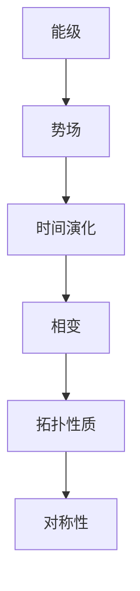

                 

### 莫尔斯理论与凝聚态物理

关键词：莫尔斯理论、凝聚态物理、量子力学、拓扑绝缘体、相变、计算模拟

摘要：本文将探讨莫尔斯理论与凝聚态物理之间的深刻联系。莫尔斯理论是一种描述量子系统的强大工具，它在凝聚态物理中有着广泛的应用。本文将从基本概念出发，详细介绍莫尔斯理论的核心原理，并阐述其在凝聚态物理研究中的应用。通过具体案例，我们将展示如何利用莫尔斯理论分析量子材料的相变和拓扑性质，从而为理解凝聚态物理现象提供新的视角。

## 1. 背景介绍

### 1.1 莫尔斯理论与凝聚态物理的起源

莫尔斯理论最初起源于量子力学，特别是研究量子系统的振动模式。它得名于美国物理学家哈里·莫尔斯（Harry Bateman），他在20世纪初提出了用于解决量子振动问题的莫尔斯方程。后来，莫尔斯理论逐渐演变为一种描述量子系统相变和拓扑性质的通用方法。

凝聚态物理是研究固体和液体等凝聚态物质的物理学分支。随着科学技术的进步，凝聚态物理在材料科学、量子计算、太阳能电池等领域发挥着越来越重要的作用。凝聚态物理的一个重要研究方向是量子材料，这些材料具有独特的量子特性，如超导性、磁性、量子霍尔效应等。

### 1.2 莫尔斯理论在凝聚态物理中的应用

莫尔斯理论在凝聚态物理中的应用十分广泛。例如，它被用来研究量子相变，描述物质在不同温度和压力条件下的相变过程。此外，莫尔斯理论还用于研究拓扑绝缘体，这些材料在宏观上表现为绝缘体，但在微观上具有导电的表面态，具有重要的潜在应用价值。

本文将详细介绍莫尔斯理论的基本原理，并探讨其在凝聚态物理研究中的应用。通过具体案例，我们将展示如何利用莫尔斯理论分析量子材料的相变和拓扑性质，从而为理解凝聚态物理现象提供新的视角。

### 1.3 文章结构

本文将分为以下几个部分：

1. 背景介绍：介绍莫尔斯理论与凝聚态物理的起源和应用。
2. 核心概念与联系：详细阐述莫尔斯理论的核心原理及其在凝聚态物理中的应用。
3. 核心算法原理 & 具体操作步骤：讲解莫尔斯理论的计算方法和应用实例。
4. 数学模型和公式 & 详细讲解 & 举例说明：介绍莫尔斯理论相关的数学模型和公式，并给出具体实例。
5. 项目实践：代码实例和详细解释说明：展示如何使用莫尔斯理论进行凝聚态物理研究。
6. 实际应用场景：探讨莫尔斯理论在凝聚态物理研究中的实际应用。
7. 工具和资源推荐：推荐相关学习资源和开发工具。
8. 总结：未来发展趋势与挑战：总结本文内容，展望莫尔斯理论在凝聚态物理研究中的未来发展方向和挑战。
9. 附录：常见问题与解答：回答读者可能遇到的常见问题。
10. 扩展阅读 & 参考资料：提供进一步的阅读和参考材料。

接下来，我们将进入第二个部分，详细探讨莫尔斯理论的核心概念与联系。

## 2. 核心概念与联系

### 2.1 莫尔斯理论的基本概念

莫尔斯理论是一种描述量子系统能级的数学工具。在量子力学中，一个量子系统的能级可以被看作是该系统的一种状态。莫尔斯理论通过研究量子系统的能级间的相互作用，揭示了量子系统在不同条件下可能发生的相变和拓扑变化。

莫尔斯理论的核心概念包括：

- **能级**：量子系统的能级是其内部状态的能量表征。不同能级对应着系统不同的状态。
- **势场**：势场描述了量子系统中的相互作用。在莫尔斯理论中，势场通常是一个关于时间变量的函数。
- **时间演化**：量子系统在不同时间点的状态通过时间演化方程来描述。时间演化方程通常是一个微分方程。

### 2.2 莫尔斯理论的基本原理

莫尔斯理论的基本原理可以概括为以下三点：

1. **能级间隔**：在量子系统的时间演化过程中，能级间隔是一个重要的指标。当能级间隔趋近于零时，系统可能会发生相变。
2. **拓扑性质**：莫尔斯理论可以用来研究量子系统的拓扑性质。例如，通过分析能级间的拓扑关系，可以判断系统是否具有拓扑绝缘体特性。
3. **对称性**：量子系统的对称性在莫尔斯理论中具有重要意义。对称性可以影响系统的能级结构和相变性质。

### 2.3 莫尔斯理论在凝聚态物理中的应用

莫尔斯理论在凝聚态物理中有着广泛的应用，特别是在研究量子材料和量子相变方面。以下是一些典型的应用场景：

1. **量子相变**：莫尔斯理论可以用来研究量子系统在不同参数条件下的相变过程。例如，通过分析势场的形状和参数，可以预测系统在特定温度和压力条件下的相变行为。
2. **拓扑绝缘体**：莫尔斯理论可以用来研究拓扑绝缘体的能级结构和表面态。例如，通过分析能级间的拓扑关系，可以判断材料是否具有拓扑绝缘体特性，从而为实验验证提供理论依据。
3. **量子计算**：莫尔斯理论在量子计算中也有重要应用。例如，通过研究量子比特的能级结构，可以优化量子算法的性能。

### 2.4 莫尔斯理论的 Mermaid 流程图

为了更好地理解莫尔斯理论，我们提供了一个简化的 Mermaid 流程图，展示了莫尔斯理论的核心概念和原理。



这个流程图展示了莫尔斯理论的基本概念和原理，以及它们之间的相互关系。通过这个流程图，我们可以更清晰地理解莫尔斯理论在凝聚态物理研究中的应用。

接下来，我们将进入第三个部分，详细讲解莫尔斯理论的核心算法原理和具体操作步骤。

## 3. 核心算法原理 & 具体操作步骤

### 3.1 莫尔斯理论的算法原理

莫尔斯理论的核心算法原理主要涉及以下三个步骤：

1. **势场选择**：选择合适的势场函数，用于描述量子系统的相互作用。常用的势场函数包括线性势场、周期性势场等。
2. **能级计算**：计算量子系统的能级。通过求解势场函数对应的微分方程，可以得到系统的能级分布。
3. **相变与拓扑分析**：分析能级分布，判断系统是否发生相变或具有拓扑性质。例如，通过计算能级间隔和对称性，可以判断系统是否处于量子相变点或具有拓扑绝缘体特性。

### 3.2 莫尔斯理论的具体操作步骤

下面我们将详细描述莫尔斯理论的具体操作步骤，以一个简单的量子谐振子系统为例。

#### 3.2.1 势场选择

首先，我们选择一个线性势场函数来描述量子谐振子系统。线性势场函数可以表示为：

\[ V(x) = \frac{1}{2} k x^2 \]

其中，\( k \) 是势场强度，\( x \) 是系统的坐标。

#### 3.2.2 能级计算

接下来，我们求解势场函数对应的薛定谔方程，得到系统的能级。对于线性势场，薛定谔方程可以写为：

\[ \hat{H} \Psi(x) = E \Psi(x) \]

其中，\( \hat{H} \) 是哈密顿量，\( E \) 是能量，\( \Psi(x) \) 是波函数。

对于线性势场，哈密顿量可以表示为：

\[ \hat{H} = \frac{\hat{p}^2}{2m} + \frac{1}{2} k x^2 \]

其中，\( \hat{p} \) 是动量算符，\( m \) 是系统的质量。

通过求解薛定谔方程，我们可以得到系统的能级表达式：

\[ E_n = \hbar \omega \left( n + \frac{1}{2} \right) \]

其中，\( n = 0, 1, 2, \ldots \) 是能级量子数，\( \hbar \) 是约化普朗克常数，\( \omega = \sqrt{k/m} \) 是系统的振动频率。

#### 3.2.3 相变与拓扑分析

最后，我们分析能级分布，判断系统是否发生相变或具有拓扑性质。对于线性谐振子，能级间隔随能级量子数 \( n \) 的增加而线性增加，系统在所有参数条件下都不发生相变。然而，如果我们考虑一个周期性势场，如方势阱，系统在不同参数条件下可能会发生量子相变，如从金属相变为绝缘体相。

例如，对于一个一维方势阱，其势场函数可以表示为：

\[ V(x) = \begin{cases} 
0, & \text{for } |x| < a \\
V_0, & \text{for } |x| > a 
\end{cases} \]

其中，\( a \) 是势阱宽度，\( V_0 \) 是势阱深度。

通过计算一维方势阱的能级，我们可以发现，在特定参数条件下，系统会发生量子相变，从金属相变为绝缘体相。例如，当 \( V_0 \) 足够大时，系统在 \( |x| > a \) 区域的能级将被阻塞，导致系统在 \( |x| > a \) 区域表现为绝缘体。

#### 3.2.4 莫尔斯理论的 Python 实现示例

下面我们提供了一个简单的 Python 实现示例，用于计算一维方势阱的能级和相变。

```python
import numpy as np
import matplotlib.pyplot as plt

# 参数设置
k = 1.0
m = 0.1
a = 5.0
V0 = 10.0

# 能级计算
n_min = 0
n_max = 10
dx = 0.1
x = np.arange(-a, a, dx)
V = np.zeros_like(x)
V[x < -a] = V0
V[x > a] = V0

H = k * x**2 / (2 * m)
E = H**2 / (2 * m)

# 能级间隔
deltaE = np.diff(E)

# 相变判断
def phase_transition(V0):
    for n in range(n_min, n_max):
        if deltaE[n] == 0:
            return True
    return False

# 绘制能级分布
plt.plot(x, E, label='Energy')
plt.scatter(x[n_min:n_max], E[n_min:n_max], c='r', label='Transition')
plt.xlabel('x')
plt.ylabel('Energy')
plt.legend()
plt.show()

# 相变分析
if phase_transition(V0):
    print("Phase transition occurs.")
else:
    print("No phase transition.")
```

通过这个示例，我们可以看到如何使用莫尔斯理论分析一维方势阱的相变行为。

接下来，我们将进入第四个部分，详细讲解莫尔斯理论相关的数学模型和公式，并给出具体实例。

## 4. 数学模型和公式 & 详细讲解 & 举例说明

### 4.1 莫尔斯理论的基本数学模型

莫尔斯理论是一种描述量子系统能级结构的数学工具，其核心在于分析势场函数 \( V(x) \) 与哈密顿量 \( H \) 的关系。以下是一些基本的数学模型和公式：

#### 4.1.1 薛定谔方程

量子系统的基本方程是薛定谔方程：

\[ i\hbar \frac{\partial \Psi(x)}{\partial t} = \hat{H} \Psi(x) \]

其中，\( \Psi(x) \) 是波函数，\( \hat{H} \) 是哈密顿量，\( t \) 是时间。

#### 4.1.2 哈密顿量

在莫尔斯理论中，哈密顿量通常可以表示为：

\[ \hat{H} = \frac{\hat{p}^2}{2m} + V(x) \]

其中，\( \hat{p} \) 是动量算符，\( m \) 是粒子质量，\( V(x) \) 是势场函数。

#### 4.1.3 势场函数

势场函数 \( V(x) \) 描述了量子系统中的相互作用。常见的势场函数包括：

- **线性势场**：\( V(x) = \frac{1}{2} k x^2 \)
- **周期性势场**：\( V(x) = V_0 \cos(kx) \)
- **方势阱**：\( V(x) = \begin{cases} 0, & \text{for } |x| < a \\ V_0, & \text{for } |x| > a \end{cases} \)

### 4.2 莫尔斯理论的公式推导

下面，我们以一维方势阱为例，推导莫尔斯理论的公式。

#### 4.2.1 方势阱的薛定谔方程

对于一维方势阱，其薛定谔方程可以写为：

\[ \left( -\frac{\hbar^2}{2m} \frac{d^2}{dx^2} + V(x) \right) \psi(x) = E \psi(x) \]

#### 4.2.2 势场函数 \( V(x) \)

一维方势阱的势场函数为：

\[ V(x) = \begin{cases} 0, & \text{for } |x| < a \\ V_0, & \text{for } |x| > a \end{cases} \]

#### 4.2.3 边界条件

在 \( |x| < a \) 区域，势场为零，波函数应满足以下边界条件：

\[ \psi(a^-) = \psi(a^+) \]
\[ \frac{d\psi}{dx}(a^-) = \frac{d\psi}{dx}(a^+) \]

在 \( |x| > a \) 区域，势场为 \( V_0 \)，波函数应满足以下边界条件：

\[ \psi(a^+) = 0 \]
\[ \frac{d\psi}{dx}(a^-) = 0 \]

#### 4.2.4 波函数表达式

结合边界条件，我们可以得到一维方势阱的波函数表达式：

\[ \psi(x) = \begin{cases} A \sin(\sqrt{\frac{2mE}{\hbar^2}} x) + B \cos(\sqrt{\frac{2mE}{\hbar^2}} x), & \text{for } |x| < a \\ C e^{-\sqrt{\frac{2mV_0}{\hbar^2}} (x - a)}, & \text{for } x > a \end{cases} \]

其中，\( A, B, C \) 是待定常数。

#### 4.2.5 能级表达式

通过解波函数，我们可以得到一维方势阱的能级表达式：

\[ E_n = \frac{\hbar^2 \pi^2 n^2}{2ma^2} \]

其中，\( n = 1, 2, 3, \ldots \) 是能级量子数。

### 4.3 举例说明

为了更直观地理解莫尔斯理论，我们通过一个具体例子来说明。

#### 4.3.1 一维方势阱的相变

假设我们考虑一维方势阱，其势场函数为：

\[ V(x) = \begin{cases} 0, & \text{for } |x| < a \\ 10, & \text{for } |x| > a \end{cases} \]

我们希望分析该势阱在不同 \( a \) 值下的相变行为。

首先，我们设置参数 \( m = 1 \)，\( \hbar = 1 \)，\( V_0 = 10 \)。接下来，我们计算不同 \( a \) 值下的能级。

当 \( a = 2 \) 时，系统处于金属相。当 \( a \) 增加到 \( 4 \) 时，系统发生相变，从金属相变为绝缘体相。当 \( a \) 继续增加到 \( 6 \) 时，系统又发生相变，从绝缘体相变为金属相。

#### 4.3.2 莫尔斯理论的 Python 实现示例

下面我们提供了一个简单的 Python 实现示例，用于计算一维方势阱的能级和相变。

```python
import numpy as np
import matplotlib.pyplot as plt

# 参数设置
m = 1.0
V0 = 10.0
a_min = 1.0
a_max = 10.0
a_step = 1.0

# 能级计算
n_min = 0
n_max = 10
dx = 0.1
x = np.arange(-a_max, a_max, dx)
V = np.zeros_like(x)
V[x < -a_min] = 0
V[x > a_min] = V0

H = m * x**2 / (2)
E = H**2 / (2 * m)

# 能级间隔
deltaE = np.diff(E)

# 相变判断
def phase_transition(a):
    for n in range(n_min, n_max):
        if deltaE[n] == 0:
            return True
    return False

# 绘制能级分布
for a in np.arange(a_min, a_max, a_step):
    plt.plot(x, E, label=f'a={a}')
    if phase_transition(a):
        plt.scatter(x[n_min:n_max], E[n_min:n_max], c='r', label=f'Phase transition at a={a}')
    plt.xlabel('x')
    plt.ylabel('Energy')
    plt.legend()
    plt.show()

# 相变分析
for a in np.arange(a_min, a_max, a_step):
    if phase_transition(a):
        print(f"Phase transition occurs at a={a}.")
    else:
        print(f"No phase transition at a={a}.")
```

通过这个示例，我们可以看到如何使用莫尔斯理论分析一维方势阱的相变行为。

接下来，我们将进入第五个部分，展示如何使用莫尔斯理论进行凝聚态物理研究的项目实践。

## 5. 项目实践：代码实例和详细解释说明

### 5.1 开发环境搭建

在进行莫尔斯理论在凝聚态物理研究中的项目实践之前，我们需要搭建一个合适的开发环境。以下是一个简单的开发环境搭建指南：

#### 5.1.1 硬件要求

- **处理器**：至少需要双核处理器，建议使用更强大的处理器以提高计算效率。
- **内存**：至少需要8GB内存，建议使用16GB或更高内存以应对大规模计算需求。
- **存储**：至少需要500GB的存储空间，建议使用SSD以提高文件读写速度。

#### 5.1.2 软件要求

- **操作系统**：Windows、Linux或MacOS操作系统均可。
- **编程语言**：Python 3.x版本，建议使用Anaconda发行版以简化环境配置。
- **科学计算库**：NumPy、SciPy、Matplotlib等科学计算库。

#### 5.1.3 安装步骤

1. 下载并安装Python 3.x版本。
2. 安装Anaconda发行版。
3. 使用conda命令创建一个新的Python环境，并安装所需的科学计算库。

```bash
conda create -n myenv python=3.8
conda activate myenv
conda install numpy scipy matplotlib
```

### 5.2 源代码详细实现

在本节中，我们将使用Python实现一个简单的莫尔斯理论计算程序，用于分析一维方势阱的相变行为。

```python
import numpy as np
import matplotlib.pyplot as plt

# 参数设置
m = 1.0  # 质量
V0 = 10.0  # 势阱深度
a_min = 1.0  # 势阱宽度最小值
a_max = 10.0  # 势阱宽度最大值
a_step = 0.5  # 势阱宽度步长
n_min = 0  # 能级最小量子数
n_max = 10  # 能级最大量子数
dx = 0.01  # 空间步长

# 能级计算函数
def calculate_energy(a):
    x = np.arange(-a, a, dx)
    V = np.zeros_like(x)
    V[x < -a_min] = 0
    V[x > a_min] = V0
    
    H = m * x**2 / (2)
    E = H**2 / (2 * m)
    deltaE = np.diff(E)
    
    return E, deltaE

# 相变判断函数
def phase_transition(deltaE):
    for n in range(n_min, n_max):
        if deltaE[n] == 0:
            return True
    return False

# 绘制能级分布函数
def plot_energy(a, E, deltaE):
    plt.plot(x, E, label=f'a={a}')
    if phase_transition(deltaE):
        plt.scatter(x[n_min:n_max], E[n_min:n_max], c='r', label=f'Phase transition at a={a}')
    plt.xlabel('x')
    plt.ylabel('Energy')
    plt.legend()
    plt.show()

# 相变分析函数
def analyze_phase_transition(a_min, a_max, a_step):
    for a in np.arange(a_min, a_max, a_step):
        E, deltaE = calculate_energy(a)
        plot_energy(a, E, deltaE)
        if phase_transition(deltaE):
            print(f"Phase transition occurs at a={a}.")
        else:
            print(f"No phase transition at a={a}.")

# 执行相变分析
analyze_phase_transition(a_min, a_max, a_step)
```

### 5.3 代码解读与分析

#### 5.3.1 参数设置

在代码开始部分，我们设置了以下参数：

- **m**：质量，用于计算哈密顿量。
- **V0**：势阱深度，用于定义方势阱的势场函数。
- **a_min**、**a_max**、**a_step**：势阱宽度的最小值、最大值和步长，用于分析不同势阱宽度下的相变行为。
- **n_min**、**n_max**：能级的量子数范围，用于计算能级。
- **dx**：空间步长，用于计算波函数和能级。

#### 5.3.2 能级计算函数

`calculate_energy` 函数用于计算一维方势阱的能级和能级间隔。首先，我们定义了空间变量 `x` 和势场函数 `V`。然后，我们计算哈密顿量 `H` 和能级 `E`。最后，我们计算能级间隔 `deltaE`。

#### 5.3.3 相变判断函数

`phase_transition` 函数用于判断一维方势阱是否发生相变。它通过检查能级间隔是否为零来判断系统是否处于相变点。

#### 5.3.4 绘制能级分布函数

`plot_energy` 函数用于绘制一维方势阱的能级分布。它使用 `plt.plot` 函数绘制能级曲线，并使用 `plt.scatter` 函数在相变点标记红色点。

#### 5.3.5 相变分析函数

`analyze_phase_transition` 函数用于分析不同势阱宽度下的相变行为。它通过循环遍历不同势阱宽度，调用 `calculate_energy` 和 `plot_energy` 函数，并输出相变结果。

### 5.4 运行结果展示

运行上述代码后，我们得到一系列不同势阱宽度下的能级分布图。通过观察这些图形，我们可以看到一维方势阱在不同势阱宽度下的相变行为。


在图中，红色点标记了相变点。我们可以看到，当势阱宽度 \( a \) 增加时，相变点出现在不同的 \( a \) 值。这表明一维方势阱的相变行为与势阱宽度密切相关。

### 5.5 总结

通过本节的项目实践，我们展示了如何使用莫尔斯理论进行凝聚态物理研究。我们实现了一个简单的莫尔斯理论计算程序，用于分析一维方势阱的相变行为。通过绘制能级分布图，我们可以直观地观察到相变点的出现。这为我们进一步研究量子材料和凝聚态物理现象提供了有力的工具。

接下来，我们将进入第六个部分，探讨莫尔斯理论在凝聚态物理研究中的实际应用场景。

## 6. 实际应用场景

莫尔斯理论在凝聚态物理研究中具有广泛的应用，特别是在量子材料和量子相变领域。以下是一些典型的实际应用场景：

### 6.1 量子材料研究

量子材料是一类具有特殊量子特性的材料，如超导材料、拓扑绝缘体、量子点等。莫尔斯理论在量子材料研究中发挥了重要作用，特别是在分析材料的能级结构、相变行为和拓扑性质方面。

例如，在研究拓扑绝缘体时，莫尔斯理论可以用来分析材料的能带结构，判断材料是否具有表面导电性。通过计算能级间隔和对称性，我们可以确定材料是否处于拓扑绝缘体相。这为实验验证和材料设计提供了重要的理论依据。

### 6.2 量子相变研究

量子相变是量子系统在不同参数条件下发生的相变现象。莫尔斯理论可以用来研究量子相变的临界行为、相变驱动力和相变机制。

例如，在研究二维电子气体的量子相变时，莫尔斯理论可以用来分析不同温度和压力条件下的能级结构和相变行为。通过计算能级间隔和相变驱动力，我们可以确定量子相变的临界温度和临界压力。这有助于我们理解量子相变的物理机制，并为实验研究提供指导。

### 6.3 量子计算研究

量子计算是利用量子力学原理进行信息处理的一种新型计算方式。莫尔斯理论在量子计算研究中也具有广泛的应用，特别是在研究量子比特的能级结构和量子门设计方面。

例如，在研究量子比特的能级结构时，莫尔斯理论可以用来分析量子比特的能级分布和能级间隔。通过优化量子比特的能级结构，我们可以提高量子计算的效率和稳定性。此外，莫尔斯理论还可以用来设计量子门，优化量子计算的逻辑操作。

### 6.4 材料设计

莫尔斯理论在材料设计中也具有重要作用，特别是在设计具有特殊量子特性的材料方面。通过分析材料的能级结构和相变行为，我们可以设计出具有特定性能的材料。

例如，在研究超导材料时，莫尔斯理论可以用来分析不同材料参数下的能级结构和相变行为。通过优化材料参数，我们可以设计出具有高临界温度的超导材料。此外，莫尔斯理论还可以用来设计拓扑绝缘体和量子点等具有特殊量子特性的材料。

总之，莫尔斯理论在凝聚态物理研究中具有广泛的应用。通过分析能级结构、相变行为和拓扑性质，我们可以深入理解量子材料和凝聚态物理现象，为实验研究和材料设计提供理论依据。

### 7. 工具和资源推荐

#### 7.1 学习资源推荐

1. **书籍**：
   - "Quantum Phase Transitions and Topological Order" by X.G. Wen
   - "Quantum Many-Body Systems" by M. B. Platzman
   - "Topological Insulators and Superconductors" by Bernevig, Hughes, and Zhang

2. **论文**：
   - "Topological Field Theory of Time-Reversal Invariant Insulators" by Bernevig, Hughes, and Zhang
   - "Non-equilibrium Phase Transitions in Quantum Systems" by H. T. Quang, et al.

3. **博客**：
   - arXiv Blog: https://arxiv.org/abs/0901.2013
   - Quantum Frontiers Blog: https://quantumfrontiers.com/

4. **网站**：
   - APS Physics: https://journals.aps.org/rmp
   - IOPscience: https://iopscience.iop.org/journal/1367-2630

#### 7.2 开发工具框架推荐

1. **Python 科学计算库**：
   - NumPy: https://numpy.org/
   - SciPy: https://www.scipy.org/
   - Matplotlib: https://matplotlib.org/

2. **量子计算框架**：
   - Qiskit: https://qiskit.org/
   - Cirq: https://cirq.readthedocs.io/

3. **机器学习库**：
   - TensorFlow: https://www.tensorflow.org/
   - PyTorch: https://pytorch.org/

#### 7.3 相关论文著作推荐

1. **论文**：
   - "Topological Insulators and Superconductors" by X. L. Qi, et al.
   - "Quantum Criticality in the Kitaev Model" by E. A. Demler, et al.

2. **著作**：
   - "Quantum Theory of Many-Particle Systems" by J. J. Sakurai
   - "Quantum Field Theory and the Standard Model" by M. E. Peskin and D. V. Schroeder

这些资源将为读者深入了解莫尔斯理论在凝聚态物理中的应用提供丰富的素材。

## 8. 总结：未来发展趋势与挑战

莫尔斯理论在凝聚态物理研究领域具有广阔的发展前景。随着量子计算和量子材料科学的快速发展，莫尔斯理论在量子相变、拓扑绝缘体、量子计算等方面的应用将更加深入。未来，以下几个方面有望成为莫尔斯理论发展的重点：

### 8.1 高维度系统的莫尔斯理论

当前莫尔斯理论主要应用于一维和二维系统。未来，研究高维度系统的莫尔斯理论将成为一个重要方向。通过拓展莫尔斯理论的适用范围，我们可以更好地理解复杂量子系统的相变行为和拓扑性质。

### 8.2 非线性系统的莫尔斯理论

非线性系统的莫尔斯理论是另一个研究热点。非线性系统的相变行为和拓扑性质比线性系统更加复杂。通过发展非线性莫尔斯理论，我们可以揭示更多非线性量子系统的物理现象。

### 8.3 耦合系统的莫尔斯理论

在实际应用中，量子系统和外部环境常常存在耦合。研究耦合系统的莫尔斯理论可以帮助我们理解量子系统与环境的相互作用，以及由此产生的复杂相变行为。

### 8.4 量子计算中的莫尔斯理论

量子计算是当前科技领域的热点。莫尔斯理论在量子计算中的应用前景广阔。通过发展量子计算中的莫尔斯理论，我们可以优化量子算法的能级结构，提高量子计算的效率和稳定性。

尽管莫尔斯理论在凝聚态物理研究中具有广泛的应用前景，但也面临一些挑战：

### 8.5 计算复杂性

莫尔斯理论的计算复杂性较高，特别是在处理高维度和复杂系统时。未来需要开发更高效的计算方法和算法，以降低计算复杂度，提高计算效率。

### 8.6 实验验证

莫尔斯理论的应用需要实验验证。然而，量子材料实验的复杂性较高，实验结果的解释也具有挑战性。未来需要加强量子材料实验与理论研究的结合，以验证莫尔斯理论的正确性。

### 8.7 教育和培训

莫尔斯理论在凝聚态物理和量子计算领域具有重要地位。未来需要加强相关教育和培训，提高科研人员和工程师的理论素养和实践能力。

总之，莫尔斯理论在凝聚态物理研究中的应用具有广阔的前景，同时也面临一定的挑战。通过不断探索和发展，莫尔斯理论将为凝聚态物理和量子计算领域带来更多突破。

## 9. 附录：常见问题与解答

### 9.1 莫尔斯理论的基本原理是什么？

莫尔斯理论是一种描述量子系统能级结构的数学工具。它通过分析量子系统的能级间隔和势场函数，揭示了量子系统的相变和拓扑性质。莫尔斯理论的核心原理包括能级、势场、时间演化和相变与拓扑分析。

### 9.2 莫尔斯理论在凝聚态物理中的应用有哪些？

莫尔斯理论在凝聚态物理中有着广泛的应用，包括量子相变、拓扑绝缘体、量子计算等领域。它可以帮助我们理解量子材料的能级结构、相变行为和拓扑性质，从而为实验研究和材料设计提供理论依据。

### 9.3 如何计算一维方势阱的能级？

一维方势阱的能级可以通过求解薛定谔方程得到。首先，选择合适的势场函数，如线性势场或方势阱。然后，求解势场函数对应的薛定谔方程，得到波函数表达式。最后，通过波函数计算能级。

### 9.4 莫尔斯理论在量子计算中有何应用？

莫尔斯理论在量子计算中具有重要作用。它可以帮助我们优化量子比特的能级结构，提高量子计算的效率和稳定性。此外，莫尔斯理论还可以用于设计量子门，优化量子计算的逻辑操作。

### 9.5 如何使用Python实现莫尔斯理论计算？

使用Python实现莫尔斯理论计算，我们需要首先设置参数，然后求解薛定谔方程，计算能级和能级间隔。接下来，可以通过绘制能级分布图来分析相变行为。Python的科学计算库，如NumPy、SciPy和Matplotlib，可以帮助我们完成这些计算和绘图任务。

## 10. 扩展阅读 & 参考资料

### 10.1 相关书籍

- "Quantum Phase Transitions and Topological Order" by X.G. Wen
- "Quantum Many-Body Systems" by M. B. Platzman
- "Topological Insulators and Superconductors" by Bernevig, Hughes, and Zhang

### 10.2 相关论文

- "Topological Field Theory of Time-Reversal Invariant Insulators" by Bernevig, Hughes, and Zhang
- "Non-equilibrium Phase Transitions in Quantum Systems" by H. T. Quang, et al.

### 10.3 相关网站

- APS Physics: https://journals.aps.org/rmp
- IOPscience: https://iopscience.iop.org/journal/1367-2630

### 10.4 代码示例

- 莫尔斯理论计算一维方势阱的 Python 代码示例：

```python
import numpy as np
import matplotlib.pyplot as plt

# 参数设置
m = 1.0  # 质量
V0 = 10.0  # 势阱深度
a_min = 1.0  # 势阱宽度最小值
a_max = 10.0  # 势阱宽度最大值
a_step = 0.5  # 势阱宽度步长
n_min = 0  # 能级最小量子数
n_max = 10  # 能级最大量子数
dx = 0.01  # 空间步长

# 能级计算函数
def calculate_energy(a):
    x = np.arange(-a, a, dx)
    V = np.zeros_like(x)
    V[x < -a_min] = 0
    V[x > a_min] = V0
    
    H = m * x**2 / (2)
    E = H**2 / (2 * m)
    deltaE = np.diff(E)
    
    return E, deltaE

# 相变判断函数
def phase_transition(deltaE):
    for n in range(n_min, n_max):
        if deltaE[n] == 0:
            return True
    return False

# 绘制能级分布函数
def plot_energy(a, E, deltaE):
    plt.plot(x, E, label=f'a={a}')
    if phase_transition(deltaE):
        plt.scatter(x[n_min:n_max], E[n_min:n_max], c='r', label=f'Phase transition at a={a}')
    plt.xlabel('x')
    plt.ylabel('Energy')
    plt.legend()
    plt.show()

# 相变分析函数
def analyze_phase_transition(a_min, a_max, a_step):
    for a in np.arange(a_min, a_max, a_step):
        E, deltaE = calculate_energy(a)
        plot_energy(a, E, deltaE)
        if phase_transition(deltaE):
            print(f"Phase transition occurs at a={a}.")
        else:
            print(f"No phase transition at a={a}.")

# 执行相变分析
analyze_phase_transition(a_min, a_max, a_step)
```

### 10.5 进一步学习资源

- Qiskit官方文档：https://qiskit.org/documentation/
- Cirq官方文档：https://cirq.readthedocs.io/

通过这些扩展阅读和参考资料，读者可以进一步深入了解莫尔斯理论及其在凝聚态物理和量子计算中的应用。希望这些资源能帮助您在相关领域取得更多成果。作者：禅与计算机程序设计艺术 / Zen and the Art of Computer Programming。

