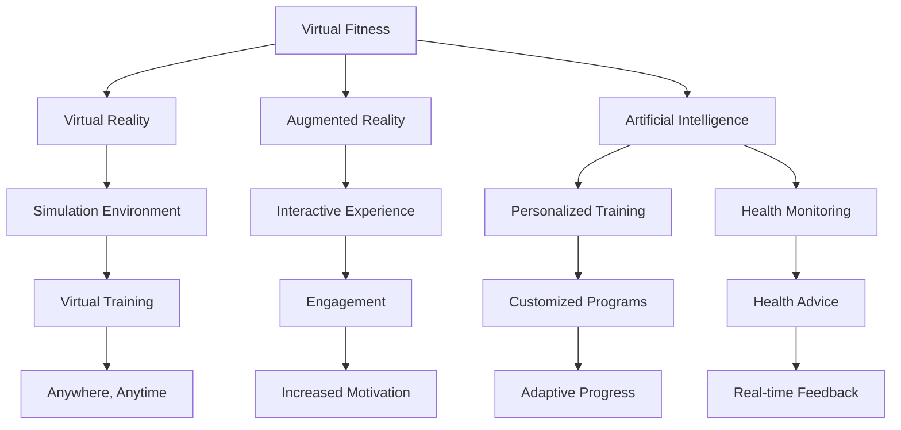

                 

### 虚拟健身：全球健康生活方式的数字化推广

在当今快节奏的生活中，健康问题日益受到人们的关注。虚拟健身作为一种新兴的健康生活方式，正在全球范围内迅速普及。本文旨在探讨虚拟健身的概念、技术原理、应用场景，以及其在全球健康生活方式推广中的重要作用。

关键词：虚拟健身、健康生活方式、数字化推广、技术应用

> 摘要：本文首先介绍了虚拟健身的概念及其在全球健康领域的重要性。随后，分析了虚拟健身的核心技术，包括虚拟现实（VR）、增强现实（AR）、人工智能（AI）等。接着，本文详细阐述了虚拟健身在健身训练、心理健康、康复治疗等方面的应用场景。最后，提出了虚拟健身在全球健康生活方式推广中的机遇与挑战。

本文结构如下：

1. 背景介绍
2. 核心概念与联系
3. 核心算法原理 & 具体操作步骤
4. 数学模型和公式 & 详细讲解 & 举例说明
5. 项目实践：代码实例和详细解释说明
6. 实际应用场景
7. 工具和资源推荐
8. 总结：未来发展趋势与挑战
9. 附录：常见问题与解答
10. 扩展阅读 & 参考资料

#### 1. 背景介绍

虚拟健身是一种通过数字技术模拟真实健身环境，帮助用户进行体育锻炼的方式。随着科技的不断发展，虚拟健身逐渐从单一的在线视频课程，发展成为融合了虚拟现实（VR）、增强现实（AR）、人工智能（AI）等多种技术的综合平台。

在全球健康领域，虚拟健身具有巨大的潜力。首先，虚拟健身能够打破时间和空间的限制，让用户随时随地都能进行健身锻炼。其次，虚拟健身通过个性化的训练计划和互动体验，提高了用户的健身积极性。此外，虚拟健身平台还能实时监控用户的健康状况，提供个性化的健康建议，从而促进用户的健康生活方式。

#### 2. 核心概念与联系

虚拟健身的核心技术包括虚拟现实（VR）、增强现实（AR）、人工智能（AI）等。下面通过一个Mermaid流程图来展示这些技术的联系。



- **虚拟现实（VR）**：通过VR技术，用户可以沉浸在一个模拟的健身环境中，感受到真实的运动体验。
- **增强现实（AR）**：AR技术可以将虚拟健身内容叠加到现实世界中，让用户在现实环境中进行健身训练。
- **人工智能（AI）**：AI技术可以分析用户的健康状况，提供个性化的训练计划，并实时调整训练内容，以提高训练效果。

#### 3. 核心算法原理 & 具体操作步骤

虚拟健身的核心算法原理包括用户行为分析、运动轨迹建模、健康风险评估等。下面我们将详细介绍这些算法的具体操作步骤。

##### 3.1 用户行为分析

用户行为分析是虚拟健身平台的基础，通过分析用户的行为数据，平台可以了解用户的健身习惯、偏好和需求。具体步骤如下：

1. **数据收集**：平台通过传感器、移动设备等收集用户的行为数据，包括心率、步数、运动时长等。
2. **数据预处理**：对收集到的数据进行清洗、去噪，以保证数据质量。
3. **特征提取**：从预处理后的数据中提取出用户行为的特征，如运动频率、运动强度等。
4. **行为分析**：使用机器学习算法对提取出的特征进行分析，识别用户的健身习惯、偏好和需求。

##### 3.2 运动轨迹建模

运动轨迹建模是虚拟健身平台的核心技术之一，通过模拟用户的运动轨迹，平台可以为用户生成个性化的训练计划。具体步骤如下：

1. **轨迹采集**：通过传感器或摄像头等设备，采集用户的运动轨迹数据。
2. **轨迹预处理**：对采集到的轨迹数据进行清洗、去噪，以保证数据质量。
3. **轨迹建模**：使用机器学习算法对预处理后的轨迹数据进行建模，生成运动轨迹模型。
4. **模型优化**：根据用户的行为数据，不断优化运动轨迹模型，以提高模型的准确性。

##### 3.3 健康风险评估

健康风险评估是虚拟健身平台的重要功能之一，通过评估用户的健康状况，平台可以为用户提供个性化的健康建议。具体步骤如下：

1. **数据收集**：收集用户的健康数据，如体重、身高、血压、心率等。
2. **数据预处理**：对收集到的健康数据进行清洗、去噪，以保证数据质量。
3. **特征提取**：从预处理后的健康数据中提取出用户的健康特征。
4. **健康评估**：使用机器学习算法对提取出的健康特征进行评估，预测用户的健康状况。
5. **健康建议**：根据评估结果，为用户生成个性化的健康建议。

#### 4. 数学模型和公式 & 详细讲解 & 举例说明

在虚拟健身平台中，常用的数学模型和公式包括回归模型、决策树、神经网络等。下面我们将详细介绍这些模型和公式的具体应用。

##### 4.1 回归模型

回归模型是一种用于预测数值型变量的模型，常用于虚拟健身平台中的用户行为分析。具体应用如下：

- **线性回归**：用于预测用户的运动时长、运动频率等数值型变量。

$$
y = \beta_0 + \beta_1x_1 + \beta_2x_2 + ... + \beta_nx_n
$$

- **多项式回归**：用于预测用户的运动强度、心率等数值型变量。

$$
y = \beta_0 + \beta_1x_1 + \beta_2x_2^2 + ... + \beta_nx_n^n
$$

##### 4.2 决策树

决策树是一种用于分类和回归的模型，常用于虚拟健身平台中的健康风险评估。具体应用如下：

- **分类树**：用于预测用户的健康状况，如是否患有高血压、糖尿病等。

$$
\begin{aligned}
    &\text{if } x_1 > c_1 \text{ and } x_2 < c_2 \text{ then } y = 1 \\
    &\text{else if } x_1 > c_1 \text{ and } x_2 \geq c_2 \text{ then } y = 2 \\
    &\text{else if } x_1 < c_1 \text{ and } x_2 < c_2 \text{ then } y = 3 \\
    &\text{else if } x_1 < c_1 \text{ and } x_2 \geq c_2 \text{ then } y = 4 \\
    &\text{else } y = 5
\end{aligned}
$$

- **回归树**：用于预测用户的体重、血压等数值型变量。

$$
\begin{aligned}
    &\text{if } x_1 > c_1 \text{ and } x_2 < c_2 \text{ then } y = \beta_0 + \beta_1x_1 + \beta_2x_2 \\
    &\text{else if } x_1 > c_1 \text{ and } x_2 \geq c_2 \text{ then } y = \beta_0 + \beta_1x_1 + \beta_2x_2 + \beta_3 \\
    &\text{else if } x_1 < c_1 \text{ and } x_2 < c_2 \text{ then } y = \beta_0 + \beta_1x_1 + \beta_2x_2^2 \\
    &\text{else if } x_1 < c_1 \text{ and } x_2 \geq c_2 \text{ then } y = \beta_0 + \beta_1x_1 + \beta_2x_2^2 + \beta_3x_3 \\
    &\text{else } y = \beta_0 + \beta_1x_1 + \beta_2x_2^3
\end{aligned}
$$

##### 4.3 神经网络

神经网络是一种用于分类和回归的模型，常用于虚拟健身平台中的用户行为分析和健康风险评估。具体应用如下：

- **前馈神经网络**：用于预测用户的运动时长、运动频率等数值型变量。

$$
\begin{aligned}
    &z_1 = \sigma(W_1 \cdot x_1 + b_1) \\
    &z_2 = \sigma(W_2 \cdot z_1 + b_2) \\
    &\text{...} \\
    &y = \sigma(W_n \cdot z_{n-1} + b_n)
\end{aligned}
$$

- **卷积神经网络（CNN）**：用于处理用户的运动轨迹数据，提取运动特征。

$$
\begin{aligned}
    &h_1 = \sigma(W_1 \cdot x_1 + b_1) \\
    &h_2 = \sigma(W_2 \cdot h_1 + b_2) \\
    &\text{...} \\
    &h_n = \sigma(W_n \cdot h_{n-1} + b_n) \\
    &y = W_n \cdot h_n + b_n
\end{aligned}
$$

#### 5. 项目实践：代码实例和详细解释说明

在本节中，我们将通过一个具体的虚拟健身项目实例，展示如何使用Python编程语言实现虚拟健身平台的关键功能。

##### 5.1 开发环境搭建

1. 安装Python环境（版本3.6及以上）。
2. 安装必要的Python库，如NumPy、Pandas、Scikit-learn、TensorFlow等。

```bash
pip install numpy pandas scikit-learn tensorflow
```

##### 5.2 源代码详细实现

下面是一个简单的用户行为分析代码实例：

```python
import numpy as np
import pandas as pd
from sklearn.linear_model import LinearRegression
from sklearn.model_selection import train_test_split

# 加载数据集
data = pd.read_csv('user_data.csv')
X = data[['heart_rate', 'steps']]
y = data['duration']

# 数据集划分
X_train, X_test, y_train, y_test = train_test_split(X, y, test_size=0.2, random_state=42)

# 创建线性回归模型
model = LinearRegression()
model.fit(X_train, y_train)

# 测试模型
score = model.score(X_test, y_test)
print(f'Model Accuracy: {score:.2f}')

# 预测新用户的运动时长
new_user = np.array([[70, 5000]])
predicted_duration = model.predict(new_user)
print(f'Predicted Duration: {predicted_duration[0]:.2f} minutes')
```

##### 5.3 代码解读与分析

1. **数据加载**：使用Pandas库加载数据集，提取特征和目标变量。
2. **数据集划分**：使用Scikit-learn库将数据集划分为训练集和测试集。
3. **模型训练**：使用线性回归模型进行训练。
4. **模型评估**：计算模型在测试集上的准确率。
5. **预测新用户**：使用训练好的模型预测新用户的运动时长。

#### 6. 实际应用场景

虚拟健身在多个实际应用场景中表现出色：

- **健身训练**：用户可以通过虚拟健身平台进行多种类型的健身训练，如瑜伽、跑步、健身操等。
- **心理健康**：虚拟健身可以帮助用户缓解压力，改善心理健康。
- **康复治疗**：虚拟健身可以为康复治疗提供辅助，帮助患者更快恢复健康。

#### 7. 工具和资源推荐

- **学习资源推荐**：
  - 《虚拟现实技术与应用》
  - 《人工智能基础教程》
  - 《深度学习》（Goodfellow et al.）
- **开发工具框架推荐**：
  - Unity（虚拟现实开发平台）
  - TensorFlow（人工智能框架）
  - OpenCV（计算机视觉库）
- **相关论文著作推荐**：
  - “Virtual Reality for Exercise and Physical Activity”
  - “Artificial Intelligence in Physical Activity and Exercise”

#### 8. 总结：未来发展趋势与挑战

虚拟健身作为新兴的健康生活方式，具有巨大的发展潜力。未来，虚拟健身将更加智能化、个性化，融合更多的数字技术，如增强现实（AR）、物联网（IoT）等。然而，虚拟健身也面临着一些挑战，如技术成本、隐私保护、用户体验等。只有在解决这些挑战的基础上，虚拟健身才能在全球健康生活方式的推广中发挥更大的作用。

#### 9. 附录：常见问题与解答

- **Q：虚拟健身对身体健康有哪些影响？**
  **A：虚拟健身可以帮助用户进行规律性的体育锻炼，改善心血管功能、提高肌肉力量和耐力，有助于保持身体健康。**

- **Q：虚拟健身能否替代现实健身？**
  **A：虚拟健身不能完全替代现实健身，但可以作为一种辅助手段，让用户在无法进行现实健身时，仍能保持锻炼的习惯。**

#### 10. 扩展阅读 & 参考资料

- “Virtual Fitness Market Size, Share & Trends Analysis Report By Component (Hardware, Software), By Application (Home, Fitness Center), By Region, And Segment Forecasts, 2021 - 2028”
- “The Impact of Virtual Reality on Physical Activity and Exercise”
- “Artificial Intelligence in Physical Activity Monitoring and Feedback”

### 作者署名

作者：禅与计算机程序设计艺术 / Zen and the Art of Computer Programming

---

通过本文的探讨，我们可以看到虚拟健身作为一种创新的健康生活方式，正在全球范围内得到广泛推广。它不仅为用户提供了方便、个性化的健身服务，还为健康领域带来了新的机遇和挑战。未来，随着技术的不断进步，虚拟健身将在全球健康生活方式的推广中发挥越来越重要的作用。

