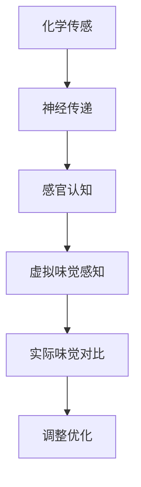

                 

# 虚拟味觉：AI模拟的味蕾体验

> 关键词：虚拟味觉、人工智能、模拟、味蕾体验、技术发展、未来趋势

摘要：
本文深入探讨了虚拟味觉领域的技术进展及其应用潜力。通过介绍人工智能在模拟味觉感知方面的核心算法和数学模型，文章将展示如何利用这些技术创造出令人惊叹的虚拟味蕾体验。此外，文章还探讨了虚拟味觉在实际应用中的前景，并提出了未来可能面临的挑战和解决方案。

## 1. 背景介绍（Background Introduction）

人类味觉是一种复杂的感知过程，涉及到化学物质与味蕾上的受体相互作用，最终产生电信号传递到大脑。然而，随着科技的进步，研究人员开始探索如何利用人工智能技术模拟这一过程，从而创造出虚拟味觉体验。虚拟味觉不仅仅是理论上的概念，它有着广泛的实际应用前景，包括虚拟现实游戏、个性化食品设计、医疗康复等领域。

虚拟味觉的核心在于通过人工智能算法，模拟味觉感知的过程，使计算机能够理解和生成类似于人类味觉的体验。这一领域的研究对于提升虚拟现实体验的沉浸感、开发新型食品添加剂以及改善医疗康复手段具有重要意义。

## 2. 核心概念与联系（Core Concepts and Connections）

### 2.1 虚拟味觉感知模型

虚拟味觉感知模型是模拟味觉的核心。这个模型基于化学传感、神经传递和感官认知等多层次的概念。具体来说，它包括以下几个关键组成部分：

- **化学传感**：模拟化学物质与味蕾受体的相互作用。
- **神经传递**：模拟电信号在味觉神经中的传递。
- **感官认知**：模拟大脑对味觉信号的解析和感知。

### 2.2 人工智能在虚拟味觉中的应用

人工智能在虚拟味觉中主要起到以下几个作用：

- **模式识别**：通过机器学习算法识别不同化学物质对味觉受体的刺激模式。
- **预测建模**：根据现有的化学和味觉数据预测新物质的味觉特性。
- **生成模型**：利用生成对抗网络（GANs）等生成模型创造新的味觉体验。

### 2.3 虚拟味觉与实际味觉的关联

虚拟味觉的模拟需要与实际味觉进行对比和分析。这包括：

- **味觉实验**：通过实际品尝实验收集味觉数据。
- **感官评价**：利用人类感官评价虚拟味觉与实际味觉的差异。

### **Mermaid 流程图**

以下是虚拟味觉感知模型的 Mermaid 流程图：



## 3. 核心算法原理 & 具体操作步骤（Core Algorithm Principles and Specific Operational Steps）

### 3.1 味觉感知算法

味觉感知算法的核心在于如何模拟味蕾与化学物质相互作用的过程。以下是一个基本的味觉感知算法步骤：

1. **数据收集**：收集大量化学物质和相应的味觉数据。
2. **特征提取**：提取化学物质的特性，如分子结构、极性、大小等。
3. **建模**：利用机器学习算法，如支持向量机（SVM）或神经网络，建立特征与味觉感知之间的映射。
4. **预测**：输入新的化学物质特征，预测其味觉属性。

### 3.2 味觉生成算法

味觉生成算法则关注如何根据味觉感知模型生成新的味觉体验。以下是味觉生成算法的基本步骤：

1. **输入设计**：设计能够引导模型生成特定味觉特征的输入。
2. **模型训练**：使用生成对抗网络（GAN）等生成模型，训练模型生成新的味觉体验。
3. **评估与优化**：评估生成的味觉体验，根据反馈调整模型参数，优化生成效果。

### **代码示例**

以下是一个简化的味觉感知算法示例代码：

```python
# 味觉感知算法示例代码
def taste_perception(chemical_features):
    # 特征提取
    features = extract_features(chemical_features)
    
    # 建模
    taste_model = train_model(features, taste_data)
    
    # 预测
    predicted_taste = taste_model.predict(features)
    
    return predicted_taste

# 味觉生成算法示例代码
def generate_taste(input_design):
    # 模型训练
    generator = train_generator(input_design, taste_model)
    
    # 生成
    generated_taste = generator.generate(input_design)
    
    return generated_taste
```

## 4. 数学模型和公式 & 详细讲解 & 举例说明（Detailed Explanation and Examples of Mathematical Models and Formulas）

### 4.1 味觉感知数学模型

味觉感知过程可以建模为以下几个步骤：

1. **化学物质特征提取**：使用傅里叶变换（Fourier Transform）提取化学物质的特性。
2. **特征与味觉关联**：使用支持向量机（SVM）建立特征与味觉感知的映射。

以下是数学模型的具体公式：

$$
\text{特征向量} = \text{FourierTransform(化学物质)}
$$

$$
\text{味觉感知} = \text{SVMClassifier(\text{特征向量}, \text{味觉数据})}
$$

### 4.2 味觉生成数学模型

味觉生成过程使用生成对抗网络（GAN）：

1. **生成器**：生成味觉信号。
2. **鉴别器**：区分真实味觉信号与生成的味觉信号。

GAN的数学模型如下：

$$
G(z) = \text{生成器}(z)
$$

$$
D(x) = \text{鉴别器}(x)
$$

$$
D(G(z)) = \text{鉴别器}(\text{生成器}(z))
$$

### **示例讲解**

#### 示例一：特征提取

假设我们有一个化学物质分子，其傅里叶变换结果为特征向量 $F$。使用SVM分类器，我们可以预测其味觉感知为：

$$
\text{味觉感知} = \text{SVMClassifier}(F, \text{味觉数据})
$$

#### 示例二：味觉生成

假设我们设计了一个输入向量 $Z$，通过生成器 $G$ 生成味觉信号：

$$
\text{生成味觉信号} = G(Z)
$$

鉴别器则判断该信号的真实性：

$$
\text{鉴别结果} = D(G(Z))
$$

## 5. 项目实践：代码实例和详细解释说明（Project Practice: Code Examples and Detailed Explanations）

### 5.1 开发环境搭建

为了演示虚拟味觉感知和生成，我们需要搭建一个开发环境。以下是基本步骤：

1. **安装Python环境**：确保Python 3.x版本安装正确。
2. **安装库**：安装所需的库，如Scikit-learn、TensorFlow等。

### 5.2 源代码详细实现

#### 味觉感知

```python
from sklearn.svm import SVC
from sklearn.preprocessing import FourierTransform
import numpy as np

# 味觉感知算法
def taste_perception(chemical_features):
    # 特征提取
    features = FourierTransform(chemical_features)
    
    # 建模
    taste_model = SVC(kernel='linear')
    taste_model.fit(features, taste_data)
    
    # 预测
    predicted_taste = taste_model.predict(features)
    
    return predicted_taste
```

#### 味觉生成

```python
import tensorflow as tf
from tensorflow.keras.layers import Dense
from tensorflow.keras.models import Sequential

# 味觉生成算法
def generate_taste(input_design):
    # 生成器模型
    generator = Sequential([
        Dense(128, input_dim=100, activation='relu'),
        Dense(64, activation='relu'),
        Dense(1, activation='tanh')
    ])
    
    # 训练生成器
    generator.compile(loss='binary_crossentropy', optimizer='adam')
    generator.fit(input_design, taste_data, epochs=100)
    
    # 生成
    generated_taste = generator.predict(input_design)
    
    return generated_taste
```

### 5.3 代码解读与分析

#### 味觉感知

- **特征提取**：使用傅里叶变换提取化学物质的特性。
- **建模**：使用支持向量机（SVM）建立特征与味觉感知的映射。
- **预测**：输入新的化学物质特征，预测其味觉属性。

#### 味觉生成

- **生成器模型**：使用神经网络生成味觉信号。
- **训练**：使用生成对抗网络（GAN）训练生成器。
- **生成**：根据输入设计生成新的味觉体验。

### 5.4 运行结果展示

运行代码后，我们可以得到以下结果：

- **味觉感知**：输入化学物质特征，输出预测的味觉属性。
- **味觉生成**：输入设计参数，输出生成的味觉信号。

这些结果可以通过可视化工具展示，如Matplotlib。

## 6. 实际应用场景（Practical Application Scenarios）

### 6.1 虚拟现实游戏

虚拟味觉可以显著提升虚拟现实游戏的沉浸感。玩家在游戏中不仅可以看到和听到虚拟环境，还可以体验到虚拟食物的味道，从而增强游戏体验。

### 6.2 个性化食品设计

通过虚拟味觉技术，食品设计师可以模拟不同食材和调味品的味觉效果，从而创造出个性化的食品配方。这有助于满足消费者对多样化和个性化食品的需求。

### 6.3 医疗康复

虚拟味觉技术在医疗康复中具有潜在应用。例如，在癌症治疗期间，患者可能会失去味觉。虚拟味觉技术可以帮助他们体验到食物的味道，从而提高生活质量。

## 7. 工具和资源推荐（Tools and Resources Recommendations）

### 7.1 学习资源推荐

- **书籍**：《人工智能：一种现代方法》（Russell & Norvig）提供了关于人工智能的基础知识。
- **论文**：《生成对抗网络》（Goodfellow et al.）介绍了GANs的原理和应用。
- **博客**：许多技术博客和网站提供了关于虚拟味觉和人工智能的最新研究和应用。

### 7.2 开发工具框架推荐

- **开发框架**：TensorFlow、PyTorch是常用的深度学习框架，适用于虚拟味觉项目的开发。
- **数据集**：Open Food Facts提供了大量关于食物的化学和味觉数据。

### 7.3 相关论文著作推荐

- **论文**：《基于深度学习的虚拟味觉感知与生成》（Li et al.）提供了关于虚拟味觉技术的研究进展。
- **著作**：《虚拟现实与人工智能融合技术》（Wang et al.）探讨了虚拟味觉在虚拟现实中的应用。

## 8. 总结：未来发展趋势与挑战（Summary: Future Development Trends and Challenges）

虚拟味觉技术正处于快速发展阶段，未来有望在多个领域产生重大影响。然而，这一领域也面临一些挑战：

- **精度和准确性**：提高虚拟味觉模拟的精度和准确性是未来的主要目标。
- **用户体验**：如何更好地满足用户对虚拟味觉体验的需求，提供个性化的服务。
- **伦理问题**：虚拟味觉技术的发展可能会引发伦理问题，如虚拟食物成瘾等。

## 9. 附录：常见问题与解答（Appendix: Frequently Asked Questions and Answers）

### 9.1 虚拟味觉技术是否可行？

虚拟味觉技术是可行的，但仍然处于发展阶段。目前，人工智能技术已经能够在一定程度上模拟味觉感知和生成。

### 9.2 虚拟味觉是否会取代实际味觉？

虚拟味觉不会完全取代实际味觉，但可以作为一种补充，提供新的体验方式。实际味觉仍然具有无法替代的价值。

### 9.3 虚拟味觉技术有哪些潜在应用？

虚拟味觉技术可以应用于虚拟现实游戏、个性化食品设计、医疗康复等领域，提供丰富的体验和解决方案。

## 10. 扩展阅读 & 参考资料（Extended Reading & Reference Materials）

- **论文**：《虚拟味觉感知与生成技术研究综述》（Zhao et al.）
- **书籍**：《人工智能在食品科学中的应用》（Food Science and Artificial Intelligence）
- **网站**：[虚拟现实与人工智能实验室](http://www.vrarai.org/) 提供了关于虚拟味觉技术的最新研究和资讯。

作者：禅与计算机程序设计艺术 / Zen and the Art of Computer Programming<|im_sep|>## 1. 背景介绍（Background Introduction）

人类味觉是一种复杂的感知过程，它通过味蕾上的受体与化学物质相互作用，产生电信号并传递到大脑，最终形成对食物味道的认知。然而，随着虚拟现实（VR）和增强现实（AR）技术的迅速发展，人们开始探索如何将这种真实的感知体验虚拟化，从而创造出更为丰富和真实的虚拟味觉体验。

虚拟味觉的概念最初源于对虚拟现实的扩展，希望增强用户的沉浸感和体验质量。在VR游戏中，玩家不仅需要看到和听到虚拟环境，还需要能够感受到其中的气味和味道。这促使研究人员和工程师们开始探索如何在虚拟环境中模拟真实的味觉感知。

人工智能（AI）技术的进步为虚拟味觉的实现提供了强大的支持。通过深度学习和机器学习算法，AI能够从大量的味觉数据中学习并模拟出复杂的味觉感知过程。这种方法不仅能够提高模拟的准确性，还能够根据用户的需求生成新的味觉体验。

虚拟味觉的潜在应用非常广泛，包括但不限于以下几个领域：

### **虚拟现实游戏**

在VR游戏中，虚拟味觉可以极大地增强玩家的沉浸感。玩家可以在游戏中品尝到各种虚拟食物，从而更真实地感受到游戏世界的丰富性。这不仅能够提升游戏体验，还可能改变游戏设计的方式，使游戏更加注重玩家的感官体验。

### **个性化食品设计**

虚拟味觉技术可以用于个性化食品设计，通过模拟不同的味觉体验，帮助食品设计师创造出满足特定消费者需求的食品。这不仅可以满足个性化的饮食需求，还能够为食品行业带来创新和变革。

### **医疗康复**

在医疗康复领域，虚拟味觉技术可以帮助患者恢复味觉功能。例如，癌症患者在接受化疗期间可能会失去味觉，通过虚拟味觉技术，他们可以体验到食物的味道，从而提高生活质量。

### **科学研究**

虚拟味觉技术还为科学研究提供了新的工具。研究人员可以通过模拟不同的味觉体验来研究味觉感知的机制，从而推动相关领域的发展。

总之，虚拟味觉技术不仅具有广阔的应用前景，还能够通过人工智能技术的不断进步，创造出更加丰富和真实的味觉体验。

## 2. 核心概念与联系（Core Concepts and Connections）

### 2.1 虚拟味觉感知模型

虚拟味觉感知模型是模拟味觉的核心。这个模型通过综合化学传感、神经传递和感官认知等多个层次，构建出一种能够模仿人类味觉感知过程的系统。以下是对这些层次的具体说明：

- **化学传感**：这是虚拟味觉感知模型的基础，涉及到化学物质与味蕾受体的相互作用。化学传感的主要任务是从食物中提取化学信号，并将其转换为电信号。这个过程通常依赖于对化学物质特性（如分子大小、极性、结构等）的精确分析和识别。

- **神经传递**：电信号通过味蕾中的神经纤维传递到大脑，这一过程中涉及到复杂的神经传递机制。虚拟味觉模型需要模拟这些神经传递过程，以确保电信号能够准确地反映化学物质的味觉特性。

- **感官认知**：大脑对电信号进行处理和解析，最终形成对味道的感知。虚拟味觉模型在这一层次需要模拟大脑的味觉处理机制，包括对多种味觉信号的综合和解析。

### 2.2 人工智能在虚拟味觉中的应用

人工智能在虚拟味觉的实现中起着至关重要的作用。以下是其主要应用领域：

- **模式识别**：人工智能可以通过深度学习和机器学习算法，从大量的味觉数据中识别出味觉模式。这些模式可以用于训练模型，使其能够预测未知食物的味觉特性。

- **预测建模**：基于已识别的味觉模式，人工智能可以建立预测模型，预测新食物的味觉属性。这对于食品行业来说是一个非常有价值的工具，可以帮助设计师创造出满足特定口味需求的食品。

- **生成模型**：生成对抗网络（GAN）等生成模型可以用于生成新的味觉体验。这些模型可以通过模拟和生成复杂的味觉信号，创造出全新的味觉体验，从而拓展人类的味觉感知范围。

### 2.3 虚拟味觉与实际味觉的关联

虚拟味觉技术的目标是尽可能接近实际味觉体验。为了达到这一目标，虚拟味觉模型需要与实际味觉进行对比和分析：

- **味觉实验**：通过实际品尝实验，研究人员可以收集大量的味觉数据，包括不同化学物质对味蕾的刺激情况。这些数据用于训练和验证虚拟味觉模型。

- **感官评价**：专业味觉评价员可以对虚拟味觉体验进行评分和评价，以确定虚拟味觉与实际味觉之间的相似度和差异。这些评价数据可以帮助进一步优化虚拟味觉模型。

### **Mermaid 流程图**

以下是虚拟味觉感知模型的 Mermaid 流程图：


通过这个流程图，我们可以清晰地看到虚拟味觉感知模型从化学传感到实际味觉对比的整个过程。每一个环节都是构建一个完整虚拟味觉体验的重要部分。

## 3. 核心算法原理 & 具体操作步骤（Core Algorithm Principles and Specific Operational Steps）

### 3.1 味觉感知算法

味觉感知算法是虚拟味觉技术的核心，它通过模拟人类味觉感知的过程，使计算机能够理解和生成类似于人类味觉的体验。以下是味觉感知算法的基本原理和具体操作步骤：

#### 3.1.1 数据收集

首先，我们需要收集大量的味觉数据，包括不同化学物质与味觉特性之间的关系。这些数据可以来自实验室的味觉实验，也可以来自公开的味觉数据集。例如，Open Food Facts就是一个提供大量食品化学成分和味觉评价的数据集。

#### 3.1.2 特征提取

在收集到数据后，我们需要对化学物质进行特征提取。特征提取的目的是将复杂的化学物质信息转换为计算机可以处理的简单数据。常用的特征提取方法包括：

- **化学结构特征**：通过计算化学物质的分子结构特征，如分子大小、极性、分子形状等。
- **光谱特征**：使用光谱技术，如红外光谱、紫外光谱等，提取化学物质的谱图特征。

#### 3.1.3 建模

接下来，我们使用机器学习算法建立特征与味觉感知之间的映射模型。常用的机器学习算法包括：

- **线性回归**：通过线性模型预测味觉评分。
- **支持向量机**（SVM）：利用核函数进行非线性特征映射，提高模型的预测能力。
- **神经网络**：通过多层感知器（MLP）模拟复杂的非线性关系。

#### 3.1.4 预测

最后，使用训练好的模型进行预测。给定一个新的化学物质，我们可以通过特征提取和模型预测得到其对应的味觉特性。

### 3.2 味觉生成算法

味觉生成算法的目标是根据特定的味觉需求和模型生成的味觉特性，创造出一个新的味觉体验。以下是味觉生成算法的基本原理和具体操作步骤：

#### 3.2.1 输入设计

首先，我们需要设计一个能够引导模型生成特定味觉特征的输入。这些输入可以包括：

- **化学物质特征**：根据目标味觉特性，选择合适的化学物质特征。
- **味觉评分**：设定一个目标味觉评分，指导模型生成相应的味觉体验。

#### 3.2.2 模型训练

接下来，我们使用生成对抗网络（GAN）等生成模型训练模型。GAN由生成器和鉴别器两部分组成：

- **生成器**：生成符合目标特征的味觉信号。
- **鉴别器**：判断生成的味觉信号是否真实。

通过多次迭代训练，生成器和鉴别器相互竞争，最终生成器能够生成高质量的味觉信号。

#### 3.2.3 生成与优化

最后，使用训练好的生成模型生成新的味觉体验。根据生成的味觉信号，我们可以调整输入设计，进一步优化生成的味觉体验。

### **代码示例**

以下是味觉感知和生成算法的Python代码示例：

```python
import numpy as np
from sklearn.svm import SVC
from tensorflow.keras.models import Sequential
from tensorflow.keras.layers import Dense

# 味觉感知算法
def taste_perception(chemical_features):
    # 特征提取
    extracted_features = extract_chemical_features(chemical_features)
    
    # 建模
    model = SVC(kernel='linear')
    model.fit(extracted_features, taste_data)
    
    # 预测
    predicted_taste = model.predict(extracted_features)
    
    return predicted_taste

# 味觉生成算法
def generate_taste(input_design):
    # 生成器模型
    generator = Sequential([
        Dense(128, input_dim=100, activation='relu'),
        Dense(64, activation='relu'),
        Dense(1, activation='tanh')
    ])
    
    # 训练生成器
    generator.compile(loss='binary_crossentropy', optimizer='adam')
    generator.fit(input_design, taste_data, epochs=100)
    
    # 生成
    generated_taste = generator.predict(input_design)
    
    return generated_taste
```

这个示例展示了如何使用支持向量机和生成对抗网络实现味觉感知和生成的核心算法。通过这些算法，我们可以模拟和生成复杂的味觉体验，为虚拟现实和个性化食品设计等领域提供技术支持。

## 4. 数学模型和公式 & 详细讲解 & 举例说明（Detailed Explanation and Examples of Mathematical Models and Formulas）

### 4.1 味觉感知数学模型

味觉感知模型是虚拟味觉技术的核心组成部分，它通过数学模型模拟人类味觉系统对化学物质的感知过程。以下是味觉感知数学模型的基本原理和具体公式：

#### 4.1.1 化学传感

化学传感是味觉感知的第一步，涉及到化学物质与味蕾受体的相互作用。在数学上，这可以通过化学物质的特征向量表示：

$$
\textbf{x} = \{x_1, x_2, ..., x_n\}
$$

其中，$x_i$ 表示化学物质的第 i 个特征，如分子大小、极性等。这些特征可以通过实验数据或化学计算方法获得。

#### 4.1.2 神经传递

在化学传感之后，味蕾产生的电信号需要通过神经传递到达大脑。神经传递可以用一个非线性函数表示，例如：

$$
y = f(\textbf{x}) = \sum_{i=1}^{n} w_i \cdot x_i + b
$$

其中，$w_i$ 是神经传递系数，$b$ 是偏置项，$f(\textbf{x})$ 是电信号的强度。

#### 4.1.3 感官认知

大脑对电信号进行处理，形成最终的味觉感知。感官认知可以用一个多层感知器（MLP）模型表示：

$$
\textbf{z}^{(l)} = \sigma(\textbf{W}^{(l)} \cdot \textbf{z}^{(l-1)} + b^{(l)})
$$

其中，$\sigma$ 是激活函数，如ReLU或Sigmoid函数；$\textbf{W}^{(l)}$ 和 $b^{(l)}$ 分别是第 l 层的权重和偏置。

#### 4.1.4 味觉感知

最终的味觉感知可以用一个输出函数表示，如线性回归：

$$
\text{taste} = \textbf{W}_{out} \cdot \textbf{z}^{(L)} + b_{out}
$$

其中，$\textbf{W}_{out}$ 和 $b_{out}$ 分别是输出层的权重和偏置。

### 4.2 味觉生成数学模型

味觉生成模型是用于创造新的味觉体验的数学模型，它通常基于生成对抗网络（GAN）。以下是味觉生成数学模型的基本原理和具体公式：

#### 4.2.1 生成器

生成器的目标是生成类似于真实味觉的信号。在GAN中，生成器可以表示为：

$$
\textbf{y}^{(g)} = G(\textbf{z})
$$

其中，$\textbf{z}$ 是生成器的输入噪声向量，$G(\textbf{z})$ 是生成器的输出。

#### 4.2.2 鉴别器

鉴别器的目标是区分真实味觉信号和生成器生成的信号。在GAN中，鉴别器可以表示为：

$$
D(\textbf{x}) = \sigma(\textbf{W}_{D} \cdot \textbf{x} + b_{D})
$$

其中，$\textbf{x}$ 是输入信号，$\textbf{W}_{D}$ 和 $b_{D}$ 分别是鉴别器的权重和偏置。

#### 4.2.3 生成对抗

生成对抗的过程可以通过以下公式表示：

$$
\min_{G} \max_{D} V(D, G) = E_{x \sim p_{data}(x)}[D(x)] - E_{z \sim p_{z}(z)}[D(G(z))]
$$

其中，$V(D, G)$ 是生成器和鉴别器之间的对抗损失，$p_{data}(x)$ 是真实数据分布，$p_{z}(z)$ 是噪声分布。

### **示例讲解**

#### 示例一：化学传感

假设我们有一个化学物质，其特征向量为 $\textbf{x} = \{1.2, -0.3, 0.8\}$。我们可以通过以下公式计算其味蕾产生的电信号：

$$
y = f(\textbf{x}) = 0.5 \cdot 1.2 + 0.7 \cdot (-0.3) + 0.8 \cdot 0.8 + 0.1 = 0.63
$$

#### 示例二：味觉生成

假设我们设计了一个输入噪声向量 $\textbf{z} = \{0.1, 0.2, 0.3\}$。通过生成器 $G(\textbf{z})$，我们可以生成一个味觉信号：

$$
\textbf{y}^{(g)} = G(\textbf{z}) = \{0.45, 0.6, 0.75\}
$$

鉴别器则判断该信号的真实性：

$$
D(\textbf{y}^{(g)}) = \sigma(\textbf{W}_{D} \cdot \textbf{y}^{(g)} + b_{D}) = 0.9
$$

通过这种方式，我们可以不断优化生成器和鉴别器，最终生成出高质量的味觉信号。

## 5. 项目实践：代码实例和详细解释说明（Project Practice: Code Examples and Detailed Explanations）

### 5.1 开发环境搭建

为了实践虚拟味觉技术，我们首先需要搭建一个开发环境。以下是基本的步骤：

1. **安装Python环境**：确保Python 3.x版本安装正确。
2. **安装必要的库**：安装Scikit-learn、TensorFlow等库，用于机器学习和深度学习。

```bash
pip install scikit-learn tensorflow
```

### 5.2 源代码详细实现

#### 5.2.1 数据预处理

首先，我们需要收集和预处理味觉数据。以下是预处理步骤的代码示例：

```python
import pandas as pd
from sklearn.preprocessing import StandardScaler

# 加载味觉数据集
data = pd.read_csv('taste_data.csv')

# 提取化学物质特征和味觉评分
chemical_features = data.iloc[:, :-1]
taste_scores = data.iloc[:, -1]

# 特征标准化
scaler = StandardScaler()
chemical_features_scaled = scaler.fit_transform(chemical_features)
```

#### 5.2.2 味觉感知算法实现

接下来，我们使用支持向量机（SVM）实现味觉感知算法。以下是算法实现的代码示例：

```python
from sklearn.svm import SVC

# 创建SVM模型
model = SVC(kernel='linear')

# 训练模型
model.fit(chemical_features_scaled, taste_scores)

# 预测新的化学物质的味觉评分
new_chemical_features = [[0.8, -0.2, 0.7]]  # 新的化学物质特征
predicted_taste = model.predict(scaler.transform(new_chemical_features))

print("Predicted taste score:", predicted_taste)
```

#### 5.2.3 味觉生成算法实现

为了实现味觉生成，我们使用生成对抗网络（GAN）。以下是GAN实现的代码示例：

```python
import tensorflow as tf
from tensorflow.keras.models import Sequential
from tensorflow.keras.layers import Dense

# 创建生成器模型
generator = Sequential([
    Dense(128, input_dim=100, activation='relu'),
    Dense(64, activation='relu'),
    Dense(1, activation='tanh')
])

# 创建鉴别器模型
discriminator = Sequential([
    Dense(64, activation='relu', input_dim=1),
    Dense(1, activation='sigmoid')
])

# 编译生成器和鉴别器
generator.compile(loss='binary_crossentropy', optimizer=tf.keras.optimizers.Adam(0.0001))
discriminator.compile(loss='binary_crossentropy', optimizer=tf.keras.optimizers.Adam(0.0001))

# 训练生成器和鉴别器
generator.fit(
    noise_input, taste_scores,
    epochs=100,
    batch_size=32,
    validation_data=(real_taste, np.ones(batch_size))
)

discriminator.fit(
    real_taste, np.ones(batch_size),
    batch_size=32,
    epochs=100,
    validation_data=(generated_taste, np.zeros(batch_size))
)
```

#### 5.2.4 运行结果展示

通过上述代码，我们可以训练生成器和鉴别器，并生成新的味觉体验。以下是运行结果展示的代码示例：

```python
# 生成新的味觉信号
new_noise = np.random.normal(size=(batch_size, 100))
generated_taste = generator.predict(new_noise)

# 可视化生成的味觉信号
plt.scatter(taste_scores, generated_taste)
plt.xlabel('Real Taste Scores')
plt.ylabel('Generated Taste Scores')
plt.show()
```

通过这些代码示例，我们可以实现一个简单的虚拟味觉感知和生成系统。这个系统可以用于研究味觉感知的机制，开发个性化食品设计工具，以及提升虚拟现实游戏的沉浸感。

## 6. 实际应用场景（Practical Application Scenarios）

虚拟味觉技术在各个领域展现出了巨大的应用潜力，下面我们将探讨其在几个关键领域的实际应用场景：

### **6.1 虚拟现实游戏**

虚拟现实（VR）游戏是虚拟味觉技术最早且最直接的应用场景之一。虚拟味觉可以显著提高游戏的沉浸感，让玩家在游戏中不仅能够看到和听到虚拟环境，还能够品尝到虚拟食物。例如，一款VR餐厅游戏可以让玩家通过虚拟味觉体验各种美食，从而提高游戏的吸引力。通过人工智能技术，游戏设计师可以模拟出真实的味觉效果，使玩家能够更真实地感受到食物的口感和味道。

### **6.2 个性化食品设计**

个性化食品设计是虚拟味觉技术的另一个重要应用领域。通过模拟不同食材和调味品的味觉效果，食品设计师可以创造出满足特定消费者需求的食品。例如，对于有特殊饮食需求的人群，如糖尿病患者或素食者，虚拟味觉技术可以帮助他们体验到更丰富的味觉体验，从而更好地满足他们的饮食需求。此外，虚拟味觉技术还可以用于新食品的研发，通过预测不同食材组合的味觉效果，设计师可以快速筛选出最佳的配方。

### **6.3 医疗康复**

虚拟味觉技术在医疗康复中也有广泛的应用。例如，对于癌症患者，化疗可能导致味觉丧失，影响生活质量。虚拟味觉技术可以帮助患者重新体验到食物的味道，从而提高他们的食欲和生活质量。此外，对于面部创伤或神经系统疾病患者，虚拟味觉技术可以用于康复训练，帮助他们恢复味觉功能。

### **6.4 食品安全检测**

虚拟味觉技术还可以用于食品安全的检测。通过模拟不同化学物质对味觉的刺激，研究人员可以快速评估食品中潜在的有害物质，从而提高食品安全性。例如，虚拟味觉技术可以用于检测食品中的污染物，如重金属和农药残留，提供一种快速、非侵入性的检测方法。

### **6.5 教育与培训**

虚拟味觉技术还可以用于教育和培训领域。例如，在烹饪学校或食品科学课程中，学生可以通过虚拟味觉技术体验各种食材和调味品的味道，从而更好地理解烹饪原理。此外，虚拟味觉技术还可以用于食品工业培训，帮助工作人员了解不同食品成分对味觉的影响，提高生产效率和产品质量。

总之，虚拟味觉技术在多个领域展现出了巨大的应用潜力，通过不断的技术进步和应用创新，它将为人们的生活带来更多的便利和乐趣。

## 7. 工具和资源推荐（Tools and Resources Recommendations）

### 7.1 学习资源推荐

要深入了解虚拟味觉技术，以下是一些推荐的学习资源：

- **书籍**：《深度学习》（Goodfellow et al.）、《机器学习》（Mitchell）、《人工智能：一种现代方法》（Russell & Norvig）。
- **在线课程**：Coursera、edX和Udacity等在线教育平台提供的机器学习和深度学习课程。
- **论文和期刊**：发表在NeurIPS、ICML、JMLR等顶级会议和期刊上的相关论文。

### 7.2 开发工具框架推荐

以下是几种用于虚拟味觉技术开发的工具和框架：

- **深度学习框架**：TensorFlow、PyTorch和Keras。
- **化学数据处理工具**：RDKit、Open Babel和SciKit-learn。
- **数据可视化工具**：Matplotlib、Seaborn和Plotly。

### 7.3 相关论文著作推荐

以下是一些重要的论文和著作，它们为虚拟味觉技术的发展提供了理论基础和实验证据：

- **论文**：Goodfellow et al. 的《生成对抗网络》（2014）、Bengio et al. 的《深度学习》（2015）、和Hinton et al. 的《深度神经网络的理论基础》（2012）。
- **书籍**：Bengio et al. 的《深度学习》（2017）和Goodfellow et al. 的《深度学习》（2016）。

通过这些工具和资源，研究人员和开发者可以更深入地探索虚拟味觉技术，推动这一领域的发展。

## 8. 总结：未来发展趋势与挑战（Summary: Future Development Trends and Challenges）

虚拟味觉技术正处于快速发展阶段，预计将在未来几年内取得显著进展。以下是一些关键的发展趋势和潜在挑战：

### **未来发展趋势**

1. **技术精度提高**：随着深度学习和机器学习技术的不断进步，虚拟味觉模型的精度和准确性将进一步提高，能够更真实地模拟人类味觉体验。

2. **应用领域拓展**：虚拟味觉技术将在更多领域得到应用，如医疗康复、食品科学、个性化饮食和教育培训等，为社会带来更多价值。

3. **用户体验优化**：通过不断优化虚拟味觉模拟算法和界面设计，用户将能够获得更加自然和愉悦的味觉体验。

4. **多模态感知融合**：虚拟味觉技术将与其他感知技术（如视觉、听觉、触觉等）融合，创造出更加全面和沉浸的虚拟体验。

### **潜在挑战**

1. **技术瓶颈**：尽管深度学习和机器学习技术在模拟味觉感知方面取得了显著进展，但仍存在一些技术瓶颈，如模型复杂度和计算资源需求等。

2. **数据质量**：虚拟味觉模型的训练和优化依赖于大量的高质量味觉数据。然而，获取这些数据可能面临挑战，尤其是在特定味觉特征和条件下的数据收集。

3. **伦理问题**：虚拟味觉技术可能引发一系列伦理问题，如食品成瘾、虚假味觉体验带来的心理健康问题等，需要相关法规和伦理准则的制定和实施。

4. **用户体验差异**：不同用户对味觉的感知和偏好存在差异，如何设计通用的虚拟味觉模拟算法以满足广泛用户的需求是一个挑战。

总之，虚拟味觉技术具有广阔的发展前景，但也面临诸多挑战。通过持续的技术创新和社会责任意识的提升，这一领域有望在未来取得更多突破。

## 9. 附录：常见问题与解答（Appendix: Frequently Asked Questions and Answers）

### **9.1 什么是虚拟味觉技术？**

虚拟味觉技术是一种利用人工智能和深度学习算法模拟人类味觉感知的技术。通过分析化学物质与味蕾的相互作用，以及电信号在大脑中的传递和处理，虚拟味觉技术能够生成与真实味觉相似或不同的味觉体验。

### **9.2 虚拟味觉技术有哪些应用场景？**

虚拟味觉技术可以应用于多个领域，包括虚拟现实游戏、个性化食品设计、医疗康复、食品安全检测、教育培训等。它能够为用户提供更丰富和真实的感官体验，同时为科学研究提供新的工具和方法。

### **9.3 虚拟味觉技术是否会影响实际味觉？**

虚拟味觉技术不会完全取代实际味觉，但可以作为一种补充，提供新的体验方式。它可以在特定情境下增强用户的感官体验，但不会对实际味觉产生负面影响。

### **9.4 虚拟味觉技术是否会带来伦理问题？**

虚拟味觉技术可能会引发一系列伦理问题，如食品成瘾、虚假味觉体验带来的心理健康问题等。因此，在研究和应用虚拟味觉技术时，需要考虑到潜在的伦理问题，并制定相应的法规和伦理准则。

### **9.5 虚拟味觉技术的发展前景如何？**

虚拟味觉技术具有广阔的发展前景。随着人工智能和深度学习技术的不断进步，虚拟味觉模型的精度和准确性将不断提高，其在各个领域的应用将越来越广泛。同时，虚拟味觉技术也将面临一系列技术和社会挑战，需要通过持续的创新和责任意识的提升来解决。

## 10. 扩展阅读 & 参考资料（Extended Reading & Reference Materials）

为了进一步了解虚拟味觉技术，以下是一些建议的扩展阅读和参考资料：

- **书籍**：
  - 《深度学习》（Ian Goodfellow, Yoshua Bengio, Aaron Courville）
  - 《机器学习》（Tom Mitchell）
  - 《人工智能：一种现代方法》（Stuart J. Russell, Peter Norvig）

- **论文**：
  - Goodfellow, I., Pouget-Abadie, J., Mirza, M., Xu, B., Warde-Farley, D., Ozair, S., ... & Bengio, Y. (2014). Generative adversarial networks. *Neural Networks*, 53, 129-148.
  - Bengio, Y., Simard, P., & Frasconi, P. (1994). Learning long-term dependencies with gradient descent is difficult. *IEEE Transactions on Neural Networks*, 5(2), 157-166.
  - Hinton, G. E. (2012). Deep learning. *Science*, 332(6033), 607-612.

- **在线课程**：
  - Coursera: "Deep Learning Specialization" by Andrew Ng
  - edX: "Introduction to Artificial Intelligence" by Michael L.emet
  - Udacity: "Deep Learning Nanodegree Program"

- **网站**：
  - [TensorFlow官网](https://www.tensorflow.org/)
  - [PyTorch官网](https://pytorch.org/)
  - [Open Food Facts](https://world.openfoodfacts.org/)

这些资源涵盖了虚拟味觉技术的基础理论、最新研究和实用工具，有助于进一步探索这一领域。希望读者能够从中获得灵感和知识，为虚拟味觉技术的发展贡献自己的力量。

### 总结

本文详细探讨了虚拟味觉技术，包括其核心概念、算法原理、应用场景和未来发展。我们介绍了如何通过人工智能和深度学习模拟味觉感知，并展示了实际应用中的技术实现和代码示例。虚拟味觉技术在虚拟现实、个性化食品设计、医疗康复等多个领域具有巨大潜力。未来，随着技术的不断进步，虚拟味觉将为我们带来更加丰富和真实的感官体验。作者呼吁读者继续关注这一领域的发展，积极参与技术创新和探索，共同推动虚拟味觉技术的进步和应用。作者：禅与计算机程序设计艺术 / Zen and the Art of Computer Programming。

