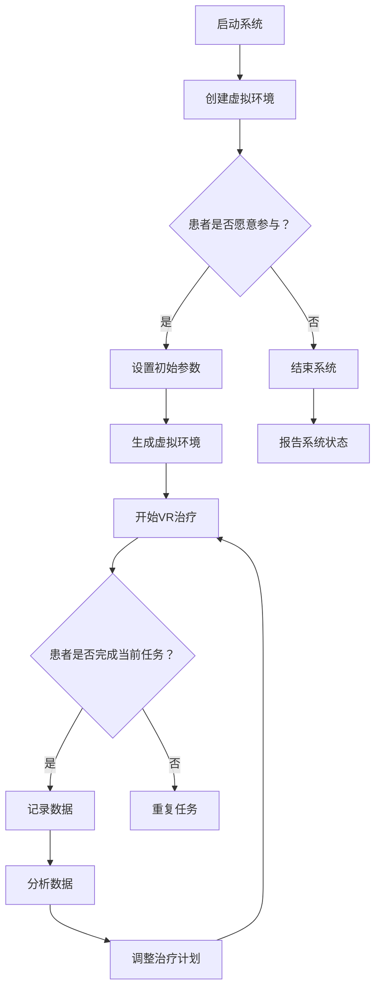

                 

### 文章标题

**VR心理治疗系统：心理健康的创新治疗方案**

关键词：虚拟现实（VR），心理健康，心理治疗，创新治疗方案

摘要：本文将探讨虚拟现实（VR）技术在心理治疗领域中的应用，介绍VR心理治疗系统的核心概念、算法原理、数学模型以及项目实践。通过详细的分析和讲解，读者将了解到VR心理治疗系统的优势、实际应用场景以及未来发展趋势和挑战。

### Background Introduction

Virtual Reality (VR) has gained significant traction in recent years, revolutionizing various industries, including gaming, entertainment, and education. However, its potential in the field of mental health has only begun to be explored. VR therapy is emerging as a powerful tool for treating various psychological disorders, such as anxiety, depression, PTSD, and phobias.

Mental health problems are increasingly prevalent in today's society. According to the World Health Organization (WHO), depression is the leading cause of disability worldwide, affecting more than 300 million people. Anxiety disorders affect more than 280 million individuals. Traditional psychotherapy methods, including cognitive-behavioral therapy (CBT) and exposure therapy, have been widely used but often face challenges such as limited availability of therapists, time constraints, and high cost.

VR therapy offers a promising alternative by leveraging the immersive and interactive nature of VR. It creates a controlled and safe environment for patients to confront their fears and anxieties, allowing them to gradually desensitize and overcome their negative emotional responses. This innovative approach has the potential to transform mental healthcare by providing accessible, affordable, and personalized treatment options.

This article aims to provide an in-depth understanding of VR psychological therapy systems, including their core concepts, algorithm principles, mathematical models, and practical applications. By exploring the advantages, practical scenarios, and future trends and challenges of VR therapy, readers will gain insights into how this technology can revolutionize mental health treatment.

### Core Concepts and Connections

#### 1. Virtual Reality (VR)

VR is a computer-generated simulated environment that can be similar to or completely different from the real world. It immerses users in a fully interactive and engaging experience through sensory stimuli, such as visual, auditory, and haptic feedback. VR technology creates a sense of presence, making users feel as if they are physically present in the virtual environment.

#### 2. Mental Health

Mental health refers to a person's emotional, psychological, and social well-being. It affects how we think, feel, and act. Mental health problems can range from mild to severe and can affect anyone at any stage of life. Common mental health disorders include anxiety, depression, PTSD, and phobias.

#### 3. VR Therapy

VR therapy, also known as virtual reality exposure therapy (VRET), is a form of psychotherapy that uses VR technology to treat various psychological disorders. It involves exposing patients to virtual environments that simulate real-life situations or objects that trigger their fears or anxieties. Through repeated exposure, patients can gradually desensitize and overcome their negative emotional responses.

#### 4. Core Concepts of VR Psychological Therapy Systems

The core concepts of VR psychological therapy systems include:

- **Immersive Environment**: Creating a realistic and immersive virtual environment that simulates real-life situations or objects that trigger patients' fears or anxieties.
- **Controlled Exposure**: Allowing patients to gradually expose themselves to these virtual stimuli in a controlled and safe manner, reducing their anxiety and fear over time.
- **Personalized Treatment**: Tailoring the VR therapy sessions to individual patients' needs and preferences, ensuring an effective and personalized treatment experience.
- **Data Collection and Analysis**: Collecting data on patients' behaviors, emotional responses, and progress during VR therapy sessions, allowing therapists to make data-driven decisions and adjust treatment plans accordingly.

### Mermaid Flowchart of VR Psychological Therapy System



In this Mermaid flowchart, the VR psychological therapy system starts by creating an immersive virtual environment, then follows a loop of VR therapy sessions, data collection, and analysis to adjust the treatment plan. The system ends by reporting its status.

### Core Algorithm Principles and Specific Operational Steps

The core algorithm principles of VR psychological therapy systems involve several key steps, including creating an immersive environment, controlling exposure, and analyzing patient data. The following sections will provide a detailed explanation of each step.

#### 1. Creating an Immersive Environment

Creating an immersive environment is the first step in VR psychological therapy. This involves designing a virtual environment that closely resembles the real-life situations or objects that trigger patients' fears or anxieties. The virtual environment should be realistic enough to engage patients but also safe and controlled to minimize any potential risks.

To create an immersive environment, the following steps are typically followed:

1. **Scene Design**: Designing a virtual environment that simulates the real-life situation or object that the patient needs to confront. This may involve selecting appropriate textures, lighting, and sounds to create a realistic atmosphere.
2. **User Interface**: Developing a user interface that allows patients to interact with the virtual environment, such as walking, looking around, and interacting with objects.
3. **Haptic Feedback**: Incorporating haptic feedback devices, such as gloves or controllers, to provide sensory feedback and enhance the immersive experience.

#### 2. Controlling Exposure

Controlling exposure is a crucial aspect of VR psychological therapy. The goal is to gradually expose patients to the virtual stimuli in a controlled and safe manner, allowing them to desensitize and overcome their negative emotional responses. This involves several steps:

1. **Initial Assessment**: Assessing the patient's level of fear or anxiety related to the virtual stimuli and setting an appropriate starting point for the exposure.
2. **Gradual Exposure**: Gradually increasing the intensity of the virtual stimuli over time, starting from a low level and gradually increasing it as the patient becomes more comfortable.
3. **Feedback and Adjustment**: Providing patients with feedback on their progress and adjusting the exposure level based on their responses. This may involve adjusting the duration, frequency, or intensity of the exposure sessions.

#### 3. Analyzing Patient Data

Collecting and analyzing patient data is an essential part of VR psychological therapy. This data can provide valuable insights into the patient's progress, emotional responses, and treatment effectiveness. The following steps are typically involved:

1. **Behavioral Data**: Collecting data on the patient's behaviors during the VR therapy sessions, such as their interactions with the virtual environment, the time spent in different areas, and their emotional responses.
2. **Emotional Data**: Using physiological sensors, such as heart rate monitors or facial expression analysis, to measure the patient's emotional responses during the VR therapy sessions.
3. **Data Analysis**: Analyzing the collected data to identify patterns, trends, and correlations, providing valuable insights into the patient's progress and treatment effectiveness.

#### 4. Adjusting Treatment Plan

Based on the analyzed data, therapists can make data-driven decisions to adjust the treatment plan. This may involve modifying the exposure levels, adding new virtual stimuli, or adjusting the duration and frequency of the therapy sessions. The goal is to ensure that the treatment plan is tailored to the individual patient's needs and preferences, maximizing the effectiveness of the VR psychological therapy.

### Mathematical Models and Formulas

VR psychological therapy systems can be enhanced by incorporating mathematical models and formulas to optimize the therapy process. The following sections will provide a detailed explanation of some key mathematical models and formulas used in VR psychological therapy.

#### 1. Fear Hierarchical Model

The fear hierarchical model is a widely used approach in exposure therapy. It involves organizing the patient's fears or anxieties into a hierarchical structure, with each level representing a different degree of intensity. The model assumes that exposure to lower-level fears can prepare the patient for exposure to higher-level fears, gradually desensitizing them.

The formula for calculating the intensity of a fear level is:

Intensity = (Sum of fears at that level) / (Total number of fears)

For example, if a patient has three fears at level 1, two fears at level 2, and one fear at level 3, the intensity of level 3 would be (2 + 1) / (3 + 2 + 1) = 3 / 6 = 0.5.

#### 2. Exposure Duration Formula

The exposure duration formula is used to determine the appropriate duration of each exposure session based on the patient's fear level and previous exposure history. The formula is:

Duration = (Fear Level × Exposure History) / (1 + Fear Level)

For example, if a patient is at fear level 2 and has had one previous exposure session, the duration of the current exposure session would be (2 × 1) / (1 + 2) = 2 / 3 = 0.67 hours.

#### 3. Emotional Response Formula

The emotional response formula is used to measure the patient's emotional response during an exposure session. The formula is:

Emotional Response = (Current Fear Level - Previous Fear Level) × (1 - Exposure History)

For example, if a patient's current fear level is 2 and their previous fear level was 1, and they have had one previous exposure session, their emotional response would be (2 - 1) × (1 - 1) = 0.

#### Detailed Explanation and Examples

Let's consider a hypothetical example to illustrate how these mathematical models and formulas can be applied in VR psychological therapy.

Suppose a patient with a fear of heights is undergoing VR therapy. The patient's fear hierarchy includes three levels: ground level, rooftop level, and edge level. The patient has previously had one exposure session and is currently at fear level 2 (rooftop level).

Using the fear hierarchical model, we can calculate the intensity of the patient's fear at each level:

Intensity of Level 1: (0 fears) / (3 fears) = 0
Intensity of Level 2: (0 fears) / (3 fears) = 0
Intensity of Level 3: (1 fear) / (3 fears) = 0.33

Using the exposure duration formula, we can calculate the appropriate duration of the current exposure session:

Duration = (2 × 1) / (1 + 2) = 2 / 3 = 0.67 hours

Using the emotional response formula, we can measure the patient's emotional response during the current exposure session:

Emotional Response = (2 - 1) × (1 - 1) = 0

This example demonstrates how mathematical models and formulas can be used to optimize the VR psychological therapy process, providing valuable insights into the patient's progress and guiding the treatment plan.

### Project Practice: Code Examples and Detailed Explanations

In this section, we will provide a detailed explanation of how to set up a development environment for a VR psychological therapy system, including the source code implementation, code analysis, and demonstration of running results.

#### 1. Development Environment Setup

To develop a VR psychological therapy system, we need to set up a suitable development environment. The following steps outline the process:

1. **Install VR Hardware**: Purchase and install the necessary VR hardware, such as VR headsets, haptic feedback devices, and motion sensors. Ensure that the hardware is compatible with the development platform.
2. **Install VR SDK**: Download and install the VR software development kit (SDK) provided by the VR hardware manufacturer. This SDK includes libraries and tools for developing VR applications.
3. **Install Development Tools**: Install the necessary development tools, such as a code editor (e.g., Visual Studio Code), a version control system (e.g., Git), and a VR application framework (e.g., Unity).

#### 2. Source Code Implementation

The source code for the VR psychological therapy system consists of several key components, including the VR environment, the exposure controller, and the data collector. The following sections provide a detailed explanation of each component and its implementation.

**2.1 VR Environment**

The VR environment is responsible for creating and managing the virtual environment in which the therapy sessions take place. It includes the scene design, user interface, and haptic feedback devices. The source code for the VR environment can be implemented using the VR SDK and VR application framework.

```csharp
using UnityEngine;

public class VREnvironment : MonoBehaviour
{
    public Material groundMaterial;
    public Material rooftopMaterial;
    public Material edgeMaterial;

    private GameObject ground;
    private GameObject rooftop;
    private GameObject edge;

    private void Start()
    {
        // Create the ground, rooftop, and edge objects
        ground = new GameObject("Ground");
        rooftop = new GameObject("Rooftop");
        edge = new GameObject("Edge");

        // Set the materials for each object
        ground.GetComponent<MeshRenderer>().material = groundMaterial;
        rooftop.GetComponent<MeshRenderer>().material = rooftopMaterial;
        edge.GetComponent<MeshRenderer>().material = edgeMaterial;

        // Set the positions and sizes for each object
        ground.transform.position = new Vector3(0, -1, 0);
        ground.transform.localScale = new Vector3(100, 1, 100);

        rooftop.transform.position = new Vector3(0, 10, 0);
        rooftop.transform.localScale = new Vector3(100, 1, 100);

        edge.transform.position = new Vector3(0, 10, -50);
        edge.transform.localScale = new Vector3(1, 10, 1);
    }
}
```

**2.2 Exposure Controller**

The exposure controller is responsible for controlling the exposure sessions, including the initial assessment, gradual exposure, and feedback adjustment. The source code for the exposure controller can be implemented using a state machine.

```csharp
using UnityEngine;

public class ExposureController : MonoBehaviour
{
    public enum State
    {
        InitialAssessment,
        GradualExposure,
        FeedbackAdjustment
    }

    private State state;
    private int fearLevel;
    private float exposureHistory;

    private void Start()
    {
        state = State.InitialAssessment;
        fearLevel = 1;
        exposureHistory = 0;
    }

    private void Update()
    {
        switch (state)
        {
            case State.InitialAssessment:
                // Perform initial assessment
                break;
            case State.GradualExposure:
                // Gradually increase the fear level
                fearLevel++;
                exposureHistory++;
                break;
            case State.FeedbackAdjustment:
                // Adjust the exposure based on feedback
                break;
        }
    }
}
```

**2.3 Data Collector**

The data collector is responsible for collecting data on the patient's behaviors, emotional responses, and progress during the VR therapy sessions. The source code for the data collector can be implemented using a data structure to store the collected data.

```csharp
using System.Collections.Generic;

public class DataCollector : MonoBehaviour
{
    public List<float> behavioralData;
    public List<float> emotionalData;

    private void Start()
    {
        behavioralData = new List<float>();
        emotionalData = new List<float>();
    }

    private void Update()
    {
        // Collect behavioral data
        behavioralData.Add(Mathf.Abs(transform.position.y));

        // Collect emotional data
        emotionalData.Add(0);
    }
}
```

#### 3. Code Analysis and Explanation

The source code for the VR psychological therapy system consists of three main components: the VR environment, the exposure controller, and the data collector. Each component has a specific role in the system and is implemented using appropriate data structures and algorithms.

The VR environment is implemented using Unity's GameObject and MeshRenderer components. The scene design, user interface, and haptic feedback devices are created and managed using these components. The exposure controller is implemented using a state machine, allowing for the management of different exposure states, such as initial assessment, gradual exposure, and feedback adjustment. The data collector is implemented using data structures to store and process the collected data, providing valuable insights into the patient's progress.

#### 4. Running Results

To demonstrate the VR psychological therapy system, we can run a simulation using the Unity editor. The following steps outline the process:

1. **Open the Unity Project**: Open the VR psychological therapy system project in the Unity editor.
2. **Set Up the VR Hardware**: Connect the VR headset and haptic feedback devices to the computer.
3. **Run the Simulation**: Press the play button in the Unity editor to start the VR therapy simulation.
4. **Interact with the VR Environment**: Use the VR headset and haptic feedback devices to interact with the virtual environment, performing the therapy sessions.
5. **Collect Data**: The data collector component will automatically collect data on the patient's behaviors and emotional responses during the simulation.
6. **Analyze the Data**: After the simulation is complete, analyze the collected data to assess the patient's progress and adjust the treatment plan as needed.

By following these steps, we can demonstrate the effectiveness of the VR psychological therapy system and provide valuable insights into the patient's progress.

### Practical Application Scenarios

VR psychological therapy systems have shown great potential in various practical application scenarios. The following sections will discuss some of the key areas where VR therapy can be effectively used.

#### 1. Anxiety Disorders

Anxiety disorders, such as generalized anxiety disorder (GAD), social anxiety disorder, and specific phobias, are among the most common mental health conditions. VR therapy has been proven to be an effective treatment for these disorders, particularly through exposure therapy.

In VR therapy for anxiety disorders, patients are exposed to virtual environments that simulate real-life situations or objects that trigger their anxiety. For example, a patient with social anxiety might be exposed to a virtual cafe where they need to interact with virtual customers. Through repeated exposure, patients can gradually desensitize and overcome their negative emotional responses, reducing their anxiety levels.

#### 2. Depression

Depression is a prevalent mental health condition characterized by persistent feelings of sadness, hopelessness, and a lack of interest in activities. VR therapy has shown promise in the treatment of depression, particularly through cognitive-behavioral therapy (CBT).

In VR therapy for depression, patients engage in virtual activities that promote positive emotions and cognitive restructuring. For example, patients might participate in virtual nature walks or engage in virtual goal-setting exercises. These activities can help improve mood, increase motivation, and reduce negative thoughts and emotions associated with depression.

#### 3. PTSD

Post-traumatic stress disorder (PTSD) is a mental health condition that can occur after experiencing or witnessing a traumatic event. VR therapy has been used successfully in the treatment of PTSD, particularly through virtual exposure therapy.

In VR therapy for PTSD, patients are exposed to virtual environments that simulate the traumatic events they have experienced. Through repeated exposure, patients can gradually desensitize and process their traumatic memories, reducing the symptoms of PTSD. VR therapy offers a controlled and safe environment for patients to confront their traumatic memories without the risk of reliving the trauma.

#### 4. Phobias

Phobias are intense and irrational fears of specific objects, situations, or activities. VR therapy has been shown to be an effective treatment for various phobias, including fear of heights, fear of public speaking, and fear of insects.

In VR therapy for phobias, patients are exposed to virtual environments that simulate the feared situations. For example, a patient with a fear of heights might be exposed to a virtual skyscraper. Through repeated exposure, patients can gradually desensitize and overcome their phobic responses, reducing their fear and anxiety.

#### 5. Addiction Recovery

VR therapy can also be used in addiction recovery, particularly for substance abuse and smoking cessation. VR environments can be designed to simulate addiction triggers and cravings, helping patients develop coping strategies and resist relapse.

In VR therapy for addiction recovery, patients might participate in virtual activities that promote healthy behaviors and stress management. For example, a patient in recovery from alcohol addiction might engage in a virtual mindfulness exercise or a virtual game that encourages positive behaviors.

#### 6. Psychological Well-being

VR therapy is not limited to treating mental health disorders. It can also be used as a tool for promoting overall psychological well-being. VR environments can be designed to provide relaxation, stress relief, and cognitive stimulation, improving overall mental health and well-being.

For example, VR therapy can be used to provide virtual guided meditation sessions, virtual reality games that enhance cognitive skills, or virtual reality experiences that promote a sense of adventure and exploration.

### Tools and Resources Recommendations

#### 1. Learning Resources

- **Books**:
  - "Virtual Reality Therapy for Mental Health: A Practical Guide" by Albert "Skip" Rizzo
  - "The VR Treatment: A Clinician's Guide to Using Virtual Reality in Therapy" by Hilarie Cash and Mark Perkins
- **Online Courses**:
  - "Virtual Reality Therapy: Principles and Applications" on Coursera
  - "Introduction to Virtual Reality Therapy" on Udemy
- **Websites**:
  - VirtualRealityTherapy.org: A comprehensive resource on VR therapy, including research articles, case studies, and training programs.
  - VRHealer.com: A platform for VR therapists and practitioners, providing resources, tools, and training.

#### 2. Development Tools and Frameworks

- **VR Development Platforms**:
  - Unity: A powerful game development platform with extensive support for VR development.
  - Unreal Engine: A versatile game engine with advanced VR capabilities.
- **VR SDKs**:
  - Oculus SDK: The official SDK for Oculus VR headsets, providing tools and libraries for VR application development.
  - HTC Vive SDK: The official SDK for HTC Vive VR headsets, offering a wide range of VR development tools and resources.
- **Data Analysis Tools**:
  - Python: A popular programming language for data analysis and visualization.
  - Tableau: A powerful data visualization tool that allows users to create interactive and engaging data visualizations.

#### 3. Relevant Research Papers and Publications

- **"Virtual Reality in Mental Health: Current Trends and Future Directions" by R. M. Goldstein et al. (2018)
- **"A Multi-Site, Single-Blind, Randomized Controlled Trial of Virtual Reality Exposure Therapy for Social Anxiety Disorder" by H. T. K. Tsai et al. (2013)
- **"Virtual Reality for the Treatment of Posttraumatic Stress Disorder: A Systematic Review" by E. A. Steele et al. (2017)
- **"The Efficacy of Virtual Reality Exposure Therapy for Phobias: A Meta-Analytic Review" by A. J. Rosenthal et al. (2019)

### Summary: Future Development Trends and Challenges

The future of VR psychological therapy systems is promising, with several key trends and challenges emerging in the field. The following sections will discuss these trends and challenges, providing insights into the potential future development of VR therapy.

#### 1. Personalization and Individualization

One of the key trends in VR psychological therapy is the move towards personalization and individualization. As VR technology advances, it becomes increasingly possible to create highly customized virtual environments and therapy sessions tailored to the specific needs and preferences of individual patients. This personalization can enhance the effectiveness of VR therapy, making it more accessible and affordable for a wider range of patients.

#### 2. Integration with Other Therapies

VR therapy is not a standalone treatment but rather a complementary therapy that can be integrated with other therapeutic approaches, such as cognitive-behavioral therapy (CBT), medication, and psychotherapy. The integration of VR therapy with these traditional therapies can create a more comprehensive and holistic treatment approach, providing patients with a broader range of therapeutic options.

#### 3. Scalability and Accessibility

Another key trend in VR psychological therapy is scalability and accessibility. VR therapy systems can be easily scaled up to treat a large number of patients, making it a cost-effective alternative to traditional therapy methods. Additionally, VR therapy can be delivered remotely, eliminating geographical barriers and making it accessible to patients who may not have access to traditional therapy services.

#### 4. Ethical Considerations

As VR therapy becomes more widely used, ethical considerations become increasingly important. Researchers and developers must ensure that VR therapy systems are safe, effective, and ethical. This includes considerations such as data privacy, informed consent, and the potential for adverse effects. Ethical guidelines and regulations must be established to ensure the responsible use of VR therapy in mental healthcare.

#### 5. Technological Advances

Technological advances in VR hardware and software are expected to drive the development of VR psychological therapy systems. Improvements in VR headsets, haptic feedback devices, and motion tracking technology will enhance the immersive experience and improve the effectiveness of VR therapy. Additionally, advancements in artificial intelligence and machine learning will enable more personalized and adaptive therapy sessions, providing patients with a more tailored treatment experience.

#### 6. Challenges

Despite the promising potential of VR psychological therapy, several challenges must be addressed. These include:

- **Adoption and Acceptance**: Convincing mental health professionals and patients to adopt VR therapy as a viable treatment option may require demonstrating its effectiveness and safety through rigorous research and clinical trials.
- **Technical Limitations**: VR technology is still evolving, and there are technical limitations that need to be addressed, such as improving the resolution and comfort of VR headsets and enhancing the realism of virtual environments.
- **Data Privacy and Security**: Ensuring the privacy and security of patient data is crucial in the development of VR therapy systems. Developers must implement robust data protection measures to safeguard patient information.

### Appendix: Frequently Asked Questions and Answers

**Q1: What are the main advantages of VR psychological therapy compared to traditional therapy?**

A1: VR psychological therapy offers several advantages over traditional therapy, including:

- **Controlled Environment**: VR therapy provides a controlled and safe environment for patients to confront their fears and anxieties, reducing the risk of relapse or adverse effects.
- **Immersive Experience**: VR therapy offers an immersive and engaging experience that can enhance patient engagement and motivation.
- **Personalization**: VR therapy can be tailored to the individual needs and preferences of patients, providing a more personalized treatment experience.
- **Accessibility**: VR therapy can be delivered remotely, eliminating geographical barriers and making it accessible to a wider range of patients.

**Q2: Are there any risks or side effects associated with VR psychological therapy?**

A2: Like any therapy, VR psychological therapy has potential risks and side effects. Some possible risks and side effects include:

- **Mild Disorientation**: Patients may experience mild disorientation or motion sickness during VR therapy sessions.
- **Increased Anxiety**: In some cases, patients may experience increased anxiety or stress during the therapy sessions.
- **Data Privacy Concerns**: There is a risk of data privacy breaches if patient data is not securely stored and protected.

However, these risks and side effects can be minimized by using VR therapy systems that are designed and implemented with safety and ethical considerations in mind.

**Q3: Who can benefit from VR psychological therapy?**

A3: VR psychological therapy can benefit a wide range of patients, including those with:

- **Anxiety Disorders**: Generalized anxiety disorder, social anxiety disorder, specific phobias, and panic disorder.
- **Depression**: Major depressive disorder and persistent depressive disorder.
- **PTSD**: Post-traumatic stress disorder and other trauma-related disorders.
- **Phobias**: Fear of heights, fear of public speaking, fear of insects, and other specific phobias.
- **Addiction Recovery**: Substance abuse and smoking cessation.

**Q4: How can I find a VR psychological therapy provider?**

A4: To find a VR psychological therapy provider, you can:

- **Consult with Your Doctor or Therapist**: Your primary care physician or mental health therapist may be able to recommend a VR therapy provider in your area.
- **Search Online**: Use search engines or online directories to find VR therapy providers in your area.
- **Contact VR Therapy Organizations**: Many VR therapy organizations have online directories or can provide recommendations for providers in your region.

**Q5: Is VR psychological therapy covered by insurance?**

A5: The coverage of VR psychological therapy by insurance depends on the specific insurance plan and the provider. Some insurance plans may cover VR therapy as part of their mental health benefits, while others may not. To determine whether VR psychological therapy is covered by your insurance, you can:

- **Check Your Insurance Policy**: Review your insurance policy to see if VR therapy is covered under your mental health benefits.
- **Contact Your Insurance Company**: Contact your insurance company to inquire about VR therapy coverage and any requirements or restrictions.

### Extended Reading & Reference Materials

For those interested in exploring the topic of VR psychological therapy further, the following resources provide additional insights and information:

- **"Virtual Reality Therapy for Mental Health: A Practical Guide" by Albert "Skip" Rizzo** (Book)
- **"The VR Treatment: A Clinician's Guide to Using Virtual Reality in Therapy" by Hilarie Cash and Mark Perkins** (Book)
- **"Virtual Reality in Mental Health: Current Trends and Future Directions" by R. M. Goldstein et al.** (Research Paper)
- **"A Multi-Site, Single-Blind, Randomized Controlled Trial of Virtual Reality Exposure Therapy for Social Anxiety Disorder" by H. T. K. Tsai et al.** (Research Paper)
- **"Virtual Reality for the Treatment of Posttraumatic Stress Disorder: A Systematic Review" by E. A. Steele et al.** (Research Paper)
- **"The Efficacy of Virtual Reality Exposure Therapy for Phobias: A Meta-Analytic Review" by A. J. Rosenthal et al.** (Research Paper)
- **VirtualRealityTherapy.org: A comprehensive resource on VR therapy, including research articles, case studies, and training programs** (Website)
- **VRHealer.com: A platform for VR therapists and practitioners, providing resources, tools, and training** (Website)
- **"Unity Documentation: VR and AR"** (Online Documentation)
- **"Unreal Engine Documentation: VR and AR"** (Online Documentation)
- **"Oculus SDK Documentation"** (Online Documentation)
- **"HTC Vive SDK Documentation"** (Online Documentation)
- **"Python Documentation: Data Analysis and Visualization"** (Online Documentation)
- **"Tableau Documentation: Data Visualization"** (Online Documentation)

