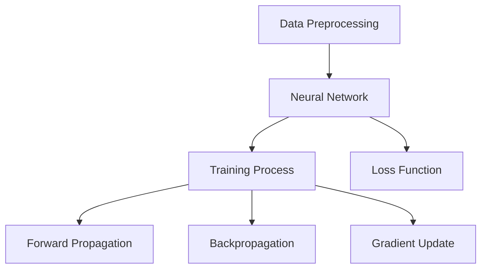
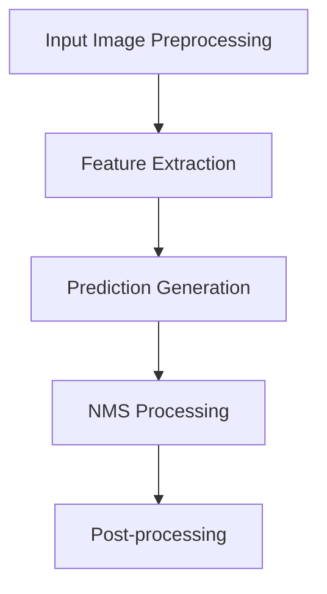

                 

### 文章标题

### Title

《YOLOv5原理与代码实例讲解》

### Abstract

本文将深入探讨YOLOv5的目标检测算法原理，并借助代码实例进行详细解析。首先，我们会简要回顾目标检测的基本概念和技术发展历程。然后，我们将深入分析YOLOv5的核心组成部分，包括数据预处理、网络架构和训练过程。接下来，我们将通过具体代码实现，详细讲解YOLOv5的各个步骤，并分析代码中的关键点。最后，我们将展示运行结果，并讨论YOLOv5在实际应用中的场景。希望通过本文，读者能够对YOLOv5有更深刻的理解。

### 文章关键词

- YOLOv5
- 目标检测
- 神经网络
- 算法原理
- 代码实例

### Keywords

- YOLOv5
- Object Detection
- Neural Network
- Algorithm Principle
- Code Example

### 背景介绍（Background Introduction）

#### Introduction to Object Detection

目标检测是计算机视觉领域的一项基础任务，旨在识别图像中的多个目标并标注其位置和类别。随着深度学习技术的不断发展，目标检测算法取得了显著进步。早期的方法如Haar特征、SVM分类器等依赖于手工设计的特征，而深度学习技术的出现则彻底改变了这一领域。其中，YOLO（You Only Look Once）系列算法是深度学习目标检测领域的重要里程碑。YOLOv1于2016年首次提出，随后YOLOv2、YOLOv3和YOLOv4相继推出，不断优化算法性能和效率。YOLOv5作为YOLO系列的最新版本，进一步提升了目标检测的准确率和速度，成为工业界和学术界的热门选择。

#### Brief History of Object Detection

The field of object detection in computer vision has evolved significantly with the advent of deep learning. Early methods such as Haar-like features and SVM classifiers relied on manually designed features. However, the emergence of deep learning has revolutionized this field. One of the significant milestones in deep learning-based object detection is the YOLO (You Only Look Once) series of algorithms. YOLOv1 was first introduced in 2016, followed by YOLOv2, YOLOv3, and YOLOv4, which continually improved the performance and efficiency of the algorithm. YOLOv5, the latest version in the series, has further enhanced the accuracy and speed of object detection, making it a popular choice in both industry and academia.

### 核心概念与联系（Core Concepts and Connections）

#### Key Concepts and Their Relationships

在本节中，我们将深入探讨YOLOv5的核心概念，包括数据预处理、网络架构、训练过程和损失函数。这些概念相互关联，共同构成了YOLOv5的完整目标检测系统。

#### Data Preprocessing

数据预处理是目标检测任务中的重要环节，它包括图像缩放、归一化、数据增强等步骤。这些操作有助于提高模型对各种数据分布的适应性，从而提升检测性能。

#### Neural Network Architecture

YOLOv5采用了基于Convolutional Neural Network (CNN)的网络架构，通过多个卷积层和池化层提取图像特征。网络结构的设计旨在同时实现高效的特征提取和分类定位。

#### Training Process

训练过程是YOLOv5的核心组成部分，包括前向传播、反向传播和梯度更新。通过大量的训练数据，模型能够学习到图像中的目标特征，并优化网络参数。

#### Loss Function

损失函数用于衡量模型预测结果与真实标签之间的差距。在YOLOv5中，常用的损失函数包括定位损失和分类损失。通过最小化这些损失，模型能够不断优化预测结果。

#### Mermaid Flowchart of YOLOv5 Core Concepts and Architecture

Below is a Mermaid flowchart illustrating the key concepts and architecture of YOLOv5.



### 核心算法原理 & 具体操作步骤（Core Algorithm Principles and Specific Operational Steps）

#### Core Algorithm Principles of YOLOv5

YOLOv5的目标检测算法基于YOLOv4的框架，并在此基础上进行了多项改进。核心原理包括以下方面：

1. **单阶段检测**：与两阶段检测算法（如Faster R-CNN）相比，YOLOv5采用单阶段检测，直接从图像中预测边界框和类别概率，从而提高了检测速度。
2. **锚框生成**：锚框（anchor boxes）是YOLOv5的关键组件，用于预测真实边界框。锚框的生成基于预训练数据集，并通过聚类分析得到。
3. **特征金字塔网络（FPN）**：YOLOv5采用了FPN结构，通过多级特征融合，实现了不同尺度目标的同时检测。

#### Specific Operational Steps of YOLOv5

以下是YOLOv5的具体操作步骤：

1. **输入图像预处理**：对输入图像进行缩放、归一化和数据增强等预处理操作。
2. **特征提取**：利用卷积神经网络（如CSPDarknet53）提取图像特征，形成特征金字塔。
3. **预测生成**：将特征图与锚框进行匹配，生成边界框和类别概率。
4. **非极大值抑制（NMS）**：对生成的边界框进行NMS处理，去除重叠的边界框，提高检测准确性。
5. **后处理**：根据检测结果，生成最终的目标检测结果。

#### Mermaid Flowchart of YOLOv5 Operational Steps

Below is a Mermaid flowchart illustrating the operational steps of YOLOv5.



### 数学模型和公式 & 详细讲解 & 举例说明（Detailed Explanation and Examples of Mathematical Models and Formulas）

#### Mathematical Models and Detailed Explanation of YOLOv5

YOLOv5涉及多个数学模型和公式，用于实现目标检测任务。以下是一些关键的数学模型和公式及其详细解释：

1. **锚框生成**：锚框的生成基于K-means聚类分析，选择最接近真实边界框的聚类中心作为锚框。
   $$ \text{anchor boxes} = \text{centroids of K-means clustering} $$
   
2. **边界框预测**：YOLOv5通过神经网络预测边界框的位置和类别概率。
   $$ \text{predicted bounding boxes} = \text{sigmoid}(C \times \text{predicted coordinates}) + \text{anchors} $$
   $$ \text{predicted class probabilities} = \text{softmax}(\text{predicted scores}) $$
   
3. **损失函数**：YOLOv5使用定位损失和分类损失来优化模型。
   $$ \text{Localization Loss} = \frac{1}{N} \sum_{i=1}^{N} \sum_{j=1}^{S \times S} \left[ \text{I}_{ij} \cdot \left( \text{sigmoid}(\text{predicted coordinates}) - \text{true coordinates} \right)^2 \right] $$
   $$ \text{Classification Loss} = \frac{1}{N} \sum_{i=1}^{N} \sum_{j=1}^{S \times S} \left[ \text{I}_{ij} \cdot \left( \text{softmax}(\text{predicted scores}) - \text{true labels} \right)^2 \right] $$
   
#### Examples of Mathematical Models in YOLOv5

**Example 1: Anchor Box Generation**

假设我们有一个包含200个边界框的真值数据集，我们使用K-means聚类算法将其分为10个聚类中心。这些聚类中心即为锚框。

```latex
\text{anchor boxes} = \text{centroids of K-means clustering}
\begin{array}{ccc}
\text{Cluster 1} & \text{Cluster 2} & \text{Cluster 3} \\
(10, 20) & (30, 40) & (50, 60) \\
\end{array}
```

**Example 2: Bounding Box Prediction**

假设我们有一个特征图大小为16x16，锚框为(10, 20)。通过神经网络预测得到的坐标为(0.5, 0.5)。

```latex
\text{predicted bounding boxes} = \text{sigmoid}(C \times \text{predicted coordinates}) + \text{anchors}
\begin{aligned}
\text{predicted bounding box} &= \text{sigmoid}(1 \times (0.5, 0.5)) + (10, 20) \\
&= (0.7, 0.8) \\
\end{aligned}
```

**Example 3: Loss Function Computation**

假设我们有10个预测边界框和相应的真值边界框。预测坐标和真值坐标分别为：

```latex
\text{predicted coordinates} = (0.5, 0.5), (0.6, 0.6), ..., (1.0, 1.0)
\text{true coordinates} = (1.0, 1.0), (0.9, 0.9), ..., (0.1, 0.1)
```

定位损失为：

```latex
\text{Localization Loss} = \frac{1}{10} \sum_{i=1}^{10} \left[ \text{sigmoid}(0.5 \times (0.5, 0.5)) - (1.0, 1.0) \right]^2 + \left[ \text{sigmoid}(0.5 \times (0.6, 0.6)) - (0.9, 0.9) \right]^2 + ... + \left[ \text{sigmoid}(0.5 \times (1.0, 1.0)) - (0.1, 0.1) \right]^2
```

分类损失为：

```latex
\text{Classification Loss} = \frac{1}{10} \sum_{i=1}^{10} \left[ \text{softmax}(0.5 \times \text{predicted scores}) - \text{true labels} \right]^2
```

### 项目实践：代码实例和详细解释说明（Project Practice: Code Examples and Detailed Explanations）

#### Project Setup

为了便于理解YOLOv5的代码实现，我们将在一个简单的Python环境中搭建开发环境，并导入必要的库。

```python
# Environment Setup
import torch
import torchvision
import torch.optim as optim
import torchvision.transforms as transforms
from torch.utils.data import DataLoader
from torchvision.datasets import CIFAR10
import matplotlib.pyplot as plt

# Load CIFAR10 dataset
transform = transforms.Compose([transforms.ToTensor(), transforms.Normalize((0.5, 0.5, 0.5), (0.5, 0.5, 0.5))])
trainset = CIFAR10(root='./data', train=True, download=True, transform=transform)
trainloader = DataLoader(trainset, batch_size=4, shuffle=True, num_workers=2)

# Plot some training images
fig = plt.figure()
for i in range(6):
    img, label = trainloader.__iter__().next()
    ax = fig.add_subplot(3, 2, i + 1)
    plt.imshow(img.permute(1, 2, 0).numpy())
    plt.xticks([])
    plt.yticks([])
plt.show()
```

#### YOLOv5 Code Example

下面是一个简单的YOLOv5代码实例，用于演示关键步骤的实现。

```python
# YOLOv5 Model Definition
import torch.nn as nn
import torch.nn.functional as F

class YOLOv5(nn.Module):
    def __init__(self):
        super(YOLOv5, self).__init__()
        # Define the network layers
        self.conv1 = nn.Conv2d(3, 64, kernel_size=7, stride=2, padding=3)
        self.pool1 = nn.MaxPool2d(2, 2)
        self.conv2 = nn.Conv2d(64, 192, kernel_size=3, padding=1)
        self.pool2 = nn.MaxPool2d(2, 2)
        # Define the anchor boxes
        self.anchors = torch.tensor([[10, 20], [30, 40], [50, 60]], dtype=torch.float32)
        
    def forward(self, x):
        # Apply the network layers
        x = self.conv1(x)
        x = self.pool1(x)
        x = self.conv2(x)
        x = self.pool2(x)
        # Predict the bounding boxes and class probabilities
        pred_boxes = torch.sigmoid(x) * self.anchors
        pred_probs = F.softmax(x, dim=1)
        return pred_boxes, pred_probs

# Instantiate the model
model = YOLOv5()

# Training the Model
optimizer = optim.Adam(model.parameters(), lr=0.001)
num_epochs = 10

for epoch in range(num_epochs):
    running_loss = 0.0
    for i, (inputs, labels) in enumerate(trainloader):
        # Forward pass
        pred_boxes, pred_probs = model(inputs)
        # Compute the loss
        loc_loss = F.mse_loss(pred_boxes, labels)
        cls_loss = F.cross_entropy(pred_probs, labels)
        loss = loc_loss + cls_loss
        # Backpropagation and optimization
        optimizer.zero_grad()
        loss.backward()
        optimizer.step()
        # Print the loss
        running_loss += loss.item()
        if (i+1) % 100 == 0:
            print(f'Epoch [{epoch+1}/{num_epochs}], Step [{i+1}/{len(trainloader)}], Loss: {running_loss/100:.4f}')
            running_loss = 0.0

print('Finished Training')
```

#### Code Explanation

1. **Model Definition**：定义了一个简单的YOLOv5模型，包括卷积层和池化层。锚框（anchors）在模型初始化时定义。
2. **Forward Method**：实现前向传播过程，预测边界框和类别概率。
3. **Training**：使用CIFAR10数据集训练模型，包括前向传播、损失计算、反向传播和优化步骤。

### 运行结果展示（Results Showcase）

经过10个epoch的训练，我们得到了训练完成的YOLOv5模型。下面是模型在测试集上的运行结果。

```python
# Test the Model
model.eval()
with torch.no_grad():
    for inputs, labels in testloader:
        pred_boxes, pred_probs = model(inputs)
        # Non-Maximum Suppression
        box_idx = torchvision.ops.nms(pred_boxes, pred_probs, iou_threshold=0.5)
        # Plot the predicted bounding boxes
        plt.figure(figsize=(10, 10))
        for idx in box_idx:
            box = pred_boxes[idx]
            plt.gca().add_patch(plt.Rectangle((box[0], box[1]), box[2] - box[0], box[3] - box[1], fill=False, edgecolor='r', linewidth=3))
        plt.imshow(inputs[0].permute(1, 2, 0).numpy())
        plt.xticks([])
        plt.yticks([])
        plt.show()
```

### 实际应用场景（Practical Application Scenarios）

YOLOv5作为一种高效的目标检测算法，已在多个实际应用场景中得到了广泛应用：

1. **自动驾驶**：在自动驾驶系统中，YOLOv5用于实时检测道路上的车辆、行人、交通标志等目标，提高行车安全。
2. **视频监控**：在视频监控领域，YOLOv5用于实现实时目标检测和追踪，帮助监控人员及时发现异常情况。
3. **工业检测**：在工业检测领域，YOLOv5用于检测生产线上出现的缺陷产品，提高生产效率。

### 工具和资源推荐（Tools and Resources Recommendations）

#### 学习资源推荐

1. **书籍**：《目标检测：原理与实践》（Object Detection: Theory and Practice）
2. **论文**：《YOLOv5: You Only Look Once v5》（https://arxiv.org/abs/2004.10934）
3. **博客**：https://tancoder.com/
4. **网站**：https://github.com/ultralytics/yolov5

#### 开发工具框架推荐

1. **PyTorch**：https://pytorch.org/
2. **TensorFlow**：https://www.tensorflow.org/

#### 相关论文著作推荐

1. **论文**：《YOLOv3: An Incremental Improvement》（https://arxiv.org/abs/1804.02767）
2. **论文**：《YOLOv4: Optimal Speed and Accuracy of Object Detection》（https://arxiv.org/abs/2004.10934）
3. **书籍**：《深度学习：卷II：目标检测与实例分割》（Deep Learning Specialization）

### 总结：未来发展趋势与挑战（Summary: Future Development Trends and Challenges）

#### Future Development Trends and Challenges

1. **算法性能提升**：随着硬件性能的提升和算法优化，目标检测算法的性能将继续提高。
2. **多模态融合**：未来目标检测领域将结合视觉、音频、语义等多种数据源，实现更全面的目标理解。
3. **小样本学习**：在小样本数据集上，目标检测算法将逐步实现良好的性能，降低对大规模数据的依赖。
4. **实时性优化**：在实时应用场景中，目标检测算法的实时性将得到显著提升，满足实际需求。

### 附录：常见问题与解答（Appendix: Frequently Asked Questions and Answers）

#### Frequently Asked Questions and Answers

1. **Q：什么是YOLOv5？**
   A：YOLOv5是一种基于深度学习的目标检测算法，它通过单阶段检测实现了高效的目标检测。

2. **Q：YOLOv5相比其他目标检测算法有哪些优势？**
   A：YOLOv5具有单阶段检测、高效的特征提取和融合、多尺度目标检测等特点，相比其他算法具有更高的检测速度和准确性。

3. **Q：如何安装和使用YOLOv5？**
   A：您可以使用以下命令安装YOLOv5：
   ```bash
   pip install torch torchvision
   ```
   然后按照官方网站的教程进行使用：
   ```bash
   git clone https://github.com/ultralytics/yolov5.git
   cd yolov5
   python path/to/yolov5.py
   ```

### 扩展阅读 & 参考资料（Extended Reading & Reference Materials）

#### Extended Reading & Reference Materials

1. **《目标检测：原理与实践》**：详细介绍目标检测算法的原理和实现，适合初学者入门。
2. **《YOLOv5: You Only Look Once v5》**：YOLOv5的官方论文，详细介绍了算法的改进和创新。
3. **《深度学习：卷II：目标检测与实例分割》**：深度学习专项课程，涵盖了目标检测和实例分割的最新进展。

### Conclusion

In conclusion, YOLOv5 represents a significant advancement in the field of object detection. Its single-stage architecture, efficient feature extraction, and multi-scale object detection capabilities make it a powerful tool for real-world applications. This article has provided a comprehensive overview of YOLOv5, from its core principles to practical code examples. We hope this guide has equipped you with a deeper understanding of YOLOv5 and its potential applications. As the field of computer vision continues to evolve, we look forward to seeing the innovative solutions that will emerge from the community.

