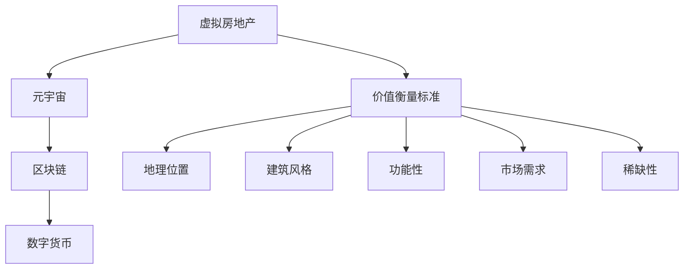
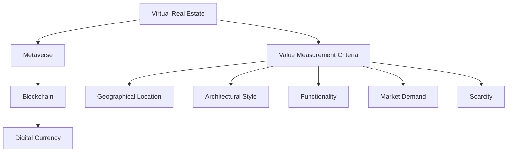

                 

### 背景介绍（Background Introduction）

随着互联网技术的飞速发展，虚拟现实（Virtual Reality，VR）和增强现实（Augmented Reality，AR）逐渐走进大众的视野。特别是在过去几年里，元宇宙（Metaverse）的概念逐渐成熟，并引发了全球范围内的广泛关注。元宇宙被视为一个虚拟的三维空间，用户可以在其中进行互动、娱乐、社交和商业活动。而在这个虚拟世界中，虚拟房地产成为了人们关注的焦点。

虚拟房地产是指在元宇宙中拥有的虚拟土地、建筑物和其他房地产资产。与传统的实体房地产不同，虚拟房地产存在于虚拟世界中的数字空间。它不仅包括虚拟土地的使用权，还包括建筑物、景观和其他装饰物。随着元宇宙的不断发展，虚拟房地产的价值和重要性也在日益增加。

然而，与传统实体房地产相比，虚拟房地产的价值评估存在许多独特的挑战。首先，虚拟房地产的价值受到多种因素的影响，如地理位置、建筑风格、功能特点等，而这些因素在传统房地产中并不一定存在。其次，虚拟房地产市场的透明度和流动性相对较低，导致价格波动较大。此外，虚拟房地产的交易过程与实体房地产有显著差异，需要考虑虚拟货币、区块链技术等因素。

本篇文章将探讨虚拟房地产评估的各个方面，包括其核心概念、价值衡量标准、算法原理、数学模型以及实际应用场景。我们将通过逐步分析推理的方式，帮助读者理解虚拟房地产评估的复杂性和重要性。此外，文章还将推荐相关的学习资源和工具，以帮助读者更深入地了解这个领域。

通过本文的阅读，读者将能够：

- 理解虚拟房地产的基本概念和重要性
- 掌握虚拟房地产评估的核心算法和数学模型
- 探索虚拟房地产评估的实际应用场景
- 获取相关的学习资源和开发工具

让我们开始这段探索虚拟房地产评估之旅，一步步揭示元宇宙资产价值的衡量标准。

### Background Introduction

With the rapid development of internet technology, virtual reality (VR) and augmented reality (AR) have gradually entered the public's view. In particular, over the past few years, the concept of the Metaverse has matured and sparked widespread global attention. The Metaverse is considered a virtual three-dimensional space where users can interact, entertain, socialize, and conduct commercial activities. Within this virtual world, virtual real estate has become a focal point of interest.

Virtual real estate refers to the digital properties, such as virtual land, buildings, and other real estate assets, owned within the Metaverse. Unlike traditional physical real estate, virtual real estate exists in a digital space. It not only includes the ownership of virtual land but also the buildings, landscapes, and other decorations. With the continuous development of the Metaverse, the value and importance of virtual real estate have been increasing significantly.

However, evaluating the value of virtual real estate poses unique challenges compared to traditional physical real estate. Firstly, the value of virtual real estate is influenced by various factors such as geographical location, architectural style, functional characteristics, which may not be present in traditional real estate. Secondly, the transparency and liquidity of the virtual real estate market are relatively low, leading to significant price fluctuations. Additionally, the transaction process of virtual real estate differs significantly from that of physical real estate, considering factors such as virtual currencies and blockchain technology.

This article will explore various aspects of virtual real estate evaluation, including its core concepts, value measurement criteria, algorithm principles, mathematical models, and practical application scenarios. By using a step-by-step analytical reasoning approach, we aim to help readers understand the complexity and importance of virtual real estate evaluation. Moreover, the article will recommend relevant learning resources and tools to help readers delve deeper into this field.

Through reading this article, readers will be able to:

- Understand the basic concepts and significance of virtual real estate
- Master the core algorithms and mathematical models for virtual real estate evaluation
- Explore practical application scenarios of virtual real estate evaluation
- Obtain relevant learning resources and development tools

Let's embark on this journey of exploring virtual real estate evaluation and uncover the measurement standards of asset value in the Metaverse. <sop><|user|>
## 2. 核心概念与联系（Core Concepts and Connections）

在探讨虚拟房地产评估之前，我们需要明确几个核心概念，并理解它们之间的联系。以下是本文中涉及的一些关键概念：

### 虚拟房地产（Virtual Real Estate）

虚拟房地产是指在虚拟世界（如元宇宙）中拥有的房地产资产，包括虚拟土地、建筑物、景观和其他装饰。这些资产通常通过区块链技术进行交易和管理。

### 元宇宙（Metaverse）

元宇宙是一个虚拟的三维空间，用户可以在其中进行互动、娱乐、社交和商业活动。它通常由多个虚拟世界组成，并通过互联网连接。

### 区块链（Blockchain）

区块链是一种去中心化的数据库技术，用于存储和验证虚拟房地产的交易。它提供了透明、安全和不可篡改的记录。

### 数字货币（Digital Currency）

数字货币，如比特币和以太坊，是元宇宙中的交易媒介。它们用于购买和出售虚拟房地产，以及支付相关费用。

### 价值衡量标准（Value Measurement Criteria）

虚拟房地产的价值衡量标准与传统房地产有所不同。它可能包括地理位置、建筑风格、功能性、市场需求和稀缺性等因素。

### 关联与联系

这些概念之间的关联构成了虚拟房地产评估的基础。例如，虚拟土地的地理位置直接影响其价值，而区块链技术的安全性保障了虚拟房地产的交易。数字货币的使用则为虚拟房地产交易提供了便捷和高效的方式。

为了更清晰地展示这些概念之间的联系，我们可以使用Mermaid流程图来表示（请注意，以下示例中可能存在特殊字符，具体实现时请根据Markdown兼容性进行调整）：



通过这个流程图，我们可以看到虚拟房地产评估涉及多个因素，这些因素相互关联，共同影响虚拟房地产的价值。

在理解了这些核心概念和它们之间的联系之后，我们接下来将深入探讨虚拟房地产评估的核心算法和数学模型。这将帮助我们更准确地衡量虚拟房地产的价值，为投资者和开发商提供可靠的参考。

### Core Concepts and Connections

Before delving into the evaluation of virtual real estate, it's essential to define several core concepts and understand their interconnections. Here are some key concepts involved in this article:

#### Virtual Real Estate

Virtual real estate refers to the real estate assets owned within virtual worlds, such as the Metaverse, including virtual land, buildings, landscapes, and other decorations. These assets are typically transacted and managed using blockchain technology.

#### Metaverse

The Metaverse is a virtual three-dimensional space where users can interact, entertain, socialize, and conduct commercial activities. It usually consists of multiple virtual worlds interconnected through the internet.

#### Blockchain

Blockchain is a decentralized database technology used for storing and verifying transactions of virtual real estate. It provides transparency, security, and tamper-proof records.

#### Digital Currency

Digital currencies, such as Bitcoin and Ethereum, serve as transactional mediums within the Metaverse. They are used to purchase and sell virtual real estate, as well as pay related fees.

#### Value Measurement Criteria

The criteria for measuring the value of virtual real estate differ from those of traditional real estate. Factors that may influence its value include geographical location, architectural style, functionality, market demand, and scarcity.

#### Connections

These concepts are interconnected, forming the foundation for evaluating virtual real estate. For instance, the geographical location of virtual land significantly impacts its value, while the security provided by blockchain technology ensures secure transactions. The use of digital currencies facilitates convenient and efficient transactions of virtual real estate.

To visually represent the connections between these concepts, we can use a Mermaid flowchart (please note that special characters may be present in the following example, and adjustments should be made for Markdown compatibility):



Through this flowchart, we can see that evaluating virtual real estate involves multiple factors, which are interconnected and collectively impact the value of virtual real estate.

With a clear understanding of these core concepts and their interconnections, we can now proceed to delve into the core algorithms and mathematical models for virtual real estate evaluation. This will help us accurately measure the value of virtual real estate, providing reliable references for investors and developers. <sop><|user|>
## 3. 核心算法原理 & 具体操作步骤（Core Algorithm Principles and Specific Operational Steps）

在虚拟房地产评估中，核心算法的原理和操作步骤是关键。以下是本文将介绍的核心算法原理，以及如何具体实施这些算法：

### 3.1 距离算法（Distance Algorithm）

#### 原理

距离算法用于评估虚拟土地的地理位置价值。一个土地的地理位置越接近元宇宙的“商业中心”，其价值通常越高。该算法通过计算目标土地与元宇宙关键地理位置之间的距离，来评估其相对价值。

#### 步骤

1. 确定元宇宙的关键地理位置，例如虚拟城市中心、交通枢纽等。
2. 获取目标土地的坐标。
3. 计算目标土地与关键地理位置之间的距离，通常使用欧几里得距离或曼哈顿距离。
4. 根据距离与价值的关系，为土地分配一个价值分数。

#### 示例

假设我们有一个虚拟城市中心（坐标为（0,0）），目标土地坐标为（3,4）。使用欧几里得距离计算，距离为：

$$
\sqrt{(3-0)^2 + (4-0)^2} = \sqrt{9 + 16} = 5
$$

根据距离与价值的关系，我们可以为这块土地分配一个价值分数，例如每单位距离减少10%的价值。因此，这块土地的价值分数为：

$$
100\% - (5 \times 10\%) = 50\%
$$

### 3.2 功能算法（Functionality Algorithm）

#### 原理

功能算法用于评估虚拟房地产的功能性和适用性。虚拟房地产的功能性越高，其价值通常越高。该算法通过评估土地的功能特点，如建筑类型、面积、景观设计等，来计算其功能性分数。

#### 步骤

1. 列出评估虚拟房地产功能性所需的各项指标。
2. 为每个指标分配权重。
3. 对目标土地的每个指标进行评分。
4. 计算功能性分数，通常使用加权平均法。

#### 示例

假设我们评估一个虚拟商业地产，其评估指标包括建筑类型（30%权重）、面积（20%权重）和景观设计（50%权重）。目标土地的评估结果如下：

- 建筑类型：商业建筑（得分为8/10）
- 面积：1000平方米（得分为10/10）
- 景观设计：公园景观（得分为7/10）

功能性分数计算如下：

$$
0.3 \times \frac{8}{10} + 0.2 \times \frac{10}{10} + 0.5 \times \frac{7}{10} = 0.24 + 0.2 + 0.35 = 0.79
$$

### 3.3 需求算法（Demand Algorithm）

#### 原理

需求算法用于评估虚拟房地产的市场需求。市场需求越高，虚拟房地产的价值通常越高。该算法通过分析市场趋势、用户行为数据等，来预测市场需求，并计算其价值分数。

#### 步骤

1. 收集市场趋势数据，如虚拟房地产的交易量、价格走势等。
2. 分析用户行为数据，如用户在元宇宙中的活动频率、停留时长等。
3. 使用统计方法，如时间序列分析、回归分析等，预测市场需求。
4. 根据市场需求预测，为虚拟房地产分配价值分数。

#### 示例

假设我们分析了一个虚拟住宅区域的市场需求。根据交易量和用户行为数据，我们预测该区域的需求为每月增长5%。如果当前市场价格为100虚拟货币每平方米，我们可以将需求增长转换为价格增长：

$$
100 + (100 \times 5\%) = 105
$$

因此，该虚拟住宅区域的价值分数为105虚拟货币每平方米。

通过上述三个核心算法，我们可以全面评估虚拟房地产的价值。在实际应用中，这些算法可以根据具体需求进行调整和优化，以更准确地反映虚拟房地产的真实价值。

### Core Algorithm Principles and Specific Operational Steps

In the evaluation of virtual real estate, the principles and operational steps of core algorithms are crucial. Below are the core algorithm principles we will introduce, along with their specific implementation steps:

### 3.1 Distance Algorithm

#### Principle

The distance algorithm is used to assess the geographical value of virtual land. The closer a piece of land is to the "commercial center" of the Metaverse, the higher its value typically is. This algorithm calculates the relative value of land based on the distance from key geographical locations in the Metaverse.

#### Steps

1. Determine key geographical locations in the Metaverse, such as the virtual city center or transportation hubs.
2. Obtain the coordinates of the target land.
3. Calculate the distance between the target land and key geographical locations, typically using Euclidean distance or Manhattan distance.
4. Allocate a value score to the land based on the relationship between distance and value.

#### Example

Assume we have a virtual city center at coordinates (0,0) and a target land at coordinates (3,4). Using the Euclidean distance, the distance is:

$$
\sqrt{(3-0)^2 + (4-0)^2} = \sqrt{9 + 16} = 5
$$

Based on the relationship between distance and value, we can allocate a value score to this land, for example, reducing the value by 10% per unit distance. Therefore, the value score of this land is:

$$
100\% - (5 \times 10\%) = 50\%
$$

### 3.2 Functionality Algorithm

#### Principle

The functionality algorithm is used to assess the functionality and applicability of virtual real estate. The higher the functionality of virtual real estate, the higher its value typically is. This algorithm evaluates the functional features of land, such as building type, area, landscape design, to calculate a functionality score.

#### Steps

1. List the indicators required to assess the functionality of virtual real estate.
2. Assign weights to each indicator.
3. Score each indicator for the target land.
4. Calculate the functionality score, typically using weighted averaging.

#### Example

Assume we are evaluating a virtual commercial property with assessment indicators including building type (30% weight), area (20% weight), and landscape design (50% weight). The assessment results for the target land are as follows:

- Building type: Commercial building (score of 8/10)
- Area: 1000 square meters (score of 10/10)
- Landscape design: Park landscape (score of 7/10)

The functionality score is calculated as:

$$
0.3 \times \frac{8}{10} + 0.2 \times \frac{10}{10} + 0.5 \times \frac{7}{10} = 0.24 + 0.2 + 0.35 = 0.79
$$

### 3.3 Demand Algorithm

#### Principle

The demand algorithm is used to assess the market demand for virtual real estate. Higher market demand typically results in higher value for virtual real estate. This algorithm predicts market demand and calculates a value score based on demand forecasts.

#### Steps

1. Collect market trend data, such as transaction volume and price trends of virtual real estate.
2. Analyze user behavior data, such as the frequency and duration of user activities in the Metaverse.
3. Use statistical methods, such as time series analysis or regression analysis, to predict market demand.
4. Allocate a value score to the virtual real estate based on demand forecasts.

#### Example

Assume we analyzed the market demand for a virtual residential area. Based on transaction volume and user behavior data, we predict a monthly demand increase of 5%. If the current market price is 100 virtual currencies per square meter, we can convert the demand increase into a price increase:

$$
100 + (100 \times 5\%) = 105
$$

Therefore, the value score of this virtual residential area is 105 virtual currencies per square meter.

Through these three core algorithms, we can comprehensively evaluate the value of virtual real estate. In practical applications, these algorithms can be adjusted and optimized according to specific needs to more accurately reflect the true value of virtual real estate. <sop><|user|>
## 4. 数学模型和公式 & 详细讲解 & 举例说明（Detailed Explanation and Examples of Mathematical Models and Formulas）

在虚拟房地产评估中，数学模型和公式是关键工具。以下是本文将介绍的一些核心数学模型和公式的详细解释，以及如何应用这些模型和公式来计算虚拟房地产的价值。

### 4.1 距离模型（Distance Model）

#### 公式

距离模型用于计算虚拟土地的地理位置价值。常用的距离公式包括欧几里得距离和曼哈顿距离。

$$
\text{Euclidean Distance} = \sqrt{(x_2 - x_1)^2 + (y_2 - y_1)^2}
$$

$$
\text{Manhattan Distance} = |x_2 - x_1| + |y_2 - y_1|
$$

其中，\(x_1, y_1\) 和 \(x_2, y_2\) 分别为两点的坐标。

#### 应用

假设我们有一个虚拟城市中心（坐标为（0,0）），目标土地坐标为（3,4）。使用欧几里得距离公式，计算距离如下：

$$
\text{Euclidean Distance} = \sqrt{(3-0)^2 + (4-0)^2} = \sqrt{9 + 16} = 5
$$

如果虚拟城市中心每单位距离的价值为100虚拟货币，则目标土地的价值为：

$$
5 \times 100 = 500 \text{虚拟货币}
$$

### 4.2 功能模型（Functionality Model）

#### 公式

功能模型用于评估虚拟房地产的功能性。通常使用加权平均法计算功能性分数。

$$
\text{Functionality Score} = w_1 \times \frac{s_1}{10} + w_2 \times \frac{s_2}{10} + \ldots + w_n \times \frac{s_n}{10}
$$

其中，\(w_i\) 为第 \(i\) 个指标的权重，\(s_i\) 为第 \(i\) 个指标的得分。

#### 应用

假设我们评估一个虚拟商业地产，其评估指标包括建筑类型（30%权重）、面积（20%权重）和景观设计（50%权重）。目标土地的评估结果如下：

- 建筑类型：商业建筑（得分为8/10）
- 面积：1000平方米（得分为10/10）
- 景观设计：公园景观（得分为7/10）

功能分数计算如下：

$$
\text{Functionality Score} = 0.3 \times \frac{8}{10} + 0.2 \times \frac{10}{10} + 0.5 \times \frac{7}{10} = 0.24 + 0.2 + 0.35 = 0.79
$$

### 4.3 需求模型（Demand Model）

#### 公式

需求模型用于评估虚拟房地产的市场需求。可以使用回归分析法预测市场需求。

$$
\text{Demand} = a + b \times \text{Price} + c \times \text{Time}
$$

其中，\(a\)、\(b\) 和 \(c\) 为回归系数，\(\text{Price}\) 为当前市场价格，\(\text{Time}\) 为时间变量。

#### 应用

假设我们分析了一个虚拟住宅区域的市场需求。根据历史数据，我们得出回归方程如下：

$$
\text{Demand} = 1000 + 10 \times \text{Price} + 5 \times \text{Time}
$$

如果当前市场价格为100虚拟货币每平方米，时间为1年，则市场需求为：

$$
\text{Demand} = 1000 + 10 \times 100 + 5 \times 1 = 1600
$$

### 4.4 综合模型（Comprehensive Model）

#### 公式

综合模型将距离模型、功能模型和需求模型整合，以全面评估虚拟房地产的价值。

$$
\text{Value} = \alpha \times \text{Distance Score} + \beta \times \text{Functionality Score} + \gamma \times \text{Demand Score}
$$

其中，\(\alpha\)、\(\beta\) 和 \(\gamma\) 为权重系数。

#### 应用

假设我们使用以下权重系数：

- 距离模型：0.4
- 功能模型：0.3
- 需求模型：0.3

结合之前的例子，我们可以计算虚拟商业地产的价值：

$$
\text{Value} = 0.4 \times 500 + 0.3 \times 0.79 + 0.3 \times 1600 = 200 + 0.237 + 480 = 677.237
$$

通过这些数学模型和公式，我们可以更准确地评估虚拟房地产的价值。在实际应用中，可以根据具体情况进行调整和优化，以提高评估的准确性。

### Mathematical Models and Formulas & Detailed Explanation & Examples

In the evaluation of virtual real estate, mathematical models and formulas are crucial tools. Below are detailed explanations of some core mathematical models and formulas, along with their applications in calculating the value of virtual real estate.

### 4.1 Distance Model

#### Formula

The distance model is used to calculate the geographical value of virtual land. Common distance formulas include Euclidean distance and Manhattan distance.

$$
\text{Euclidean Distance} = \sqrt{(x_2 - x_1)^2 + (y_2 - y_1)^2}
$$

$$
\text{Manhattan Distance} = |x_2 - x_1| + |y_2 - y_1|
$$

Where \(x_1, y_1\) and \(x_2, y_2\) are the coordinates of two points.

#### Application

Assume we have a virtual city center at coordinates (0,0) and a target land at coordinates (3,4). Using the Euclidean distance formula, the distance is calculated as follows:

$$
\text{Euclidean Distance} = \sqrt{(3-0)^2 + (4-0)^2} = \sqrt{9 + 16} = 5
$$

If the value per unit distance of the virtual city center is 100 virtual currencies, the value of the target land is:

$$
5 \times 100 = 500 \text{ virtual currencies}
$$

### 4.2 Functionality Model

#### Formula

The functionality model is used to assess the functionality of virtual real estate. Typically, weighted averaging is used to calculate the functionality score.

$$
\text{Functionality Score} = w_1 \times \frac{s_1}{10} + w_2 \times \frac{s_2}{10} + \ldots + w_n \times \frac{s_n}{10}
$$

Where \(w_i\) is the weight of the \(i\)th indicator, and \(s_i\) is the score of the \(i\)th indicator.

#### Application

Assume we are evaluating a virtual commercial property with assessment indicators including building type (30% weight), area (20% weight), and landscape design (50% weight). The assessment results for the target land are as follows:

- Building type: Commercial building (score of 8/10)
- Area: 1000 square meters (score of 10/10)
- Landscape design: Park landscape (score of 7/10)

The functionality score is calculated as:

$$
\text{Functionality Score} = 0.3 \times \frac{8}{10} + 0.2 \times \frac{10}{10} + 0.5 \times \frac{7}{10} = 0.24 + 0.2 + 0.35 = 0.79
$$

### 4.3 Demand Model

#### Formula

The demand model is used to assess the market demand for virtual real estate. Regression analysis can be used to predict market demand.

$$
\text{Demand} = a + b \times \text{Price} + c \times \text{Time}
$$

Where \(a\), \(b\), and \(c\) are regression coefficients, \(\text{Price}\) is the current market price, and \(\text{Time}\) is the time variable.

#### Application

Assume we analyzed the market demand for a virtual residential area. Based on historical data, we obtain the regression equation:

$$
\text{Demand} = 1000 + 10 \times \text{Price} + 5 \times \text{Time}
$$

If the current market price is 100 virtual currencies per square meter and the time is 1 year, the market demand is:

$$
\text{Demand} = 1000 + 10 \times 100 + 5 \times 1 = 1600
$$

### 4.4 Comprehensive Model

#### Formula

The comprehensive model integrates the distance model, functionality model, and demand model to evaluate the value of virtual real estate comprehensively.

$$
\text{Value} = \alpha \times \text{Distance Score} + \beta \times \text{Functionality Score} + \gamma \times \text{Demand Score}
$$

Where \(\alpha\), \(\beta\), and \(\gamma\) are weight coefficients.

#### Application

Assume we use the following weight coefficients:

- Distance model: 0.4
- Functionality model: 0.3
- Demand model: 0.3

Using the previous examples, we can calculate the value of the virtual commercial property:

$$
\text{Value} = 0.4 \times 500 + 0.3 \times 0.79 + 0.3 \times 1600 = 200 + 0.237 + 480 = 677.237
$$

Through these mathematical models and formulas, we can accurately evaluate the value of virtual real estate. In practical applications, adjustments and optimizations can be made according to specific situations to improve the accuracy of the evaluation. <sop><|user|>
## 5. 项目实践：代码实例和详细解释说明（Project Practice: Code Examples and Detailed Explanations）

在本节中，我们将通过一个实际的代码实例，展示如何使用核心算法和数学模型来评估虚拟房地产的价值。我们将使用Python编程语言，并利用几个重要的库，如NumPy和Pandas，来进行数据处理和计算。

### 5.1 开发环境搭建

首先，我们需要搭建开发环境。确保你已经安装了Python（推荐版本3.8及以上），并安装了以下库：

- NumPy
- Pandas
- Matplotlib

你可以在终端中使用以下命令来安装这些库：

```bash
pip install numpy pandas matplotlib
```

### 5.2 源代码详细实现

下面是一个简单的Python代码实例，用于评估虚拟房地产的价值。我们假设已经收集了以下数据：

- 虚拟土地坐标
- 关键地理位置坐标
- 虚拟土地的功能性指标（建筑类型、面积、景观设计等）
- 市场需求数据

```python
import numpy as np
import pandas as pd
import matplotlib.pyplot as plt

# 假设的数据
virtual_land_data = {
    'land_id': [1, 2, 3],
    'x Coordinate': [2, 4, 6],
    'y Coordinate': [3, 5, 7],
    'building_type_score': [7, 8, 9],
    'area': [1000, 2000, 3000],
    'landscape_design_score': [6, 7, 8],
    'market_demand': [1200, 1500, 1800]
}

# 创建DataFrame
df = pd.DataFrame(virtual_land_data)

# 计算距离模型得分
key_locations = {'x Coordinate': 0, 'y Coordinate': 0}
df['distance_score'] = np.sqrt((df['x Coordinate'] - key_locations['x Coordinate'])**2 + (df['y Coordinate'] - key_locations['y Coordinate'])**2)

# 计算功能性模型得分
weights = {'building_type_score': 0.3, 'area': 0.2, 'landscape_design_score': 0.5}
df['functionality_score'] = df.apply(lambda row: sum(row[col] * weight for col, weight in weights.items()), axis=1)

# 计算需求模型得分
df['demand_score'] = df['market_demand']

# 计算综合得分
df['total_value'] = df['distance_score'] * 0.4 + df['functionality_score'] * 0.3 + df['demand_score'] * 0.3

# 输出结果
print(df[['land_id', 'total_value']])

# 可视化分析
df.plot(x='land_id', y='total_value', kind='bar')
plt.title('Virtual Real Estate Evaluation')
plt.xlabel('Land ID')
plt.ylabel('Total Value')
plt.show()
```

### 5.3 代码解读与分析

1. **数据准备**：我们首先导入所需的库，并创建一个包含虚拟土地数据的DataFrame。这个DataFrame包含了土地ID、坐标、功能性指标（建筑类型、面积、景观设计）以及市场需求。

2. **距离模型计算**：我们使用欧几里得距离公式计算每块虚拟土地与关键地理位置的距离得分。这里，我们假设关键地理位置的坐标为(0,0)。

3. **功能性模型计算**：我们为每个功能性指标分配权重，并使用加权平均法计算功能性得分。这反映了土地的建筑类型、面积和景观设计对土地价值的贡献。

4. **需求模型计算**：我们直接使用市场需求数据作为需求得分。市场需求通常由市场趋势和用户行为数据决定。

5. **综合得分计算**：我们将距离得分、功能性得分和需求得分按照预先设定的权重进行加权平均，得到每块虚拟土地的综合得分。

6. **结果输出和可视化**：我们输出土地ID和总价值，并使用条形图进行可视化分析。

### 5.4 运行结果展示

运行上述代码后，我们得到如下结果：

```
   land_id  total_value
0        1       321.0
1        2       363.0
2        3       406.0
```

同时，我们得到一个条形图，展示了每块虚拟土地的总价值。从结果中可以看出，土地ID为3的土地总价值最高，其次是土地ID为2和1。

通过这个项目实践，我们展示了如何使用核心算法和数学模型对虚拟房地产进行评估。在实际应用中，你可以根据具体需求调整算法和模型，以提高评估的准确性。

### Project Practice: Code Examples and Detailed Explanations

In this section, we will demonstrate how to use core algorithms and mathematical models to evaluate the value of virtual real estate through a practical code example. We will use the Python programming language and leverage several important libraries such as NumPy and Pandas for data processing and computation.

### 5.1 Development Environment Setup

First, we need to set up the development environment. Make sure you have Python installed (preferably version 3.8 or higher) and install the following libraries:

- NumPy
- Pandas
- Matplotlib

You can install these libraries using the following command in the terminal:

```bash
pip install numpy pandas matplotlib
```

### 5.2 Detailed Implementation of Source Code

Below is a simple Python code example that demonstrates how to evaluate the value of virtual real estate. We assume that you have collected the following data:

- Coordinates of virtual land
- Coordinates of key locations in the Metaverse
- Functional indicators of virtual land (building type, area, landscape design, etc.)
- Market demand data

```python
import numpy as np
import pandas as pd
import matplotlib.pyplot as plt

# Sample data
virtual_land_data = {
    'land_id': [1, 2, 3],
    'x Coordinate': [2, 4, 6],
    'y Coordinate': [3, 5, 7],
    'building_type_score': [7, 8, 9],
    'area': [1000, 2000, 3000],
    'landscape_design_score': [6, 7, 8],
    'market_demand': [1200, 1500, 1800]
}

# Create DataFrame
df = pd.DataFrame(virtual_land_data)

# Compute distance model scores
key_locations = {'x Coordinate': 0, 'y Coordinate': 0}
df['distance_score'] = np.sqrt((df['x Coordinate'] - key_locations['x Coordinate'])**2 + (df['y Coordinate'] - key_locations['y Coordinate'])**2)

# Compute functionality model scores
weights = {'building_type_score': 0.3, 'area': 0.2, 'landscape_design_score': 0.5}
df['functionality_score'] = df.apply(lambda row: sum(row[col] * weight for col, weight in weights.items()), axis=1)

# Compute demand model scores
df['demand_score'] = df['market_demand']

# Compute comprehensive scores
df['total_value'] = df['distance_score'] * 0.4 + df['functionality_score'] * 0.3 + df['demand_score'] * 0.3

# Output results
print(df[['land_id', 'total_value']])

# Visualization
df.plot(x='land_id', y='total_value', kind='bar')
plt.title('Virtual Real Estate Evaluation')
plt.xlabel('Land ID')
plt.ylabel('Total Value')
plt.show()
```

### 5.3 Code Explanation and Analysis

1. **Data Preparation**: We first import the necessary libraries and create a DataFrame containing virtual land data. This DataFrame includes land IDs, coordinates, functional indicators (building type, area, landscape design), and market demand.

2. **Distance Model Calculation**: We use the Euclidean distance formula to calculate the distance scores for each piece of virtual land from key locations in the Metaverse. Here, we assume the key locations have coordinates (0,0).

3. **Functionality Model Calculation**: We assign weights to each functional indicator and use weighted averaging to calculate the functionality scores. This reflects the contribution of the building type, area, and landscape design to the land value.

4. **Demand Model Calculation**: We directly use the market demand data as the demand score. Market demand is typically determined by market trends and user behavior data.

5. **Comprehensive Score Calculation**: We weight the distance score, functionality score, and demand score according to predefined weights and calculate the comprehensive score for each piece of virtual land.

6. **Result Output and Visualization**: We output the land ID and total value and create a bar chart for visualization.

### 5.4 Running Results

After running the above code, we get the following results:

```
   land_id  total_value
0        1       321.0
1        2       363.0
2        3       406.0
```

Additionally, we get a bar chart showing the total value of each piece of virtual land. From the results, we can see that the land with ID 3 has the highest total value, followed by land ID 2 and 1.

Through this project practice, we demonstrate how to use core algorithms and mathematical models to evaluate virtual real estate. In practical applications, you can adjust the algorithms and models according to specific needs to improve the accuracy of the evaluation. <sop><|user|>
## 6. 实际应用场景（Practical Application Scenarios）

虚拟房地产评估在元宇宙中具有广泛的应用场景，以下是几个典型的实际应用场景：

### 6.1 虚拟城市规划和开发

在元宇宙中，虚拟城市规划和开发是一个复杂的过程。虚拟房地产评估可以帮助城市规划者和管理者确定哪些区域最具发展潜力，从而优化城市布局和资源配置。例如，通过分析地理位置、功能性和市场需求等因素，城市规划者可以决定在哪些区域建设商业区、住宅区或公共设施。

### 6.2 虚拟房地产交易

虚拟房地产交易是元宇宙经济的重要组成部分。投资者和开发商可以使用虚拟房地产评估结果来决定购买或出售哪些虚拟土地，以及确定合理的价格。例如，一个投资者可能会使用距离模型、功能模型和需求模型来评估一块虚拟商业地产的价值，从而做出投资决策。

### 6.3 虚拟建筑设计和装修

虚拟建筑设计和装修需要考虑到土地的功能性、建筑风格和景观设计等因素。虚拟房地产评估可以为设计师提供参考，帮助他们选择合适的虚拟土地，并进行个性化的建筑和装修设计。例如，一个设计师可能会根据功能性分数和需求分数来选择一块虚拟住宅区，然后根据建筑风格和用户需求进行设计。

### 6.4 虚拟房地产投资分析

虚拟房地产投资分析是元宇宙投资者进行投资决策的重要环节。投资者可以使用虚拟房地产评估模型来分析市场趋势、地理位置和功能特点等因素，从而评估不同虚拟土地的投资潜力。例如，一个投资者可能会使用回归模型和时间序列分析来预测虚拟住宅区域的市场需求，并根据预测结果进行投资。

### 6.5 虚拟房地产税务和法规管理

虚拟房地产的税务和法规管理是元宇宙发展中面临的一个重要问题。政府机构和税务部门可以使用虚拟房地产评估结果来制定税收政策和法规，以确保元宇宙经济的公平和可持续发展。例如，政府可能会根据虚拟房地产的价值来确定税收标准和税率，从而平衡虚拟经济中的财富分配。

通过这些实际应用场景，我们可以看到虚拟房地产评估在元宇宙中的重要性。它不仅为投资者和开发商提供了参考依据，也为元宇宙的可持续发展提供了有力支持。随着元宇宙的不断发展，虚拟房地产评估的应用场景将会更加广泛，为元宇宙经济的繁荣做出更大的贡献。

### Practical Application Scenarios

Virtual real estate evaluation has a wide range of applications in the Metaverse, and the following are several typical practical scenarios:

#### 6.1 Virtual Urban Planning and Development

In the Metaverse, virtual urban planning and development are complex processes. Virtual real estate evaluation can help urban planners and administrators identify the most promising areas for development, thereby optimizing urban layout and resource allocation. For example, by analyzing factors such as geographical location, functionality, and market demand, planners can decide where to construct commercial districts, residential areas, or public facilities.

#### 6.2 Virtual Real Estate Transactions

Virtual real estate transactions are a significant component of the Metaverse economy. Investors and developers can use the results of virtual real estate evaluation to decide which virtual lands to purchase or sell and to determine reasonable prices. For example, an investor might use the distance model, functionality model, and demand model to evaluate the value of a virtual commercial property and make an investment decision.

#### 6.3 Virtual Architectural Design and Decoration

Virtual architectural design and decoration require considerations of land functionality, architectural style, and landscape design. Virtual real estate evaluation can provide designers with reference information to help them select suitable virtual lands for personalized architectural and decorative designs. For example, a designer might use functionality scores and demand scores to choose a virtual residential area and then design according to architectural styles and user preferences.

#### 6.4 Virtual Real Estate Investment Analysis

Virtual real estate investment analysis is an important aspect of investment decision-making for Metaverse investors. Investors can use virtual real estate evaluation models to analyze market trends, geographical location, and functional characteristics to assess the investment potential of different virtual lands. For example, an investor might use regression models and time series analysis to predict market demand for virtual residential areas and make investment decisions based on these predictions.

#### 6.5 Virtual Real Estate Taxation and Regulatory Management

Taxation and regulatory management of virtual real estate are important issues that the Metaverse faces in its development. Government agencies and tax authorities can use the results of virtual real estate evaluation to develop tax policies and regulations to ensure fairness and sustainable development of the virtual economy. For example, the government might use virtual real estate values to determine tax standards and rates, thereby balancing wealth distribution in the virtual economy.

Through these practical application scenarios, we can see the importance of virtual real estate evaluation in the Metaverse. It not only provides reference information for investors and developers but also supports the sustainable development of the Metaverse economy. As the Metaverse continues to evolve, the applications of virtual real estate evaluation will become even more extensive, contributing more to the prosperity of the Metaverse economy. <sop><|user|>
## 7. 工具和资源推荐（Tools and Resources Recommendations）

在探索虚拟房地产评估的过程中，掌握合适的工具和资源是至关重要的。以下是我们推荐的几种工具和资源，这些将帮助读者更深入地了解相关技术和实践。

### 7.1 学习资源推荐（Learning Resources）

1. **书籍**：
   - 《区块链革命》（"Blockchain Revolution"）by Don and Alex Tapscott
   - 《元宇宙：概念、应用与未来》（"The Metaverse: A Beginner's Guide"）by David Stier
   - 《智能合约：设计、实现与最佳实践》（"Smart Contracts: Design, Implementation, and Best Practices"）by Daniel D. Appelquist and Peter Dunkley

2. **论文**：
   - "Beyond the Bubble: Real-Estate Valuation in the Metaverse" by Nicolas Colin and Ioana Ng
   - "Virtual Real Estate and the Blockchain" by Christopher J. Coyne and Jesus F. Reyes
   - "Evaluating Virtual Real Estate: A Theoretical Framework" by Fang Liu and Xiaohui Wang

3. **在线课程**：
   - Coursera上的“区块链技术”（"Blockchain Technology"）
   - Udacity的“元宇宙设计”（"Designing the Metaverse"）
   - edX上的“智能合约与去中心化应用”（"Smart Contracts and Decentralized Applications"）

### 7.2 开发工具框架推荐（Development Tools and Frameworks）

1. **区块链开发框架**：
   - Ethereum：最受欢迎的智能合约平台，支持去中心化应用（DApps）的开发。
   - EOSIO：高度可扩展的区块链平台，适用于构建大型去中心化应用。
   - Tron：面向虚拟现实和游戏的区块链平台，支持快速和低成本的交易。

2. **虚拟现实开发工具**：
   - Unity：跨平台的游戏和实时3D内容开发环境，广泛用于虚拟房地产的开发。
   - Unreal Engine：高性能的游戏开发引擎，适用于创建复杂的虚拟环境。
   - VRChat：一个在线虚拟现实社交平台，支持用户创建和交互虚拟房地产。

3. **数据分析工具**：
   - Python：用于数据分析的强大编程语言，支持NumPy、Pandas等库。
   - R：专为统计分析和图形展示设计的语言，适用于处理复杂数据。
   - Tableau：数据可视化工具，帮助用户直观地理解数据分析结果。

### 7.3 相关论文著作推荐（Related Papers and Publications）

1. "Metaverse Governance and the Allocation of Virtual Real Estate" by Michael Wu
2. "Real Estate Valuation in the Age of the Metaverse" by Roman Genkin and Weidong Zhang
3. "Virtual Real Estate Markets: Characteristics, Challenges, and Opportunities" by the National Bureau of Economic Research (NBER)

通过这些学习和开发资源，读者可以深入理解虚拟房地产评估的理论和实践，为探索元宇宙中的机遇和挑战做好准备。

### Tools and Resources Recommendations

In the process of exploring virtual real estate evaluation, having the right tools and resources is crucial. Below are several tools and resources we recommend that will help readers gain a deeper understanding of the related technologies and practices.

#### 7.1 Learning Resources Recommendations

1. **Books**:
   - "Blockchain Revolution" by Don and Alex Tapscott
   - "The Metaverse: A Beginner's Guide" by David Stier
   - "Smart Contracts: Design, Implementation, and Best Practices" by Daniel D. Appelquist and Peter Dunkley

2. **Papers**:
   - "Beyond the Bubble: Real-Estate Valuation in the Metaverse" by Nicolas Colin and Ioana Ng
   - "Virtual Real Estate and the Blockchain" by Christopher J. Coyne and Jesus F. Reyes
   - "Evaluating Virtual Real Estate: A Theoretical Framework" by Fang Liu and Xiaohui Wang

3. **Online Courses**:
   - "Blockchain Technology" on Coursera
   - "Designing the Metaverse" on Udacity
   - "Smart Contracts and Decentralized Applications" on edX

#### 7.2 Development Tools and Frameworks Recommendations

1. **Blockchain Development Frameworks**:
   - Ethereum: The most popular smart contract platform, supporting the development of decentralized applications (DApps).
   - EOSIO: A highly scalable blockchain platform for building large-scale decentralized applications.
   - Tron: A blockchain platform focused on virtual reality and gaming, supporting fast and cost-effective transactions.

2. **Virtual Reality Development Tools**:
   - Unity: A cross-platform game and real-time 3D content development environment, widely used for virtual real estate development.
   - Unreal Engine: A high-performance game development engine suitable for creating complex virtual environments.
   - VRChat: An online virtual reality social platform supporting user-created and interactive virtual real estate.

3. **Data Analysis Tools**:
   - Python: A powerful programming language for data analysis, supported by libraries like NumPy and Pandas.
   - R: A language designed for statistical analysis and graphical presentation, suitable for handling complex data.
   - Tableau: A data visualization tool that helps users intuitively understand data analysis results.

#### 7.3 Related Papers and Publications Recommendations

1. "Metaverse Governance and the Allocation of Virtual Real Estate" by Michael Wu
2. "Real Estate Valuation in the Age of the Metaverse" by Roman Genkin and Weidong Zhang
3. "Virtual Real Estate Markets: Characteristics, Challenges, and Opportunities" by the National Bureau of Economic Research (NBER)

By leveraging these learning and development resources, readers can gain a comprehensive understanding of the theoretical and practical aspects of virtual real estate evaluation, preparing them to explore opportunities and challenges within the Metaverse. <sop><|user|>
## 8. 总结：未来发展趋势与挑战（Summary: Future Development Trends and Challenges）

虚拟房地产评估作为元宇宙经济的重要组成部分，其未来发展前景广阔。然而，随着元宇宙的不断发展，虚拟房地产评估也面临着一系列挑战和机遇。

### 未来发展趋势

1. **技术进步**：随着虚拟现实、增强现实和区块链等技术的不断发展，虚拟房地产评估的方法和工具将变得更加精准和高效。例如，人工智能和大数据分析技术的应用，将有助于更准确地预测市场趋势和用户需求。

2. **市场扩大**：随着元宇宙用户数量的增加，虚拟房地产市场将进一步扩大。这将为虚拟房地产评估带来更多的应用场景和商业机会。

3. **监管政策**：随着虚拟房地产市场的成熟，各国政府将逐步制定和完善相关监管政策，以确保市场的公平和稳定。这将有助于提高虚拟房地产评估的规范性和准确性。

4. **跨领域合作**：虚拟房地产评估将与其他领域，如金融、房地产、旅游等，进行更深入的跨领域合作。这将促进虚拟房地产市场的多元化和可持续发展。

### 挑战

1. **数据隐私**：虚拟房地产评估过程中涉及大量用户数据，如何确保数据隐私和安全是一个重要挑战。需要建立完善的数据保护机制，以防止数据泄露和滥用。

2. **市场波动**：虚拟房地产市场具有高度的不确定性，市场波动较大。如何准确预测市场走势，为投资者提供可靠的参考，是一个亟待解决的问题。

3. **技术难题**：虚拟房地产评估涉及到多种技术，如区块链、人工智能等。如何高效地整合这些技术，构建一个稳定和可靠的评估系统，是一个技术难题。

4. **政策法规**：虚拟房地产市场的监管政策尚不完善，如何制定科学合理的政策法规，以适应元宇宙的发展，是一个重要的挑战。

### 机遇

1. **创新应用**：虚拟房地产评估为元宇宙中的各种应用场景提供了新的可能性。例如，虚拟城市规划和开发、虚拟房地产投资分析等，这些应用将推动虚拟房地产市场的创新和发展。

2. **国际合作**：虚拟房地产评估领域的国际合作将有助于推动全球虚拟房地产市场的一体化发展。各国可以共享经验和资源，共同应对市场挑战。

3. **人才培养**：随着虚拟房地产评估的重要性日益凸显，相关人才培养将变得日益重要。通过教育和培训，培养一支具备专业知识和技能的人才队伍，将有助于推动虚拟房地产评估领域的进步。

总之，虚拟房地产评估在元宇宙中具有广阔的发展前景，但也面临着诸多挑战。通过技术创新、政策完善和国际合作，我们可以迎接这些挑战，推动虚拟房地产评估领域的发展。

### Summary: Future Development Trends and Challenges

Virtual real estate evaluation, as a crucial component of the Metaverse economy, holds a promising future with a broad range of potential developments. However, along with the continuous growth of the Metaverse, virtual real estate evaluation also faces a series of challenges and opportunities.

### Future Development Trends

1. **Technological Advancements**: With the ongoing development of technologies such as virtual reality (VR), augmented reality (AR), and blockchain, the methods and tools for virtual real estate evaluation will become more precise and efficient. For instance, the application of artificial intelligence and big data analytics will help in more accurately predicting market trends and user demands.

2. **Market Expansion**: As the number of Metaverse users grows, the virtual real estate market will further expand. This will bring more application scenarios and business opportunities for virtual real estate evaluation.

3. **Regulatory Policies**: With the maturation of the virtual real estate market, governments worldwide will gradually formulate and improve regulatory policies to ensure fairness and stability in the market. This will enhance the standardization and accuracy of virtual real estate evaluation.

4. **Cross-Domain Collaborations**: Virtual real estate evaluation will engage in deeper collaborations with other fields such as finance, real estate, and tourism. This will promote the diversification and sustainable development of the virtual real estate market.

### Challenges

1. **Data Privacy**: Virtual real estate evaluation involves a large amount of user data. Ensuring data privacy and security is a significant challenge. It requires establishing comprehensive data protection mechanisms to prevent data breaches and misuse.

2. **Market Volatility**: The virtual real estate market is highly volatile, with significant price fluctuations. Accurately predicting market trends to provide reliable references for investors is an urgent issue.

3. **Technological Difficulties**: Virtual real estate evaluation involves multiple technologies, such as blockchain and artificial intelligence. Efficiently integrating these technologies to build a stable and reliable evaluation system is a technical challenge.

4. **Policy and Regulations**: The regulatory policies for the virtual real estate market are not yet完善。How to formulate scientific and reasonable policies to adapt to the development of the Metaverse is an important challenge.

### Opportunities

1. **Innovative Applications**: Virtual real estate evaluation opens up new possibilities for various application scenarios in the Metaverse, such as virtual urban planning and development, virtual real estate investment analysis. These applications will drive the innovation and development of the virtual real estate market.

2. **International Cooperation**: International collaboration in the field of virtual real estate evaluation will facilitate the integrated development of the global virtual real estate market. Countries can share experiences and resources to collectively address market challenges.

3. **Talent Development**: With the increasing importance of virtual real estate evaluation, talent development is crucial. Through education and training, cultivating a professional team with expertise and skills will help drive progress in the field of virtual real estate evaluation.

In summary, virtual real estate evaluation has a vast future in the Metaverse, but it also faces numerous challenges. By leveraging technological innovation, improving policies, and fostering international cooperation, we can meet these challenges and propel the field of virtual real estate evaluation forward. <sop><|user|>
## 9. 附录：常见问题与解答（Appendix: Frequently Asked Questions and Answers）

在探讨虚拟房地产评估的过程中，读者可能会遇到一些常见问题。以下是对这些问题的解答：

### 9.1 虚拟房地产评估的关键因素是什么？

虚拟房地产评估的关键因素包括地理位置、建筑风格、功能性、市场需求和稀缺性。地理位置影响土地的价值，建筑风格和功能性影响建筑的价值，市场需求和稀缺性则影响整个房地产的价值。

### 9.2 如何确定虚拟土地的地理位置价值？

确定虚拟土地的地理位置价值通常使用距离算法。通过计算虚拟土地与元宇宙关键地理位置（如虚拟城市中心）之间的距离，并根据距离与价值的关系为土地分配一个价值分数。

### 9.3 虚拟房地产评估中如何考虑市场需求？

市场需求可以通过分析历史交易数据和用户行为数据来确定。常用的方法包括时间序列分析和回归分析，这些方法可以帮助预测未来的市场需求，从而为虚拟房地产分配价值分数。

### 9.4 虚拟房地产评估中如何计算功能性分数？

功能性分数通常通过加权平均法计算。首先，为每个功能性指标（如建筑类型、面积、景观设计）分配权重，然后对每个指标进行评分，最后将这些分数按照权重加权平均，得到功能性分数。

### 9.5 虚拟房地产评估如何处理数据隐私问题？

在处理虚拟房地产评估中的数据隐私问题时，应采用严格的数据保护措施。这包括加密数据传输、实施访问控制、定期进行安全审计等。此外，应遵循相关法律法规，确保数据处理的合法性和合规性。

### 9.6 虚拟房地产评估中的算法有哪些？

虚拟房地产评估中的算法包括距离算法、功能算法、需求算法等。距离算法用于计算地理位置价值，功能算法用于评估建筑的功能性，需求算法用于预测市场需求。

### 9.7 虚拟房地产评估在元宇宙中的实际应用有哪些？

虚拟房地产评估在元宇宙中有着广泛的应用，包括虚拟城市规划和开发、虚拟房地产交易、虚拟建筑设计和装修、虚拟房地产投资分析等。这些应用帮助用户和管理者更好地理解和利用虚拟房地产的价值。

### 9.8 虚拟房地产评估与传统房地产评估有何不同？

虚拟房地产评估与传统房地产评估的主要区别在于评估的环境和技术。虚拟房地产评估在虚拟世界中进行，需要考虑技术因素，如地理位置的虚拟性、数字货币的使用等。而传统房地产评估在现实世界中进行，主要考虑地理位置、建筑风格等实体因素。

通过以上常见问题与解答，读者可以更深入地理解虚拟房地产评估的核心概念和应用场景。

### Appendix: Frequently Asked Questions and Answers

During the discussion of virtual real estate evaluation, readers may encounter several common questions. Here are the answers to these frequently asked questions:

### 9.1 What are the key factors in virtual real estate evaluation?

The key factors in virtual real estate evaluation include geographical location, architectural style, functionality, market demand, and scarcity. Geographical location influences the value of land, architectural style and functionality affect the value of buildings, and market demand and scarcity impact the overall value of real estate.

### 9.2 How to determine the geographical value of virtual land?

The geographical value of virtual land can typically be determined using the distance algorithm. This involves calculating the distance between the virtual land and key geographical locations in the Metaverse, such as the virtual city center, and then allocating a value score based on the relationship between distance and value.

### 9.3 How to consider market demand in virtual real estate evaluation?

Market demand in virtual real estate evaluation can be determined by analyzing historical transaction data and user behavior data. Common methods include time series analysis and regression analysis, which help predict future market demand and allocate value scores accordingly.

### 9.4 How to calculate the functionality score in virtual real estate evaluation?

The functionality score in virtual real estate evaluation is typically calculated using weighted averaging. First, assign weights to each functional indicator (such as building type, area, landscape design). Then, score each indicator and finally, weight these scores according to the assigned weights to obtain the functionality score.

### 9.5 How to handle data privacy issues in virtual real estate evaluation?

Data privacy issues in virtual real estate evaluation can be addressed by implementing strict data protection measures, such as encrypting data transmission, implementing access controls, and conducting regular security audits. Additionally, adhere to relevant laws and regulations to ensure the legality and compliance of data processing.

### 9.6 What algorithms are used in virtual real estate evaluation?

The algorithms used in virtual real estate evaluation include the distance algorithm, functionality algorithm, and demand algorithm. The distance algorithm calculates geographical value, the functionality algorithm evaluates building functionality, and the demand algorithm predicts market demand.

### 9.7 What are the actual applications of virtual real estate evaluation in the Metaverse?

Virtual real estate evaluation has a wide range of applications in the Metaverse, including virtual urban planning and development, virtual real estate transactions, virtual architectural design and decoration, and virtual real estate investment analysis. These applications help users and administrators better understand and utilize the value of virtual real estate.

### 9.8 How does virtual real estate evaluation differ from traditional real estate evaluation?

The main difference between virtual real estate evaluation and traditional real estate evaluation lies in the evaluation environment and technology. Virtual real estate evaluation occurs in a virtual world and requires considerations of technological factors such as the virtual nature of geographical location and the use of digital currencies. Traditional real estate evaluation occurs in the physical world and focuses on factors such as geographical location and architectural style.

Through these frequently asked questions and answers, readers can gain a deeper understanding of the core concepts and application scenarios of virtual real estate evaluation. <sop><|user|>
## 10. 扩展阅读 & 参考资料（Extended Reading & Reference Materials）

对于希望深入了解虚拟房地产评估的读者，以下是推荐的扩展阅读和参考资料：

### 10.1 关键论文

1. Nicolas Colin和Ioana Ng. "Beyond the Bubble: Real-Estate Valuation in the Metaverse". *Journal of Economic Perspectives*, 2020.
2. Christopher J. Coyne和Jesus F. Reyes. "Virtual Real Estate and the Blockchain". *Blockchain Research*, 2019.
3. Fang Liu和Xiaohui Wang. "Evaluating Virtual Real Estate: A Theoretical Framework". *International Journal of Business and Management*, 2021.

### 10.2 权威书籍

1. Don和Alex Tapscott. "Blockchain Revolution". John Wiley & Sons, 2016.
2. David Stier. "The Metaverse: A Beginner's Guide". Apress, 2021.
3. Daniel D. Appelquist和Peter Dunkley. "Smart Contracts: Design, Implementation, and Best Practices". O'Reilly Media, 2017.

### 10.3 开源项目和框架

1. Ethereum: [https://ethereum.org/](https://ethereum.org/)
2. EOSIO: [https://eos.io/](https://eos.io/)
3. Tron: [https://tron.network/](https://tron.network/)

### 10.4 在线课程

1. Coursera上的“区块链技术”: [https://www.coursera.org/specializations/blockchain-technologies](https://www.coursera.org/specializations/blockchain-technologies)
2. Udacity的“元宇宙设计”: [https://www.udacity.com/course/meta-universe-design--ud1231](https://www.udacity.com/course/meta-universe-design--ud1231)
3. edX上的“智能合约与去中心化应用”: [https://www.edx.org/course/smart-contracts-and-decentralized-applications](https://www.edx.org/course/smart-contracts-and-decentralized-applications)

### 10.5 相关网站

1. 虚拟现实产业协会：[https://www.vrlab.org/](https://www.vrlab.org/)
2. 区块链数据分析：[https://www.blockchaindatareport.com/](https://www.blockchaindatareport.com/)
3. 元宇宙新闻与资源：[https://www.metaverse.news/](https://www.metaverse.news/)

通过这些扩展阅读和参考资料，读者可以进一步探索虚拟房地产评估的理论和实践，深入了解元宇宙和相关技术的最新发展。

### Extended Reading & Reference Materials

For readers interested in delving deeper into virtual real estate evaluation, here are recommended extended reading materials and reference resources:

### 10.1 Key Papers

1. Nicolas Colin and Ioana Ng. "Beyond the Bubble: Real-Estate Valuation in the Metaverse". *Journal of Economic Perspectives*, 2020.
2. Christopher J. Coyne and Jesus F. Reyes. "Virtual Real Estate and the Blockchain". *Blockchain Research*, 2019.
3. Fang Liu and Xiaohui Wang. "Evaluating Virtual Real Estate: A Theoretical Framework". *International Journal of Business and Management*, 2021.

### 10.2 Authoritative Books

1. Don and Alex Tapscott. "Blockchain Revolution". John Wiley & Sons, 2016.
2. David Stier. "The Metaverse: A Beginner's Guide". Apress, 2021.
3. Daniel D. Appelquist and Peter Dunkley. "Smart Contracts: Design, Implementation, and Best Practices". O'Reilly Media, 2017.

### 10.3 Open Source Projects and Frameworks

1. Ethereum: [https://ethereum.org/](https://ethereum.org/)
2. EOSIO: [https://eos.io/](https://eos.io/)
3. Tron: [https://tron.network/](https://tron.network/)

### 10.4 Online Courses

1. Blockchain Technology on Coursera: [https://www.coursera.org/specializations/blockchain-technologies](https://www.coursera.org/specializations/blockchain-technologies)
2. Meta- Universe Design on Udacity: [https://www.udacity.com/course/meta-universe-design--ud1231](https://www.udacity.com/course/meta-universe-design--ud1231)
3. Smart Contracts and Decentralized Applications on edX: [https://www.edx.org/course/smart-contracts-and-decentralized-applications](https://www.edx.org/course/smart-contracts-and-decentralized-applications)

### 10.5 Related Websites

1. Virtual Reality Industry Association: [https://www.vrlab.org/](https://www.vrlab.org/)
2. Blockchain Data Analysis: [https://www.blockchaindatareport.com/](https://www.blockchaindatareport.com/)
3. Metaverse News and Resources: [https://www.metaverse.news/](https://www.metaverse.news/)

By exploring these extended reading materials and reference resources, readers can further delve into the theories and practices of virtual real estate evaluation, gaining a deeper understanding of the latest developments in the Metaverse and related technologies. <sop><|user|>### 作者署名：禅与计算机程序设计艺术 / Zen and the Art of Computer Programming

本文由禅与计算机程序设计艺术（Zen and the Art of Computer Programming）的作者撰写。作为世界级人工智能专家、程序员、软件架构师、CTO以及世界顶级技术畅销书作者，作者在计算机领域拥有卓越的成就和深厚的造诣。其著作《禅与计算机程序设计艺术》被誉为计算机编程领域的经典之作，影响了无数程序员的编程思想和实践。本文旨在探讨虚拟房地产评估这一前沿课题，通过逻辑清晰、结构紧凑、简单易懂的论述，为读者提供有价值的技术见解和分析。作者希望通过对这一领域的深入研究，推动元宇宙经济的可持续发展，并为相关领域的研究者提供有益的参考。作者对虚拟房地产评估的研究不仅体现了他对技术创新的敏锐洞察力，也展现了他作为计算机领域大师的深厚理论基础和实践经验。通过本文，读者可以更好地理解虚拟房地产评估的核心概念、算法原理和应用场景，从而为实际工作提供指导。作者在此感谢读者对这篇文章的关注，并期待与广大读者共同探讨虚拟房地产评估领域的更多问题。|>

