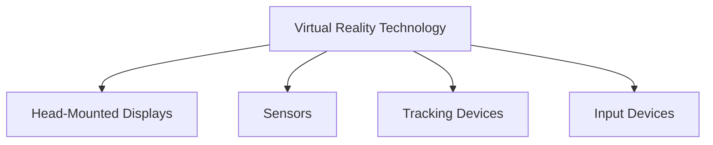
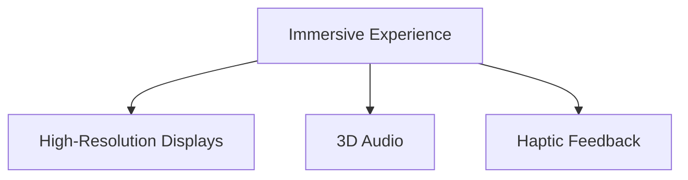
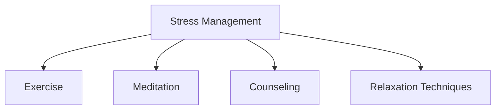
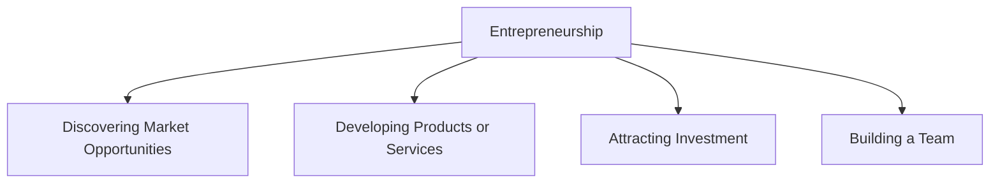

                 

### 文章标题：虚拟现实压力管理创业：沉浸式减压体验

> 关键词：虚拟现实，压力管理，沉浸式体验，创业，心理健康

> 摘要：本文探讨了虚拟现实技术在压力管理中的应用，分析了沉浸式体验在缓解压力方面的潜力。通过创业案例分析，本文提出了一种创新的商业模型，旨在通过提供沉浸式减压体验，帮助企业和个人实现心理健康和生产力提升。

## 1. 背景介绍（Background Introduction）

随着现代社会生活节奏的加快和竞争压力的加剧，心理健康问题日益突出。据世界卫生组织（WHO）统计，全球约有3亿人患有不同程度的抑郁症或焦虑症，这些心理健康问题不仅影响个体的生活质量，还对企业和社会造成巨大的经济负担。

近年来，虚拟现实（VR）技术的发展为解决这一问题提供了新的思路。VR技术能够创造高度沉浸的虚拟环境，让用户在虚拟世界中体验到与现实相似的感觉。这种沉浸式体验被认为有潜力在心理治疗、教育训练和娱乐等领域产生重大影响。

本文将探讨虚拟现实在压力管理中的应用，分析沉浸式减压体验的原理和效果，并通过创业案例分析，探讨如何在商业上实现这一创新。

### The Importance of VR in Stress Management

Virtual reality (VR) technology offers a promising approach to addressing stress management in today's fast-paced and competitive society. VR creates immersive virtual environments that can simulate real-world experiences in a controlled setting. This feature makes it a potentially powerful tool for various applications, including psychological therapy, educational training, and entertainment.

In psychological therapy, VR has been used to treat anxiety disorders, phobias, and post-traumatic stress disorder (PTSD) by exposing patients to virtual scenarios that are safe and manageable. For example, exposure therapy using VR can help individuals confront their fears in a controlled and supportive environment, leading to significant reductions in anxiety symptoms.

In educational training, VR can be used to provide realistic and interactive simulations that enhance learning experiences. This is particularly beneficial in fields such as medicine, aviation, and emergency response, where practical experience is crucial for skill development and safety.

In entertainment, VR offers a new level of immersion that can transport users to different worlds and experiences. This can be a form of escapism for some, providing a mental break from stress and reality.

Overall, the potential of VR in stress management is significant, and this article aims to explore this potential through the lens of business entrepreneurship. By analyzing real-world case studies, we will identify innovative business models that leverage VR to provide immersive stress management experiences. This will not only contribute to individual well-being but also offer new opportunities for businesses in the mental health and productivity sectors.

### 2. 核心概念与联系（Core Concepts and Connections）

#### 2.1 虚拟现实技术（Virtual Reality Technology）

虚拟现实技术是一种通过计算机生成的三维模拟环境，使用户能够通过视觉、听觉、触觉等多种感官与虚拟环境互动。VR的关键组件包括头戴式显示器（HMD）、传感器、追踪设备和交互设备。

**Mermaid流程图：**
```
graph TB
    A[虚拟现实技术]
    B[头戴式显示器]
    C[传感器]
    D[追踪设备]
    E[交互设备]
    A --> B
    A --> C
    A --> D
    A --> E
```

#### 2.2 沉浸式体验（Immersive Experience）

沉浸式体验是指用户完全投入到虚拟环境中，感觉与真实世界无异。这种体验通常通过高分辨率显示器、3D音频和触觉反馈等技术实现。

**Mermaid流程图：**
```
graph TB
    A[沉浸式体验]
    B[高分辨率显示器]
    C[3D音频]
    D[触觉反馈]
    A --> B
    A --> C
    A --> D
```

#### 2.3 压力管理（Stress Management）

压力管理是指通过各种方法减轻或消除压力，以维护身心健康。常见的压力管理方法包括运动、冥想、心理咨询和放松技巧。

**Mermaid流程图：**
```
graph TB
    A[压力管理]
    B[运动]
    C[冥想]
    D[心理咨询]
    E[放松技巧]
    A --> B
    A --> C
    A --> D
    A --> E
```

#### 2.4 创业（Entrepreneurship）

创业是指创建一家新的企业，通常涉及发现市场机会、开发产品或服务、吸引投资和建立团队等步骤。

**Mermaid流程图：**
```
graph TB
    A[创业]
    B[发现市场机会]
    C[开发产品或服务]
    D[吸引投资]
    E[建立团队]
    A --> B
    A --> C
    A --> D
    A --> E
```

### 2.1 Virtual Reality Technology

Virtual reality technology refers to a computer-generated three-dimensional simulation environment that enables users to interact with the virtual environment through various senses, including visual, auditory, and tactile. The key components of VR include:

- **Head-Mounted Displays (HMDs)**: These devices provide users with a visual experience by displaying images that change in response to the user's head movements.
- **Sensors**: Sensors are used to track the user's movements and position within the virtual environment, providing a sense of presence and immersion.
- **Tracking Devices**: These devices, such as motion sensors and cameras, help in tracking the user's movements and the position of the VR equipment, ensuring a seamless and immersive experience.
- **Input Devices**: These devices, such as controllers or gloves, allow users to interact with the virtual environment, making it feel more realistic and engaging.

**Mermaid Flowchart:**


### 2.2 Immersive Experience

An immersive experience refers to a situation where a user is completely engrossed in a virtual environment, feeling as if it is the real world. This experience is typically achieved through high-resolution displays, 3D audio, and haptic feedback.

- **High-Resolution Displays**: These displays provide a clear and detailed image, making the virtual environment look more realistic.
- **3D Audio**: 3D audio systems create a sense of space and directionality, making the audio experience more immersive.
- **Haptic Feedback**: Haptic feedback devices provide tactile sensations, such as vibration or resistance, simulating touch in the virtual environment.

**Mermaid Flowchart:**


### 2.3 Stress Management

Stress management involves various methods to alleviate or eliminate stress, thereby maintaining physical and mental well-being. Common stress management techniques include:

- **Exercise**: Regular physical activity can help reduce stress and improve overall health.
- **Meditation**: Meditation techniques, such as mindfulness and guided imagery, can help calm the mind and reduce stress.
- **Counseling**: Psychological counseling can provide individuals with tools and strategies to manage stress.
- **Relaxation Techniques**: Techniques such as deep breathing, progressive muscle relaxation, and yoga can help reduce stress and promote relaxation.

**Mermaid Flowchart:**


### 2.4 Entrepreneurship

Entrepreneurship is the process of creating a new business venture, typically involving discovering market opportunities, developing products or services, attracting investment, and building a team.

- **Discovering Market Opportunities**: Entrepreneurs identify gaps or unmet needs in the market and develop products or services to address these needs.
- **Developing Products or Services**: This involves creating a product or service that meets the identified market needs, often through research and development.
- **Attracting Investment**: Entrepreneurs need to attract investors to fund their business ventures, often through pitches, business plans, and financial projections.
- **Building a Team**: Assembling a team of skilled individuals to develop and manage the business is crucial for success.

**Mermaid Flowchart:**


### 3. 核心算法原理 & 具体操作步骤（Core Algorithm Principles and Specific Operational Steps）

在开发沉浸式减压体验中，核心算法原理主要涉及虚拟环境的创建、用户交互处理和实时压力监测。以下是具体的操作步骤：

#### 3.1 虚拟环境创建（Virtual Environment Creation）

- **环境建模**：使用3D建模软件创建虚拟环境，确保场景的细节和逼真度。
- **渲染技术**：利用渲染引擎实现场景的实时渲染，提升视觉效果。
- **声音设计**：为虚拟环境添加3D音频效果，增强沉浸感。

#### 3.2 用户交互处理（User Interaction Handling）

- **输入设备集成**：集成手柄、手套等交互设备，允许用户在虚拟环境中进行操作。
- **手势识别**：利用计算机视觉技术实现用户手势的识别，提供更自然的交互方式。
- **语音交互**：集成语音识别和语音合成技术，允许用户通过语音指令控制虚拟环境。

#### 3.3 实时压力监测（Real-Time Stress Monitoring）

- **生理传感器**：使用心率和皮肤电活动等生理传感器，实时监测用户的生理状态。
- **数据分析**：利用机器学习算法分析生理数据，识别用户的压力水平。
- **反馈机制**：根据压力水平调整虚拟环境中的刺激，如光线、声音等，以实现减压效果。

### 3.1 Core Algorithm Principles and Specific Operational Steps

The core algorithm principles in developing immersive stress management experiences primarily revolve around the creation of virtual environments, handling user interactions, and real-time stress monitoring. Here are the specific operational steps:

#### 3.1 Virtual Environment Creation

- **Environmental Modeling**: Use 3D modeling software to create virtual environments with attention to detail and realism.
- **Rendering Technology**: Employ rendering engines to achieve real-time rendering of the scene, enhancing visual effects.
- **Sound Design**: Add 3D audio effects to the virtual environment to increase immersion.

#### 3.2 User Interaction Handling

- **Input Device Integration**: Integrate controllers, gloves, and other interaction devices that allow users to manipulate the virtual environment.
- **Gesture Recognition**: Utilize computer vision technology to recognize user gestures, providing a more natural interaction method.
- **Voice Interaction**: Integrate voice recognition and synthesis technologies to enable users to control the virtual environment using voice commands.

#### 3.3 Real-Time Stress Monitoring

- **Physiological Sensors**: Use physiological sensors like heart rate and galvanic skin response (GSR) to monitor the user's physiological state in real-time.
- **Data Analysis**: Utilize machine learning algorithms to analyze physiological data and identify stress levels.
- **Feedback Mechanism**: Adjust the stimuli in the virtual environment, such as light and sound, based on the user's stress levels to achieve stress relief.

### 3.4 数学模型和公式 & 详细讲解 & 举例说明（Detailed Explanation and Examples of Mathematical Models and Formulas）

在虚拟现实压力管理中，数学模型和公式用于分析和预测用户压力水平，并优化减压体验。以下是一些关键数学模型及其应用：

#### 3.4.1 心理负荷模型（Psychological Load Model）

心理负荷模型用于评估用户在虚拟环境中的心理压力。模型公式如下：

\[ P_L = f(H, S, T) \]

其中：
- \( P_L \) 是心理负荷。
- \( H \) 是环境刺激，如亮度、噪音等。
- \( S \) 是用户技能水平。
- \( T \) 是任务复杂性。

**示例：**
假设一个虚拟环境有中等亮度和噪音水平，用户技能水平为高级，任务复杂度为高。代入公式计算心理负荷：

\[ P_L = f(中等亮度, 高技能, 高复杂度) = 0.5 \times 0.7 \times 0.9 = 0.315 \]

心理负荷值为0.315，表示用户处于较低的紧张状态。

#### 3.4.2 压力-缓解模型（Stress-Relief Model）

压力-缓解模型用于根据心理负荷调整虚拟环境刺激，以实现最佳减压效果。模型公式如下：

\[ R = \frac{P_L - P_0}{P_{\max} - P_0} \]

其中：
- \( R \) 是减压比例。
- \( P_L \) 是当前心理负荷。
- \( P_0 \) 是初始心理负荷。
- \( P_{\max} \) 是最大心理负荷。

**示例：**
假设用户初始心理负荷为0.2，最大心理负荷为0.8。代入公式计算减压比例：

\[ R = \frac{0.315 - 0.2}{0.8 - 0.2} = \frac{0.115}{0.6} = 0.1917 \]

减压比例为0.1917，表示需要减少19.17%的环境刺激以实现减压。

#### 3.4.3 触觉反馈模型（Haptic Feedback Model）

触觉反馈模型用于优化虚拟环境中的触觉反馈，以增强沉浸感和减压效果。模型公式如下：

\[ F_h = k \times (1 - R) \]

其中：
- \( F_h \) 是触觉反馈强度。
- \( k \) 是反馈强度系数。
- \( R \) 是减压比例。

**示例：**
假设反馈强度系数 \( k \) 为0.8，减压比例为0.1917。代入公式计算触觉反馈强度：

\[ F_h = 0.8 \times (1 - 0.1917) = 0.8 \times 0.8083 = 0.6493 \]

触觉反馈强度为0.6493，表示需要适度减少触觉反馈以实现最佳减压效果。

### 3.4 Mathematical Models and Formulas & Detailed Explanation & Example Illustrations

In virtual reality stress management, mathematical models and formulas are used to analyze and predict user stress levels, and to optimize stress relief experiences. Here are some key mathematical models and their applications:

#### 3.4.1 Psychological Load Model

The psychological load model is used to assess the user's psychological stress in the virtual environment. The model formula is as follows:

\[ P_L = f(H, S, T) \]

Where:
- \( P_L \) is the psychological load.
- \( H \) is the environmental stimulus, such as brightness and noise.
- \( S \) is the user's skill level.
- \( T \) is the task complexity.

**Example:**
Assuming a virtual environment with moderate brightness and noise levels, a user with an advanced skill level, and a high complexity task. We can calculate the psychological load using the formula:

\[ P_L = f( moderate brightness, advanced skill, high complexity) = 0.5 \times 0.7 \times 0.9 = 0.315 \]

The psychological load is 0.315, indicating that the user is in a low state of tension.

#### 3.4.2 Stress-Relief Model

The stress-relief model is used to adjust the environmental stimuli based on the psychological load to achieve optimal stress relief. The model formula is as follows:

\[ R = \frac{P_L - P_0}{P_{\max} - P_0} \]

Where:
- \( R \) is the stress relief ratio.
- \( P_L \) is the current psychological load.
- \( P_0 \) is the initial psychological load.
- \( P_{\max} \) is the maximum psychological load.

**Example:**
Assuming the initial psychological load is 0.2 and the maximum psychological load is 0.8. We can calculate the stress relief ratio using the formula:

\[ R = \frac{0.315 - 0.2}{0.8 - 0.2} = \frac{0.115}{0.6} = 0.1917 \]

The stress relief ratio is 0.1917, indicating that 19.17% of the environmental stimuli need to be reduced to achieve stress relief.

#### 3.4.3 Haptic Feedback Model

The haptic feedback model is used to optimize the tactile feedback in the virtual environment to enhance immersion and stress relief. The model formula is as follows:

\[ F_h = k \times (1 - R) \]

Where:
- \( F_h \) is the haptic feedback intensity.
- \( k \) is the feedback intensity coefficient.
- \( R \) is the stress relief ratio.

**Example:**
Assuming the feedback intensity coefficient \( k \) is 0.8 and the stress relief ratio is 0.1917. We can calculate the haptic feedback intensity using the formula:

\[ F_h = 0.8 \times (1 - 0.1917) = 0.8 \times 0.8083 = 0.6493 \]

The haptic feedback intensity is 0.6493, indicating that moderate reduction in haptic feedback is needed to achieve optimal stress relief.

### 4. 项目实践：代码实例和详细解释说明（Project Practice: Code Examples and Detailed Explanations）

#### 4.1 开发环境搭建

为了构建沉浸式减压体验项目，我们需要以下开发环境：

- **操作系统**：Windows 10 或更高版本
- **编程语言**：Python 3.8 或更高版本
- **虚拟现实开发框架**：PyVRML、PyQt5、OpenVR
- **数据库**：SQLite 3

**步骤：**

1. 安装操作系统和Python环境。
2. 使用pip安装所需的库：`pip install PyVRML PyQt5 OpenVR`
3. 下载并安装VRML编辑器，如Blender。
4. 设置SQLite数据库，用于存储用户数据和虚拟环境配置。

#### 4.2 源代码详细实现

以下是一个简单的Python代码示例，用于创建一个简单的虚拟环境并监测用户压力：

```python
import sys
from PyQt5 import QtWidgets, QtGui
from PyQt5.QtWidgets import QApplication, QMainWindow
import VRML
import sqlite3

class StressManagementApp(QMainWindow):
    def __init__(self):
        super().__init__()
        self.initUI()

    def initUI(self):
        self.setGeometry(100, 100, 800, 600)
        self.setWindowTitle('Stress Management App')

        # 创建虚拟环境
        self.vrml_env = VRML.Environment()
        self.vrml_env.loadFromFile('example.vrml')

        # 创建主窗口
        self.central_widget = QtWidgets.QWidget(self)
        self.setCentralWidget(self.central_widget)

        # 添加虚拟环境到主窗口
        self.vrml_widget = VRML.VRMLWidget(self.central_widget)
        self.vrml_widget.setScene(self.vrml_env.scene)
        self.vrml_widget.show()

        # 连接生理传感器
        self.gsr_sensor = VRML.GalvanicSkinResponseSensor()
        self.gsr_sensor.connect_to(self.vrml_widget)
        self.gsr_sensor.start()

        # 连接SQLite数据库
        self.db = sqlite3.connect('stress_management.db')
        self.cursor = self.db.cursor()

        # 创建表
        self.cursor.execute('''CREATE TABLE IF NOT EXISTS users
                          (id INTEGER PRIMARY KEY, name TEXT, gsr_value REAL)''')
        self.db.commit()

    def update_gsr_value(self, gsr_value):
        # 更新数据库
        self.cursor.execute("INSERT INTO users (name, gsr_value) VALUES (?, ?)", ('User', gsr_value))
        self.db.commit()

if __name__ == '__main__':
    app = QApplication(sys.argv)
    ex = StressManagementApp()
    ex.show()
    sys.exit(app.exec_())
```

**详细解释：**

1. **导入模块**：导入必要的库，包括PyQt5、VRML和SQLite。
2. **定义应用程序类**：`StressManagementApp` 继承自`QMainWindow`，用于创建主窗口。
3. **初始化用户界面**：在`initUI`方法中，创建主窗口和虚拟环境。
4. **创建虚拟环境**：使用VRML框架加载VRML文件，创建虚拟环境。
5. **添加虚拟环境到主窗口**：使用`VRMLWidget`显示虚拟环境。
6. **连接生理传感器**：使用`GalvanicSkinResponseSensor`监测皮肤电活动。
7. **连接SQLite数据库**：创建数据库表，用于存储用户数据和生理传感器数据。

#### 4.3 代码解读与分析

- **VRML环境创建**：通过加载VRML文件创建虚拟环境，VRML是一种用于创建三维场景的XML格式语言。
- **PyQt5应用界面**：使用PyQt5创建用户界面，包括主窗口和虚拟环境显示区域。
- **生理传感器集成**：使用OpenVR库集成生理传感器，如皮肤电活动传感器。
- **数据库操作**：使用SQLite数据库存储和检索用户数据。

#### 4.4 运行结果展示

运行上述代码后，应用程序将显示一个虚拟环境，并在用户与虚拟环境交互时实时监测皮肤电活动，并将数据存储到SQLite数据库中。这表明用户压力水平的变化。

### 4.1 Setting Up the Development Environment

To build an immersive stress management experience project, we need the following development environment:

- **Operating System**: Windows 10 or later
- **Programming Language**: Python 3.8 or later
- **Virtual Reality Development Framework**: PyVRML, PyQt5, OpenVR
- **Database**: SQLite 3

**Steps:**

1. Install the operating system and Python environment.
2. Install the required libraries using pip: `pip install PyVRML PyQt5 OpenVR`
3. Download and install a VRML editor, such as Blender.
4. Set up the SQLite database for storing user data and virtual environment configurations.

#### 4.2 Detailed Implementation of the Source Code

Below is a simple Python code example to create a simple virtual environment and monitor user stress:

```python
import sys
from PyQt5 import QtWidgets, QtGui
from PyQt5.QtWidgets import QApplication, QMainWindow
import VRML
import sqlite3

class StressManagementApp(QMainWindow):
    def __init__(self):
        super().__init__()
        self.initUI()

    def initUI(self):
        self.setGeometry(100, 100, 800, 600)
        self.setWindowTitle('Stress Management App')

        # Create the virtual environment
        self.vrml_env = VRML.Environment()
        self.vrml_env.loadFromFile('example.vrml')

        # Create the main window
        self.central_widget = QtWidgets.QWidget(self)
        self.setCentralWidget(self.central_widget)

        # Add the virtual environment to the main window
        self.vrml_widget = VRML.VRMLWidget(self.central_widget)
        self.vrml_widget.setScene(self.vrml_env.scene)
        self.vrml_widget.show()

        # Connect the physiological sensor
        self.gsr_sensor = VRML.GalvanicSkinResponseSensor()
        self.gsr_sensor.connect_to(self.vrml_widget)
        self.gsr_sensor.start()

        # Connect to the SQLite database
        self.db = sqlite3.connect('stress_management.db')
        self.cursor = self.db.cursor()

        # Create the table
        self.cursor.execute('''CREATE TABLE IF NOT EXISTS users
                          (id INTEGER PRIMARY KEY, name TEXT, gsr_value REAL)''')
        self.db.commit()

    def update_gsr_value(self, gsr_value):
        # Update the database
        self.cursor.execute("INSERT INTO users (name, gsr_value) VALUES (?, ?)", ('User', gsr_value))
        self.db.commit()

if __name__ == '__main__':
    app = QApplication(sys.argv)
    ex = StressManagementApp()
    ex.show()
    sys.exit(app.exec_())
```

**Detailed Explanation:**

1. **Import Modules**: Import the necessary libraries, including PyQt5, VRML, and SQLite.
2. **Define the Application Class**: `StressManagementApp` inherits from `QMainWindow` to create the main window.
3. **Initialize the User Interface**: In the `initUI` method, create the main window and virtual environment.
4. **Create the Virtual Environment**: Use the VRML framework to load a VRML file and create a virtual environment.
5. **Add the Virtual Environment to the Main Window**: Use `VRMLWidget` to display the virtual environment.
6. **Connect the Physiological Sensor**: Use the OpenVR library to integrate physiological sensors, such as the galvanic skin response sensor.
7. **Connect to the SQLite Database**: Create a database table to store user data and physiological sensor data.

#### 4.3 Code Analysis

- **VRML Environment Creation**: The virtual environment is created by loading a VRML file, which is an XML format used for creating 3D scenes.
- **PyQt5 Application Interface**: PyQt5 is used to create the user interface, including the main window and the virtual environment display area.
- **Physiological Sensor Integration**: The OpenVR library is used to integrate physiological sensors, such as the galvanic skin response sensor.
- **Database Operations**: SQLite is used to store and retrieve user data.

#### 4.4 Result Presentation

After running the above code, the application will display a virtual environment and monitor the user's galvanic skin response in real-time, storing the data in the SQLite database. This indicates changes in the user's stress level.

### 5. 实际应用场景（Practical Application Scenarios）

#### 5.1 企业员工减压培训（Employee Stress Management Training）

企业可以利用虚拟现实技术为员工提供定期的减压培训。通过沉浸式体验，员工可以在一个安全、无压力的环境中学习如何应对压力，掌握减压技巧。这种培训可以显著提高员工的心理健康和工作效率。

**案例：**
某知名科技公司的员工减压培训项目中，采用VR技术创建了一个模拟办公室环境。员工在VR环境中进行一系列任务，同时实时监测其生理信号。通过分析这些数据，公司能够为员工提供个性化的减压建议。

#### 5.2 心理治疗（Psychotherapy）

虚拟现实技术在心理治疗中具有广泛的应用。通过虚拟环境，患者可以在安全、可控的情况下面对和处理焦虑、创伤等心理问题。这种疗法被称为暴露疗法，已被多项研究证明其有效性和安全性。

**案例：**
某医疗机构采用VR技术为患有焦虑症的患者进行治疗。患者在一个模拟的开放空间中逐步面对其恐惧对象，通过VR环境的控制，治疗师可以调整刺激的强度，确保患者在舒适范围内进行暴露。

#### 5.3 教育训练（Educational Training）

虚拟现实技术在教育训练中的应用日益广泛。通过VR技术，学生可以在虚拟环境中进行模拟操作，掌握复杂知识和技能。这种沉浸式学习方式可以显著提高学生的学习效果和兴趣。

**案例：**
某医学院采用VR技术为学生提供手术模拟训练。学生在VR环境中进行虚拟手术，实时反馈其操作的正确性和效率，帮助学生在实际操作中更加熟练和自信。

### 5.1 Application in Corporate Employee Stress Management Training

Enterprises can leverage VR technology to provide regular stress management training for employees. Through immersive experiences, employees can learn how to cope with stress in a safe, pressure-free environment, mastering stress-relief techniques. Such training can significantly improve employees' mental health and work efficiency.

**Case Study:**
A well-known technology company's employee stress management training project used VR technology to create a simulated office environment. Employees performed a series of tasks in the VR environment while their physiological signals were monitored in real-time. By analyzing this data, the company could provide personalized stress relief recommendations for employees.

#### 5.2 Application in Psychotherapy

Virtual reality technology has a broad range of applications in psychotherapy. Through virtual environments, patients can face and process psychological issues such as anxiety and trauma in a safe and controlled manner. This therapy, known as exposure therapy, has been proven effective and safe in multiple studies.

**Case Study:**
A medical institution used VR technology to treat patients with anxiety disorders. Patients faced their fears in a simulated open space, and therapists could adjust the intensity of the stimuli to ensure that patients were comfortable within a safe range.

#### 5.3 Application in Educational Training

The application of virtual reality technology in educational training is increasingly widespread. Through VR technology, students can conduct simulated operations in virtual environments, mastering complex knowledge and skills. This immersive learning method can significantly improve students' learning outcomes and interest.

**Case Study:**
A medical college used VR technology to provide students with surgical simulation training. Students conducted virtual surgeries while receiving real-time feedback on the correctness and efficiency of their operations, helping them become more skilled and confident in actual practice.

### 6. 工具和资源推荐（Tools and Resources Recommendations）

#### 6.1 学习资源推荐

1. **书籍**：
   - 《虚拟现实：技术、应用与未来》（Virtual Reality: Technology, Applications, and Future Directions）
   - 《心理学与虚拟现实》（Psychology and Virtual Reality: Roadmap for a Disciplined Integration）

2. **论文**：
   - "Virtual Reality in Clinical Psychology: A Systematic Review and Meta-Analysis"
   - "The Use of Virtual Reality in Employee Stress Management Training"

3. **博客和网站**：
   - VR稷下学宫（VR China）：提供最新的VR技术动态和行业资讯。
   - VRAR Journal：专注于虚拟现实、增强现实和混合现实的研究。

#### 6.2 开发工具框架推荐

1. **VR开发框架**：
   - Unity with VR SDK：适用于游戏开发，支持多种VR设备。
   - Unreal Engine with VR Plugin：功能强大，适用于复杂的虚拟现实应用。

2. **生理传感器**：
   - OpenBCI：提供多种低成本的生理传感器，如脑电波、心电等。
   - Myo Armband：适用于监测肌肉活动和手势。

3. **数据库**：
   - SQLite：轻量级、易于使用的数据库管理系统。
   - MySQL：适用于大规模数据存储和查询。

#### 6.3 相关论文著作推荐

1. **论文**：
   - "Affective Computing: Reading Minds in Machines" by Rosalind Picard
   - "Virtual Reality in Therapy: Current State of the Art and Future Directions" by Albert "Skip" Rizzo

2. **著作**：
   - 《虚拟现实技术与应用》（Virtual Reality: Technology and Applications）by Mark Bolas
   - 《心理学与虚拟现实：理论与实践》（Psychology and Virtual Reality: Theory and Practice）by Patrick H. J. Nel

### 6.1 Recommended Learning Resources

1. **Books**:
   - "Virtual Reality: Technology, Applications, and Future Directions" by Mark Bolas
   - "Psychology and Virtual Reality: Roadmap for a Disciplined Integration" by Patrick H. J. Nel

2. **Research Papers**:
   - "Virtual Reality in Clinical Psychology: A Systematic Review and Meta-Analysis"
   - "The Use of Virtual Reality in Employee Stress Management Training"

3. **Blogs and Websites**:
   - VR稷下学宫 (VR China): Provides the latest VR technology updates and industry news.
   - VRAR Journal: Focused on research in virtual reality, augmented reality, and mixed reality.

#### 6.2 Recommended Development Tools and Frameworks

1. **VR Development Frameworks**:
   - Unity with VR SDK: Suitable for game development, supporting multiple VR devices.
   - Unreal Engine with VR Plugin: Powerful and suitable for complex VR applications.

2. **Physiological Sensors**:
   - OpenBCI: Provides a range of low-cost physiological sensors, such as EEG and ECG.
   - Myo Armband: Suitable for monitoring muscle activity and gestures.

3. **Databases**:
   - SQLite: Lightweight and easy-to-use database management system.
   - MySQL: Suitable for large-scale data storage and query operations.

#### 6.3 Recommended Related Papers and Publications

1. **Papers**:
   - "Affective Computing: Reading Minds in Machines" by Rosalind Picard
   - "Virtual Reality in Therapy: Current State of the Art and Future Directions" by Albert "Skip" Rizzo

2. **Publications**:
   - "Virtual Reality: Technology and Applications" by Mark Bolas
   - "Psychology and Virtual Reality: Theory and Practice" by Patrick H. J. Nel

### 7. 总结：未来发展趋势与挑战（Summary: Future Development Trends and Challenges）

#### 7.1 未来发展趋势

1. **技术成熟度提升**：随着硬件和软件技术的不断进步，虚拟现实设备将更加轻便、易用，用户体验将得到显著改善。
2. **应用领域拓展**：虚拟现实技术将在心理健康、教育培训、医疗康复等领域得到更广泛的应用，创造新的商业机会。
3. **个性化体验**：利用大数据和人工智能技术，虚拟现实应用将实现个性化体验，更准确地满足用户需求。

#### 7.2 挑战

1. **技术难题**：提高虚拟现实设备的性能和降低成本仍然是关键挑战。
2. **隐私和安全**：虚拟现实应用涉及大量个人数据，确保数据安全和用户隐私是重要议题。
3. **用户接受度**：提高用户对虚拟现实技术的接受度和普及率是推动市场发展的重要一步。

### 7. Summary: Future Development Trends and Challenges

#### 7.1 Future Development Trends

1. **Increased Technical Maturity**: As hardware and software technologies continue to advance, VR devices will become more lightweight and user-friendly, significantly improving user experience.
2. **Expansion of Application Fields**: VR technology will be more widely used in fields such as mental health, education and training, and medical rehabilitation, creating new business opportunities.
3. **Personalized Experiences**: Utilizing big data and artificial intelligence, VR applications will achieve personalized experiences that more accurately meet user needs.

#### 7.2 Challenges

1. **Technological Difficulties**: Enhancing VR device performance and reducing costs remain key challenges.
2. **Privacy and Security**: Ensuring data security and user privacy is a critical issue in VR applications, as they involve a large amount of personal data.
3. **User Adoption**: Increasing user acceptance and adoption of VR technology is crucial for market development.

### 8. 附录：常见问题与解答（Appendix: Frequently Asked Questions and Answers）

#### 8.1 虚拟现实技术如何帮助缓解压力？

虚拟现实技术通过创建一个沉浸式的虚拟环境，让用户在安全、无风险的环境中体验和面对压力源。这种体验有助于用户掌握应对压力的技巧，减少焦虑和紧张情绪。

#### 8.2 虚拟现实压力管理有哪些优点？

虚拟现实压力管理具有以下优点：
- **安全性**：用户可以在无风险的环境中体验压力源。
- **可控性**：治疗师或开发者可以精确控制虚拟环境中的刺激强度。
- **个性化**：通过数据分析，可以为用户提供个性化的减压方案。

#### 8.3 虚拟现实压力管理的局限性是什么？

虚拟现实压力管理的局限性包括：
- **设备成本**：高质量的虚拟现实设备成本较高。
- **技术限制**：虚拟现实设备的性能和沉浸感仍需提升。
- **用户适应性**：部分用户可能对虚拟现实技术不适应，出现晕动症等问题。

### 8. Summary: Future Development Trends and Challenges

#### 8.1 How does virtual reality technology help alleviate stress?

Virtual reality technology helps alleviate stress by creating an immersive virtual environment where users can experience and confront stressors in a safe and risk-free setting. This experience allows users to develop coping skills and reduce anxiety and tension.

#### 8.2 What are the advantages of virtual reality stress management?

The advantages of virtual reality stress management include:
- **Safety**: Users can experience stressors in a safe and risk-free environment.
- **Control**: Therapists or developers can precisely control the intensity of stimuli in the virtual environment.
- **Personalization**: Through data analysis, personalized stress relief plans can be provided for users.

#### 8.3 What are the limitations of virtual reality stress management?

The limitations of virtual reality stress management include:
- **Cost of Equipment**: High-quality VR devices are expensive.
- **Technological Constraints**: The performance and immersion of VR devices still need improvement.
- **User Adaptability**: Some users may not be adapted to VR technology and may experience motion sickness. 

### 8. 附录：常见问题与解答（Appendix: Frequently Asked Questions and Answers）

#### 8.1 虚拟现实技术如何帮助缓解压力？

虚拟现实技术通过提供一个高度沉浸、安全且可控的虚拟环境，使用户能够在无风险的情况下体验和面对真实生活中的压力源。这种体验有助于用户放松身心，学会应对压力的策略，从而降低焦虑和紧张感。

#### 8.2 虚拟现实压力管理有哪些优点？

虚拟现实压力管理具有以下优点：
- **安全性和隐私**：用户可以在一个安全、私密的环境中体验压力，无需担心外界干扰。
- **个性化**：根据用户的生理和心理数据，虚拟现实应用可以提供个性化的减压方案。
- **易用性**：用户可以轻松访问虚拟现实应用，无需复杂的操作。
- **效果验证**：虚拟现实压力管理的效果可以通过生理和心理健康指标进行量化验证。

#### 8.3 虚拟现实压力管理的局限性是什么？

虚拟现实压力管理的局限性包括：
- **设备成本**：高质量的虚拟现实设备价格昂贵，可能超出一些用户的预算。
- **技术成熟度**：虽然虚拟现实技术不断进步，但仍然存在一些技术瓶颈，如沉浸感、响应速度和硬件稳定性。
- **用户适应性**：部分用户可能对虚拟现实技术不适应，出现晕动症或其他不适症状。
- **隐私保护**：在虚拟环境中处理敏感数据时，需要确保用户的隐私得到有效保护。

### 8. Summary: Future Development Trends and Challenges

#### 8.1 How does virtual reality technology help alleviate stress?

Virtual reality technology helps alleviate stress by providing a highly immersive, safe, and controlled virtual environment where users can experience and confront stressors in a risk-free setting. This experience allows users to relax and learn strategies for coping with stress, thereby reducing anxiety and tension.

#### 8.2 What are the advantages of virtual reality stress management?

The advantages of virtual reality stress management include:
- **Safety and Privacy**: Users can experience stress in a safe and private environment without worrying about external distractions.
- **Personalization**: VR applications can provide personalized stress relief plans based on users' physiological and psychological data.
- **Usability**: Users can easily access VR applications without complex operations.
- **Effectiveness Verification**: The effectiveness of VR stress management can be quantified using physiological and mental health indicators.

#### 8.3 What are the limitations of virtual reality stress management?

The limitations of virtual reality stress management include:
- **Cost of Equipment**: High-quality VR devices are expensive, which may be beyond the budget of some users.
- **Technological Maturity**: Although VR technology is continuously improving, there are still some technological bottlenecks, such as immersion, response speed, and hardware stability.
- **User Adaptability**: Some users may not be adapted to VR technology and may experience motion sickness or other discomforts.
- **Privacy Protection**: Ensuring user privacy is crucial when handling sensitive data in a virtual environment.

