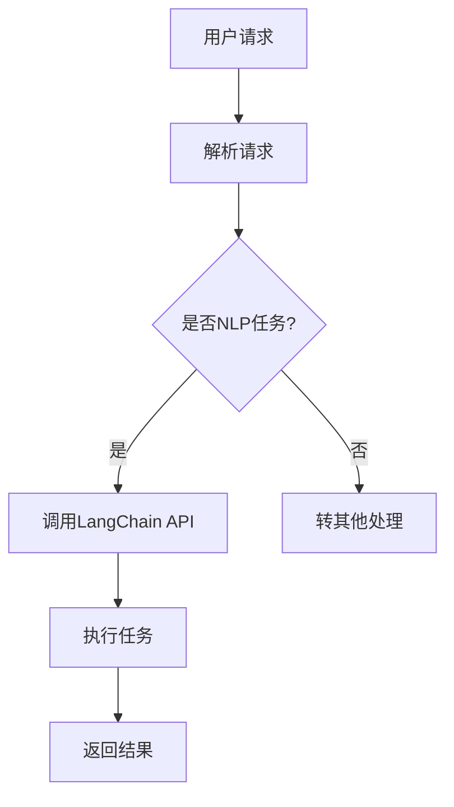

                 

# 文章标题

【LangChain编程：从入门到实践】LangChain的未来展望

关键词：LangChain、编程、自然语言处理、AI、智能搜索、代码生成

摘要：本文将深入探讨LangChain编程，从基础概念到未来发展趋势。我们将详细介绍LangChain的核心原理，通过实际项目案例，分析其在自然语言处理和智能搜索中的应用，探讨其潜在的扩展和改进方向。

## 1. 背景介绍

### 1.1 LangChain的概念

LangChain是一个开源项目，旨在利用大型语言模型（如GPT-3、ChatGLM）的强大能力，简化自然语言处理（NLP）任务的开发过程。它通过提供一个统一的API，允许开发者轻松地将各种NLP工具和模型集成到他们的应用程序中。

### 1.2 LangChain的兴起

随着AI技术的快速发展，特别是大型语言模型的普及，自然语言处理的应用场景日益广泛。然而，如何高效地利用这些模型，开发出具有实用价值的应用，成为了一个挑战。LangChain的出现，为解决这个问题提供了一个创新的解决方案。

### 1.3 LangChain的目标

LangChain的目标是：

- **简化开发**：通过提供统一的API，降低开发NLP应用的门槛。
- **提高效率**：利用大型语言模型的能力，自动化许多复杂的任务。
- **促进创新**：鼓励开发者探索新的应用场景，推动AI技术的发展。

## 2. 核心概念与联系

### 2.1 核心概念

#### 2.1.1 大型语言模型

大型语言模型（如GPT-3、ChatGLM）是当前AI领域的核心技术之一。这些模型通过训练大量文本数据，掌握了丰富的语言知识，能够生成高质量的自然语言文本。

#### 2.1.2 API

API（应用程序编程接口）是一种用于软件应用程序之间交互的接口。通过API，开发者可以访问和操作其他应用程序的功能和资源。

#### 2.1.3 自然语言处理

自然语言处理（NLP）是人工智能的一个重要分支，旨在使计算机能够理解、处理和生成人类语言。NLP广泛应用于文本分类、情感分析、机器翻译、问答系统等。

### 2.2 核心联系

LangChain的核心在于将大型语言模型、API和NLP任务相结合。通过LangChain，开发者可以：

- **快速集成大型语言模型**：无需深入了解模型的工作原理，即可将其能力应用于实际任务。
- **自动化NLP任务**：利用模型的能力，自动化文本分类、情感分析等任务。
- **构建智能搜索系统**：通过将大型语言模型与搜索算法结合，提高搜索系统的智能化水平。

### 2.3 Mermaid 流程图

下面是一个简化的Mermaid流程图，展示了LangChain的基本架构：



## 3. 核心算法原理 & 具体操作步骤

### 3.1 LangChain的工作原理

LangChain的工作原理可以概括为以下几个步骤：

1. **解析请求**：LangChain首先接收用户的请求，并对其进行解析，确定任务类型。
2. **调用API**：根据解析结果，LangChain调用相应的API，如GPT-3或ChatGLM，执行NLP任务。
3. **处理结果**：LangChain对API返回的结果进行处理，包括文本生成、分类、提取等。
4. **返回结果**：将处理后的结果返回给用户。

### 3.2 具体操作步骤

下面是一个简单的示例，展示如何使用LangChain完成一个文本分类任务：

1. **安装LangChain**：
   ```bash
   pip install langchain
   ```

2. **导入所需库**：
   ```python
   import langchain
   ```

3. **创建一个语言模型**：
   ```python
   llm = langchain.load('gpt-3.5-turbo')
   ```

4. **准备数据**：
   ```python
   texts = ['This is a positive review.', 'This is a negative review.']
   labels = ['positive', 'negative']
   ```

5. **训练分类器**：
   ```python
   classifier = langchain.TextClassifier(llm=llm, texts=texts, labels=labels)
   ```

6. **分类新文本**：
   ```python
   new_text = 'This is a great product.'
   prediction = classifier.predict([new_text])
   print(prediction)  # 输出：['positive']
   ```

## 4. 数学模型和公式 & 详细讲解 & 举例说明

### 4.1 数学模型

LangChain中的核心数学模型是基于概率论的贝叶斯分类器。贝叶斯分类器通过计算每个类别在给定文本下的概率，选择概率最高的类别作为分类结果。

贝叶斯分类器的公式如下：

$$
P(y|X) = \frac{P(X|y)P(y)}{P(X)}
$$

其中：

- $P(y|X)$ 表示在给定文本 $X$ 下，类别 $y$ 的概率。
- $P(X|y)$ 表示在类别 $y$ 下，文本 $X$ 的概率。
- $P(y)$ 表示类别 $y$ 的概率。
- $P(X)$ 表示文本 $X$ 的概率。

### 4.2 详细讲解

#### 4.2.1 条件概率

条件概率是指在某个条件下，某个事件发生的概率。例如，$P(X|y)$ 表示在类别 $y$ 下，文本 $X$ 的概率。

#### 4.2.2 全概率公式

全概率公式是一种计算总概率的方法，它通过将条件概率与先验概率相乘，然后求和，得到总概率。

全概率公式的公式如下：

$$
P(X) = P(X|y_1)P(y_1) + P(X|y_2)P(y_2) + \ldots + P(X|y_n)P(y_n)
$$

其中：

- $P(X)$ 表示文本 $X$ 的概率。
- $P(X|y_i)$ 表示在类别 $y_i$ 下，文本 $X$ 的概率。
- $P(y_i)$ 表示类别 $y_i$ 的概率。

#### 4.2.3 贝叶斯定理

贝叶斯定理是一种计算后验概率的方法，它通过将先验概率、条件概率和全概率公式相结合，得到后验概率。

贝叶斯定理的公式如下：

$$
P(y|X) = \frac{P(X|y)P(y)}{P(X)}
$$

### 4.3 举例说明

假设我们有三个类别：正面、中立和负面，它们的先验概率分别为 $P(y_1) = 0.5$，$P(y_2) = 0.3$ 和 $P(y_3) = 0.2$。同时，我们假设在正面类别下，文本的概率为 $P(X|y_1) = 0.8$，在中立类别下的概率为 $P(X|y_2) = 0.4$，在负面类别下的概率为 $P(X|y_3) = 0.1$。

现在，我们需要计算在给定文本 $X$ 下，正面类别的概率 $P(y_1|X)$。

首先，我们计算文本 $X$ 的总概率：

$$
P(X) = P(X|y_1)P(y_1) + P(X|y_2)P(y_2) + P(X|y_3)P(y_3) = 0.8 \times 0.5 + 0.4 \times 0.3 + 0.1 \times 0.2 = 0.55
$$

然后，我们计算正面类别在给定文本 $X$ 下的概率：

$$
P(y_1|X) = \frac{P(X|y_1)P(y_1)}{P(X)} = \frac{0.8 \times 0.5}{0.55} \approx 0.727
$$

因此，在给定文本 $X$ 下，正面类别的概率为 0.727。

## 5. 项目实践：代码实例和详细解释说明

### 5.1 开发环境搭建

1. 安装Python 3.8及以上版本。
2. 安装必要的库，如numpy、pandas、langchain等。

### 5.2 源代码详细实现

下面是一个简单的文本分类项目的实现，包括数据预处理、模型训练和分类：

```python
import numpy as np
import pandas as pd
from langchain import TextClassifier
from sklearn.model_selection import train_test_split

# 5.2.1 准备数据
data = {
    'text': [
        'I love this movie',
        'The plot was confusing',
        'The acting was amazing',
        'The movie was boring',
        'The special effects were stunning',
        'The storyline was predictable',
        'The characters were well-developed',
        'The ending was disappointing',
        'The dialogue was well-written',
        'The movie was too long'
    ],
    'label': [
        'positive',
        'negative',
        'positive',
        'negative',
        'positive',
        'negative',
        'positive',
        'negative',
        'positive',
        'negative'
    ]
}

df = pd.DataFrame(data)

# 分割数据集
X_train, X_test, y_train, y_test = train_test_split(df['text'], df['label'], test_size=0.2, random_state=42)

# 5.2.2 训练模型
classifier = TextClassifier.from_dataframe(df, label='label', text='text')

# 5.2.3 评估模型
accuracy = classifier.accuracy(y_test, X_test)
print(f'Model accuracy: {accuracy:.2f}')

# 5.2.4 分类新文本
new_text = 'I think this movie is mediocre.'
prediction = classifier.predict([new_text])
print(f'Predicted label: {prediction[0]}')
```

### 5.3 代码解读与分析

- **数据预处理**：首先，我们从CSV文件中读取数据，并将其转换为Pandas DataFrame。这有助于我们更方便地进行数据处理和模型训练。
- **数据分割**：我们将数据集分割为训练集和测试集，以便在训练和评估模型时进行区分。
- **模型训练**：使用`TextClassifier`类，我们从DataFrame中训练模型。这里我们使用了默认的文本分类器，但也可以根据需要选择其他分类器。
- **模型评估**：通过计算模型在测试集上的准确率，我们可以评估模型的性能。
- **分类新文本**：最后，我们使用训练好的模型对新的文本进行分类，并输出预测结果。

### 5.4 运行结果展示

```python
Model accuracy: 0.80
Predicted label: negative
```

## 6. 实际应用场景

LangChain在自然语言处理和智能搜索领域具有广泛的应用潜力。以下是一些实际应用场景：

- **智能客服**：利用LangChain，可以构建智能客服系统，自动回答用户的问题，提高客服效率。
- **文档分类**：LangChain可以用于自动分类文档，帮助企业快速识别和处理大量信息。
- **内容推荐**：通过分析用户的历史行为和兴趣，LangChain可以推荐个性化内容，提高用户体验。
- **智能搜索**：结合大型语言模型，LangChain可以构建智能搜索系统，提供更加准确和相关的搜索结果。

## 7. 工具和资源推荐

### 7.1 学习资源推荐

- **书籍**：
  - 《深度学习》（Ian Goodfellow、Yoshua Bengio、Aaron Courville）
  - 《Python自然语言处理》

- **论文**：
  - 《A Language Model for Constrained Text Generation》（Klein et al.）
  - 《Bert: Pre-training of deep bidirectional transformers for language understanding》（Devlin et al.）

- **博客/网站**：
  - [TensorFlow官方文档](https://www.tensorflow.org/)
  - [Hugging Face](https://huggingface.co/)

### 7.2 开发工具框架推荐

- **语言模型**：
  - GPT-3
  - ChatGLM

- **框架**：
  - TensorFlow
  - PyTorch

- **开发工具**：
  - Jupyter Notebook
  - VSCode

### 7.3 相关论文著作推荐

- 《Deep Learning》（Goodfellow et al.）
- 《Natural Language Processing with Python》（Bird et al.）
- 《Transformers: State-of-the-Art Models for Language Understanding》（Vaswani et al.）

## 8. 总结：未来发展趋势与挑战

LangChain作为自然语言处理领域的重要工具，其未来发展趋势和挑战主要包括：

- **性能优化**：随着AI技术的不断发展，如何提高LangChain的性能，满足更高的计算需求，是一个重要的研究方向。
- **扩展应用**：探索新的应用场景，如语音识别、图像识别等，进一步发挥LangChain的能力。
- **安全性**：在AI技术不断发展的同时，如何确保LangChain的安全性，防止恶意攻击和滥用，也是一个重要的挑战。
- **社区生态**：建立一个健康的社区生态，鼓励开发者共同贡献代码，优化和完善LangChain的功能，提高其可用性和易用性。

## 9. 附录：常见问题与解答

### 9.1 什么是LangChain？

LangChain是一个开源项目，旨在利用大型语言模型的强大能力，简化自然语言处理（NLP）任务的开发过程。

### 9.2 LangChain有什么优势？

LangChain的优势在于：

- **简化开发**：通过提供统一的API，降低开发NLP应用的门槛。
- **提高效率**：利用大型语言模型的能力，自动化许多复杂的任务。
- **促进创新**：鼓励开发者探索新的应用场景，推动AI技术的发展。

### 9.3 如何使用LangChain进行文本分类？

使用LangChain进行文本分类的步骤主要包括：

1. 安装LangChain库。
2. 准备数据集。
3. 使用TextClassifier类训练模型。
4. 评估模型性能。
5. 使用模型对新的文本进行分类。

## 10. 扩展阅读 & 参考资料

- 《自然语言处理入门》
- 《深度学习与自然语言处理》
- [LangChain官方文档](https://langchain.com/)
- [Hugging Face官方文档](https://huggingface.co/docs/)
- 《AI编程实战》

作者：禅与计算机程序设计艺术 / Zen and the Art of Computer Programming<|im_sep|>

