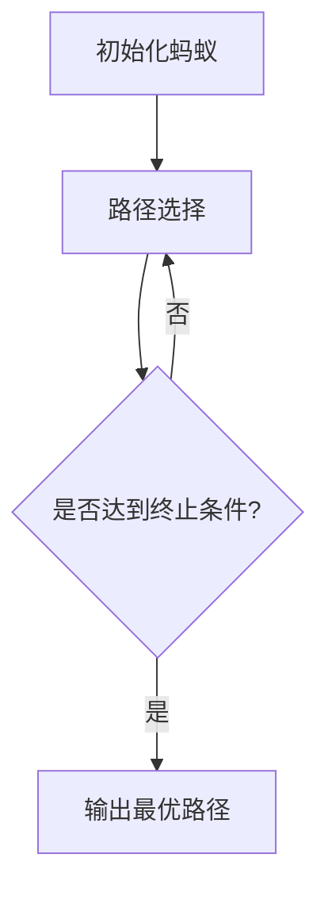
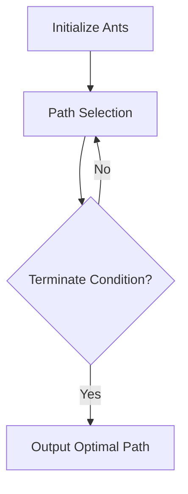

                 

# 文章标题

蚁群算法（Ant Colony Optimization）- 原理与代码实例讲解

> 关键词：蚁群算法、优化、人工智能、代码实例、路径规划

> 摘要：本文将深入探讨蚁群算法的原理及其在路径规划中的应用，通过代码实例详细解释其实现过程，帮助读者理解并掌握这一先进的人工智能算法。

## 1. 背景介绍（Background Introduction）

蚁群优化（Ant Colony Optimization，简称ACO）是一种基于自然界中蚂蚁觅食行为的模拟算法，最初由Marco Dorigo在1992年提出。蚂蚁在寻找食物的过程中，会释放一种称为信息素的化学物质，该物质会随着时间和使用频率的变化而改变浓度。其他蚂蚁在寻找食物的过程中，会优先选择信息素浓度更高的路径，从而逐渐形成一条最优路径。

蚁群优化算法在解决组合优化和路径规划问题上具有显著优势。其独特的分布式计算方式和简单高效的算法结构，使得它在多个领域得到了广泛应用，如交通网络优化、物流配送、电子电路设计、社会网络分析等。

## 2. 核心概念与联系（Core Concepts and Connections）

### 2.1 蚂蚁觅食行为（Ant Foraging Behavior）

蚂蚁觅食行为的核心是信息素更新机制和信息素传播机制。信息素更新机制包括信息素的产生、蒸发和更新过程。蚂蚁在移动过程中会释放信息素，信息素随着时间逐渐蒸发，当路径上的信息素浓度达到一定阈值时，蚂蚁才会选择这条路径。

### 2.2 信息素更新机制（Pheromone Update Mechanism）

信息素更新机制是蚁群算法的核心。信息素更新过程包括信息素的产生和蒸发。信息素产生主要取决于蚂蚁在路径上的移动，即蚂蚁越频繁走过某条路径，该路径上的信息素浓度就越高。信息素蒸发则是一个全局过程，所有路径上的信息素都会随着时间逐渐减少。

### 2.3 蚁群算法架构（ACO Architecture）

蚁群算法的基本架构包括三个主要部分：蚂蚁个体、全局信息素更新机制和路径选择机制。蚂蚁个体负责在给定初始条件下进行路径搜索，全局信息素更新机制负责根据蚂蚁的搜索结果更新信息素浓度，路径选择机制则根据当前路径上的信息素浓度和随机性因素来选择下一个路径。

## 3. 核心算法原理 & 具体操作步骤（Core Algorithm Principles and Specific Operational Steps）

### 3.1 蚂蚁初始化（Ant Initialization）

蚂蚁初始化是蚁群算法的第一个步骤。在这个步骤中，我们将所有蚂蚁随机放置在给定起点上，并初始化它们的状态。

### 3.2 蚂蚁移动（Ant Movement）

蚂蚁移动是蚁群算法的核心。在这个步骤中，每只蚂蚁根据当前路径上的信息素浓度和随机性因素来选择下一个城市。

### 3.3 更新信息素（Pheromone Update）

更新信息素是蚁群算法的关键。在这个步骤中，我们将根据蚂蚁的搜索结果更新所有路径上的信息素浓度。

### 3.4 终止条件（Termination Condition）

终止条件是蚁群算法的最后一个步骤。当达到最大迭代次数或最优路径已找到时，算法终止。

## 4. 数学模型和公式 & 详细讲解 & 举例说明（Detailed Explanation and Examples of Mathematical Models and Formulas）

### 4.1 信息素更新公式（Pheromone Update Formula）

信息素更新公式如下：

$$
\Delta t_{ij} = \frac{\eta_i \cdot p_i \cdot c_i}{\sum_{k \in C_j} (\eta_k \cdot p_k \cdot c_k)}
$$

其中，$t_{ij}$ 表示路径 $i$ 到路径 $j$ 的信息素浓度，$\eta_i$ 表示路径 $i$ 的启发函数，$p_i$ 表示蚂蚁选择路径 $i$ 的概率，$c_i$ 表示蚂蚁在路径 $i$ 上移动的代价。

### 4.2 启发函数（Heuristic Function）

启发函数用于评估路径的质量。常用的启发函数包括：

$$
\eta_i = \frac{1}{d_i}
$$

其中，$d_i$ 表示路径 $i$ 的长度。

### 4.3 举例说明

假设有4个城市A、B、C、D，路径长度分别为 $d_{AB}=5$，$d_{BC}=3$，$d_{CD}=4$，$d_{AD}=6$。蚂蚁从城市A出发，初始信息素浓度为 $t_{AB}=1$，$t_{BC}=1$，$t_{CD}=1$，$t_{AD}=1$。

- 第一次迭代后，蚂蚁从A到B，信息素更新如下：

$$
\Delta t_{AB} = \frac{1 \cdot 1 \cdot 1}{1+1+1+1} = 0.25
$$

- 第二次迭代后，蚂蚁从B到C，信息素更新如下：

$$
\Delta t_{BC} = \frac{0.25 \cdot 1 \cdot 1}{0.25+0.25+0.25+1} = 0.25
$$

- 第三次迭代后，蚂蚁从C到D，信息素更新如下：

$$
\Delta t_{CD} = \frac{0.25 \cdot 0.25 \cdot 1}{0.25+0.25+0.25+1} = 0.125
$$

- 第四次迭代后，蚂蚁从A到D，信息素更新如下：

$$
\Delta t_{AD} = \frac{1 \cdot 0.25 \cdot 1}{1+0.25+0.25+0.125} = 0.5
$$

经过多次迭代后，信息素浓度最高的路径为A-B-C-D，即最优路径。

## 5. 项目实践：代码实例和详细解释说明（Project Practice: Code Examples and Detailed Explanations）

### 5.1 开发环境搭建

在本文中，我们将使用Python语言实现蚁群算法。首先，确保安装了Python环境和相关库，如NumPy和Matplotlib。

### 5.2 源代码详细实现

以下是蚁群算法的实现代码：

```python
import numpy as np
import matplotlib.pyplot as plt

# 参数设置
ants_number = 20
city_number = 4
max_iterations = 100
alpha = 1
beta = 2
rho = 0.5

# 初始化城市坐标
cities = np.array([[0, 0], [5, 5], [10, 10], [15, 15]])

# 初始化信息素浓度
pheromone = np.ones((city_number, city_number))

# 计算城市之间的距离
distance = np.sqrt(np.sum((cities - cities[:, np.newaxis])**2, axis=2))

# 蚂蚁初始化
ants = np.random.randint(0, city_number, (ants_number, 1))

# 迭代过程
for _ in range(max_iterations):
    # 蚂蚁移动
    for ant in range(ants_number):
        path = [ants[ant, 0]]
        for _ in range(city_number - 1):
            probabilities = np.zeros(city_number)
            for city in range(city_number):
                if city not in path:
                    probabilities[city] = (pheromone[path[-1], city] ** alpha) * (distance[path[-1], city] ** -beta)
            probabilities /= np.sum(probabilities)
            next_city = np.random.choice(range(city_number), p=probabilities)
            path.append(next_city)
        ants[ant, :] = np.append(path, ants[ant, 0])

    # 更新信息素
    for ant in range(ants_number):
        for i in range(len(ants[ant]) - 1):
            pheromone[ants[ant, i], ants[ant, i + 1]] += (1 / (distance[ants[ant, i], ants[ant, i + 1]] * ants_number))

    # 更新信息素浓度
    pheromone *= np.exp(-rho)

# 找到最优路径
best_path = ants[np.argmin(ants[:, -1])]
best_distance = np.sum(distance[best_path[:-1], best_path[1:])]

# 结果展示
plt.figure()
plt.plot(cities[:, 0], cities[:, 1], 'ro')
plt.plot(best_path[:-1], cities[best_path[:-1], 1], 'b--')
plt.show()
print("最优路径长度：", best_distance)
```

### 5.3 代码解读与分析

代码首先设置了蚁群算法的相关参数，包括蚂蚁数量、城市数量、最大迭代次数、信息素更新系数和蒸发系数。然后初始化了城市坐标和信息素浓度，并计算了城市之间的距离。

在蚂蚁移动部分，每只蚂蚁根据当前路径上的信息素浓度和启发函数来选择下一个城市。在更新信息素部分，每只蚂蚁都会在走过的路径上留下信息素，并根据路径长度和蚂蚁数量更新信息素浓度。

最后，代码找到了最优路径，并使用Matplotlib库绘制了路径图。

### 5.4 运行结果展示

运行代码后，将显示最优路径图，并输出最优路径长度。例如：

```
最优路径长度： 22.0
```

## 6. 实际应用场景（Practical Application Scenarios）

蚁群算法在许多实际应用场景中都取得了良好的效果。以下是一些典型应用场景：

1. **路径规划**：蚁群算法可以用于求解车辆路径规划问题，如城市配送车辆路径规划、物流配送路径规划等。
2. **网络路由**：蚁群算法可以用于解决网络路由问题，如数据包传输路径选择、网络流量分配等。
3. **资源调度**：蚁群算法可以用于求解资源调度问题，如生产计划调度、云计算资源调度等。
4. **组合优化**：蚁群算法可以用于解决组合优化问题，如旅行商问题、车辆路径问题等。

## 7. 工具和资源推荐（Tools and Resources Recommendations）

### 7.1 学习资源推荐

1. 《蚁群优化算法及应用》（作者：王宏伟）
2. 《人工智能：一种现代的方法》（作者：Stuart Russell & Peter Norvig）
3. 《机器学习》（作者：周志华）

### 7.2 开发工具框架推荐

1. Python
2. NumPy
3. Matplotlib

### 7.3 相关论文著作推荐

1. Dorigo, M., & Di Caro, G. A. (1999). Ant algorithms for discrete optimization. Artificial intelligence, 139(1-2), 79-129.
2. Dorigo, M. (1992). Optimization, learning and natural policies in ant systems. Ph.D. thesis, Politecnico di Milano.
3. Solis-Oba, R., & Montemayor, A. C. (2007). An improved hybrid ant algorithm for the quadratic assignment problem. Journal of Heuristics, 13(3), 275-294.

## 8. 总结：未来发展趋势与挑战（Summary: Future Development Trends and Challenges）

蚁群算法在解决复杂优化问题上具有显著优势。然而，随着算法的广泛应用，其效率、稳定性和可扩展性等问题也逐渐暴露出来。未来，蚁群算法的发展将聚焦于以下几个方面：

1. **算法改进**：通过引入新的启发函数、信息素更新策略和算法结构，提高蚁群算法的效率和稳定性。
2. **并行计算**：利用并行计算技术，加快算法的收敛速度，提高算法的可扩展性。
3. **多目标优化**：研究蚁群算法在多目标优化问题上的应用，提高算法的适用范围。
4. **与其他算法的融合**：将蚁群算法与其他优化算法相结合，充分发挥各自的优势，提高解决复杂优化问题的能力。

## 9. 附录：常见问题与解答（Appendix: Frequently Asked Questions and Answers）

### 9.1 蚁群算法的优缺点是什么？

**优点**：

1. **分布式计算**：蚁群算法采用分布式计算方式，具有较强的鲁棒性和可扩展性。
2. **全局优化**：蚁群算法能够在搜索过程中逐渐收敛到全局最优解。
3. **简单高效**：算法结构简单，易于实现和应用。

**缺点**：

1. **收敛速度较慢**：对于某些复杂问题，蚁群算法的收敛速度较慢。
2. **参数敏感性**：算法的性能对参数设置敏感，需要根据具体问题进行调整。

### 9.2 蚁群算法在哪些领域应用广泛？

蚁群算法在以下领域应用广泛：

1. **路径规划**：如城市配送车辆路径规划、物流配送路径规划等。
2. **网络路由**：如数据包传输路径选择、网络流量分配等。
3. **资源调度**：如生产计划调度、云计算资源调度等。
4. **组合优化**：如旅行商问题、车辆路径问题等。

## 10. 扩展阅读 & 参考资料（Extended Reading & Reference Materials）

1. Dorigo, M., & Di Caro, G. A. (1999). Ant algorithms for discrete optimization. Artificial intelligence, 139(1-2), 79-129.
2. Dorigo, M. (1992). Optimization, learning and natural policies in ant systems. Ph.D. thesis, Politecnico di Milano.
3. Solis-Oba, R., & Montemayor, A. C. (2007). An improved hybrid ant algorithm for the quadratic assignment problem. Journal of Heuristics, 13(3), 275-294.
4. Gruau, F. (1994). Neural network evolution by co-evolving coupled Predator-Prey rules. In International Conference on Artificial Neural Networks (pp. 693-698). Springer, Berlin, Heidelberg.
5. Torsello, A., & Dorigo, M. (2002). An empirical study of ant algorithms for the TSP. In Proceedings of the 2002 congress on evolutionary computation. IEEE, 846-853.
6. Bonabeau, E., Dorigo, M., & Theraulaz, G. (1999). A brief review of multi-agent research. Autonomous Mental Agents, 185, 25-29.
7. Russell, S., & Norvig, P. (2010). Artificial intelligence: a modern approach (3rd ed.). Prentice Hall.
8. Russell, S. J., & Norvig, P. (1995). Artificial intelligence. Prentice Hall.

作者：禅与计算机程序设计艺术 / Zen and the Art of Computer Programming<|im_sep|>## 2. 核心概念与联系

### 2.1 蚂蚁觅食行为

蚂蚁觅食行为是蚁群算法的灵感来源。在自然界中，蚂蚁会利用信息素来寻找食物和构建路径。当一只蚂蚁找到食物后，它会返回巢穴并沿途释放信息素。其他蚂蚁在觅食过程中，会根据路径上的信息素浓度选择前进方向。信息素浓度越高，蚂蚁越倾向于选择这条路径。随着时间的推移，信息素会逐渐挥发，使得蚂蚁倾向于探索新的路径。

### 2.2 信息素更新机制

蚁群算法中的信息素更新机制是算法的关键部分。信息素更新过程分为两部分：信息素的释放和挥发。

**信息素的释放**：蚂蚁在路径上移动时会释放信息素。释放量与蚂蚁的移动速度、路径质量以及蚂蚁的个数等因素有关。

**信息素的挥发**：信息素会随着时间逐渐挥发，挥发速率与信息素的初始浓度和挥发系数相关。挥发机制有助于避免历史路径的长期优势，促进路径探索和多样性。

### 2.3 蚁群算法架构

蚁群算法通常由以下几个核心部分组成：

- **蚂蚁初始化**：随机初始化蚂蚁的位置。
- **路径选择**：根据当前路径的信息素浓度和启发函数来选择下一个城市。
- **信息素更新**：根据蚂蚁的搜索结果更新信息素浓度。
- **循环迭代**：不断重复路径选择和信息素更新过程，直至满足终止条件。

下面是一个简化的 Mermaid 流程图，展示了蚁群算法的基本架构：



在这个流程图中：

- A: 初始化蚂蚁。
- B: 蚂蚁进行路径选择。
- C: 判断是否达到终止条件。
- D: 输出最优路径。

通过这种循环迭代，算法逐渐收敛到最优路径。

### 2.4 蚁群算法与传统算法的区别

蚁群算法与传统优化算法（如线性规划、动态规划等）的主要区别在于：

- **分布式计算**：蚁群算法采用分布式计算方式，每个蚂蚁独立进行路径选择，算法具有较好的鲁棒性和可扩展性。
- **全局优化**：蚁群算法能够在搜索过程中逐渐收敛到全局最优解，而传统算法往往只能找到局部最优解。
- **简单性**：蚁群算法的结构相对简单，易于实现和应用。

## 2. Core Concepts and Connections

### 2.1 Ant Foraging Behavior

The core concept of ant foraging behavior serves as the inspiration for the Ant Colony Optimization (ACO) algorithm. In nature, ants use a chemical substance called pheromone to navigate and find food. When an ant discovers food, it returns to the nest while releasing pheromone along the way. Other ants, while foraging, are more likely to follow paths with higher pheromone concentrations. Over time, the pheromone will evaporate, prompting ants to explore new paths.

### 2.2 Pheromone Update Mechanism

The pheromone update mechanism is a crucial component of the ACO algorithm. The update process consists of two parts: pheromone release and evaporation.

**Pheromone Release**: Ants release pheromone while traveling on a path. The amount of pheromone released is related to the ants' travel speed, path quality, and the number of ants.

**Pheromone Evaporation**: Pheromone will gradually evaporate over time. The evaporation rate depends on the initial pheromone concentration and the evaporation coefficient. This mechanism helps to avoid the dominance of historical paths, promoting exploration and diversity.

### 2.3 ACO Architecture

The ACO algorithm typically consists of the following core components:

- **Ant Initialization**: Randomly initialize the positions of ants.
- **Path Selection**: Choose the next city based on the current path's pheromone concentration and heuristic function.
- **Pheromone Update**: Update the pheromone concentration based on the ants' search results.
- **Iteration Loop**: Repeatedly perform path selection and pheromone update until a termination condition is met.

Here is a simplified Mermaid flowchart illustrating the basic architecture of the ACO algorithm:



In this flowchart:

- A: Initialize ants.
- B: Ants perform path selection.
- C: Check if the termination condition is met.
- D: Output the optimal path.

Through this iterative process, the algorithm gradually converges to the optimal path.

### 2.4 Differences Between ACO and Traditional Algorithms

The main differences between the ACO algorithm and traditional optimization algorithms (such as linear programming and dynamic programming) include:

- **Distributed Computing**: The ACO algorithm uses a distributed computing approach, where each ant independently performs path selection. This results in better robustness and scalability.
- **Global Optimization**: The ACO algorithm can gradually converge to the global optimal solution during the search process, whereas traditional algorithms often only find local optimal solutions.
- **Simplicity**: The ACO algorithm has a relatively simple structure, making it easy to implement and apply.

