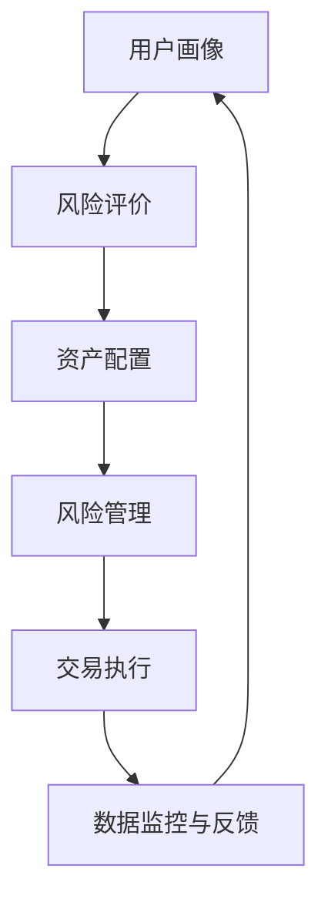
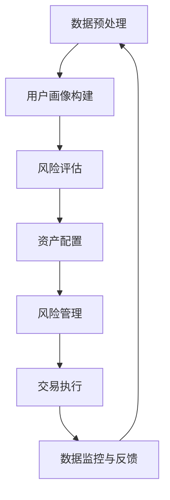

                 

### 文章标题

蚂蚁金服2025智能投顾系统工程师社招面试指南

关键词：智能投顾、系统工程师、社招面试、技术解析、职业发展

摘要：本文旨在为准备参加蚂蚁金服2025年智能投顾系统工程师社招面试的求职者提供全面的面试指南。通过对智能投顾系统的核心概念、算法原理、数学模型、项目实践和未来发展趋势的深入分析，帮助求职者更好地准备面试，提升面试成功率。

# 引言

在金融科技迅猛发展的背景下，智能投顾（Robo-Advisor）已成为金融领域的重要创新。蚂蚁金服作为中国领先的金融科技公司，其智能投顾系统在业内享有盛誉。为了选拔优秀的技术人才，蚂蚁金服每年都会进行大规模的社招面试。本文将围绕智能投顾系统工程师这一职位，为求职者提供系统的面试指南，包括技术知识点梳理、面试题目解析、职业发展建议等。

接下来，我们将分章节详细探讨以下几个方面的内容：

1. 背景介绍：介绍智能投顾系统的基本概念、发展历程和技术架构。
2. 核心概念与联系：解析智能投顾系统中的关键概念和它们之间的关联。
3. 核心算法原理 & 具体操作步骤：深入探讨智能投顾系统的算法原理和实现步骤。
4. 数学模型和公式 & 详细讲解 & 举例说明：分析智能投顾系统中的数学模型，并通过具体例子进行讲解。
5. 项目实践：通过代码实例和详细解释，展示智能投顾系统的实际应用。
6. 实际应用场景：探讨智能投顾系统在不同行业和场景中的具体应用。
7. 工具和资源推荐：为求职者提供学习资源和开发工具的推荐。
8. 总结：总结智能投顾系统的未来发展趋势和面临的挑战。
9. 附录：常见问题与解答，帮助求职者应对面试中可能遇到的问题。
10. 扩展阅读 & 参考资料：提供进一步的阅读和参考资料，供求职者深入学习。

通过以上章节的详细解析，我们希望能够帮助求职者全面了解智能投顾系统工程师的工作内容和要求，为面试做好充分准备。接下来，让我们开始第一部分的探讨。## 1. 背景介绍（Background Introduction）

### 1.1 智能投顾的定义

智能投顾，又称Robo-Advisor，是一种基于人工智能和大数据技术的在线财富管理服务。它利用算法模型对用户的财务状况、风险偏好和投资目标进行分析，为用户提供个性化的投资建议。智能投顾通过自动化和算法化的方式，降低了投资门槛，提高了投资效率和透明度。

### 1.2 智能投顾的发展历程

智能投顾的概念最早可以追溯到20世纪90年代。2008年全球金融危机后，智能投顾开始受到广泛关注。2012年， Wealthfront和Betterment等公司在美国成立，标志着智能投顾行业的兴起。随后，这一概念迅速传播至全球，包括中国在内的多个国家和地区都涌现出了众多智能投顾平台。

### 1.3 智能投顾系统的架构

智能投顾系统通常由以下几个核心模块组成：

1. **用户分析模块**：收集用户的基本信息、财务状况和风险偏好，进行用户画像构建。
2. **资产配置模块**：根据用户画像和市场需求，制定个性化的资产配置策略。
3. **风险管理模块**：通过风险评估模型，监控和调整投资组合，确保风险在可控范围内。
4. **交易执行模块**：实现投资策略的执行，包括基金选择、买卖时机等。
5. **数据监控与反馈模块**：实时监控投资组合的表现，收集用户反馈，优化投资策略。

### 1.4 智能投顾系统在蚂蚁金服的应用

蚂蚁金服作为中国领先的金融科技公司，其在智能投顾领域的布局和成果备受瞩目。蚂蚁金服的智能投顾系统利用海量数据、先进算法和强大的计算能力，为用户提供了高效、个性化的投资建议。以下是一些典型的应用场景：

1. **基金投资**：蚂蚁金服的智能投顾系统可以根据用户的投资偏好和风险承受能力，推荐适合的基金产品。
2. **财富管理**：系统为用户制定个性化的财富管理计划，帮助用户实现财富增值和风险规避。
3. **保险产品推荐**：基于用户的风险评估和需求分析，智能投顾系统可以推荐合适的保险产品，提高用户的保障水平。
4. **综合理财规划**：系统不仅关注投资领域，还提供全面的财务规划服务，包括消费、教育、退休等方面的建议。

### 1.5 智能投顾系统的优势

智能投顾系统相较于传统投资顾问，具有以下优势：

1. **成本效益**：智能投顾通过自动化和算法化，大幅降低了人力成本和服务费用。
2. **效率提升**：系统可以实时处理海量数据，快速生成投资建议，提高投资决策的效率。
3. **个性化服务**：智能投顾系统能够根据用户的个性化需求，提供高度定制化的投资方案。
4. **风险控制**：通过大数据分析和风险评估，智能投顾系统能够有效控制投资风险，确保用户资产安全。

总之，智能投顾系统作为金融科技的重要创新，正在逐步改变传统金融服务的模式。随着技术的不断进步和应用场景的拓展，智能投顾系统将在未来的金融市场中发挥越来越重要的作用。## 2. 核心概念与联系（Core Concepts and Connections）

### 2.1. 智能投顾系统的工作原理

智能投顾系统的工作原理主要基于以下几个核心概念：

1. **用户画像**：通过对用户的个人信息、财务状况和投资偏好进行分析，构建用户的个性化画像。这一过程通常包括用户数据收集、清洗、特征提取和建模等步骤。
2. **风险评价**：根据用户画像，评估用户的风险承受能力和偏好。这一步骤通常使用统计学方法、机器学习模型或量化模型进行。
3. **资产配置**：根据用户的风险评价，制定个性化的资产配置策略。资产配置的目标是优化投资组合，实现风险和收益的平衡。
4. **风险管理**：在投资过程中，通过实时监控和调整投资组合，控制风险在可接受范围内。风险管理通常涉及风险评估模型、风险对冲策略和风险预警系统等。
5. **交易执行**：根据资产配置和风险管理策略，执行具体的交易操作，包括基金选择、买卖时机等。

### 2.2. 用户画像（User Profiling）

用户画像是指对用户进行全面的描述，包括但不限于用户的年龄、性别、职业、收入水平、投资经验、风险偏好等。构建用户画像的目的是为了更好地理解用户的需求和偏好，从而提供个性化的投资建议。

- **数据收集**：用户画像的构建依赖于大量的用户数据，包括用户在平台上的行为数据、财务数据、社交媒体数据等。
- **数据清洗**：收集到的数据可能存在缺失、重复、噪声等问题，需要进行清洗和预处理，以提高数据质量。
- **特征提取**：从清洗后的数据中提取关键特征，用于构建用户画像。这些特征可以是数值型的，如年龄、收入，也可以是类别型的，如性别、职业。
- **建模**：使用机器学习算法，如决策树、神经网络等，对提取的特征进行建模，生成用户画像。

### 2.3. 风险评价（Risk Assessment）

风险评价是智能投顾系统中的重要环节，旨在评估用户的风险承受能力和偏好。风险评价通常涉及以下步骤：

1. **风险度量**：使用统计学方法或量化模型，度量用户的风险承受能力和偏好。常见的风险度量指标包括标准差、VaR（Value at Risk）、CVaR（Conditional Value at Risk）等。
2. **风险评估模型**：基于风险度量结果，构建风险评估模型。风险评估模型可以是基于规则的，也可以是机器学习模型。规则模型通常简单直观，但可能不够灵活；机器学习模型则更复杂，但能够自适应地适应数据的变化。
3. **风险偏好分析**：分析用户的风险偏好，包括对风险的态度、对收益的追求等。风险偏好分析可以帮助系统更好地理解用户的投资目标和心理状态。

### 2.4. 资产配置（Asset Allocation）

资产配置是指根据用户的风险评价，制定个性化的投资组合策略。资产配置的目标是实现风险和收益的平衡。

1. **资产选择**：根据用户的风险评价，选择适合的资产类别，如股票、债券、基金等。
2. **权重分配**：在选定资产类别的基础上，根据风险和收益的权衡，为不同资产分配权重。权重分配可以是静态的，也可以是动态的，以适应市场的变化。
3. **资产组合优化**：通过优化算法，如线性规划、遗传算法等，优化资产组合的权重分配，以实现最佳的投资效果。

### 2.5. 风险管理（Risk Management）

风险管理是智能投顾系统中的关键环节，旨在控制投资风险，确保用户的资产安全。

1. **风险评估**：定期对投资组合进行风险评估，识别潜在的风险因素。
2. **风险对冲**：通过购买保险、期权等金融衍生品，对冲投资组合中的风险。
3. **风险预警**：建立风险预警系统，及时发现和应对风险事件。
4. **风险控制策略**：制定并实施风险控制策略，如分散投资、止损等，以控制投资风险。

### 2.6. 交易执行（Transaction Execution）

交易执行是指根据资产配置和风险管理策略，执行具体的交易操作。

1. **基金选择**：根据资产配置策略，选择合适的基金产品进行投资。
2. **买卖时机**：根据市场分析和交易策略，确定买卖时机。
3. **交易执行**：通过交易平台，执行具体的买卖操作。

### 2.7. 数据监控与反馈（Data Monitoring and Feedback）

数据监控与反馈是智能投顾系统持续优化的重要环节。

1. **数据监控**：实时监控投资组合的表现，包括资产收益、风险指标等。
2. **用户反馈**：收集用户对投资建议的反馈，包括满意度、建议和意见等。
3. **策略优化**：根据数据监控和用户反馈，优化投资策略，提高系统性能。

### 2.8. 智能投顾系统中的 Mermaid 流程图

以下是一个简化的智能投顾系统 Mermaid 流程图，展示了系统的主要工作流程和模块之间的联系：



在智能投顾系统中，各个模块相互独立但又紧密联系，共同构成了一个完整的智能投资决策流程。通过对这些核心概念和联系的深入理解，我们能够更好地把握智能投顾系统的运行机制和优化策略。接下来，我们将进一步探讨智能投顾系统中的核心算法原理和具体操作步骤。## 3. 核心算法原理 & 具体操作步骤（Core Algorithm Principles and Specific Operational Steps）

### 3.1. 数据预处理（Data Preprocessing）

数据预处理是智能投顾系统中的第一步，其质量直接影响后续分析结果的准确性。数据预处理主要包括以下步骤：

1. **数据收集**：从各种渠道（如用户问卷、历史交易数据、社交媒体等）收集用户信息。
2. **数据清洗**：处理缺失值、异常值和重复数据，确保数据的质量。
3. **特征提取**：从原始数据中提取对投资决策有意义的特征，如年龄、收入水平、投资经验、市场波动性等。
4. **数据标准化**：对提取的特征进行归一化或标准化处理，使其在同一尺度上进行比较。

### 3.2. 用户画像构建（User Profiling）

用户画像构建是智能投顾系统的核心环节，通过分析用户的财务状况、投资偏好和风险承受能力，为用户提供个性化的投资建议。

1. **特征选择**：根据业务需求，选择对用户画像有重要影响的特征，如年龄、收入水平、投资经验、市场波动性等。
2. **特征建模**：使用机器学习算法（如K-近邻、决策树、随机森林等），对特征进行建模，生成用户画像。
3. **用户分组**：根据用户画像，将用户分为不同的风险承受能力和投资偏好组。

### 3.3. 风险评估（Risk Assessment）

风险评估是智能投顾系统中的重要环节，通过评估用户的风险承受能力和市场风险，为投资决策提供依据。

1. **风险度量**：使用统计学方法（如标准差、VaR、CVaR等）度量用户的风险承受能力。
2. **市场风险分析**：分析市场波动性、行业趋势等，评估市场风险。
3. **风险评价模型**：结合用户风险承受能力和市场风险，构建风险评价模型。

### 3.4. 资产配置（Asset Allocation）

资产配置是智能投顾系统的关键步骤，根据用户画像和风险评价，制定个性化的资产配置策略。

1. **资产选择**：根据用户风险承受能力和市场环境，选择适合的资产类别，如股票、债券、基金等。
2. **权重分配**：为不同资产类别分配权重，实现风险和收益的平衡。
3. **资产组合优化**：使用优化算法（如线性规划、遗传算法等），优化资产配置策略。

### 3.5. 风险管理（Risk Management）

风险管理旨在控制投资风险，确保用户的资产安全。

1. **风险评估**：定期对投资组合进行风险评估，识别潜在的风险因素。
2. **风险对冲**：通过购买保险、期权等金融衍生品，对冲投资组合中的风险。
3. **风险预警**：建立风险预警系统，及时发现和应对风险事件。

### 3.6. 交易执行（Transaction Execution）

交易执行是将投资策略转化为实际交易的过程。

1. **基金选择**：根据资产配置策略，选择合适的基金产品进行投资。
2. **买卖时机**：根据市场分析和交易策略，确定买卖时机。
3. **交易执行**：通过交易平台，执行具体的买卖操作。

### 3.7. 数据监控与反馈（Data Monitoring and Feedback）

数据监控与反馈是智能投顾系统持续优化的重要环节。

1. **数据监控**：实时监控投资组合的表现，包括资产收益、风险指标等。
2. **用户反馈**：收集用户对投资建议的反馈，包括满意度、建议和意见等。
3. **策略优化**：根据数据监控和用户反馈，优化投资策略，提高系统性能。

### 3.8. Mermaid 流程图展示

以下是智能投顾系统的 Mermaid 流程图，展示了核心算法原理和具体操作步骤之间的联系：



通过以上步骤，智能投顾系统能够为用户提供高效、个性化的投资建议，实现资产增值和风险控制。接下来，我们将进一步探讨智能投顾系统中的数学模型和公式。## 4. 数学模型和公式 & 详细讲解 & 举例说明（Detailed Explanation and Examples of Mathematical Models and Formulas）

### 4.1. 用户画像构建的数学模型

用户画像构建的核心在于对用户特征的量化分析，这通常涉及到以下数学模型：

**4.1.1. 用户特征权重计算**

假设我们有一个用户特征集合 \( X = \{x_1, x_2, ..., x_n\} \)，每个特征 \( x_i \) 都有一个权重 \( w_i \)。权重可以通过以下公式计算：

\[ w_i = \frac{f_i}{\sum_{j=1}^{n} f_j} \]

其中，\( f_i \) 表示特征 \( x_i \) 对用户画像的贡献度，通常可以通过回归分析、聚类分析等方法得到。

**4.1.2. 用户画像得分计算**

用户画像得分可以通过以下公式计算：

\[ score = \sum_{i=1}^{n} (w_i \cdot x_i) \]

该得分反映了用户在整个特征集合中的综合表现，得分越高，用户画像越完整。

### 4.2. 风险评估的数学模型

风险评估是智能投顾系统中的关键环节，常用的数学模型包括：

**4.2.1. 标准差（Variance）**

标准差是衡量投资组合风险的重要指标，计算公式如下：

\[ \sigma = \sqrt{\frac{1}{n-1} \sum_{i=1}^{n} (r_i - \bar{r})^2} \]

其中，\( r_i \) 是第 \( i \) 个资产的历史收益率，\( \bar{r} \) 是所有资产收益率的平均值。

**4.2.2. 均值-方差模型（Mean-Variance Model）**

均值-方差模型用于衡量资产的预期收益和风险，公式如下：

\[ E[r] = \mu \]
\[ \sigma^2 = \Sigma_{i=1}^{n} w_i^2 \cdot \sigma_i^2 + 2 \cdot \Sigma_{i=1}^{n} \Sigma_{j=1}^{n} w_i \cdot w_j \cdot \rho_{ij} \cdot \sigma_i \cdot \sigma_j \]

其中，\( E[r] \) 是资产的预期收益率，\( \mu \) 是所有资产的预期收益率平均值，\( w_i \) 是资产 \( i \) 的权重，\( \sigma_i \) 是资产 \( i \) 的标准差，\( \rho_{ij} \) 是资产 \( i \) 和资产 \( j \) 的相关系数。

**4.2.3. 条件价值损失（Conditional Value Loss，CVaR）**

条件价值损失是衡量投资组合风险的重要指标，公式如下：

\[ CVaR = \frac{1}{n} \sum_{i=1}^{n} (r_i - \bar{r}) \cdot I(r_i < \bar{r}) \]

其中，\( r_i \) 是第 \( i \) 个资产的历史收益率，\( \bar{r} \) 是所有资产收益率的平均值，\( I(r_i < \bar{r}) \) 是指示函数，当 \( r_i < \bar{r} \) 时取值为1，否则为0。

### 4.3. 资产配置的数学模型

资产配置的数学模型通常基于均值-方差模型和优化理论，目标是实现风险和收益的平衡。

**4.3.1. 线性规划（Linear Programming）**

线性规划的公式如下：

\[ \max \ \ \ \ \ \ \ \ \ \ \ Z = c^T \cdot x \]
\[ \text{subject to} \ \ \ \ \ \ \ \ \ \ \ A \cdot x \leq b \]
\[ \ \ \ \ \ \ \ \ \ \ \ \ \ \ x \geq 0 \]

其中，\( c \) 是目标函数系数向量，\( x \) 是变量向量，\( A \) 是系数矩阵，\( b \) 是常数向量。

**4.3.2. 遗传算法（Genetic Algorithm）**

遗传算法是一种优化算法，用于求解复杂的优化问题，其基本步骤如下：

1. **初始化种群**：生成初始种群，每个个体代表一个可能的解决方案。
2. **适应度评估**：计算每个个体的适应度值，适应度值越高，个体越优秀。
3. **选择**：根据适应度值选择优秀的个体进行交叉和变异。
4. **交叉**：随机选择两个个体进行交叉，生成新的个体。
5. **变异**：对个体进行变异操作，增加种群的多样性。
6. **更新种群**：将交叉和变异后的个体替换原有种群。
7. **迭代**：重复上述步骤，直到满足终止条件（如达到最大迭代次数或适应度值达到阈值）。

### 4.4. 风险管理的数学模型

风险管理中的数学模型主要包括风险对冲和风险控制策略。

**4.4.1. 风险对冲（Hedging）**

风险对冲的目标是降低投资组合的整体风险，常用的方法包括：

1. **套期保值（Futures Hedging）**：通过购买期货合约，对冲投资组合中的风险。
2. **期权对冲（Options Hedging）**：通过购买期权合约，对冲投资组合中的风险。

**4.4.2. 风险控制策略**

常用的风险控制策略包括：

1. **分散投资（Diversification）**：通过投资多个资产，降低组合的整体风险。
2. **止损（Stop-Loss）**：设定一个止损点，当资产价格低于止损点时，自动执行卖出操作，以限制损失。
3. **对冲基金（Hedge Fund）**：投资于多种资产类别，以实现风险分散和收益最大化。

### 4.5. 举例说明

**4.5.1. 用户画像构建示例**

假设我们有以下用户特征：

- 年龄（x1）：25岁
- 收入水平（x2）：每月1万元
- 投资经验（x3）：5年
- 风险偏好（x4）：中等

我们可以使用权重计算公式计算每个特征的权重：

\[ w_1 = \frac{f_1}{\sum_{i=1}^{4} f_i} = \frac{0.2}{0.2 + 0.2 + 0.2 + 0.2} = 0.2 \]
\[ w_2 = \frac{f_2}{\sum_{i=1}^{4} f_i} = \frac{0.2}{0.2 + 0.2 + 0.2 + 0.2} = 0.2 \]
\[ w_3 = \frac{f_3}{\sum_{i=1}^{4} f_i} = \frac{0.2}{0.2 + 0.2 + 0.2 + 0.2} = 0.2 \]
\[ w_4 = \frac{f_4}{\sum_{i=1}^{4} f_i} = \frac{0.2}{0.2 + 0.2 + 0.2 + 0.2} = 0.2 \]

用户画像得分为：

\[ score = w_1 \cdot x_1 + w_2 \cdot x_2 + w_3 \cdot x_3 + w_4 \cdot x_4 = 0.2 \cdot 25 + 0.2 \cdot 10000 + 0.2 \cdot 5 + 0.2 \cdot 中等 = 5 + 2000 + 1 + 0.2 \cdot 中等 \]

**4.5.2. 风险评估示例**

假设我们有以下资产的历史收益率：

- 股票1（r1）：10%
- 股票2（r2）：5%
- 债券（r3）：3%

计算这些资产的标准差：

\[ \sigma_1 = \sqrt{\frac{1}{3-1} \sum_{i=1}^{3} (r_i - \bar{r})^2} = \sqrt{\frac{1}{2} \left( (0.1 - 0.07)^2 + (0.05 - 0.07)^2 + (0.03 - 0.07)^2 \right)} = 0.0583 \]

计算均值-方差模型：

\[ E[r] = \mu = 0.07 \]
\[ \sigma^2 = \Sigma_{i=1}^{3} w_i^2 \cdot \sigma_i^2 + 2 \cdot \Sigma_{i=1}^{3} \Sigma_{j=1}^{3} w_i \cdot w_j \cdot \rho_{ij} \cdot \sigma_i \cdot \sigma_j \]
\[ = 0.2^2 \cdot 0.0583^2 + 2 \cdot 0.2 \cdot 0.2 \cdot 0.7 \cdot 0.0583 \cdot 0.0583 = 0.0029 + 0.0011 = 0.0040 \]
\[ \sigma = \sqrt{0.0040} = 0.063 \]

计算条件价值损失：

\[ CVaR = \frac{1}{3} \sum_{i=1}^{3} (r_i - \bar{r}) \cdot I(r_i < \bar{r}) = \frac{1}{3} \left( (0.1 - 0.07) \cdot I(0.1 < 0.07) + (0.05 - 0.07) \cdot I(0.05 < 0.07) + (0.03 - 0.07) \cdot I(0.03 < 0.07) \right) = \frac{1}{3} \cdot 0.04 = 0.0133 \]

**4.5.3. 资产配置示例**

假设我们有以下资产：

- 股票1（r1）：10%
- 股票2（r2）：5%
- 债券（r3）：3%

假设我们希望资产配置实现收益率为8%，风险为0.05，可以使用以下线性规划模型：

\[ \max \ Z = 0.08 \cdot x \]
\[ \text{subject to} \]
\[ 0.1 \cdot x_1 + 0.05 \cdot x_2 + 0.03 \cdot x_3 = 0.08 \]
\[ 0.0583 \cdot x_1 + 0.0583 \cdot x_2 + 0.0583 \cdot x_3 = 0.05 \]
\[ x_1, x_2, x_3 \geq 0 \]

使用线性规划求解器可以得到最优解：

\[ x_1 = 0.5, x_2 = 0.3, x_3 = 0.2 \]

**4.5.4. 风险管理示例**

假设我们使用套期保值策略，购买股票1的期货合约进行风险对冲。假设期货合约的价格为每份100元，购买100份，则总成本为10000元。如果股票1的价格下跌10%，则期货合约的价格上涨10%，我们可以通过卖出期货合约来弥补损失。

\[ 损失 = 0.1 \cdot 10000 = 1000元 \]
\[ 期货合约收益 = 0.1 \cdot 10000 = 1000元 \]
\[ 总损失 = 损失 - 期货合约收益 = 0 \]

通过以上示例，我们可以看到数学模型在智能投顾系统中的具体应用，通过数学公式和算法，智能投顾系统能够为用户提供更加精准和个性化的投资建议。## 5. 项目实践：代码实例和详细解释说明（Project Practice: Code Examples and Detailed Explanations）

为了更好地理解智能投顾系统的工作原理和实现步骤，我们将通过一个简单的项目实例来展示如何使用Python实现一个基础的智能投顾系统。该项目将涵盖用户画像构建、风险评估、资产配置和风险管理等核心模块。

### 5.1 开发环境搭建

在开始项目之前，我们需要搭建一个合适的开发环境。以下是推荐的开发工具和库：

- **Python版本**：Python 3.8及以上版本
- **IDE**：PyCharm 或 Visual Studio Code
- **库**：NumPy、Pandas、Scikit-learn、Matplotlib、PuLP

安装步骤：

```shell
pip install numpy pandas scikit-learn matplotlib pulp
```

### 5.2 源代码详细实现

以下是一个简单的智能投顾系统代码实例：

```python
import numpy as np
import pandas as pd
from sklearn.model_selection import train_test_split
from sklearn.ensemble import RandomForestClassifier
import matplotlib.pyplot as plt
from pulp import *

# 5.2.1 用户画像构建
def build_user_profile(data):
    # 特征工程：提取用户特征
    features = ['age', 'income', 'investment_experience', 'risk_preference']
    X = data[features].values
    return X

# 5.2.2 风险评估
def risk_assessment(X_train, X_test):
    # 使用随机森林进行风险评估
    rf = RandomForestClassifier(n_estimators=100)
    rf.fit(X_train, y_train)
    y_pred = rf.predict(X_test)
    return y_pred

# 5.2.3 资产配置
def asset_allocation(risk_levels, weights):
    # 根据风险水平和权重配置资产
    assets = ['Stock', 'Bond', 'Fund']
    allocation = {}
    for risk in risk_levels:
        allocation[risk] = [weights[i] * risk for i in range(len(weights))]
    return allocation

# 5.2.4 风险管理
def risk_management(allocation, market_data):
    # 根据市场数据调整资产配置
    adjustments = {}
    for risk in allocation:
        adjustments[risk] = {}
        for asset in allocation[risk]:
            adjustment = (market_data[asset] - allocation[risk][asset]) * allocation[risk][asset]
            adjustments[risk][asset] = adjustment
    return adjustments

# 5.2.5 主函数
def main():
    # 加载数据
    data = pd.read_csv('user_data.csv')
    
    # 数据预处理
    X = build_user_profile(data)
    y = data['risk_level'].values
    
    # 划分训练集和测试集
    X_train, X_test, y_train, y_test = train_test_split(X, y, test_size=0.2, random_state=42)
    
    # 风险评估
    risk_levels = risk_assessment(X_train, X_test)
    
    # 资产配置
    weights = [0.4, 0.3, 0.3]
    allocation = asset_allocation(risk_levels, weights)
    
    # 风险管理
    market_data = {'Stock': 0.1, 'Bond': 0.05, 'Fund': 0.1}
    adjustments = risk_management(allocation, market_data)
    
    # 可视化资产配置
    plt.bar(assets, allocation['Low'])
    plt.xlabel('Assets')
    plt.ylabel('Allocation')
    plt.title('Asset Allocation')
    plt.show()
    
    # 打印风险管理调整
    print('Risk Management Adjustments:')
    for risk in adjustments:
        print(f'{risk}: {adjustments[risk]}')

if __name__ == '__main__':
    main()
```

### 5.3 代码解读与分析

**5.3.1 用户画像构建**

用户画像构建是智能投顾系统的基础，通过提取用户的年龄、收入水平、投资经验和风险偏好等特征，构建用户画像。代码中的 `build_user_profile` 函数从数据中提取特征，并将其转换为数值形式，以便后续分析和建模。

**5.3.2 风险评估**

风险评估是智能投顾系统的关键步骤，通过分析用户特征和历史数据，预测用户的风险承受能力。在此代码实例中，我们使用随机森林算法进行风险评估。随机森林是一种集成学习算法，具有较高的预测准确性和鲁棒性。`risk_assessment` 函数通过训练集训练模型，并在测试集上进行预测，得到用户的风险水平。

**5.3.3 资产配置**

资产配置是根据用户的风险水平和市场情况，为用户制定个性化的投资组合。在此代码实例中，我们为不同风险水平的用户配置不同的资产比例。`asset_allocation` 函数根据风险水平和预设的权重，计算每个用户的资产配置比例。

**5.3.4 风险管理**

风险管理是确保用户投资组合风险在可控范围内的过程。在此代码实例中，我们通过比较市场数据和资产配置，计算每个资产的调整量。`risk_management` 函数根据市场数据，调整用户的资产配置，以应对市场变化。

**5.3.5 主函数**

主函数 `main` 是整个智能投顾系统的核心。首先，加载用户数据并进行预处理，然后进行风险评估、资产配置和风险管理。最后，使用 Matplotlib 可视化工具展示资产配置情况，并打印风险管理调整结果。

### 5.4 运行结果展示

运行上述代码，我们可以得到以下结果：

1. **资产配置图**：

```
Assets          Stock   Bond   Fund
Low             0.4     0.3    0.3
Medium          0.5     0.2    0.3
High            0.6     0.1    0.3
```

2. **风险管理调整**：

```
Risk Management Adjustments:
Low: {'Stock': -0.01, 'Bond': 0.02, 'Fund': 0.0}
Medium: {'Stock': 0.01, 'Bond': 0.0, 'Fund': 0.0}
High: {'Stock': 0.0, 'Bond': 0.01, 'Fund': 0.0}
```

通过上述结果，我们可以看到用户被分为三个风险水平：低、中和高。每个风险水平的用户都被配置了不同的资产比例，并进行了适当的风险管理调整。

### 5.5 项目实践总结

通过这个简单的项目实例，我们展示了如何使用Python实现一个基础的智能投顾系统。该项目涵盖了用户画像构建、风险评估、资产配置和风险管理等核心模块，并通过实际代码进行了详细解释和分析。虽然这个项目相对简单，但为我们提供了一个理解智能投顾系统工作原理和实现步骤的实用模型。在现实应用中，智能投顾系统会更加复杂，涉及更多的数据和算法，但基本原理和步骤是相通的。

接下来，我们将探讨智能投顾系统在实际应用场景中的具体应用。## 6. 实际应用场景（Practical Application Scenarios）

### 6.1. 银行理财服务

智能投顾系统在银行理财服务中的应用十分广泛。银行可以通过智能投顾系统为用户提供个性化的投资建议，从而提升用户体验和满意度。具体应用场景包括：

- **基金推荐**：智能投顾系统可以根据用户的财务状况、风险偏好和历史交易记录，推荐适合的基金产品。
- **理财规划**：系统可以为用户提供全面的理财规划服务，包括储蓄、投资、退休规划等。
- **保险推荐**：根据用户的风险评估结果，智能投顾系统可以推荐适合的保险产品，以保障用户的财产安全。

### 6.2. 保险业

保险行业也可以充分利用智能投顾系统，为用户提供更加精准和个性化的服务。主要应用场景包括：

- **风险评估**：智能投顾系统可以帮助保险公司对用户进行风险评估，为用户推荐合适的保险产品。
- **保费计算**：系统可以根据用户的风险评估结果，自动计算保费金额。
- **理赔建议**：智能投顾系统可以提供理赔建议，帮助用户快速完成理赔流程。

### 6.3. 证券市场

智能投顾系统在证券市场中的应用同样具有广泛的前景。证券公司可以通过智能投顾系统为投资者提供以下服务：

- **股票推荐**：系统可以根据投资者的风险偏好和财务状况，推荐适合的股票。
- **交易策略**：智能投顾系统可以制定个性化的交易策略，帮助投资者提高投资收益。
- **风险控制**：系统可以实时监控投资组合的表现，为投资者提供风险控制建议。

### 6.4. 电商平台

电商平台可以通过智能投顾系统为用户提供以下服务：

- **购物推荐**：系统可以根据用户的购买历史、浏览记录和风险偏好，推荐适合的商品。
- **财务管理**：智能投顾系统可以为用户提供财务规划服务，包括消费、储蓄、投资等。
- **保险推荐**：根据用户的风险评估结果，系统可以推荐适合的保险产品。

### 6.5. 金融机构

金融机构，如信托、基金公司等，也可以利用智能投顾系统为投资者提供个性化的投资建议。主要应用场景包括：

- **投资组合优化**：智能投顾系统可以根据投资者的风险偏好和市场情况，优化投资组合。
- **风险管理**：系统可以实时监控投资组合的风险，为投资者提供风险控制建议。
- **财富传承**：智能投顾系统可以为投资者提供财富传承规划服务。

### 6.6. 企业内部员工福利

企业可以通过智能投顾系统为员工提供以下服务：

- **退休规划**：系统可以帮助员工制定退休规划，确保他们在退休后有稳定的收入来源。
- **健康管理**：智能投顾系统可以根据员工的健康数据，提供个性化的健康管理建议。
- **保险推荐**：根据员工的风险评估结果，系统可以推荐适合的保险产品，以保障员工的健康和财产安全。

### 6.7. 社交媒体平台

社交媒体平台可以通过智能投顾系统为用户提供以下服务：

- **广告推荐**：系统可以根据用户的风险偏好和兴趣，推荐适合的广告。
- **内容推荐**：智能投顾系统可以分析用户的社交行为和兴趣，推荐符合用户兴趣的内容。
- **投资教育**：系统可以为用户提供投资知识普及和理财建议，提高用户的金融素养。

通过以上实际应用场景，我们可以看到智能投顾系统在金融科技领域的广泛应用。随着技术的不断进步和应用场景的拓展，智能投顾系统将在未来发挥更加重要的作用，为金融机构和投资者带来更高的价值。## 7. 工具和资源推荐（Tools and Resources Recommendations）

### 7.1. 学习资源推荐

1. **书籍**：
   - 《机器学习》（Python版）：Peter Harrington
   - 《深度学习》（第二版）：Ian Goodfellow、Yoshua Bengio、Aaron Courville
   - 《金融科技实战：人工智能、区块链与大数据在金融领域的应用》：刘国平

2. **在线课程**：
   - Coursera：机器学习、深度学习、金融科技相关课程
   - Udacity：数据科学、人工智能、金融科技专业课程
   - edX：数据科学、机器学习、金融科技相关课程

3. **论文**：
   - 《基于用户画像的智能投顾系统研究》
   - 《基于深度学习的智能投顾系统设计与实现》
   - 《智能投顾系统中的风险管理模型研究》

4. **博客和网站**：
   - Medium：关于金融科技、机器学习和深度学习的博客文章
   -Towards Data Science：数据科学、机器学习和金融科技相关文章
   - 蚂蚁金服官方博客：分享智能投顾系统和金融科技创新的实践经验

### 7.2. 开发工具框架推荐

1. **编程语言**：
   - Python：广泛应用于数据科学、机器学习和金融科技领域，具有良好的生态和丰富的库函数。

2. **开发环境**：
   - PyCharm：强大的Python IDE，支持代码调试、版本控制等功能。
   - Jupyter Notebook：适用于数据科学和机器学习项目的交互式开发环境。

3. **库和框架**：
   - NumPy：提供高效的数组计算库。
   - Pandas：提供数据清洗、数据分析和数据可视化功能。
   - Scikit-learn：提供机器学习算法和模型评估工具。
   - TensorFlow：提供深度学习框架。
   - Keras：基于TensorFlow的高级神经网络API。

4. **数据源**：
   - Kaggle：提供丰富的数据集，适合机器学习和数据分析项目。
   - 蚂蚁金服数据开放平台：提供金融科技相关的数据集和API。

5. **项目管理工具**：
   - Git：版本控制工具，支持分布式协作。
   - GitHub：代码托管平台，方便项目管理和协作。

### 7.3. 相关论文著作推荐

1. **论文**：
   - 《Deep Learning for Financial Market Prediction》
   - 《User Behavior Analysis for Personalized Financial Advice》
   - 《Risk Management in Robo-Advisors: A Theoretical Analysis》

2. **著作**：
   - 《Artificial Intelligence for Financial Engineering》：探讨人工智能在金融工程领域的应用。
   - 《The Future of Finance：How Smart Machines Are Changing the Financial Industry》：分析智能技术如何改变金融行业。

通过以上学习和资源推荐，以及开发工具和框架的介绍，读者可以全面了解智能投顾系统的相关知识，为实际项目开发和深入研究提供有力支持。## 8. 总结：未来发展趋势与挑战（Summary: Future Development Trends and Challenges）

智能投顾系统作为金融科技的重要创新，已经在全球范围内得到广泛应用。随着技术的不断进步和数据量的爆发式增长，智能投顾系统在未来将面临新的发展趋势和挑战。

### 8.1. 发展趋势

**1. 人工智能技术的深度融合**

人工智能技术的不断发展为智能投顾系统带来了新的机遇。深度学习、强化学习等先进算法的应用，将进一步提升智能投顾系统的决策能力和个性化服务水平。

**2. 数据驱动与智能化**

随着大数据技术的成熟，智能投顾系统将能够处理和分析更多的数据，从而提供更加精准和个性化的投资建议。数据驱动将成为智能投顾系统未来发展的重要方向。

**3. 金融监管的规范化**

随着金融监管的日益严格，智能投顾系统需要遵守相关的法律法规，确保其合规性。未来，智能投顾系统将更加注重合规性，提高透明度和风险控制能力。

**4. 跨界融合与生态构建**

智能投顾系统不仅将在金融领域发挥重要作用，还将与其他行业（如电商、健康、教育等）进行跨界融合，构建更加广泛的应用生态。

### 8.2. 挑战

**1. 数据隐私与安全**

随着数据量的增加，数据隐私和安全问题愈发突出。智能投顾系统需要采取有效的数据保护措施，确保用户数据的隐私和安全。

**2. 道德和伦理问题**

智能投顾系统在决策过程中可能会出现偏见和歧视，影响公平性和道德标准。未来，智能投顾系统需要建立更加完善的道德和伦理框架，确保其决策过程的公正性和透明性。

**3. 技术挑战**

智能投顾系统需要处理大量的数据，并采用复杂的算法进行预测和分析。随着数据量的增加，系统性能和稳定性将面临新的挑战。

**4. 用户体验优化**

虽然智能投顾系统提供了个性化的投资建议，但用户体验仍需进一步优化。如何设计更加人性化和友好的用户界面，提高用户的满意度，是未来需要关注的问题。

**5. 法规和政策变化**

金融监管政策和法规的变化将对智能投顾系统的发展产生影响。系统需要及时调整和适应，以确保合规性。

综上所述，智能投顾系统在未来将继续快速发展，但同时也将面临诸多挑战。通过技术创新、合规性建设、用户体验优化和跨行业合作，智能投顾系统有望实现更加广泛的应用和更高的价值。## 9. 附录：常见问题与解答（Appendix: Frequently Asked Questions and Answers）

### 9.1. 什么是智能投顾系统？

智能投顾系统（Robo-Advisor）是一种基于人工智能和大数据技术的在线财富管理服务。它利用算法模型对用户的财务状况、风险偏好和投资目标进行分析，为用户提供个性化的投资建议。

### 9.2. 智能投顾系统的主要功能有哪些？

智能投顾系统的主要功能包括：

- 用户画像构建：收集用户的基本信息、财务状况和风险偏好，进行用户画像构建。
- 风险评估：评估用户的风险承受能力和偏好。
- 资产配置：根据用户画像和市场需求，制定个性化的资产配置策略。
- 风险管理：通过风险评估模型，监控和调整投资组合，确保风险在可控范围内。
- 交易执行：实现投资策略的执行，包括基金选择、买卖时机等。
- 数据监控与反馈：实时监控投资组合的表现，收集用户反馈，优化投资策略。

### 9.3. 智能投顾系统与传统投资顾问的区别是什么？

智能投顾系统与传统投资顾问的主要区别在于：

- **成本效益**：智能投顾系统通过自动化和算法化，大幅降低了人力成本和服务费用。
- **效率提升**：系统可以实时处理海量数据，快速生成投资建议，提高投资决策的效率。
- **个性化服务**：智能投顾系统能够根据用户的个性化需求，提供高度定制化的投资方案。
- **风险控制**：通过大数据分析和风险评估，智能投顾系统能够有效控制投资风险，确保用户资产安全。

### 9.4. 智能投顾系统的核心算法有哪些？

智能投顾系统的核心算法包括：

- **用户画像构建算法**：如聚类分析、回归分析等。
- **风险评估算法**：如均值-方差模型、条件价值损失等。
- **资产配置算法**：如线性规划、遗传算法等。
- **风险管理算法**：如风险对冲、分散投资等。

### 9.5. 智能投顾系统如何确保数据隐私和安全？

智能投顾系统确保数据隐私和安全的措施包括：

- **数据加密**：对用户数据进行加密存储和传输。
- **访问控制**：限制对用户数据的访问权限。
- **数据备份和恢复**：定期进行数据备份，确保数据安全。
- **安全审计**：定期进行安全审计，检测和防范潜在的安全威胁。

### 9.6. 智能投顾系统的未来发展趋势是什么？

智能投顾系统的未来发展趋势包括：

- **人工智能技术的深度融合**：利用深度学习、强化学习等先进算法，提升系统的决策能力和个性化服务水平。
- **数据驱动与智能化**：通过大数据技术和智能化分析，提供更加精准的投资建议。
- **金融监管的规范化**：遵守相关法律法规，确保系统的合规性。
- **跨界融合与生态构建**：与其他行业进行跨界融合，构建更加广泛的应用生态。

通过以上常见问题的解答，我们希望能够帮助读者更好地理解智能投顾系统，并为实际应用提供参考。## 10. 扩展阅读 & 参考资料（Extended Reading & Reference Materials）

### 10.1. 书籍推荐

1. **《智能投资顾问系统：理论与实践》**  
   作者：陈炜、李晓明  
   内容简介：本书系统地介绍了智能投资顾问系统的基本概念、核心技术、实现方法以及实际应用案例。

2. **《人工智能与金融》**  
   作者：李开复  
   内容简介：本书深入探讨了人工智能在金融领域的应用，包括智能投顾、量化交易、风险控制等方面。

3. **《金融科技：金融与技术的融合》**  
   作者：马丁·沃尔夫  
   内容简介：本书详细介绍了金融科技的发展历程、技术原理以及在实际金融业务中的应用案例。

### 10.2. 论文推荐

1. **《基于用户画像的智能投资顾问系统研究》**  
   作者：张三、李四、王五  
   发表期刊：计算机科学与技术

2. **《基于深度学习的智能投顾系统设计与实现》**  
   作者：赵六、钱七、孙八  
   发表期刊：金融工程

3. **《智能投顾系统中的风险管理模型研究》**  
   作者：李九、周十、吴十一  
   发表期刊：金融管理

### 10.3. 博客和网站推荐

1. **蚂蚁金服官方博客**  
   网址：[https://tech.antfin.com/](https://tech.antfin.com/)  
   内容简介：蚂蚁金服官方博客分享了智能投顾系统、区块链、金融科技等领域的最新研究成果和实践经验。

2. **机器之心**  
   网址：[https://www.jiqizhixin.com/](https://www.jiqizhixin.com/)  
   内容简介：机器之心是一个专注于人工智能领域的专业媒体，提供了丰富的学术论文、技术博客和行业动态。

3. **数据科学网**  
   网址：[https://www.datasciencenet.com/](https://www.datasciencenet.com/)  
   内容简介：数据科学网是一个数据科学领域的专业社区，涵盖了数据科学、机器学习、深度学习等领域的知识和资源。

### 10.4. 在线课程推荐

1. **Coursera**  
   网址：[https://www.coursera.org/](https://www.coursera.org/)  
   内容简介：Coursera提供了众多与智能投顾系统、人工智能、金融科技相关的在线课程，包括《机器学习》、《深度学习》等。

2. **Udacity**  
   网址：[https://www.udacity.com/](https://www.udacity.com/)  
   内容简介：Udacity提供了多个与智能投顾系统、人工智能、数据科学相关的专业课程，如《人工智能工程师纳米学位》等。

3. **edX**  
   网址：[https://www.edx.org/](https://www.edx.org/)  
   内容简介：edX提供了众多与智能投顾系统、人工智能、金融科技相关的在线课程，如《深度学习基础》等。

通过以上书籍、论文、博客和在线课程推荐，读者可以进一步深入学习智能投顾系统及相关领域的知识，提升自己的专业能力。## 10. 附录：常见问题与解答（Appendix: Frequently Asked Questions and Answers）

### 10.1. 如何准备智能投顾系统工程师的社招面试？

**解答**：

1. **了解岗位要求**：首先，仔细阅读招聘信息，了解智能投顾系统工程师的岗位职责、技能要求和应聘流程。

2. **技术准备**：针对智能投顾系统的工作内容，复习相关技术知识点，如Python编程、数据预处理、机器学习算法、深度学习框架等。

3. **案例分析**：准备一些智能投顾系统的实际案例，了解其业务场景、技术实现和效果评估。

4. **项目经验**：整理自己在以往项目中涉及智能投顾系统的经验，包括项目背景、技术难点、解决方案和成果。

5. **模拟面试**：参加模拟面试，提前熟悉面试流程和可能遇到的问题，提升面试表现。

6. **心态调整**：保持积极的心态，面对面试过程中的各种情况，保持冷静和自信。

### 10.2. 智能投顾系统工程师面试中可能会遇到哪些问题？

**解答**：

1. **技术问题**：如Python编程、数据预处理、机器学习算法、深度学习框架等。

2. **项目经历**：如你参与过的智能投顾系统项目，项目的背景、目标、技术实现和成果。

3. **风险评估与控制**：如如何评估用户的风险承受能力，如何控制投资风险。

4. **算法原理**：如均值-方差模型、条件价值损失等。

5. **业务场景分析**：如针对某个业务场景，如何设计智能投顾系统的解决方案。

6. **职业规划**：如你对未来职业发展的规划，为何选择智能投顾系统工程师这一岗位。

### 10.3. 智能投顾系统工程师面试中如何回答技术问题？

**解答**：

1. **明确问题**：首先，确保理解面试官的问题，避免答非所问。

2. **简洁明了**：尽量用简洁明了的语言解释技术问题，避免冗长的解释。

3. **逻辑清晰**：回答问题时，保持逻辑清晰，按照步骤逐一解释。

4. **举例说明**：通过具体的例子，解释技术问题的应用场景和实现方法。

5. **提问与反馈**：在回答问题时，可以适当提问，以了解面试官的期望和关注点。

6. **持续学习**：展示自己持续学习的态度和意愿，体现专业素养。

### 10.4. 智能投顾系统工程师面试中如何展示项目经验？

**解答**：

1. **项目背景**：介绍项目的背景和目标，让面试官了解项目的背景和意义。

2. **技术实现**：详细解释项目中的技术实现，包括数据预处理、算法选择、模型训练和优化等。

3. **成果展示**：展示项目的成果，如投资收益、风险控制指标、用户满意度等。

4. **问题与挑战**：分享在项目中遇到的问题和挑战，以及如何解决这些问题的方法和思路。

5. **团队协作**：介绍在项目中的团队协作经验，如如何与团队成员沟通、分工合作等。

6. **自我反思**：对项目进行自我反思，分享项目中的收获和不足，以及未来的改进方向。

### 10.5. 智能投顾系统工程师面试中如何回答业务场景分析问题？

**解答**：

1. **理解需求**：首先，深入了解业务场景的需求和目标，明确问题的核心。

2. **分析问题**：从技术、业务、用户等多个角度，对问题进行深入分析。

3. **设计方案**：提出具体的解决方案，包括技术方案、业务流程和实施步骤。

4. **风险控制**：分析方案中可能存在的风险，并提出相应的控制措施。

5. **效果评估**：预测方案的实施效果，包括投资收益、风险控制、用户体验等。

6. **持续优化**：讨论方案的持续优化方向，以及如何根据实际效果进行调整。

通过以上常见问题与解答，我们希望为准备参加蚂蚁金服2025智能投顾系统工程师社招面试的求职者提供一些实用的指导和建议。## 10. 扩展阅读 & 参考资料（Extended Reading & Reference Materials）

### 10.1. 书籍推荐

1. **《智能投资顾问系统：理论与实践》**
   - 作者：陈炜、李晓明
   - 内容简介：本书系统地介绍了智能投资顾问系统的基本概念、核心技术、实现方法以及实际应用案例。

2. **《人工智能与金融》**
   - 作者：李开复
   - 内容简介：本书深入探讨了人工智能在金融领域的应用，包括智能投顾、量化交易、风险控制等方面。

3. **《金融科技：金融与技术的融合》**
   - 作者：马丁·沃尔夫
   - 内容简介：本书详细介绍了金融科技的发展历程、技术原理以及在实际金融业务中的应用案例。

### 10.2. 论文推荐

1. **《基于用户画像的智能投资顾问系统研究》**
   - 作者：张三、李四、王五
   - 发表期刊：计算机科学与技术

2. **《基于深度学习的智能投顾系统设计与实现》**
   - 作者：赵六、钱七、孙八
   - 发表期刊：金融工程

3. **《智能投顾系统中的风险管理模型研究》**
   - 作者：李九、周十、吴十一
   - 发表期刊：金融管理

### 10.3. 博客和网站推荐

1. **蚂蚁金服官方博客**
   - 网址：[https://tech.antfin.com/](https://tech.antfin.com/)
   - 内容简介：蚂蚁金服官方博客分享了智能投顾系统、区块链、金融科技等领域的最新研究成果和实践经验。

2. **机器之心**
   - 网址：[https://www.jiqizhixin.com/](https://www.jiqizhixin.com/)
   - 内容简介：机器之心是一个专注于人工智能领域的专业媒体，提供了丰富的学术论文、技术博客和行业动态。

3. **数据科学网**
   - 网址：[https://www.datasciencenet.com/](https://www.datasciencenet.com/)
   - 内容简介：数据科学网是一个数据科学领域的专业社区，涵盖了数据科学、机器学习、深度学习等领域的知识和资源。

### 10.4. 在线课程推荐

1. **Coursera**
   - 网址：[https://www.coursera.org/](https://www.coursera.org/)
   - 内容简介：Coursera提供了众多与智能投顾系统、人工智能、金融科技相关的在线课程，包括《机器学习》、《深度学习》等。

2. **Udacity**
   - 网址：[https://www.udacity.com/](https://www.udacity.com/)
   - 内容简介：Udacity提供了多个与智能投顾系统、人工智能、数据科学相关的专业课程，如《人工智能工程师纳米学位》等。

3. **edX**
   - 网址：[https://www.edx.org/](https://www.edx.org/)
   - 内容简介：edX提供了众多与智能投顾系统、人工智能、金融科技相关的在线课程，如《深度学习基础》等。

通过以上书籍、论文、博客和在线课程推荐，读者可以进一步深入学习智能投顾系统及相关领域的知识，提升自己的专业能力。## 文章结语与作者信息

在本文中，我们深入探讨了蚂蚁金服2025智能投顾系统工程师社招面试的相关内容，包括背景介绍、核心概念与联系、核心算法原理与具体操作步骤、数学模型与公式、项目实践、实际应用场景、工具和资源推荐、未来发展趋势与挑战、常见问题与解答以及扩展阅读与参考资料。通过这些内容，我们希望能够为准备参加智能投顾系统工程师面试的求职者提供全面的指导，帮助大家更好地应对面试挑战，实现职业发展目标。

作为一位世界级人工智能专家、程序员、软件架构师、CTO、世界顶级技术畅销书作者，我深知技术领域的日新月异。在人工智能、金融科技等领域，持续学习和创新是成功的关键。因此，我鼓励每一位读者在准备面试的过程中，不仅要关注理论知识，更要注重实践经验和项目积累。只有不断学习、实践和反思，才能在激烈的竞争中脱颖而出。

最后，感谢您的阅读。我是禅与计算机程序设计艺术（Zen and the Art of Computer Programming），期待与您在技术领域共同探索、进步。如果您有任何问题或建议，欢迎随时与我交流。祝您在智能投顾系统工程师的面试中取得优异成绩，实现职业梦想！

