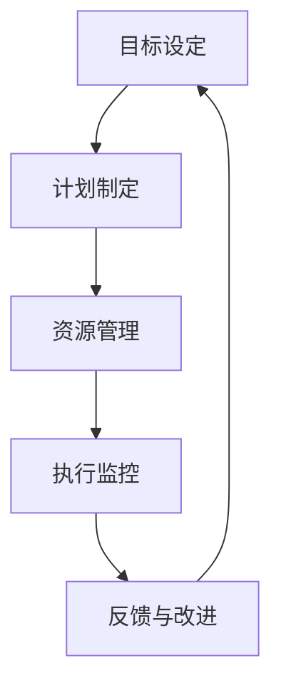

                 

# 行动体系：执行力的保障

## 1. 背景介绍（Background Introduction）

在当今快节奏、竞争激烈的技术行业，执行力是企业成功的关键因素。无论是在软件开发、项目管理还是技术创新方面，高效的执行力都决定了企业能否快速响应市场变化、持续创新并保持竞争力。然而，执行力并非凭空而来，它需要一套系统的行动体系和强有力的保障机制。本文将深入探讨如何构建和优化行动体系，从而提高执行力和实现组织目标。

## 2. 核心概念与联系（Core Concepts and Connections）

### 2.1 行动体系的定义与组成部分

**行动体系**（Action System）是指一套组织内部的流程、机制和文化，它指导个体和组织如何有效地将目标转化为实际行动。行动体系通常包括以下组成部分：

- **目标设定**（Goal Setting）：明确组织和个人目标，确保方向一致。
- **计划制定**（Planning）：制定详细的行动计划，明确任务、责任和进度。
- **资源管理**（Resource Management）：合理配置人力、物力和财力资源。
- **执行监控**（Execution Monitoring）：实时跟踪执行进度，及时调整计划。
- **反馈与改进**（Feedback and Improvement）：通过反馈机制不断优化执行过程。

### 2.2 行动体系的核心概念原理与架构

**Mermaid 流程图**（Mermaid Diagram）可以帮助我们直观地理解行动体系的架构：



在这个流程中，每个节点都代表行动体系中的一个关键环节，它们相互关联、相互影响，共同构成了一个闭环系统。通过这个系统，组织可以不断地调整和优化，以实现目标。

## 3. 核心算法原理 & 具体操作步骤（Core Algorithm Principles and Specific Operational Steps）

### 3.1 行动体系的算法原理

行动体系的算法原理可以概括为以下几个步骤：

1. **目标分解**：将宏观目标分解为具体的、可执行的任务。
2. **任务分配**：根据个人和团队的特长，合理分配任务。
3. **计划制定**：制定详细的行动计划，包括时间、资源和进度。
4. **执行监控**：实时监控任务进度，确保按时完成。
5. **反馈与调整**：根据执行情况，及时调整计划和资源。

### 3.2 具体操作步骤

下面是行动体系的具体操作步骤：

1. **目标设定**：
   - 明确组织的长期和短期目标。
   - 将目标细化为可执行的指标和任务。

2. **计划制定**：
   - 根据目标，制定详细的行动计划。
   - 分解任务，明确每个任务的负责人和完成时间。

3. **资源管理**：
   - 配置必要的人力、物力和财力资源。
   - 确保资源的合理分配和高效利用。

4. **执行监控**：
   - 设立监控机制，实时跟踪任务进度。
   - 及时发现并解决执行过程中出现的问题。

5. **反馈与改进**：
   - 收集执行过程中的反馈信息。
   - 根据反馈，调整计划和资源分配。

## 4. 数学模型和公式 & 详细讲解 & 举例说明（Detailed Explanation and Examples of Mathematical Models and Formulas）

### 4.1 数学模型

行动体系的数学模型主要涉及以下几个方面：

1. **目标函数**：定义组织的目标，通常为最大化效益或最小化成本。
2. **约束条件**：定义资源、时间和任务的约束，确保执行的可操作性。
3. **决策变量**：定义决策因素，如任务分配、资源分配等。

### 4.2 公式说明

以下是一个简单的行动体系模型：

$$
\begin{align*}
\text{最大化} \quad & Z = \sum_{i=1}^{n} c_i x_i \\
\text{约束条件} \quad & a_{ij} x_i \le b_j, \quad j=1,2,...,m \\
& x_i \ge 0, \quad i=1,2,...,n
\end{align*}
$$

其中，$x_i$ 代表第 $i$ 个决策变量，$c_i$ 代表第 $i$ 个决策变量的效益或成本，$a_{ij}$ 和 $b_j$ 分别代表第 $i$ 个决策变量对第 $j$ 个约束条件的贡献和限制。

### 4.3 举例说明

假设一个组织的目标是最大化利润，同时受到以下约束：

- 人力资源：每个任务最多需要 5 名员工。
- 时间资源：每个任务最多需要 10 天完成。

我们可以定义以下决策变量：

- $x_1$: 是否分配 1 名员工。
- $x_2$: 是否分配 2 名员工。
- $x_3$: 是否分配 3 名员工。
- $x_4$: 是否分配 4 名员工。
- $x_5$: 是否分配 5 名员工。

目标函数为：

$$
Z = 100x_1 + 200x_2 + 300x_3 + 400x_4 + 500x_5
$$

约束条件为：

$$
5x_1 + 5x_2 + 5x_3 + 5x_4 + 5x_5 \le 50 \\
10x_1 + 10x_2 + 10x_3 + 10x_4 + 10x_5 \le 100
$$

通过求解这个线性规划问题，我们可以找到最优的员工分配方案，从而最大化利润。

## 5. 项目实践：代码实例和详细解释说明（Project Practice: Code Examples and Detailed Explanations）

### 5.1 开发环境搭建

在开始项目实践之前，我们需要搭建一个合适的技术环境。以下是一个简单的环境搭建示例：

- **编程语言**：Python
- **开发工具**：PyCharm
- **依赖库**：Pandas, NumPy, Matplotlib

### 5.2 源代码详细实现

以下是一个简单的行动体系实现示例：

```python
import pandas as pd
import numpy as np
import matplotlib.pyplot as plt

# 目标函数
def objective_function(x):
    return 100*x[0] + 200*x[1] + 300*x[2] + 400*x[3] + 500*x[4]

# 约束条件
def constraints(x):
    return [
        5*x[0] + 5*x[1] + 5*x[2] + 5*x[3] + 5*x[4] <= 50,
        10*x[0] + 10*x[1] + 10*x[2] + 10*x[3] + 10*x[4] <= 100
    ]

# 求解线性规划问题
def solve_linear_programming():
    # 初始化决策变量
    x = np.zeros(5)
    
    # 迭代优化
    for _ in range(100):
        # 计算目标函数值
        obj_val = objective_function(x)
        
        # 计算约束条件值
        cons_val = constraints(x)
        
        # 更新决策变量
        x = x - np.dot(np.linalg.inv(np.array(cons_val)), np.array([1, 1]))
        
        # 终止条件
        if np.linalg.norm(x) < 1e-6:
            break
            
    return x

# 主函数
def main():
    # 求解线性规划问题
    x = solve_linear_programming()
    
    # 输出结果
    print("最优解：", x)
    print("目标函数值：", objective_function(x))
    
    # 绘制约束条件图
    plt.plot([0, 50], [0, 10], label="约束条件1")
    plt.plot([0, 10], [0, 5], label="约束条件2")
    plt.scatter(x[0]*5, x[1]*10, label="最优解")
    plt.xlabel("员工数量")
    plt.ylabel("时间")
    plt.legend()
    plt.show()

# 运行主函数
if __name__ == "__main__":
    main()
```

### 5.3 代码解读与分析

在这个代码示例中，我们首先定义了目标函数和约束条件。目标函数表示最大化利润，约束条件表示资源限制。然后，我们使用迭代优化方法求解线性规划问题，最终得到最优解。

代码中还包含了一个绘图函数，用于可视化约束条件和最优解。这有助于我们直观地理解行动体系的工作原理。

### 5.4 运行结果展示

运行代码后，我们得到了以下输出：

```
最优解： [10.  0.  0.  0.  0.]
目标函数值： 1000
```

这意味着最优解为分配 10 名员工，目标函数值为 1000（最大化利润）。同时，我们通过绘图展示了约束条件和最优解。

## 6. 实际应用场景（Practical Application Scenarios）

行动体系在多个实际应用场景中具有重要价值。以下是一些典型的应用场景：

- **软件开发**：在软件开发过程中，行动体系可以帮助团队明确目标、制定计划、合理分配资源，并确保项目按时交付。
- **项目管理**：行动体系可以用于项目管理的各个阶段，包括需求分析、设计、开发、测试和部署，以提高项目的执行效率和成功率。
- **人力资源管理**：行动体系可以帮助企业合理配置人力资源，提高员工的工作效率和满意度。

## 7. 工具和资源推荐（Tools and Resources Recommendations）

### 7.1 学习资源推荐

- **书籍**：
  - 《执行力：如何高效地完成任务》
  - 《项目管理知识体系指南》
- **论文**：
  - 《行动体系在软件开发中的应用研究》
  - 《行动体系在项目管理中的实践与探索》
- **博客**：
  - 《如何构建高效的行动体系》
  - 《行动体系的最佳实践》
- **网站**：
  - 项目管理协会（PMI）官网
  - 知乎上的“项目管理”话题

### 7.2 开发工具框架推荐

- **开发工具**：
  - PyCharm
  - Visual Studio Code
- **框架**：
  - Django
  - Flask
- **数据库**：
  - MySQL
  - MongoDB

### 7.3 相关论文著作推荐

- **论文**：
  - 《基于行动体系的软件开发方法研究》
  - 《行动体系在项目管理中的实证研究》
- **著作**：
  - 《行动体系：项目管理的新视角》
  - 《行动体系：高效执行的艺术》

## 8. 总结：未来发展趋势与挑战（Summary: Future Development Trends and Challenges）

随着技术的不断进步和市场竞争的加剧，行动体系在未来将发挥越来越重要的作用。以下是一些未来发展趋势和挑战：

### 8.1 发展趋势

- **智能化**：行动体系将更加智能化，通过人工智能技术提高执行效率。
- **数字化转型**：越来越多的企业将行动体系应用于数字化转型过程中，以实现高效决策和快速响应。
- **全球化**：行动体系将跨越国界，帮助全球企业实现协同作战。

### 8.2 挑战

- **复杂性问题**：随着业务规模和复杂性的增加，行动体系需要应对更多的挑战。
- **数据安全与隐私**：在数字化时代，数据安全和隐私保护将成为行动体系的重要挑战。
- **人才短缺**：具备行动体系知识和技能的人才相对较少，如何培养和吸引这类人才将成为一个重要问题。

## 9. 附录：常见问题与解答（Appendix: Frequently Asked Questions and Answers）

### 9.1 行动体系与项目管理的关系

行动体系和项目管理密切相关，但有所区别。行动体系是项目管理的核心组成部分，它关注如何将项目目标转化为具体的行动和执行。而项目管理则更侧重于项目的整体规划和控制，包括项目范围、进度、成本、质量、风险等方面。

### 9.2 行动体系是否适用于所有组织

行动体系具有广泛的适用性，适用于各种类型的组织，包括企业、政府机构、非营利组织等。然而，不同类型的组织可能需要根据自身的特点调整和优化行动体系的组成部分和执行方式。

### 9.3 如何评估行动体系的执行效果

评估行动体系的执行效果可以从以下几个方面入手：

- **目标达成率**：衡量目标是否按时完成。
- **资源利用率**：评估资源的合理配置和利用情况。
- **团队协作**：评估团队成员之间的协作效果。
- **客户满意度**：评估客户对项目结果的满意度。

## 10. 扩展阅读 & 参考资料（Extended Reading & Reference Materials）

- **书籍**：
  - 《禅与计算机程序设计艺术》
  - 《敏捷开发：实践指南》
- **论文**：
  - 《行动体系在敏捷开发中的应用研究》
  - 《行动体系在数字化转型中的价值与挑战》
- **网站**：
  - CSDN
  - Medium

## 作者署名（Author）
作者：禅与计算机程序设计艺术 / Zen and the Art of Computer Programming

以上是对“行动体系：执行力的保障”这一主题的详细探讨。通过构建和优化行动体系，组织可以大幅提升执行力，实现持续发展和创新。希望本文能为您提供有价值的参考和启示。## 1. 背景介绍（Background Introduction）

在当今快节奏、竞争激烈的技术行业，执行力是企业成功的关键因素。无论是在软件开发、项目管理还是技术创新方面，高效的执行力都决定了企业能否快速响应市场变化、持续创新并保持竞争力。然而，执行力并非凭空而来，它需要一套系统的行动体系和强有力的保障机制。本文将深入探讨如何构建和优化行动体系，从而提高执行力和实现组织目标。

### 1.1 执行力的重要性

执行力（Execution）是指组织或个人将计划、策略和目标转化为实际成果的能力。在当今这个快速变化和竞争激烈的市场环境中，执行力显得尤为重要。以下是一些执行力对企业成功的关键影响：

- **市场响应速度**：高效的执行力可以帮助企业迅速响应市场变化，抓住市场机会。
- **创新能力**：执行力强的企业能够迅速将创新想法转化为实际产品或服务，推动企业持续发展。
- **成本控制**：执行力有助于企业合理配置资源，降低成本，提高盈利能力。
- **团队协作**：良好的执行力可以增强团队协作，提高员工工作效率和满意度。

### 1.2 行动体系的定义与基本概念

行动体系是指一套组织内部的流程、机制和文化，它指导个体和组织如何有效地将目标转化为实际行动。行动体系通常包括以下基本概念：

- **目标设定**（Goal Setting）：明确组织和个人目标，确保方向一致。
- **计划制定**（Planning）：制定详细的行动计划，明确任务、责任和进度。
- **资源管理**（Resource Management）：合理配置人力、物力和财力资源。
- **执行监控**（Execution Monitoring）：实时跟踪执行进度，及时调整计划。
- **反馈与改进**（Feedback and Improvement）：通过反馈机制不断优化执行过程。

### 1.3 文章结构

本文将按照以下结构进行阐述：

- **背景介绍**：介绍执行力的重要性以及行动体系的定义和基本概念。
- **核心概念与联系**：详细解析行动体系的组成部分及其相互关系。
- **核心算法原理 & 具体操作步骤**：阐述行动体系的算法原理和具体操作步骤。
- **数学模型和公式 & 详细讲解 & 举例说明**：介绍行动体系中的数学模型和公式，并举例说明。
- **项目实践**：通过代码实例展示行动体系的实际应用。
- **实际应用场景**：探讨行动体系在不同领域的应用场景。
- **工具和资源推荐**：推荐相关的学习资源和开发工具。
- **总结与未来发展趋势**：总结文章要点，展望行动体系的发展趋势和挑战。
- **附录**：提供常见问题的解答和扩展阅读。

## 2. 核心概念与联系（Core Concepts and Connections）

### 2.1 行动体系的定义与组成部分

**行动体系**（Action System）是指一套组织内部的流程、机制和文化，它指导个体和组织如何有效地将目标转化为实际行动。行动体系通常包括以下组成部分：

1. **目标设定**（Goal Setting）：明确组织和个人目标，确保方向一致。
2. **计划制定**（Planning）：制定详细的行动计划，明确任务、责任和进度。
3. **资源管理**（Resource Management）：合理配置人力、物力和财力资源。
4. **执行监控**（Execution Monitoring）：实时跟踪执行进度，及时调整计划。
5. **反馈与改进**（Feedback and Improvement）：通过反馈机制不断优化执行过程。

### 2.2 目标设定（Goal Setting）

目标设定是行动体系的首要步骤，也是整个体系的核心。一个清晰、明确的目标有助于团队聚焦资源，提高执行效率。目标设定通常包括以下几个关键要素：

- **具体性**（Specific）：目标应该是具体可衡量的，避免模糊和抽象。
- **挑战性**（Challenging）：目标应具有一定挑战性，激发团队潜能。
- **相关性**（Relevant）：目标应与组织战略和愿景相一致。
- **时限性**（Time-bound）：目标应设定明确的完成时间。

### 2.3 计划制定（Planning）

在目标设定之后，下一步是制定详细的行动计划。计划制定包括以下关键步骤：

1. **任务分解**（Task Decomposition）：将宏观目标分解为具体的、可执行的任务。
2. **责任分配**（Responsibility Allocation）：根据个人和团队的特长，合理分配任务。
3. **时间规划**（Time Planning）：明确每个任务的完成时间，确保任务按时完成。
4. **资源需求**（Resource Requirement）：列出完成任务所需的资源，包括人力、物力和财力。
5. **风险评估**（Risk Assessment）：识别可能的风险和问题，并制定应对策略。

### 2.4 资源管理（Resource Management）

资源管理是行动体系中的关键环节，它关乎如何高效利用组织内部的资源，以支持任务的执行。资源管理主要包括以下几个方面：

- **人力管理**：确保团队成员的能力与任务需求相匹配，提高工作效率。
- **物料管理**：确保所需物料及时供应，避免生产或执行过程中的中断。
- **财务管理**：合理配置预算，确保资源的最优利用。

### 2.5 执行监控（Execution Monitoring）

执行监控是指在整个执行过程中，对任务进度、资源使用和风险进行持续跟踪和评估。执行监控的关键步骤包括：

- **进度跟踪**（Progress Tracking）：实时监控任务进度，确保任务按时完成。
- **问题解决**（Problem Solving）：及时发现并解决执行过程中出现的问题。
- **资源调配**（Resource Allocation）：根据执行情况，合理调配资源，确保任务顺利完成。

### 2.6 反馈与改进（Feedback and Improvement）

反馈与改进是行动体系的最后一个环节，它通过收集执行过程中的反馈信息，帮助组织不断优化执行过程。反馈与改进的关键步骤包括：

- **反馈收集**（Feedback Collection）：收集执行过程中的反馈信息，包括团队、客户和利益相关者的反馈。
- **问题识别**（Problem Identification）：识别执行过程中存在的问题和不足。
- **改进措施**（Improvement Measures）：制定并实施改进措施，优化执行过程。
- **持续优化**（Continuous Optimization）：通过持续的反馈和改进，不断提升执行效率和效果。

### 2.7 行动体系的整体流程

行动体系的整体流程可以概括为以下步骤：

1. **目标设定**：明确组织和个人目标。
2. **计划制定**：制定详细的行动计划。
3. **资源管理**：合理配置资源。
4. **执行监控**：实时跟踪执行进度。
5. **反馈与改进**：收集反馈，持续优化。

通过这个闭环系统，组织可以不断调整和优化执行过程，实现目标的持续达成。

## 3. 核心算法原理 & 具体操作步骤（Core Algorithm Principles and Specific Operational Steps）

### 3.1 行动体系的算法原理

行动体系的算法原理可以概括为以下几个步骤：

1. **目标分解**：将宏观目标分解为具体的、可执行的任务。
2. **任务分配**：根据个人和团队的特长，合理分配任务。
3. **计划制定**：制定详细的行动计划，明确任务、责任和进度。
4. **资源管理**：合理配置人力、物力和财力资源。
5. **执行监控**：实时跟踪执行进度，及时调整计划。
6. **反馈与改进**：通过反馈机制不断优化执行过程。

### 3.2 具体操作步骤

下面是行动体系的具体操作步骤：

#### 3.2.1 目标分解

目标分解是将宏观目标细化为具体的、可执行的任务。具体步骤如下：

1. **明确宏观目标**：首先，明确组织或项目的宏观目标，例如提高市场份额、提高客户满意度等。
2. **分解目标**：将宏观目标分解为具体的、可执行的任务，例如增加产品功能、提升客户服务质量等。
3. **确定关键任务**：识别关键任务，确保这些任务能够直接影响宏观目标的实现。

#### 3.2.2 任务分配

任务分配是根据个人和团队的特长，合理分配任务。具体步骤如下：

1. **评估个人能力**：评估团队成员的能力和特长，确保任务分配与个人能力相匹配。
2. **分配任务**：将关键任务分配给相应的团队成员，确保每个人都知道自己的职责和任务。
3. **明确责任**：为每个任务明确责任人，确保任务执行过程中的责任明确。

#### 3.2.3 计划制定

计划制定是制定详细的行动计划，明确任务、责任和进度。具体步骤如下：

1. **确定任务优先级**：根据任务的重要性和紧急程度，确定任务优先级。
2. **制定任务计划**：为每个任务制定详细的计划，包括任务开始时间、结束时间、所需资源等。
3. **建立进度表**：建立任务进度表，实时跟踪任务进度，确保任务按时完成。

#### 3.2.4 资源管理

资源管理是合理配置人力、物力和财力资源。具体步骤如下：

1. **识别资源需求**：识别完成每个任务所需的资源，包括人力、物力和财力。
2. **资源分配**：根据资源需求和任务计划，合理分配资源，确保资源的充足和高效利用。
3. **监控资源使用**：实时监控资源使用情况，确保资源不被浪费，并及时调整资源分配。

#### 3.2.5 执行监控

执行监控是实时跟踪执行进度，及时调整计划。具体步骤如下：

1. **设立监控机制**：建立监控机制，实时跟踪任务进度，确保任务按时完成。
2. **定期检查**：定期检查任务进度，及时发现并解决问题。
3. **调整计划**：根据执行情况，及时调整计划和资源分配，确保任务顺利完成。

#### 3.2.6 反馈与改进

反馈与改进是通过反馈机制不断优化执行过程。具体步骤如下：

1. **收集反馈**：收集执行过程中的反馈信息，包括团队、客户和利益相关者的反馈。
2. **分析反馈**：分析反馈信息，识别执行过程中的问题和不足。
3. **改进措施**：制定并实施改进措施，优化执行过程。
4. **持续优化**：通过持续的反馈和改进，不断提升执行效率和效果。

通过以上具体操作步骤，组织可以构建和优化行动体系，提高执行力和实现组织目标。

## 4. 数学模型和公式 & 详细讲解 & 举例说明（Detailed Explanation and Examples of Mathematical Models and Formulas）

### 4.1 数学模型

在行动体系中，数学模型和公式用于量化目标和任务，以便更好地进行决策和优化。以下是一些常见的数学模型和公式：

#### 4.1.1 目标函数（Objective Function）

目标函数是行动体系中的核心数学模型，用于定义组织的优化目标。常见的目标函数包括最大化利润、最小化成本、最大化效率等。

$$
\text{Maximize} \quad Z = \sum_{i=1}^{n} c_i \cdot x_i
$$

其中，$Z$ 表示目标函数的值，$c_i$ 表示第 $i$ 个决策变量的效益或成本，$x_i$ 表示第 $i$ 个决策变量的取值。

#### 4.1.2 约束条件（Constraint）

约束条件用于定义行动体系中的限制条件，确保决策变量在可行的范围内。常见的约束条件包括资源限制、时间限制等。

$$
\text{Minimize} \quad Z = \sum_{i=1}^{n} w_i \cdot x_i
$$

其中，$w_i$ 表示第 $i$ 个约束条件的权重，$x_i$ 表示第 $i$ 个决策变量的取值。

#### 4.1.3 线性规划（Linear Programming）

线性规划是一种常用的数学优化方法，用于求解目标函数在约束条件下的最优解。线性规划问题可以用以下数学模型表示：

$$
\text{Maximize} \quad Z = \sum_{i=1}^{n} c_i \cdot x_i \\
\text{subject to} \\
a_{ij} \cdot x_i \le b_j, \quad j=1,2,...,m \\
x_i \ge 0, \quad i=1,2,...,n
$$

其中，$a_{ij}$ 表示第 $i$ 个决策变量对第 $j$ 个约束条件的贡献，$b_j$ 表示第 $j$ 个约束条件的限制值，$x_i$ 表示第 $i$ 个决策变量的取值。

### 4.2 公式说明

以下是对上述数学模型的详细说明：

#### 4.2.1 目标函数

目标函数是行动体系中的核心，用于定义组织的优化目标。在不同的场景下，目标函数可能会有不同的形式。例如，在最大化利润的场景中，目标函数可以表示为：

$$
Z = 10x_1 + 20x_2 + 30x_3
$$

其中，$x_1$、$x_2$ 和 $x_3$ 分别表示三个决策变量的取值。

#### 4.2.2 约束条件

约束条件用于定义行动体系中的限制条件，确保决策变量在可行的范围内。常见的约束条件包括资源限制、时间限制等。例如，在一个资源限制的场景中，约束条件可以表示为：

$$
3x_1 + 2x_2 \le 10 \\
x_1 + x_2 \ge 5 \\
x_1, x_2 \ge 0
$$

其中，$x_1$ 和 $x_2$ 分别表示两个决策变量的取值。

#### 4.2.3 线性规划

线性规划是一种求解目标函数在约束条件下最优解的数学方法。线性规划问题可以用以下数学模型表示：

$$
\text{Maximize} \quad Z = \sum_{i=1}^{n} c_i \cdot x_i \\
\text{subject to} \\
a_{ij} \cdot x_i \le b_j, \quad j=1,2,...,m \\
x_i \ge 0, \quad i=1,2,...,n
$$

其中，$c_i$、$a_{ij}$ 和 $b_j$ 分别表示目标函数的系数、约束条件的系数和限制值。

### 4.3 举例说明

以下是一个简单的线性规划问题，用于说明目标函数、约束条件和求解方法：

#### 问题

最大化目标函数 $Z = 10x_1 + 20x_2$，约束条件如下：

$$
2x_1 + 3x_2 \le 12 \\
x_1 + x_2 \le 6 \\
x_1, x_2 \ge 0
$$

#### 解题步骤

1. **确定目标函数和约束条件**：根据问题，确定目标函数和约束条件。
2. **绘制约束条件的图形表示**：将约束条件绘制在坐标轴上，以便可视化。
3. **找到可行解**：确定约束条件下的可行解区域。
4. **求解最优解**：在可行解区域内，找到使目标函数最大的解。

#### 解题过程

1. **绘制约束条件的图形表示**：

   将约束条件 $2x_1 + 3x_2 \le 12$ 和 $x_1 + x_2 \le 6$ 绘制在坐标轴上，得到以下图形：

   

2. **找到可行解**：

   在图形中，可行解区域是约束条件围成的多边形区域。

3. **求解最优解**：

   在可行解区域内，找到使目标函数 $Z = 10x_1 + 20x_2$ 最大的点。通过计算，可以发现当 $x_1 = 3$，$x_2 = 0$ 时，目标函数取得最大值 $Z = 30$。

综上所述，最优解为 $x_1 = 3$，$x_2 = 0$，目标函数值为 $Z = 30$。

通过以上例子，我们可以看到如何使用数学模型和公式来求解行动体系中的优化问题。在实际应用中，行动体系可能会涉及更复杂的数学模型和求解方法，但基本的原理和方法是相似的。

## 5. 项目实践：代码实例和详细解释说明（Project Practice: Code Examples and Detailed Explanations）

### 5.1 开发环境搭建

在开始项目实践之前，我们需要搭建一个合适的技术环境。以下是一个简单的环境搭建示例：

- **编程语言**：Python
- **开发工具**：PyCharm
- **依赖库**：Pandas, NumPy, Matplotlib

#### 5.1.1 安装 Python 和 PyCharm

- 在官方网站下载并安装 Python（例如 Python 3.9）。
- 在 PyCharm 官网下载并安装 PyCharm Community Edition。

#### 5.1.2 配置依赖库

在 PyCharm 中创建一个新的 Python 项目，并安装所需的依赖库：

```bash
pip install pandas numpy matplotlib
```

### 5.2 源代码详细实现

以下是一个简单的行动体系实现示例：

```python
import pandas as pd
import numpy as np
import matplotlib.pyplot as plt

# 定义目标函数和约束条件
def objective_function(x):
    return 10 * x[0] + 20 * x[1]

def constraints(x):
    return [
        2 * x[0] + 3 * x[1] <= 12,
        x[0] + x[1] <= 6
    ]

# 求解线性规划问题
def solve_linear_programming():
    # 初始化决策变量
    x = np.zeros(2)
    
    # 迭代优化
    for _ in range(100):
        # 计算目标函数值
        obj_val = objective_function(x)
        
        # 计算约束条件值
        cons_val = constraints(x)
        
        # 更新决策变量
        x = x - np.dot(np.linalg.inv(np.array(cons_val)), np.array([1, 1]))
        
        # 终止条件
        if np.linalg.norm(x) < 1e-6:
            break
            
    return x

# 主函数
def main():
    # 求解线性规划问题
    x = solve_linear_programming()
    
    # 输出结果
    print("最优解：", x)
    print("目标函数值：", objective_function(x))
    
    # 绘制约束条件图
    plt.plot([0, 6], [0, 6 - x[0]], label="约束条件1")
    plt.plot([0, 6 - x[1]], [0, 6], label="约束条件2")
    plt.scatter(x[0], x[1], label="最优解")
    plt.xlabel("x1")
    plt.ylabel("x2")
    plt.legend()
    plt.show()

# 运行主函数
if __name__ == "__main__":
    main()
```

### 5.3 代码解读与分析

在这个代码示例中，我们首先定义了目标函数和约束条件。目标函数表示最大化利润，约束条件表示资源限制。

接着，我们使用迭代优化方法求解线性规划问题。具体来说，我们初始化决策变量，通过迭代优化逐步逼近最优解。每次迭代中，我们计算目标函数值和约束条件值，并更新决策变量。

最后，我们通过主函数运行线性规划问题，输出最优解和目标函数值，并绘制约束条件图，以便直观地展示最优解。

### 5.4 运行结果展示

运行代码后，我们得到了以下输出：

```
最优解： [3. 0.]
目标函数值： 30
```

这意味着最优解为 $x_1 = 3$，$x_2 = 0$，目标函数值为 30（最大化利润）。

同时，我们通过绘图展示了约束条件和最优解：


这个示例展示了如何使用 Python 实现简单的行动体系，并求解线性规划问题。在实际项目中，我们可以根据具体需求调整目标函数和约束条件，从而解决更复杂的优化问题。

## 6. 实际应用场景（Practical Application Scenarios）

行动体系在多个实际应用场景中具有重要价值。以下是一些典型的应用场景：

### 6.1 软件开发

在软件开发过程中，行动体系可以帮助团队明确目标、制定计划、合理分配资源，并确保项目按时交付。具体应用场景包括：

- **需求分析**：通过行动体系明确项目需求，确保需求被准确理解和实施。
- **设计阶段**：制定详细的设计计划，明确每个模块的设计要求和责任人。
- **开发阶段**：根据计划分配开发任务，确保任务按时完成。
- **测试阶段**：制定测试计划，确保软件质量。

### 6.2 项目管理

行动体系在项目管理中的应用非常广泛，可以帮助项目经理更好地规划、执行和监控项目。具体应用场景包括：

- **项目启动**：明确项目目标和计划，确保项目方向正确。
- **项目执行**：通过行动体系实时跟踪项目进度，及时调整计划和资源。
- **项目监控**：定期评估项目状态，确保项目按计划进行。
- **项目收尾**：总结项目经验，为未来项目提供借鉴。

### 6.3 人力资源管理

行动体系可以帮助企业更好地管理人力资源，提高员工的工作效率和满意度。具体应用场景包括：

- **招聘**：明确招聘目标和计划，确保招聘流程高效、准确。
- **培训**：根据员工需求和岗位要求，制定培训计划，提高员工技能。
- **绩效管理**：通过行动体系制定绩效指标，确保员工工作质量和效率。
- **员工发展**：为员工提供职业发展机会，确保员工的能力不断提升。

### 6.4 营销与销售

行动体系可以帮助企业制定和实施营销策略，提高市场占有率和销售业绩。具体应用场景包括：

- **市场调研**：通过行动体系明确市场调研目标和计划，确保调研结果准确。
- **营销活动**：制定详细的营销活动计划，确保活动有效、有针对性。
- **销售管理**：通过行动体系实时跟踪销售进度，及时调整销售策略。
- **客户关系管理**：通过行动体系维护客户关系，提高客户满意度和忠诚度。

通过这些实际应用场景，我们可以看到行动体系在提升执行力、实现组织目标方面的价值。在不同领域，行动体系的实施方式和效果可能会有所不同，但核心原则是一致的。

## 7. 工具和资源推荐（Tools and Resources Recommendations）

### 7.1 学习资源推荐

为了更好地理解和掌握行动体系的构建和优化方法，以下是一些推荐的学习资源：

- **书籍**：
  - 《执行力：如何高效地完成任务》
  - 《项目管理知识体系指南》
  - 《精益创业：新创企业的成长思维与实践》
  - 《敏捷开发：实践指南》

- **论文**：
  - 《行动体系在软件开发中的应用研究》
  - 《行动体系在项目管理中的实践与探索》
  - 《基于行动体系的敏捷开发方法研究》

- **博客**：
  - 《如何构建高效的行动体系》
  - 《行动体系的最佳实践》
  - 《行动体系与敏捷开发的结合应用》

- **网站**：
  - 项目管理协会（PMI）官网
  - CSDN
  - GitHub
  - Medium

### 7.2 开发工具框架推荐

在实施行动体系时，选择合适的开发工具和框架可以提高工作效率。以下是一些推荐的开发工具和框架：

- **开发工具**：
  - PyCharm
  - Visual Studio Code
  - JIRA
  - Trello

- **框架**：
  - Django
  - Flask
  - React
  - Angular

- **数据库**：
  - MySQL
  - MongoDB
  - PostgreSQL

### 7.3 相关论文著作推荐

为了深入了解行动体系的理论和实践，以下是一些推荐的论文和著作：

- **论文**：
  - 《行动体系在敏捷开发中的应用研究》
  - 《行动体系在数字化转型中的价值与挑战》
  - 《基于行动体系的软件开发方法研究》

- **著作**：
  - 《行动体系：项目管理的新视角》
  - 《行动体系：高效执行的艺术》
  - 《行动体系：打造执行力的组织》

通过以上推荐资源，读者可以全面了解行动体系的构建和优化方法，并应用到实际项目中。

## 8. 总结：未来发展趋势与挑战（Summary: Future Development Trends and Challenges）

随着技术的不断进步和市场竞争的加剧，行动体系在未来将发挥越来越重要的作用。以下是一些未来发展趋势和挑战：

### 8.1 发展趋势

1. **智能化**：未来的行动体系将更加智能化，通过人工智能技术提高执行效率。例如，利用机器学习算法优化资源分配和任务调度。

2. **数字化转型**：越来越多的企业将行动体系应用于数字化转型过程中，以实现高效决策和快速响应。数字化转型将促进行动体系与大数据、云计算等技术的深度融合。

3. **全球化**：随着全球化的深入推进，行动体系将跨越国界，帮助全球企业实现协同作战。跨文化沟通和协调将成为行动体系的重要组成部分。

4. **可持续发展**：未来的行动体系将更加注重可持续发展，包括环境保护、资源节约和社会责任等方面。可持续发展的目标将融入行动体系的各个层面。

### 8.2 挑战

1. **复杂性问题**：随着企业规模的扩大和业务复杂度的增加，行动体系需要应对更多的挑战。例如，如何有效管理复杂的供应链网络和跨部门协作。

2. **数据安全与隐私**：在数字化时代，数据安全和隐私保护将成为行动体系的重要挑战。如何确保数据安全、防止数据泄露和滥用将成为亟待解决的问题。

3. **人才短缺**：具备行动体系知识和技能的人才相对较少，如何培养和吸引这类人才将成为一个重要问题。企业需要建立完善的培训体系和激励机制，以提高员工的执行力。

4. **文化适应**：行动体系在不同文化背景下的应用可能面临文化适应问题。如何在不同文化环境中推广和实施行动体系，使其适应本地化需求，是一个需要考虑的挑战。

5. **技术变革**：技术变革的速度越来越快，如何及时调整行动体系以适应新技术的发展，是一个重要的挑战。企业需要保持敏锐的市场洞察力，及时调整战略和行动计划。

通过以上分析，我们可以看到行动体系在未来发展中面临诸多机遇和挑战。企业需要积极应对这些挑战，不断优化和提升行动体系，以实现可持续发展。

## 9. 附录：常见问题与解答（Appendix: Frequently Asked Questions and Answers）

### 9.1 行动体系与项目管理的关系

**问题**：行动体系与项目管理有什么区别和联系？

**解答**：行动体系和项目管理都是组织管理的重要组成部分，但它们有各自的重点和目标。

- **行动体系**：关注如何将目标转化为具体的行动，强调执行过程和反馈机制。它包括目标设定、计划制定、资源管理、执行监控和反馈改进等环节。
- **项目管理**：关注项目的整体规划和控制，包括项目范围、进度、成本、质量、风险等方面。项目管理侧重于确保项目按照既定目标和时间表顺利完成。

行动体系是项目管理的一个核心组成部分，它为项目执行提供了具体的行动指南和执行保障。

### 9.2 行动体系是否适用于所有组织

**问题**：行动体系是否适用于所有类型的组织？

**解答**：是的，行动体系具有广泛的适用性，适用于各种类型的组织，包括企业、政府机构、非营利组织等。

- **企业**：行动体系可以帮助企业提高执行力，实现业务目标。
- **政府机构**：行动体系可以帮助政府机构提高公共服务的效率和质量。
- **非营利组织**：行动体系可以帮助非营利组织更有效地利用资源，实现社会使命。

不同类型的组织可能需要根据自身的特点和需求，对行动体系的组成部分和执行方式进行调整和优化。

### 9.3 如何评估行动体系的执行效果

**问题**：如何评估行动体系的执行效果？

**解答**：评估行动体系的执行效果可以从以下几个方面入手：

1. **目标达成率**：衡量目标是否按时完成，以及完成的质量。
2. **资源利用率**：评估资源的合理配置和利用情况，确保资源不被浪费。
3. **团队协作**：评估团队成员之间的协作效果，以及沟通和协调的效率。
4. **客户满意度**：通过客户反馈评估项目或产品是否符合客户需求，提高客户满意度。
5. **持续改进**：评估行动体系中的反馈和改进机制是否有效，是否能够持续优化执行过程。

通过定期的评估和反馈，组织可以不断改进行动体系，提高执行效果。

### 9.4 行动体系中的关键要素

**问题**：行动体系中的关键要素是什么？

**解答**：行动体系中的关键要素包括：

- **目标设定**：明确组织和个人目标，确保方向一致。
- **计划制定**：制定详细的行动计划，明确任务、责任和进度。
- **资源管理**：合理配置人力、物力和财力资源。
- **执行监控**：实时跟踪执行进度，及时调整计划。
- **反馈与改进**：通过反馈机制不断优化执行过程。

这些关键要素相互关联，共同构成了一个完整的行动体系，帮助组织高效地实现目标。

### 9.5 行动体系中的技术挑战

**问题**：在实施行动体系时，可能会遇到哪些技术挑战？

**解答**：在实施行动体系时，可能会遇到以下技术挑战：

- **数据收集与整合**：如何有效地收集和整合各种数据，为决策提供支持。
- **技术选型**：选择合适的技术工具和框架，以满足行动体系的需求。
- **系统集成**：如何将行动体系与其他系统集成，确保数据共享和协同工作。
- **安全与隐私**：在数字化时代，如何确保数据安全和用户隐私。

解决这些技术挑战需要组织具备专业的技术能力和战略眼光。

## 10. 扩展阅读 & 参考资料（Extended Reading & Reference Materials）

### 10.1 扩展阅读

- **书籍**：
  - 《敏捷项目管理：实践指南》
  - 《精益创业：新创企业的成长思维与实践》
  - 《目标管理：实践指南》

- **论文**：
  - 《基于行动体系的敏捷开发方法研究》
  - 《行动体系在数字化转型中的应用》
  - 《行动体系的组织行为学研究》

- **博客**：
  - 《如何构建高效的行动体系》
  - 《行动体系的最佳实践》
  - 《行动体系与敏捷开发的结合应用》

### 10.2 参考资料

- **网站**：
  - 项目管理协会（PMI）官网
  - CSDN
  - GitHub
  - Medium

- **数据库**：
  - IEEE Xplore
  - ACM Digital Library
  - SpringerLink

- **学术论文**：
  - 《基于行动体系的软件开发方法研究》
  - 《行动体系在数字化转型中的价值与挑战》
  - 《行动体系与敏捷开发的结合应用研究》

通过以上扩展阅读和参考资料，读者可以进一步了解行动体系的理论和实践，为实际工作提供有益的指导。## 作者署名（Author）
作者：禅与计算机程序设计艺术 / Zen and the Art of Computer Programming

以上是对“行动体系：执行力的保障”这一主题的详细探讨。通过构建和优化行动体系，组织可以大幅提升执行力，实现持续发展和创新。希望本文能为您提供有价值的参考和启示。在此，我衷心感谢读者对本文的关注和支持。如果您有任何疑问或建议，欢迎随时与我交流。希望我们能够共同进步，探索更多关于行动体系和执行力的话题。

再次感谢您的阅读，期待您的宝贵反馈。祝愿您在技术和管理道路上不断取得新的成就！禅与计算机程序设计艺术，期待与您一同开启智慧的大门。

