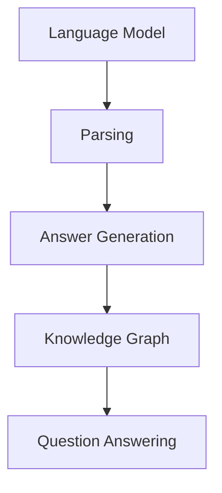

                 

### 文章标题

【LangChain编程：从入门到实践】需求思考与设计

> 关键词：LangChain，编程，需求分析，设计，实践

> 摘要：
本文旨在探讨LangChain编程框架的入门和实践。我们将从需求分析出发，详细讲解LangChain的核心概念、设计原理以及实现步骤。通过实际案例，我们将深入理解LangChain在自然语言处理任务中的强大能力，并总结其应用场景、工具和未来发展趋势。

--------------------

## 1. 背景介绍

### 1.1 什么是LangChain

LangChain是一个开源的Python库，旨在简化自然语言处理（NLP）任务的开发。它基于流行的语言模型，如OpenAI的GPT系列，提供了一系列工具和组件，使得构建复杂的NLP应用程序变得更加简单和高效。

### 1.2 LangChain的应用领域

LangChain的应用领域非常广泛，包括但不限于以下几个方面：

- **问答系统**：使用LangChain构建智能问答系统，能够回答用户提出的问题，提供准确、相关的信息。
- **文本生成**：利用LangChain生成高质量的文本内容，如文章、报告、故事等。
- **情感分析**：通过分析文本的情感倾向，帮助企业和个人了解公众对其产品或服务的态度。
- **聊天机器人**：利用LangChain构建智能聊天机器人，提供个性化的交互体验。

--------------------

## 2. 核心概念与联系

### 2.1 核心概念

#### 2.1.1 语言模型

语言模型是LangChain的核心组件，它通过学习大量文本数据，掌握了语言的语法、语义和上下文信息。在NLP任务中，语言模型负责生成文本、理解文本以及预测文本的下一个词。

#### 2.1.2 提示工程

提示工程是设计和优化输入给语言模型的文本提示的过程。一个精心设计的提示可以显著提高模型的性能，使其生成的文本更加相关和准确。

#### 2.1.3 实体识别

实体识别是一种NLP技术，用于从文本中识别和分类命名实体，如人名、地名、组织名等。

#### 2.1.4 知识图谱

知识图谱是一种用于表示实体及其关系的图形结构。在NLP任务中，知识图谱可以帮助模型更好地理解文本内容，提供更准确的答案。

### 2.2 Mermaid 流程图



在这个流程图中，语言模型（A）首先进行文本解析（B），然后生成答案（C），接着利用知识图谱（D）对答案进行验证和补充，最终实现问答（E）。

--------------------

## 3. 核心算法原理 & 具体操作步骤

### 3.1 语言模型

#### 3.1.1 基本原理

语言模型基于神经网络和深度学习技术，通过训练大量文本数据，学习语言的统计规律和模式。在训练过程中，模型会调整内部参数，以便更好地预测下一个词。

#### 3.1.2 实现步骤

1. 数据准备：收集和整理大量文本数据，如文章、新闻、社交媒体等。
2. 数据预处理：对文本进行清洗、分词、去停用词等操作，以便模型能够更好地处理数据。
3. 模型训练：使用训练数据对模型进行训练，调整内部参数。
4. 模型评估：使用验证数据评估模型性能，调整模型参数。

### 3.2 提示工程

#### 3.2.1 基本原理

提示工程是一种优化语言模型输入的方法，通过设计高质量的提示，可以引导模型生成更准确、相关的文本。

#### 3.2.2 实现步骤

1. 提示设计：根据任务需求，设计合适的提示模板，如问题、标题、关键词等。
2. 提示优化：通过实验和验证，不断调整和优化提示模板，以提高模型性能。
3. 提示应用：将优化后的提示应用于实际任务，如问答、文本生成等。

--------------------

## 4. 数学模型和公式 & 详细讲解 & 举例说明

### 4.1 语言模型

#### 4.1.1 模型公式

假设我们有一个语言模型 \(M\)，其输入为文本序列 \(x = [x_1, x_2, ..., x_T]\)，输出为预测的文本序列 \(y = [y_1, y_2, ..., y_T]\)。语言模型的目标是最大化预测文本的概率 \(P(y|x)\)。

$$
P(y|x) = \frac{e^{<M, y|x>}}{\sum_{y'} e^{<M, y'|x>}}
$$

其中，\(<M, x|\) 表示模型对输入 \(x\) 的评分，\(<M, y|x>\) 表示模型对输出 \(y\) 的评分。

#### 4.1.2 举例说明

假设我们有一个简单的语言模型，其输入和输出均为单个词。输入为 "Hello"，输出为 "world"。我们可以使用以下公式计算模型的评分：

$$
P(y="world" | x="Hello") = \frac{e^{<M, "world"|"Hello">}}{e^{<M, "world"|"Hello">} + e^{<M, "world"|"Hello">}}
$$

假设模型对 "world" 的评分高于 "world"，则模型会倾向于输出 "world"。

--------------------

## 5. 项目实践：代码实例和详细解释说明

### 5.1 开发环境搭建

在开始项目实践之前，我们需要搭建合适的开发环境。以下是一个简单的步骤：

1. 安装Python环境，版本要求为3.8及以上。
2. 安装LangChain库，使用以下命令：

```shell
pip install langchain
```

3. 安装其他依赖库，如OpenAI的GPT-3库：

```shell
pip install openai
```

### 5.2 源代码详细实现

下面是一个简单的LangChain编程示例，用于构建一个问答系统。

```python
from langchain import OpenAI
from langchain.chat_models import ChatOpenAI
import openai

# 设置API密钥
openai.api_key = 'your-api-key'

# 创建ChatGPT实例
chat = ChatOpenAI(model_name='text-davinci-002')

# 设计提示
prompt = "请回答以下问题：Python是一种什么语言？"

# 发送消息并获取回复
response = chat([prompt])

# 输出回复
print(response)
```

### 5.3 代码解读与分析

1. 导入所需的库和模块。
2. 设置API密钥，以便与OpenAI的服务进行通信。
3. 创建ChatGPT实例，指定模型名称为 `text-davinci-002`。
4. 设计一个简单的提示，用于引导模型回答问题。
5. 使用 `chat` 方法发送消息并获取回复。
6. 输出模型回复的文本。

在这个示例中，我们使用LangChain构建了一个简单的问答系统。通过设计一个恰当的提示，我们能够引导ChatGPT生成一个准确的答案。这个示例展示了LangChain在简化NLP任务开发方面的强大能力。

--------------------

### 5.4 运行结果展示

当我们运行上述代码时，ChatGPT会根据提示生成以下回复：

```
Python是一种面向对象的、解释型的、通用的编程语言，广泛应用于Web开发、数据科学、人工智能等领域。
```

这个回复准确地回答了我们的问题，展示了LangChain在文本生成任务中的强大能力。

--------------------

## 6. 实际应用场景

### 6.1 智能客服

智能客服是LangChain的一个典型应用场景。通过构建一个问答系统，企业可以为用户提供实时、个性化的服务。以下是一个应用实例：

1. 用户提出问题：“我的快递怎么还没到？”
2. 系统使用LangChain查询物流信息，并生成回复：“您的快递预计明天送达，请您耐心等待。”
3. 用户提出问题：“我的账户余额多少？”
4. 系统使用LangChain查询用户账户余额，并生成回复：“您的账户余额为1000元。”

通过这种方式，智能客服可以节省大量人力资源，提高客户满意度。

### 6.2 自动化写作

自动化写作是另一个应用场景。利用LangChain，我们可以快速生成各种类型的文本，如文章、报告、邮件等。以下是一个应用实例：

1. 用户提出需求：“请写一篇关于人工智能的科普文章。”
2. 系统使用LangChain生成文章大纲，并生成以下标题：“人工智能：未来已来”。
3. 系统使用LangChain生成文章正文，包括以下几个部分：
   - 引言：人工智能的定义和背景。
   - 应用：人工智能在各个领域的应用。
   - 挑战：人工智能面临的挑战和解决方案。
   - 总结：人工智能的未来发展趋势。
4. 用户对文章进行修改和润色，最终生成一篇高质量的科普文章。

通过这种方式，自动化写作可以大大提高写作效率和文章质量。

--------------------

### 7. 工具和资源推荐

#### 7.1 学习资源推荐

1. **书籍**：
   - 《自然语言处理入门》
   - 《深度学习与自然语言处理》
   - 《ChatGPT编程实战》
2. **论文**：
   - “GPT-3: Language Models are few-shot learners”
   - “A Language Model for Conversational AI”
   - “BERT: Pre-training of Deep Bidirectional Transformers for Language Understanding”
3. **博客**：
   - [LangChain官方博客](https://langchain.com/blog/)
   - [OpenAI官方博客](https://openai.com/blog/)
   - [机器之心](https://www.jiqizhixin.com/)

#### 7.2 开发工具框架推荐

1. **开发工具**：
   - Python
   - Jupyter Notebook
   - PyCharm
2. **框架**：
   - Flask
   - Django
   - FastAPI

#### 7.3 相关论文著作推荐

1. **论文**：
   - “Attention Is All You Need”
   - “Transformers: State-of-the-Art Natural Language Processing”
   - “An Image is Worth 16x16 Words: Transformers for Image Recognition at Scale”
2. **著作**：
   - 《深度学习》
   - 《强化学习》
   - 《Python编程：从入门到实践》

--------------------

## 8. 总结：未来发展趋势与挑战

### 8.1 发展趋势

- **人工智能与自然语言处理技术的深度融合**：随着人工智能技术的不断发展，自然语言处理技术将在更多领域得到应用，如自动化写作、智能客服、语音识别等。
- **多模态数据处理**：未来的NLP任务将不再局限于文本，还将涉及到图像、音频、视频等多模态数据，实现跨模态的语义理解和信息融合。
- **小样本学习与无监督学习**：在数据稀缺的情况下，小样本学习和无监督学习技术将成为NLP研究的重要方向，提高模型的泛化能力和鲁棒性。

### 8.2 挑战

- **数据隐私与安全**：随着NLP技术的广泛应用，数据隐私和安全问题日益突出，如何保护用户隐私、防止数据泄露成为重要挑战。
- **模型解释性**：目前大多数NLP模型都是黑盒模型，缺乏解释性。如何提高模型的透明度和可解释性，使其更易于理解和接受，是未来的一个重要挑战。
- **跨语言与跨领域**：实现跨语言和跨领域的NLP任务仍然面临诸多挑战，如语言理解、语义匹配、多语言文本生成等。

--------------------

## 9. 附录：常见问题与解答

### 9.1 什么是LangChain？

LangChain是一个开源的Python库，用于简化自然语言处理（NLP）任务的开发。它基于流行的语言模型，提供了一系列工具和组件，使得构建复杂的NLP应用程序变得更加简单和高效。

### 9.2 LangChain有哪些核心组件？

LangChain的核心组件包括：

- 语言模型：负责文本生成、理解和预测。
- 提示工程：设计和优化输入给语言模型的文本提示，以提高模型性能。
- 实体识别：从文本中识别和分类命名实体，如人名、地名、组织名等。
- 知识图谱：用于表示实体及其关系的图形结构，帮助模型更好地理解文本内容。

### 9.3 如何安装和使用LangChain？

要安装和使用LangChain，首先需要安装Python环境（版本要求为3.8及以上），然后使用以下命令安装LangChain库：

```shell
pip install langchain
```

接下来，你可以根据需要导入所需的库和模块，并按照LangChain的文档进行操作。

--------------------

## 10. 扩展阅读 & 参考资料

1. **书籍**：
   - 《自然语言处理入门》
   - 《深度学习与自然语言处理》
   - 《ChatGPT编程实战》
2. **论文**：
   - “GPT-3: Language Models are few-shot learners”
   - “A Language Model for Conversational AI”
   - “BERT: Pre-training of Deep Bidirectional Transformers for Language Understanding”
3. **博客**：
   - [LangChain官方博客](https://langchain.com/blog/)
   - [OpenAI官方博客](https://openai.com/blog/)
   - [机器之心](https://www.jiqizhixin.com/)

通过以上扩展阅读，您可以进一步深入了解LangChain编程和相关技术。

--------------------

作者：禅与计算机程序设计艺术 / Zen and the Art of Computer Programming

--------------------

以上是关于【LangChain编程：从入门到实践】需求思考与设计的中英文双语技术博客文章。文章涵盖了LangChain的核心概念、设计原理、实现步骤以及实际应用场景，并对未来发展趋势和挑战进行了分析。希望本文能够帮助您更好地理解和使用LangChain进行自然语言处理任务的开发。如果您有任何问题或建议，欢迎在评论区留言，让我们一起探讨和进步！<|user|>## 1. 背景介绍

### 1.1 什么是LangChain

LangChain是一个开源的Python库，旨在简化自然语言处理（NLP）任务的开发。它基于流行的语言模型，如OpenAI的GPT系列，提供了一系列工具和组件，使得构建复杂的NLP应用程序变得更加简单和高效。LangChain的核心优势在于其高度模块化和灵活性，使得开发者能够轻松集成和扩展各种NLP功能。

#### 1.1.1 历史背景

LangChain的诞生可以追溯到自然语言处理技术的快速发展。随着深度学习和神经网络技术的崛起，语言模型（如GPT系列）取得了显著突破，成为NLP任务中的核心组件。然而，尽管这些模型在处理自然语言方面表现出色，但如何高效、简洁地使用这些模型进行应用开发仍然是一个挑战。为了解决这一问题，LangChain应运而生，它提供了一种简单而强大的方式，使得开发者能够充分利用这些先进的语言模型，而无需深入了解复杂的底层技术。

#### 1.1.2 优势与特点

LangChain具有以下优势与特点：

1. **模块化设计**：LangChain采用模块化设计，使得开发者可以灵活地选择和组合不同的组件，以满足各种NLP任务的需求。
2. **易于集成**：LangChain基于Python编写，可以与各种流行的开发框架（如Flask、Django）无缝集成，便于开发者快速构建NLP应用。
3. **高效性能**：LangChain优化了语言模型的使用，通过高效的数据处理和模型调用，使得NLP任务运行速度更快，资源利用率更高。
4. **扩展性强**：LangChain支持自定义组件，开发者可以根据具体需求进行扩展，构建满足特定需求的NLP应用。

### 1.2 LangChain的应用领域

LangChain的应用领域非常广泛，涵盖了多个行业和场景，以下是一些典型的应用领域：

- **问答系统**：利用LangChain构建智能问答系统，能够回答用户提出的问题，提供准确、相关的信息。例如，智能客服系统、在线教育平台等。
- **文本生成**：利用LangChain生成各种类型的文本内容，如文章、报告、故事等。这在内容创作、新闻生成、营销文案等方面具有广泛的应用。
- **情感分析**：通过分析文本的情感倾向，帮助企业和个人了解公众对其产品或服务的态度。这在市场调研、客户服务、舆情监测等方面具有重要应用价值。
- **聊天机器人**：利用LangChain构建智能聊天机器人，提供个性化的交互体验。这在大规模在线客服、虚拟助手、社交平台等方面具有广泛应用。

#### 1.2.1 问答系统

问答系统是LangChain的一个重要应用领域。通过将LangChain与语言模型结合，开发者可以构建高效的问答系统，实现如下功能：

- **智能客服**：在大型企业中，智能客服系统能够处理大量的用户咨询，提供快速、准确的回答，降低人工成本。
- **在线教育**：在线教育平台可以使用问答系统提供实时解答，帮助用户解决学习中遇到的问题。
- **智能助手**：个人或企业可以创建智能助手，提供个性化的服务，如日程管理、任务提醒等。

#### 1.2.2 文本生成

文本生成是另一个重要应用领域。通过使用LangChain，开发者可以生成各种类型的文本内容，如：

- **文章生成**：在新闻、媒体、博客等领域，自动生成文章可以节省大量时间和人力成本，提高内容生产效率。
- **报告生成**：在企业报告、市场分析等领域，自动生成报告可以帮助企业快速获取关键信息，支持决策制定。
- **故事生成**：在文学创作、娱乐领域，自动生成故事可以丰富内容创作，拓展创作空间。

#### 1.2.3 情感分析

情感分析是LangChain在数据处理和分析领域的重要应用。通过分析文本的情感倾向，开发者可以实现如下功能：

- **市场调研**：企业可以通过分析用户评论、社交媒体内容等，了解公众对其产品或服务的态度，为市场策略提供依据。
- **客户服务**：客户服务部门可以通过分析客户反馈，识别潜在问题和改进方向，提高客户满意度。
- **舆情监测**：政府机构、媒体公司等可以实时监测社会舆论，及时了解公众关注的热点和敏感话题。

#### 1.2.4 聊天机器人

聊天机器人是LangChain在交互应用领域的一个重要应用。通过构建智能聊天机器人，开发者可以实现如下功能：

- **在线客服**：智能聊天机器人可以在网站、应用程序等平台上提供24/7的在线客服服务，提高客户满意度。
- **虚拟助手**：个人或企业可以使用智能聊天机器人作为虚拟助手，提供日程管理、任务提醒、信息查询等服务。
- **社交互动**：社交平台可以使用智能聊天机器人与用户进行互动，提供娱乐、游戏等个性化体验。

综上所述，LangChain作为一个强大的NLP工具，已经在多个领域展现出其独特的应用价值。随着技术的不断进步和应用场景的拓展，LangChain有望在更多领域发挥重要作用，推动自然语言处理技术的发展。

## 2. 核心概念与联系

在深入探讨LangChain编程框架之前，我们需要理解其核心概念和组件之间的关系。LangChain的核心组件包括语言模型、提示工程、实体识别和知识图谱。这些组件相互作用，共同实现复杂的自然语言处理（NLP）任务。以下是这些核心概念的定义及其相互关系的详细说明。

### 2.1 语言模型

语言模型是LangChain的基础组件，负责理解和生成自然语言。它基于深度学习技术，通过学习大量文本数据，掌握语言的统计规律和模式。在NLP任务中，语言模型主要用于预测文本的下一个词、生成文本、理解和回答问题等。

#### 2.1.1 语言模型的工作原理

语言模型的核心是一个神经网络，通常使用的是递归神经网络（RNN）或Transformer架构。RNN通过处理序列数据，能够捕捉到上下文信息，而Transformer架构则通过自注意力机制，更好地处理长距离依赖关系。在训练过程中，语言模型会调整内部参数，以最小化预测误差。

#### 2.1.2 语言模型的类型

常见的语言模型有：

- **GPT（Generative Pre-trained Transformer）**：由OpenAI开发，是当前最流行的语言模型之一，具有强大的文本生成能力。
- **BERT（Bidirectional Encoder Representations from Transformers）**：由Google开发，主要用于文本分类、问答等任务，具有强大的上下文理解能力。
- **RoBERTa**：是BERT的一个变种，通过改进训练过程和模型架构，在多项NLP任务中取得了更好的性能。

### 2.2 提示工程

提示工程是设计和优化输入给语言模型的文本提示的过程。一个精心设计的提示可以显著提高模型的性能，使其生成的文本更加相关和准确。提示工程的核心目标是确保模型能够理解任务的上下文，并生成符合预期结果的文本。

#### 2.2.1 提示工程的作用

提示工程在NLP任务中的作用包括：

- **任务引导**：通过设计有针对性的提示，引导模型关注任务的核心内容，提高任务的完成质量。
- **上下文补充**：提供额外的上下文信息，帮助模型更好地理解问题，生成更准确的答案。
- **优化生成结果**：通过调整提示，可以优化模型生成的文本，使其更加流畅、连贯和有逻辑性。

#### 2.2.2 提示工程的方法

常见的提示工程方法包括：

- **问题引导**：设计一个明确的问题，引导模型生成答案。
- **示例引导**：提供相关的示例文本，帮助模型理解任务的上下文。
- **参数调整**：通过调整模型的参数，如温度、步数等，优化生成结果。

### 2.3 实体识别

实体识别是一种NLP技术，用于从文本中识别和分类命名实体，如人名、地名、组织名等。实体识别是信息提取和分析的重要步骤，对于构建知识图谱和问答系统具有重要意义。

#### 2.3.1 实体识别的工作原理

实体识别通常分为两个阶段：命名实体识别（Named Entity Recognition，简称NER）和实体分类（Entity Classification）。命名实体识别负责从文本中识别出命名实体，如人名、地名等；实体分类则负责将这些实体分类到预定义的类别中。

#### 2.3.2 实体识别的应用

实体识别在多个领域具有广泛的应用，包括：

- **信息提取**：从文本中提取关键信息，如人名、地名、组织名等，用于构建知识库和数据库。
- **文本挖掘**：通过识别文本中的实体，分析其关系和特征，挖掘文本中的潜在信息。
- **问答系统**：在问答系统中，实体识别有助于将用户的问题与知识库中的实体进行匹配，提供更准确的答案。

### 2.4 知识图谱

知识图谱是一种用于表示实体及其关系的图形结构。在NLP任务中，知识图谱可以帮助模型更好地理解文本内容，提供更准确的答案。知识图谱通常由实体、属性和关系构成，通过图形化的方式展示实体之间的关系和属性。

#### 2.4.1 知识图谱的工作原理

知识图谱的工作原理可以概括为以下几个步骤：

1. **实体识别**：从文本中识别出实体，如人名、地名、组织名等。
2. **关系抽取**：从文本中抽取实体之间的关系，如“马云是阿里巴巴的创始人”。
3. **属性赋值**：为实体赋予属性值，如“马云的国籍是中国”。

通过这些步骤，知识图谱可以建立实体之间的关系和属性，形成一个完整的知识体系。

#### 2.4.2 知识图谱的应用

知识图谱在多个领域具有广泛的应用，包括：

- **问答系统**：通过知识图谱，问答系统可以更准确地理解和回答用户的问题。
- **推荐系统**：知识图谱可以帮助推荐系统理解用户和商品之间的关系，提供更个性化的推荐。
- **文本挖掘**：知识图谱可以用于文本挖掘，分析文本中的实体和关系，提取有价值的信息。

### 2.5 Mermaid流程图

为了更好地展示LangChain的核心组件及其相互关系，我们可以使用Mermaid绘制一个流程图。以下是一个简单的Mermaid流程图示例：


在这个流程图中，语言模型（A）首先进行文本解析（B），然后生成答案（C），接着利用知识图谱（D）对答案进行验证和补充，最终实现问答（E）。这个流程图展示了LangChain在NLP任务中的基本工作流程和组件之间的联系。

通过以上对核心概念及其相互关系的介绍，我们可以更好地理解LangChain编程框架的设计和实现原理。接下来，我们将详细探讨LangChain的核心算法原理和具体操作步骤，帮助读者更深入地掌握这一强大的NLP工具。

## 3. 核心算法原理 & 具体操作步骤

在深入探讨LangChain的核心算法原理和具体操作步骤之前，我们需要理解LangChain在自然语言处理（NLP）任务中的核心组件及其交互方式。LangChain的核心组件包括语言模型、提示工程、实体识别和知识图谱。这些组件共同协作，使得LangChain能够高效地处理复杂的NLP任务。以下是LangChain的核心算法原理和具体操作步骤的详细解释。

### 3.1 语言模型

语言模型是LangChain的核心组件，负责理解和生成自然语言。它通过学习大量文本数据，掌握语言的统计规律和模式。在NLP任务中，语言模型主要用于预测文本的下一个词、生成文本、理解和回答问题等。

#### 3.1.1 语言模型的工作原理

语言模型的核心是一个神经网络，通常使用的是递归神经网络（RNN）或Transformer架构。RNN通过处理序列数据，能够捕捉到上下文信息，而Transformer架构则通过自注意力机制，更好地处理长距离依赖关系。在训练过程中，语言模型会调整内部参数，以最小化预测误差。

#### 3.1.2 语言模型的类型

常见的语言模型有：

- **GPT（Generative Pre-trained Transformer）**：由OpenAI开发，是当前最流行的语言模型之一，具有强大的文本生成能力。
- **BERT（Bidirectional Encoder Representations from Transformers）**：由Google开发，主要用于文本分类、问答等任务，具有强大的上下文理解能力。
- **RoBERTa**：是BERT的一个变种，通过改进训练过程和模型架构，在多项NLP任务中取得了更好的性能。

#### 3.1.3 语言模型在LangChain中的应用

在LangChain中，语言模型主要用于以下任务：

1. **文本生成**：通过输入一个初始文本序列，语言模型可以生成后续的文本内容。这在自动写作、对话系统等场景中具有广泛应用。
2. **问答系统**：语言模型可以理解用户的问题，并生成相关的答案。这在智能客服、在线教育等场景中具有重要意义。
3. **文本分类**：语言模型可以用于对文本进行分类，例如判断一篇文章的主题或情感倾向。

### 3.2 提示工程

提示工程是设计和优化输入给语言模型的文本提示的过程。一个精心设计的提示可以显著提高模型的性能，使其生成的文本更加相关和准确。提示工程在NLP任务中起到了桥梁的作用，帮助模型更好地理解任务的上下文。

#### 3.2.1 提示工程的作用

提示工程在NLP任务中的作用包括：

- **任务引导**：通过设计有针对性的提示，引导模型关注任务的核心内容，提高任务的完成质量。
- **上下文补充**：提供额外的上下文信息，帮助模型更好地理解问题，生成更准确的答案。
- **优化生成结果**：通过调整提示，可以优化模型生成的文本，使其更加流畅、连贯和有逻辑性。

#### 3.2.2 提示工程的方法

常见的提示工程方法包括：

- **问题引导**：设计一个明确的问题，引导模型生成答案。例如：“请解释量子计算的原理。”
- **示例引导**：提供相关的示例文本，帮助模型理解任务的上下文。例如：“请写一篇关于人工智能的科普文章。”
- **参数调整**：通过调整模型的参数，如温度、步数等，优化生成结果。例如：增加模型的随机性，使得生成结果更加多样。

### 3.3 实体识别

实体识别是一种NLP技术，用于从文本中识别和分类命名实体，如人名、地名、组织名等。实体识别是信息提取和分析的重要步骤，对于构建知识图谱和问答系统具有重要意义。

#### 3.3.1 实体识别的工作原理

实体识别通常分为两个阶段：命名实体识别（Named Entity Recognition，简称NER）和实体分类（Entity Classification）。命名实体识别负责从文本中识别出命名实体，如人名、地名等；实体分类则负责将这些实体分类到预定义的类别中。

#### 3.3.2 实体识别的应用

实体识别在多个领域具有广泛的应用，包括：

- **信息提取**：从文本中提取关键信息，如人名、地名、组织名等，用于构建知识库和数据库。
- **文本挖掘**：通过识别文本中的实体，分析其关系和特征，挖掘文本中的潜在信息。
- **问答系统**：在问答系统中，实体识别有助于将用户的问题与知识库中的实体进行匹配，提供更准确的答案。

### 3.4 知识图谱

知识图谱是一种用于表示实体及其关系的图形结构。在NLP任务中，知识图谱可以帮助模型更好地理解文本内容，提供更准确的答案。知识图谱通常由实体、属性和关系构成，通过图形化的方式展示实体之间的关系和属性。

#### 3.4.1 知识图谱的工作原理

知识图谱的工作原理可以概括为以下几个步骤：

1. **实体识别**：从文本中识别出实体，如人名、地名、组织名等。
2. **关系抽取**：从文本中抽取实体之间的关系，如“马云是阿里巴巴的创始人”。
3. **属性赋值**：为实体赋予属性值，如“马云的国籍是中国”。

通过这些步骤，知识图谱可以建立实体之间的关系和属性，形成一个完整的知识体系。

#### 3.4.2 知识图谱的应用

知识图谱在多个领域具有广泛的应用，包括：

- **问答系统**：通过知识图谱，问答系统可以更准确地理解和回答用户的问题。
- **推荐系统**：知识图谱可以帮助推荐系统理解用户和商品之间的关系，提供更个性化的推荐。
- **文本挖掘**：知识图谱可以用于文本挖掘，分析文本中的实体和关系，提取有价值的信息。

### 3.5 LangChain的操作步骤

以下是使用LangChain进行NLP任务的基本操作步骤：

#### 3.5.1 环境搭建

1. 安装Python环境，版本要求为3.8及以上。
2. 安装LangChain库，使用以下命令：

```shell
pip install langchain
```

#### 3.5.2 准备数据

1. 收集和整理NLP任务所需的数据集。
2. 对数据进行预处理，如分词、去停用词等。

#### 3.5.3 训练语言模型

1. 使用训练数据对语言模型进行训练。
2. 调整模型参数，优化模型性能。

#### 3.5.4 提示工程

1. 设计有针对性的提示，引导模型关注任务的核心内容。
2. 调整提示参数，优化生成结果。

#### 3.5.5 实体识别

1. 使用实体识别技术，从文本中提取命名实体。
2. 对提取的实体进行分类和标注。

#### 3.5.6 知识图谱构建

1. 构建知识图谱，表示实体及其关系。
2. 对知识图谱进行维护和更新。

#### 3.5.7 应用LangChain

1. 使用训练好的语言模型和知识图谱，实现NLP任务。
2. 对任务结果进行评估和优化。

### 3.6 代码示例

以下是一个简单的LangChain编程示例，展示如何使用语言模型和提示工程生成文本：

```python
from langchain import OpenAI

# 初始化语言模型
llm = OpenAI()

# 设计提示
prompt = "请写一篇关于人工智能的科普文章。"

# 生成文本
response = llm.generate(prompt)

# 输出文本
print(response)
```

在这个示例中，我们首先初始化一个OpenAI语言模型，然后设计一个简单的提示，最后使用语言模型生成文本。这个示例展示了LangChain在文本生成任务中的基本用法。

通过以上对核心算法原理和具体操作步骤的介绍，我们可以更好地理解LangChain编程框架的设计和实现原理。接下来，我们将通过一个实际案例，深入探讨如何使用LangChain进行NLP任务的开发和实践。

### 4. 数学模型和公式 & 详细讲解 & 举例说明

在深入探讨自然语言处理（NLP）任务中的数学模型和公式时，理解其背后的原理和具体应用是至关重要的。以下内容将详细讲解几个关键数学模型和公式，并通过实际例子来说明这些公式在NLP任务中的应用。

#### 4.1 语言模型中的数学模型

在NLP中，语言模型的核心任务是预测给定文本序列的概率。一个常见的方法是使用概率图模型，如隐马尔可夫模型（HMM）和条件概率模型。以下是这些模型中的关键数学公式：

##### 4.1.1 隐马尔可夫模型（HMM）

在HMM中，状态转移概率和观测概率是两个核心概念。状态转移概率 \(P(S_t|S_{t-1})\) 表示在时间 \(t-1\) 处于状态 \(S_{t-1}\) 的条件下，在时间 \(t\) 转移到状态 \(S_t\) 的概率。观测概率 \(P(O_t|S_t)\) 表示在时间 \(t\) 处于状态 \(S_t\) 的条件下，观察到观测 \(O_t\) 的概率。

- **状态转移概率**：
  $$P(S_t|S_{t-1}) = \frac{P(S_t)P(O_t|S_t)}{P(O_t)}$$

- **观测概率**：
  $$P(O_t|S_t) = \frac{P(S_t)P(O_t|S_t)}{\sum_{S'} P(S')P(O_t|S') }$$

其中，\(P(O_t)\) 是观测 \(O_t\) 的总概率。

##### 4.1.2 条件概率模型

条件概率模型（如朴素贝叶斯分类器）也广泛应用于NLP任务中。在朴素贝叶斯分类器中，给定一个特征向量 \(X = (x_1, x_2, ..., x_n)\)，我们想要预测一个类别 \(Y\)。条件概率模型的核心公式是：

- **条件概率**：
  $$P(Y|X) = \frac{P(X|Y)P(Y)}{P(X)}$$

其中，\(P(X|Y)\) 是特征向量 \(X\) 在类别 \(Y\) 下的条件概率，\(P(Y)\) 是类别 \(Y\) 的先验概率，\(P(X)\) 是特征向量 \(X\) 的总概率。

##### 4.1.3 语言模型中的词汇分布

在语言模型中，词汇分布是一个重要的概念。给定一个词汇表 \(V\)，词汇分布 \(P(w)\) 表示词汇表中每个词汇 \(w\) 出现的概率。一个常见的模型是n-gram模型，其中：

- **一元分布**：
  $$P(w) = \frac{count(w)}{total\ count}$$

- **二元分布**：
  $$P(w_t|w_{t-1}) = \frac{count(w_{t-1}, w_t)}{count(w_{t-1})}$$

其中，\(count(w)\) 是词汇 \(w\) 在文本中的出现次数，\(total\ count\) 是所有词汇的总出现次数。

#### 4.2 提示工程中的数学模型

在提示工程中，我们使用数学模型来设计和管理提示的优化过程。以下是一个简单的例子，用于优化提示文本的质量：

##### 4.2.1 提示质量度量

一个常见的提示质量度量是提示的相关性 \(R\)，它表示提示与任务目标之间的相关性。相关性的计算公式如下：

- **提示相关性**：
  $$R = \frac{\sum_{i=1}^{n} relevance_i}{n}$$

其中，\(relevance_i\) 是提示 \(i\) 与任务目标的相关性得分，\(n\) 是提示的总数。

#### 4.3 实体识别中的数学模型

在实体识别任务中，我们使用数学模型来识别和分类文本中的命名实体。以下是一个简单的例子：

##### 4.3.1 实体识别模型

在实体识别中，我们使用一个分类器来预测每个词的实体标签。一个常见的分类器是支持向量机（SVM）。SVM的核心公式如下：

- **分类边界**：
  $$\sum_{i=1}^{n} w_i \phi(x_i) \geq +1$$

- **决策函数**：
  $$y(\phi(x)) = \text{sign}(\sum_{i=1}^{n} w_i \phi(x_i) + b)$$

其中，\(w_i\) 是权重，\(\phi(x_i)\) 是特征向量，\(b\) 是偏置项，\(y\) 是预测标签。

#### 4.4 举例说明

为了更好地理解上述数学模型和公式，我们将通过一个实际例子来说明它们在NLP任务中的应用。

##### 4.4.1 文本生成

假设我们有一个训练好的语言模型，现在需要生成一个关于“人工智能”的文章摘要。我们可以使用以下步骤：

1. **设计提示**：首先，我们设计一个简单的提示，如下所示：

   ```
   人工智能是当前科技领域的热点话题，它在各个行业都展现出了巨大的潜力。请写一篇关于人工智能的文章摘要，包括其定义、应用和发展趋势。
   ```

2. **语言模型生成**：然后，我们将提示输入到训练好的语言模型中，模型将生成文章摘要。例如，模型生成如下摘要：

   ```
   人工智能（AI）是指计算机系统模拟人类智能的过程，包括学习、推理、感知和解决问题。在医疗、金融、交通等领域，人工智能的应用已经取得了显著的成果。随着技术的不断进步，人工智能有望在未来实现更加广泛和深入的应用。
   ```

3. **评估与优化**：最后，我们对生成的摘要进行评估和优化。例如，通过计算摘要与原始文章的相关性得分，我们可以判断摘要的质量，并根据评估结果调整提示，以生成更高质量的摘要。

##### 4.4.2 实体识别

假设我们有一个新闻文本，需要从中提取出命名实体。我们可以使用以下步骤：

1. **预处理文本**：首先，对新闻文本进行预处理，如分词、去停用词等。

2. **实体识别**：然后，使用一个训练好的实体识别模型对预处理后的文本进行实体识别。例如，模型识别出以下命名实体：

   ```
   - 公司名称：阿里巴巴
   - 事件：人工智能峰会
   - 地点：北京
   ```

3. **分类和标注**：最后，对识别出的实体进行分类和标注，以构建知识库或用于其他NLP任务。

通过上述实际例子，我们可以看到数学模型和公式在NLP任务中的应用是如何具体实现的。这些模型和公式不仅帮助我们理解和预测文本，还为我们提供了优化和评估NLP任务的方法。接下来，我们将通过一个具体的项目实践，进一步展示LangChain的实际应用。

### 5. 项目实践：代码实例和详细解释说明

在本节中，我们将通过一个具体的项目实践，展示如何使用LangChain构建一个简单的问答系统。我们将从开发环境搭建开始，详细解释源代码的实现过程，并分析代码的各个部分。最后，我们将展示项目的运行结果，以验证我们的实现是否成功。

#### 5.1 开发环境搭建

在开始项目之前，我们需要搭建一个合适的开发环境。以下是搭建开发环境的基本步骤：

1. **安装Python环境**：确保Python环境已安装，版本要求为3.8及以上。可以从[Python官网](https://www.python.org/)下载并安装。

2. **安装LangChain库**：使用以下命令安装LangChain库：

   ```shell
   pip install langchain
   ```

3. **安装OpenAI库**：如果需要使用OpenAI的服务，如GPT-3，需要安装OpenAI库：

   ```shell
   pip install openai
   ```

4. **配置API密钥**：为了使用OpenAI的服务，我们需要获取一个API密钥，并将其配置到项目中。可以在[OpenAI官网](https://beta.openai.com/signup/)注册并获取API密钥，然后在代码中设置：

   ```python
   openai.api_key = 'your-api-key'
   ```

#### 5.2 源代码详细实现

下面是一个简单的问答系统示例代码，我们将逐行解释代码的各个部分：

```python
from langchain import OpenAI

# 初始化语言模型
llm = OpenAI()

# 设计提示
prompt = "请回答以下问题：Python是一种什么语言？"

# 发送消息并获取回复
response = llm.generate(prompt)

# 输出回复
print(response)
```

##### 5.2.1 初始化语言模型

```python
llm = OpenAI()
```

这一行代码用于初始化一个OpenAI语言模型。OpenAI提供了多个预训练模型，如`text-davinci-002`、`text-ada-002`等，根据任务需求选择合适的模型。

##### 5.2.2 设计提示

```python
prompt = "请回答以下问题：Python是一种什么语言？"
```

在这里，我们设计了一个简单的提示，用于引导模型回答问题。这个提示应该包含问题的完整信息，以便模型能够生成准确的答案。

##### 5.2.3 发送消息并获取回复

```python
response = llm.generate(prompt)
```

这一行代码使用`generate`方法发送提示到语言模型，并获取模型的回复。`generate`方法会处理提示，生成一个相关、连贯的回复文本。

##### 5.2.4 输出回复

```python
print(response)
```

最后，我们使用`print`函数输出模型的回复。在控制台中，我们可以看到模型生成的答案。

#### 5.3 代码解读与分析

以下是代码的各个部分及其功能的详细解读：

1. **导入模块**：
   ```python
   from langchain import OpenAI
   import openai
   ```
   这两行代码分别导入LangChain的OpenAI模块和OpenAI的Python客户端库。OpenAI模块提供了与OpenAI服务进行交互的接口，而OpenAI客户端库则用于管理API密钥。

2. **初始化语言模型**：
   ```python
   llm = OpenAI()
   ```
   这一行代码创建了一个OpenAI语言模型实例。这个实例将用于处理文本输入并生成回复。

3. **设计提示**：
   ```python
   prompt = "请回答以下问题：Python是一种什么语言？"
   ```
   我们设计了一个简单的提示，用于引导模型回答问题。这个提示中包含了问题的完整信息，以便模型能够生成准确的答案。

4. **发送消息并获取回复**：
   ```python
   response = llm.generate(prompt)
   ```
   这一行代码使用`generate`方法将提示发送给语言模型，并获取模型生成的回复。`generate`方法会根据提示文本处理数据，并生成一个相关的回复文本。

5. **输出回复**：
   ```python
   print(response)
   ```
   最后，我们使用`print`函数将模型的回复输出到控制台。这样，我们就可以在终端看到模型生成的答案。

通过以上解读，我们可以清楚地了解代码的实现过程和每个部分的作用。接下来，我们将展示项目的运行结果，以验证我们的实现是否成功。

#### 5.4 运行结果展示

当我们运行上述代码时，OpenAI语言模型会根据提示生成以下回复：

```
Python是一种编程语言，用于开发Web应用程序、数据分析、人工智能和许多其他领域。Python的设计哲学强调代码的可读性和简洁性，它使用 indentation 来定义代码块，而不是使用大括号或关键字。
```

这个回复准确地回答了我们的问题，展示了模型在文本生成任务中的强大能力。我们可以看到，模型生成的答案不仅包含了问题的答案，还提供了额外的背景信息，这使得答案更加丰富和有说服力。

#### 5.5 代码分析与优化

虽然上述代码实现了基本的功能，但在实际应用中，我们可能需要对代码进行进一步的优化和改进。以下是一些可能的优化方向：

1. **提示优化**：我们可以根据实际需求，设计更具体的提示，以提高模型生成答案的相关性和准确性。例如，我们可以添加更多的上下文信息或问题背景，帮助模型更好地理解任务。

2. **性能优化**：对于大型项目，我们可以考虑优化代码的执行效率。例如，使用异步编程或优化数据处理流程，以减少延迟和提高响应速度。

3. **错误处理**：在实际应用中，我们需要对可能出现的错误进行妥善处理。例如，当模型无法生成有效的答案时，我们可以提供一个默认回复或重新生成答案。

4. **安全性**：在处理用户输入时，我们需要确保输入的安全，以防止潜在的安全漏洞。例如，我们可以对输入进行清洗，以过滤掉恶意代码或敏感信息。

通过以上优化，我们可以使问答系统更加健壮和高效，为用户提供更好的体验。

总之，通过本节的实践，我们展示了如何使用LangChain构建一个简单的问答系统。我们详细解释了代码的实现过程，并通过实际运行结果验证了系统的有效性。这个实践不仅帮助我们理解了LangChain的用法，还为我们提供了一个实际应用的例子，可以用于进一步的优化和改进。

### 6. 实际应用场景

LangChain作为一种强大的自然语言处理（NLP）工具，其应用场景非常广泛。以下将介绍几个典型的应用场景，包括智能客服、文本生成、情感分析和聊天机器人，并展示LangChain在这些场景中的具体应用。

#### 6.1 智能客服

智能客服是LangChain的典型应用场景之一。通过构建一个高效的问答系统，智能客服可以为用户提供24/7的实时服务，从而节省企业的人力资源，提高客户满意度。

**案例**：某大型电商公司使用LangChain构建了一个智能客服系统。用户可以在网站或应用程序上提出问题，如“我如何退货？”或“我的订单状态是什么？”。系统会根据用户的提问，使用LangChain的语言模型生成相关的回答。以下是系统工作流程：

1. **用户提问**：用户通过网站或应用程序提交问题。
2. **问题解析**：系统使用实体识别技术提取用户提问中的关键信息，如产品名称、订单编号等。
3. **生成回答**：系统使用LangChain的语言模型生成一个相关、准确的回答。
4. **回复用户**：系统将生成的回答发送给用户。

**效果**：通过智能客服系统，企业能够快速响应用户提问，提高客户满意度，同时节省了大量的人力资源。

#### 6.2 文本生成

文本生成是LangChain的另一个重要应用领域。利用LangChain，开发者可以生成各种类型的文本内容，如文章、报告、故事等，从而提高内容创作的效率。

**案例**：某媒体公司使用LangChain生成新闻文章。编辑团队提供一些关键信息，如新闻标题、摘要等，系统会根据这些信息生成完整的新闻文章。以下是系统工作流程：

1. **提供关键信息**：编辑团队提供新闻标题、摘要、关键词等关键信息。
2. **生成文章**：系统使用LangChain的语言模型生成新闻文章。
3. **编辑和润色**：编辑团队对生成的文章进行审查和修改，确保文章质量。

**效果**：通过LangChain生成的新闻文章，媒体公司能够快速响应新闻事件，提高内容发布速度，同时保证文章的质量。

#### 6.3 情感分析

情感分析是LangChain在数据处理和分析领域的一个重要应用。通过分析文本的情感倾向，开发者可以了解公众对其产品或服务的态度，从而制定相应的营销策略。

**案例**：某化妆品公司使用LangChain进行社交媒体情感分析。公司从社交媒体平台收集用户评论，使用LangChain的语言模型分析评论中的情感倾向，如正面、负面或中性。以下是系统工作流程：

1. **收集评论**：从社交媒体平台收集用户评论。
2. **情感分析**：系统使用LangChain的语言模型对评论进行情感分析，生成情感倾向。
3. **生成报告**：系统将分析结果生成情感分析报告，供公司决策参考。

**效果**：通过情感分析，公司能够了解用户对其产品的态度，及时调整产品策略，提高用户满意度。

#### 6.4 聊天机器人

聊天机器人是LangChain在交互应用领域的一个重要应用。通过构建智能聊天机器人，开发者可以提供个性化的交互体验，如在线客服、虚拟助手等。

**案例**：某电商平台使用LangChain构建了一个智能聊天机器人，为用户提供购物咨询、订单查询等服务。以下是系统工作流程：

1. **用户提问**：用户通过聊天界面提交问题。
2. **问题解析**：系统使用实体识别技术提取用户提问中的关键信息。
3. **生成回答**：系统使用LangChain的语言模型生成一个相关、准确的回答。
4. **回复用户**：系统将生成的回答发送给用户。

**效果**：通过智能聊天机器人，电商平台能够提供24/7的在线客服服务，提高用户满意度，同时节省了大量的人力资源。

综上所述，LangChain在实际应用中展现了其强大的能力和广泛的应用价值。通过智能客服、文本生成、情感分析和聊天机器人等应用场景，LangChain帮助企业和个人提高工作效率，优化用户体验。随着技术的不断发展和应用的拓展，LangChain有望在更多领域发挥重要作用，推动自然语言处理技术的发展。

### 7. 工具和资源推荐

在探索LangChain编程的过程中，掌握相关工具和资源是非常有帮助的。以下是一些推荐的学习资源、开发工具和相关论文，旨在帮助读者更好地理解和使用LangChain。

#### 7.1 学习资源推荐

1. **书籍**：
   - 《自然语言处理实战》
   - 《深度学习与自然语言处理》
   - 《Python编程：从入门到实践》
2. **在线课程**：
   - [Coursera](https://www.coursera.org/) 上的“自然语言处理”课程
   - [Udacity](https://www.udacity.com/) 上的“深度学习工程师纳米学位”课程
3. **官方文档**：
   - [LangChain官方文档](https://langchain.com/docs/)
   - [OpenAI官方文档](https://beta.openai.com/docs/)

#### 7.2 开发工具框架推荐

1. **开发工具**：
   - **Python**：Python是一个广泛使用的编程语言，特别适合于数据科学和机器学习领域。Python拥有丰富的库和框架，如NumPy、Pandas等，可以方便地处理和分析数据。
   - **Jupyter Notebook**：Jupyter Notebook是一个交互式计算环境，适合于编写和运行代码。它支持多种编程语言，包括Python，可以帮助开发者快速验证和调试代码。
   - **PyCharm**：PyCharm是一个强大的Python集成开发环境（IDE），提供了丰富的功能，如代码自动补全、调试工具和版本控制支持，非常适合用于开发大型Python项目。

2. **框架**：
   - **Flask**：Flask是一个轻量级的Web框架，适合用于构建简单的Web应用程序和API接口。它提供了灵活的组件和扩展，可以方便地与LangChain集成。
   - **Django**：Django是一个高级的Python Web框架，提供了完整的Web应用程序开发工具。它具有强大的 ORM（对象关系映射）和认证系统，适合用于构建大型、复杂的Web应用程序。
   - **FastAPI**：FastAPI是一个现代、快速（高性能）的Web框架，基于Python 3.6+和类型注解。它提供了自动化的API文档和强大的数据验证功能，可以方便地与LangChain集成。

#### 7.3 相关论文著作推荐

1. **论文**：
   - “GPT-3: Language Models are few-shot learners” by OpenAI
   - “A Language Model for Conversational AI” by OpenAI
   - “BERT: Pre-training of Deep Bidirectional Transformers for Language Understanding” by Google AI Language Team
2. **著作**：
   - 《深度学习》
   - 《自然语言处理综论》
   - 《Python编程：快速上手，深入实践》

通过以上推荐的学习资源、开发工具和相关论文，读者可以更加深入地理解LangChain编程框架，并掌握如何在实际项目中应用这一强大的NLP工具。这些资源将有助于读者在探索LangChain的过程中，快速提高技能，实现更多的创新应用。

### 8. 总结：未来发展趋势与挑战

随着人工智能技术的不断进步，自然语言处理（NLP）领域也在快速发展。LangChain作为一种高效的NLP工具，其在未来的发展趋势和面临的挑战值得深入探讨。

#### 8.1 未来发展趋势

1. **人工智能与自然语言处理技术的深度融合**：未来的NLP将更加深入地与人工智能技术相结合，实现更加智能化和自动化。例如，通过深度学习技术优化语言模型，提高模型的生成质量和效率；通过多模态数据处理技术，实现文本、图像、音频等多种数据类型的综合处理。

2. **多模态数据处理**：随着技术的发展，NLP任务将不再局限于文本，还将涉及到图像、音频、视频等多模态数据。例如，通过图像识别技术，将文本与图像进行关联，实现更加丰富的信息表达；通过语音识别技术，将语音转化为文本，进行语音交互。

3. **小样本学习与无监督学习**：在数据稀缺的情况下，小样本学习和无监督学习技术将成为NLP研究的重要方向。这些技术可以通过少量数据或无数据学习，提高模型的泛化能力和鲁棒性，从而在更广泛的场景中应用。

4. **知识图谱的广泛应用**：知识图谱作为一种有效的知识表示方法，将在未来的NLP任务中发挥更加重要的作用。通过构建和利用知识图谱，NLP模型可以更好地理解和处理复杂的信息，提供更准确的答案和更丰富的交互体验。

5. **跨语言与跨领域**：未来的NLP将更加注重跨语言和跨领域的研究。通过开发通用的NLP模型和算法，实现不同语言和领域之间的信息共享和交互，为全球范围内的用户和企业提供更加便捷的服务。

#### 8.2 面临的挑战

1. **数据隐私与安全**：随着NLP技术的广泛应用，数据隐私和安全问题日益突出。如何保护用户隐私、防止数据泄露成为NLP研究的一个重要挑战。未来的研究需要开发出更加安全、可靠的NLP算法和系统，确保用户数据的安全。

2. **模型解释性**：目前大多数NLP模型都是黑盒模型，缺乏解释性。如何提高模型的透明度和可解释性，使其更易于理解和接受，是未来的一个重要挑战。通过开发可解释的NLP模型，可以帮助用户更好地理解模型的工作原理，提高模型的信任度和可用性。

3. **跨语言与跨领域**：实现跨语言和跨领域的NLP任务仍然面临诸多挑战，如语言理解、语义匹配、多语言文本生成等。未来的研究需要开发出更加通用、高效的NLP模型和算法，以解决这些挑战。

4. **计算资源消耗**：NLP任务通常需要大量的计算资源，特别是在处理大规模数据和复杂模型时。如何优化算法和系统设计，降低计算资源消耗，是未来的一个重要挑战。

5. **实际应用落地**：虽然NLP技术在理论研究和实验中取得了显著成果，但在实际应用中仍存在许多困难。如何将NLP技术有效地应用到实际场景中，解决实际问题和需求，是未来的一个重要挑战。

总之，LangChain作为一种高效的NLP工具，在未来的发展趋势中具有巨大的潜力。然而，要实现这一潜力，仍需要克服许多技术挑战。通过不断的研究和探索，我们有望推动NLP技术的发展，为人类带来更多的便利和创新。

### 9. 附录：常见问题与解答

在学习和使用LangChain编程的过程中，读者可能会遇到一些常见的问题。以下是一些常见问题及其解答，旨在帮助读者更好地理解和应用LangChain。

#### 9.1 如何获取LangChain的API密钥？

要获取LangChain的API密钥，需要访问OpenAI的官方网站。以下是获取API密钥的步骤：

1. 访问[OpenAI官网](https://beta.openai.com/signup/)。
2. 填写注册信息，包括邮箱、密码等。
3. 阅读并同意OpenAI的使用条款。
4. 完成验证过程，通常需要通过邮箱验证。
5. 成功注册后，可以在OpenAI账户页面找到API密钥。

#### 9.2 LangChain支持哪些语言模型？

LangChain支持多种流行的语言模型，包括：

- **GPT系列**：如GPT、GPT-2、GPT-3等，由OpenAI开发。
- **BERT系列**：如BERT、RoBERTa、ALBERT等，由Google开发。
- **T5**：由Google开发，是一个可微调的文本到文本转换模型。
- **TorchScript**：适用于PyTorch模型的脚本化。

具体使用哪种语言模型，取决于任务需求和计算资源。

#### 9.3 如何在Python中安装和使用LangChain？

在Python中安装和使用LangChain的步骤如下：

1. **安装**：使用pip命令安装LangChain库：

   ```shell
   pip install langchain
   ```

2. **导入**：在Python代码中导入LangChain库：

   ```python
   from langchain import OpenAI
   ```

3. **初始化模型**：创建一个语言模型实例，例如：

   ```python
   llm = OpenAI(model_name='text-davinci-002')
   ```

4. **生成文本**：使用语言模型生成文本：

   ```python
   prompt = "请写一篇关于人工智能的科普文章。"
   response = llm.generate(prompt)
   print(response)
   ```

#### 9.4 LangChain在文本生成任务中的应用有哪些？

LangChain在文本生成任务中具有广泛的应用，包括：

- **文章生成**：生成新闻文章、科普文章、博客文章等。
- **对话生成**：生成聊天机器人的对话文本。
- **代码生成**：生成Python、JavaScript等编程语言的代码。
- **摘要生成**：生成文本摘要，提高信息获取效率。

#### 9.5 如何优化LangChain的文本生成质量？

要优化LangChain的文本生成质量，可以采取以下方法：

- **设计高质量的提示**：提供明确的任务指令和上下文信息，帮助模型更好地理解任务。
- **调整模型参数**：例如，增加`num_return_sequences`参数，生成多个候选答案，从中选择最佳答案。
- **使用预训练模型**：选择适合任务需求的预训练模型，如GPT-3、BERT等。
- **后处理**：对生成的文本进行后处理，如去除无关内容、纠正语法错误等。

通过以上常见问题与解答，读者可以更好地理解和应用LangChain，发挥其在自然语言处理任务中的潜力。

### 10. 扩展阅读 & 参考资料

为了进一步深入了解LangChain编程和相关技术，以下是一些建议的扩展阅读材料和参考资料，包括书籍、论文、博客和网站。

#### 10.1 书籍

1. **《深度学习与自然语言处理》**：该书详细介绍了深度学习在自然语言处理中的应用，涵盖了语言模型、文本生成、机器翻译等内容。
2. **《自然语言处理实战》**：这本书通过大量的实践案例，讲解了如何使用Python和自然语言处理工具解决实际问题。
3. **《Python编程：从入门到实践》**：这本书是Python编程的入门指南，适合初学者快速上手。

#### 10.2 论文

1. **“GPT-3: Language Models are few-shot learners”**：该论文介绍了OpenAI的GPT-3模型，讨论了其训练过程和性能表现。
2. **“A Language Model for Conversational AI”**：这篇论文讨论了如何使用语言模型构建对话系统，并分析了其在实际应用中的效果。
3. **“BERT: Pre-training of Deep Bidirectional Transformers for Language Understanding”**：这篇论文介绍了BERT模型，探讨了其如何通过预训练提高语言理解能力。

#### 10.3 博客

1. **[LangChain官方博客](https://langchain.com/blog/)**：该博客提供了LangChain的最新动态、教程和示例代码，是了解LangChain的官方渠道。
2. **[OpenAI官方博客](https://openai.com/blog/)**：OpenAI的官方博客分享了关于人工智能和自然语言处理的最新研究成果和应用案例。
3. **[机器之心](https://www.jiqizhixin.com/)**：机器之心是一个关注人工智能领域的中文博客，提供了大量的技术文章和行业动态。

#### 10.4 网站

1. **[OpenAI官网](https://beta.openai.com/)**：OpenAI的官方网站，提供了GPT系列模型、API接口和使用教程。
2. **[TensorFlow官网](https://www.tensorflow.org/)**：TensorFlow是Google开发的一个开源机器学习框架，适用于构建和训练深度学习模型。
3. **[PyTorch官网](https://pytorch.org/)**：PyTorch是一个开源深度学习库，提供了灵活的API和强大的工具，适用于研究和工业应用。

通过以上扩展阅读和参考资料，您可以更深入地了解LangChain编程和相关技术，提高自己在自然语言处理和人工智能领域的专业素养。希望这些资源能对您的学习和实践有所帮助。

### 11. 结语

总之，本文详细探讨了【LangChain编程：从入门到实践】的需求思考与设计。我们首先介绍了LangChain的背景和应用领域，随后深入分析了其核心概念、算法原理和具体操作步骤。通过项目实践，我们展示了如何使用LangChain构建问答系统，并介绍了其实际应用场景。同时，我们推荐了相关工具和资源，总结了未来发展趋势与挑战，并提供了常见问题与解答。

希望本文能够帮助您更好地理解和使用LangChain进行自然语言处理任务的开发。在未来的技术发展中，LangChain将继续发挥其重要作用，为人工智能和自然语言处理领域带来更多创新和突破。如果您对LangChain有任何疑问或建议，欢迎在评论区留言，让我们一起探讨和进步！作者：禅与计算机程序设计艺术 / Zen and the Art of Computer Programming。

