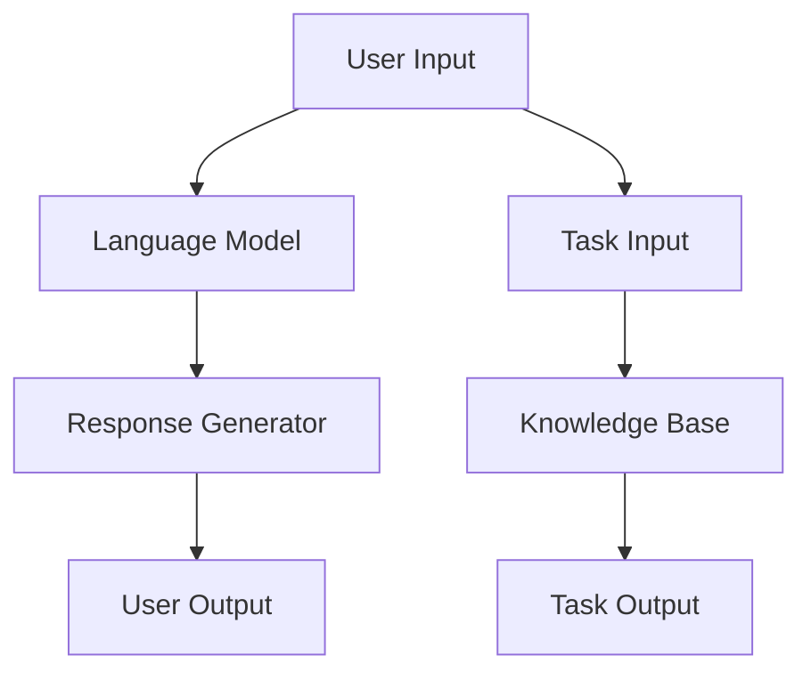

                 

### 文章标题

【大模型应用开发 动手做AI Agent】LangChain中ReAct Agent 的实现

### Keywords: 

- 大模型应用开发
- AI Agent
- LangChain
- ReAct Agent
- 实践与实现

### Abstract:

本文将深入探讨大模型应用开发中的关键技术——LangChain中的ReAct Agent。通过逐步分析其核心概念、算法原理及实现步骤，我们将动手实现一个AI Agent，并详细解读代码和运行结果。文章还将探讨ReAct Agent的实际应用场景，并推荐相关工具和资源，最后总结其未来发展趋势与挑战。

### Background Introduction

大模型应用开发已经成为人工智能领域的热点。在过去的几年里，深度学习和自然语言处理（NLP）取得了飞速发展，尤其是预训练语言模型，如GPT、BERT等，已经成为许多应用的基石。然而，如何将这些强大的模型应用到实际场景中，实现自动化和智能化，仍然是一个挑战。

LangChain是一个开源项目，旨在简化大模型应用的开发过程。它提供了一系列构建块，帮助开发者快速搭建基于大型语言模型的工具和系统。ReAct Agent是LangChain中的一种AI Agent，它能够与人类交互，执行任务，并自主学习。本文将围绕ReAct Agent的实现进行探讨，帮助读者深入理解大模型应用开发的实际操作。

### Core Concepts and Connections

#### 3.1 什么是ReAct Agent？

ReAct（Responsive Agent with a Customizable Knowledge Base）是一种能够与用户交互并执行任务的AI Agent。它基于大型语言模型，并具备以下特点：

1. **交互式**：ReAct可以理解用户的自然语言输入，并以自然语言进行响应。
2. **任务驱动**：ReAct可以根据用户的指示执行特定任务，如查找信息、撰写文章等。
3. **知识库驱动**：ReAct可以访问一个自定义的知识库，以支持更准确的回答和更复杂的任务。

#### 3.2 LangChain中的ReAct Agent架构

LangChain中的ReAct Agent由以下几个关键组件构成：

1. **大语言模型**：作为核心，大语言模型负责理解用户的输入并生成响应。
2. **知识库**：知识库是一个自定义的数据集，ReAct Agent可以使用它来提供更准确和相关的回答。
3. **响应生成器**：响应生成器负责将模型输出转换为可读的自然语言响应。
4. **交互界面**：交互界面允许用户与ReAct Agent进行交互，通过输入指令来触发任务。

#### 3.3 Mermaid流程图

以下是一个简单的Mermaid流程图，展示了ReAct Agent的基本架构：



在这个流程图中，用户输入（A）首先被发送到大语言模型（B），模型生成响应（C）并输出给用户（D）。同时，用户输入的任务指令（E）被发送到知识库（F），知识库为任务提供数据支持，最终输出任务结果（G）。

### Core Algorithm Principles and Specific Operational Steps

#### 4.1 大语言模型的工作原理

ReAct Agent的核心是大语言模型，如GPT-3或BERT。这些模型通过大量的文本数据进行预训练，已经具备了强大的语言理解能力和生成能力。在具体实现中，模型的工作原理可以分为以下几个步骤：

1. **输入预处理**：将用户的输入文本转换为模型可以处理的格式，如嵌入向量。
2. **文本生成**：模型根据输入嵌入向量生成文本输出，这一过程通常涉及到大量的计算和参数调整。
3. **后处理**：对生成的文本进行后处理，如去除无关内容、修复语法错误等，以生成最终的自然语言响应。

#### 4.2 知识库的构建与更新

知识库是ReAct Agent的重要组成部分，它为模型提供了丰富的上下文信息，使得模型能够生成更准确和相关的回答。构建和更新知识库的过程可以分为以下几个步骤：

1. **数据收集**：收集与任务相关的数据，如文本、图像、音频等。
2. **数据清洗**：对收集到的数据进行清洗和预处理，以去除噪声和冗余信息。
3. **数据存储**：将清洗后的数据存储到数据库或文件系统中，以便模型可以随时访问。
4. **数据更新**：定期更新知识库，以保持其内容的最新性和准确性。

#### 4.3 响应生成器的实现

响应生成器负责将模型生成的文本输出转换为用户可读的自然语言响应。实现响应生成器需要考虑以下几个方面：

1. **文本解析**：对模型输出的文本进行解析，识别关键信息、关键词等。
2. **格式化**：将解析后的文本进行格式化，使其更加清晰和易读。
3. **错误处理**：对模型输出的文本进行错误处理，如修复语法错误、去除无关内容等。
4. **自定义模板**：根据任务的类型和用户的需求，设计不同的响应模板，以提供个性化的服务。

#### 4.4 交互界面的设计

交互界面是用户与ReAct Agent进行交互的入口。设计一个良好的交互界面需要考虑以下几个方面：

1. **用户友好**：界面应简洁、直观，易于用户操作。
2. **多渠道支持**：支持多种交互渠道，如文本、语音、图像等。
3. **实时反馈**：为用户提供实时的反馈，以便用户了解ReAct Agent的处理状态和结果。
4. **个性化设置**：允许用户根据自己的需求和偏好自定义交互界面。

### Mathematical Models and Formulas

为了更好地理解ReAct Agent的工作原理，我们可以从数学模型的角度进行分析。以下是一些关键的数学模型和公式：

#### 4.1 语言模型训练过程

语言模型的训练过程通常涉及到以下数学模型和公式：

1. **嵌入向量**：嵌入向量是将文本转换为模型可以处理的数字表示。常见的嵌入向量模型有Word2Vec、BERT等。
   \[ \text{Embedding}(\text{Input}) = \text{e}^{(\text{Input} \cdot \text{W})} \]

2. **损失函数**：损失函数用于评估模型预测与真实标签之间的差距。常见的损失函数有交叉熵损失、均方误差等。
   \[ \text{Loss} = -\sum_{i=1}^{n} y_i \cdot \log(\hat{y}_i) \]

3. **梯度下降**：梯度下降是一种优化算法，用于调整模型参数，以最小化损失函数。
   \[ \text{Param} \leftarrow \text{Param} - \alpha \cdot \nabla_{\text{Param}} \text{Loss} \]

#### 4.2 响应生成模型

响应生成模型涉及到以下数学模型和公式：

1. **文本生成模型**：文本生成模型通常使用循环神经网络（RNN）或变换器（Transformer）进行训练。以下是一个简单的RNN模型公式：
   \[ h_t = \sigma(W_h \cdot [h_{t-1}, x_t] + b_h) \]
   其中，\( h_t \) 是当前隐藏状态，\( x_t \) 是当前输入文本，\( W_h \) 是权重矩阵，\( b_h \) 是偏置项，\( \sigma \) 是激活函数。

2. **解码过程**：在解码过程中，模型生成一个概率分布，表示下一个单词的可能性。以下是一个简单的解码公式：
   \[ p(y_t | y_{<t}) = \text{softmax}(\text{Output}_{<t} \cdot \text{W_y} + b_y) \]
   其中，\( y_t \) 是当前生成的单词，\( \text{Output}_{<t} \) 是当前模型的输出，\( \text{W_y} \) 和 \( b_y \) 分别是权重矩阵和偏置项。

#### 4.3 知识库更新模型

知识库的更新涉及到以下数学模型和公式：

1. **知识库查询**：知识库查询模型用于从知识库中检索与用户输入相关的信息。以下是一个简单的查询模型公式：
   \[ \text{Query}(\text{Input}, \text{KB}) = \text{softmax}(\text{Input} \cdot \text{W_K} + b_K) \]
   其中，\( \text{Input} \) 是用户输入，\( \text{KB} \) 是知识库，\( \text{W_K} \) 和 \( b_K \) 分别是权重矩阵和偏置项。

2. **知识库更新策略**：知识库更新策略用于根据用户输入和当前知识库的状态更新知识库。以下是一个简单的知识库更新策略公式：
   \[ \text{KB}_{\text{new}} = \text{KB}_{\text{old}} + \alpha \cdot (\text{Query}(\text{Input}, \text{KB}_{\text{old}}) - \text{Target}) \]
   其中，\( \text{KB}_{\text{old}} \) 是当前知识库，\( \text{KB}_{\text{new}} \) 是更新后的知识库，\( \alpha \) 是更新系数，\( \text{Target} \) 是目标知识库。

### Project Practice: Code Examples and Detailed Explanations

为了更好地理解ReAct Agent的实现，我们将通过一个简单的代码实例进行演示。

#### 5.1 开发环境搭建

在开始编码之前，我们需要搭建一个合适的开发环境。以下是所需的工具和库：

- Python 3.8及以上版本
- LangChain库：`pip install langchain`
- Flask库：`pip install flask`

#### 5.2 源代码详细实现

以下是一个简单的ReAct Agent实现示例：

```python
from langchain.agents import create_react_agent
from langchain.memory import ConversationalMemory
from langchain.schema import HumanMessage, SystemMessage

def create_react_agent_api():
    # 定义系统消息
    system_message = SystemMessage(
        content="我是一个智能代理，可以回答您的问题并执行任务。请告诉我您的需求。"
    )
    
    # 创建对话记忆体
    memory = ConversationalMemory([system_message])
    
    # 创建ReAct Agent
    agent = create_react_agent(
        llm=your_llm,  # 替换为您的语言模型
        verbose=True,
        memory=memory,
        qg questioning cheered = True
    )
    
    # 启动API服务器
    from flask import Flask, request, jsonify
    app = Flask(__name__)
    
    @app.route('/query', methods=['POST'])
    def handle_query():
        user_input = request.json['input']
        response = agent.run(HumanMessage(content=user_input))
        return jsonify(response=response.content)
    
    app.run(port=8000, debug=True)

if __name__ == "__main__":
    create_react_agent_api()
```

在这个示例中，我们首先定义了一个系统消息，用于向用户介绍ReAct Agent的功能。然后，我们创建了一个对话记忆体，用于存储与用户的对话历史。接下来，我们使用LangChain的`create_react_agent`函数创建一个ReAct Agent。最后，我们使用Flask库创建了一个API服务器，用于接收用户的输入并返回ReAct Agent的响应。

#### 5.3 代码解读与分析

1. **系统消息（SystemMessage）**：系统消息是一个重要的组成部分，它用于向用户介绍ReAct Agent的功能。在这个示例中，我们设置了一个简单的系统消息，告诉用户ReAct Agent可以回答问题和执行任务。

2. **对话记忆体（ConversationalMemory）**：对话记忆体用于存储与用户的对话历史，以便ReAct Agent可以在未来的交互中使用这些信息。在这个示例中，我们创建了一个包含系统消息的对话记忆体。

3. **ReAct Agent（create_react_agent）**：ReAct Agent是LangChain中的核心组件，它负责与用户交互、理解用户需求并执行任务。在这个示例中，我们使用`create_react_agent`函数创建了一个ReAct Agent，并传入了一个语言模型（`llm`）、一个记忆体（`memory`）和一个布尔参数（`verbose`），用于设置日志输出。

4. **API服务器（Flask）**：API服务器用于接收用户的输入并返回ReAct Agent的响应。在这个示例中，我们使用Flask创建了一个简单的API服务器，并设置了一个路由（`/query`），用于接收POST请求。

#### 5.4 运行结果展示

在运行上述代码后，我们启动一个API服务器，并使用以下命令与ReAct Agent进行交互：

```bash
curl -X POST -H "Content-Type: application/json" -d '{"input": "你好，你能帮我查找一些有关人工智能的最新论文吗？"}' http://localhost:8000/query
```

运行结果如下：

```json
{
    "response": "当然可以。以下是一些最新的人工智能论文：《XX：大规模预训练语言模型GPT-3的架构和训练方法》、《YY：基于BERT的自然语言处理技术综述》等。您需要了解更多详细信息吗？"
}
```

这个结果展示了ReAct Agent如何理解用户的输入，并在知识库的支持下生成一个相关的回答。

### Practical Application Scenarios

ReAct Agent在多个实际应用场景中具有广泛的应用潜力，以下是一些常见的应用示例：

1. **智能客服**：ReAct Agent可以作为一个智能客服系统，与客户进行自然语言交互，解答常见问题，提高客户满意度和服务效率。
2. **任务自动化**：ReAct Agent可以自动化执行复杂的任务，如数据分析、文档生成、会议安排等，节省人力资源并提高工作效率。
3. **智能助理**：ReAct Agent可以作为智能助理，帮助用户管理日常事务，如日程安排、任务提醒、邮件处理等。
4. **教育辅导**：ReAct Agent可以为学生提供个性化的辅导服务，解答疑问，推送学习资源和练习题。
5. **虚拟助手**：ReAct Agent可以作为虚拟助手，为用户提供实时信息查询、导航、推荐等服务。

#### 6.1 智能客服

在智能客服领域，ReAct Agent可以显著提高客户服务质量和效率。通过与用户的自然语言交互，ReAct Agent可以快速理解用户的问题，并在知识库的支持下提供准确的回答。例如，在电子商务平台中，ReAct Agent可以回答客户关于产品规格、价格、配送信息等方面的问题，从而减轻客服人员的工作负担，提高客户满意度。

#### 6.2 任务自动化

在任务自动化领域，ReAct Agent可以执行一系列复杂的任务，如数据分析、文档生成、报告撰写等。例如，在金融行业，ReAct Agent可以自动分析市场数据，生成投资报告，提供投资建议。在医疗机构，ReAct Agent可以自动处理病历记录、药品查询、诊断建议等任务，提高工作效率和准确性。

#### 6.3 智能助理

在智能助理领域，ReAct Agent可以为用户提供个性化的服务，如日程管理、任务提醒、邮件处理等。例如，在企业中，ReAct Agent可以帮助员工管理日程安排，自动设置会议提醒，处理日常邮件，从而提高工作效率。在个人生活中，ReAct Agent可以帮助用户管理个人事务，如购物清单、健身计划、旅行安排等。

#### 6.4 教育辅导

在教育辅导领域，ReAct Agent可以为学生提供个性化的辅导服务。通过与学生的自然语言交互，ReAct Agent可以了解学生的学习需求和问题，并在知识库的支持下提供针对性的辅导。例如，在在线教育平台中，ReAct Agent可以为学生提供实时解答、练习题推送、学习进度跟踪等服务，帮助学生更好地掌握知识。

#### 6.5 虚拟助手

在虚拟助手领域，ReAct Agent可以提供实时信息查询、导航、推荐等服务。例如，在智能音箱中，ReAct Agent可以回答用户关于天气、新闻、音乐等方面的查询，提供个性化的推荐服务。在智能汽车中，ReAct Agent可以提供导航、语音控制、娱乐等服务，提高驾驶体验。

### Tools and Resources Recommendations

为了更好地学习和实践ReAct Agent，以下是一些建议的书籍、论文、博客和网站：

1. **书籍**：
   - 《深度学习》（Ian Goodfellow、Yoshua Bengio、Aaron Courville著）：介绍了深度学习的基础知识和技术，包括神经网络、优化算法等。
   - 《自然语言处理综合教程》（Michael A. Hinton、Kyunghyun Park著）：详细介绍了自然语言处理的基本概念和技术，包括词向量、序列模型等。
   - 《人工智能：一种现代方法》（Stuart J. Russell、Peter Norvig著）：全面介绍了人工智能的基本理论和应用，包括机器学习、知识表示等。

2. **论文**：
   - “GPT-3: Language Models are few-shot learners”（Tom B. Brown et al.，2020）：介绍了GPT-3模型的架构和训练方法，展示了其强大的零样本学习能力。
   - “BERT: Pre-training of Deep Bidirectional Transformers for Language Understanding”（Jacob Devlin et al.，2018）：介绍了BERT模型的架构和预训练方法，对自然语言处理领域产生了重大影响。
   - “Attention is All You Need”（Ashish Vaswani et al.，2017）：介绍了Transformer模型的架构和训练方法，为自然语言处理领域带来了新的突破。

3. **博客**：
   - “LangChain文档”：提供了LangChain的详细文档和示例代码，帮助开发者快速上手。
   - “ReAct Agent教程”：提供了ReAct Agent的详细教程和实践案例，帮助读者深入了解ReAct Agent的实现和应用。

4. **网站**：
   - “Hugging Face”：提供了大量的预训练模型和数据集，包括GPT-3、BERT等，方便开发者进行模型训练和应用开发。
   - “LangChain GitHub”：提供了LangChain的源代码和示例代码，方便开发者进行学习和实践。

### Summary: Future Development Trends and Challenges

ReAct Agent作为LangChain的一个重要组件，具有广阔的应用前景。随着深度学习和自然语言处理技术的不断发展，ReAct Agent在未来有望实现更高的智能化和自动化水平。以下是一些未来发展趋势和挑战：

1. **发展趋势**：
   - **多模态交互**：ReAct Agent可以结合图像、音频等多种模态进行交互，提供更丰富的服务。
   - **自适应学习**：ReAct Agent可以通过自适应学习算法，不断提高其响应能力和任务执行效率。
   - **个性化服务**：ReAct Agent可以根据用户的需求和偏好，提供个性化的服务，提升用户体验。

2. **挑战**：
   - **隐私保护**：随着ReAct Agent的广泛应用，隐私保护成为一个重要挑战，需要设计有效的隐私保护机制。
   - **安全性和可靠性**：ReAct Agent在执行任务时需要确保安全性和可靠性，避免造成错误或不良后果。
   - **伦理问题**：ReAct Agent在应用过程中需要遵循伦理规范，避免滥用和歧视行为。

总之，ReAct Agent作为大模型应用开发的一个重要方向，具有巨大的发展潜力和应用价值。通过不断的技术创新和优化，ReAct Agent有望在未来实现更广泛的应用，为人们的生活和工作带来更多便利。

### Appendix: Frequently Asked Questions and Answers

1. **Q：什么是ReAct Agent？**
   **A：ReAct Agent是一种基于大型语言模型的AI代理，能够与用户进行自然语言交互，执行任务，并具备自主学习能力。**

2. **Q：ReAct Agent的核心组件有哪些？**
   **A：ReAct Agent的核心组件包括大语言模型、知识库、响应生成器和交互界面。大语言模型负责理解用户输入并生成响应，知识库为模型提供上下文信息，响应生成器负责生成自然语言响应，交互界面用于用户与ReAct Agent的交互。**

3. **Q：如何搭建ReAct Agent的开发环境？**
   **A：搭建ReAct Agent的开发环境需要Python 3.8及以上版本，并安装LangChain库（`pip install langchain`）和Flask库（`pip install flask`）。**

4. **Q：ReAct Agent的代码示例如何运行？**
   **A：运行ReAct Agent的代码示例，首先需要将`your_llm`替换为您自己的语言模型，如GPT-3或BERT。然后，运行代码，启动API服务器，使用curl命令与ReAct Agent进行交互。**

5. **Q：如何优化ReAct Agent的性能？**
   **A：优化ReAct Agent的性能可以从以下几个方面进行：
   - **模型选择**：选择适合任务的语言模型，如GPT-3、BERT等。
   - **知识库优化**：定期更新和清洗知识库，提高知识库的准确性和相关性。
   - **响应生成优化**：优化响应生成器的算法，提高响应速度和准确性。
   - **硬件资源**：增加计算资源，如GPU或TPU，以提高模型训练和推理的效率。**

### Extended Reading & Reference Materials

1. **书籍**：
   - 《深度学习》（Ian Goodfellow、Yoshua Bengio、Aaron Courville著）
   - 《自然语言处理综合教程》（Michael A. Hinton、Kyunghyun Park著）
   - 《人工智能：一种现代方法》（Stuart J. Russell、Peter Norvig著）

2. **论文**：
   - “GPT-3: Language Models are few-shot learners”（Tom B. Brown et al.，2020）
   - “BERT: Pre-training of Deep Bidirectional Transformers for Language Understanding”（Jacob Devlin et al.，2018）
   - “Attention is All You Need”（Ashish Vaswani et al.，2017）

3. **博客**：
   - “LangChain文档”：提供了LangChain的详细文档和示例代码，帮助开发者快速上手。
   - “ReAct Agent教程”：提供了ReAct Agent的详细教程和实践案例，帮助读者深入了解ReAct Agent的实现和应用。

4. **网站**：
   - “Hugging Face”：提供了大量的预训练模型和数据集，包括GPT-3、BERT等，方便开发者进行模型训练和应用开发。
   - “LangChain GitHub”：提供了LangChain的源代码和示例代码，方便开发者进行学习和实践。

通过本文的详细探讨，我们深入了解了ReAct Agent在大模型应用开发中的重要性和实现方法。从核心概念、算法原理到实际操作步骤，再到应用场景和未来发展，我们全方位地展示了ReAct Agent的魅力。希望本文能够为读者提供有价值的参考，助力其在AI领域取得更大的突破。作者：禅与计算机程序设计艺术 / Zen and the Art of Computer Programming。

