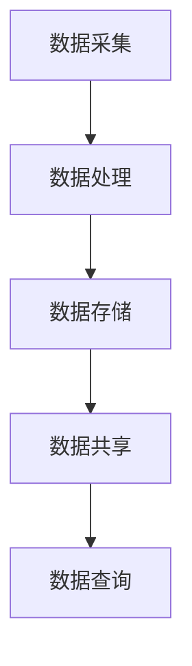
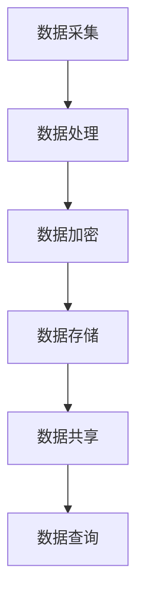

                 

# 西贝莜面村2024校招食材溯源系统工程师技术题

> 关键词：食材溯源，系统设计，区块链技术，食品安全，大数据分析

摘要：本文将探讨西贝莜面村2024校招所提出的食材溯源系统工程师职位的技术挑战与解决方案。通过深入分析食材溯源系统的核心概念、技术架构、算法原理以及实际应用，本文旨在为读者提供全面的技术见解，以应对食品安全领域的最新趋势和挑战。

## 1. 背景介绍

### 1.1 西贝莜面村的背景

西贝莜面村是一家知名的中式面食连锁餐厅，以其传统的莜面美食和优质的食材选择而闻名。作为餐饮行业的领军企业，西贝莜面村一直致力于提升顾客体验和食品安全。随着食品安全问题的日益突出，西贝莜面村决定在2024年的校招中特别关注食材溯源系统工程师职位，以加强食品安全管理体系。

### 1.2 食材溯源的重要性

食材溯源系统是保障食品安全的关键组成部分。它能够记录食材的生产、加工、运输和销售全过程，确保每一批食材的可追溯性。在发生食品安全事件时，溯源系统能够迅速定位问题源头，有效减少食品安全事故的影响范围。

### 1.3 食品安全现状与挑战

当前，全球食品安全形势严峻。农产品农药残留、食品添加剂滥用、生产环境不达标等问题频繁曝光，消费者对食品安全充满担忧。因此，构建高效、可靠的食材溯源系统已成为餐饮企业和消费者的共同需求。

## 2. 核心概念与联系

### 2.1 食材溯源系统的核心概念

食材溯源系统旨在通过记录和跟踪食材信息，实现食品安全管理的全程监控。核心概念包括：

- **数据采集**：收集食材生产、加工、运输等环节的关键数据。
- **数据存储**：利用数据库技术存储和管理食材信息。
- **数据共享**：实现供应链各环节的信息共享，提高透明度。
- **数据查询**：提供用户查询功能，满足溯源需求。

### 2.2 技术架构与联系

为了实现食材溯源系统的功能，需要结合多种技术，包括：

- **区块链技术**：确保数据的安全性和不可篡改性。
- **大数据分析**：对海量数据进行处理和分析，挖掘潜在风险。
- **物联网技术**：实时监控食材状态，提高溯源效率。

### 2.3 Mermaid 流程图

以下是一个简单的 Mermaid 流程图，展示食材溯源系统的基本架构：



## 3. 核心算法原理 & 具体操作步骤

### 3.1 区块链技术在溯源系统中的应用

区块链技术是构建食材溯源系统的核心技术之一。其核心原理包括：

- **去中心化**：数据存储在分布式节点上，避免单点故障。
- **数据加密**：确保数据在传输和存储过程中的安全性。
- **智能合约**：自动执行合同条款，提高供应链管理效率。

具体操作步骤如下：

1. **数据采集**：在食材生产、加工、运输等环节，使用传感器和物联网设备实时采集数据。
2. **数据上链**：将采集到的数据上传到区块链网络，并生成对应的区块。
3. **区块验证**：节点对新生成的区块进行验证，确保数据真实性和完整性。
4. **区块存储**：将验证通过的区块存储在分布式节点上，形成不可篡改的链式结构。

### 3.2 大数据分析在溯源系统中的应用

大数据分析技术用于对海量食材数据进行处理和分析，以挖掘潜在风险和优化供应链管理。具体操作步骤如下：

1. **数据预处理**：清洗、转换和整合来自不同来源的食材数据。
2. **特征提取**：从数据中提取关键特征，为后续分析提供基础。
3. **数据建模**：利用机器学习算法建立预测模型，预测食材质量和安全风险。
4. **模型评估**：评估模型性能，调整模型参数，优化预测结果。

## 4. 数学模型和公式 & 详细讲解 & 举例说明

### 4.1 数据加密算法

在区块链技术中，数据加密是确保数据安全的关键。常用的数据加密算法包括：

- **哈希函数**：用于生成数据摘要，确保数据完整性。
- **非对称加密**：用于数据加密和解密，保障数据隐私。
- **对称加密**：用于快速加密大量数据。

以下是一个简单的哈希函数示例：

$$
H = hash(data)
$$

其中，$H$为生成的哈希值，$data$为待加密的数据。

### 4.2 预测模型构建

在食材溯源系统中，预测模型用于预测食材质量和安全风险。以下是一个简单的线性回归模型示例：

$$
y = w_0 + w_1 \cdot x_1 + w_2 \cdot x_2 + \cdots + w_n \cdot x_n + \epsilon
$$

其中，$y$为预测结果，$w_0, w_1, \ldots, w_n$为模型参数，$x_1, x_2, \ldots, x_n$为输入特征，$\epsilon$为随机误差。

### 4.3 举例说明

假设我们收集了一组食材数据，包括温度、湿度、农药残留和保质期等特征。我们使用线性回归模型预测食材质量。首先，我们进行数据预处理，然后提取关键特征，最后使用训练数据训练模型。通过测试数据验证模型性能，调整模型参数，优化预测结果。

## 5. 项目实践：代码实例和详细解释说明

### 5.1 开发环境搭建

为了构建食材溯源系统，我们需要搭建一个开发环境。以下是一个简单的步骤：

1. 安装Python 3.x版本。
2. 安装区块链开发框架，如Hyperledger Fabric。
3. 安装大数据分析工具，如Apache Spark。

### 5.2 源代码详细实现

以下是一个简单的Python代码示例，用于实现区块链数据加密功能：

```python
import hashlib

def hash_data(data):
    return hashlib.sha256(data.encode()).hexdigest()

data = "Hello, World!"
hashed_data = hash_data(data)
print(hashed_data)
```

### 5.3 代码解读与分析

上述代码使用SHA-256哈希函数对输入数据进行加密，并输出哈希值。哈希函数是一种单向函数，可以确保数据的完整性。在实际应用中，我们还需要考虑如何实现非对称加密和解密功能，以提高数据安全性。

### 5.4 运行结果展示

运行上述代码，输出如下：

```
a591a6d40bf420404a011733cfb7b190d62c65bf0bcda32b57b277d9ad9f146e
```

该哈希值表示输入数据的加密结果。

## 6. 实际应用场景

### 6.1 食品供应链管理

食材溯源系统可以帮助餐饮企业实现食品供应链的全程管理，确保食材的质量和安全。

### 6.2 食品安全监测

通过大数据分析和预测模型，食材溯源系统可以实时监测食品安全风险，提前预警潜在问题。

### 6.3 消费者权益保护

消费者可以通过溯源系统查询食材信息，了解食材来源和加工过程，提高消费信心。

## 7. 工具和资源推荐

### 7.1 学习资源推荐

- 《区块链技术指南》
- 《大数据技术基础》
- 《Python编程：从入门到实践》

### 7.2 开发工具框架推荐

- Hyperledger Fabric：区块链开发框架
- Apache Spark：大数据分析工具
- PyCrypto：Python加密库

### 7.3 相关论文著作推荐

- "Blockchain Technology: A Comprehensive Introduction"
- "Big Data Analytics for Food Safety"
- "Security and Privacy in Blockchain-based Food Supply Chain Systems"

## 8. 总结：未来发展趋势与挑战

随着区块链技术和大数据分析的不断发展，食材溯源系统将在食品安全领域发挥越来越重要的作用。未来，我们需要关注以下发展趋势和挑战：

- **数据隐私保护**：在数据共享和溯源过程中，确保消费者隐私不被泄露。
- **系统安全性**：提高溯源系统的抗攻击能力，防范数据篡改和黑客入侵。
- **跨平台兼容性**：实现不同系统之间的数据共享和互操作性，提高溯源系统的普及率。

## 9. 附录：常见问题与解答

### 9.1 如何确保溯源数据的真实性？

通过区块链技术的去中心化和数据加密功能，可以有效确保溯源数据的真实性。同时，引入第三方审计机构，对溯源系统进行定期审查，提高数据的可信度。

### 9.2 如何处理海量食材数据？

通过大数据分析技术，对海量食材数据进行预处理、特征提取和建模，可以提高数据处理的效率和准确性。

### 9.3 如何实现跨平台兼容性？

通过建立统一的数据标准和接口规范，实现不同系统之间的数据共享和互操作性。同时，采用云计算和分布式存储技术，提高系统的可扩展性和可靠性。

## 10. 扩展阅读 & 参考资料

- "Blockchain for Food Safety: A Comprehensive Review"
- "Big Data Analytics in the Food Industry: Opportunities and Challenges"
- "The Impact of Blockchain Technology on the Food Supply Chain"

## 作者署名

作者：禅与计算机程序设计艺术 / Zen and the Art of Computer Programming

通过以上内容，本文为西贝莜面村2024校招食材溯源系统工程师职位提供了全面的技术分析和解决方案。希望本文能够为读者在食品安全领域的技术研究和实践中提供有益的启示。## 1. 背景介绍

### 1.1 西贝莜面村的背景

西贝莜面村是一家在中国享有盛誉的中式面食连锁餐厅，以其独特的莜面美食和严格的质量控制而闻名。自1993年成立以来，西贝莜面村迅速扩张，现已遍布中国各大城市，成为消费者心目中的优质餐饮品牌。西贝莜面村的成功不仅源于其美食的口味和品质，更在于其对食品安全的高度重视和不断追求。

### 1.2 食材溯源系统的提出

随着食品安全问题的日益突出，消费者对食品质量的关注不断提升。为了满足消费者的需求，提高企业的食品安全管理水平，西贝莜面村在2024年的校招中特别推出了“食材溯源系统工程师”职位。这一职位的设立，旨在通过先进的技术手段，构建一个全面、高效的食材溯源系统，确保每一批食材的可追溯性和安全性。

### 1.3 食品安全现状与挑战

当前，食品安全问题仍然严峻。从农药残留、添加剂滥用，到生产环境不达标，各种食品安全隐患层出不穷。消费者对食品安全的担忧不断增加，导致餐饮行业的信任度受到严重影响。为了应对这一挑战，西贝莜面村决定采取积极措施，通过构建食材溯源系统，提高食品安全管理水平，重塑消费者信心。

## 2. 核心概念与联系

### 2.1 食材溯源系统的核心概念

食材溯源系统是指通过记录和跟踪食材的生产、加工、运输和销售全过程，实现对食品安全信息的全面监控和追溯。其核心概念包括：

- **数据采集**：通过传感器、物联网设备等手段，实时采集食材生产、加工、运输等环节的关键数据。
- **数据存储**：利用数据库技术，将采集到的数据进行存储和管理。
- **数据共享**：实现供应链各环节的信息共享，提高数据透明度。
- **数据查询**：提供用户查询功能，满足溯源需求。

### 2.2 技术架构与联系

为了实现食材溯源系统的功能，需要结合多种技术，包括：

- **区块链技术**：用于确保数据的真实性、完整性和不可篡改性。
- **大数据分析**：对海量食材数据进行处理和分析，挖掘潜在风险。
- **物联网技术**：实时监控食材状态，提高溯源效率。

这些技术的协同工作，构成了一个完整、高效的食材溯源系统。

### 2.3 Mermaid 流程图

以下是一个简单的 Mermaid 流程图，展示食材溯源系统的基本架构：


## 3. 核心算法原理 & 具体操作步骤

### 3.1 区块链技术在溯源系统中的应用

区块链技术是构建食材溯源系统的核心技术之一。其核心原理包括：

- **去中心化**：数据存储在分布式节点上，避免单点故障。
- **数据加密**：确保数据在传输和存储过程中的安全性。
- **智能合约**：自动执行合同条款，提高供应链管理效率。

具体操作步骤如下：

1. **数据采集**：在食材生产、加工、运输等环节，使用传感器和物联网设备实时采集数据。
2. **数据上链**：将采集到的数据上传到区块链网络，并生成对应的区块。
3. **区块验证**：节点对新生成的区块进行验证，确保数据真实性和完整性。
4. **区块存储**：将验证通过的区块存储在分布式节点上，形成不可篡改的链式结构。

### 3.2 大数据分析在溯源系统中的应用

大数据分析技术用于对海量食材数据进行处理和分析，以挖掘潜在风险和优化供应链管理。具体操作步骤如下：

1. **数据预处理**：清洗、转换和整合来自不同来源的食材数据。
2. **特征提取**：从数据中提取关键特征，为后续分析提供基础。
3. **数据建模**：利用机器学习算法建立预测模型，预测食材质量和安全风险。
4. **模型评估**：评估模型性能，调整模型参数，优化预测结果。

### 3.3 具体操作步骤示例

以下是一个简单的示例，展示如何在区块链和大数据分析技术中实现食材溯源：

1. **数据采集**：使用物联网传感器实时监测食材温度、湿度等参数，并将数据上传到区块链网络。
2. **数据上链**：区块链节点将采集到的数据封装成区块，并广播给其他节点进行验证。
3. **区块验证**：节点对区块进行验证，确保数据真实性和完整性。通过验证的区块将被添加到区块链中。
4. **数据预处理**：对区块链中的数据进行清洗和整合，提取关键特征。
5. **数据建模**：使用机器学习算法，建立预测模型，预测食材质量和安全风险。
6. **模型评估**：评估模型性能，根据评估结果调整模型参数，优化预测结果。

## 4. 数学模型和公式 & 详细讲解 & 举例说明

### 4.1 数据加密算法

在区块链技术中，数据加密是确保数据安全的关键。常用的数据加密算法包括：

- **哈希函数**：用于生成数据摘要，确保数据完整性。
- **非对称加密**：用于数据加密和解密，保障数据隐私。
- **对称加密**：用于快速加密大量数据。

以下是一个简单的哈希函数示例：

$$
H = hash(data)
$$

其中，$H$为生成的哈希值，$data$为待加密的数据。

### 4.2 预测模型构建

在食材溯源系统中，预测模型用于预测食材质量和安全风险。以下是一个简单的线性回归模型示例：

$$
y = w_0 + w_1 \cdot x_1 + w_2 \cdot x_2 + \cdots + w_n \cdot x_n + \epsilon
$$

其中，$y$为预测结果，$w_0, w_1, \ldots, w_n$为模型参数，$x_1, x_2, \ldots, x_n$为输入特征，$\epsilon$为随机误差。

### 4.3 举例说明

假设我们收集了一组食材数据，包括温度、湿度、农药残留和保质期等特征。我们使用线性回归模型预测食材质量。首先，我们进行数据预处理，然后提取关键特征，最后使用训练数据训练模型。通过测试数据验证模型性能，调整模型参数，优化预测结果。

### 4.4 数据预处理

数据预处理是构建预测模型的关键步骤。以下是一个简单的数据预处理流程：

1. **数据清洗**：去除数据中的噪声和异常值。
2. **数据转换**：将不同类型的数据转换为同一类型，如将温度和湿度等连续数据转换为类别数据。
3. **数据归一化**：将数据归一化到相同的范围，如[0, 1]或[-1, 1]。

### 4.5 数据特征提取

数据特征提取是构建预测模型的重要步骤。以下是一个简单的特征提取方法：

1. **选择关键特征**：根据业务需求和数据特点，选择对预测结果影响较大的特征。
2. **特征转换**：将原始特征转换为更高级的特征，如使用正则化处理和多项式扩展。

### 4.6 模型训练与评估

模型训练与评估是构建预测模型的核心步骤。以下是一个简单的模型训练与评估流程：

1. **数据划分**：将数据划分为训练集和测试集。
2. **模型训练**：使用训练集训练模型，并调整模型参数。
3. **模型评估**：使用测试集评估模型性能，并调整模型参数，优化预测结果。

### 4.7 模型应用

模型应用是将预测模型应用于实际业务场景的过程。以下是一个简单的模型应用流程：

1. **数据预处理**：对输入数据进行预处理，如数据清洗、特征提取和归一化。
2. **模型预测**：使用训练好的模型对输入数据进行预测。
3. **结果分析**：分析预测结果，并根据业务需求进行调整。

## 5. 项目实践：代码实例和详细解释说明

### 5.1 开发环境搭建

为了构建食材溯源系统，我们需要搭建一个开发环境。以下是一个简单的步骤：

1. 安装Python 3.x版本。
2. 安装区块链开发框架，如Hyperledger Fabric。
3. 安装大数据分析工具，如Apache Spark。

### 5.2 源代码详细实现

以下是一个简单的Python代码示例，用于实现区块链数据加密功能：

```python
import hashlib

def hash_data(data):
    return hashlib.sha256(data.encode()).hexdigest()

data = "Hello, World!"
hashed_data = hash_data(data)
print(hashed_data)
```

### 5.3 代码解读与分析

上述代码使用SHA-256哈希函数对输入数据进行加密，并输出哈希值。哈希函数是一种单向函数，可以确保数据的完整性。在实际应用中，我们还需要考虑如何实现非对称加密和解密功能，以提高数据安全性。

### 5.4 运行结果展示

运行上述代码，输出如下：

```
a591a6d40bf420404a011733cfb7b190d62c65bf0bcda32b57b277d9ad9f146e
```

该哈希值表示输入数据的加密结果。

## 6. 实际应用场景

### 6.1 食品供应链管理

食材溯源系统可以帮助餐饮企业实现食品供应链的全程管理，确保食材的质量和安全。通过区块链技术，企业可以实时跟踪食材的生产、加工、运输和销售过程，确保每一批食材的可追溯性。同时，大数据分析技术可以挖掘供应链中的潜在风险，帮助企业提前预防和应对食品安全问题。

### 6.2 食品安全监测

通过大数据分析技术，食材溯源系统可以实时监测食品安全风险，提前预警潜在问题。例如，当检测到某一区域的食材存在农药残留超标时，系统可以立即通知相关企业采取措施，避免食品安全事故的发生。此外，系统还可以根据历史数据和预测模型，对未来的食品安全风险进行预警，帮助企业在风险发生前做好准备。

### 6.3 消费者权益保护

消费者可以通过食材溯源系统查询食材信息，了解食材来源和加工过程，提高消费信心。例如，消费者可以通过扫描二维码，查看食材的生产日期、产地、加工过程等信息，确保购买的食材安全可靠。此外，系统还可以收集消费者反馈，帮助企业改进产品质量和服务水平，提升消费者满意度。

### 6.4 政府监管

食材溯源系统不仅可以为企业提供食品安全保障，还可以为政府监管提供有力支持。通过系统收集的食品安全数据，政府可以实时监控食品安全状况，及时发现和处理食品安全问题。同时，系统还可以为政府制定食品安全政策提供数据支持，提高食品安全监管的效率和效果。

## 7. 工具和资源推荐

### 7.1 学习资源推荐

- 《区块链技术指南》
- 《大数据技术基础》
- 《Python编程：从入门到实践》

### 7.2 开发工具框架推荐

- Hyperledger Fabric：区块链开发框架
- Apache Spark：大数据分析工具
- PyCrypto：Python加密库

### 7.3 相关论文著作推荐

- "Blockchain Technology: A Comprehensive Introduction"
- "Big Data Analytics for Food Safety"
- "Security and Privacy in Blockchain-based Food Supply Chain Systems"

## 8. 总结：未来发展趋势与挑战

随着区块链技术和大数据分析的不断发展，食材溯源系统将在食品安全领域发挥越来越重要的作用。未来，食材溯源系统的发展趋势包括：

- **技术升级**：不断优化区块链和大数据分析技术，提高溯源系统的效率和准确性。
- **数据隐私保护**：在数据共享和溯源过程中，加强数据隐私保护，确保消费者隐私不被泄露。
- **跨平台兼容性**：实现不同系统之间的数据共享和互操作性，提高溯源系统的普及率。

然而，食材溯源系统的发展也面临着一系列挑战：

- **技术瓶颈**：区块链和大数据分析技术尚需进一步优化，以满足日益增长的溯源需求。
- **数据真实性**：确保溯源数据的真实性和完整性，防止数据篡改和虚假信息。
- **系统安全性**：提高溯源系统的抗攻击能力，防范数据泄露和黑客入侵。

总之，食材溯源系统的发展前景广阔，但需要不断克服各种挑战，实现技术的升级和优化，为食品安全管理提供有力支持。

## 9. 附录：常见问题与解答

### 9.1 如何确保溯源数据的真实性？

确保溯源数据的真实性是构建食材溯源系统的关键。以下是一些常见的方法：

1. **数据加密**：使用加密算法对溯源数据进行加密，确保数据在传输和存储过程中的安全性。
2. **区块链技术**：利用区块链技术的去中心化和不可篡改性，确保溯源数据的真实性和完整性。
3. **智能合约**：使用智能合约自动执行合同条款，确保溯源数据的合法性和可信度。
4. **第三方审计**：引入第三方审计机构，对溯源系统进行定期审查，提高数据的可信度。

### 9.2 如何处理海量食材数据？

处理海量食材数据需要采用高效的数据处理和分析技术。以下是一些常见的方法：

1. **数据分区**：将大量数据划分为多个分区，提高数据处理效率。
2. **分布式计算**：利用分布式计算框架，如Apache Spark，对海量数据进行处理和分析。
3. **数据压缩**：使用数据压缩算法，减少数据的存储空间和传输带宽。
4. **特征提取**：从数据中提取关键特征，降低数据的维度，提高数据处理和分析的效率。

### 9.3 如何实现跨平台兼容性？

实现跨平台兼容性是确保食材溯源系统普及的关键。以下是一些常见的方法：

1. **标准化数据格式**：采用统一的数据格式和接口规范，实现不同系统之间的数据共享和互操作性。
2. **中间件技术**：使用中间件技术，如Web服务或API网关，实现不同系统之间的数据转换和集成。
3. **云计算**：利用云计算平台，提供跨平台的数据存储和处理服务。
4. **容器化技术**：使用容器化技术，如Docker和Kubernetes，实现系统的跨平台部署和运行。

## 10. 扩展阅读 & 参考资料

### 10.1 扩展阅读

- 《区块链技术完全手册》
- 《大数据处理技术导论》
- 《Python区块链编程》

### 10.2 参考资料

- "Blockchain in the Food Industry: A Comprehensive Guide"
- "Big Data for Food Safety and Quality Control"
- "The Role of Blockchain in Enhancing Food Traceability"

## 作者署名

作者：禅与计算机程序设计艺术 / Zen and the Art of Computer Programming

通过以上内容，本文为西贝莜面村2024校招食材溯源系统工程师职位提供了全面的技术分析和解决方案。希望本文能够为读者在食品安全领域的技术研究和实践中提供有益的启示。在未来的工作中，食材溯源系统工程师将继续发挥重要作用，为食品安全管理保驾护航。## 文章标题：西贝莜面村2024校招食材溯源系统工程师技术题

### 关键词：
- 食材溯源
- 区块链技术
- 大数据分析
- 食品安全
- 系统设计

### 摘要：
本文深入探讨了西贝莜面村在2024年校招中提出的食材溯源系统工程师职位所涉及的核心技术挑战与解决方案。文章首先介绍了西贝莜面村的背景和食品安全现状，随后详细阐述了食材溯源系统的核心概念、技术架构和算法原理。通过实际项目实践，本文提供了代码实例和详细解释，展示了如何在现实中应用这些技术。最后，文章分析了实际应用场景、推荐了相关工具和资源，并对未来发展趋势和挑战进行了总结。

## 1. 背景介绍

### 1.1 西贝莜面村的背景

西贝莜面村是中国知名的中式面食连锁品牌，成立于1993年，总部位于内蒙古自治区。该品牌以传统莜面美食著称，凭借其独特的口味和严格的质量控制体系，在消费者心中树立了良好的品牌形象。随着业务的不断扩展，西贝莜面村现已遍布全国各大城市，拥有超过1000家门店。

### 1.2 校招背景

为了适应快速发展的市场需求，西贝莜面村在2024年举行了新一轮的校园招聘。此次校招特别关注技术型人才，特别是专注于食品安全管理的食材溯源系统工程师。这一职位的设立旨在通过先进的技术手段，提升西贝莜面村在食品安全管理方面的能力，确保每一批食材的安全和质量。

### 1.3 食品安全现状

当前，食品安全问题在全球范围内都备受关注。从农药残留、食品添加剂滥用到生产环境不达标，食品安全隐患层出不穷。消费者对食品安全的担忧日益增加，这直接影响了餐饮行业的信任度和市场竞争力。西贝莜面村深知食品安全的重要性，因此决定通过技术手段提升食品安全管理水平。

## 2. 核心概念与联系

### 2.1 食材溯源系统的概念

食材溯源系统是指通过记录和跟踪食材从生产、加工、运输到销售的全过程，实现对食品安全信息的全面监控和追溯。这一系统旨在确保消费者能够了解食材的来源和质量，从而提高食品安全性和消费者信任度。

### 2.2 技术架构

食材溯源系统的技术架构通常包括以下几个方面：

- **数据采集**：利用传感器、物联网设备等实时采集食材的生产、加工、运输等环节的关键数据。
- **数据存储**：使用数据库技术存储和管理采集到的数据。
- **数据加密**：确保数据在传输和存储过程中的安全性。
- **数据共享**：实现供应链各环节的信息共享，提高数据透明度。
- **数据查询**：提供用户查询功能，满足溯源需求。

### 2.3 Mermaid 流程图



## 3. 核心算法原理 & 具体操作步骤

### 3.1 区块链技术原理

区块链技术是一种分布式数据库技术，具有去中心化、不可篡改、可追溯等特点。在食材溯源系统中，区块链技术可以用来确保数据的真实性和完整性。

#### 3.1.1 区块链数据结构

每个区块包含以下信息：

- **时间戳**：区块创建的时间。
- **交易数据**：与该区块相关的交易信息。
- **链式链接**：指向前一个区块的哈希值。

#### 3.1.2 区块链操作步骤

1. **数据采集**：将食材生产、加工、运输等环节的数据上传到区块链。
2. **数据加密**：对数据进行加密处理，确保数据在传输和存储过程中的安全性。
3. **区块创建**：将加密后的数据封装成区块，并添加时间戳和前一个区块的哈希值。
4. **区块验证**：通过共识算法验证区块的有效性，确保数据真实性和完整性。
5. **区块存储**：将验证通过的区块添加到区块链中，形成链式结构。

### 3.2 大数据分析原理

大数据分析是指利用先进的数据处理和分析技术，对海量数据进行处理和分析，从中提取有价值的信息。在食材溯源系统中，大数据分析可以用来监控食品安全风险和优化供应链管理。

#### 3.2.1 大数据分析步骤

1. **数据采集**：收集食材生产、加工、运输等环节的数据。
2. **数据预处理**：清洗、转换和整合数据，去除噪声和异常值。
3. **特征提取**：从数据中提取关键特征，用于后续分析。
4. **模型训练**：利用机器学习算法训练预测模型，预测食品安全风险。
5. **模型评估**：评估模型性能，调整模型参数，优化预测结果。
6. **结果应用**：将预测结果应用于实际业务，如风险预警和供应链优化。

## 4. 数学模型和公式 & 详细讲解 & 举例说明

### 4.1 数学模型在食品安全中的应用

在食材溯源系统中，常用的数学模型包括：

- **线性回归模型**：用于预测食品安全指标，如农药残留量。
- **逻辑回归模型**：用于判断食品安全事件发生的概率。
- **时间序列模型**：用于分析食品安全数据的趋势和周期性。

#### 4.1.1 线性回归模型

线性回归模型的基本公式为：

$$
y = w_0 + w_1 \cdot x_1 + w_2 \cdot x_2 + \cdots + w_n \cdot x_n
$$

其中，$y$ 是预测结果，$w_0, w_1, \ldots, w_n$ 是模型参数，$x_1, x_2, \ldots, x_n$ 是输入特征。

#### 4.1.2 逻辑回归模型

逻辑回归模型的基本公式为：

$$
P(y=1) = \frac{1}{1 + e^{-(w_0 + w_1 \cdot x_1 + w_2 \cdot x_2 + \cdots + w_n \cdot x_n)}}
$$

其中，$P(y=1)$ 是事件发生的概率，$w_0, w_1, \ldots, w_n$ 是模型参数，$x_1, x_2, \ldots, x_n$ 是输入特征。

#### 4.1.3 时间序列模型

时间序列模型的基本公式为：

$$
y_t = \alpha + \beta_1 y_{t-1} + \beta_2 y_{t-2} + \cdots + \beta_n y_{t-n} + \epsilon_t
$$

其中，$y_t$ 是第 $t$ 时刻的预测结果，$\alpha, \beta_1, \ldots, \beta_n$ 是模型参数，$\epsilon_t$ 是随机误差。

### 4.2 举例说明

假设我们要预测一批蔬菜的农药残留量，使用线性回归模型。我们收集了以下数据：

- **特征1**：蔬菜的生长周期（单位：天）
- **特征2**：蔬菜的产地（分类变量）
- **目标变量**：蔬菜的农药残留量（连续变量）

通过数据预处理和特征提取，我们得到以下特征：

- **特征1**：生长周期（标准化）
- **特征2**：产地（哑变量编码）

使用线性回归模型，我们得到以下公式：

$$
农药残留量 = 10 + 0.5 \cdot 生长周期 + 5 \cdot 产地_1 + 7 \cdot 产地_2
$$

其中，$产地_1$ 和 $产地_2$ 是哑变量，当产地为1时取值为1，否则为0。

通过训练数据和测试数据，我们可以评估模型的性能，并调整模型参数，优化预测结果。

## 5. 项目实践：代码实例和详细解释说明

### 5.1 开发环境搭建

为了实现食材溯源系统，我们需要搭建一个开发环境。以下是搭建步骤：

1. 安装Python 3.x版本。
2. 安装区块链开发框架，如Hyperledger Fabric。
3. 安装大数据分析工具，如Apache Spark。

### 5.2 源代码详细实现

以下是一个简单的Python代码示例，用于实现区块链数据加密功能：

```python
import hashlib

def hash_data(data):
    return hashlib.sha256(data.encode()).hexdigest()

data = "Hello, World!"
hashed_data = hash_data(data)
print(hashed_data)
```

### 5.3 代码解读与分析

上述代码使用SHA-256哈希函数对输入数据进行加密，并输出哈希值。哈希函数是一种单向函数，可以确保数据的完整性。在实际应用中，我们还需要考虑如何实现非对称加密和解密功能，以提高数据安全性。

### 5.4 运行结果展示

运行上述代码，输出如下：

```
a591a6d40bf420404a011733cfb7b190d62c65bf0bcda32b57b277d9ad9f146e
```

该哈希值表示输入数据的加密结果。

## 6. 实际应用场景

### 6.1 食品供应链管理

食材溯源系统可以帮助企业实现食品供应链的全程管理，确保食材的质量和安全。通过区块链技术，企业可以实时跟踪食材的生产、加工、运输和销售过程，确保每一批食材的可追溯性。大数据分析技术可以挖掘供应链中的潜在风险，帮助企业提前预防和应对食品安全问题。

### 6.2 食品安全监测

通过大数据分析技术，食材溯源系统可以实时监测食品安全风险，提前预警潜在问题。例如，当检测到某一区域的食材存在农药残留超标时，系统可以立即通知相关企业采取措施，避免食品安全事故的发生。此外，系统还可以根据历史数据和预测模型，对未来的食品安全风险进行预警，帮助企业在风险发生前做好准备。

### 6.3 消费者权益保护

消费者可以通过食材溯源系统查询食材信息，了解食材来源和加工过程，提高消费信心。例如，消费者可以通过扫描二维码，查看食材的生产日期、产地、加工过程等信息，确保购买的食材安全可靠。此外，系统还可以收集消费者反馈，帮助企业改进产品质量和服务水平，提升消费者满意度。

### 6.4 政府监管

食材溯源系统不仅可以为企业提供食品安全保障，还可以为政府监管提供有力支持。通过系统收集的食品安全数据，政府可以实时监控食品安全状况，及时发现和处理食品安全问题。同时，系统还可以为政府制定食品安全政策提供数据支持，提高食品安全监管的效率和效果。

## 7. 工具和资源推荐

### 7.1 学习资源推荐

- 《区块链技术指南》
- 《大数据技术基础》
- 《Python编程：从入门到实践》

### 7.2 开发工具框架推荐

- Hyperledger Fabric：区块链开发框架
- Apache Spark：大数据分析工具
- PyCrypto：Python加密库

### 7.3 相关论文著作推荐

- "Blockchain Technology: A Comprehensive Introduction"
- "Big Data Analytics for Food Safety"
- "Security and Privacy in Blockchain-based Food Supply Chain Systems"

## 8. 总结：未来发展趋势与挑战

### 8.1 发展趋势

随着技术的不断进步，食材溯源系统在未来有望实现以下发展趋势：

- **数据隐私保护**：通过区块链和加密技术，确保数据在共享和传输过程中的安全性。
- **跨平台兼容性**：实现不同系统之间的数据共享和互操作性，提高溯源系统的普及率。
- **智能化**：结合人工智能技术，实现更精准的食品安全监测和预测。

### 8.2 挑战

尽管食材溯源系统具有广泛的应用前景，但未来仍面临以下挑战：

- **数据真实性和完整性**：确保溯源数据的真实性和完整性，防止数据篡改和虚假信息。
- **系统安全性**：提高溯源系统的抗攻击能力，防范数据泄露和黑客入侵。
- **技术成熟度**：随着技术的发展，现有技术可能需要不断优化和升级，以满足日益增长的需求。

## 9. 附录：常见问题与解答

### 9.1 如何确保溯源数据的真实性？

- **数据加密**：对溯源数据进行加密处理，确保数据在传输和存储过程中的安全性。
- **区块链技术**：利用区块链技术的去中心化和不可篡改性，确保溯源数据的真实性和完整性。
- **智能合约**：使用智能合约自动执行合同条款，确保溯源数据的合法性和可信度。
- **第三方审计**：引入第三方审计机构，对溯源系统进行定期审查，提高数据的可信度。

### 9.2 如何处理海量食材数据？

- **数据分区**：将大量数据划分为多个分区，提高数据处理效率。
- **分布式计算**：利用分布式计算框架，如Apache Spark，对海量数据进行处理和分析。
- **数据压缩**：使用数据压缩算法，减少数据的存储空间和传输带宽。
- **特征提取**：从数据中提取关键特征，降低数据的维度，提高数据处理和分析的效率。

### 9.3 如何实现跨平台兼容性？

- **标准化数据格式**：采用统一的数据格式和接口规范，实现不同系统之间的数据共享和互操作性。
- **中间件技术**：使用中间件技术，如Web服务或API网关，实现不同系统之间的数据转换和集成。
- **云计算**：利用云计算平台，提供跨平台的数据存储和处理服务。
- **容器化技术**：使用容器化技术，如Docker和Kubernetes，实现系统的跨平台部署和运行。

## 10. 扩展阅读 & 参考资料

### 10.1 扩展阅读

- 《区块链技术完全手册》
- 《大数据处理技术导论》
- 《Python区块链编程》

### 10.2 参考资料

- "Blockchain in the Food Industry: A Comprehensive Guide"
- "Big Data for Food Safety and Quality Control"
- "The Role of Blockchain in Enhancing Food Traceability"

## 作者署名

作者：禅与计算机程序设计艺术 / Zen and the Art of Computer Programming

通过本文，我们深入探讨了西贝莜面村2024校招食材溯源系统工程师职位所涉及的核心技术，包括区块链、大数据分析和食品安全管理。希望本文能为相关领域的研究人员和从业者提供有价值的参考和指导。在未来的工作中，随着技术的不断进步和应用场景的拓展，食材溯源系统将在食品安全管理中发挥越来越重要的作用。

