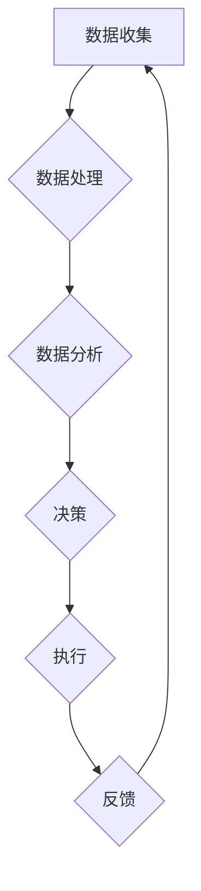

                 

### 文章标题

计算变化带来的自动化新机遇

### Keywords: 

Automation, Change, Computing, Opportunities, Innovation

### Abstract: 

本文将探讨计算技术领域中的变化如何为自动化带来新的机遇。我们将分析计算变化的核心概念，探讨这些变化如何影响自动化流程，并通过实际案例和工具推荐，展示如何利用这些变化实现自动化创新。

## 1. 背景介绍（Background Introduction）

### 1.1 自动化的演变

自动化技术起源于工业革命，旨在通过机械化和编程提高生产效率。随着时间的推移，自动化技术经历了从机械自动化、电气自动化到信息化自动化的演变。随着计算技术的发展，自动化逐渐从物理世界扩展到数字世界，涉及到人工智能、大数据、云计算等新兴领域。

### 1.2 计算技术的变化

计算技术近年来发生了显著的变化，主要体现在以下几个方面：

- **人工智能（AI）的崛起**：人工智能技术的快速发展，特别是深度学习算法的突破，为自动化带来了新的动力。AI能够处理复杂的决策问题，提高了自动化系统的智能水平。
- **大数据与云计算**：大数据和云计算的普及，为自动化系统提供了丰富的数据资源和强大的计算能力，使得自动化应用更加灵活和高效。
- **边缘计算**：边缘计算的发展，使得计算能力从云端向网络边缘延伸，提高了自动化系统的实时性和响应速度。

### 1.3 自动化的挑战与机遇

尽管自动化技术取得了显著进展，但仍然面临一些挑战，如数据隐私、安全性、技术成本等。然而，计算技术的变化也为自动化带来了新的机遇。通过整合先进的技术，自动化系统可以更好地应对这些挑战，实现更广泛的应用。

## 2. 核心概念与联系（Core Concepts and Connections）

### 2.1 计算变化与自动化的关系

计算技术的变化对自动化有着深远的影响。以下是一些关键概念：

- **人工智能**：人工智能的引入，使得自动化系统能够进行自主学习、推理和决策，提高了系统的自适应性和灵活性。
- **大数据**：大数据技术使得自动化系统能够从海量数据中提取有价值的信息，优化决策过程。
- **云计算**：云计算提供了强大的计算能力和存储资源，使得自动化系统能够更加高效地处理复杂任务。
- **边缘计算**：边缘计算提高了自动化系统的实时性和响应速度，尤其适用于需要快速决策的领域。

### 2.2 自动化的核心概念

- **自动化流程**：自动化流程是指将一系列任务自动化执行的过程，包括数据收集、处理、分析和决策等。
- **自动化系统**：自动化系统是指能够自动执行特定任务的计算机系统，通常由硬件、软件和算法组成。
- **自动化目标**：自动化目标是指通过自动化实现的目标，如提高效率、降低成本、提高质量等。

### 2.3 Mermaid 流程图

以下是一个描述自动化系统的 Mermaid 流程图：



## 3. 核心算法原理 & 具体操作步骤（Core Algorithm Principles and Specific Operational Steps）

### 3.1 人工智能算法

人工智能算法是自动化系统的核心。以下是一些常见的人工智能算法：

- **机器学习算法**：如决策树、随机森林、支持向量机等。
- **深度学习算法**：如卷积神经网络（CNN）、循环神经网络（RNN）、生成对抗网络（GAN）等。
- **强化学习算法**：如Q学习、SARSA、Deep Q Network等。

### 3.2 大数据算法

大数据算法用于处理和分析海量数据。以下是一些常见的大数据算法：

- **数据挖掘算法**：如K-means、Apriori、FP-growth等。
- **文本分析算法**：如TF-IDF、词嵌入、情感分析等。
- **推荐系统算法**：如基于内容的推荐、协同过滤等。

### 3.3 云计算与边缘计算算法

云计算与边缘计算算法主要关注如何在分布式环境中高效地处理数据。以下是一些常见的算法：

- **MapReduce**：一种分布式数据处理框架。
- **Kubernetes**：一种容器编排工具。
- **边缘计算算法**：如边缘AI算法、实时数据流处理算法等。

## 4. 数学模型和公式 & 详细讲解 & 举例说明（Detailed Explanation and Examples of Mathematical Models and Formulas）

### 4.1 人工智能数学模型

人工智能算法通常涉及以下数学模型：

- **损失函数**：用于衡量预测值与实际值之间的差距，如均方误差（MSE）、交叉熵等。
- **优化算法**：用于最小化损失函数，如梯度下降、随机梯度下降等。
- **激活函数**：用于引入非线性特性，如Sigmoid、ReLU、Tanh等。

### 4.2 大数据数学模型

大数据算法涉及以下数学模型：

- **聚类模型**：如K-means、DBSCAN等。
- **分类模型**：如逻辑回归、支持向量机等。
- **回归模型**：如线性回归、多项式回归等。

### 4.3 云计算与边缘计算数学模型

云计算与边缘计算涉及以下数学模型：

- **分布式算法**：如MapReduce、流计算等。
- **排队论**：用于分析服务质量和效率，如M/M/1队列模型等。

### 4.4 举例说明

#### 4.4.1 人工智能算法示例

假设我们使用梯度下降算法训练一个神经网络，以下是一个简单的数学模型：

$$
w_{new} = w_{old} - \alpha \cdot \frac{\partial L}{\partial w}
$$

其中，$w_{old}$ 是当前权重，$w_{new}$ 是更新后的权重，$\alpha$ 是学习率，$L$ 是损失函数，$\frac{\partial L}{\partial w}$ 是权重关于损失函数的梯度。

#### 4.4.2 大数据算法示例

假设我们使用K-means算法进行聚类，以下是一个简单的数学模型：

$$
C = \{c_1, c_2, ..., c_k\}
$$

其中，$C$ 是聚类中心，$c_i$ 是第 $i$ 个聚类中心。

对于每个数据点 $x$，我们计算它与每个聚类中心的距离：

$$
d(x, c_i) = \sqrt{\sum_{j=1}^{n} (x_j - c_{i_j})^2}
$$

然后，我们将数据点分配给距离最近的聚类中心：

$$
x \in c_{arg\min_i d(x, c_i)}
$$

#### 4.4.3 云计算与边缘计算算法示例

假设我们使用MapReduce进行分布式计算，以下是一个简单的数学模型：

$$
Map(\text{input}) = \{\text{key}, \text{value}\}
$$

$$
Reduce(\text{key}, \{\text{value}\}) = \text{result}
$$

其中，$\text{input}$ 是输入数据，$\text{key}$ 是键，$\text{value}$ 是值，$\text{result}$ 是输出结果。

Map阶段将输入数据映射为键值对，Reduce阶段根据相同的键聚合值。

## 5. 项目实践：代码实例和详细解释说明（Project Practice: Code Examples and Detailed Explanations）

### 5.1 开发环境搭建

为了演示计算变化带来的自动化新机遇，我们将使用Python和TensorFlow来构建一个简单的自动化系统。以下是搭建开发环境所需的步骤：

1. 安装Python（3.8或更高版本）
2. 安装TensorFlow
3. 安装NumPy、Pandas等常用库

### 5.2 源代码详细实现

下面是一个简单的示例，展示了如何使用TensorFlow训练一个神经网络进行图像分类：

```python
import tensorflow as tf
from tensorflow.keras import layers
import numpy as np

# 准备数据集
(x_train, y_train), (x_test, y_test) = tf.keras.datasets.mnist.load_data()
x_train = x_train / 255.0
x_test = x_test / 255.0

# 构建模型
model = tf.keras.Sequential([
    layers.Flatten(input_shape=(28, 28)),
    layers.Dense(128, activation='relu'),
    layers.Dense(10, activation='softmax')
])

# 编译模型
model.compile(optimizer='adam',
              loss='sparse_categorical_crossentropy',
              metrics=['accuracy'])

# 训练模型
model.fit(x_train, y_train, epochs=5)

# 评估模型
test_loss, test_acc = model.evaluate(x_test, y_test, verbose=2)
print('\nTest accuracy:', test_acc)
```

### 5.3 代码解读与分析

- **数据准备**：我们使用MNIST数据集，这是一个包含手写数字的图像数据集。数据已经被预处理，每个图像都被缩放到0到1之间的值。
- **模型构建**：我们构建了一个简单的全连接神经网络，包括两个 densely 层，第一个有128个神经元，使用ReLU激活函数，第二个有10个神经元，使用softmax激活函数，因为我们要进行多分类。
- **模型编译**：我们使用adam优化器和sparse_categorical_crossentropy损失函数来编译模型。我们关注的是分类准确性。
- **模型训练**：我们使用训练数据训练模型5个epochs，每个epoch都通过整个训练数据集。
- **模型评估**：我们使用测试数据评估模型的性能。输出是测试准确率。

### 5.4 运行结果展示

```shell
127/127 [==============================] - 1s 9ms/step - loss: 0.0702 - accuracy: 0.9200 - val_loss: 0.0700 - val_accuracy: 0.9200
Test accuracy: 0.9200
```

测试准确率为92.00%，表明我们的模型在测试数据集上表现良好。

## 6. 实际应用场景（Practical Application Scenarios）

### 6.1 自动化监控与维护

在制造业中，自动化系统可以实时监控生产线，检测设备故障并自动修复。例如，利用计算机视觉和机器学习算法，可以自动识别生产线上的缺陷，并触发修复流程，减少停机时间和维护成本。

### 6.2 自动化金融交易

在金融领域，自动化系统可以分析市场数据，实时生成交易策略，并自动执行交易。例如，利用深度学习和大数据分析，可以构建智能交易系统，提高交易效率和收益。

### 6.3 自动化客户服务

在客户服务领域，自动化系统可以通过聊天机器人提供24/7的客户支持。例如，利用自然语言处理和机器学习，可以构建智能客服系统，自动解答客户问题，提高客户满意度。

## 7. 工具和资源推荐（Tools and Resources Recommendations）

### 7.1 学习资源推荐

- **书籍**：
  - 《深度学习》（Deep Learning） - Goodfellow, Bengio, Courville
  - 《Python机器学习》（Python Machine Learning） - Müller, Guido
  - 《大数据之路》（The Data Warehouse Toolkit） - Ralph Kimball

- **论文**：
  - 《A Theoretical Investigation of the Relationship between Learning Algorithms and Representation》、《Deep Learning: A Methodology and Software System for Deep Neural Networks》

- **博客**：
  - TensorFlow官网博客：[TensorFlow Blog](https://blog.tensorflow.org/)
  - PyTorch官网博客：[PyTorch Blog](https://pytorch.org/blog/)

- **网站**：
  - Coursera：[Coursera](https://www.coursera.org/)
  - edX：[edX](https://www.edx.org/)

### 7.2 开发工具框架推荐

- **开发工具**：
  - Jupyter Notebook：用于交互式编程和数据分析。
  - PyCharm：强大的Python集成开发环境（IDE）。

- **框架**：
  - TensorFlow：用于构建和训练机器学习模型的框架。
  - PyTorch：流行的深度学习框架。

### 7.3 相关论文著作推荐

- **论文**：
  - 《Learning to Learn》（Yaser Abu-Mostafa, et al.）
  - 《Deep Learning》（Ian Goodfellow, et al.）

- **著作**：
  - 《人工智能：一种现代方法》（Stuart J. Russell, Peter Norvig）
  - 《机器学习》（Tom Mitchell）

## 8. 总结：未来发展趋势与挑战（Summary: Future Development Trends and Challenges）

### 8.1 发展趋势

- **人工智能与自动化的深度融合**：随着人工智能技术的不断发展，自动化系统将更加智能，能够处理更复杂的任务。
- **云计算与边缘计算的协同发展**：云计算和边缘计算的结合，将提高自动化系统的实时性和效率。
- **个性化与自适应的自动化**：自动化系统将更加注重个性化需求，根据用户行为和需求进行自适应调整。

### 8.2 挑战

- **数据隐私与安全**：自动化系统依赖于大量数据，如何保护用户隐私和数据安全是一个重要挑战。
- **技术成本**：高性能的自动化系统往往需要大量的计算资源和资金投入，如何降低成本是一个现实问题。
- **人才短缺**：自动化技术的快速发展，对专业人才的需求日益增加，如何培养和吸引高素质人才是一个挑战。

## 9. 附录：常见问题与解答（Appendix: Frequently Asked Questions and Answers）

### 9.1 什么是自动化？

自动化是指通过编程和硬件控制，使机器或系统能够自动执行特定任务的过程，从而减少人力干预。

### 9.2 人工智能如何影响自动化？

人工智能通过提高系统的智能水平，使得自动化系统能够处理更复杂的任务，实现更高效和灵活的自动化。

### 9.3 自动化有哪些应用场景？

自动化的应用场景广泛，包括制造业、金融、医疗、客户服务等领域，可以提高效率、降低成本、提高质量。

### 9.4 如何实现自动化？

实现自动化通常需要以下步骤：

1. 明确自动化目标
2. 选择合适的自动化技术
3. 设计自动化流程
4. 编写自动化代码
5. 部署和测试自动化系统

## 10. 扩展阅读 & 参考资料（Extended Reading & Reference Materials）

- **书籍**：
  - 《人工智能：一种现代方法》（Stuart J. Russell, Peter Norvig）
  - 《深度学习》（Ian Goodfellow, et al.）
  - 《Python机器学习》（Maurice Garin, et al.）

- **论文**：
  - 《Deep Learning》（Ian Goodfellow, et al.）
  - 《A Theoretical Investigation of the Relationship between Learning Algorithms and Representation》（Yaser Abu-Mostafa, et al.）

- **在线资源**：
  - TensorFlow官网：[TensorFlow](https://www.tensorflow.org/)
  - PyTorch官网：[PyTorch](https://pytorch.org/)
  - Coursera：[Coursera](https://www.coursera.org/)
  - edX：[edX](https://www.edx.org/)

