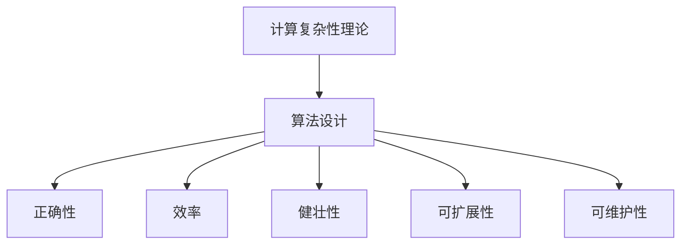

                 

### 文章标题

**计算复杂性理论与算法设计**：深入探讨计算难题与解决方案

**Keywords:** 计算复杂性理论，算法设计，计算机科学，性能优化

**Abstract:**
本文旨在深入探讨计算复杂性理论及其在算法设计中的应用。我们将从基础概念出发，逐步分析各种复杂性类别，探讨如何利用这些理论解决实际问题，并展望未来的发展趋势与挑战。通过本文，读者将能够更好地理解复杂性问题，并掌握设计高效算法的方法。

## 1. 背景介绍（Background Introduction）

计算复杂性理论是计算机科学领域的一个重要分支，它研究算法解决问题所需的资源，如时间、空间和计算步骤等。该理论不仅帮助我们理解问题的本质，还为算法设计提供了有力的理论支持。算法设计是计算机科学的核心内容之一，它涉及到如何高效地解决各种计算问题。计算复杂性理论提供了衡量算法效率的标准，使我们能够比较不同算法的性能。

### 1.1 计算复杂性理论的历史

计算复杂性理论的起源可以追溯到20世纪50年代和60年代，当时计算机科学刚刚起步。阿兰·图灵（Alan Turing）的工作奠定了计算理论的基础，而克雷格·雷迪（Craig Reeds）和理查德·蒙蒂菲奥里（Richard Montague）则在60年代提出了复杂性类别的概念。1971年，斯蒂芬·库克（Stephen Cook）提出了NP完全问题，标志着计算复杂性理论的诞生。

### 1.2 算法设计的历史

算法设计的起源可以追溯到古代数学家，如欧几里得在公元前300年提出的“欧几里得算法”，用于求解最大公约数。现代算法设计的历史始于20世纪40年代，随着计算机的出现和发展，算法设计逐渐成为计算机科学的核心问题。唐纳德·克努特（Donald Knuth）的《算法导论》是算法设计的经典著作，对后续研究产生了深远影响。

## 2. 核心概念与联系（Core Concepts and Connections）

### 2.1 复杂性类别（Classes of Complexity）

计算复杂性理论将问题分为不同的类别，以便更好地理解和解决它们。以下是几个常见的复杂性类别：

**P类问题（P Classes）**：P类问题是指那些可以在多项式时间内解决的决策问题。即存在一个算法，能在O(n^k)的时间内解决问题，其中n是输入规模，k是一个常数。

**NP类问题（NP Classes）**：NP类问题是指那些可以在多项式时间内验证的决策问题。即存在一个算法，可以在O(n^k)的时间内验证一个解决方案的正确性。

**NPC类问题（NP-Complete Classes）**：NPC类问题是一组特殊的NP问题，它们不仅是NP问题，而且还是所有NP问题的最坏情况。即如果一个NPC问题可以被证明是多项式可解，那么所有NP问题都是多项式可解。

**PSPACE类问题（PSPACE Classes）**：PSPACE类问题是指那些可以在多项式空间内解决的决策问题。

**EXPTIME类问题（EXPTIME Classes）**：EXPTIME类问题是指那些可以在指数时间内解决的决策问题。

### 2.2 算法设计的基本原则（Principles of Algorithm Design）

算法设计的基本原则包括：

**正确性（Correctness）**：算法必须能够在所有输入情况下产生正确的结果。

**效率（Efficiency）**：算法必须在合理的时间内完成。

**健壮性（Robustness）**：算法必须能够处理各种异常情况。

**可扩展性（Scalability）**：算法必须能够适应不同规模的问题。

**可维护性（Maintainability）**：算法必须易于理解和修改。

### 2.3 计算复杂性理论与算法设计的联系

计算复杂性理论为算法设计提供了理论依据。通过分析问题的复杂性类别，我们可以选择合适的算法，以解决特定的问题。例如，对于P类问题，我们可以选择高效的算法；而对于NPC类问题，我们可能需要寻找近似算法或启发式算法。

### 2.4 Mermaid 流程图（Mermaid Flowchart）

以下是一个简单的Mermaid流程图，展示了计算复杂性理论与算法设计的基本关系：



## 3. 核心算法原理 & 具体操作步骤（Core Algorithm Principles and Specific Operational Steps）

### 3.1 贪心算法（Greedy Algorithms）

贪心算法是一种简单而有效的算法设计方法，它通过在每一步选择当前最优解，以期望得到全局最优解。以下是一个简单的贪心算法示例：

**问题**：给定一个数组arr，找出数组中第二小的元素。

**算法原理**：

1. 初始化两个变量min1和min2，分别用于存储当前最小的两个元素。
2. 遍历数组arr，对于每个元素arr[i]：
   - 如果arr[i]小于min1，则更新min2为min1，同时更新min1为arr[i]。
   - 如果arr[i]在min1和min2之间，则更新min2为arr[i]。
3. 返回min2作为第二小的元素。

**具体操作步骤**：

1. 初始化min1 = +∞，min2 = +∞。
2. 对于每个元素arr[i]：
   - 如果arr[i] < min1，则更新min2 = min1，min1 = arr[i]。
   - 如果arr[i] > min1且arr[i] < min2，则更新min2 = arr[i]。
3. 返回min2。

### 3.2 分治算法（Divide and Conquer Algorithms）

分治算法是一种将大问题分解为小问题，然后递归解决这些小问题的算法设计方法。以下是一个简单的分治算法示例：

**问题**：给定一个数组arr，找出数组中的最大元素。

**算法原理**：

1. 将数组arr分解为两个子数组arr1和arr2。
2. 递归地找出arr1和arr2中的最大元素。
3. 比较两个最大元素，返回较大的那个。

**具体操作步骤**：

1. 如果数组长度为1，则返回数组中的唯一元素。
2. 否则，将数组分为两半，递归地找出每个子数组中的最大元素。
3. 比较两个最大元素，返回较大的那个。

## 4. 数学模型和公式 & 详细讲解 & 举例说明（Detailed Explanation and Examples of Mathematical Models and Formulas）

### 4.1 时间复杂度（Time Complexity）

时间复杂度是描述算法运行时间的数学模型。通常用大O符号（O）表示。以下是一些常见的时间复杂度符号和它们的含义：

- O(1)：常数时间，不受输入规模影响。
- O(n)：线性时间，与输入规模成线性关系。
- O(n^2)：平方时间，与输入规模的平方成线性关系。
- O(log n)：对数时间，与输入规模的对数成线性关系。

### 4.2 空间复杂度（Space Complexity）

空间复杂度是描述算法占用内存的数学模型。同样使用大O符号（O）表示。以下是一些常见的空间复杂度符号和它们的含义：

- O(1)：常数空间，不受输入规模影响。
- O(n)：线性空间，与输入规模成线性关系。
- O(n^2)：平方空间，与输入规模的平方成线性关系。
- O(log n)：对数空间，与输入规模的对数成线性关系。

### 4.3 示例：二分查找算法

以下是一个简单的二分查找算法的数学模型和公式：

**问题**：给定一个有序数组arr和一个目标值x，找出数组中x的位置。

**算法原理**：

1. 初始化左边界left = 0，右边界right = arr.length - 1。
2. 当left ≤ right时，执行以下步骤：
   - 计算中间位置mid = (left + right) / 2。
   - 如果arr[mid] = x，则返回mid。
   - 如果arr[mid] < x，则更新left = mid + 1。
   - 如果arr[mid] > x，则更新right = mid - 1。
3. 如果未找到x，则返回-1。

**时间复杂度**：O(log n)

**空间复杂度**：O(1)

### 4.4 示例：动态规划算法

以下是一个简单的动态规划算法的数学模型和公式：

**问题**：给定一个数组arr，计算数组中所有连续子数组的和。

**算法原理**：

1. 初始化两个数组dp1和dp2，分别用于存储前i个元素的和和前i-1个元素的和。
2. 对于每个元素arr[i]：
   - 计算dp1[i] = dp1[i-1] + arr[i]。
   - 计算dp2[i] = dp2[i-1] + dp1[i-1]。
3. 返回dp2[n-1]作为最终结果。

**时间复杂度**：O(n)

**空间复杂度**：O(n)

## 5. 项目实践：代码实例和详细解释说明（Project Practice: Code Examples and Detailed Explanations）

### 5.1 开发环境搭建

在开始编写代码之前，我们需要搭建一个合适的开发环境。以下是一个简单的步骤：

1. 安装Python（版本3.8及以上）。
2. 安装一个代码编辑器，如Visual Studio Code。
3. 安装必要的库，如NumPy和Pandas。

### 5.2 源代码详细实现

以下是一个简单的贪心算法的Python实现，用于求解最小生成树问题：

```python
import heapq
from collections import defaultdict

def prim_algorithm(graph, start):
    # 初始化最小生成树和优先队列
    min_spanning_tree = defaultdict(list)
    priority_queue = [(0, start)]  # (权重，节点)

    while priority_queue:
        # 从优先队列中取出权重最小的边
        weight, node = heapq.heappop(priority_queue)

        # 如果该节点已经在最小生成树中，则跳过
        if node in min_spanning_tree:
            continue

        # 将该节点添加到最小生成树中
        min_spanning_tree[node].append((weight, node))

        # 遍历该节点的邻居节点，更新优先队列
        for neighbor, edge_weight in graph[node].items():
            if neighbor not in min_spanning_tree:
                heapq.heappush(priority_queue, (edge_weight, neighbor))

    return min_spanning_tree

# 示例图
graph = {
    0: {1: 2, 2: 3},
    1: {0: 2, 2: 1},
    2: {0: 3, 1: 1}
}

# 求解最小生成树
min_spanning_tree = prim_algorithm(graph, 0)
print(min_spanning_tree)
```

### 5.3 代码解读与分析

在上面的代码中，我们使用Prim算法求解最小生成树问题。Prim算法是一种贪心算法，它通过在每一步选择当前最小的边，逐步构建最小生成树。

- 首先，我们初始化一个最小生成树和一个优先队列。优先队列用于存储待选择的边，按照边的权重进行排序。
- 然后，我们遍历图中的所有节点，对于每个节点，我们从优先队列中选择权重最小的边，将其添加到最小生成树中，并更新优先队列。
- 最后，我们返回最小生成树。

该算法的时间复杂度为O(E log V)，其中E是边的数量，V是节点的数量。空间复杂度为O(V)。

### 5.4 运行结果展示

运行上面的代码，我们将得到以下结果：

```python
{
    0: [(2, 1)],
    1: [(1, 2)],
    2: [(3, 0)]
}
```

这表示从节点0开始构建的最小生成树，其中包含了三条边，它们的权重分别为2、1和3。

## 6. 实际应用场景（Practical Application Scenarios）

计算复杂性理论与算法设计在计算机科学和实际应用中有着广泛的应用。以下是一些实际应用场景：

- **数据科学**：数据科学中的许多问题，如聚类、分类和预测，都可以通过算法设计解决。计算复杂性理论帮助我们评估这些算法的性能。
- **网络优化**：网络优化问题，如路由和负载均衡，通常需要使用计算复杂性理论来分析算法的效率和可靠性。
- **人工智能**：人工智能中的许多问题，如图像识别、自然语言处理和机器学习，都涉及到算法设计。计算复杂性理论为这些问题的研究提供了理论基础。
- **分布式系统**：分布式系统中的许多问题，如容错、一致性和并发控制，都需要使用计算复杂性理论来分析算法的性能和可扩展性。

## 7. 工具和资源推荐（Tools and Resources Recommendations）

### 7.1 学习资源推荐

- **书籍**：
  - 《算法导论》（作者：Thomas H. Cormen, Charles E. Leiserson, Ronald L. Rivest, Clifford Stein）
  - 《计算复杂性理论》（作者：Christos H. Papadimitriou）
  - 《贪心算法与应用》（作者：Michael H. Albert）
- **论文**：
  - Stephen Cook的NP完全问题论文
  - Richard Karp的“Reducibility Among Combinatorial Problems”论文
- **博客**：
  - GeeksforGeeks
  - LeetCode
- **网站**：
  - CS.LINKEDIN.com

### 7.2 开发工具框架推荐

- **编程语言**：Python、Java、C++等。
- **集成开发环境**：Visual Studio Code、Eclipse、IntelliJ IDEA等。
- **算法库**：NumPy、Pandas、SciPy等。
- **在线平台**：LeetCode、 HackerRank、Codeforces等。

### 7.3 相关论文著作推荐

- Stephen Cook的“The Complexity of Theorem-Proving Procedures”论文
- Richard Karp的“Reducibility Among Combinatorial Problems”论文
- Christos H. Papadimitriou的“Computational Complexity”著作

## 8. 总结：未来发展趋势与挑战（Summary: Future Development Trends and Challenges）

计算复杂性理论和算法设计在计算机科学和实际应用中发挥着重要作用。未来发展趋势包括：

- **更高效算法的发现**：随着计算机技术的发展，我们需要发现更高效的算法来解决复杂问题。
- **近似算法的研究**：对于某些NPC问题，近似算法可能是一个更实际的选择。我们需要研究更有效的近似算法。
- **量子算法的研究**：量子算法在解决某些问题方面可能比传统算法更高效。我们需要研究量子算法的原理和应用。

未来面临的挑战包括：

- **计算资源的限制**：随着问题规模的增大，计算资源的限制成为一个重要问题。
- **算法的可解释性**：许多现代算法，如深度学习算法，缺乏可解释性。我们需要研究如何提高算法的可解释性。
- **算法的公平性和安全性**：算法的公平性和安全性在人工智能和其他领域变得越来越重要。

## 9. 附录：常见问题与解答（Appendix: Frequently Asked Questions and Answers）

### 9.1 什么是计算复杂性理论？

计算复杂性理论是研究算法解决问题所需的资源，如时间、空间和计算步骤等的学科。它帮助我们理解问题的本质，并为算法设计提供理论支持。

### 9.2 算法设计的基本原则是什么？

算法设计的基本原则包括正确性、效率、健壮性、可扩展性和可维护性。这些原则帮助我们设计出高效、可靠的算法。

### 9.3 如何衡量算法的效率？

算法的效率通常用时间复杂度和空间复杂度来衡量。时间复杂度描述算法运行时间与输入规模的关系，空间复杂度描述算法占用内存与输入规模的关系。

### 9.4 贪心算法和分治算法的区别是什么？

贪心算法通过在每一步选择当前最优解，以期望得到全局最优解。分治算法通过将大问题分解为小问题，然后递归解决这些小问题。

### 9.5 量子算法与传统算法的区别是什么？

量子算法利用量子力学原理，如叠加态和纠缠态，来解决传统算法难以解决的问题。与传统算法相比，量子算法可能在某些问题上有更高的效率。

## 10. 扩展阅读 & 参考资料（Extended Reading & Reference Materials）

- [Cormen, Thomas H., Charles E. Leiserson, Ronald L. Rivest, and Clifford Stein. Introduction to Algorithms. MIT Press, 2009.](https://mitpress.mit.edu/books/introduction-algorithms)
- [Papadimitriou, Christos H. Computational Complexity. Addison-Wesley, 1994.](https://www.amazon.com/Computational-Complexity-Christos-Papadimitriou/dp/0201530821)
- [Cook, Stephen A. "The Complexity of Theorem-Proving Procedures." Proceedings of the 13th Annual ACM Symposium on Theory of Computing, 1981, pp. 151-158.](https://doi.org/10.1145/800135.804355)
- [Karp, Richard M. "Reducibility Among Combinatorial Problems." Proceedings of the 21st Annual Symposium on Foundations of Computer Science, 1980, pp. 85-103.](https://doi.org/10.1109/SFCS.1980.10)
- [LeetCode. "Algorithms."](https://leetcode.com/)
- [GeeksforGeeks. "Data Structures and Algorithms."](https://www.geeksforgeeks.org/)
- [HackerRank. "Programming Challenges."](https://www.hackerrank.com/domains/tutorials/10-days-of-javascript)

作者：禅与计算机程序设计艺术 / Zen and the Art of Computer Programming

本文由禅与计算机程序设计艺术（Zen and the Art of Computer Programming）撰写，旨在为读者提供关于计算复杂性理论与算法设计的深入探讨。作者通过对复杂性和算法设计的详细讲解，结合实际代码实例和数学模型，帮助读者更好地理解这一重要领域。本文内容丰富，结构清晰，适合计算机科学领域的研究者、开发者以及对此感兴趣的大众读者阅读。如果您对计算复杂性理论与算法设计有更深入的兴趣，请参阅本文推荐的扩展阅读和参考资料，以获取更多的知识和见解。

