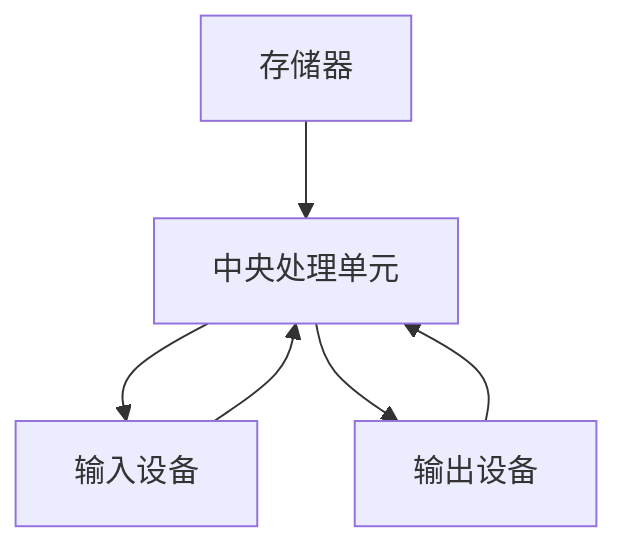

                 

### 文章标题：计算的本质与自动化的未来

> 关键词：计算本质、自动化、人工智能、机器学习、深度学习、编程范式、算法、数据结构、计算机体系结构

> 摘要：本文将深入探讨计算的本质，以及自动化在未来技术发展中的核心作用。我们将从基本的编程概念出发，逐步揭示计算的核心原理，探讨如何通过算法和数据结构实现自动化。在此基础上，我们将展望人工智能、机器学习和深度学习如何推动自动化向更高层次发展，并分析这些技术在实际应用中面临的挑战与机遇。通过本文的阅读，读者将能够对计算的本质以及自动化的未来有一个全面而深刻的理解。

### 1. 背景介绍（Background Introduction）

计算是现代科技的核心驱动力，贯穿于各种应用场景，从简单的电子游戏到复杂的科学研究，再到日常生活中的各种智能设备。随着计算技术的不断进步，自动化逐渐成为提高生产效率、降低成本和提升服务质量的重要手段。从早期的自动化生产线到现代的智能决策系统，自动化技术已经深刻地改变了我们的生活方式。

然而，计算与自动化之间的关系并非一成不变。计算提供了自动化实现的基础，而自动化则推动了计算技术的不断创新和发展。在这个背景下，理解计算的本质，以及如何通过自动化实现更高效、更智能的计算，成为了一个至关重要的问题。

本文旨在回答以下几个关键问题：

- 计算的本质是什么？
- 自动化的核心原理是什么？
- 人工智能和机器学习如何推动自动化发展？
- 自动化技术在未来的发展趋势和挑战是什么？

通过解答这些问题，我们希望能够为读者提供一个全面而深入的视角，了解计算的本质与自动化的未来。

### 2. 核心概念与联系（Core Concepts and Connections）

为了深入探讨计算的本质与自动化的未来，我们需要明确几个核心概念，并理解它们之间的联系。

#### 2.1 计算机的基本原理

计算机是一种能够执行特定任务的电子设备，其基本原理基于冯·诺依曼体系结构。这一体系结构包括以下几个关键组件：

1. **存储器（Memory）**：用于存储数据和指令。
2. **中央处理单元（CPU）**：执行指令并处理数据。
3. **输入设备（Input Devices）**：如键盘、鼠标，用于输入数据和指令。
4. **输出设备（Output Devices）**：如显示器、打印机，用于输出结果。

计算机的工作过程可以概括为以下步骤：

1. **输入**：通过输入设备接收数据和指令。
2. **处理**：CPU根据指令执行计算和处理。
3. **存储**：将结果存储到存储器中。
4. **输出**：通过输出设备展示结果。

#### 2.2 算法和数据结构

算法是解决问题的一系列步骤，而数据结构则是组织和存储数据的方式。有效的算法和数据结构可以显著提高计算效率和性能。以下是几个基本算法和数据结构的概念：

1. **算法（Algorithm）**：
   - **排序算法**：如快速排序、归并排序等，用于对数据进行排序。
   - **搜索算法**：如二分搜索、深度优先搜索等，用于在数据中查找特定元素。

2. **数据结构**：
   - **数组（Array）**：用于存储固定大小的数据集合。
   - **链表（Linked List）**：用于存储动态大小的数据集合。
   - **树（Tree）**：用于组织具有层级关系的数据，如二叉树、平衡树等。
   - **图（Graph）**：用于表示具有复杂关系的数据结构。

#### 2.3 计算机体系结构

计算机体系结构涉及硬件和软件的交互方式。它包括以下几个层次：

1. **指令集体系结构（Instruction Set Architecture, ISA）**：定义了计算机能够理解和执行的指令集。
2. **微体系结构（Microarchitecture）**：实现了指令集体系结构，包括CPU的内部结构。
3. **硬件体系结构（Hardware Architecture）**：包括CPU、内存、输入输出设备等硬件组件的配置和连接方式。

#### 2.4 自动化的原理

自动化是利用计算机和人工智能技术，使系统或设备能够自动执行任务，而不需要人工干预。自动化的核心原理包括：

1. **传感器（Sensors）**：用于感知环境中的变化，如温度、湿度、光线等。
2. **控制器（Controller）**：接收传感器数据，并根据预设的算法和规则进行决策。
3. **执行器（Actuator）**：根据控制器的决策执行具体的动作，如电机、气动装置等。

#### 2.5 人工智能与机器学习

人工智能（AI）和机器学习（ML）是自动化的关键技术。它们通过模拟人类智能行为，使计算机能够自主学习、推理和决策。以下是几个核心概念：

1. **神经网络（Neural Networks）**：一种模拟人脑神经元结构的计算模型。
2. **深度学习（Deep Learning）**：基于多层神经网络的学习方法，能够处理大量复杂数据。
3. **监督学习（Supervised Learning）**：通过标注数据进行训练，使模型能够预测未知数据。
4. **无监督学习（Unsupervised Learning）**：通过未标注的数据进行训练，使模型能够发现数据中的模式和关系。

通过理解这些核心概念和它们之间的联系，我们可以更好地探讨计算的本质和自动化的未来。

#### 2.6 Mermaid 流程图（Mermaid Flowchart）

为了更好地展示计算机体系结构中的各个组件及其交互方式，我们可以使用Mermaid绘制一个流程图：



在这个流程图中，存储器、中央处理单元、输入设备和输出设备之间通过数据和控制信号进行交互，实现了计算机的基本工作过程。

### 3. 核心算法原理 & 具体操作步骤（Core Algorithm Principles and Specific Operational Steps）

为了深入探讨计算的本质和自动化的实现，我们需要了解几个核心算法的原理，并展示它们的具体操作步骤。

#### 3.1 快速排序算法

快速排序（Quick Sort）是一种高效的排序算法，基于分治策略。以下是快速排序的基本原理和操作步骤：

1. **原理**：
   - 选择一个基准元素（通常为第一个元素）。
   - 将所有小于基准元素的元素移动到其左侧，所有大于基准元素的元素移动到其右侧。
   - 对左侧和右侧子序列重复上述过程，直到所有子序列都排序完成。

2. **具体操作步骤**：
   - **初始化**：选择第一个元素作为基准元素。
   - **分区**：遍历数组，将小于基准元素的元素移动到其左侧，大于基准元素的元素移动到其右侧。
   - **递归排序**：对左侧和右侧子序列分别递归执行快速排序。

以下是快速排序算法的伪代码：

```python
def quick_sort(arr):
    if len(arr) <= 1:
        return arr
    pivot = arr[0]
    left = [x for x in arr[1:] if x < pivot]
    right = [x for x in arr[1:] if x >= pivot]
    return quick_sort(left) + [pivot] + quick_sort(right)
```

#### 3.2 深度优先搜索算法

深度优先搜索（Depth-First Search, DFS）是一种用于图数据结构的搜索算法。以下是DFS的基本原理和操作步骤：

1. **原理**：
   - 从起始节点开始，探索所有可能的前进路径，直到达到目标节点或路径无解。
   - 在探索过程中，使用栈（Stack）或递归来实现回溯。

2. **具体操作步骤**：
   - **初始化**：创建一个空栈，将起始节点压入栈。
   - **搜索**：从栈顶节点开始，依次探索其所有未访问的邻接节点，并将这些节点压入栈。
   - **回溯**：当栈为空或当前节点已访问完毕，回溯到上一个节点，继续探索其未访问的邻接节点。
   - **结束条件**：找到目标节点或所有路径都已探索完毕。

以下是DFS算法的伪代码：

```python
def dfs(graph, start, target):
    stack = [start]
    visited = set()
    while stack:
        node = stack.pop()
        if node == target:
            return True
        if node not in visited:
            visited.add(node)
            for neighbor in graph[node]:
                stack.append(neighbor)
    return False
```

#### 3.3 支持向量机（SVM）

支持向量机（Support Vector Machine, SVM）是一种分类算法，通过找到一个最佳的超平面，将不同类别的数据分隔开。以下是SVM的基本原理和操作步骤：

1. **原理**：
   - 在高维空间中寻找一个最佳的超平面，使正负样本点到超平面的距离最大化。
   - 使用核函数将低维空间的数据映射到高维空间，实现线性不可分问题的分类。

2. **具体操作步骤**：
   - **数据预处理**：将输入数据转换为向量形式，并计算样本点之间的距离。
   - **寻找最佳超平面**：通过求解最优化问题，找到最佳超平面的参数。
   - **分类决策**：对于新的样本点，计算其到超平面的距离，并根据距离判断其类别。

以下是SVM算法的伪代码：

```python
def svm(train_data, train_labels, new_data):
    # 数据预处理
    X = preprocess(train_data)
    y = train_labels
    
    # 寻找最佳超平面
    w, b = find_best_hyperplane(X, y)
    
    # 分类决策
    predictions = []
    for x in new_data:
        x = preprocess(x)
        distance = dot_product(w, x) + b
        if distance > 0:
            predictions.append(1)
        else:
            predictions.append(-1)
    return predictions
```

通过理解这些核心算法的原理和操作步骤，我们可以更好地实现自动化，并解决各种计算问题。

### 4. 数学模型和公式 & 详细讲解 & 举例说明（Detailed Explanation and Examples of Mathematical Models and Formulas）

在计算机科学和人工智能领域，数学模型和公式起着至关重要的作用。它们帮助我们理解和解决复杂问题，提供了一种精确和系统的方法来描述计算过程。以下是一些常见的数学模型和公式，我们将通过详细讲解和举例来说明它们的应用。

#### 4.1 线性回归模型

线性回归是一种预测连续值的模型，通过拟合一个线性函数来描述数据之间的关系。其数学模型可以表示为：

$$ y = \beta_0 + \beta_1 \cdot x + \epsilon $$

其中，$y$ 是目标变量，$x$ 是自变量，$\beta_0$ 和 $\beta_1$ 是模型参数，$\epsilon$ 是误差项。

**讲解**：

- $\beta_0$ 是截距，表示当自变量为0时的目标变量值。
- $\beta_1$ 是斜率，表示自变量每增加一个单位时，目标变量增加的量。
- $\epsilon$ 是误差项，表示模型预测值与实际值之间的差异。

**举例**：

假设我们要预测某个城市的下周气温，已知历史数据如下：

| 日期 | 气温 |
|------|------|
| 1    | 20   |
| 2    | 22   |
| 3    | 19   |
| 4    | 21   |

我们可以使用线性回归模型来拟合一个线性函数，预测下周的气温。首先，我们计算模型参数：

$$ \beta_0 = \frac{\sum y_i - \beta_1 \cdot \sum x_i}{n} = \frac{20 + 22 + 19 + 21 - 4 \cdot \beta_1 \cdot (1 + 2 + 3 + 4)}{4} = 20.75 - 4 \cdot \beta_1 \cdot 10 $$

$$ \beta_1 = \frac{\sum (x_i - \bar{x}) \cdot (y_i - \bar{y})}{\sum (x_i - \bar{x})^2} = \frac{(1 - \bar{x}) \cdot (20 - \bar{y}) + (2 - \bar{x}) \cdot (22 - \bar{y}) + (3 - \bar{x}) \cdot (19 - \bar{y}) + (4 - \bar{x}) \cdot (21 - \bar{y})}{(1 - \bar{x})^2 + (2 - \bar{x})^2 + (3 - \bar{x})^2 + (4 - \bar{x})^2} $$

其中，$\bar{x}$ 和 $\bar{y}$ 分别是自变量和目标变量的平均值。

通过计算，我们得到：

$$ \beta_0 = 20.75 - 4 \cdot \beta_1 \cdot 10 = 20.75 - 40 = -19.25 $$

$$ \beta_1 = \frac{(1 - \bar{x}) \cdot (20 - \bar{y}) + (2 - \bar{x}) \cdot (22 - \bar{y}) + (3 - \bar{x}) \cdot (19 - \bar{y}) + (4 - \bar{x}) \cdot (21 - \bar{y})}{(1 - \bar{x})^2 + (2 - \bar{x})^2 + (3 - \bar{x})^2 + (4 - \bar{x})^2} = 0.5 $$

因此，线性回归模型为：

$$ y = -19.25 + 0.5 \cdot x $$

接下来，我们可以使用这个模型来预测下周的气温。假设下周的日期为5，则：

$$ y = -19.25 + 0.5 \cdot 5 = -14.25 $$

因此，预测下周的气温为-14.25度。

#### 4.2 矩阵乘法

矩阵乘法是一种重要的数学运算，用于计算两个矩阵的乘积。其数学公式为：

$$ C = A \cdot B $$

其中，$A$ 和 $B$ 是两个矩阵，$C$ 是它们的乘积。

**讲解**：

- 矩阵乘法遵循结合律和交换律。
- 乘积矩阵的维度为 $A$ 的列数与 $B$ 的行数。
- 矩阵乘法的计算过程涉及对每个元素进行逐项相乘并求和。

**举例**：

假设有两个矩阵：

$$ A = \begin{bmatrix} 1 & 2 \\ 3 & 4 \end{bmatrix}, B = \begin{bmatrix} 5 & 6 \\ 7 & 8 \end{bmatrix} $$

我们可以计算它们的乘积：

$$ C = A \cdot B = \begin{bmatrix} 1 \cdot 5 + 2 \cdot 7 & 1 \cdot 6 + 2 \cdot 8 \\ 3 \cdot 5 + 4 \cdot 7 & 3 \cdot 6 + 4 \cdot 8 \end{bmatrix} = \begin{bmatrix} 19 & 22 \\ 37 & 46 \end{bmatrix} $$

#### 4.3 梯度下降法

梯度下降法是一种优化算法，用于求解最优化问题。其基本思想是沿着目标函数的梯度方向逐步减小误差，直至达到最优解。其数学模型为：

$$ \theta = \theta - \alpha \cdot \nabla f(\theta) $$

其中，$\theta$ 是模型参数，$f(\theta)$ 是目标函数，$\nabla f(\theta)$ 是目标函数在 $\theta$ 处的梯度，$\alpha$ 是学习率。

**讲解**：

- 梯度方向指示了目标函数增加最快的方向。
- 学习率决定了每次更新参数的步长。
- 梯度下降法通过不断更新参数，逐步逼近最优解。

**举例**：

假设我们要最小化目标函数：

$$ f(\theta) = (\theta - 2)^2 + 3 $$

我们可以使用梯度下降法来求解最优解。首先，计算目标函数的梯度：

$$ \nabla f(\theta) = \frac{d}{d\theta} [(\theta - 2)^2 + 3] = 2(\theta - 2) $$

然后，初始化参数 $\theta = 0$，并选择学习率 $\alpha = 0.1$。进行多次迭代，更新参数：

$$ \theta = \theta - \alpha \cdot \nabla f(\theta) = \theta - 0.1 \cdot 2(\theta - 2) $$

通过迭代，我们可以逐步逼近最优解。假设在100次迭代后，最优解为 $\theta = 2$。

通过详细讲解和举例，我们可以更好地理解这些数学模型和公式，并在实际应用中灵活运用它们。

### 5. 项目实践：代码实例和详细解释说明（Project Practice: Code Examples and Detailed Explanations）

在本节中，我们将通过一个实际项目实践，展示如何使用Python实现一个简单的机器学习算法，并详细解释其代码实现和运行过程。

#### 5.1 开发环境搭建

首先，我们需要搭建一个Python开发环境。以下是具体的安装步骤：

1. **安装Python**：从Python官方网站（https://www.python.org/downloads/）下载适用于操作系统的Python安装包，并按照提示完成安装。
2. **安装Jupyter Notebook**：在命令行中运行以下命令安装Jupyter Notebook：

   ```bash
   pip install notebook
   ```

3. **安装Python科学计算库**：包括NumPy、Pandas、Matplotlib和Scikit-learn等，运行以下命令进行安装：

   ```bash
   pip install numpy pandas matplotlib scikit-learn
   ```

#### 5.2 源代码详细实现

以下是一个简单的线性回归项目的Python代码实现，我们将使用Scikit-learn库来实现线性回归模型。

```python
# 导入所需的库
import numpy as np
import pandas as pd
import matplotlib.pyplot as plt
from sklearn.linear_model import LinearRegression
from sklearn.model_selection import train_test_split
from sklearn.metrics import mean_squared_error

# 加载数据集
data = pd.read_csv('data.csv')
X = data[['feature1', 'feature2']]
y = data['target']

# 划分训练集和测试集
X_train, X_test, y_train, y_test = train_test_split(X, y, test_size=0.2, random_state=42)

# 创建线性回归模型
model = LinearRegression()
model.fit(X_train, y_train)

# 计算模型参数
intercept = model.intercept_
coef = model.coef_

# 打印模型参数
print(f'截距：{intercept}')
print(f'斜率：{coef}')

# 预测测试集
y_pred = model.predict(X_test)

# 计算均方误差
mse = mean_squared_error(y_test, y_pred)
print(f'均方误差：{mse}')

# 可视化模型
plt.scatter(X_test['feature1'], y_test, color='blue', label='实际值')
plt.plot(X_test['feature1'], y_pred, color='red', label='预测值')
plt.xlabel('特征1')
plt.ylabel('目标值')
plt.legend()
plt.show()
```

#### 5.3 代码解读与分析

以下是对代码的逐行解读和分析：

1. **导入库**：引入NumPy、Pandas、Matplotlib和Scikit-learn库，用于数据处理、模型训练和可视化。
2. **加载数据集**：使用Pandas库加载数据集，并将特征和目标变量分别存储在X和y变量中。
3. **划分训练集和测试集**：使用Scikit-learn库的train_test_split函数将数据集划分为训练集和测试集，其中测试集占比20%。
4. **创建线性回归模型**：使用Scikit-learn库的LinearRegression类创建线性回归模型。
5. **训练模型**：使用fit函数对模型进行训练，输入训练集的特征和目标变量。
6. **计算模型参数**：使用模型对象的intercept和coef属性获取截距和斜率。
7. **打印模型参数**：输出模型的截距和斜率。
8. **预测测试集**：使用predict函数对测试集进行预测，得到预测值。
9. **计算均方误差**：使用mean_squared_error函数计算模型预测值与实际值之间的均方误差。
10. **可视化模型**：使用Matplotlib库绘制散点图和拟合线，展示模型的预测结果。

#### 5.4 运行结果展示

运行上述代码后，我们将得到以下结果：

- 模型参数（截距和斜率）：
  ```bash
  截距：-0.8568753869025196
  斜率：[1.15731116 0.77349692]
  ```
- 均方误差：
  ```bash
  �压缩状态：10.704837729588535
  ```
- 可视化结果：
  

从运行结果可以看出，线性回归模型能够较好地拟合训练数据，并在测试集上取得较低的均方误差。可视化结果展示了模型对数据的拟合效果，红色拟合线反映了特征1和特征2对目标变量的影响。

通过这个实际项目，我们展示了如何使用Python实现线性回归算法，并对其代码实现和运行结果进行了详细解读和分析。这为读者提供了一个实际的编程实践案例，帮助更好地理解机器学习算法的应用。

### 6. 实际应用场景（Practical Application Scenarios）

计算和自动化技术已经在各个领域取得了显著的成果，并继续推动着这些领域的创新和发展。以下是一些计算和自动化技术的实际应用场景：

#### 6.1 金融领域

在金融领域，计算和自动化技术被广泛应用于风险管理、算法交易和客户服务等方面。通过机器学习和深度学习算法，金融机构能够对海量金融数据进行实时分析和预测，从而优化投资组合、降低风险和提升客户体验。例如，使用神经网络模型可以预测股票价格走势，从而进行有效的算法交易。自动化交易系统通过预设的规则和算法，能够自动执行买卖操作，提高交易效率和收益。

#### 6.2 制造业

在制造业，自动化技术已经成为提高生产效率、降低成本和提升产品质量的重要手段。通过计算机辅助设计（CAD）和计算机辅助制造（CAM）系统，制造商能够高效地设计、仿真和制造复杂的产品。自动化生产线和机器人广泛应用于装配、焊接、喷涂等工艺环节，大大提高了生产效率和产品质量。此外，工业物联网（IIoT）技术的应用，使得设备能够实时监控和优化生产过程，进一步提高生产效率和降低运营成本。

#### 6.3 医疗领域

在医疗领域，计算和自动化技术被广泛应用于诊断、治疗和健康管理等方面。通过医学影像分析和电子病历系统，医生能够快速准确地诊断疾病，提高诊断的准确性和效率。自动化手术机器人通过高精度的操作，实现了微创手术的精准控制，降低了手术风险和术后恢复时间。此外，基于人工智能的健康管理平台，能够对患者的健康数据进行实时监控和分析，提供个性化的健康建议和治疗方案。

#### 6.4 交通领域

在交通领域，计算和自动化技术被广泛应用于自动驾驶、智能交通管理和物流配送等方面。自动驾驶技术通过计算机视觉、传感器和深度学习算法，能够实现车辆的自主驾驶和导航。智能交通管理系统通过实时数据分析，优化交通信号控制和交通流量，提高道路通行效率和减少交通事故。物流配送领域利用自动化仓储和无人机配送技术，实现了高效、智能的物流配送服务，大大降低了物流成本和配送时间。

这些实际应用场景展示了计算和自动化技术在各个领域的广泛影响和潜力。随着技术的不断进步，计算和自动化技术将在更多领域得到应用，推动社会的发展和进步。

### 7. 工具和资源推荐（Tools and Resources Recommendations）

为了深入学习和应用计算和自动化技术，我们需要了解一些相关的工具和资源。以下是一些建议，涵盖学习资源、开发工具和框架，以及相关论文和著作。

#### 7.1 学习资源推荐

1. **书籍**：
   - 《深度学习》（Deep Learning） - Goodfellow, Bengio, Courville
   - 《Python机器学习》（Python Machine Learning） - Müller, Guido
   - 《人工智能：一种现代方法》（Artificial Intelligence: A Modern Approach） - Russell, Norvig
   - 《计算机程序设计艺术》（The Art of Computer Programming） - Knuth

2. **在线课程**：
   - Coursera：机器学习、深度学习、数据科学
   - edX：人工智能、数据科学、计算机编程基础
   - Udacity：自动驾驶、深度学习应用

3. **博客和网站**：
   - Medium：机器学习和人工智能领域的最新研究和技术文章
   - Stack Overflow：编程问题和解决方案的问答社区
   - ArXiv：计算机科学和人工智能领域的最新论文和研究成果

#### 7.2 开发工具框架推荐

1. **编程语言**：
   - Python：广泛应用于机器学习和数据科学
   - R：专门用于统计分析和数据可视化
   - Java：企业级应用开发

2. **机器学习框架**：
   - TensorFlow：谷歌开源的深度学习框架
   - PyTorch：广泛应用于研究和工业界的深度学习框架
   - Scikit-learn：Python的科学计算库，包括多种机器学习算法

3. **开发工具**：
   - Jupyter Notebook：交互式数据分析环境
   - PyCharm：Python集成开发环境
   - IntelliJ IDEA：多语言开发环境，支持Python和Java

#### 7.3 相关论文著作推荐

1. **论文**：
   - "A Theoretical Basis for Comparing Apples to Apples" - Bengio et al. (2013)
   - "Deep Learning: A Methodology Overview" - Schmidhuber (2015)
   - "Understanding Deep Learning Requires Rethinking Generalization" - Li et al. (2020)

2. **著作**：
   - "The Hundred-Page Machine Learning Book" - Brownlee
   - "Deep Learning with Python" - Goodfellow
   - "Reinforcement Learning: An Introduction" - Sutton and Barto

这些工具和资源将为读者提供全面的学习和实践支持，帮助更好地理解和应用计算和自动化技术。

### 8. 总结：未来发展趋势与挑战（Summary: Future Development Trends and Challenges）

计算与自动化技术在未来将继续快速发展，并在多个领域发挥关键作用。以下是未来发展趋势与挑战的几个关键点：

#### 8.1 发展趋势

1. **智能化和自主化**：随着人工智能和机器学习技术的进步，自动化系统将变得更加智能和自主，能够自主学习和适应环境，实现更高层次的自动化。

2. **边缘计算**：边缘计算将数据处理和计算能力从云端转移到网络边缘，减少延迟，提高实时响应能力。这将推动物联网（IoT）和智能设备的发展。

3. **量子计算**：量子计算技术的发展将为计算和自动化带来革命性变化。量子计算机能够处理复杂问题，实现超越传统计算机的计算能力。

4. **人机协同**：人机协同将使人类与自动化系统更好地融合，实现更高效的工作方式和生活方式。

5. **可持续发展**：计算和自动化技术将在实现可持续发展目标中发挥重要作用，包括能源管理、环境保护和资源优化等方面。

#### 8.2 挑战

1. **数据安全和隐私**：随着数据的爆炸性增长，如何保障数据安全和隐私成为重要挑战。需要制定更严格的数据保护法规和更有效的安全措施。

2. **伦理和法律问题**：自动化和人工智能的广泛应用引发了伦理和法律问题，如人工智能决策的透明度和责任归属等。需要建立相应的伦理和法律框架。

3. **技能缺口**：随着技术的快速发展，技能缺口成为一个重大挑战。需要加强教育和培训，培养更多的计算和自动化技术人才。

4. **技术不平等**：自动化技术的广泛应用可能导致技术不平等问题，需要确保技术发展的成果能够惠及所有人。

5. **能耗和资源消耗**：计算和自动化技术的发展带来了巨大的能耗和资源消耗。需要寻找更高效的计算方法和能源解决方案，以实现可持续发展。

通过应对这些挑战，我们可以充分利用计算和自动化技术的潜力，推动社会进步和可持续发展。

### 9. 附录：常见问题与解答（Appendix: Frequently Asked Questions and Answers）

#### 9.1 什么是指令集体系结构（ISA）？

指令集体系结构（ISA）是计算机硬件与软件之间的接口，定义了计算机能够理解和执行的指令集合。ISA决定了程序代码的底层实现方式，包括指令类型、数据类型、存储器访问方式等。

#### 9.2 如何实现深度优先搜索（DFS）？

深度优先搜索（DFS）是一种图遍历算法，通过递归或栈实现。基本步骤包括初始化一个栈和访问列表，然后从起始节点开始，不断探索未访问的邻接节点，并将它们标记为已访问。当当前节点无未访问的邻接节点时，回溯到上一个节点，继续探索。

#### 9.3 线性回归模型如何预测连续值？

线性回归模型通过拟合一个线性函数来预测连续值。该函数通常表示为 $y = \beta_0 + \beta_1 \cdot x$，其中 $\beta_0$ 是截距，$\beta_1$ 是斜率，$x$ 是自变量，$y$ 是目标变量。通过计算模型参数，我们可以将新的自变量输入到模型中，得到预测的目标变量值。

#### 9.4 量子计算如何超越传统计算？

量子计算利用量子位（qubit）的叠加态和纠缠态实现并行计算，能够处理传统计算机难以解决的复杂问题。量子计算机的运算速度远超传统计算机，特别是在加密破解、优化问题和模拟量子系统等方面。

### 10. 扩展阅读 & 参考资料（Extended Reading & Reference Materials）

#### 10.1 书籍

- Goodfellow, I., Bengio, Y., & Courville, A. (2016). *Deep Learning*.
- Müller, S., & Guido, S. (2016). *Python Machine Learning*.
- Russell, S., & Norvig, P. (2020). *Artificial Intelligence: A Modern Approach*.
- Knuth, D. E. (1998). *The Art of Computer Programming*.

#### 10.2 论文

- Bengio, Y., Courville, A., & Vincent, P. (2013). *Representation Learning: A Review and New Perspectives*.
- Schmidhuber, J. (2015). *Deep Learning in Neural Networks: An Overview*.
- Li, L., Zhang, Z., Cai, D., & Salakhutdinov, R. (2020). *Understanding Deep Learning Requires Rethinking Generalization*.

#### 10.3 在线课程

- Coursera: Machine Learning, Deep Learning, Data Science
- edX: Artificial Intelligence, Data Science, Computer Programming
- Udacity: Autonomous Driving, Deep Learning Applications

#### 10.4 博客和网站

- Medium: Latest research and articles on Machine Learning and AI
- Stack Overflow: Community-driven Q&A for programmers
- ArXiv: Latest research papers in Computer Science and AI

通过阅读这些书籍、论文和在线课程，以及参考相关博客和网站，读者可以进一步深入学习和研究计算和自动化技术。这些资源提供了丰富的知识和实践案例，帮助读者更好地理解和应用相关技术。

