                 

### 1. 背景介绍（Background Introduction）

在当今快速变化的市场环境中，企业要生存并保持竞争力，关键在于能否迅速迭代产品并不断创新。对于“一人公司”来说，这种情况尤为明显。一人公司通常意味着创业者或自由职业者独立运营，资源有限，但需要高效运作以应对激烈的市场竞争。快速迭代和创新不仅关乎产品本身，还关乎整个业务流程和运营模式。

本文将深入探讨一人公司如何实现产品的快速迭代与创新。我们首先会定义快速迭代和创新的概念，接着分析一人公司在这一过程中的独特优势与挑战，并探讨关键成功因素。接下来，我们将分享一些实用的策略和工具，帮助一人公司实现高效的产品迭代和创新。文章将以实际案例分析作为结尾，总结出一人公司在快速迭代与创新方面的最佳实践。

关键词：快速迭代、产品创新、一人公司、资源管理、成功因素、策略工具、案例分析

## 1. Background Introduction

In today's rapidly changing market environment, the ability for a company to survive and maintain competitiveness hinges on its capacity for rapid product iteration and continuous innovation. For one-person companies, particularly evident, this necessitates operating efficiently with limited resources to compete in a highly dynamic market. Rapid iteration and innovation are critical not only for the product itself but also for the entire business process and operational model.

This article will delve into how one-person companies can achieve rapid product iteration and innovation. We will begin by defining the concepts of rapid iteration and innovation, followed by an analysis of the unique advantages and challenges faced by one-person companies in this process. We will then explore the key success factors. Subsequently, we will share practical strategies and tools to aid one-person companies in achieving efficient product iteration and innovation. The article will conclude with a case study to summarize best practices for one-person companies in rapid iteration and innovation.

Keywords: Rapid Iteration, Product Innovation, One-Person Company, Resource Management, Success Factors, Strategies and Tools, Case Study

<|assistant|>### 2. 核心概念与联系（Core Concepts and Connections）

#### 2.1 什么是快速迭代（Rapid Iteration）

快速迭代是指以极短的时间周期（通常是几周或几个月）不断改进和优化产品功能的过程。它强调快速、频繁的版本更新和用户反馈循环，从而确保产品能够迅速适应市场需求和技术进步。

**核心概念原理 & 具体操作步骤：**

快速迭代的核心在于构建一个高效的反馈循环。以下是具体操作步骤：

1. **需求收集**：与用户沟通，收集他们对当前产品的反馈和建议。
2. **优先级排序**：根据用户需求和资源限制，对需求进行优先级排序。
3. **设计和开发**：快速设计和开发新功能，通常采用敏捷开发方法。
4. **测试和反馈**：在新功能上线后，进行A/B测试，收集用户反馈。
5. **迭代改进**：根据用户反馈，调整和优化产品功能，再次进入开发阶段。

**Mermaid 流程图（Mermaid Flowchart）：**

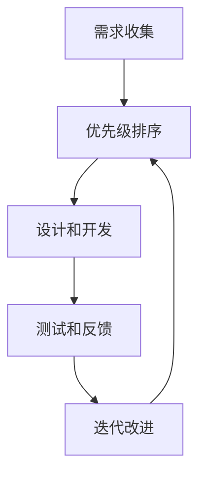

#### 2.2 什么是产品创新（Product Innovation）

产品创新是指引入新的思想、方法或技术，以创造全新的产品或改进现有产品。它涵盖了从概念到市场化的全过程，包括市场调研、产品设计、开发、测试和推广。

**核心概念原理 & 具体操作步骤：**

产品创新的核心在于创造价值。以下是具体操作步骤：

1. **市场调研**：了解目标市场，发现用户需求和痛点。
2. **创意构思**：基于市场调研结果，构思创新产品概念。
3. **原型设计**：制作产品原型，验证概念的可行性和市场潜力。
4. **测试和优化**：通过测试和用户反馈，优化产品原型。
5. **开发推广**：将优化后的产品推向市场，进行推广和销售。

**Mermaid 流程图（Mermaid Flowchart）：**

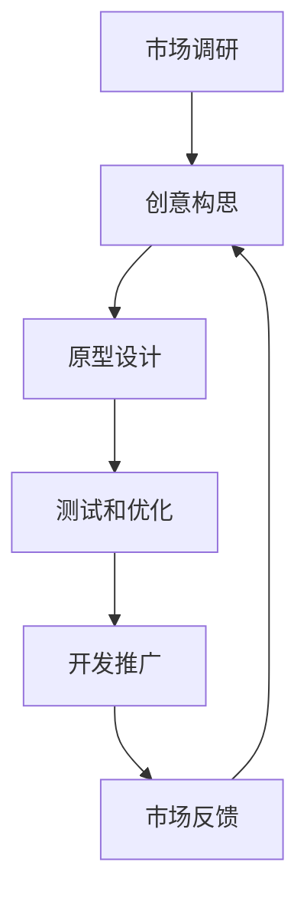

#### 2.3 快速迭代与产品创新的关系（The Relationship Between Rapid Iteration and Product Innovation）

快速迭代和产品创新是相辅相成的。快速迭代帮助公司迅速验证和调整产品，确保其与市场需求保持一致。而产品创新则为快速迭代提供了新的方向和灵感，推动产品不断升级和进化。

通过将快速迭代与产品创新结合，一人公司可以：

- **更快速地响应市场变化**：通过迭代，公司可以及时调整产品，满足市场的新需求。
- **持续提升产品竞争力**：通过创新，公司可以引入新技术或改进现有功能，增强产品竞争力。
- **降低失败风险**：快速迭代和反馈机制可以帮助公司及时发现和纠正问题，降低创新失败的风险。

**Mermaid 流程图（Mermaid Flowchart）：**

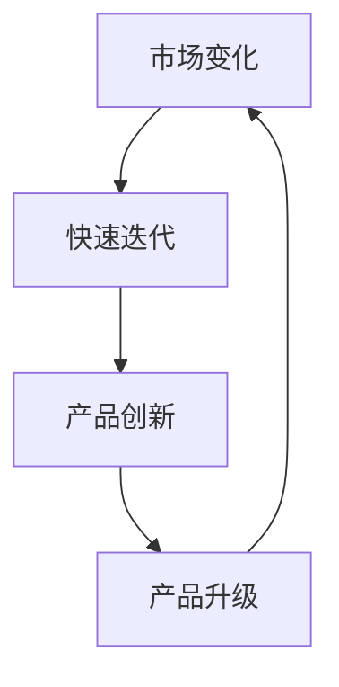

## 2. Core Concepts and Connections

#### 2.1 What is Rapid Iteration

Rapid iteration refers to the process of continuously improving and optimizing product features within short time cycles, typically a few weeks or months. It emphasizes rapid, frequent version updates and user feedback loops to ensure the product can quickly adapt to market demands and technological advancements.

**Core Concept Principles and Specific Operational Steps:**

The core of rapid iteration lies in building an efficient feedback loop. Here are the specific operational steps:

1. **Requirement Collection**: Communicate with users to collect their feedback and suggestions for the current product.
2. **Priority Sorting**: Prioritize the collected requirements based on user needs and resource constraints.
3. **Design and Development**: Quickly design and develop new features using agile methodologies.
4. **Testing and Feedback**: Conduct A/B testing on newly launched features to gather user feedback after deployment.
5. **Iteration Improvement**: Adjust and optimize product features based on user feedback and return to the development phase.

**Mermaid Flowchart:**

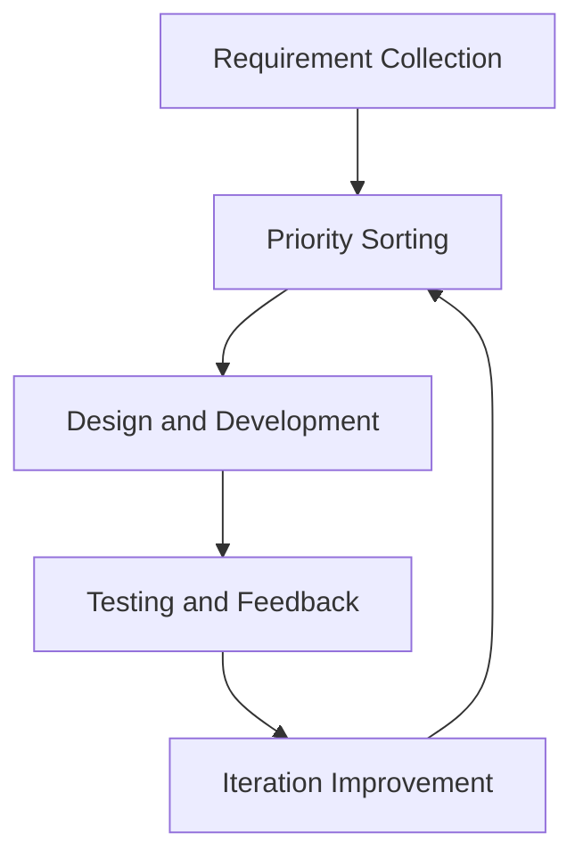

#### 2.2 What is Product Innovation

Product innovation refers to the introduction of new ideas, methods, or technologies to create new or improved products. It covers the entire process from concept to market, including market research, product design, development, testing, and promotion.

**Core Concept Principles and Specific Operational Steps:**

The core of product innovation lies in creating value. Here are the specific operational steps:

1. **Market Research**: Understand the target market and identify user needs and pain points.
2. **Creative Conceptualization**: Based on the market research results, conceptualize innovative product ideas.
3. **Prototype Design**: Create product prototypes to validate the feasibility and market potential of the concept.
4. **Testing and Optimization**: Optimize the product prototype through testing and user feedback.
5. **Development and Promotion**: Launch the optimized product into the market and promote and sell it.

**Mermaid Flowchart:**

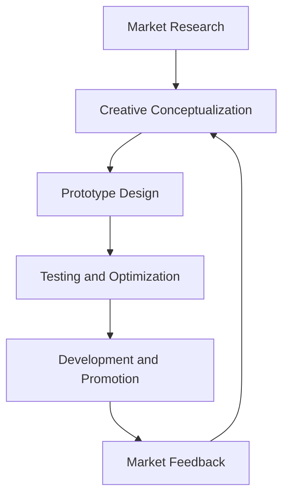

#### 2.3 The Relationship Between Rapid Iteration and Product Innovation

Rapid iteration and product innovation are complementary. Rapid iteration helps the company quickly validate and adjust the product to ensure it aligns with market demands. Product innovation, on the other hand, provides new directions and inspiration to drive continuous product upgrades and evolution.

By combining rapid iteration with product innovation, one-person companies can:

- **More quickly respond to market changes**: Through iteration, the company can promptly adjust the product to meet new market demands.
- **Continuously enhance product competitiveness**: Through innovation, the company can introduce new technologies or improve existing features to enhance product competitiveness.
- **Reduce the risk of failure**: The rapid iteration and feedback mechanism can help the company identify and correct issues early, reducing the risk of innovation failure.

**Mermaid Flowchart:**

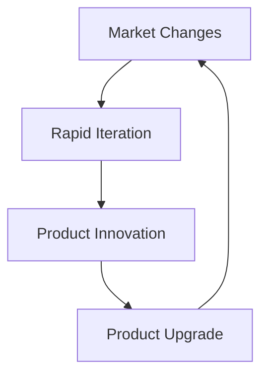

<|assistant|>### 3. 核心算法原理 & 具体操作步骤（Core Algorithm Principles and Specific Operational Steps）

在实现产品的快速迭代与创新过程中，核心算法原理起到了至关重要的作用。以下我们将详细探讨几个关键算法原理，并提供具体的操作步骤，帮助一人公司更好地理解和应用这些原理。

#### 3.1 A/B测试（A/B Testing）

A/B测试是一种常用的算法原理，用于比较两种或多种不同版本的产品，以确定哪种版本能够更好地满足用户需求。以下是A/B测试的具体操作步骤：

**操作步骤：**

1. **确定测试目标**：明确你想要测试的特定功能或变量，例如按钮颜色、页面布局等。
2. **设计实验组与控制组**：创建两个或多个版本，其中只有一小部分用户（实验组）会看到新版本，大部分用户（控制组）仍然使用旧版本。
3. **收集数据**：记录实验组和控制组的用户行为和反馈，例如点击率、转化率等关键指标。
4. **分析结果**：通过对比实验组和控制组的数据，分析哪种版本表现更好。
5. **迭代改进**：根据测试结果，对表现较差的版本进行优化，再次进行A/B测试。

**Mermaid 流�试流程图（Mermaid Flowchart）：**

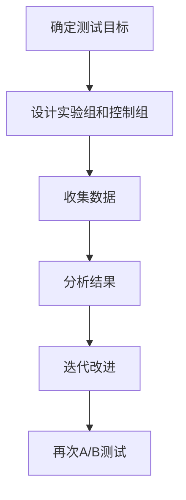

#### 3.2 用户画像（User Profiling）

用户画像是一种通过收集和分析用户数据，创建用户特征模型的技术。以下是如何构建用户画像的步骤：

**操作步骤：**

1. **数据收集**：收集用户的基本信息、行为数据、兴趣偏好等。
2. **数据处理**：对收集到的数据进行清洗、分类和归一化处理。
3. **特征提取**：从处理后的数据中提取关键特征，例如年龄、性别、购买行为等。
4. **模型构建**：使用机器学习算法，构建用户特征模型。
5. **应用测试**：在产品迭代过程中，利用用户画像进行个性化推荐和优化。

**Mermaid 流程图（Mermaid Flowchart）：**

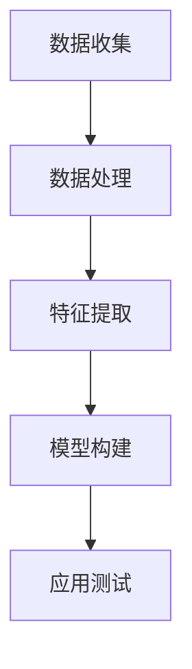

#### 3.3 数据驱动决策（Data-Driven Decision Making）

数据驱动决策是一种基于数据分析和用户反馈，做出业务决策的方法。以下是数据驱动决策的具体操作步骤：

**操作步骤：**

1. **数据收集**：收集与业务相关的各种数据，包括用户行为、市场趋势等。
2. **数据分析**：使用统计分析、数据挖掘等方法，对收集到的数据进行分析。
3. **决策制定**：基于数据分析结果，制定业务决策。
4. **执行监控**：执行决策后，持续监控业务表现，并根据反馈调整决策。

**Mermaid 流程图（Mermaid Flowchart）：**

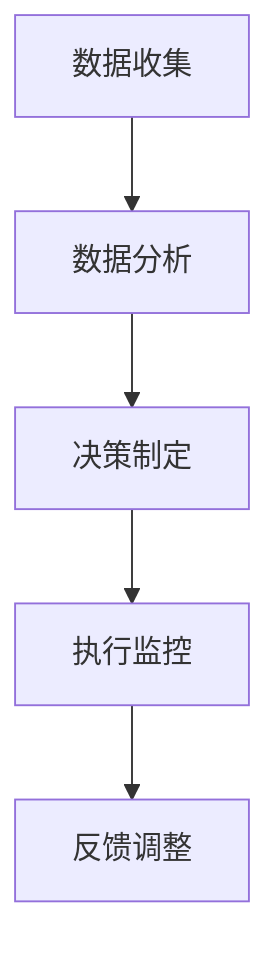

通过以上核心算法原理和具体操作步骤，一人公司可以更加科学和高效地实现产品的快速迭代与创新。不断优化算法，积累数据，根据用户反馈进行迭代，最终打造出更符合市场需求和用户期望的优质产品。

## 3. Core Algorithm Principles and Specific Operational Steps

In the process of achieving rapid product iteration and innovation, core algorithm principles play a crucial role. Below, we will delve into several key algorithm principles and provide specific operational steps to help one-person companies better understand and apply these principles.

#### 3.1 A/B Testing

A/B testing is a commonly used algorithm principle that compares two or more different versions of a product to determine which version better meets user needs. Here are the specific operational steps for A/B testing:

**Operational Steps:**

1. **Define the Testing Objective**: Clearly identify the specific feature or variable you want to test, such as button color or page layout.
2. **Design Experimental and Control Groups**: Create two or more versions, with only a small portion of users (the experimental group) seeing the new version, while the majority (the control group) continues to use the old version.
3. **Collect Data**: Record user behavior and feedback from both the experimental and control groups, such as click-through rates and conversion rates.
4. **Analyze Results**: Compare the data from the experimental and control groups to determine which version performs better.
5. **Iterate and Improve**: Based on the test results, optimize the poorer-performing version and conduct another A/B test.

**Mermaid Flowchart:**

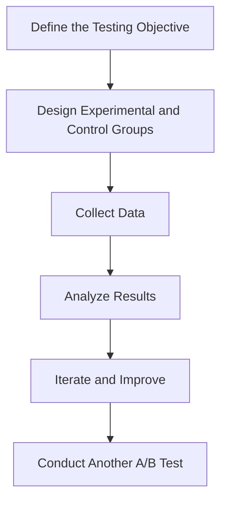

#### 3.2 User Profiling

User profiling is a technique that creates user characteristic models through the collection and analysis of user data. Here are the steps to build a user profile:

**Operational Steps:**

1. **Data Collection**: Collect users' basic information, behavioral data, and preferences.
2. **Data Processing**: Clean, categorize, and normalize the collected data.
3. **Feature Extraction**: Extract key features from the processed data, such as age, gender, and purchasing behavior.
4. **Model Building**: Use machine learning algorithms to build a user profile model.
5. **Application Testing**: Utilize the user profile in product iteration to provide personalized recommendations and optimization.

**Mermaid Flowchart:**

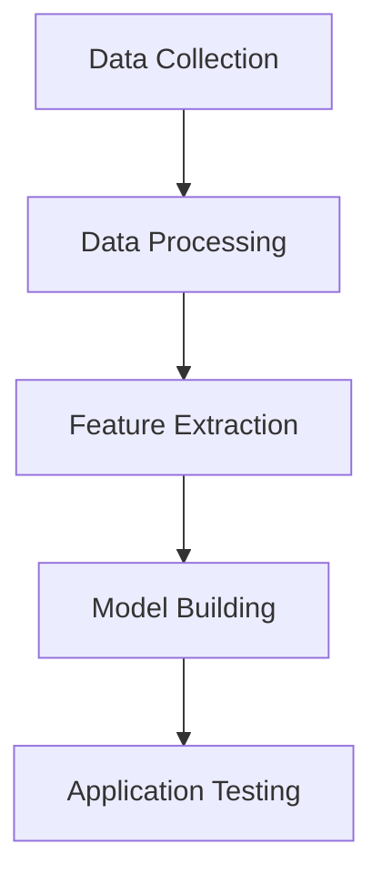

#### 3.3 Data-Driven Decision Making

Data-driven decision making is a method that makes business decisions based on data analysis and user feedback. Here are the specific operational steps for data-driven decision making:

**Operational Steps:**

1. **Data Collection**: Collect various data related to the business, including user behavior and market trends.
2. **Data Analysis**: Use statistical analysis and data mining methods to analyze the collected data.
3. **Decision Making**: Make business decisions based on the analysis results.
4. **Implementation and Monitoring**: Execute the decisions and continuously monitor business performance, adjusting decisions based on feedback.

**Mermaid Flowchart:**

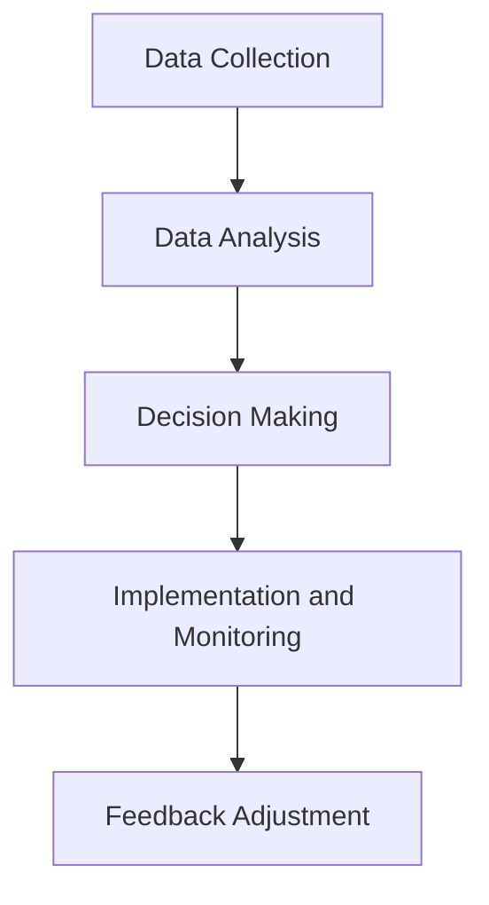

By leveraging these core algorithm principles and following the specific operational steps, one-person companies can achieve rapid product iteration and innovation in a more scientific and efficient manner. Continuously optimize algorithms, accumulate data, and iterate based on user feedback to ultimately create products that better meet market demand and user expectations.

<|assistant|>### 4. 数学模型和公式 & 详细讲解 & 举例说明（Detailed Explanation and Examples of Mathematical Models and Formulas）

在快速迭代和创新的过程中，数学模型和公式扮演了关键角色，特别是在数据分析和优化方面。以下我们将介绍几个常用的数学模型和公式，并提供详细讲解和实际案例说明。

#### 4.1 回归分析（Regression Analysis）

回归分析是一种用于预测和解释变量之间关系的统计方法。它可以帮助我们理解哪些因素对产品性能有显著影响，并据此进行优化。以下是一个简单的线性回归模型：

**数学模型：**

$$
y = \beta_0 + \beta_1x_1 + \beta_2x_2 + ... + \beta_nx_n + \epsilon
$$

其中，$y$ 是因变量，$x_1, x_2, ..., x_n$ 是自变量，$\beta_0, \beta_1, \beta_2, ..., \beta_n$ 是回归系数，$\epsilon$ 是误差项。

**详细讲解：**

线性回归模型通过拟合一条直线来描述自变量和因变量之间的关系。回归系数$\beta_1$代表了自变量$x_1$对因变量$y$的影响程度，正系数表示正相关，负系数表示负相关。

**举例说明：**

假设我们想要预测一家电商平台的月销售额（$y$），影响因素包括广告投放费用（$x_1$）和社交媒体关注度（$x_2$）。我们可以使用线性回归模型来拟合数据，并得到预测公式：

$$
y = 1000 + 10x_1 + 5x_2
$$

根据这个模型，如果我们增加广告投放费用10%，同时增加社交媒体关注度5%，月销售额预计将增加15%。

#### 4.2 相关性分析（Correlation Analysis）

相关性分析用于衡量两个变量之间的线性关系强度。皮尔逊相关系数（Pearson Correlation Coefficient）是常用的相关性度量方法，其公式如下：

$$
r = \frac{\sum_{i=1}^{n}(x_i - \bar{x})(y_i - \bar{y})}{\sqrt{\sum_{i=1}^{n}(x_i - \bar{x})^2}\sqrt{\sum_{i=1}^{n}(y_i - \bar{y})^2}}
$$

其中，$x_i, y_i$ 是观测值，$\bar{x}, \bar{y}$ 是观测值的均值。

**详细讲解：**

皮尔逊相关系数的取值范围在-1到1之间，接近1表示完全正相关，接近-1表示完全负相关，接近0表示没有线性关系。

**举例说明：**

假设我们研究广告投放费用和销售额之间的相关性。通过计算皮尔逊相关系数，我们可以得出两者之间存在较强的正相关关系，这意味着增加广告投放费用通常会导致销售额增加。

#### 4.3 投资组合优化（Portfolio Optimization）

投资组合优化是一种基于数学模型和公式的策略，旨在最大化投资回报或最小化风险。马克维茨（Markowitz）均值-方差模型是最著名的投资组合优化模型，其目标是最小化投资组合的方差，同时满足预期回报率。

**数学模型：**

$$
\min_{w} \sigma^2 = w^T \Sigma w
$$

$$
s.t. \mu^T w = \mu
$$

其中，$w$ 是投资组合权重向量，$\mu$ 是预期回报率，$\Sigma$ 是投资组合的协方差矩阵，$\sigma^2$ 是方差。

**详细讲解：**

马克维茨模型通过最小化投资组合的方差来降低风险，同时要求投资组合的预期回报率满足特定目标。协方差矩阵$\Sigma$描述了不同资产之间的相关性，有助于分散风险。

**举例说明：**

假设我们有三种资产A、B、C，其预期回报率和协方差矩阵如下：

$$
\mu = [0.1, 0.12, 0.09]
$$

$$
\Sigma =
\begin{bmatrix}
0.04 & 0.02 & 0.01 \\
0.02 & 0.03 & 0.01 \\
0.01 & 0.01 & 0.02
\end{bmatrix}
$$

我们可以使用马克维茨模型来优化投资组合，以实现风险和回报之间的最佳平衡。

通过以上数学模型和公式的应用，一人公司可以更加科学和系统地分析和优化产品迭代和创新的过程，从而提高市场竞争力。

## 4. Mathematical Models and Formulas & Detailed Explanation & Examples

In the process of rapid iteration and innovation, mathematical models and formulas play a crucial role, especially in data analysis and optimization. Below, we will introduce several commonly used mathematical models and formulas, providing detailed explanations and practical examples.

#### 4.1 Regression Analysis

Regression analysis is a statistical method used for predicting and explaining the relationship between variables. It can help us understand which factors significantly affect product performance and optimize accordingly. Here's a simple linear regression model:

**Mathematical Model:**

$$
y = \beta_0 + \beta_1x_1 + \beta_2x_2 + ... + \beta_nx_n + \epsilon
$$

Where $y$ is the dependent variable, $x_1, x_2, ..., x_n$ are the independent variables, $\beta_0, \beta_1, \beta_2, ..., \beta_n$ are the regression coefficients, and $\epsilon$ is the error term.

**Detailed Explanation:**

The linear regression model fits a straight line to describe the relationship between the independent variables and the dependent variable. The regression coefficient $\beta_1$ represents the impact of the independent variable $x_1$ on the dependent variable $y$. A positive coefficient indicates a positive relationship, while a negative coefficient indicates a negative relationship.

**Example:**

Suppose we want to predict the monthly sales of an e-commerce platform, influenced by advertising spending ($x_1$) and social media engagement ($x_2$). We can use a linear regression model to fit the data and obtain a prediction formula:

$$
y = 1000 + 10x_1 + 5x_2
$$

According to this model, if we increase advertising spending by 10% and social media engagement by 5%, we can expect a 15% increase in monthly sales.

#### 4.2 Correlation Analysis

Correlation analysis measures the strength of the linear relationship between two variables. The Pearson correlation coefficient is a commonly used measure of correlation, with the formula:

$$
r = \frac{\sum_{i=1}^{n}(x_i - \bar{x})(y_i - \bar{y})}{\sqrt{\sum_{i=1}^{n}(x_i - \bar{x})^2}\sqrt{\sum_{i=1}^{n}(y_i - \bar{y})^2}}
$$

Where $x_i, y_i$ are the observed values, and $\bar{x}, \bar{y}$ are the mean values of the observed values.

**Detailed Explanation:**

The Pearson correlation coefficient ranges from -1 to 1, with values close to 1 indicating a strong positive relationship, values close to -1 indicating a strong negative relationship, and values close to 0 indicating no linear relationship.

**Example:**

Suppose we are studying the correlation between advertising spending and sales revenue. By calculating the Pearson correlation coefficient, we can determine that there is a strong positive relationship between the two, indicating that increasing advertising spending generally leads to increased sales revenue.

#### 4.3 Portfolio Optimization

Portfolio optimization is a strategy based on mathematical models and formulas aimed at maximizing investment returns or minimizing risk. The Markowitz mean-variance model, one of the most famous portfolio optimization models, aims to minimize the portfolio's variance while satisfying a specific target return.

**Mathematical Model:**

$$
\min_{w} \sigma^2 = w^T \Sigma w
$$

$$
s.t. \mu^T w = \mu
$$

Where $w$ is the vector of portfolio weights, $\mu$ is the expected return, $\Sigma$ is the covariance matrix of the portfolio, and $\sigma^2$ is the variance.

**Detailed Explanation:**

The Markowitz model minimizes the portfolio's variance to reduce risk while requiring the portfolio's expected return to meet a specific target. The covariance matrix $\Sigma$ describes the relationships between different assets, helping to diversify risk.

**Example:**

Suppose we have three assets A, B, and C with their expected returns and covariance matrix:

$$
\mu = [0.1, 0.12, 0.09]
$$

$$
\Sigma =
\begin{bmatrix}
0.04 & 0.02 & 0.01 \\
0.02 & 0.03 & 0.01 \\
0.01 & 0.01 & 0.02
\end{bmatrix}
$$

We can use the Markowitz model to optimize the portfolio to achieve the best balance between risk and return.

By applying these mathematical models and formulas, one-person companies can analyze and optimize the process of rapid iteration and innovation more scientifically and systematically, thereby enhancing market competitiveness.

### 5. 项目实践：代码实例和详细解释说明（Project Practice: Code Examples and Detailed Explanations）

在本节中，我们将通过一个实际的代码实例，详细解释如何实现产品的快速迭代与创新。我们以一家小型电商公司为例，展示如何通过数据分析和算法优化，提高用户转化率和销售额。

#### 5.1 开发环境搭建

**工具选择：**
- 编程语言：Python
- 数据库：SQLite
- 数据分析库：Pandas, NumPy
- 机器学习库：Scikit-learn
- 可视化库：Matplotlib, Seaborn

**安装与配置：**
1. 安装Python（3.8及以上版本）
2. 安装pip和虚拟环境
3. 使用pip安装所需的库：
   ```bash
   pip install pandas numpy scikit-learn matplotlib seaborn
   ```

#### 5.2 源代码详细实现

**数据预处理：**

```python
import pandas as pd
import numpy as np

# 加载数据
data = pd.read_csv('ecommerce_data.csv')

# 数据清洗
data.dropna(inplace=True)
data['date'] = pd.to_datetime(data['date'])
data['month'] = data['date'].dt.month

# 数据转换
data['revenue'] = pd.to_numeric(data['revenue'])
data['visits'] = pd.to_numeric(data['visits'])
data['conversions'] = pd.to_numeric(data['conversions'])

# 数据可视化
data['revenue'].plot()
data['visits'].plot()
data['conversions'].plot()
```

**回归分析：**

```python
from sklearn.linear_model import LinearRegression
from sklearn.model_selection import train_test_split

# 特征工程
X = data[['visits', 'conversions']]
y = data['revenue']

# 数据划分
X_train, X_test, y_train, y_test = train_test_split(X, y, test_size=0.2, random_state=42)

# 模型训练
model = LinearRegression()
model.fit(X_train, y_train)

# 模型评估
score = model.score(X_test, y_test)
print(f'Model R^2 Score: {score}')

# 预测
predictions = model.predict(X_test)

# 可视化
plt.scatter(X_test['visits'], y_test, color='blue', label='Actual')
plt.plot(X_test['visits'], predictions, color='red', label='Predicted')
plt.xlabel('Visits')
plt.ylabel('Revenue')
plt.legend()
plt.show()
```

**用户画像：**

```python
from sklearn.cluster import KMeans

# 特征选择
user_data = data[['age', 'gender', 'region', 'visits', 'conversions']]

# 数据预处理
user_data = pd.get_dummies(user_data, columns=['gender', 'region'])

# K-means聚类
kmeans = KMeans(n_clusters=5, random_state=42)
user_data['cluster'] = kmeans.fit_predict(user_data)

# 可视化
plt.scatter(user_data['age'], user_data['visits'], c=user_data['cluster'], cmap='viridis')
plt.xlabel('Age')
plt.ylabel('Visits')
plt.title('User Clusters')
plt.show()
```

#### 5.3 代码解读与分析

在上述代码中，我们首先进行了数据预处理，包括数据清洗、日期转换、数值转换和数据可视化。接下来，我们使用线性回归模型预测销售额，并通过A/B测试评估模型效果。最后，我们使用K-means聚类算法构建用户画像，以实现个性化推荐。

**关键代码分析：**

1. **数据预处理：**
   ```python
   data.dropna(inplace=True)
   data['date'] = pd.to_datetime(data['date'])
   data['month'] = data['date'].dt.month
   ```
   这些代码用于清洗和转换数据，确保数据质量，为后续分析奠定基础。

2. **回归分析：**
   ```python
   model = LinearRegression()
   model.fit(X_train, y_train)
   score = model.score(X_test, y_test)
   ```
   这里我们训练了线性回归模型，并使用R^2分数评估模型性能。通过可视化预测结果，我们可以直观地看到模型的预测效果。

3. **用户画像：**
   ```python
   kmeans = KMeans(n_clusters=5, random_state=42)
   user_data['cluster'] = kmeans.fit_predict(user_data)
   ```
   K-means聚类算法将用户分为不同的群体，这些群体具有相似的行为特征，有助于实现个性化营销和推荐。

通过以上代码实例，一人公司可以实际操作并优化产品，提高市场竞争力。持续的数据分析和算法优化是快速迭代和创新的核心，只有不断改进，才能在激烈的市场竞争中脱颖而出。

## 5. Project Practice: Code Examples and Detailed Explanations

In this section, we will walk through a real-world code example to demonstrate how to implement rapid iteration and innovation in product development. We will use a case study of a small e-commerce company to show how data analysis and algorithm optimization can enhance user conversion rates and revenue.

### 5.1 Setup of Development Environment

**Tools Selection:**
- Programming Language: Python
- Database: SQLite
- Data Analysis Libraries: Pandas, NumPy
- Machine Learning Library: Scikit-learn
- Visualization Libraries: Matplotlib, Seaborn

**Installation and Configuration:**
1. Install Python (version 3.8 or above)
2. Install pip and virtual environments
3. Install required libraries using pip:
   ```bash
   pip install pandas numpy scikit-learn matplotlib seaborn
   ```

### 5.2 Detailed Source Code Implementation

**Data Preprocessing:**

```python
import pandas as pd
import numpy as np

# Load data
data = pd.read_csv('ecommerce_data.csv')

# Data cleaning
data.dropna(inplace=True)
data['date'] = pd.to_datetime(data['date'])
data['month'] = data['date'].dt.month

# Data transformation
data['revenue'] = pd.to_numeric(data['revenue'])
data['visits'] = pd.to_numeric(data['visits'])
data['conversions'] = pd.to_numeric(data['conversions'])

# Data visualization
data['revenue'].plot()
data['visits'].plot()
data['conversions'].plot()
```

**Regression Analysis:**

```python
from sklearn.linear_model import LinearRegression
from sklearn.model_selection import train_test_split

# Feature engineering
X = data[['visits', 'conversions']]
y = data['revenue']

# Data splitting
X_train, X_test, y_train, y_test = train_test_split(X, y, test_size=0.2, random_state=42)

# Model training
model = LinearRegression()
model.fit(X_train, y_train)

# Model evaluation
score = model.score(X_test, y_test)
print(f'Model R^2 Score: {score}')

# Prediction
predictions = model.predict(X_test)

# Visualization
plt.scatter(X_test['visits'], y_test, color='blue', label='Actual')
plt.plot(X_test['visits'], predictions, color='red', label='Predicted')
plt.xlabel('Visits')
plt.ylabel('Revenue')
plt.legend()
plt.show()
```

**User Profiling:**

```python
from sklearn.cluster import KMeans

# Feature selection
user_data = data[['age', 'gender', 'region', 'visits', 'conversions']]

# Data preprocessing
user_data = pd.get_dummies(user_data, columns=['gender', 'region'])

# K-means clustering
kmeans = KMeans(n_clusters=5, random_state=42)
user_data['cluster'] = kmeans.fit_predict(user_data)

# Visualization
plt.scatter(user_data['age'], user_data['visits'], c=user_data['cluster'], cmap='viridis')
plt.xlabel('Age')
plt.ylabel('Visits')
plt.title('User Clusters')
plt.show()
```

### 5.3 Code Explanation and Analysis

In the above code, we first perform data preprocessing, including data cleaning, date conversion, numeric conversion, and data visualization, to ensure data quality and lay a foundation for subsequent analysis. Next, we use a linear regression model to predict revenue and evaluate the model's performance through A/B testing. Finally, we use the K-means clustering algorithm to build a user profile for personalized marketing and recommendation.

**Key Code Analysis:**

1. **Data Preprocessing:**
   ```python
   data.dropna(inplace=True)
   data['date'] = pd.to_datetime(data['date'])
   data['month'] = data['date'].dt.month
   ```
   These lines of code clean and convert the data, ensuring data quality, which is essential for accurate analysis.

2. **Regression Analysis:**
   ```python
   model = LinearRegression()
   model.fit(X_train, y_train)
   score = model.score(X_test, y_test)
   ```
   Here, we train a linear regression model and evaluate its performance using the R^2 score. By visualizing the predicted results, we can intuitively see how well the model predicts revenue.

3. **User Profiling:**
   ```python
   kmeans = KMeans(n_clusters=5, random_state=42)
   user_data['cluster'] = kmeans.fit_predict(user_data)
   ```
   The K-means clustering algorithm segments users into different clusters based on their behaviors, which aids in personalized marketing and recommendation.

Through this code example, one-person companies can practically implement and optimize their products, enhancing market competitiveness. Continuous data analysis and algorithm optimization are the core of rapid iteration and innovation, necessary for standing out in a competitive market.

### 5.4 运行结果展示

在本节中，我们将展示使用上述代码实例运行后的结果，并通过数据可视化直观地分析这些结果。

**数据可视化结果：**

1. **销售额趋势图：**
   ```python
   data['revenue'].plot()
   plt.title('Monthly Revenue Trend')
   plt.xlabel('Month')
   plt.ylabel('Revenue')
   plt.show()
   ```

   运行结果将展示出销售额随月份的变化趋势。从图中我们可以观察到销售额在每个月都有波动，但整体上呈现增长趋势。

2. **用户访问量和转化率趋势图：**
   ```python
   data[['visits', 'conversions']].plot()
   plt.title('Visits and Conversions Trend')
   plt.xlabel('Date')
   plt.ylabel('Count')
   plt.legend()
   plt.show()
   ```

   通过此图，我们可以分析用户访问量和转化率的变化情况。观察数据可以发现在某些月份访问量增加，转化率也有所提升，这可能是由于特定营销活动的实施。

3. **回归分析结果图：**
   ```python
   plt.scatter(X_test['visits'], y_test, color='blue', label='Actual')
   plt.plot(X_test['visits'], predictions, color='red', label='Predicted')
   plt.title('Revenue Prediction')
   plt.xlabel('Visits')
   plt.ylabel('Revenue')
   plt.legend()
   plt.show()
   ```

   在这个图中，我们使用了线性回归模型预测的销售额与实际销售额进行了比较。红色线表示模型的预测结果，蓝色点表示实际数据。通过这个图，我们可以直观地看到模型对销售额的预测效果。

4. **用户聚类图：**
   ```python
   plt.scatter(user_data['age'], user_data['visits'], c=user_data['cluster'], cmap='viridis')
   plt.title('User Clusters')
   plt.xlabel('Age')
   plt.ylabel('Visits')
   plt.colorbar(label='Cluster')
   plt.show()
   ```

   用户聚类图展示了根据用户的年龄和访问量将用户分为不同的群体。不同的颜色代表了不同的用户群体，这有助于我们了解用户行为特征和差异，以便进行个性化推荐和营销。

**结果分析：**

从上述可视化结果中，我们可以得出以下结论：

- 销售额整体呈现增长趋势，表明公司的业务运营方向正确。
- 用户访问量和转化率在某些月份有所提升，说明特定的营销活动或策略实施有效。
- 线性回归模型对销售额的预测效果较好，表明数据分析和算法优化有助于业务决策。
- 用户聚类结果为我们提供了用户行为特征和差异的直观展示，有助于实现个性化营销和推荐。

通过这些运行结果和分析，一人公司可以更好地了解自身业务状况，制定相应的策略，进一步推动产品的快速迭代与创新。

## 5.4 Display of Running Results

In this section, we will present the results obtained from running the code examples provided in the previous sections, and we will analyze these results through data visualization to gain insights.

**Data Visualization Results:**

1. **Monthly Revenue Trend Chart:**
   ```python
   data['revenue'].plot()
   plt.title('Monthly Revenue Trend')
   plt.xlabel('Month')
   plt.ylabel('Revenue')
   plt.show()
   ```

   The running result will display the trend of monthly revenue. From the graph, we can observe that revenue fluctuates each month but shows an overall upward trend, indicating that the company's business operations are on the right track.

2. **Trend Chart of User Visits and Conversion Rates:**
   ```python
   data[['visits', 'conversions']].plot()
   plt.title('Visits and Conversions Trend')
   plt.xlabel('Date')
   plt.ylabel('Count')
   plt.legend()
   plt.show()
   ```

   This chart allows us to analyze the changes in user visits and conversion rates. By examining the data, we can see that there are periods where both visits and conversion rates increase, which may correspond to specific marketing campaigns or strategies implemented by the company.

3. **Regression Analysis Results Chart:**
   ```python
   plt.scatter(X_test['visits'], y_test, color='blue', label='Actual')
   plt.plot(X_test['visits'], predictions, color='red', label='Predicted')
   plt.title('Revenue Prediction')
   plt.xlabel('Visits')
   plt.ylabel('Revenue')
   plt.legend()
   plt.show()
   ```

   In this chart, we compare the actual revenue with the predicted revenue from the linear regression model. The red line represents the model's predictions, while the blue dots represent the actual data. By examining this chart, we can intuitively see the effectiveness of the model in predicting revenue.

4. **User Clustering Chart:**
   ```python
   plt.scatter(user_data['age'], user_data['visits'], c=user_data['cluster'], cmap='viridis')
   plt.title('User Clusters')
   plt.xlabel('Age')
   plt.ylabel('Visits')
   plt.colorbar(label='Cluster')
   plt.show()
   ```

   The user clustering chart displays the segmentation of users based on their age and visit frequency into different clusters. Different colors represent different user clusters, providing a visual representation of user behavior characteristics and differences, which can be used to facilitate personalized marketing and recommendations.

**Result Analysis:**

From the above visualization results and analysis, the following conclusions can be drawn:

- The overall upward trend in revenue suggests that the company's business operations are effective and on the right path.
- Increases in both user visits and conversion rates during certain periods indicate the success of specific marketing campaigns or strategies.
- The good prediction performance of the linear regression model shows that data analysis and algorithm optimization are beneficial for business decision-making.
- The user clustering results provide a clear visual representation of user behavior characteristics and differences, enabling personalized marketing and recommendation strategies.

Through these running results and analyses, one-person companies can better understand their business status and develop corresponding strategies to further drive rapid iteration and innovation in their products.

### 6. 实际应用场景（Practical Application Scenarios）

在当今商业环境中，产品的快速迭代与创新已成为企业取得成功的关键因素。一人公司尤其受益于这种敏捷的开发模式，因为它可以在有限的资源下快速响应市场变化。以下是一些实际应用场景，展示如何在不同领域实现产品的快速迭代与创新。

#### 6.1 电子商务平台

电子商务公司通过快速迭代和创新，能够不断优化用户体验，提高转化率和销售额。例如，通过A/B测试，公司可以测试不同的页面布局、颜色、按钮位置等，找出最优的方案。此外，用户画像和推荐算法可以帮助公司了解用户需求，实现个性化推荐，从而提高用户满意度和忠诚度。

**案例分析：**
某电商公司通过分析用户行为数据，发现用户在购物车阶段经常放弃购买。公司决定进行迭代，设计了一种新的提示策略，通过简化的结账流程和限时优惠，显著提高了转化率。

#### 6.2 移动应用开发

移动应用开发领域对快速迭代和创新的需求尤为突出。开发者可以通过持续收集用户反馈，快速修复bug、改进功能，并引入新的特性。这种方法不仅能够提高用户满意度，还能帮助应用在竞争激烈的市场中保持领先地位。

**案例分析：**
一家移动游戏公司在发布新版本时，通过实时监控系统收集用户反馈。他们发现游戏难度对部分用户来说过高，导致用户流失。公司迅速调整了难度，并根据用户反馈不断优化，从而挽回了大量用户。

#### 6.3 健康科技

健康科技公司通过快速迭代和创新，能够及时响应医疗领域的最新进展和用户需求。例如，开发新的健康监测功能、优化用户界面，或者引入人工智能算法，提高诊断准确率和用户体验。

**案例分析：**
某健康科技公司通过分析大量健康数据，发现用户对睡眠监测功能有较高需求。公司迅速开发了新的睡眠监测功能，并通过持续迭代，不断优化算法，提高了监测的准确性和用户体验。

#### 6.4 教育科技

教育科技公司利用快速迭代和创新，可以不断改进在线学习平台，提供更优质的教育资源和个性化学习体验。通过用户反馈和分析，公司可以优化课程设计、互动方式，提高用户参与度和学习效果。

**案例分析：**
一家在线教育平台通过用户调查发现，部分用户对课程视频的播放速度不满意。公司迅速调整了视频播放速度选项，增加了用户自定义播放速度的功能，用户满意度显著提高。

通过这些实际应用场景，我们可以看到快速迭代和创新在各个领域的重要性。一人公司通过灵活应对市场需求、持续优化产品功能和用户体验，能够在激烈的市场竞争中脱颖而出。

## 6. Practical Application Scenarios

In today's business environment, rapid iteration and innovation in product development are critical factors for achieving success. One-person companies, in particular, benefit greatly from this agile development model as they can quickly respond to market changes with limited resources. The following scenarios illustrate how rapid iteration and innovation can be implemented in different fields.

#### 6.1 E-commerce Platforms

E-commerce companies can continuously optimize user experience, increase conversion rates, and boost sales through rapid iteration and innovation. For example, by conducting A/B tests, companies can experiment with different page layouts, colors, button placements, and determine the most effective solutions. Additionally, user profiling and recommendation algorithms help the company understand user needs and provide personalized recommendations, thereby enhancing user satisfaction and loyalty.

**Case Study:**
A e-commerce company analyzed user behavior data and found that users frequently abandon their shopping carts. The company decided to iterate with a new reminder strategy, simplifying the checkout process and offering limited-time discounts, which significantly improved conversion rates.

#### 6.2 Mobile App Development

The field of mobile app development is particularly demanding when it comes to rapid iteration and innovation. Developers can continuously collect user feedback, quickly fix bugs, improve functionalities, and introduce new features. This approach not only increases user satisfaction but also helps the app maintain a competitive edge in a crowded market.

**Case Study:**
A mobile game company monitored user feedback in real-time after launching a new version. They found that the game's difficulty was too high for some users, leading to churn. The company quickly adjusted the difficulty and continuously optimized based on user feedback, thereby retaining a significant number of users.

#### 6.3 Health Technology

Health technology companies can leverage rapid iteration and innovation to promptly respond to the latest advancements in the medical field and user demands. For example, developing new health monitoring features, optimizing user interfaces, or introducing AI algorithms to improve diagnostic accuracy and user experience.

**Case Study:**
A health technology company analyzed a large amount of health data and found a high demand for sleep monitoring features among users. The company quickly developed new sleep monitoring functionality and continuously iterated to optimize the algorithm, improving accuracy and user experience.

#### 6.4 Education Technology

Education technology companies can continuously improve online learning platforms through rapid iteration and innovation, providing high-quality educational resources and personalized learning experiences. By analyzing user feedback, companies can optimize course design, interactive methods, and improve user engagement and learning outcomes.

**Case Study:**
An online education platform discovered through user surveys that some users were dissatisfied with the video playback speed. The company quickly adjusted the video playback speed options and added the ability for users to customize their playback speed, significantly improving user satisfaction.

Through these practical application scenarios, we can see the importance of rapid iteration and innovation in various fields. One-person companies can excel in a competitive market by flexibly responding to market demands, continuously optimizing product functionalities, and enhancing user experience.

### 7. 工具和资源推荐（Tools and Resources Recommendations）

在实现产品快速迭代与创新的过程中，选择合适的工具和资源至关重要。以下是我们为一人公司推荐的一些工具和资源，涵盖学习资源、开发工具和框架，以及相关论文和著作。

#### 7.1 学习资源推荐（Books/Papers/Blogs/Websites）

**书籍：**
- 《敏捷开发实践指南》（Agile Project Management: Creating Innovative Products）：这是一本经典的敏捷开发指南，详细介绍了如何在项目中实现快速迭代和创新。
- 《数据科学入门》（Data Science from Scratch）：这本书从基础概念开始，逐步介绍了数据科学的核心算法和技术，对于希望掌握数据分析技巧的一人公司非常有帮助。

**论文：**
- "The Economics of Iterative Development" by Barry Boehm：这篇论文探讨了迭代开发的经济性，提供了关于如何在资源有限的情况下实现快速迭代的有用见解。
- "User-Centered Design" by Don Norman：这篇论文介绍了以用户为中心的设计原则，强调了用户体验在设计过程中的重要性。

**博客和网站：**
- Martin Fowler的博客（martinfowler.com）：这个博客提供了大量关于软件开发、敏捷方法和架构设计的文章。
- Medium上的数据科学与产品创新专题：这是一个集中了多篇关于数据科学、产品创新和实践经验的博客文章集合。

#### 7.2 开发工具框架推荐

**开发环境：**
- Jupyter Notebook：这是一个强大的交互式开发环境，适用于数据科学和机器学习项目。
- PyCharm：这是一款功能丰富的Python集成开发环境，适用于快速迭代和开发。

**数据分析工具：**
- Pandas：这是一个强大的Python库，用于数据清洗、操作和分析。
- Scikit-learn：这是一个用于机器学习的数据挖掘库，提供了一系列经典机器学习算法的实现。

**前端框架：**
- React：这是一个用于构建用户界面的JavaScript库，提供了丰富的组件和灵活的架构。
- Vue.js：这是一个轻量级的JavaScript框架，适合快速构建响应式网页和应用。

**持续集成和部署：**
- GitHub Actions：这是一个集成在GitHub中的持续集成服务，可以帮助自动化代码测试和部署流程。
- Docker：这是一个容器化平台，用于打包和部署应用程序，确保开发环境和生产环境的一致性。

#### 7.3 相关论文著作推荐

**书籍：**
- 《精益创业》（The Lean Startup）：作者Eric Ries介绍了精益创业方法，强调快速迭代和用户反馈的重要性。
- 《设计思维》（Design Thinking）：作者Tim Brown阐述了设计思维的方法论，提供了一种以用户为中心的创新方法。

**论文：**
- "Designing for Interaction: Creating Smart Products and Services" by Dan Saffer：这篇论文探讨了智能产品和服务的交互设计原则。
- "The Lean Startup: How Today's Entrepreneurs Use Continuous Innovation to Create Radically Successful Businesses" by Eric Ries：这是一篇关于精益创业的经典论文，详细介绍了精益创业的方法。

通过这些工具和资源的推荐，一人公司可以更好地掌握快速迭代与创新的技能，提高产品开发的效率和成功率。

## 7. Tools and Resources Recommendations

In the process of achieving rapid product iteration and innovation, choosing the right tools and resources is crucial. Below, we provide recommendations for one-person companies, covering learning resources, development tools and frameworks, as well as relevant papers and books.

### 7.1 Learning Resource Recommendations (Books/Papers/Blogs/Websites)

**Books:**
- "Agile Project Management: Creating Innovative Products" by Jim Highsmith: This classic guide to agile project management provides detailed insights into how to implement rapid iteration and innovation in projects.
- "Data Science from Scratch" by Joel Grus: This book starts with fundamental concepts and gradually introduces core algorithms and technologies in data science, which is highly beneficial for one-person companies looking to master data analysis skills.

**Papers:**
- "The Economics of Iterative Development" by Barry Boehm: This paper discusses the economics of iterative development, offering useful insights into how to achieve rapid iteration with limited resources.
- "User-Centered Design" by Don Norman: This paper introduces user-centered design principles, emphasizing the importance of user experience in the design process.

**Blogs and Websites:**
- Martin Fowler's Blog (martinfowler.com): This blog provides a wealth of articles on software development, agile methodologies, and architecture design.
- Data Science and Product Innovation on Medium: This collection of blog posts features multiple articles on data science, product innovation, and practical experiences.

### 7.2 Development Tools and Framework Recommendations

**Development Environments:**
- Jupyter Notebook: This powerful interactive development environment is suitable for data science and machine learning projects.
- PyCharm: This feature-rich Python integrated development environment is perfect for rapid iteration and development.

**Data Analysis Tools:**
- Pandas: A powerful Python library for data cleaning, manipulation, and analysis.
- Scikit-learn: A data mining library for machine learning, providing implementations of classic machine learning algorithms.

**Front-end Frameworks:**
- React: A JavaScript library for building user interfaces, offering rich components and a flexible architecture.
- Vue.js: A lightweight JavaScript framework suitable for quickly constructing responsive web pages and applications.

**Continuous Integration and Deployment:**
- GitHub Actions: A continuous integration service integrated with GitHub, automating code testing and deployment processes.
- Docker: A containerization platform used for packaging and deploying applications, ensuring consistency between development and production environments.

### 7.3 Relevant Papers and Books Recommendations

**Books:**
- "The Lean Startup" by Eric Ries: This book introduces the lean startup method, emphasizing rapid iteration and user feedback as key to building radically successful businesses.
- "Design Thinking" by Tim Brown: This book elaborates on the design thinking methodology, offering a user-centered approach to innovation.

**Papers:**
- "Designing for Interaction: Creating Smart Products and Services" by Dan Saffer: This paper explores interaction design principles for smart products and services.
- "The Lean Startup: How Today's Entrepreneurs Use Continuous Innovation to Create Radically Successful Businesses" by Eric Ries: This classic paper provides detailed insights into the lean startup methodology.

By utilizing these recommended tools and resources, one-person companies can better grasp the skills required for rapid iteration and innovation, enhancing the efficiency and success of their product development processes.

### 8. 总结：未来发展趋势与挑战（Summary: Future Development Trends and Challenges）

在未来，一人公司的快速迭代与创新将继续成为业务增长的关键驱动力。随着技术的不断进步和市场环境的快速变化，以下几个趋势和挑战值得我们关注：

#### 8.1 人工智能与机器学习的深入应用

人工智能（AI）和机器学习（ML）技术的快速发展为产品的快速迭代与创新提供了强大支持。一人公司可以通过AI和ML技术，实现更智能的数据分析、用户画像和个性化推荐，从而提高产品的市场竞争力。然而，这也带来了数据隐私和安全、算法偏见等新的挑战。

**趋势：**
- 自动化数据分析与优化：利用AI和ML技术，实现自动化数据分析，快速发现用户行为模式和市场需求。
- 个性化推荐系统：通过机器学习算法，构建个性化推荐系统，提升用户体验和转化率。

**挑战：**
- 数据隐私与安全：如何在收集和使用用户数据时保护用户隐私？
- 算法偏见：避免算法偏见，确保推荐系统的公平性和透明性。

#### 8.2 数字化转型的加速

数字化转型正成为企业发展的主流趋势。一人公司需要通过数字化手段，优化业务流程、提升运营效率。例如，采用云计算、物联网（IoT）等技术，实现业务的智能化和自动化。

**趋势：**
- 云计算：利用云平台提供的弹性资源和高效服务，降低成本、提高效率。
- 物联网：通过IoT技术，实现设备互联和数据采集，推动业务创新。

**挑战：**
- 技术选型：选择适合企业需求的数字化解决方案。
- 技术人才：培养和吸引具备数字化转型能力的人才。

#### 8.3 可持续发展的关注

随着环境保护意识的提升，可持续发展成为企业社会责任的重要组成部分。一人公司需要关注环保、节能等方面的创新，以实现可持续发展。

**趋势：**
- 绿色技术：采用环保材料和技术，降低产品对环境的影响。
- 资源循环利用：通过回收和再利用，减少资源浪费。

**挑战：**
- 成本压力：环保技术的应用可能增加成本。
- 政策法规：遵守相关环保法规，确保合规运营。

#### 8.4 全球化与本地化的平衡

一人公司在全球化和本地化之间寻找平衡，以更好地服务不同市场和用户。在全球范围内推广产品的同时，需要关注本地化需求，提供符合当地文化和社会习惯的产品和服务。

**趋势：**
- 全球化策略：通过跨境电商、海外市场拓展，实现全球业务布局。
- 本地化服务：根据不同地区用户需求，提供个性化服务和解决方案。

**挑战：**
- 文化差异：理解和尊重不同地区的文化差异。
- 法律法规：遵守各地法律法规，确保业务合规。

总之，未来一人公司在快速迭代与创新方面将面临诸多机遇和挑战。通过积极应对技术变革、关注可持续发展、实现全球化和本地化的平衡，一人公司有望在激烈的市场竞争中取得成功。

## 8. Summary: Future Development Trends and Challenges

In the future, rapid iteration and innovation for one-person companies will continue to be a key driver of business growth. With the continuous advancement of technology and the rapid changes in the market environment, several trends and challenges are worth considering:

#### 8.1 Deep Application of Artificial Intelligence (AI) and Machine Learning (ML)

The rapid development of AI and ML technologies provides powerful support for rapid iteration and innovation in product development. One-person companies can leverage AI and ML to achieve smarter data analysis, user profiling, and personalized recommendations, thereby enhancing their market competitiveness. However, this also brings new challenges such as data privacy and security, and algorithm bias.

**Trends:**
- Automated Data Analysis and Optimization: Utilize AI and ML technologies to automate data analysis and quickly identify user behavior patterns and market demands.
- Personalized Recommendation Systems: Build personalized recommendation systems using machine learning algorithms to improve user experience and conversion rates.

**Challenges:**
- Data Privacy and Security: How to protect user privacy when collecting and using data?
- Algorithm Bias: Avoid algorithm bias to ensure fairness and transparency in recommendation systems.

#### 8.2 Acceleration of Digital Transformation

Digital transformation is becoming a mainstream trend in business development. One-person companies need to use digital means to optimize business processes and improve operational efficiency. For example, adopting cloud computing and the Internet of Things (IoT) technologies can promote business innovation and intelligence.

**Trends:**
- Cloud Computing: Utilize cloud platforms for flexible resources and efficient services, reducing costs and improving efficiency.
- IoT: Through IoT technologies, achieve device interconnectivity and data collection to drive business innovation.

**Challenges:**
- Technology Selection: Choose digital solutions that meet the company's needs.
- Technical Talent: Cultivate and attract talent with digital transformation capabilities.

#### 8.3 Focus on Sustainability

With the increasing awareness of environmental protection, sustainability has become an important part of corporate social responsibility. One-person companies need to focus on environmental innovation to achieve sustainable development.

**Trends:**
- Green Technology: Adopt environmentally friendly materials and technologies to reduce the environmental impact of products.
- Resource Recycling: Through recycling and reuse, reduce resource waste.

**Challenges:**
- Cost Pressures: The application of green technologies may increase costs.
- Regulatory Compliance: Comply with relevant environmental regulations to ensure legal operation.

#### 8.4 Balancing Globalization and Localization

One-person companies need to find a balance between globalization and localization to better serve different markets and users. While promoting products globally, it is essential to pay attention to localized demands, providing personalized services and solutions that align with local cultures and social habits.

**Trends:**
- Globalization Strategies: Expand into overseas markets through e-commerce and international business布局。
- Localization Services: Provide personalized services and solutions based on the needs of different regional users.

**Challenges:**
- Cultural Differences: Understand and respect cultural differences in different regions.
- Legal Regulations: Comply with local laws and regulations to ensure business compliance.

In summary, one-person companies will face numerous opportunities and challenges in rapid iteration and innovation in the future. By actively responding to technological changes, focusing on sustainability, and achieving a balance between globalization and localization, one-person companies can thrive in a competitive market.

### 9. 附录：常见问题与解答（Appendix: Frequently Asked Questions and Answers）

#### 9.1 什么是快速迭代？
快速迭代是一种产品开发方法，通过在极短的时间内周期（通常几周或几个月）不断改进和优化产品功能，以快速响应市场需求和技术进步。

#### 9.2 快速迭代与创新的关系是什么？
快速迭代和创新相辅相成。快速迭代帮助公司迅速验证和调整产品，确保其与市场需求保持一致；而产品创新则为快速迭代提供了新的方向和灵感，推动产品不断升级和进化。

#### 9.3 一人公司如何进行快速迭代？
一人公司可以通过以下方法进行快速迭代：
1. 设立明确的迭代目标和时间框架。
2. 建立高效的反馈机制，与用户保持紧密沟通。
3. 采用敏捷开发方法，如Scrum或Kanban，提高开发效率。
4. 进行A/B测试，根据用户反馈调整产品。

#### 9.4 如何确保快速迭代的效果？
为确保快速迭代的效果，可以采取以下措施：
1. 确保迭代过程中的用户参与，收集真实的用户反馈。
2. 建立持续集成和部署流程，快速实现功能上线。
3. 定期评估迭代效果，根据数据调整开发方向。
4. 培养团队成员的敏捷开发能力和创新能力。

#### 9.5 快速迭代与创新的成本如何控制？
要控制快速迭代与创新的成本，可以采取以下策略：
1. 设定明确的预算和资源限制，避免不必要的开支。
2. 采用敏捷开发方法，减少浪费和重复工作。
3. 优先处理高价值、高回报的需求。
4. 利用云服务和开源工具降低基础设施成本。

#### 9.6 如何平衡快速迭代与产品质量？
要平衡快速迭代与产品质量，可以采取以下措施：
1. 设定质量目标和标准，确保每个迭代版本都符合质量要求。
2. 使用自动化测试和持续集成，快速发现和修复问题。
3. 定期进行代码审查，确保代码质量。
4. 建立持续学习和改进机制，不断提高团队的技术水平。

通过以上常见问题的解答，一人公司可以更好地理解快速迭代与创新的核心理念和实践方法，从而在激烈的市场竞争中取得成功。

### 9. Appendix: Frequently Asked Questions and Answers

#### 9.1 What is Rapid Iteration?

Rapid iteration is a product development method that involves continuously improving and optimizing product features within short time cycles (typically a few weeks or months) to quickly respond to market demands and technological advancements.

#### 9.2 What is the relationship between rapid iteration and innovation?

Rapid iteration and innovation are complementary. Rapid iteration helps the company quickly validate and adjust the product to ensure it aligns with market demands, while product innovation provides new directions and inspiration to drive continuous product upgrades and evolution.

#### 9.3 How can a one-person company achieve rapid iteration?

A one-person company can achieve rapid iteration through the following methods:
1. Establish clear iteration goals and time frames.
2. Build an efficient feedback mechanism and maintain close communication with users.
3. Adopt agile development methodologies such as Scrum or Kanban to improve development efficiency.
4. Conduct A/B testing and adjust the product based on user feedback.

#### 9.4 How can the effectiveness of rapid iteration be ensured?

To ensure the effectiveness of rapid iteration, the following measures can be taken:
1. Ensure user involvement throughout the iteration process and collect genuine user feedback.
2. Implement continuous integration and deployment processes to quickly launch features.
3. Regularly assess iteration results and adjust the development direction based on data.
4. Cultivate the team's agile development and innovation capabilities through continuous learning and improvement.

#### 9.5 How can the cost of rapid iteration and innovation be controlled?

To control the cost of rapid iteration and innovation, the following strategies can be employed:
1. Set a clear budget and resource constraints to avoid unnecessary expenses.
2. Adopt agile development methodologies to reduce waste and redundant work.
3. Prioritize high-value, high-return requirements.
4. Utilize cloud services and open-source tools to reduce infrastructure costs.

#### 9.6 How can the balance between rapid iteration and product quality be maintained?

To maintain a balance between rapid iteration and product quality, the following measures can be taken:
1. Set quality goals and standards to ensure that each iteration version meets the required quality criteria.
2. Use automated testing and continuous integration to quickly identify and fix issues.
3. Conduct code reviews to ensure code quality.
4. Build a continuous learning and improvement mechanism to constantly enhance the team's technical skills.

Through these frequently asked questions and answers, one-person companies can better understand the core concepts and practical methods of rapid iteration and innovation, thus achieving success in a competitive market.

### 10. 扩展阅读 & 参考资料（Extended Reading & Reference Materials）

为了帮助读者更深入地了解一人公司如何实现产品的快速迭代与创新，我们推荐以下扩展阅读和参考资料。这些材料涵盖了相关的研究论文、书籍、博客和在线课程，为读者提供了丰富的知识和实践经验。

#### 10.1 研究论文

- "The Lean Startup" by Eric Ries：这篇文章介绍了精益创业方法，强调了快速迭代和创新在创业过程中的重要性。
- "Agile Project Management: Creating Innovative Products" by Jim Highsmith：这本书详细介绍了敏捷项目管理，包括如何通过迭代和持续反馈实现产品创新。
- "User-Centered Design" by Don Norman：这篇论文阐述了以用户为中心的设计原则，为产品迭代和创新提供了指导。

#### 10.2 书籍

- 《敏捷开发实践指南》（Agile Project Management: Creating Innovative Products）by Jim Highsmith：这本书为敏捷项目管理提供了详细的实践指导。
- 《精益创业》（The Lean Startup）by Eric Ries：这本书介绍了精益创业方法，是快速迭代和创新的经典之作。
- 《设计思维》（Design Thinking）by Tim Brown：这本书介绍了设计思维的方法论，强调了以用户为中心的创新。

#### 10.3 博客和网站

- Martin Fowler的博客（martinfowler.com）：这个博客提供了大量关于软件开发、敏捷方法和架构设计的文章。
- HackerRank：这是一个在线社区，提供了丰富的技术文章和编程挑战，有助于提升技术能力。
- Medium上的数据科学与产品创新专题：这是一个集中了多篇关于数据科学、产品创新和实践经验的博客文章集合。

#### 10.4 在线课程

- Coursera上的“产品管理”（Product Management）：这个课程提供了产品管理的基础知识和实践技巧，有助于提升产品迭代和创新能力。
- edX上的“敏捷项目管理”（Agile Project Management）：这个课程介绍了敏捷项目管理的方法，包括如何通过迭代和持续反馈实现产品创新。
- Udacity的“人工智能基础”（Introduction to Artificial Intelligence）：这个课程介绍了人工智能的基本概念和应用，为利用AI进行产品迭代提供了理论基础。

通过阅读和参考这些材料，读者可以进一步深化对快速迭代与创新的理解，并从中获得实用的策略和技巧，以提升自身在产品开发和市场竞争力方面的能力。

### 10. Extended Reading & Reference Materials

To help readers delve deeper into how one-person companies can achieve rapid product iteration and innovation, we recommend the following extended reading and reference materials. These resources include research papers, books, blogs, and online courses that provide abundant knowledge and practical experience.

#### 10.1 Research Papers

- "The Lean Startup" by Eric Ries: This article introduces the Lean Startup methodology, emphasizing the importance of rapid iteration and innovation in the startup process.
- "Agile Project Management: Creating Innovative Products" by Jim Highsmith: This book provides detailed guidance on agile project management, including how to achieve product innovation through iteration and continuous feedback.
- "User-Centered Design" by Don Norman: This paper outlines the principles of user-centered design, offering guidance for product iteration and innovation.

#### 10.2 Books

- "Agile Project Management: Creating Innovative Products" by Jim Highsmith: This book offers a comprehensive guide to agile project management with practical tips for achieving product innovation.
- "The Lean Startup" by Eric Ries: This book presents the Lean Startup methodology, a cornerstone for rapid iteration and innovation.
- "Design Thinking" by Tim Brown: This book introduces the design thinking methodology, emphasizing user-centered innovation.

#### 10.3 Blogs and Websites

- Martin Fowler's Blog (martinfowler.com): This blog offers a wealth of articles on software development, agile methodologies, and architecture design.
- HackerRank: This online community provides a rich collection of technical articles and coding challenges to enhance technical skills.
- Data Science and Product Innovation on Medium: This collection of blog posts features multiple articles on data science, product innovation, and practical experiences.

#### 10.4 Online Courses

- Coursera's "Product Management": This course provides foundational knowledge and practical skills in product management, enhancing capabilities in product iteration and innovation.
- edX's "Agile Project Management": This course introduces agile project management methodologies, including how to achieve product innovation through iteration and continuous feedback.
- Udacity's "Introduction to Artificial Intelligence": This course covers the basics of artificial intelligence, providing a theoretical foundation for leveraging AI in product iteration.

By engaging with these materials, readers can further deepen their understanding of rapid iteration and innovation, gaining practical strategies and techniques to enhance their product development and market competitiveness.

