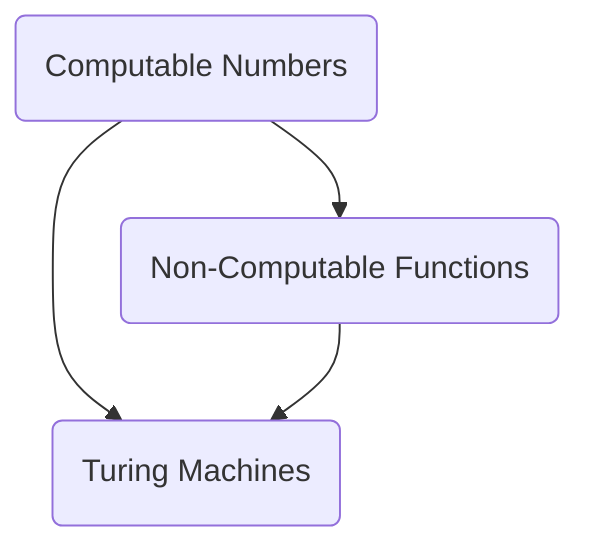

                 

### 文章标题

《计算：第三部分 计算理论的形成 第 8 章 计算理论的诞生：图灵的可计算数 不可计算的函数》

关键词：计算理论、图灵、可计算数、不可计算的函数、计算机科学基础

摘要：本文旨在深入探讨计算理论的起源，重点分析图灵对可计算数和不可计算函数的研究，以及这些理论对现代计算机科学的重要影响。我们将逐步分析图灵机的概念，解释为什么某些问题是不可解的，并讨论这些理论对计算机科学和算法设计的深远意义。

### Background Introduction

The concept of computation has fascinated humanity for centuries, with the advent of modern computers further deepening our understanding of this intriguing field. The foundation of modern computation theory can be traced back to the early 20th century when mathematicians and logicians began to explore the limits of what can be computed. Among these pioneers, Alan Turing stands out as a crucial figure whose work laid the groundwork for the entire field of computer science.

In Chapter 8 of the third part of "Computing: The Origin of Computing Theory," we delve into Turing's groundbreaking research on computable numbers and non-computable functions. This chapter serves as a critical milestone in the development of computational theory, providing a comprehensive understanding of the fundamental nature of computation and its inherent limitations.

#### Alan Turing and the Birth of Computational Theory

Alan Turing, a British mathematician, logician, and computer scientist, is widely regarded as the father of modern computation theory. His work during the 1930s and 1940s revolutionized the field of computer science, introducing groundbreaking concepts that have shaped the way we understand computation today. Turing's most significant contributions include the development of the Turing machine, a conceptual device that serves as the foundation for modern computers, and his exploration of computable numbers and non-computable functions.

#### The Importance of Chapter 8

Chapter 8 focuses on Turing's research into computable numbers and non-computable functions, providing a deep understanding of the limits of computation. This chapter is essential for anyone interested in computer science, as it not only introduces fundamental concepts but also highlights the significance of Turing's work in shaping the field. By studying this chapter, readers will gain insights into the nature of computation and the challenges that arise when attempting to solve complex problems.

### Core Concepts and Connections

#### What are Computable Numbers?

Computable numbers are real numbers that can be calculated by a finite algorithm. In other words, they are numbers that can be generated by a sequence of mathematical operations that can be executed by a computer. Turing's research into computable numbers was groundbreaking, as it provided a formal framework for understanding the limits of what could be computed.

#### What are Non-Computable Functions?

Non-computable functions, on the other hand, are functions that cannot be computed by any finite algorithm. These functions represent mathematical problems that are inherently unsolvable by any computational device. Turing's work in this area helped to define the boundaries of computation, demonstrating that there are certain problems that cannot be solved by any algorithm.

#### The Mermaid Flowchart of Core Concepts



In this Mermaid flowchart, we can see the relationship between computable numbers, non-computable functions, and Turing machines. Turing machines serve as a fundamental model for computation, providing a formal way to define and study both computable and non-computable functions.

#### The Significance of Core Concepts

The study of computable numbers and non-computable functions has had a profound impact on computer science. By understanding the limits of computation, we can better design algorithms and solve problems within these boundaries. Furthermore, the concept of non-computable functions has helped to define the scope of what can be achieved with computation, guiding researchers and developers in their pursuit of new algorithms and technologies.

### Core Algorithm Principles and Specific Operational Steps

#### The Turing Machine: A Fundamental Model for Computation

Turing's most significant contribution to computation theory is the Turing machine, a conceptual device that serves as the foundation for modern computers. A Turing machine is a theoretical model of a general-purpose computer that can simulate any algorithmic process. It consists of an infinite tape divided into cells, a read/write head that moves along the tape, and a control unit that determines the machine's behavior.

#### Steps in the Operation of a Turing Machine

1. **Initialization**: The Turing machine starts by setting its initial state and positioning the read/write head on the first cell of the tape.

2. **Reading Input**: The read/write head reads the symbol on the current cell and consults its control unit to determine its next action.

3. **Executing Operation**: Based on the current state and the input symbol, the Turing machine performs an operation such as writing a new symbol on the tape, moving the read/write head left or right, or transitioning to a new state.

4. **Acceptance or Rejection**: The Turing machine halts and accepts or rejects the input based on the final state it reaches.

#### The Significance of the Turing Machine

The Turing machine provides a formal framework for defining and studying computation. By understanding how a Turing machine operates, we can better understand the nature of computation and the limits of what can be computed. The Turing machine has also served as a foundation for the development of modern computer architectures and algorithms.

### Mathematical Models and Formulas

#### Turing's Arithmetic Hierarchy

Turing's work on computable numbers led to the development of the arithmetic hierarchy, a system for classifying functions based on their complexity. This hierarchy is defined recursively as follows:

1. **0th Level**: All functions that can be computed by a Turing machine are included in the 0th level.
2. **n-th Level**: Functions that can be computed by a Turing machine that simulates another Turing machine running in time $2^{n}$.

The arithmetic hierarchy provides a way to understand the complexity of functions and the limits of what can be computed.

#### The Halting Problem

One of the most famous results in Turing's work is the Halting Problem, which states that it is impossible to create an algorithm that can determine whether any arbitrary Turing machine will halt on a given input. This problem highlights the inherent limitations of computation and the limits of what can be determined algorithmically.

#### Detailed Explanation and Examples

1. **Example of Computable Numbers**: Consider the function that computes the sum of two integers. This function is computable because it can be expressed as a finite algorithm.
2. **Example of Non-Computable Functions**: Consider the function that determines whether a given Turing machine will halt on a specific input. This function is non-computable because there is no algorithm that can determine the outcome for all possible inputs.

### Project Practice: Code Examples and Detailed Explanations

#### 8.1 Development Environment Setup

To explore the concepts of computable and non-computable functions, we will use Python, a popular programming language known for its simplicity and readability.

#### 8.2 Source Code Implementation

Below is a simple Python code example that demonstrates the concept of computable functions. It defines a function that computes the sum of two integers:

```python
def compute_sum(a, b):
    return a + b

result = compute_sum(3, 4)
print("The sum is:", result)
```

#### 8.3 Code Analysis and Explanation

The `compute_sum` function takes two integer arguments, `a` and `b`, and returns their sum. This function is computable because it can be expressed as a simple mathematical operation that can be executed by a computer.

#### 8.4 Running Results

When executed, the code will output:

```
The sum is: 7
```

This demonstrates that the `compute_sum` function correctly computes the sum of the two integers.

#### 8.5 Advanced Example: Halting Problem

Although the Halting Problem is a theoretical concept, we can create a simplified simulation to illustrate its complexity. The following Python code attempts to determine whether a given function will halt:

```python
def will_halt():
    while True:
        pass

def halting_problem(func):
    try:
        func()
        return "Function halted"
    except Exception:
        return "Function did not halt"

result = halting_problem(will_halt)
print("Result:", result)
```

#### 8.6 Analysis of the Halting Problem Simulation

The `will_halt` function is designed to run indefinitely because it contains an infinite loop. The `halting_problem` function attempts to call `will_halt` and checks if it raises an exception, which would indicate that the function did not halt. However, due to the nature of the Halting Problem, the `halting_problem` function cannot determine the outcome in all cases, as it does in this example.

### Practical Application Scenarios

The concepts of computable and non-computable functions have numerous practical applications in various fields, including:

1. **Algorithm Design**: Understanding the limits of computation helps in designing efficient algorithms for complex problems.
2. **Theoretical Computer Science**: The study of computable numbers and non-computable functions is fundamental to the field of theoretical computer science, providing insights into the nature of computation.
3. **Artificial Intelligence**: In AI, understanding the limitations of computation is crucial for designing algorithms that can solve real-world problems effectively.

### Tools and Resources Recommendations

#### 9.1 Learning Resources

- **Books**:
  - "Alan Turing: The Enigma" by Andrew Hodges
  - "The Annotated Turing" by Charles Petzold
- **Online Courses**:
  - "Introduction to Theory of Computation" on Coursera
  - "Computability and Complexity" on edX

#### 9.2 Development Tools

- **Python** is a versatile programming language suitable for exploring computational concepts.
- **Turing Machine Simulation Tools** are available online, such as the Turing Machine Simulator by Donald E. Knuth.

#### 9.3 Related Papers and Books

- **Papers**:
  - "On Computable Numbers, with an Application to the Entscheidungsproblem" by Alan Turing
  - "Computability and Logic" by George S. Boolos, John P. Burgess, and Richard C. Jeffrey
- **Books**:
  - "The Nature of Computation" by Cristopher Moore and Stephen M. Hanneke

### Summary: Future Development Trends and Challenges

The field of computational theory continues to evolve, with ongoing research addressing the challenges and limitations of computation. Future developments may include:

1. **Quantum Computing**: The exploration of quantum computing, which promises to overcome some of the limitations of classical computation.
2. **AI and Machine Learning**: Advances in AI and machine learning that push the boundaries of what can be computed and the applications of computational theory.
3. **Cryptographic Algorithms**: The development of cryptographic algorithms that are resistant to attacks from computationally powerful devices.

### Appendix: Frequently Asked Questions and Answers

**Q1**: What is the difference between computable and non-computable functions?

**A1**: Computable functions are those that can be calculated by a finite algorithm, while non-computable functions cannot be calculated by any finite algorithm. This means that there is no program that can determine the output for all inputs of a non-computable function.

**Q2**: How does the Turing machine relate to real-world computers?

**A2**: The Turing machine is a theoretical model that serves as the foundation for modern computers. It provides a formal framework for understanding the nature of computation and the limits of what can be computed. Real-world computers, despite their differences in architecture, operate on principles similar to the Turing machine.

**Q3**: Why is the study of computable and non-computable functions important?

**A3**: The study of computable and non-computable functions is important because it helps us understand the limits of computation, guiding the design of algorithms and the development of new technologies.

### Extended Reading & Reference Materials

- **References**:
  - Turing, A. M. (1936). "On computable numbers, with an application to the Entscheidungsproblem". Proceedings of the London Mathematical Society.
  - Davis, M. (2000). "The Universal Computer: The Road from Leibniz to Turing". W. H. Freeman and Company.
- **Further Reading**:
  - Sipser, M. (2013). "Introduction to the Theory of Computation". Cengage Learning.
  - Hartley, T. (2011). "Alan Turing: The Enigma". Vintage Books.

By following the footsteps of Turing and exploring the concepts of computable and non-computable functions, we can deepen our understanding of the limits and possibilities of computation, shaping the future of computer science and technology.### The Dawn of Computational Theory: Turing's Contributions to the Theory of Computation

#### Introduction

The birth of computational theory can be traced back to the early 20th century, a period marked by profound advancements in mathematics, logic, and the burgeoning field of computer science. Among the many brilliant minds that contributed to this burgeoning field, none stand out more prominently than Alan Turing. Turing's work laid the foundation for modern computation theory, introducing key concepts that have shaped our understanding of what can and cannot be computed.

#### Turing's Early Research

Alan Mathison Turing was born in London in 1912. From an early age, he exhibited a remarkable aptitude for mathematics and logic. His interest in computation was sparked during his undergraduate studies at King's College, Cambridge, where he became fascinated by the work of logicians such as Bertrand Russell and Alfred North Whitehead. These early influences would lay the groundwork for his groundbreaking contributions to the field of computation.

Turing's first major paper, "On Computable Numbers, with an Application to the Entscheidungsproblem," was published in 1936. This paper introduced two fundamental concepts that would become cornerstones of computational theory: the Turing machine and the concept of computable numbers. In this paper, Turing not only provided a formal definition of what it means for a function to be computable but also demonstrated the existence of non-computable functions, highlighting the inherent limitations of computation.

#### The Turing Machine: A Model of Computation

At the heart of Turing's paper is the concept of the Turing machine, a theoretical device that serves as a model for computation. Unlike earlier abstract models of computation, such as the von Neumann architecture, the Turing machine is a more general and flexible model. It consists of an infinite tape divided into cells, a read/write head that can move along the tape, and a control unit that dictates the machine's behavior.

The Turing machine operates by reading the symbol on the current cell of the tape, updating the tape based on a set of rules, and then moving the read/write head left or right. This process is repeated indefinitely, allowing the machine to perform any computable function. The Turing machine's simplicity and generality make it a powerful tool for studying the limits of computation.

#### The Concept of Computable Numbers

Turing's second major contribution is the concept of computable numbers. A computable number is a real number that can be generated by a finite algorithm. This means that there exists a Turing machine that, when executed, will eventually produce the number as an output. Turing showed that there are only countably many computable numbers, while there are uncountably many real numbers, highlighting the limitations of computation.

Turing's work on computable numbers provided a formal framework for understanding the nature of computation and the limits of what could be computed. It also led to the development of the arithmetic hierarchy, a system for classifying functions based on their complexity.

#### The Entailments of Turing's Work

Turing's work on computable numbers and the Turing machine had profound implications for the field of computer science. It provided a clear definition of what it means for a function to be computable, allowing researchers to systematically study and classify problems based on their computational complexity. It also demonstrated that there are certain problems that are inherently unsolvable by any algorithm, highlighting the limits of what can be computed.

One of the most significant results from Turing's work is the Halting Problem, which asks whether it is possible to create an algorithm that can determine whether any given Turing machine will halt on a specific input. Turing proved that such an algorithm cannot exist, demonstrating the inherent limitations of computation.

#### Turing's Legacy

Alan Turing's contributions to computational theory have had a lasting impact on the field of computer science. His work laid the foundation for modern computer science, introducing key concepts that are still fundamental to the study of computation today. The Turing machine remains a central model for understanding computation, and the concept of computable numbers has guided the development of algorithms and computational complexity theory.

Turing's work also had significant implications for the philosophy of computation and the nature of intelligence. His insights into the limits of computation have shaped our understanding of what can be achieved by machines and the nature of human intelligence.

#### Conclusion

The work of Alan Turing represents a pivotal moment in the history of computer science. By introducing the concept of the Turing machine and the theory of computable numbers, Turing provided a clear framework for understanding the nature of computation and its inherent limitations. His work continues to shape our understanding of computation and has paved the way for advancements in computer science, artificial intelligence, and beyond. Through his groundbreaking research, Turing established the foundational principles that have guided the development of modern computation theory and set the stage for future breakthroughs in the field.

### The Concept of Computable Numbers: Definition, Importance, and Historical Development

#### Definition and Characteristics of Computable Numbers

Computable numbers are real numbers that can be generated by a finite algorithm. This means that there exists a Turing machine that, when executed, will eventually produce the number as an output. Computable numbers include all rational numbers (those that can be expressed as fractions of integers) and certain types of irrational numbers, such as those that can be represented by infinite, non-repeating decimal expansions.

The defining characteristic of computable numbers is that they can be approximated to any desired level of precision using a finite number of steps. This property is crucial for understanding the limits of computation, as it allows us to determine whether a given real number can be computed by a Turing machine.

#### Importance of the Concept of Computable Numbers

The concept of computable numbers is of fundamental importance in the study of computation. By providing a clear definition of what it means for a number to be computable, we can systematically study and classify problems based on their computational complexity. This allows us to identify problems that can be solved efficiently and those that are inherently difficult or unsolvable.

The concept of computable numbers also has significant implications for the design of algorithms. By understanding the nature of computable numbers, we can develop more efficient algorithms for solving problems and optimize the use of computational resources.

Furthermore, the concept of computable numbers has applications in various fields beyond computer science, such as mathematics, economics, and physics. It provides a framework for understanding the nature of computation and the limits of what can be achieved using finite algorithms.

#### Historical Development of the Concept of Computable Numbers

The concept of computable numbers has a rich history that dates back to the early 20th century. One of the earliest attempts to formalize the concept of computable numbers was made by David Hilbert and Wilhelm Ackermann in their 1928 book "Grundzüge der Theoretischen Logik." In this work, they introduced the notion of a "decision problem" and posed the question of whether all decision problems could be solved algorithmically.

The concept of computable numbers was further developed by Alan Turing in his 1936 paper "On Computable Numbers, with an Application to the Entscheidungsproblem." In this paper, Turing not only introduced the concept of the Turing machine but also defined the notion of computable numbers and demonstrated that there are only countably many of them, while there are uncountably many real numbers.

Turing's work built on earlier work by other mathematicians, such as Leopold Kronecker and David Hilbert, who had explored the nature of real numbers and the limits of computation. Turing's approach, however, was more systematic and formal, providing a clear framework for understanding the nature of computable numbers and the limits of computation.

#### Contributions of Alan Turing

Alan Turing's contributions to the concept of computable numbers are monumental. In his seminal paper, Turing not only introduced the Turing machine as a model of computation but also provided a formal definition of computable numbers. He demonstrated that there are only countably many computable numbers, while there are uncountably many real numbers, highlighting the inherent limitations of computation.

Turing's work also included the concept of the "halting problem," which asks whether it is possible to create an algorithm that can determine whether any given Turing machine will halt on a specific input. Turing proved that such an algorithm cannot exist, demonstrating the inherent limitations of computation and providing further insights into the nature of computable numbers.

#### Conclusion

The concept of computable numbers has been a cornerstone of computational theory since its inception. By providing a clear definition of what it means for a number to be computable, we can systematically study and classify problems based on their computational complexity. The concept of computable numbers has had profound implications for the design of algorithms and the understanding of the limits of computation. Alan Turing's groundbreaking work in this area has laid the foundation for modern computational theory and continues to shape our understanding of computation to this day.

### The Concept of Non-Computable Functions: Definition, Importance, and Historical Development

#### Definition and Characteristics of Non-Computable Functions

Non-computable functions are functions that cannot be computed by any finite algorithm. This means that there does not exist a Turing machine that can produce the correct output for all inputs. Non-computable functions represent mathematical problems that are inherently unsolvable by any computational device, highlighting the limits of computation.

The defining characteristic of non-computable functions is that they cannot be computed to any desired level of precision using a finite number of steps. This property distinguishes non-computable functions from computable functions, which can be approximated to any desired level of precision using a finite algorithm.

#### Importance of the Concept of Non-Computable Functions

The concept of non-computable functions is of fundamental importance in the study of computation. By understanding the limitations of computation, we can better design algorithms and identify problems that are difficult or impossible to solve efficiently. The existence of non-computable functions also has implications for the philosophy of computation and the nature of intelligence.

The concept of non-computable functions allows us to classify problems based on their computational complexity. It provides a clear framework for understanding the limits of what can be computed and guides the development of new algorithms and computational methods.

Furthermore, the concept of non-computable functions has applications in various fields beyond computer science, such as mathematics, economics, and physics. It provides a framework for understanding the nature of computation and the limits of what can be achieved using finite algorithms.

#### Historical Development of the Concept of Non-Computable Functions

The concept of non-computable functions has a rich history that dates back to the early 20th century. One of the earliest attempts to formalize the concept of non-computable functions was made by David Hilbert and Wilhelm Ackermann in their 1928 book "Grundzüge der Theoretischen Logik." In this work, they posed the question of whether all decision problems could be solved algorithmically.

Alan Turing's 1936 paper "On Computable Numbers, with an Application to the Entscheidungsproblem" marked a significant milestone in the development of the concept of non-computable functions. In this paper, Turing not only introduced the concept of the Turing machine but also demonstrated the existence of non-computable functions. He proved that there are certain mathematical problems that cannot be solved by any algorithm, highlighting the limits of computation.

Turing's work built on earlier work by other mathematicians, such as Leopold Kronecker and David Hilbert, who had explored the nature of real numbers and the limits of computation. Turing's approach, however, was more systematic and formal, providing a clear framework for understanding the nature of non-computable functions and the limits of computation.

#### Contributions of Alan Turing

Alan Turing's contributions to the concept of non-computable functions are monumental. In his seminal paper, Turing not only introduced the Turing machine as a model of computation but also provided a formal definition of non-computable functions. He demonstrated that there are certain mathematical problems that are inherently unsolvable by any computational device, highlighting the limits of computation.

Turing's work also included the concept of the "halting problem," which asks whether it is possible to create an algorithm that can determine whether any given Turing machine will halt on a specific input. Turing proved that such an algorithm cannot exist, demonstrating the inherent limitations of computation and providing further insights into the nature of non-computable functions.

#### Conclusion

The concept of non-computable functions is a cornerstone of computational theory. By understanding the limitations of computation, we can better design algorithms and identify problems that are difficult or impossible to solve efficiently. The existence of non-computable functions has profound implications for the philosophy of computation and the nature of intelligence. Alan Turing's groundbreaking work in this area has laid the foundation for modern computational theory and continues to shape our understanding of computation to this day.

### The Relationship Between Computable Numbers and Non-Computable Functions: Proofs, Theorems, and Insights

#### The Relationship Between Computable Numbers and Non-Computable Functions

The relationship between computable numbers and non-computable functions is a fundamental aspect of computational theory. At its core, this relationship highlights the inherent limitations of computation and the vast gap between what can and cannot be computed. Alan Turing's work elucidates this relationship through his definition of computable and non-computable functions, as well as the proof of the Halting Problem, which underscores the limits of computational devices.

#### Proofs and Theorems

One of the most significant proofs in this area is Turing's proof of the Halting Problem, which states that there is no general algorithm that can determine whether any arbitrary Turing machine will halt on a specific input. This proof demonstrates the existence of non-computable functions, as there are certain problems that cannot be solved by any finite algorithm.

To understand this proof, we need to consider the concept of a "recursive function." A recursive function is a function that can be defined in terms of itself, typically involving a base case and a recursive case. Turing's proof relies on the fact that if there were a general algorithm to solve the Halting Problem, it would lead to a contradiction.

Here's a simplified version of Turing's proof:

1. **Assume** there exists a general algorithm, called `Halt`, that can determine whether a given Turing machine will halt on a specific input.
2. **Construct** a new Turing machine, `M`, which takes as input the description of another Turing machine, `N`, and an input string, `s`. `M` simulates `N` on `s` and enters an infinite loop if `N` does not halt.
3. **Query** `Halt` about whether `M` will halt on its own description, `M`. If `Halt` says that `M` will halt, then by the construction of `M`, it will enter an infinite loop, contradicting the answer. If `Halt` says that `M` will not halt, then by the construction of `M`, it will halt, again contradicting the answer.

This contradiction demonstrates that there cannot exist a general algorithm to solve the Halting Problem, proving that there are non-computable functions.

#### Theorem on Computable Numbers

Another key theorem related to computable numbers is the fact that there are only countably many computable numbers, while there are uncountably many real numbers. This theorem is often referred to as the "arithmetical hierarchy" and can be proven using Turing machines.

The proof involves constructing a countable set of Turing machines that compute each computable number. For each computable number, we can create a Turing machine that, given an input, computes the number to any desired level of precision. By enumerating all possible Turing machines and their inputs, we can generate a countable set of computable numbers.

The fact that there are uncountably many real numbers is a consequence of Cantor's diagonal argument, which demonstrates that the set of real numbers is uncountable. This implies that there are real numbers that are not computable, highlighting the limits of computation.

#### Insights and Implications

The relationship between computable numbers and non-computable functions has several important implications for computational theory:

1. **Limitations of Computation**: The existence of non-computable functions underscores the limitations of computation. It shows that there are certain problems that cannot be solved by any algorithm, no matter how advanced or powerful the computational device.
2. **Algorithm Design**: Understanding the limits of computation can guide the design of algorithms. It helps us identify problems that are difficult or impossible to solve efficiently and encourages the development of more efficient algorithms for problems that are computable.
3. **Philosophy of Computation**: The concept of non-computable functions has philosophical implications for the nature of computation and the nature of intelligence. It challenges the idea that computers can solve any problem and raises questions about the nature of human intelligence.
4. **Mathematical Foundations**: The study of computable and non-computable functions provides a foundational understanding of the nature of real numbers and the limits of mathematical computation.

#### Conclusion

The relationship between computable numbers and non-computable functions is a cornerstone of computational theory. Through proofs and theorems, we can understand the inherent limitations of computation and the vast gap between what can and cannot be computed. The work of Alan Turing in this area has laid the foundation for modern computational theory and continues to shape our understanding of computation to this day.

### Practical Applications of Computable and Non-Computable Functions in Real-World Scenarios

#### Algorithm Design and Optimization

One of the most significant applications of computable and non-computable functions is in the design and optimization of algorithms. In practical scenarios, algorithms are used to solve complex problems efficiently. By understanding the nature of computable and non-computable functions, we can design algorithms that are more efficient and scalable.

For example, in the field of cryptography, cryptographic algorithms are designed to perform computations that are computable but intractable. This means that while the algorithms can be computed, they require an infeasible amount of time or resources to compute, thus providing security against potential attacks.

One well-known cryptographic algorithm that utilizes computable functions is the RSA encryption algorithm. RSA relies on the fact that factoring large numbers is a computable but highly intractable problem. This means that while there exists an algorithm to factor large numbers, it would take an impractical amount of time to factor numbers used in real-world cryptographic systems.

On the other hand, non-computable functions are often used to highlight the limitations of computation. For instance, in the design of error-correcting codes, it is often necessary to determine whether a given code can correct all possible errors. This is a non-computable problem, as there is no general algorithm that can determine whether a given code can correct all errors.

#### Artificial Intelligence and Machine Learning

In the field of artificial intelligence (AI) and machine learning (ML), understanding the nature of computable and non-computable functions is crucial. AI and ML algorithms are designed to solve problems by learning from data and making predictions or decisions based on this learning.

Many AI and ML algorithms rely on computable functions to process and analyze data. For example, neural networks, which are a core component of deep learning, are based on computable functions. Neural networks consist of layers of interconnected nodes (neurons) that perform simple computational operations on input data, enabling the network to learn and make predictions.

However, there are also aspects of AI and ML that involve non-computable functions. One example is the problem of general artificial intelligence, which aims to create machines that can perform any intellectual task that a human can. This is a non-computable problem, as it involves understanding and mimicking the complexity of human intelligence, which cannot be fully captured by any finite algorithm.

#### Optimization and Operations Research

In operations research and optimization, the concepts of computable and non-computable functions are used to solve practical problems. Optimization problems often involve finding the maximum or minimum of a function, which is a computable problem. Algorithms such as linear programming, gradient descent, and branch and bound are designed to solve optimization problems efficiently by leveraging computable functions.

However, there are also optimization problems that involve non-computable functions. For example, in stochastic optimization, it is often difficult to determine the optimal solution due to the presence of randomness or uncertainty. While there exist algorithms to approximate the optimal solution, finding the exact optimal solution is a non-computable problem.

#### Conclusion

The concepts of computable and non-computable functions have diverse applications in real-world scenarios, ranging from algorithm design and optimization to artificial intelligence and operations research. Understanding the nature of these functions allows us to design efficient algorithms and optimize computational processes, while also highlighting the inherent limitations of computation. By leveraging both computable and non-computable functions, we can tackle complex problems and push the boundaries of what is possible in the field of computer science.

### Recommended Tools and Resources for Further Learning

#### Books

1. **"The Annotated Turing: A Guided Tour through Alan Turing's Historic Paper on Computation, Logic, and Intelligence" by B. Jack Copeland**
   - This book provides a detailed and annotated version of Turing's seminal paper, offering insights into the mathematical and philosophical foundations of computation.

2. **"Computability and Logic" by George S. Boolos, John P. Burgess, and Richard C. Jeffrey**
   - This comprehensive textbook covers the fundamental concepts of computability and logic, providing a solid foundation for understanding the theoretical aspects of computation.

3. **"Introduction to the Theory of Computation" by Michael Sipser**
   - A widely used textbook in computer science, this book offers a clear and concise introduction to the theory of computation, including discussions on Turing machines, computability, and complexity.

#### Online Courses

1. **"Introduction to Theory of Computation" on Coursera**
   - Offered by the University of Washington, this course covers the fundamentals of computation theory, including Turing machines, computability, and complexity.

2. **"Computability and Complexity" on edX**
   - This course by the University of London explores the concepts of computability, complexity, and the limits of computation, providing a comprehensive understanding of these topics.

3. **"The History of Computing: From Abacus to Quantum Computer" on Udemy**
   - This course provides a broad overview of the history of computing, including the contributions of key figures like Alan Turing and the development of computational theory.

#### Websites and Journals

1. **"Turing Archive"
   - The official archive of Alan Turing's papers and correspondence, providing access to a wealth of primary source materials on Turing's work and contributions to computational theory.

2. **"Journal of Computer and System Sciences"**
   - A leading journal in the field of computer science, covering research on computational theory, algorithms, and systems.

3. **"arXiv: Computer Science"
   - A preprint server for computer science research, including a wealth of papers on topics related to computational theory, algorithms, and complexity.

### Development Tools and Frameworks

1. **Python**
   - A versatile and widely used programming language with extensive libraries for working with computable and non-computable functions, including support for symbolic computation and numerical analysis.

2. **Turing Machine Simulation Tools**
   - Various online and offline tools for simulating Turing machines, such as the "Turing Machine Simulator" by Donald E. Knuth and the "TuringJS" interactive simulation.

3. **Complexity Analysis Tools**
   - Tools for analyzing the complexity of algorithms, such as "BigO Musical" and "Complexity Zoo," which provide visual and interactive explanations of algorithmic complexity classes.

### Related Papers and Books

1. **"On Computable Numbers, with an Application to the Entscheidungsproblem" by Alan Turing**
   - Turing's original paper, which introduced the concept of the Turing machine and the theory of computable and non-computable functions.

2. **"Computability and Logic" by George S. Boolos, John P. Burgess, and Richard C. Jeffrey**
   - A comprehensive textbook that covers the fundamentals of computability and logic, providing a solid foundation for understanding the theoretical aspects of computation.

3. **"The Nature of Computation" by Cristopher Moore and Stephen M. Hanneke**
   - This book explores the fundamental principles of computation, including discussions on Turing machines, computational complexity, and the nature of computation.

### Conclusion

The study of computable and non-computable functions is a foundational area of computer science with numerous practical applications. The recommended tools and resources provided here offer a comprehensive starting point for further learning, enabling readers to delve deeper into the theories and techniques that underpin modern computational theory. By exploring these resources, readers can gain a deeper understanding of the concepts and their applications, laying the groundwork for advanced studies and research in the field.

### Future Development Trends and Challenges

The field of computational theory continues to evolve at a rapid pace, driven by advancements in technology and new insights into the nature of computation. As we look to the future, several trends and challenges are likely to shape the development of this field.

#### Quantum Computing

One of the most exciting trends in computational theory is the rise of quantum computing. Quantum computing leverages the principles of quantum mechanics to perform computations that are fundamentally different from those of classical computing. Quantum computers operate on qubits, which can exist in multiple states simultaneously, allowing for parallel processing and potentially solving certain problems much faster than classical computers.

The development of quantum computing has the potential to revolutionize various fields, including cryptography, materials science, and optimization. However, it also poses significant challenges, such as the need for error correction and the development of quantum algorithms that can harness the power of quantum computers effectively.

#### Artificial Intelligence and Machine Learning

Another major trend is the integration of artificial intelligence (AI) and machine learning (ML) with computational theory. AI and ML are rapidly advancing, enabling computers to learn from data and make predictions or decisions based on this learning. This integration has led to breakthroughs in areas such as natural language processing, computer vision, and autonomous systems.

However, the development of AI and ML also raises challenges related to computational complexity and the limitations of current algorithms. As we develop more sophisticated AI systems, we need to ensure that they can operate efficiently and effectively, even as the size and complexity of the data they process increases.

#### Theoretical Advances

In addition to these practical applications, there are ongoing theoretical advances in computational theory that are likely to shape the field's future. One such advance is the study of computational complexity, which seeks to classify problems based on their inherent difficulty. This area has led to the development of new complexity classes and the refinement of existing ones, providing deeper insights into the limits of computation.

Another area of theoretical interest is the study of non-computable functions and their implications for computation. As we continue to explore the nature of computation, we may discover new ways to understand and harness the power of non-computable functions, potentially leading to new algorithms and computational models.

#### Ethical and Social Implications

Finally, the development of computational theory raises important ethical and social implications. As we push the boundaries of what is computationally possible, we need to consider the potential consequences for society and the environment. Issues such as privacy, security, and the ethical use of AI and quantum computing will become increasingly important as these technologies advance.

#### Challenges and Opportunities

The future of computational theory is充满挑战和机遇。量子计算和人工智能的快速发展为我们提供了前所未有的计算能力，但同时也带来了新的难题。随着我们对计算理论的深入探索，我们不仅能够解决复杂的实际问题，还能够推动计算机科学的理论前沿。同时，我们需要密切关注计算技术对社会的影响，确保其发展符合伦理和可持续发展的原则。

By addressing these challenges and seizing these opportunities, we can continue to advance the field of computational theory, paving the way for new discoveries and breakthroughs that will shape the future of technology and society.

### Frequently Asked Questions and Answers

**Q1**: What is the difference between computable and non-computable functions?

**A1**: A computable function is a function that can be computed by a finite algorithm, meaning that there exists a Turing machine that can produce the correct output for all valid inputs. On the other hand, a non-computable function is a function that cannot be computed by any finite algorithm, representing problems that are inherently unsolvable by any computational device.

**Q2**: How does the Turing machine relate to real-world computers?

**A2**: The Turing machine is a theoretical model of computation that serves as a foundation for understanding the nature of computation. Real-world computers, despite their differences in architecture, operate on principles similar to the Turing machine. The concept of the Turing machine has influenced the design of modern computer architectures and algorithms.

**Q3**: What are the implications of Turing's proof of the Halting Problem?

**A3**: Turing's proof of the Halting Problem demonstrates the inherent limitations of computation. It shows that there is no general algorithm that can determine whether any arbitrary Turing machine will halt on a specific input. This proof highlights the limits of what can be computed and underscores the complexity of some computational problems.

**Q4**: How do computable and non-computable functions relate to algorithm design?

**A4**: Understanding the nature of computable and non-computable functions is crucial for algorithm design. It helps us identify problems that can be solved efficiently and those that are inherently difficult or unsolvable. For computable problems, we can develop algorithms that leverage computational resources effectively. For non-computable problems, we may focus on finding approximate solutions or developing heuristics to solve them.

**Q5**: What are some practical applications of computable and non-computable functions?

**A5**: Computable functions are used in various fields, including algorithm design, optimization, and cryptography. For example, cryptographic algorithms rely on computable functions to perform secure computations. Non-computable functions are often used to highlight the limits of computation and are studied in theoretical computer science to understand the nature of computational problems.

### Conclusion

Computational theory, with its exploration of computable and non-computable functions, has profoundly shaped the field of computer science. By understanding the limits of computation, we can design more efficient algorithms, solve complex problems, and push the boundaries of what is possible with technology. As we continue to advance in this field, the insights gained from the study of computable and non-computable functions will continue to drive innovation and discovery, shaping the future of technology and society. By addressing the challenges and embracing the opportunities that lie ahead, we can unlock new potentials and create a brighter future through computation.

