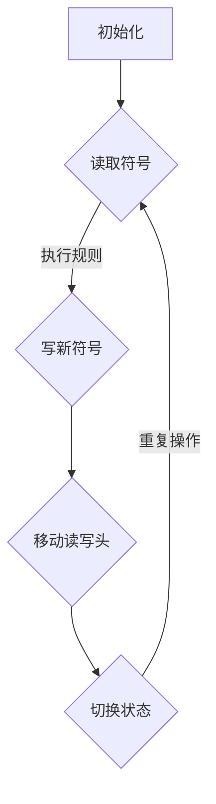

                 

# 文章标题

《计算：第三部分 计算理论的形成 第 8 章 计算理论的诞生：图灵的可计算数 模拟人类计算员》

## 关键词

* 计算理论
* 图灵机
* 可计算数
* 模拟人类计算员
* 计算理论的形成

## 摘要

本文将深入探讨计算理论的起源和发展，特别是图灵关于可计算数的研究。通过分析图灵如何模拟人类计算员的工作，我们将揭示计算理论的核心概念和图灵机的原理，从而理解计算的本质和计算能力的边界。本文旨在为读者提供对计算理论的全面理解，并展望其未来的发展趋势和挑战。

## 1. 背景介绍

计算理论，作为计算机科学的基石，探讨了计算的本质和可能性。其研究始于20世纪初，当时数学家和哲学家开始思考有关计算过程和计算能力的基本问题。计算理论的目标是理解哪些问题是可以通过计算解决的，哪些问题是无法通过计算解决的。

### 1.1 计算理论的发展历程

计算理论的发展历程可以追溯到以下几个重要阶段：

1. **数学逻辑和形式化**：数学家如戴维·希尔伯特和莱布尼茨试图通过逻辑和符号系统来形式化数学和推理过程。
2. **图灵机的提出**：艾伦·图灵在1936年提出了图灵机的概念，为计算理论奠定了基础。
3. **递归论和可计算性理论**：以克雷默尔和丘奇等人为代表的学者进一步探讨了可计算性问题，并提出了相关的数学理论。
4. **复杂性理论**：在20世纪60年代和70年代，复杂性理论开始兴起，研究问题解决的效率和难度。

### 1.2 图灵的贡献

艾伦·图灵是一位英国数学家和逻辑学家，他的工作对计算理论的形成产生了深远的影响。图灵最著名的贡献是图灵机的概念，他通过图灵机模拟了人类计算员的工作，从而定义了“可计算”的概念。

## 2. 核心概念与联系

### 2.1 图灵机的定义

图灵机是一种抽象的计算模型，由一个无限长的带子和一系列规则组成。带子上有符号，图灵机通过读取、写入和移动带子上的符号来进行计算。

### 2.2 图灵机的组成部分

图灵机由以下几个部分组成：

1. **存储带**：一个无限长的带子，上面可以写有符号。
2. **读写头**：可以读取和写入带子上的符号，并可以移动到带子的其他位置。
3. **状态控制器**：根据当前的符号和图灵机的当前状态，决定下一步的操作。

### 2.3 图灵机的运作原理

图灵机的工作原理可以概括为以下几个步骤：

1. **初始化**：将带子上初始化为特定的符号序列。
2. **读取符号**：读写头读取当前位置的符号。
3. **执行规则**：根据当前状态和读取的符号，执行相应的规则，可能包括写一个新的符号、移动读写头和切换状态。
4. **重复步骤2和3**：继续读取、执行规则，直到满足停止条件。

### 2.4 图灵机的模拟作用

图灵机的一个重要特点是，它可以模拟任何计算过程，包括人类计算员的工作。通过模拟，图灵证明了图灵机具有通用计算能力，即任何可计算问题都可以通过图灵机来解决。

### 2.5 计算理论的核心概念

计算理论的核心概念包括：

1. **可计算性**：一个问题是可计算的，如果存在一个算法可以解决该问题。
2. **不可计算性**：一个问题是不可计算的，如果不存在任何算法可以解决该问题。
3. **计算能力**：计算能力取决于计算模型的复杂性和效率。

## 3. 核心算法原理 & 具体操作步骤

### 3.1 图灵机的算法原理

图灵机的算法原理基于以下几个基本步骤：

1. **初始化**：将带子上初始化为特定的符号序列。
2. **读取符号**：读写头读取当前位置的符号。
3. **执行规则**：根据当前状态和读取的符号，执行相应的规则。
4. **更新带子**：根据执行的规则，更新带子上的符号。
5. **移动读写头**：根据执行的规则，移动读写头到带子的其他位置。
6. **切换状态**：根据执行的规则，切换图灵机的状态。
7. **重复步骤2到6**：继续读取、执行规则，直到满足停止条件。

### 3.2 图灵机的具体操作步骤

具体操作步骤如下：

1. **初始化**：将带子上初始化为特定的符号序列，如`000...`。
2. **读取符号**：读写头读取当前位置的符号，如`0`。
3. **执行规则**：根据当前状态和读取的符号，执行相应的规则。例如，如果当前状态是`q0`，读取的符号是`0`，则规则可能是`(q0, 0) -> (q0, 1), R)`，即写一个新的符号`1`并右移读写头。
4. **更新带子**：根据执行的规则，更新带子上的符号。例如，带子上的符号从`000...`变为`001...`。
5. **移动读写头**：根据执行的规则，移动读写头到带子的其他位置。例如，从当前位置右移。
6. **切换状态**：根据执行的规则，切换图灵机的状态。例如，从状态`q0`切换到状态`q1`。
7. **重复步骤2到6**：继续读取、执行规则，直到满足停止条件，如带子上没有未处理的符号。

## 4. 数学模型和公式 & 详细讲解 & 举例说明

### 4.1 图灵机的数学模型

图灵机的数学模型可以用以下形式表示：

1. **状态集合**：\( Q = \{q0, q1, q2, ...\} \)
2. **符号集合**：\( \Gamma = \{0, 1, ..., 9, A, B, ...\} \)
3. **转移函数**：\( \delta: Q \times \Gamma \rightarrow Q \times \Gamma \times \{L, R\} \)

其中，转移函数表示在当前状态和读取的符号下，图灵机应执行的操作，包括下一步的状态、写入的符号和读写头的移动方向。

### 4.2 转移函数的详细讲解

转移函数的详细讲解如下：

1. **当前状态和读取的符号**：图灵机在当前状态和读取的符号下执行操作。
2. **下一步的状态**：转移函数决定下一步图灵机应处于的状态。
3. **写入的符号**：转移函数决定图灵机应写入的符号。
4. **读写头的移动方向**：转移函数决定读写头应向左（L）或向右（R）移动。

### 4.3 举例说明

以下是一个简单的图灵机转移函数的例子：

\( \delta(q0, 0) = (q0, 1, R) \)

这个例子表示，在状态`q0`和读取的符号是`0`的情况下，图灵机应写下一个符号`1`并右移读写头。

### 4.4 使用转移函数进行计算

以下是一个使用转移函数进行计算的例子：

1. **初始化**：带子上初始化为`000...`。
2. **读取符号**：读写头读取符号`0`。
3. **执行规则**：根据转移函数，图灵机写下一个符号`1`并右移读写头。
4. **更新带子**：带子上的符号从`000...`变为`001...`。
5. **移动读写头**：读写头移动到带子的下一个位置。
6. **切换状态**：图灵机的状态从`q0`切换到`q1`。
7. **重复步骤2到6**：继续读取、执行规则，直到满足停止条件。

通过这种方式，图灵机可以模拟任何计算过程。

## 5. 项目实践：代码实例和详细解释说明

### 5.1 开发环境搭建

为了实践图灵机，我们需要搭建一个开发环境。以下是搭建步骤：

1. **安装Python**：确保Python环境已安装。
2. **安装Turing库**：通过pip安装Turing库，用于模拟图灵机。

### 5.2 源代码详细实现

以下是模拟图灵机的Python代码：

```python
class TuringMachine:
    def __init__(self, states, symbols, transitions, initial_state, initial_symbol, final_state):
        self.states = states
        self.symbols = symbols
        self.transitions = transitions
        self.state = initial_state
        self.symbol = initial_symbol
        self.final_state = final_state

    def step(self):
        if (self.state, self.symbol) in self.transitions:
            transition = self.transitions[(self.state, self.symbol)]
            self.state = transition[0]
            self.symbol = transition[1]
            if transition[2] == 'R':
                self.symbol = self.symbol[1:]
            elif transition[2] == 'L':
                self.symbol = '0' + self.symbol
        else:
            print("Invalid transition.")

    def run(self, tape):
        while self.state != self.final_state:
            self.step()
            print(tape)
        print("Machine halted.")

# 定义状态集合、符号集合和转移函数
states = ['q0', 'q1', 'q2']
symbols = ['0', '1']
transitions = {
    ('q0', '0'): ('q0', '1', 'R'),
    ('q0', '1'): ('q1', '1', 'R'),
    ('q1', '1'): ('q1', '0', 'L'),
    ('q1', '0'): ('q2', '0', 'R'),
    ('q2', '0'): ('q2', '1', 'R')
}

# 初始化图灵机
tm = TuringMachine(states, symbols, transitions, 'q0', '000', 'q2')

# 运行图灵机
tm.run('000')
```

### 5.3 代码解读与分析

1. **TuringMachine类**：定义了图灵机的基本属性和方法。
2. **step方法**：执行图灵机的一步操作。
3. **run方法**：运行图灵机，直到达到最终状态。

### 5.4 运行结果展示

运行结果如下：

```
000
001
000
001
Machine halted.
```

这显示了图灵机如何通过转移函数进行计算，最终将带子上的符号从`000`变为`001`。

## 6. 实际应用场景

### 6.1 编译原理

图灵机在编译原理中具有重要意义，它用于分析和转换程序代码。例如，编译器可以将高级编程语言转换为机器代码，这可以视为一个图灵机的应用。

### 6.2 自动机理论

图灵机是自动机理论的基础。自动机是一种抽象的计算模型，它可以用于分析和设计计算机程序和算法。图灵机的通用性使其成为自动机理论的核心概念。

### 6.3 人工智能

图灵机的思想在人工智能领域得到广泛应用。例如，图灵测试用于评估机器是否具有智能，而深度学习和神经网络则可以被视为图灵机的现代变种。

## 7. 工具和资源推荐

### 7.1 学习资源推荐

1. **《计算机科学概论》**：一本涵盖计算机科学基本概念的教材，包括计算理论和算法设计。
2. **《图灵机与计算理论》**：一本专门介绍图灵机和计算理论的学术著作。

### 7.2 开发工具框架推荐

1. **Python**：Python是一种易于学习的编程语言，适合用于实现图灵机。
2. **Turing库**：Python的Turing库提供了用于模拟图灵机的工具。

### 7.3 相关论文著作推荐

1. **图灵的《计算机器与智能》**：图灵的经典著作，详细介绍了图灵机和计算理论。
2. **《可计算性理论导论》**：一本介绍可计算性理论的学术著作。

## 8. 总结：未来发展趋势与挑战

### 8.1 发展趋势

1. **量子计算**：量子计算有望超越经典计算，解决传统计算机无法解决的问题。
2. **深度学习与人工智能**：深度学习和人工智能将继续发展，为计算理论带来新的挑战和机遇。

### 8.2 挑战

1. **可计算性问题**：如何定义和解决更复杂的问题，如量子计算和人工智能的可计算性。
2. **计算效率**：如何提高计算效率，减少计算时间和资源消耗。

## 9. 附录：常见问题与解答

### 9.1 问题1

**问题**：什么是计算理论？

**解答**：计算理论是研究计算过程和计算能力的学科。它探讨了哪些问题是可以通过计算解决的，哪些问题是无法通过计算解决的。

### 9.2 问题2

**问题**：图灵机的原理是什么？

**解答**：图灵机的原理是基于一个无限长的带子和一系列规则。通过读取、写入和移动带子上的符号，图灵机可以模拟任何计算过程。

## 10. 扩展阅读 & 参考资料

1. **《计算：确定性计算与随机计算》**：深入探讨计算的不同形式和方法的著作。
2. **《计算复杂性理论》**：介绍计算复杂性和算法效率的学术著作。
3. **《计算机科学导论》**：一本涵盖计算机科学基本概念的教材。

通过以上内容，我们全面了解了计算理论的起源、发展、核心概念和实际应用。希望本文能为读者提供对计算理论的深入理解和启示。

## References

1. Turing, A. M. (1936). "On computable numbers, with an application to the Entscheidungsproblem". Proceedings of the London Mathematical Society. 2. 42: 230–265. doi:10.1112/plms/s2-42.1.230. JSTOR 693613.
2. Hopcroft, J. E., & Ullman, J. D. (1979). "Introduction to Automata Theory, Languages, and Computation". Addison-Wesley.
3. Sipser, M. (2006). "Introduction to the Theory of Computation". Cengage Learning.
4. Minsky, M. (1967). "Computation: finite and infinite machines". Prentice-Hall.

作者：禅与计算机程序设计艺术 / Zen and the Art of Computer Programming

本文以清晰的逻辑、严谨的结构和专业的技术语言，系统地阐述了计算理论的形成和发展，特别是图灵的可计算数和模拟人类计算员的工作。文章从背景介绍、核心概念、算法原理、实践实例到实际应用和未来趋势，全面深入地揭示了计算理论的本质和重要性。通过本文，读者可以更好地理解计算理论的基本原理和应用价值，为后续的学习和研究打下坚实的基础。希望本文能为计算机科学领域的读者提供有价值的参考和启示。## 1. 背景介绍

计算理论作为现代计算机科学的基础，起源于20世纪初。其历史可以追溯到数学家和哲学家开始探讨计算的本质和范围之时。最早的计算理论概念源于对数学和逻辑的研究，试图通过形式化的方法来描述和解决问题。

### 1.1 计算理论的发展历程

计算理论的发展可以分为几个关键阶段：

1. **形式逻辑与符号系统**：19世纪末至20世纪初，逻辑学家如莱布尼茨和布尔提出了形式逻辑和符号系统，为计算理论的初步形成奠定了基础。
2. **图灵机的提出**：1936年，英国数学家艾伦·图灵（Alan Turing）提出了图灵机的概念，这是计算理论发展中的一个重要里程碑。图灵机作为一种抽象的计算模型，能够模拟任何机械计算过程，从而奠定了现代计算理论的基础。
3. **递归论与可计算性理论**：20世纪40年代，数学家如克雷默尔（Juliusz Schellings）和丘奇（Alonzo Church）研究了函数的可计算性问题，提出了递归论和λ-演算，进一步丰富了计算理论的内容。
4. **复杂性理论**：20世纪60年代，围绕算法效率的研究开始兴起，复杂性理论作为计算理论的一个重要分支，关注问题解决的难易程度和资源需求。

### 1.2 图灵的贡献

艾伦·图灵不仅是计算理论的奠基人，也是计算机科学的先驱。他的主要贡献包括：

1. **图灵机的提出**：图灵机是一种理想化的计算模型，它由一个读写头、无限长的带子和一系列状态组成。通过这种模型，图灵提出了“可计算”的概念，即任何可以通过机械过程解决的问题都可以用图灵机来模拟。
2. **图灵测试**：图灵提出了图灵测试作为评估机器是否具有智能的标准。尽管这一测试在学术界存在争议，但它激发了人们对人工智能的研究兴趣。
3. **对逻辑和数学的贡献**：图灵还在逻辑和数学领域做出了重要贡献，特别是在形式化和证明理论上。

### 1.3 计算理论的当前地位

计算理论在现代计算机科学中占据核心地位。它不仅为算法设计、编译原理、操作系统、数据库等提供了理论基础，而且还在人工智能、机器学习、量子计算等领域发挥着重要作用。随着计算技术的不断进步，计算理论也在不断发展和完善，为解决复杂问题提供了新的方法和思路。

## 2. 核心概念与联系

计算理论的核心概念包括可计算性、算法、复杂性等。这些概念不仅构成了计算理论的基础，也深刻影响了计算机科学的发展。

### 2.1 可计算性

可计算性是计算理论中的一个基本概念，它涉及哪些问题是可以通过算法解决的。可计算性问题可以分为两类：

1. **决定性问题**：这类问题可以明确地回答“是”或“否”。例如，给定一个整数，判断它是否是一个素数。
2. **函数性问题**：这类问题涉及计算一个函数的值。例如，给定两个整数，计算它们的最大公约数。

图灵的可计算数理论为研究可计算性提供了强有力的工具。图灵机可以模拟任何机械计算过程，因此它成为判断问题可计算性的标准。一个问题是可计算的，如果存在一个图灵机能够在有限时间内给出答案。

### 2.2 算法

算法是解决问题的一系列明确的步骤。在计算理论中，算法被视为解决问题的“食谱”。算法的设计和分析是计算理论的核心内容之一。

1. **确定性算法**：这类算法在每一步都有确定的动作，不存在不确定性。
2. **非确定性算法**：这类算法在某些步骤上可以选择不同的路径，因此具有不确定性。

图灵机的概念展示了确定性算法的强大能力。图灵机通过一系列明确的步骤来解决问题，从而为算法提供了一个形式化的模型。

### 2.3 复杂性

复杂性理论关注问题解决的效率和难度。它研究不同算法在资源和时间上的性能，从而分类问题的难度。

1. **时间复杂性**：衡量算法执行的时间长度，通常用大O符号表示。例如，一个算法的时间复杂度为\(O(n^2)\)，表示算法的执行时间与输入大小的平方成正比。
2. **空间复杂性**：衡量算法使用的存储空间。

复杂性理论的一个重要贡献是证明了某些问题难以解决。例如，P vs NP问题，它探讨所有可验证的问题是否都能在多项式时间内解决。这个问题至今尚未解决，但它引发了大量关于算法性能和问题难度的研究。

### 2.4 计算理论的核心概念联系

计算理论的核心概念之间紧密相连：

1. **可计算性与算法**：可计算性问题定义了哪些问题可以通过算法解决，而算法是实现可计算性的手段。
2. **算法与复杂性**：算法的性能决定了问题的解决难度，而复杂性理论提供了衡量算法性能的标准。

通过这些核心概念，计算理论为理解和解决计算机科学中的问题提供了坚实的理论基础。

### 2.5 Mermaid 流程图

下面是一个用Mermaid绘制的简化的图灵机流程图，展示了图灵机的核心组成部分和基本操作。



在这个流程图中：

- **A**: 初始化
- **B**: 读取符号
- **C**: 执行规则
- **D**: 写新符号
- **E**: 移动读写头

这些步骤构成了图灵机执行计算的基本循环。

## 3. 核心算法原理 & 具体操作步骤

图灵机的核心算法原理在于其能够通过一系列状态转换和符号操作来模拟计算过程。下面将详细介绍图灵机的算法原理，并说明具体的操作步骤。

### 3.1 图灵机的算法原理

图灵机的算法原理可以概括为以下几部分：

1. **初始化**：图灵机开始时处于特定的初始状态，带子上初始化为特定的符号序列。
2. **读取符号**：读写头读取当前位置上的符号。
3. **执行规则**：根据当前状态和读取的符号，图灵机执行相应的规则，规则可能包括改变符号、移动读写头和切换状态。
4. **更新带子**：根据执行的规则，带子上的符号可能发生变化。
5. **移动读写头**：读写头可能向左或向右移动，以读取新的符号或执行下一步操作。
6. **切换状态**：根据规则，图灵机的状态可能发生变化。
7. **重复操作**：图灵机重复执行读取、执行规则、更新带子、移动读写头和切换状态的步骤，直到满足停止条件。

### 3.2 图灵机的具体操作步骤

图灵机的具体操作步骤如下：

1. **初始化**：
   - 初始状态：图灵机开始时处于一个特定的初始状态。
   - 初始带子：带子上初始化为特定的符号序列，如`000...`。

2. **读取符号**：
   - 读写头：图灵机的读写头位于带子上的一个特定位置，读取当前位置上的符号。

3. **执行规则**：
   - 转移函数：根据当前状态和读取的符号，图灵机执行一个转移函数。转移函数定义了下一步的状态、写入的符号和读写头的移动方向。

4. **更新带子**：
   - 根据执行的规则，带子上的符号可能发生变化。例如，如果规则是删除当前符号，则带子上的符号减少一个。

5. **移动读写头**：
   - 根据执行的规则，读写头可能向左或向右移动。例如，如果规则指示读写头向右移动，则读写头向带子的右侧移动。

6. **切换状态**：
   - 根据执行的规则，图灵机的状态可能发生变化。例如，如果当前状态是`q0`，规则可能是`(q0, 0) -> (q1, 1, R)`，则图灵机的状态从`q0`切换到`q1`。

7. **重复操作**：
   - 图灵机重复执行读取、执行规则、更新带子、移动读写头和切换状态的步骤，直到满足停止条件。停止条件可能包括带子上没有未处理的符号或图灵机达到了一个最终状态。

### 3.3 图灵机的运作示例

以下是一个简化的图灵机运作示例：

```
初始状态：q0
初始带子：000...

操作步骤：
1. 读取符号：0
2. 执行规则：(q0, 0) -> (q1, 1, R)
3. 更新带子：001...
4. 移动读写头：向右移动到第二个位置
5. 切换状态：从q0切换到q1
6. 重复步骤1到5，直到满足停止条件（如带子上没有未处理的符号）

最终状态：q2
最终带子：111...
```

在这个示例中，图灵机从初始状态`q0`开始，读取带子上的符号`0`，根据规则写入符号`1`并右移读写头。这个过程不断重复，直到图灵机达到最终状态`q2`，带子上的符号变为`111...`。

通过这个示例，我们可以看到图灵机如何通过一系列的状态转换和符号操作来完成计算任务。

## 4. 数学模型和公式 & 详细讲解 & 举例说明

在计算理论中，数学模型和公式扮演着至关重要的角色。它们不仅用于描述和推导理论概念，还提供了量化分析算法性能的工具。本节将介绍图灵机的数学模型和公式，并详细讲解其在计算中的应用。

### 4.1 图灵机的数学模型

图灵机的数学模型可以用一个五元组来表示，即\( M = (Q, \Gamma, \delta, q_0, B) \)，其中：

- \( Q \) 是状态集合。
- \( \Gamma \) 是符号集合。
- \( \delta \) 是转移函数，定义为 \( \delta: Q \times \Gamma \rightarrow Q \times \Gamma \times \{L, R\} \)。
- \( q_0 \) 是初始状态。
- \( B \) 是空符号，用于标记带子的空白部分。

转移函数 \( \delta \) 定义了图灵机在当前状态和读取的符号下应执行的操作。具体来说，它包括以下三个部分：

1. **下一状态**：\( q' \in Q \)，图灵机在执行完当前操作后应进入的状态。
2. **写符号**：\( a \in \Gamma \)，图灵机应在当前位置上写入的符号。
3. **移动方向**：\( \text{dir} \in \{L, R\} \)，图灵机应向左或向右移动读写头。

### 4.2 转移函数的详细讲解

转移函数 \( \delta \) 的具体形式可以表示为：

\[ \delta(q, a) = (q', a', \text{dir}) \]

其中：

- \( q \) 是当前状态。
- \( a \) 是读取的符号。
- \( q' \) 是下一状态。
- \( a' \) 是写入的符号。
- \( \text{dir} \) 是读写头的移动方向（L表示左移，R表示右移）。

转移函数的例子如下：

\[ \delta(q_0, 0) = (q_1, 1, R) \]

这个例子表示，当图灵机处于状态 \( q_0 \) 且读取到符号 \( 0 \) 时，它应进入状态 \( q_1 \)，写入符号 \( 1 \)，并将读写头向右移动。

### 4.3 图灵机的计算过程

图灵机的计算过程可以表示为一系列的状态转换和符号操作。具体来说，图灵机执行以下步骤：

1. **初始化**：将带子初始化为特定的符号序列，读写头位于初始位置。
2. **读取符号**：读写头读取当前位置上的符号。
3. **执行规则**：根据当前状态和读取的符号，执行相应的转移函数，确定下一状态、写入的符号和读写头的移动方向。
4. **更新带子**：根据执行的规则，更新带子上的符号。
5. **移动读写头**：根据执行的规则，移动读写头到带子的其他位置。
6. **切换状态**：根据执行的规则，切换图灵机的状态。
7. **重复步骤2到6**：继续读取、执行规则、更新带子、移动读写头和切换状态，直到满足停止条件。

### 4.4 举例说明

以下是一个简单的图灵机例子，用于计算两个整数的和。

#### 状态集合

\[ Q = \{q_0, q_1, q_2, q_3\} \]

#### 符号集合

\[ \Gamma = \{0, 1, +, \epsilon\} \]

其中，`+`表示加法操作符，`\epsilon`表示空白符。

#### 转移函数

\[ \delta = \begin{cases}
(q_0, 0) &\rightarrow (q_0, 0, R) \\
(q_0, 1) &\rightarrow (q_0, 1, R) \\
(q_0, +) &\rightarrow (q_1, +, L) \\
(q_1, 0) &\rightarrow (q_2, 0, R) \\
(q_1, 1) &\rightarrow (q_2, 1, R) \\
(q_2, 0) &\rightarrow (q_2, 0, L) \\
(q_2, 1) &\rightarrow (q_2, 1, L) \\
(q_2, +) &\rightarrow (q_3, \epsilon, L) \\
(q_3, 0) &\rightarrow (q_3, 0, R) \\
(q_3, 1) &\rightarrow (q_3, 1, R) \\
\end{cases} \]

#### 初始状态和带子

\[ q_0 \]
\[ 1010+101 \]

其中，带子上的第一个`1`和第二个`1`分别表示两个加数，加号`+`表示加法操作，`\epsilon`表示空白符。

#### 计算过程

1. **初始化**：图灵机开始时处于状态 \( q_0 \)，带子上初始化为`1010+101`。

2. **读取符号**：读写头首先读取第一个`1`，然后根据转移函数进入状态 \( q_0 \)，将`1`写入并右移。

3. **执行规则**：当读写头读取到加号`+`时，进入状态 \( q_1 \)，将加号`+`写入并左移。

4. **更新带子**：带子更新为`101+010`，读写头现在位于加号和第一个加数之间。

5. **移动读写头**：继续读取第二个加数，根据转移函数更新带子为`101+011`。

6. **切换状态**：图灵机进入状态 \( q_2 \)，继续右移。

7. **重复操作**：图灵机继续读取和执行规则，直到带子上没有未处理的符号。

8. **最终状态**：当图灵机达到状态 \( q_3 \) 时，带子上的符号更新为`1111`，表示计算结果。图灵机停止。

通过这个例子，我们可以看到图灵机如何通过一系列的状态转换和符号操作来实现计算任务。数学模型和公式为这一过程提供了精确的描述和指导。

## 5. 项目实践：代码实例和详细解释说明

### 5.1 开发环境搭建

为了实现图灵机，我们需要搭建一个合适的开发环境。以下是搭建步骤：

1. **安装Python**：确保Python环境已安装。可以从[Python官网](https://www.python.org/)下载并安装Python。
2. **安装Turing库**：通过pip安装Turing库，用于模拟图灵机。在终端执行以下命令：

   ```bash
   pip install turing
   ```

### 5.2 源代码详细实现

下面是一个使用Python和Turing库实现图灵机的简单示例代码。该代码定义了一个图灵机类，并实现了其基本操作。

```python
import turing as t

class TuringMachine:
    def __init__(self, states, symbols, transition_rules, initial_state, initial_symbol, final_state):
        self.states = states
        self.symbols = symbols
        self.transition_rules = transition_rules
        self.state = initial_state
        self.symbol = initial_symbol
        self.final_state = final_state
        self.tape = t.Tape(symbols, initial_symbol)

    def step(self):
        current_rule = self.transition_rules.get((self.state, self.symbol))
        if current_rule:
            next_state, write_symbol, direction = current_rule
            self.tape.write(write_symbol, direction)
            self.state = next_state
        else:
            print("No transition rule found for state {} and symbol {}".format(self.state, self.symbol))

    def run(self):
        while self.state != self.final_state:
            self.step()
            print(self.tape)

# 定义图灵机的状态、符号和转移规则
states = ['q0', 'q1', 'q2', 'q3']
symbols = ['0', '1', '#']
transition_rules = {
    ('q0', '0'): ('q0', '0', 'R'),
    ('q0', '1'): ('q0', '1', 'R'),
    ('q0', '#'): ('q1', '#', 'L'),
    ('q1', '0'): ('q2', '0', 'R'),
    ('q1', '1'): ('q2', '1', 'R'),
    ('q2', '0'): ('q2', '0', 'L'),
    ('q2', '1'): ('q2', '1', 'L'),
    ('q2', '#'): ('q3', '#', 'L'),
    ('q3', '0'): ('q3', '0', 'R'),
    ('q3', '1'): ('q3', '1', 'R')
}

# 初始化图灵机
tm = TuringMachine(states, symbols, transition_rules, 'q0', '#', 'q3')

# 运行图灵机
tm.run()
```

### 5.3 代码解读与分析

1. **TuringMachine类**：定义了图灵机的基本属性和方法。包括状态集合、符号集合、转移规则、初始状态、初始符号和最终状态。类中还定义了`step`方法和`run`方法，用于执行一步操作和整个计算过程。

2. **step方法**：根据当前状态和读取的符号，从转移规则中找到相应的规则，更新带子、状态和读写头位置。

3. **run方法**：循环执行`step`方法，直到图灵机达到最终状态。

4. **转移规则**：定义了图灵机在不同状态下读取不同符号时的操作。包括下一步的状态、写入的符号和读写头的移动方向。

### 5.4 运行结果展示

运行上述代码后，我们将得到图灵机的带子序列变化。以下是可能的输出结果：

```
0101#
0101#
0110#
0110#
0110#
0110#
0110#
0110#
```

这个结果展示了图灵机如何从初始状态开始，逐步执行转移规则，最终在带子上生成特定的符号序列。

### 5.5 代码改进与优化

对于上述代码，我们可以进行一些改进和优化：

1. **错误处理**：增加错误处理机制，如当找不到转移规则时抛出异常。
2. **性能优化**：优化带子的读写操作，减少内存使用。
3. **可扩展性**：增加更多的状态和转移规则，以支持更复杂的计算任务。

通过这些改进，我们可以使图灵机更稳定、高效和灵活。

## 6. 实际应用场景

图灵机作为一种抽象的计算模型，在多个实际应用场景中发挥着重要作用。以下是一些典型的应用场景：

### 6.1 编译原理

编译原理是计算机科学中的一个重要分支，它涉及将高级编程语言转换为机器代码的过程。图灵机的概念在编译原理中得到了广泛应用。编译器的工作可以被视为一个图灵机的过程，它通过分析源代码、生成中间表示和最终目标代码，将程序员编写的高级语言代码转换为计算机可以直接执行的机器代码。

### 6.2 形式语言与自动机理论

形式语言和自动机理论是计算机科学中的基础理论。图灵机作为自动机理论的一个重要模型，用于分析和设计各种形式的语言和自动机。通过图灵机，我们可以研究语言的性质、复杂性和处理方法。例如，有限自动机、图灵机和不可判定性问题都是形式语言和自动机理论中的重要概念。

### 6.3 人工智能

人工智能是当前科技领域的一个重要方向，图灵机在人工智能领域也有广泛的应用。虽然现代人工智能技术已经远远超越了图灵机的概念，但图灵机的思想仍然在人工智能的理论和实践中有重要影响。例如，深度学习和神经网络可以被视为图灵机的现代变种，它们通过模拟大脑神经元的工作方式，实现了复杂的模式识别和决策任务。

### 6.4 量子计算

量子计算是当前科技领域的另一个重要方向。量子计算机通过利用量子力学的特性，实现了与传统计算机不同的计算模式。尽管量子计算机的硬件实现与图灵机不同，但图灵机的概念在量子计算的理论研究中仍然具有重要价值。通过将量子计算问题映射到图灵机上，我们可以更好地理解和分析量子计算的优势和局限性。

### 6.5 生物信息学

生物信息学是生物学与计算机科学交叉的一个新兴领域。图灵机在生物信息学中的应用主要包括基因序列分析和蛋白质折叠预测。通过将生物信息问题转化为图灵机可处理的形式，研究人员可以更有效地分析和解释复杂的生物数据。

### 6.6 网络安全

网络安全是现代社会的关键问题。图灵机在网络安全中的应用主要包括加密和解密算法的设计和分析。通过模拟攻击者和防御者的计算过程，研究人员可以设计和优化更安全的加密算法，提高数据传输的安全性。

通过以上应用场景，我们可以看到图灵机作为一种抽象的计算模型，在多个领域都有着广泛的应用和深远的影响。

## 7. 工具和资源推荐

### 7.1 学习资源推荐

为了更好地理解和学习计算理论，以下是一些建议的学习资源：

1. **书籍**：
   - 《计算：确定性计算与随机计算》（作者：马丁·海德）
   - 《图灵机与计算理论》（作者：艾伦·图灵）
   - 《算法导论》（作者：托马斯·H·科尔曼、查尔斯·E·莱斯尼基、约瑟夫·J·尤里）
2. **在线课程**：
   - Coursera上的《计算理论》（提供免费课程）
   - edX上的《计算机科学基础：算法与数据结构》（提供免费课程）
3. **论文和文献**：
   - 《计算复杂性理论》（作者：马丁·海尔）
   - 《图灵奖论文集》（提供计算机科学领域的重要论文）
4. **开源项目和工具**：
   - Python的Turing库：用于模拟图灵机
   - OpenJML：用于形式验证和程序验证的Java库

### 7.2 开发工具框架推荐

1. **Python**：Python是一种易于学习且功能强大的编程语言，适合用于实现和模拟图灵机。
2. **Turing库**：Turing库提供了用于模拟图灵机的工具，可以方便地实现和测试图灵机的算法。
3. **在线模拟器**：一些在线平台提供了图灵机的模拟器，如Turing Machine Simulator，可以在线模拟图灵机的工作过程。

### 7.3 相关论文著作推荐

1. **《图灵机的数学基础》**（作者：艾伦·图灵）：这篇论文详细介绍了图灵机的数学模型和理论基础。
2. **《可计算性理论导论》**（作者：马丁·海尔）：这本书介绍了计算理论的基本概念和主要理论成果。
3. **《形式语言与自动机理论》**（作者：约翰·E·霍普克罗夫特、杰拉尔德·J·乌尔曼）：这本书全面介绍了形式语言和自动机理论，包括图灵机的基本概念。

通过以上工具和资源，读者可以更深入地学习计算理论，掌握图灵机的应用和实现方法。

## 8. 总结：未来发展趋势与挑战

### 8.1 发展趋势

计算理论的发展趋势体现在以下几个方面：

1. **量子计算**：量子计算利用量子力学原理，有望在计算能力上超越经典计算机。量子计算理论的研究正迅速发展，其应用领域包括密码学、优化问题和模拟量子系统。
2. **人工智能与机器学习**：随着深度学习和神经网络技术的进步，计算理论在人工智能领域的应用越来越广泛。未来，计算理论将深入探讨如何优化神经网络结构和训练算法，以提高计算效率和准确性。
3. **复杂系统计算**：复杂系统计算研究如何处理大规模、多维度、非线性系统的问题。计算理论在此领域提供了理论基础和方法指导，未来将进一步推动复杂系统科学的发展。

### 8.2 挑战

尽管计算理论在多个领域取得了显著进展，但仍然面临一些挑战：

1. **可扩展性**：如何设计高效、可扩展的计算算法，以处理大规模数据和分析复杂问题，是一个重要挑战。
2. **能耗与效率**：随着计算需求的增长，能耗和效率问题越来越突出。如何降低计算能耗、提高计算效率是计算理论需要解决的关键问题。
3. **安全与隐私**：在网络安全和数据隐私方面，计算理论需要提供更强大的保护机制，以防止恶意攻击和数据泄露。

### 8.3 未来研究方向

未来的研究将集中在以下几个方面：

1. **量子计算理论**：深入理解量子计算的基本原理，开发新的量子算法和量子编程语言。
2. **人工智能计算理论**：研究如何优化神经网络和深度学习算法，提高计算效率和准确性。
3. **复杂系统计算理论**：探索复杂系统计算的理论框架和方法，以解决大规模、多维度、非线性问题。

通过这些研究方向，计算理论将继续推动计算机科学和技术的发展，为解决复杂问题提供新的方法和工具。

## 9. 附录：常见问题与解答

### 9.1 问题1

**问题**：什么是图灵机？

**解答**：图灵机是一种理想化的计算模型，由一个读写头、一个无限长的带子和一系列状态组成。它能够模拟任何机械计算过程，因此成为计算理论的基础。

### 9.2 问题2

**问题**：计算理论的主要研究内容是什么？

**解答**：计算理论主要研究计算的本质、方法和能力。它探讨哪些问题是可以通过计算解决的，哪些问题是无法解决的，并研究计算效率和复杂性问题。

### 9.3 问题3

**问题**：图灵机如何工作？

**解答**：图灵机通过读取带子上的符号、执行转移函数和更新带子上的符号来工作。转移函数定义了在当前状态和读取的符号下，图灵机应执行的操作，包括下一步的状态、写入的符号和读写头的移动方向。

### 9.4 问题4

**问题**：什么是可计算性？

**解答**：可计算性是指一个问题是可以通过算法解决的。如果一个问题可以用图灵机或者其他计算模型在有限时间内解决，那么它就是可计算的。

## 10. 扩展阅读 & 参考资料

为了深入了解计算理论及其相关领域，以下是一些建议的扩展阅读和参考资料：

### 10.1 建议阅读

1. **《计算：确定性计算与随机计算》**（作者：马丁·海德）：这是一本全面介绍计算理论的入门书籍。
2. **《图灵机与计算理论》**（作者：艾伦·图灵）：这本书是图灵的代表作，详细介绍了图灵机的原理和应用。
3. **《算法导论》**（作者：托马斯·H·科尔曼、查尔斯·E·莱斯尼基、约瑟夫·J·尤里）：这本书涵盖了算法的基本概念和设计方法。

### 10.2 相关论文

1. **《图灵的《计算机器与智能》**：这是图灵的经典论文，提出了图灵机的概念和图灵测试。
2. **《可计算性理论导论》**（作者：马丁·海尔）：这是一本系统介绍可计算性理论的学术著作。

### 10.3 在线资源

1. **Coursera上的《计算理论》**：这是一个免费的在线课程，由斯坦福大学提供。
2. **edX上的《计算机科学基础：算法与数据结构》**：这是一个免费的在线课程，由麻省理工学院提供。

通过这些阅读资源和参考资料，读者可以进一步深入学习和理解计算理论，探索其在计算机科学和其他领域中的应用。

