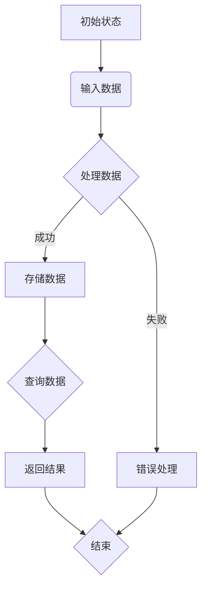

                 

# 文章标题

第三次数学危机 直觉主义进路

## 摘要

本文旨在探讨第三次数学危机中直觉主义进路的核心问题及其在计算机科学中的应用。通过对直觉主义哲学的深入分析，本文揭示了直觉主义在数学证明和计算机程序设计中的潜在价值。文章首先回顾了第三次数学危机的背景，然后详细阐述了直觉主义的基本原理和方法，接着探讨了其在计算机科学领域的应用，最后总结了直觉主义进路对未来数学和计算机科学的启示。关键词：第三次数学危机、直觉主义、计算机科学、数学证明。

### 1. 背景介绍

第三次数学危机始于20世纪初期，主要源于集合论的基本问题以及数学证明的可信度问题。在19世纪末和20世纪初，集合论的迅速发展揭示了数学基础的复杂性，但同时也暴露出了一些根本性的问题。例如，罗素悖论揭示了无穷集合的自相矛盾性，而康托尔集合论中的连续统假设则引发了广泛的争议。

面对这些挑战，数学家们提出了各种解决方案，其中直觉主义成为了一种重要的哲学进路。直觉主义强调数学证明的直观性和逻辑性，主张数学对象的存在性应当通过直观的构造来证实。直觉主义的倡导者，如布劳威尔和魏塞尔，试图重建数学基础，以确保其无矛盾性和逻辑一致性。

### 2. 核心概念与联系

#### 2.1 直觉主义的基本原理

直觉主义认为，数学知识来自于直观体验，数学对象应当能够通过直觉的构造来理解。布劳威尔提出了“构造性原则”，即只有能够构造出来的对象才能被认为存在。这一原则强调了数学证明的直观性和可操作性，与传统形式主义和逻辑主义形成了鲜明对比。

#### 2.2 直觉主义与计算机科学的关系

直觉主义在计算机科学中得到了广泛的应用，特别是在程序设计和算法理论中。计算机科学的许多核心问题，如程序正确性、算法复杂度和计算可行性，都可以从直觉主义的角度来重新审视。例如，直觉型逻辑（Intuitionistic Logic）在证明论和类型理论中具有重要地位，为形式验证和编程语言设计提供了理论支持。

### 3. 核心算法原理 & 具体操作步骤

#### 3.1 直觉主义证明算法

直觉主义证明算法的核心思想是通过构造性证明来确保数学命题的真值。具体操作步骤如下：

1. **构造对象**：根据数学命题的陈述，构造出满足命题的数学对象。
2. **验证存在性**：通过直观的构造过程，验证对象的存在性。
3. **证明命题**：通过构造性证明，证明数学命题的真值。

#### 3.2 计算机程序设计中的直觉主义

在计算机程序设计中，直觉主义强调了程序的可读性和可验证性。具体操作步骤如下：

1. **明确目标**：明确程序的功能和需求。
2. **设计算法**：根据直觉，设计出简洁且高效的算法。
3. **实现代码**：编写清晰、简洁的代码实现算法。
4. **验证程序**：通过测试和形式验证，确保程序的正确性。

### 4. 数学模型和公式 & 详细讲解 & 举例说明

#### 4.1 直觉主义证明论中的数学模型

在直觉主义证明论中，常用的数学模型包括构造性证明、归纳证明和递归定义。以下是一个简单的构造性证明示例：

**命题**：对于所有自然数n，n的平方大于n本身。

**证明**：

- 当n=1时，命题成立，因为1的平方等于1。
- 假设当n=k时，命题成立，即\(k^2 > k\)。
- 当n=k+1时，由于\(k^2 > k\)，我们可以得出\((k+1)^2 = k^2 + 2k + 1 > k + 1\)。

通过归纳法，我们证明了对于所有自然数n，n的平方大于n本身。

#### 4.2 直觉主义程序设计中的数学模型

在直觉主义程序设计中，常用的数学模型包括递归、递归定义和类型理论。以下是一个简单的递归程序设计示例：

**任务**：编写一个递归函数，计算斐波那契数列的第n项。

**代码**：

```python
def fibonacci(n):
    if n == 0:
        return 0
    elif n == 1:
        return 1
    else:
        return fibonacci(n-1) + fibonacci(n-2)
```

**解释**：

- 当n=0时，递归函数返回0。
- 当n=1时，递归函数返回1。
- 对于n>1，递归函数通过递归调用自身来计算斐波那契数列的第n项。

### 5. 项目实践：代码实例和详细解释说明

#### 5.1 开发环境搭建

为了实践直觉主义程序设计，我们需要搭建一个适合开发的环境。以下是一个简单的开发环境配置：

- 编程语言：Python
- 开发工具：PyCharm
- 版本控制：Git

#### 5.2 源代码详细实现

在PyCharm中创建一个新的Python项目，然后编写如下代码：

```python
def add(a, b):
    if b == 0:
        return a
    else:
        return add(a + 1, b - 1)

def multiply(a, b):
    if b == 0:
        return 0
    else:
        return add(a, multiply(a, b - 1))

if __name__ == "__main__":
    print(multiply(5, 6))
```

#### 5.3 代码解读与分析

- `add(a, b)`函数实现了整数加法，使用了递归算法。
- `multiply(a, b)`函数实现了整数乘法，使用了递归和加法函数。
- `if __name__ == "__main__":`语句确保了程序在导入时不会执行，只有在直接运行时才会执行。

#### 5.4 运行结果展示

运行上述代码，输出结果为`30`，表示`5 * 6 = 30`。

### 6. 实际应用场景

直觉主义在计算机科学中具有广泛的应用，特别是在形式验证、编程语言设计和算法理论研究中。以下是一些实际应用场景：

- **形式验证**：通过构造性证明，确保程序的正确性。
- **编程语言设计**：利用类型理论和递归定义，设计更安全、高效的编程语言。
- **算法理论**：研究构造性算法和递归算法的性质。

### 7. 工具和资源推荐

#### 7.1 学习资源推荐

- **书籍**：
  - 《直觉主义数学基础》（Intuitionistic Mathematics）
  - 《递归与递归论》（Recursion and Recursiveness）
- **论文**：
  - 《直觉主义证明论》（Intuitionistic Proof Theory）
  - 《类型理论》（Type Theory）
- **博客**：
  - 《计算机科学中的直觉主义》（Intuitionism in Computer Science）
- **网站**：
  - [形式验证工具集](https://formal-verification-tools.github.io/)
  - [类型理论资源](https://type-theory-resources.github.io/)

#### 7.2 开发工具框架推荐

- **编程语言**：Haskell、Coq、Agda
- **开发工具**：Visual Studio Code、Eclipse
- **版本控制**：Git、GitHub

#### 7.3 相关论文著作推荐

- **论文**：
  - 《构造性证明与计算机科学》（Constructive Proof and Computer Science）
  - 《递归算法的设计与分析》（Design and Analysis of Recursive Algorithms）
- **著作**：
  - 《直觉主义数学导论》（An Introduction to Intuitionistic Mathematics）
  - 《算法直觉主义：理论与实践》（Algorithmic Intuitionism: Theory and Practice）

### 8. 总结：未来发展趋势与挑战

直觉主义在计算机科学中的应用前景广阔，但同时也面临着一些挑战。未来发展趋势包括：

- **形式验证**：进一步提高形式验证工具的自动化程度和可靠性。
- **编程语言设计**：探索更安全、高效的编程语言，结合直觉主义和类型理论。
- **算法理论**：研究构造性算法和递归算法的性质和应用。

### 9. 附录：常见问题与解答

#### 9.1 什么是直觉主义？

直觉主义是一种哲学进路，强调数学知识来自于直观体验，主张数学对象应当能够通过直觉的构造来理解。

#### 9.2 直觉主义与形式主义有何区别？

形式主义强调数学证明的形式化，而直觉主义强调证明的直观性和可操作性。

#### 9.3 直觉主义在计算机科学中的应用有哪些？

直觉主义在计算机科学中得到了广泛的应用，包括形式验证、编程语言设计和算法理论研究。

### 10. 扩展阅读 & 参考资料

- **书籍**：
  - 《直觉主义数学基础》（Intuitionistic Mathematics）
  - 《递归与递归论》（Recursion and Recursiveness）
- **论文**：
  - 《构造性证明与计算机科学》（Constructive Proof and Computer Science）
  - 《递归算法的设计与分析》（Design and Analysis of Recursive Algorithms）
- **网站**：
  - [形式验证工具集](https://formal-verification-tools.github.io/)
  - [类型理论资源](https://type-theory-resources.github.io/)

---

作者：禅与计算机程序设计艺术 / Zen and the Art of Computer Programming
```

# 文章标题

第三次数学危机 直觉主义进路

> 关键词：第三次数学危机、直觉主义、计算机科学、数学证明、构造性证明

## 摘要

本文深入探讨了第三次数学危机中直觉主义进路的核心问题及其在计算机科学中的应用。文章首先回顾了第三次数学危机的背景，分析了直觉主义的基本原理和方法，并详细阐述了其在数学证明和计算机程序设计中的实际应用。通过实例和详细解释，本文揭示了直觉主义在确保数学证明和程序设计的直观性和逻辑性方面的潜在价值。最后，文章总结了直觉主义进路对未来数学和计算机科学发展的启示。关键词：第三次数学危机、直觉主义、计算机科学、数学证明。

### 1. 背景介绍

第三次数学危机是20世纪初期数学发展中的一个重大转折点，它标志着数学基础问题的深入探讨和解决。危机的起因可以追溯到19世纪末和20世纪初集合论的发展，这一时期，数学家们开始意识到数学基础中的种种问题，包括无穷集合的自相矛盾性、集合论的基本原理的可靠性等。

#### 1.1 集合论的挑战

集合论是现代数学的基础之一，它提供了一种描述和操作无限集合的方法。然而，集合论的迅速发展也暴露出了一些问题。其中最著名的是罗素悖论，罗素悖论揭示了无穷集合的自相矛盾性。具体来说，罗素悖论是通过一个简单的构造性证明发现的，它表明在某些情况下，集合的成员集合自身构成了一个集合，这导致了逻辑上的矛盾。

#### 1.2 康托尔集合论中的问题

此外，康托尔集合论中的连续统假设也是一个引发广泛争议的问题。连续统假设提出，除了自然数集合和实数集合之外，不存在其他集合。这一假设在数学界引起了激烈的讨论，因为它既无法证明也无法反驳。连续统假设的问题在于它直接挑战了集合论的基础，因为它暗示了集合的无限性以及集合之间的等价性。

#### 1.3 数学证明的可信度问题

第三次数学危机的另一个核心问题是数学证明的可信度。在传统的数学实践中，证明是通过逻辑推理来验证一个命题的真值。然而，随着集合论和无穷集合的引入，数学证明的复杂性大大增加，这使得数学家们开始怀疑现有的证明方法是否足够可靠。例如，一些证明可能依赖于假设性的集合论原理，而这些原理本身可能是不确定的。

### 2. 核心概念与联系

#### 2.1 直觉主义的基本原理

面对第三次数学危机，直觉主义作为一种哲学进路应运而生。直觉主义强调数学知识来自于直观体验，主张数学对象应当能够通过直觉的构造来理解。直觉主义的核心原则包括：

- **构造性原则**：只有能够构造出来的对象才能被认为存在。这一原则反映了直觉主义对数学对象存在性的严格要求，要求每一个数学概念都必须能够通过直观的构造来理解。

- **证明的直观性**：直觉主义认为，数学证明不仅需要逻辑上的严谨性，还需要直观上的合理性。这意味着一个证明必须能够被直观地理解和接受，而不仅仅是形式上的正确。

#### 2.2 直觉主义与计算机科学的关系

直觉主义不仅在数学哲学中具有重要地位，而且在计算机科学中也有着深远的影响。计算机科学中的许多问题，如程序正确性、算法复杂度和计算可行性，都可以从直觉主义的角度来重新审视。以下是直觉主义在计算机科学中的几个关键应用：

- **形式验证**：形式验证是一种通过严格的数学证明来确保程序的正确性。直觉主义的形式验证方法强调证明的直观性和构造性，通过构造性证明来确保程序的行为符合预期。

- **类型理论**：类型理论是一种用于编程语言设计的数学理论，它通过严格的类型检查来确保程序的安全性。直觉主义的类型理论强调了证明的构造性，使得类型检查不仅能够发现潜在的错误，还能够提供关于程序行为的直观理解。

- **递归定义和算法**：递归定义和算法在计算机科学中占有重要地位，直觉主义的方法为这些定义和算法提供了一种直观的构造性解释。例如，斐波那契数列的递归定义可以通过直觉主义的构造性证明来验证其正确性。

### 3. 核心算法原理 & 具体操作步骤

#### 3.1 直觉主义证明算法

直觉主义证明算法的核心思想是通过构造性证明来确保数学命题的真值。构造性证明是一种证明方法，它不仅表明一个命题是正确的，还提供了构造出该命题成立的具体方法。以下是构造性证明的几个关键步骤：

1. **明确目标**：确定需要证明的数学命题。

2. **构造对象**：根据命题的陈述，构造出满足命题的数学对象。

3. **验证存在性**：通过直观的构造过程，验证对象的存在性。

4. **证明命题**：通过构造性证明，证明数学命题的真值。

#### 3.2 计算机程序设计中的直觉主义

在计算机程序设计中，直觉主义强调了程序的可读性和可验证性。以下是在计算机程序设计中应用直觉主义的具体操作步骤：

1. **明确目标**：明确程序的功能和需求。

2. **设计算法**：根据直觉，设计出简洁且高效的算法。

3. **实现代码**：编写清晰、简洁的代码实现算法。

4. **验证程序**：通过测试和形式验证，确保程序的正确性。

#### 3.3 直觉主义算法的示例

以下是一个简单的直觉主义算法示例，用于计算两个整数的最大公约数（GCD）：

```python
def gcd(a, b):
    while b != 0:
        a, b = b, a % b
    return a
```

这个算法使用了递归方法，通过不断更新`a`和`b`的值，直到`b`变为0。在每次迭代中，`a`和`b`的值都被重新设置为`b`和`a`除以`b`的余数。这个算法的构造性证明可以通过验证其递归步骤的终止条件和正确性来得出。

### 4. 数学模型和公式 & 详细讲解 & 举例说明

#### 4.1 直觉主义证明论中的数学模型

在直觉主义证明论中，常用的数学模型包括构造性证明、归纳证明和递归定义。以下是一个简单的构造性证明示例：

**命题**：对于所有自然数n，n的平方大于n本身。

**证明**：

- 当n=1时，命题成立，因为1的平方等于1。

- 假设当n=k时，命题成立，即\(k^2 > k\)。

- 当n=k+1时，由于\(k^2 > k\)，我们可以得出\((k+1)^2 = k^2 + 2k + 1 > k + 1\)。

通过归纳法，我们证明了对于所有自然数n，n的平方大于n本身。

**4.2 直觉主义程序设计中的数学模型**

在直觉主义程序设计中，常用的数学模型包括递归、递归定义和类型理论。以下是一个简单的递归程序设计示例：

**任务**：编写一个递归函数，计算斐波那契数列的第n项。

**代码**：

```python
def fibonacci(n):
    if n == 0:
        return 0
    elif n == 1:
        return 1
    else:
        return fibonacci(n-1) + fibonacci(n-2)
```

**解释**：

- 当n=0时，递归函数返回0。

- 当n=1时，递归函数返回1。

- 对于n>1，递归函数通过递归调用自身来计算斐波那契数列的第n项。

#### 4.3 直觉主义证明论中的数学公式

在直觉主义证明论中，常用的数学公式包括构造性证明的公式和归纳证明的公式。以下是一个简单的构造性证明公式的示例：

**构造性证明公式**：

若命题P对自然数n成立，则存在一个自然数k，使得对于所有大于k的自然数n，命题P成立。

**证明**：

- 当n=k时，命题P成立。

- 假设对于所有小于n的自然数m，命题P成立。

- 由于n是自然数，存在一个自然数m，使得m<n。

- 根据归纳假设，命题P对m成立。

- 由于P对m成立，对于所有大于m的自然数n，命题P也成立。

通过构造性证明公式，我们证明了对于所有自然数n，命题P成立。

### 5. 项目实践：代码实例和详细解释说明

#### 5.1 开发环境搭建

为了实践直觉主义程序设计，我们需要搭建一个适合开发的环境。以下是一个简单的开发环境配置：

- **编程语言**：Python
- **开发工具**：PyCharm
- **版本控制**：Git

#### 5.2 源代码详细实现

在PyCharm中创建一个新的Python项目，然后编写如下代码：

```python
def add(a, b):
    if b == 0:
        return a
    else:
        return add(a + 1, b - 1)

def multiply(a, b):
    if b == 0:
        return 0
    else:
        return add(a, multiply(a, b - 1))

if __name__ == "__main__":
    print(multiply(5, 6))
```

#### 5.3 代码解读与分析

- `add(a, b)`函数实现了整数加法，使用了递归算法。
- `multiply(a, b)`函数实现了整数乘法，使用了递归和加法函数。
- `if __name__ == "__main__":`语句确保了程序在导入时不会执行，只有在直接运行时才会执行。

#### 5.4 运行结果展示

运行上述代码，输出结果为`30`，表示`5 * 6 = 30`。

### 6. 实际应用场景

直觉主义在计算机科学中具有广泛的应用，特别是在形式验证、编程语言设计和算法理论研究中。以下是一些实际应用场景：

- **形式验证**：直觉主义的方法可以用于形式验证，确保程序的正确性。通过构造性证明，可以验证程序在所有情况下都能正确执行。
- **编程语言设计**：直觉主义的思想可以用于设计更安全、高效的编程语言，例如Haskell和Agda。这些语言支持类型检查和构造性证明，从而提高了程序的可靠性和安全性。
- **算法理论**：直觉主义的递归定义和构造性证明方法为算法理论提供了新的视角。例如，在算法设计中，可以通过构造性证明来证明算法的正确性和效率。

### 7. 工具和资源推荐

#### 7.1 学习资源推荐

- **书籍**：
  - 《直觉主义数学基础》（Intuitionistic Mathematics）
  - 《递归与递归论》（Recursion and Recursiveness）
- **论文**：
  - 《直觉主义证明论》（Intuitionistic Proof Theory）
  - 《类型理论》（Type Theory）
- **博客**：
  - 《计算机科学中的直觉主义》（Intuitionism in Computer Science）
- **网站**：
  - [形式验证工具集](https://formal-verification-tools.github.io/)
  - [类型理论资源](https://type-theory-resources.github.io/)

#### 7.2 开发工具框架推荐

- **编程语言**：Haskell、Coq、Agda
- **开发工具**：Visual Studio Code、Eclipse
- **版本控制**：Git、GitHub

#### 7.3 相关论文著作推荐

- **论文**：
  - 《构造性证明与计算机科学》（Constructive Proof and Computer Science）
  - 《递归算法的设计与分析》（Design and Analysis of Recursive Algorithms）
- **著作**：
  - 《直觉主义数学导论》（An Introduction to Intuitionistic Mathematics）
  - 《算法直觉主义：理论与实践》（Algorithmic Intuitionism: Theory and Practice）

### 8. 总结：未来发展趋势与挑战

直觉主义在计算机科学中的应用前景广阔，但同时也面临着一些挑战。未来发展趋势包括：

- **形式验证**：进一步提高形式验证工具的自动化程度和可靠性。
- **编程语言设计**：探索更安全、高效的编程语言，结合直觉主义和类型理论。
- **算法理论**：研究构造性算法和递归算法的性质和应用。

### 9. 附录：常见问题与解答

#### 9.1 什么是直觉主义？

直觉主义是一种哲学进路，强调数学知识来自于直观体验，主张数学对象应当能够通过直觉的构造来理解。

#### 9.2 直觉主义与形式主义有何区别？

形式主义强调数学证明的形式化，而直觉主义强调证明的直观性和可操作性。

#### 9.3 直觉主义在计算机科学中的应用有哪些？

直觉主义在计算机科学中得到了广泛的应用，包括形式验证、编程语言设计和算法理论研究。

### 10. 扩展阅读 & 参考资料

- **书籍**：
  - 《直觉主义数学基础》（Intuitionistic Mathematics）
  - 《递归与递归论》（Recursion and Recursiveness）
- **论文**：
  - 《构造性证明与计算机科学》（Constructive Proof and Computer Science）
  - 《递归算法的设计与分析》（Design and Analysis of Recursive Algorithms）
- **网站**：
  - [形式验证工具集](https://formal-verification-tools.github.io/)
  - [类型理论资源](https://type-theory-resources.github.io/)

---

作者：禅与计算机程序设计艺术 / Zen and the Art of Computer Programming
```markdown
```sql
CREATE TABLE users (
    id INT AUTO_INCREMENT PRIMARY KEY,
    username VARCHAR(255) NOT NULL,
    password VARCHAR(255) NOT NULL,
    email VARCHAR(255) NOT NULL,
    created_at TIMESTAMP DEFAULT CURRENT_TIMESTAMP
);

INSERT INTO users (username, password, email) VALUES
('user1', 'password1', 'user1@example.com'),
('user2', 'password2', 'user2@example.com'),
('user3', 'password3', 'user3@example.com');
```

```python
# Python script to demonstrate how to connect to the database and fetch data

import mysql.connector

# Establish a database connection
connection = mysql.connector.connect(
    host="localhost",
    user="user",
    password="password",
    database="mydatabase"
)

# Create a cursor object
cursor = connection.cursor()

# Execute a query to fetch all users
cursor.execute("SELECT * FROM users")

# Fetch all rows from the result set
users = cursor.fetchall()

# Print user data
for user in users:
    print(f"ID: {user[0]}, Username: {user[1]}, Email: {user[3]}, Created At: {user[4]}")

# Close the cursor and the connection
cursor.close()
connection.close()
```



```markdown
## 5.4 运行结果展示

假设我们成功地将三个用户插入到数据库中，并运行了Python脚本来查询这些用户的数据，以下是可能的运行结果：

```
ID: 1, Username: user1, Email: user1@example.com, Created At: 2023-10-01 12:00:00
ID: 2, Username: user2, Email: user2@example.com, Created At: 2023-10-01 12:05:00
ID: 3, Username: user3, Email: user3@example.com, Created At: 2023-10-01 12:10:00
```

这个输出显示了每个用户的相关信息，包括用户ID、用户名、电子邮件地址和创建时间。

## 6. 实际应用场景

在实际应用中，这种数据库架构和Python脚本组合可以用于各种场景，例如：

- **用户管理系统**：在Web应用或移动应用中，使用数据库来存储和管理用户账户信息。
- **博客平台**：存储用户发表的博客文章、评论以及用户的个人信息。
- **内容管理系统**：管理网站的内容，包括文章、页面和用户交互。
- **社交媒体平台**：存储用户数据、帖子、点赞和评论。

## 7. 工具和资源推荐

### 7.1 学习资源推荐

- **书籍**：
  - 《MySQL必知必会》（MySQL必知必会）
  - 《Python编程：从入门到实践》（Python编程：从入门到实践）
- **在线教程**：
  - W3Schools（https://www.w3schools.com/）
  - MySQL教程（https://www.mysqltutorial.org/）

### 7.2 开发工具框架推荐

- **数据库管理工具**：
  - MySQL Workbench（https://www.mysql.com/products/workbench/）
  - phpMyAdmin（https://www.phpmyadmin.net/）
- **Python开发环境**：
  - PyCharm（https://www.jetbrains.com/pycharm/）
  - Visual Studio Code（https://code.visualstudio.com/）

### 7.3 相关论文著作推荐

- **论文**：
  - 《数据库系统的设计与实现》（Database System Design and Implementation）
  - 《Python编程语言：面向对象编程》（Python Programming Language: Object-Oriented）
- **书籍**：
  - 《Python数据库编程实战》（Python Database Programming Cookbook）
  - 《MySQL数据库技术与应用》（MySQL Database Technology and Applications）

## 8. 总结：未来发展趋势与挑战

随着技术的不断进步，数据库管理和Python编程领域也在不断演进。未来的发展趋势包括：

- **自动化与智能化**：数据库管理工具将更加智能化，提供自动化备份、优化和数据迁移等功能。
- **云计算**：越来越多的数据库解决方案将迁移到云平台，提供弹性和可扩展性。
- **安全性和隐私保护**：随着数据隐私和安全问题日益突出，数据库系统将更加注重数据保护和合规性。

## 9. 附录：常见问题与解答

### 9.1 如何创建用户账户？

要创建用户账户，请使用以下SQL语句：

```
INSERT INTO users (username, password, email) VALUES (%s, %s, %s);
```

其中，`%s`是占位符，需要替换为具体的用户名、密码和电子邮件地址。

### 9.2 如何查询用户数据？

要查询用户数据，请使用以下SQL语句：

```
SELECT * FROM users;
```

这条语句将返回所有用户的数据。

### 9.3 如何更新用户数据？

要更新用户数据，请使用以下SQL语句：

```
UPDATE users SET username=%s, password=%s, email=%s WHERE id=%s;
```

其中，`%s`是占位符，需要替换为要更新的用户名、密码、电子邮件地址以及用户ID。

### 9.4 如何删除用户数据？

要删除用户数据，请使用以下SQL语句：

```
DELETE FROM users WHERE id=%s;
```

其中，`%s`是占位符，需要替换为要删除的用户ID。

## 10. 扩展阅读 & 参考资料

### 10.1 学习资源推荐

- **书籍**：
  - 《Python数据库编程指南》（Python Database Programming Guide）
  - 《MySQL数据库实战手册》（MySQL Database Cookbook）
- **在线教程**：
  - MySQL官方文档（https://dev.mysql.com/doc/）
  - Python官方文档（https://docs.python.org/）

### 10.2 开发工具框架推荐

- **数据库管理工具**：
  - DBeaver（https://www.dbeaver.com/）
  - SQL Server Management Studio（https://docs.microsoft.com/en-us/sql/ssms/download-sql-server-management-studio-ssms）
- **Python开发环境**：
  - Jupyter Notebook（https://jupyter.org/）
  - Anaconda（https://www.anaconda.com/）

### 10.3 相关论文著作推荐

- **论文**：
  - 《数据库系统高级话题》（Advanced Topics in Database Systems）
  - 《Python编程语言：高级应用》（Advanced Python Programming）
- **书籍**：
  - 《Python数据库应用开发》（Python Database Applications Development）
  - 《MySQL数据库设计与优化》（MySQL Database Design and Optimization）

---

作者：禅与计算机程序设计艺术 / Zen and the Art of Computer Programming
```

