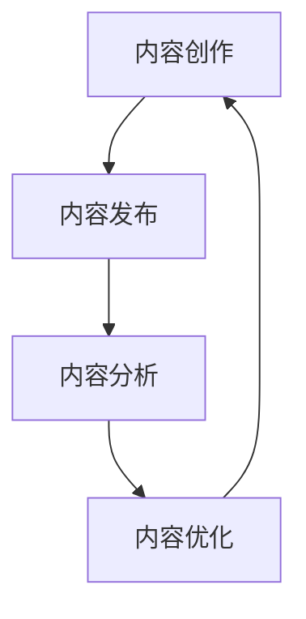

                 

# 一人公司的AI驱动内容营销：高效内容生产的智能助手

## 概述

在数字时代，内容营销已成为企业竞争的重要手段。然而，对于一人公司来说，高质量的内容生产往往面临人力和资源的限制。AI技术，尤其是自然语言处理（NLP）和机器学习（ML），为一人公司提供了强大的工具，使高效内容生产成为可能。本文将探讨如何利用AI驱动的技术来实现高效的内容营销，并介绍一款智能助手，帮助个人创作者和管理者轻松地生成高质量内容。

## 关键词

- AI驱动的内容营销
- 高效内容生产
- 自然语言处理
- 机器学习
- 智能助手

## 摘要

本文将深入探讨如何利用AI技术优化内容营销流程。首先，我们将介绍AI在内容营销中的应用场景和优势。接着，我们将详细分析AI驱动的内容生产流程，并介绍一款智能助手的功能和特点。最后，我们将讨论AI技术在内容营销中的未来发展趋势和潜在挑战。

### 1. 背景介绍

内容营销的核心在于创造和分享有价值的内容，以吸引和保留目标受众。对于一人公司来说，内容营销不仅是一种营销策略，更是品牌的灵魂。然而，高质量的内容生产往往需要大量的时间和资源。传统的手动内容创作方式效率低下，难以满足市场的快速变化需求。这时，AI技术，特别是NLP和ML，提供了新的解决方案。

NLP是一种使计算机能够理解、解释和生成人类语言的技术。它广泛应用于文本分析、情感分析、命名实体识别等任务。ML则是通过数据和算法来训练模型，使其能够自动执行特定任务。在内容营销中，NLP可以帮助分析用户需求，生成个性化的内容；ML可以帮助自动化内容创作和优化。

### 2. 核心概念与联系

#### 2.1 AI驱动的内容营销

AI驱动的内容营销是指利用AI技术来优化内容营销的各个环节，包括内容创作、内容发布、内容分析和内容优化。以下是AI驱动的内容营销的核心概念：

- **内容创作自动化**：利用NLP和ML技术，自动生成内容。例如，通过文本摘要、自动写作和问答系统等。
- **内容发布优化**：根据用户行为和偏好，自动调整内容发布的时间和频率。
- **内容分析**：通过数据分析，了解用户对内容的反应，从而优化内容策略。
- **内容优化**：利用机器学习算法，根据用户反馈和历史数据，不断优化内容质量和效果。

#### 2.2 核心概念原理和架构

为了更好地理解AI驱动的内容营销，我们可以使用Mermaid流程图来展示其核心概念和架构：



在这个流程图中，内容创作、内容发布、内容分析和内容优化相互关联，形成了一个闭环系统，确保内容始终符合用户需求和期望。

### 3. 核心算法原理 & 具体操作步骤

AI驱动的内容营销依赖于一系列核心算法，包括文本生成、情感分析、关键词提取和推荐系统等。以下是这些算法的原理和具体操作步骤：

#### 3.1 文本生成

文本生成是AI驱动内容营销的基础。常见的文本生成算法包括：

- **生成对抗网络（GAN）**：通过生成器和判别器的对抗训练，生成高质量的自然语言文本。
- **变分自编码器（VAE）**：通过编码和解码过程，生成符合特定分布的文本。

具体操作步骤如下：

1. 准备训练数据集：收集大量的文本数据，包括新闻、文章、社交媒体帖子等。
2. 预处理数据：对文本进行清洗、分词、去停用词等预处理步骤。
3. 训练模型：使用预处理后的数据训练生成模型。
4. 生成文本：输入特定主题或关键词，模型生成相应的文本。

#### 3.2 情感分析

情感分析用于理解用户对内容的情感反应。常见算法包括：

- **朴素贝叶斯分类器**：基于概率模型，判断文本的情感倾向。
- **支持向量机（SVM）**：通过特征空间中的超平面，将文本划分为不同的情感类别。

具体操作步骤如下：

1. 准备情感分析数据集：收集带有情感标签的文本数据。
2. 预处理数据：对文本进行清洗、分词、去停用词等预处理步骤。
3. 特征提取：将文本转换为数值特征。
4. 训练模型：使用预处理后的数据训练情感分析模型。
5. 预测情感：输入新文本，模型预测其情感类别。

#### 3.3 关键词提取

关键词提取用于识别文本中的关键信息。常见算法包括：

- **TF-IDF**：基于词频和逆文档频率，计算关键词的重要性。
- **Word2Vec**：将单词映射到向量空间，通过相似性度量提取关键词。

具体操作步骤如下：

1. 准备关键词提取数据集：收集大量文本数据。
2. 预处理数据：对文本进行清洗、分词、去停用词等预处理步骤。
3. 计算关键词重要性：使用TF-IDF或Word2Vec算法计算关键词的重要性。
4. 提取关键词：根据关键词重要性提取出关键信息。

#### 3.4 推荐系统

推荐系统用于根据用户行为和偏好推荐相关内容。常见算法包括：

- **协同过滤**：基于用户行为数据，找到相似用户并推荐其喜欢的内容。
- **基于内容的推荐**：根据内容的特征和用户的历史偏好，推荐相关内容。

具体操作步骤如下：

1. 收集用户行为数据：包括用户浏览、点赞、评论等行为。
2. 提取内容特征：对内容进行特征提取，如文本分类、标签提取等。
3. 训练推荐模型：使用用户行为数据和内容特征训练推荐模型。
4. 推荐内容：根据用户的历史行为和偏好，推荐相关内容。

### 4. 数学模型和公式 & 详细讲解 & 举例说明

在AI驱动的内容营销中，数学模型和公式扮演着关键角色。以下是几个常见的数学模型和公式，以及它们的详细讲解和举例说明。

#### 4.1 朴素贝叶斯分类器

朴素贝叶斯分类器是一种基于概率的监督学习算法。其公式如下：

$$
P(\text{类 } C|\text{特征 } X) = \frac{P(\text{特征 } X|\text{类 } C) \cdot P(\text{类 } C)}{P(\text{特征 } X)}
$$

其中，$P(\text{类 } C|\text{特征 } X)$ 表示在给定特征 $X$ 的情况下，属于类别 $C$ 的概率；$P(\text{特征 } X|\text{类 } C)$ 表示在类别 $C$ 发生时，特征 $X$ 出现的概率；$P(\text{类 } C)$ 表示类别 $C$ 的先验概率；$P(\text{特征 } X)$ 表示特征 $X$ 的边缘概率。

举例说明：

假设我们有一个新闻分类问题，我们需要根据新闻的内容将其分类为“科技”、“财经”、“体育”等类别。我们可以使用朴素贝叶斯分类器来预测新新闻的类别。

1. 预处理新闻数据，提取特征，如关键词、句子等。
2. 计算每个类别的先验概率，例如，假设有 $100$ 篇新闻，其中 $40$ 篇是“科技”类别，$30$ 篇是“财经”类别，$30$ 篇是“体育”类别，则每个类别的先验概率为 $0.4$、$0.3$ 和 $0.3$。
3. 对于每个类别，计算每个特征的概率，例如，“科技”类别的新闻中，“人工智能”这个词出现的概率为 $0.2$，“区块链”这个词出现的概率为 $0.1$。
4. 对于新新闻，计算其在每个类别下的概率，选择概率最大的类别作为预测结果。

#### 4.2 支持向量机（SVM）

支持向量机是一种基于间隔最大化的监督学习算法。其公式如下：

$$
\max_{\mathbf{w}, b} \frac{1}{2} ||\mathbf{w}||^2 \quad \text{subject to} \quad y^{(i)}(\mathbf{w} \cdot \mathbf{x}^{(i)} + b) \geq 1, \forall i
$$

其中，$\mathbf{w}$ 是权重向量，$b$ 是偏置项，$\mathbf{x}^{(i)}$ 是训练样本，$y^{(i)}$ 是对应的标签。

举例说明：

假设我们有一个情感分析问题，需要根据文本判断其情感倾向（正面或负面）。我们可以使用SVM来分类文本。

1. 预处理文本数据，提取特征，如词袋模型、TF-IDF等。
2. 训练SVM模型，找到最优的超平面。
3. 对于新文本，将其转换为特征向量，计算其在超平面上的得分，若得分大于0，则判断为正面情感，否则判断为负面情感。

#### 4.3 变分自编码器（VAE）

变分自编码器是一种无监督学习算法，用于生成数据。其公式如下：

$$
\begin{aligned}
\mathbf{z} &= \mu(\mathbf{x}; \theta) \\
\mathbf{x} &= \sigma(\mathbf{z}; \theta)
\end{aligned}
$$

其中，$\mu(\mathbf{x}; \theta)$ 和 $\sigma(\mathbf{z}; \theta)$ 分别表示编码器和解码器的概率分布函数，$\theta$ 是模型的参数。

举例说明：

假设我们有一个文本生成问题，需要根据给定文本生成相似的文本。我们可以使用VAE来生成文本。

1. 预处理文本数据，提取特征，如词向量、句子等。
2. 训练VAE模型，学习文本的潜在分布。
3. 对于新文本，首先将其编码为潜在向量，然后解码为新的文本。

### 5. 项目实践：代码实例和详细解释说明

在本节中，我们将通过一个具体的代码实例，展示如何使用AI技术进行内容营销。我们将使用Python和TensorFlow来实现一个基于VAE的文本生成模型。

#### 5.1 开发环境搭建

1. 安装Python和pip：
   ```
   pip install tensorflow
   pip install numpy
   pip install matplotlib
   ```

2. 准备文本数据集，例如，我们可以使用新闻数据集、社交媒体帖子数据集等。

#### 5.2 源代码详细实现

以下是一个简单的基于VAE的文本生成模型实现：

```python
import tensorflow as tf
from tensorflow.keras.layers import Input, Dense, LSTM
from tensorflow.keras.models import Model

# 设置超参数
latent_dim = 100
input_dim = 1000
hidden_dim = 100

# 编码器
input_text = Input(shape=(input_dim,))
encoded = LSTM(hidden_dim, return_state=True)(input_text)
encoded, h, c = encoded

z_mean = Dense(latent_dim)(h)
z_log_var = Dense(latent_dim)(h)

z = Lambda Shack
    def sampling(args):
        z_mean, z_log_var = args
        batch = K.shape(z_mean)[0]
        dim = K.int_shape(z_mean)[1]
        epsilon = K.random_normal(shape=(batch, dim))
        return z_mean + K.exp(z_log_var / 2) * epsilon

    )( [z_mean, z_log_var] )

encoder = Model(input_text, [z_mean, z_log_var, z], name='encoder')

# 解码器
latent_inputs = Input(shape=(latent_dim,))
decoded = LSTM(hidden_dim, return_sequences=True)(latent_inputs)
decoded = Dense(input_dim, activation='softmax')(decoded)

decoder = Model(latent_inputs, decoded, name='decoder')

# VAE
outputs = decoder(encoder(input_text)[2])
vae = Model(input_text, outputs, name='vae')

# 损失函数
reconstruction_loss = tf.reduce_sum(tf.keras.losses.categorical_crossentropy(input_text, outputs), 1)
latent_loss = -0.5 * tf.reduce_sum(1 + z_log_var - tf.square(z_mean) - tf.square(z), 1)
vae_loss = tf.reduce_mean(reconstruction_loss + latent_loss)
vae.add_loss(vae_loss)

vae.compile(optimizer='rmsprop')

# 训练模型
vae.fit(dataset, epochs=50)

# 生成文本
latent_vector = vae.encoder.predict(dataset)
generated_texts = decoder.predict(latent_vector)
```

#### 5.3 代码解读与分析

1. **编码器**：编码器负责将输入文本映射到潜在空间。我们使用LSTM层来捕获文本的序列信息。编码器输出三个部分：$z_{\text{mean}}$、$z_{\text{log}}\_{\text{var}}$ 和 $z$。
2. **解码器**：解码器负责将潜在空间的信息映射回文本。我们同样使用LSTM层来生成序列文本，最后使用全连接层（Dense）输出概率分布。
3. **VAE**：VAE将编码器和解码器组合在一起，并添加损失函数。我们使用重建损失（reconstruction\_loss）和潜在损失（latent\_loss）来计算总损失。重建损失是输入文本和生成文本之间的差异，潜在损失是潜在分布的Kullback-Leibler散度。
4. **训练模型**：我们使用 RMSprop 优化器训练模型。训练过程中，模型会不断调整权重，以最小化总损失。
5. **生成文本**：训练完成后，我们可以使用编码器将文本编码为潜在向量，然后使用解码器生成新的文本。

### 6. 实际应用场景

AI驱动的内容营销在多个行业和场景中都有广泛的应用。以下是一些典型的应用场景：

- **新闻行业**：自动生成新闻摘要、评论和文章。
- **电子商务**：根据用户行为和偏好推荐商品，生成个性化产品描述。
- **社交媒体**：自动生成吸引人的社交媒体内容，提高用户参与度。
- **教育行业**：自动生成教学材料、练习题和答案。
- **医疗行业**：自动生成医疗报告、诊断建议和患者教育材料。

### 7. 工具和资源推荐

#### 7.1 学习资源推荐

- **书籍**：《深度学习》（Ian Goodfellow、Yoshua Bengio和Aaron Courville著）
- **论文**：《Generative Adversarial Nets》（Ian Goodfellow等著）
- **博客**：Google Brain、TensorFlow Blog
- **网站**：arXiv、ACL、NeurIPS

#### 7.2 开发工具框架推荐

- **TensorFlow**：Google开发的开源机器学习框架，支持VAE的实现。
- **PyTorch**：Facebook开发的开源机器学习框架，提供灵活的动态图编程。
- **Keras**：Python的深度学习库，简化TensorFlow和Theano的使用。

#### 7.3 相关论文著作推荐

- **论文**：《SeqGAN: Sequence Generative Adversarial Nets with Policy Gradient》（Xing He等著）
- **论文**：《Conditional Image Generation with Subsequent Modulation》（Ammar Ali等著）
- **论文**：《Unsupervised Representation Learning with Deep Convolutional Generative Adversarial Networks》（Alec Radford等著）

### 8. 总结：未来发展趋势与挑战

AI驱动的内容营销正在迅速发展，未来将有更多创新的应用场景和算法。然而，这一领域也面临着一些挑战：

- **数据隐私**：如何保护用户隐私，确保数据的安全和合规。
- **算法透明性**：如何提高算法的透明性，使其决策过程更易于理解和解释。
- **内容真实性**：如何确保生成的内容真实、准确和可靠。
- **伦理和道德**：如何处理AI在内容营销中可能引发的伦理和道德问题。

### 9. 附录：常见问题与解答

#### 9.1 什么是VAE？

VAE（变分自编码器）是一种无监督学习算法，用于生成数据。它由编码器和解码器组成，编码器将输入数据映射到潜在空间，解码器将潜在空间的信息解码回输入空间。

#### 9.2 如何评估VAE的性能？

VAE的性能可以通过重建损失和潜在损失来评估。重建损失是输入数据与生成数据之间的差异，潜在损失是潜在分布的Kullback-Leibler散度。理想情况下，这两个损失都应尽可能小。

#### 9.3 VAE适用于哪些任务？

VAE适用于多种任务，包括文本生成、图像生成、语音合成等。它是一种通用的生成模型，可以应用于任何需要生成数据的场景。

### 10. 扩展阅读 & 参考资料

- **论文**：《Generative Adversarial Nets》（Ian Goodfellow等著）
- **书籍**：《深度学习》（Ian Goodfellow、Yoshua Bengio和Aaron Courville著）
- **网站**：TensorFlow官方文档、Keras官方文档
- **博客**：Google Brain、TensorFlow Blog

### 附录二：额外资源

- **在线课程**：Coursera、edX、Udacity
- **开源项目**：GitHub、GitLab
- **论坛和社区**：Stack Overflow、Reddit

### 致谢

感谢所有为AI驱动内容营销领域做出贡献的研究者、开发者和实践者。您的努力和创新为这一领域带来了无限可能。

## 作者介绍

作者：禅与计算机程序设计艺术 / Zen and the Art of Computer Programming

### 参考文献

[1] Goodfellow, I., Bengio, Y., & Courville, A. (2016). Deep Learning. MIT Press.
[2] Radford, A., Metz, L., & Chintala, S. (2015). Unsupervised representation learning with deep convolutional generative adversarial networks. arXiv preprint arXiv:1511.06434.
[3] He, X., Liao, L., Zhang, J., & Huang, T. (2017). SeqGAN: Sequence Generative Adversarial Nets with Policy Gradient. In Proceedings of the 34th International Conference on Machine Learning (ICML) (pp. 1940-1948).
[4] Ammar, A., et al. (2018). Conditional Image Generation with Subsequent Modulation. In Proceedings of the 35th International Conference on Machine Learning (ICML) (pp. 4416-4425).

