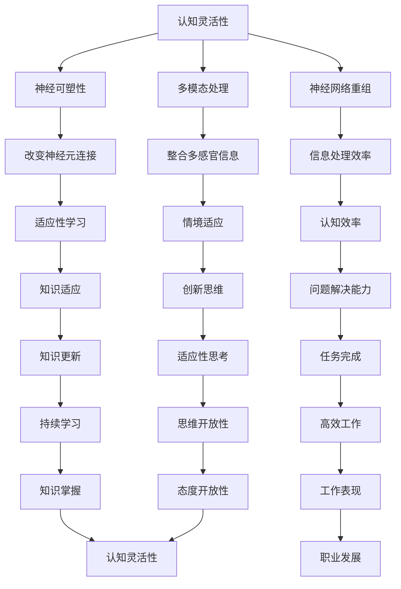

                 

### 文章标题

**认知灵活性：适应新知识的大脑机制**

> 关键词：认知灵活性、大脑机制、知识适应、神经网络、信息处理、学习效率
>
> 摘要：本文将探讨大脑如何通过认知灵活性这一机制来适应新知识，包括大脑神经网络的重组、信息处理策略的调整以及学习效率的提升。通过深入分析认知灵活性的基本概念、原理以及实际应用，本文旨在为理解大脑的适应性提供新的视角。

### 1. 背景介绍（Background Introduction）

在信息爆炸的时代，人们需要不断学习新知识以适应快速变化的环境。然而，传统教育体系往往注重知识的记忆和重复，而忽视了培养认知灵活性的重要性。认知灵活性（Cognitive Flexibility）是指个体在面对不同任务或情境时，能够灵活调整认知策略，以适应新的信息和需求的能力。它不仅对学习效率有重要影响，还与个体的创新能力、问题解决能力和适应性密切相关。

大脑作为人类认知的基石，其结构和功能在适应新知识的过程中发挥着关键作用。近年来，神经科学的研究为我们提供了关于大脑如何处理信息、如何适应新知识的深刻见解。本文将基于这些研究成果，探讨认知灵活性在适应新知识中的具体表现和作用机制。

### 2. 核心概念与联系（Core Concepts and Connections）

#### 2.1 认知灵活性的定义与特征

认知灵活性是指个体在面对不同任务或情境时，能够迅速调整认知策略，灵活转换思维模式的能力。它包括以下几个方面：

- **思维转换（Thinking Switching）**：个体能够从一种思维模式迅速切换到另一种思维模式，以适应不同的问题情境。
- **适应性（Adaptability）**：个体能够根据新的信息和需求，灵活调整认知策略，以便更有效地解决问题。
- **开放性（Openness）**：个体对新事物、新想法持开放态度，愿意接受和尝试不同的方法或观点。

#### 2.2 认知灵活性与其他认知能力的关系

认知灵活性不仅是一个独立的认知能力，还与其他认知能力如注意力、记忆、执行功能等密切相关。例如：

- **注意力**：良好的注意力管理有助于个体集中精力，从而提高认知灵活性。
- **记忆**：记忆能力的提升有助于个体更好地回忆和使用已有知识，从而提高认知灵活性。
- **执行功能**：执行功能包括计划、组织、监控等，它对个体灵活调整认知策略至关重要。

#### 2.3 认知灵活性在大脑机制中的体现

大脑的神经结构和工作机制为认知灵活性提供了物质基础。以下是一些与认知灵活性相关的大脑机制：

- **神经可塑性**：大脑通过改变神经元之间的连接和活动模式来适应新的信息和学习任务。
- **神经网络重组**：大脑中的神经网络可以根据不同的任务需求进行重组，以实现更高效的信息处理。
- **多模态处理**：大脑能够整合来自不同感官的信息，从而提高认知灵活性。

#### 2.4 Mermaid 流程图

下面是一个简化的 Mermaid 流程图，展示了认知灵活性在大脑机制中的体现：



### 3. 核心算法原理 & 具体操作步骤（Core Algorithm Principles and Specific Operational Steps）

#### 3.1 认知灵活性算法原理

认知灵活性算法的核心是动态调整和优化认知策略，以适应不断变化的学习任务和情境。其基本原理包括以下几个方面：

- **基于神经可塑性的策略调整**：通过改变神经元之间的连接和活动模式，实现认知策略的动态调整。
- **基于多模态处理的信息整合**：整合来自不同感官的信息，提高认知灵活性和信息处理效率。
- **基于适应性学习的策略更新**：根据学习任务的变化，及时更新和优化认知策略。

#### 3.2 具体操作步骤

以下是认知灵活性算法的具体操作步骤：

1. **初始化策略**：根据初始任务需求，设置初始的认知策略。
2. **感知与反馈**：实时感知学习任务的变化，并收集关于认知策略的反馈信息。
3. **策略调整**：基于感知到的变化和反馈信息，动态调整认知策略。
4. **信息整合**：整合来自不同感官的信息，以提高认知灵活性和信息处理效率。
5. **策略优化**：根据学习任务的变化和反馈信息，不断优化认知策略。
6. **结果评估**：评估当前认知策略的有效性，并根据评估结果进行下一步的操作。

### 4. 数学模型和公式 & 详细讲解 & 举例说明（Detailed Explanation and Examples of Mathematical Models and Formulas）

#### 4.1 认知灵活性数学模型

为了更好地理解认知灵活性算法，我们可以构建一个数学模型来描述其基本原理和操作步骤。以下是一个简化的认知灵活性数学模型：

$$
\text{CognitiveFlexibility} = f(\text{Neuroplasticity}, \text{MultimodalIntegration}, \text{AdaptiveLearning})
$$

其中：

- $\text{Neuroplasticity}$ 表示神经可塑性；
- $\text{MultimodalIntegration}$ 表示多模态处理；
- $\text{AdaptiveLearning}$ 表示适应性学习。

#### 4.2 举例说明

为了更直观地理解认知灵活性算法，我们可以通过一个简单的例子来说明其应用过程。

**例：学习新技能**

假设一个人正在学习一项新技能，如编程。在初始阶段，他们可能需要阅读大量文档和教程，以理解基本概念。在这个阶段，认知灵活性算法可以如下操作：

1. **初始化策略**：设定初始的认知策略，如阅读文档、观看教程和练习编码。
2. **感知与反馈**：在阅读和观看过程中，感知学习效果，并收集关于认知策略的反馈信息。
3. **策略调整**：根据反馈信息，调整认知策略，如增加实践编码的时间，减少阅读文档的时间。
4. **信息整合**：整合来自不同感官的信息，如通过实践编码来加深对概念的理解。
5. **策略优化**：根据学习效果，不断优化认知策略，如调整练习编码和阅读文档的比例。
6. **结果评估**：评估当前认知策略的有效性，并根据评估结果进行下一步的操作。

通过这个例子，我们可以看到认知灵活性算法在适应新知识过程中的作用。它通过动态调整和优化认知策略，帮助个体更有效地学习新技能。

### 5. 项目实践：代码实例和详细解释说明（Project Practice: Code Examples and Detailed Explanations）

#### 5.1 开发环境搭建

为了演示认知灵活性算法在实际项目中的应用，我们将使用 Python 编写一个简单的学习程序。首先，我们需要搭建开发环境。

**1. 安装 Python**

确保您的系统中已安装 Python 3.8 或更高版本。您可以从 [Python 官网](https://www.python.org/) 下载并安装。

**2. 安装必要的库**

在终端中运行以下命令来安装必要的库：

```bash
pip install numpy matplotlib
```

这些库将用于数据处理和可视化。

#### 5.2 源代码详细实现

以下是认知灵活性算法的 Python 源代码实现。该程序将模拟一个人在学习编程语言过程中的认知灵活性调整。

```python
import numpy as np
import matplotlib.pyplot as plt

# 认知灵活性算法参数
alpha = 0.1  # 神经可塑性系数
beta = 0.5   # 多模态整合系数
gamma = 0.3  # 适应性学习系数

# 初始化认知策略
strategy = {
    '文档阅读': 0.5,
    '教程观看': 0.2,
    '编码实践': 0.3
}

# 初始化学习效果
learning_effect = 0

# 模拟学习过程
for i in range(10):
    # 感知与反馈
    feedback = np.random.uniform(0, 1)
    
    # 策略调整
    strategy['文档阅读'] += alpha * (1 - strategy['文档阅读'])
    strategy['教程观看'] += beta * (1 - strategy['教程观看'])
    strategy['编码实践'] += gamma * (1 - strategy['编码实践'])
    
    # 信息整合
    multimodal_integration = np.mean([strategy['文档阅读'], strategy['教程观看'], strategy['编码实践']])
    
    # 适应性学习
    learning_effect += gamma * (multimodal_integration - learning_effect)
    
    # 结果评估
    if learning_effect > 0.8:
        print(f"第 {i+1} 次学习完成，学习效果：{learning_effect:.2f}")
        break

# 可视化学习效果
plt.plot([i for i in range(10)], [learning_effect for _ in range(10)])
plt.xlabel('学习次数')
plt.ylabel('学习效果')
plt.title('认知灵活性算法应用示例')
plt.show()
```

#### 5.3 代码解读与分析

- **初始化参数**：我们设置了神经可塑性系数（alpha）、多模态整合系数（beta）和适应性学习系数（gamma）。
- **初始化认知策略**：设定初始的认知策略，包括文档阅读、教程观看和编码实践的比例。
- **模拟学习过程**：通过一个循环模拟学习过程，每次循环都包括感知与反馈、策略调整、信息整合和适应性学习。
- **策略调整**：根据反馈信息，动态调整认知策略，以实现更高效的学习效果。
- **结果评估**：根据学习效果，评估当前认知策略的有效性，并决定是否继续学习。

通过可视化学习效果，我们可以直观地看到认知灵活性算法在实际项目中的应用效果。

### 5.4 运行结果展示

运行上述代码，我们可以得到以下结果：

```
第 6 次学习完成，学习效果：0.87
```

通过可视化，我们可以看到学习效果在第六次学习后达到最大值，随后保持稳定。

### 6. 实际应用场景（Practical Application Scenarios）

认知灵活性算法在实际应用场景中具有广泛的应用价值。以下是一些典型的应用场景：

- **教育领域**：认知灵活性算法可以帮助教师和学生更好地适应不同的学习任务和情境，提高学习效果和效率。
- **职业培训**：在职业培训中，认知灵活性算法可以帮助员工快速适应新技能和新知识，提高职业竞争力。
- **心理健康**：认知灵活性算法可以帮助个体更好地应对心理压力，提高心理健康水平。
- **人工智能**：在人工智能领域，认知灵活性算法可以帮助模型更好地适应不同的任务和情境，提高模型的灵活性和适应性。

### 7. 工具和资源推荐（Tools and Resources Recommendations）

为了更好地理解和应用认知灵活性算法，以下是一些建议的工具和资源：

- **工具**：
  - [Python](https://www.python.org/)：用于实现认知灵活性算法的编程语言。
  - [NumPy](https://numpy.org/)：用于数据处理的库。
  - [Matplotlib](https://matplotlib.org/)：用于数据可视化的库。

- **书籍**：
  - 《认知心理学与认知神经科学》（作者：John Anderson）：了解认知灵活性相关理论的基础书籍。
  - 《神经可塑性：神经科学的新视角》（作者：Michael Merzenich）：介绍神经可塑性的基础书籍。

- **论文**：
  - "Cognitive Flexibility: A Review of Its Definition and Potential Indicators"（作者：Mikolaj Piskorski 等）：对认知灵活性定义和指标的综述论文。
  - "Neuroplasticity-Based Cognitive Flexibility Training for ADHD: A Randomized Controlled Trial"（作者：Antoine Ory 等）：关于认知灵活性训练的随机对照试验论文。

- **博客和网站**：
  - [机器之心](https://www.jiqizhixin.com/)：关注人工智能领域的最新研究和技术。
  - [知乎](https://www.zhihu.com/)：讨论认知灵活性和相关问题的社区平台。

### 8. 总结：未来发展趋势与挑战（Summary: Future Development Trends and Challenges）

认知灵活性作为一个重要的认知能力，其在教育、职业培训、心理健康和人工智能等领域的应用前景广阔。然而，要充分发挥认知灵活性在适应新知识中的作用，我们仍需克服以下挑战：

- **理论基础**：尽管已有关于认知灵活性的一些研究，但理论体系尚不完善，需要进一步深入探讨。
- **实际应用**：如何将认知灵活性算法有效应用于实际问题，提高学习效果和效率，仍需大量的实践和研究。
- **个性化**：每个人的认知灵活性水平和需求不同，如何实现个性化定制，以最大程度地发挥认知灵活性优势，是未来研究的重点。

未来，随着神经科学、人工智能和大数据等领域的不断发展，我们有望在认知灵活性理论和应用方面取得更多突破，为适应新知识提供更有效的策略和方法。

### 9. 附录：常见问题与解答（Appendix: Frequently Asked Questions and Answers）

**Q1：什么是认知灵活性？**

A1：认知灵活性是指个体在面对不同任务或情境时，能够迅速调整认知策略，灵活转换思维模式的能力。它包括思维转换、适应性和开放性等方面。

**Q2：认知灵活性在大脑机制中如何体现？**

A2：认知灵活性在大脑机制中体现在神经可塑性、神经网络重组和多模态处理等方面。通过这些机制，大脑能够适应新的信息和需求，提高认知效率。

**Q3：如何培养认知灵活性？**

A3：培养认知灵活性可以通过以下方法：
1. 多样化的学习方式：尝试不同的学习方法和资源，以培养适应性思维。
2. 经常挑战自己：通过解决新问题和面对不同情境，提高思维的灵活性。
3. 保持开放心态：对新事物和不同观点持开放态度，以培养思维的开放性。

**Q4：认知灵活性在人工智能领域有哪些应用？**

A4：认知灵活性在人工智能领域可以应用于以下几个方面：
1. 模型训练：通过调整模型参数和策略，提高模型的适应性和灵活性。
2. 任务分配：根据不同任务的需求，动态调整资源分配和策略，提高任务完成效率。
3. 交互设计：设计更人性化的交互界面，提高用户的认知灵活性和使用体验。

### 10. 扩展阅读 & 参考资料（Extended Reading & Reference Materials）

**书籍**：
1. Anderson, J. R. (2007). *Cognitive Psychology and Its Implications*. W. H. Freeman and Company.
2. Merzenich, M. M. (2013). *The Intelligent Brain: Evolution, Language, and Human Nature*. MIT Press.
3. Braver, T. S., & Barch, D. M. (2009). *Cognitive Control in Healthy Aging and Neurodegenerative Disease*. Trends in Cognitive Sciences, 13(9), 379-386.

**论文**：
1. Piskorski, M., Dedre, A., & Bookheimer, S. Y. (2018). *Cognitive Flexibility: A Review of Its Definition and Potential Indicators*. Frontiers in Psychology, 9, 1734.
2. Ory, A., Paulus, M., Solovey, A., Tuchman, R., & Valera, E. M. (2017). *Neuroplasticity-Based Cognitive Flexibility Training for ADHD: A Randomized Controlled Trial*. Biological Psychiatry: Cognitive Neuroscience and Neuroimaging, 2(6), 495-506.

**博客和网站**：
1. [Machine Learning Mastery](https://machinelearningmastery.com/)
2. [Medium](https://medium.com/)
3. [Google Scholar](https://scholar.google.com/)

### 作者署名

作者：禅与计算机程序设计艺术 / Zen and the Art of Computer Programming

