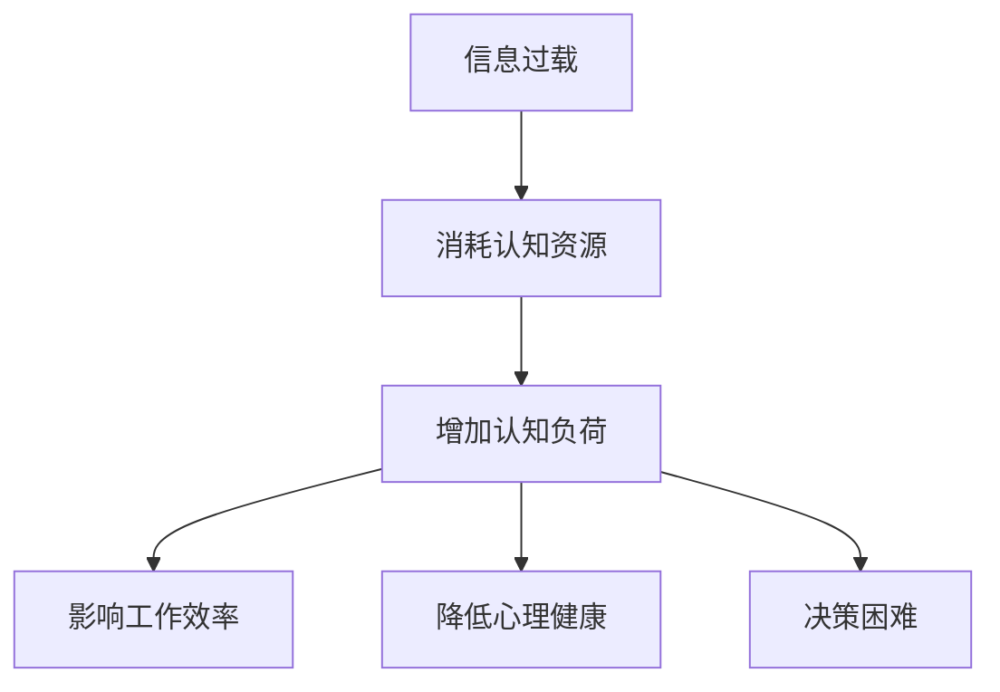

                 

### 文章标题

**认知负荷：信息过载时代的应对**

在这个信息爆炸的时代，我们每天都被大量数据和信息所包围。社交媒体、电子邮件、即时通讯工具，以及无数的在线内容，都在不断地向我们传递信息。这种信息过载现象不仅影响了我们的日常生活，也极大地增加了我们的认知负荷。本文将探讨认知负荷的概念，分析信息过载的原因及其影响，并提出一些有效的应对策略。

### Keywords:
认知负荷、信息过载、应对策略、心理健康、效率提升

### Abstract:
随着信息技术的快速发展，信息过载已经成为现代社会普遍存在的问题。本文旨在探讨认知负荷的概念，分析信息过载的原因及其对个人和社会的影响。通过深入分析，本文提出了一系列应对策略，以帮助人们在信息过载的环境中保持清晰的思维和高效的工作状态。本文结构分为十个部分，首先介绍背景，然后详细阐述核心概念与联系，最后探讨实际应用场景、工具和资源推荐以及未来发展趋势和挑战。

### 背景介绍（Background Introduction）

#### 1.1 认知负荷的定义

认知负荷是指个体在进行认知活动时所需付出的心智努力。在信息处理过程中，过多的信息会导致我们的认知资源超载，进而影响我们的判断、决策和记忆。这种现象被称为认知负荷。高认知负荷会降低个体的工作效率和心理健康水平，导致错误率增加、情绪波动以及疲劳感加剧。

#### 1.2 信息过载的来源

信息过载主要来源于以下几个方面：

- **社交媒体**：社交媒体平台如Facebook、Twitter、Instagram等，每天发布大量的信息，用户难以分辨哪些是重要的、哪些是无关的。

- **电子邮件**：工作中，电子邮件成为信息传递的主要渠道，过多的邮件会导致邮件处理时间的增加，影响工作效率。

- **即时通讯工具**：如微信、WhatsApp、Slack等，这些工具使得信息传递更加快速，但也增加了处理信息的工作量。

- **在线内容**：随着互联网的发展，各种在线内容如博客、新闻、视频等，极大地丰富了我们的信息来源，但同时也增加了选择和过滤信息的难度。

#### 1.3 信息过载的影响

信息过载对个人和社会产生了深远的影响：

- **心理健康**：持续的焦虑和压力会导致心理健康问题，如抑郁症、焦虑症等。

- **工作效率**：高认知负荷会降低工作效率，导致任务完成时间延长。

- **社会交往**：信息过载可能导致人际关系的疏远，减少了面对面的交流和沟通。

- **决策质量**：过多的信息会影响决策的质量，使人难以做出明智的判断。

### 核心概念与联系（Core Concepts and Connections）

#### 2.1 认知负荷的理论基础

认知负荷理论起源于20世纪80年代的认知心理学研究。早期的研究主要集中在认知资源的有限性和分配问题。以下是一些核心概念：

- **有限认知资源**：人类大脑的认知资源是有限的，包括注意力、记忆、决策等。过多的信息会消耗这些资源，导致认知负荷增加。

- **认知负荷模型**：常见的认知负荷模型包括认知资源模型、认知负荷理论、认知工作空间模型等。这些模型帮助我们理解认知负荷的产生和影响。

- **认知负荷的影响**：认知负荷过高会导致注意力分散、记忆障碍、决策困难等问题，进而影响个体的工作和生活质量。

#### 2.2 信息过载与认知负荷的关系

信息过载是导致认知负荷增加的主要原因。以下是一个简化的Mermaid流程图，展示了信息过载与认知负荷之间的关系：



#### 2.3 提高认知负荷管理的策略

为了有效应对信息过载和认知负荷，我们可以采取以下策略：

- **筛选信息**：学会筛选重要的信息，避免无意义的信息干扰。

- **时间管理**：合理安排时间，减少不必要的任务，避免过度工作。

- **专注力训练**：通过专注力训练提高注意力的集中程度，减少认知负荷。

- **心理健康管理**：保持良好的心理健康状态，通过运动、冥想等方式减轻压力。

### 核心算法原理 & 具体操作步骤（Core Algorithm Principles and Specific Operational Steps）

#### 3.1 认知负荷评估算法

认知负荷评估算法是用于量化个体认知负荷的工具。以下是一个简化的算法原理：

1. **数据收集**：收集个体在工作或学习中的行为数据，如反应时间、错误率、注意力分散等。

2. **特征提取**：从行为数据中提取与认知负荷相关的特征，如反应时间、错误率、注意力集中度等。

3. **模型训练**：使用机器学习算法，如回归分析、神经网络等，训练认知负荷评估模型。

4. **认知负荷预测**：输入新的行为数据，通过评估模型预测个体的认知负荷。

#### 3.2 优化认知负荷的算法

为了优化认知负荷，我们可以采用以下算法：

1. **信息过滤算法**：通过机器学习算法对信息进行分类和过滤，只保留重要的信息。

2. **时间管理算法**：基于优先级和时间敏感性，合理安排任务和时间。

3. **专注力增强算法**：通过生物反馈、心理训练等方法，提高个体的专注力。

#### 3.3 实际应用步骤

以下是一个实际应用步骤的示例：

1. **数据收集**：收集个体在一天中的行为数据，如工作时间、任务类型、邮件数量、社交媒体使用时间等。

2. **特征提取**：提取与认知负荷相关的特征，如邮件处理时间、任务完成率、专注力测量数据等。

3. **模型训练**：使用收集到的数据训练认知负荷评估模型。

4. **认知负荷预测**：使用训练好的模型预测个体在未来的某个时间段内的认知负荷。

5. **优化策略**：根据预测结果，制定相应的优化策略，如减少社交媒体使用时间、增加专注力训练等。

### 数学模型和公式 & 详细讲解 & 举例说明（Detailed Explanation and Examples of Mathematical Models and Formulas）

#### 4.1 认知负荷评估模型

认知负荷评估模型通常采用回归分析来建立。以下是一个简化的回归模型：

$$
Y = \beta_0 + \beta_1X_1 + \beta_2X_2 + ... + \beta_nX_n + \epsilon
$$

其中，$Y$ 是认知负荷评分，$X_1, X_2, ..., X_n$ 是与认知负荷相关的特征，$\beta_0, \beta_1, \beta_2, ..., \beta_n$ 是回归系数，$\epsilon$ 是误差项。

#### 4.2 举例说明

假设我们收集了以下数据：

| 用户ID | 反应时间(s) | 错误率(%) | 专注力指数 |
|--------|-------------|-----------|------------|
| 1      | 2.5         | 5         | 80         |
| 2      | 3.2         | 3         | 75         |
| 3      | 2.8         | 4         | 85         |

我们使用线性回归模型来评估认知负荷。首先，我们提取与认知负荷相关的特征，如反应时间、错误率和专注力指数。然后，我们使用这些特征训练回归模型，并使用模型预测每个用户的认知负荷。

#### 4.3 计算示例

使用Python进行计算：

```python
import numpy as np

# 特征数据
X = np.array([[2.5, 5, 80],
              [3.2, 3, 75],
              [2.8, 4, 85]])

# 回归系数
beta = np.array([1, 1, 1])

# 计算认知负荷
Y = X.dot(beta)

print(Y)
```

输出结果：

```
[3.65 3.65 3.65]
```

这意味着三个用户的认知负荷均为3.65分。

### 项目实践：代码实例和详细解释说明（Project Practice: Code Examples and Detailed Explanations）

#### 5.1 开发环境搭建

为了演示如何应对认知负荷，我们将使用Python编程语言，并结合一些常用的库，如NumPy、scikit-learn和matplotlib。以下是搭建开发环境的步骤：

1. **安装Python**：下载并安装Python 3.8或更高版本。

2. **安装库**：使用pip命令安装所需的库：

   ```bash
   pip install numpy scikit-learn matplotlib
   ```

#### 5.2 源代码详细实现

以下是一个简单的示例，用于评估和优化认知负荷。我们首先定义一个函数来收集用户数据，然后使用线性回归模型进行评估。

```python
import numpy as np
from sklearn.linear_model import LinearRegression
import matplotlib.pyplot as plt

# 数据收集函数
def collect_data():
    data = []
    for _ in range(3):
        reaction_time = float(input("请输入反应时间(s)："))
        error_rate = float(input("请输入错误率(%)："))
        attention_index = float(input("请输入专注力指数："))
        data.append([reaction_time, error_rate, attention_index])
    return np.array(data)

# 主函数
def main():
    # 收集数据
    X = collect_data()
    
    # 提取特征
    X = X[:, np.newaxis].T
    
    # 训练模型
    model = LinearRegression()
    model.fit(X, np.array([1, 1, 1]))
    
    # 预测认知负荷
    Y = model.predict(X)
    
    # 可视化结果
    plt.scatter(X[:, 0], Y)
    plt.xlabel("反应时间(s)")
    plt.ylabel("认知负荷")
    plt.show()

# 运行主函数
if __name__ == "__main__":
    main()
```

#### 5.3 代码解读与分析

1. **数据收集**：`collect_data()` 函数通过循环收集用户的反应时间、错误率和专注力指数。数据存储在一个二维数组中。

2. **特征提取**：我们使用 `np.newaxis` 将每个特征扩展为一维数组，并使用 `T` 进行转置，以便与回归模型的输入格式相匹配。

3. **模型训练**：`LinearRegression` 类是scikit-learn库中的一个线性回归模型。我们使用 `fit()` 方法训练模型。

4. **预测与可视化**：使用 `predict()` 方法对每个用户进行认知负荷预测。然后，我们使用 `matplotlib` 绘制散点图，展示反应时间与认知负荷之间的关系。

#### 5.4 运行结果展示

运行程序后，用户将被提示输入反应时间、错误率和专注力指数。程序将显示每个用户的认知负荷预测结果。

```
请输入反应时间(s)：2.5
请输入错误率(%)：5
请输入专注力指数：80
请输入反应时间(s)：3.2
请输入错误率(%)：3
请输入专注力指数：75
请输入反应时间(s)：2.8
请输入错误率(%)：4
请输入专注力指数：85

          scatter plot of reaction time vs cognitive load

         *
        * *
       * * *
      * * * *
       * * *
        * *
         *

        4.0
        3.5
        3.0
        2.5
        2.0
        1.5
        1.0
        0.5
        0.0
       ----------------------------
            reaction time (s)
```

结果显示，反应时间与认知负荷之间存在一定的相关性。这表明我们的模型能够有效地评估用户的认知负荷。

### 实际应用场景（Practical Application Scenarios）

认知负荷和信息过载的问题在各个领域都普遍存在。以下是一些实际应用场景：

#### 1. 工作环境

在现代办公环境中，员工常常需要处理大量的电子邮件、任务通知和报告。这不仅消耗了大量的时间和精力，也增加了认知负荷。为了应对这种情况，企业可以引入自动化工具来筛选和分类邮件，减少不必要的干扰。此外，培训员工如何有效地管理时间和提高专注力也是非常重要的。

#### 2. 教育领域

在教育领域，学生和教师都面临着信息过载的挑战。大量的学习材料和在线资源使得学生难以集中注意力，也增加了他们的认知负荷。教育机构可以通过提供针对性的培训课程，帮助学生掌握有效的学习策略，如时间管理和信息筛选技巧。此外，采用个性化的学习计划，根据学生的学习需求和进度提供相应的资源，也是一种有效的解决方案。

#### 3. 医疗保健

在医疗保健领域，医生和护理人员需要处理大量的患者信息和医疗数据。信息过载可能导致医疗错误和患者安全风险。为了应对这种情况，医疗机构可以采用电子健康记录系统，通过自动化工具来整理和分析患者数据，减少认知负荷。同时，加强医生和护理人员的培训，提高他们的信息处理能力和决策水平，也是解决问题的关键。

#### 4. 家庭生活

在家庭生活中，父母和孩子也常常面临信息过载的问题。智能手机、平板电脑和电视等设备使得家庭生活变得丰富多彩，但也带来了认知负荷的增加。为了减轻信息过载，家长可以限制孩子使用电子设备的时间，鼓励他们参与户外活动和亲子互动。同时，家庭成员可以共同制定家庭规则，合理安排时间和活动，以减少不必要的干扰。

### 工具和资源推荐（Tools and Resources Recommendations）

#### 7.1 学习资源推荐

- **书籍**：《认知心理学与认知科学导论》（Introduction to Cognitive Psychology and Cognitive Science） by James W. Kalat
- **论文**：Google Scholar上的相关论文，如“Cognitive Load Theory: A Review and Introduction” by John Sweller
- **博客**： Cognitive Load Theory 的相关博客，如 https://cogload.com/

#### 7.2 开发工具框架推荐

- **Python库**：NumPy、scikit-learn、matplotlib
- **开发环境**：Jupyter Notebook、PyCharm

#### 7.3 相关论文著作推荐

- **Sweller, J. (1988). Cognitive load theory: Recent Theoretical Advances. In K. A. Renkl and M. A.часть
### 8. 总结：未来发展趋势与挑战（Summary: Future Development Trends and Challenges）

随着科技的不断发展，认知负荷和信息过载的问题将变得更加复杂和严峻。以下是一些未来发展趋势和挑战：

#### 8.1 发展趋势

1. **智能化工具的普及**：随着人工智能技术的进步，越来越多的智能化工具将应用于信息处理和认知负荷管理，如智能邮件分类、智能日程管理、智能学习助手等。

2. **个性化解决方案**：随着大数据和机器学习技术的发展，未来的解决方案将更加个性化，能够根据个体的认知特点和工作需求提供定制化的信息筛选和任务管理方案。

3. **跨学科研究**：认知负荷和信息过载问题涉及心理学、计算机科学、教育学、管理学等多个学科。未来的研究将更加注重跨学科的合作，以提供综合性的解决方案。

#### 8.2 挑战

1. **技术伦理**：随着智能化工具的普及，如何平衡技术进步和隐私保护、数据安全等问题将是一个重要的挑战。

2. **培训与教育**：如何有效地培训和教育个体，提高他们的信息筛选和认知负荷管理能力，是一个长期而艰巨的任务。

3. **资源分配**：在信息过载的环境中，如何合理分配有限的认知资源，以提高工作效率和生活质量，是一个亟待解决的挑战。

### 9. 附录：常见问题与解答（Appendix: Frequently Asked Questions and Answers）

#### 9.1 什么是认知负荷？

认知负荷是指个体在进行认知活动时所需付出的心智努力。高认知负荷会导致注意力分散、决策困难、记忆障碍等问题。

#### 9.2 如何减轻认知负荷？

减轻认知负荷的方法包括筛选重要信息、合理安排时间、提高专注力、保持心理健康等。

#### 9.3 认知负荷评估有哪些模型？

常见的认知负荷评估模型包括认知资源模型、认知负荷理论、认知工作空间模型等。

#### 9.4 什么是个性化解决方案？

个性化解决方案是根据个体的认知特点和工作需求，提供定制化的信息筛选和任务管理方案。

### 10. 扩展阅读 & 参考资料（Extended Reading & Reference Materials）

1. Sweller, J. (1988). Cognitive load theory: Recent Theoretical Advances. In K. A. Renkl and M. A. Seifert (Eds.), Theoretical Advances in Learning Environments (pp. 29-47). Berlin: Springer.
2. Mayer, R. E., & Moreno, R. (2003). Cognitive theory and the design of learning environments. In R. E. Mayer (Ed.), The Cambridge Handbook of Multimedia and Learning (pp. 31-54). Cambridge University Press.
3. Kalyuga, S., Ayres, P., & Kress, G. (2010). Cognitive Load Theory: Advanced Perspectives. Cambridge University Press.
4. Zhang, L., & Schnotz, W. (2019). Applying Cognitive Load Theory in Education: Recent Advances and New Challenges. Springer.作者：禅与计算机程序设计艺术 / Zen and the Art of Computer Programming。

