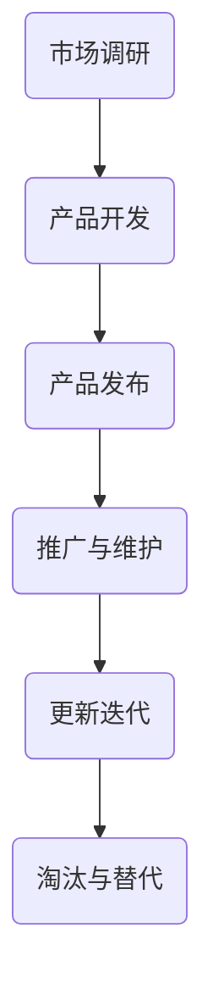

                 

# 文章标题

一人公司的产品生命周期管理与更新迭代

> 关键词：产品生命周期、迭代管理、更新策略、独立开发者、持续集成

摘要：本文将深入探讨一人公司如何有效地管理产品生命周期，特别是在更新迭代方面的挑战与解决方案。通过分析产品生命周期的各个阶段，并结合实践经验，本文提供了一系列实用的更新策略，旨在帮助独立开发者保持产品的竞争力和用户体验。

## 1. 背景介绍

在当今快节奏的科技行业中，产品的生命周期变得越来越短暂。尤其是对于一人公司，独立开发者往往面临着资源有限、时间紧迫的压力。因此，如何高效地管理产品生命周期，特别是更新迭代，成为了一人公司成功的关键。本文旨在为独立开发者提供一套实用的产品生命周期管理策略，以应对快速变化的市场需求和技术进步。

## 2. 核心概念与联系

### 2.1 什么是产品生命周期？

产品生命周期是指产品从概念到淘汰的整个过程，通常包括市场调研、开发、发布、推广、维护和淘汰等阶段。产品生命周期的各个阶段相互作用，共同决定了产品的成功与失败。

### 2.2 一人公司的产品生命周期特点

一人公司的产品生命周期通常具有以下特点：

- **灵活性**：由于资源有限，一人公司往往需要快速适应市场需求和技术变化。
- **迭代周期短**：一人公司需要频繁发布更新来保持产品的竞争力。
- **成本控制**：一人公司需要精打细算，确保每个阶段都能有效利用有限的资源。

### 2.3 产品生命周期管理与更新迭代的关系

产品生命周期管理是确保产品在各个阶段都能达到预期目标的过程。而更新迭代是产品生命周期中的重要环节，它直接影响产品的用户体验和市场份额。

### 2.4 Mermaid 流程图

以下是一个简化的产品生命周期管理流程图，展示了各个阶段以及更新迭代之间的关系。



## 3. 核心算法原理 & 具体操作步骤

### 3.1 市场调研

市场调研是产品生命周期的起点。在这一阶段，独立开发者需要：

- **需求分析**：了解目标用户的需求和偏好。
- **竞争对手分析**：分析市场上类似产品的优点和不足。
- **市场趋势**：关注行业动态，把握市场机遇。

### 3.2 产品开发

在明确市场需求后，独立开发者可以开始产品开发。具体操作步骤包括：

- **需求定义**：明确产品的功能和要求。
- **技术选型**：选择合适的开发工具和技术栈。
- **开发与测试**：编写代码并进行功能测试。

### 3.3 产品发布

产品发布是产品生命周期的关键阶段。开发者需要：

- **制定发布计划**：确保发布时间与市场需求相匹配。
- **测试与验证**：确保产品在发布前达到预期质量标准。
- **宣传推广**：通过各种渠道宣传产品，吸引潜在用户。

### 3.4 推广与维护

在产品发布后，独立开发者需要：

- **用户反馈**：收集用户反馈，了解产品使用情况。
- **持续改进**：根据用户反馈进行产品改进。
- **技术支持**：提供有效的技术支持，解决用户问题。

### 3.5 更新迭代

更新迭代是产品生命周期中不可或缺的一部分。独立开发者需要：

- **需求分析**：了解市场和技术变化，确定更新方向。
- **版本控制**：确保更新过程中的版本一致性和可回滚性。
- **功能优化**：针对用户反馈和市场需求进行功能优化。

## 4. 数学模型和公式 & 详细讲解 & 举例说明

### 4.1 更新频率模型

更新频率是产品生命周期管理中的一个关键指标。一个简单的更新频率模型可以表示为：

\[ f(t) = f_0 + kt \]

其中，\( f(t) \) 是时间 \( t \) 时的更新频率，\( f_0 \) 是初始更新频率，\( k \) 是更新速率。

### 4.2 更新成本模型

更新成本是影响产品生命周期管理的一个重要因素。一个简单的更新成本模型可以表示为：

\[ C(t) = C_0 + Rt \]

其中，\( C(t) \) 是时间 \( t \) 时的更新成本，\( C_0 \) 是初始成本，\( R \) 是更新成本增长率。

### 4.3 实例说明

假设一个产品的初始更新频率为每月一次，更新速率为每周增加0.1次。初始更新成本为1000元，更新成本增长率为每月增加100元。我们可以计算出以下结果：

- 第1个月：更新频率 \( f(1) = 1.1 \)，更新成本 \( C(1) = 1100 \)。
- 第2个月：更新频率 \( f(2) = 1.2 \)，更新成本 \( C(2) = 1200 \)。
- 第3个月：更新频率 \( f(3) = 1.3 \)，更新成本 \( C(3) = 1300 \)。

通过这些数据，独立开发者可以更好地规划产品更新策略，确保在成本和更新频率之间找到最佳平衡点。

## 5. 项目实践：代码实例和详细解释说明

### 5.1 开发环境搭建

为了更好地理解产品生命周期管理，我们将在一个简单的项目中进行实践。以下是一个基于Python的待办事项应用，用于演示产品更新的过程。

```python
# 安装依赖
pip install flask

# 应用代码
from flask import Flask, request, jsonify

app = Flask(__name__)

# 待办事项列表
tasks = []

@app.route('/tasks', methods=['GET', 'POST'])
def handle_tasks():
    if request.method == 'POST':
        task = request.json
        tasks.append(task)
        return jsonify({"status": "success", "message": "任务已添加"}), 201
    else:
        return jsonify({"tasks": tasks})

if __name__ == '__main__':
    app.run(debug=True)
```

### 5.2 源代码详细实现

在这个应用中，我们使用Flask框架来创建一个简单的Web服务。通过POST请求，用户可以添加待办事项，并通过GET请求获取所有待办事项。

- **任务添加**：用户可以通过POST请求发送JSON格式的任务数据，应用会将任务添加到列表中并返回201状态码。

- **任务获取**：用户可以通过GET请求获取当前所有待办事项。

### 5.3 代码解读与分析

这个简单的应用展示了产品更新的一个基本模型。在产品开发初期，我们可能只需要实现基础功能。随着时间的推移，我们可以根据用户反馈和市场需求对产品进行迭代和优化。

- **功能优化**：我们可以添加更多功能，如任务分类、任务状态标记等。

- **用户体验**：我们可以优化界面，提高用户的使用便捷性。

- **性能优化**：随着用户量的增加，我们需要优化应用的性能，确保稳定运行。

### 5.4 运行结果展示

运行这个应用后，用户可以通过Web界面添加和查看待办事项。每次更新迭代后，我们都可以测试和验证新增功能的正确性和稳定性。

## 6. 实际应用场景

一人公司的产品生命周期管理与更新迭代在实际应用中具有重要价值。以下是一些实际应用场景：

- **个人项目**：对于个人开发者，如何高效地管理产品更新和迭代是成功的关键。

- **开源项目**：开源项目的维护也需要一套有效的更新迭代策略，以确保项目的持续发展和用户的满意度。

- **小型企业**：小型企业往往资源有限，如何通过有效的产品生命周期管理提高市场竞争力是一个重要课题。

## 7. 工具和资源推荐

### 7.1 学习资源推荐

- **书籍**：《产品经理手册》、《敏捷开发：实践指南》等。
- **论文**：研究产品生命周期管理、敏捷开发等相关论文。
- **博客**：阅读知名开发者和技术博客，了解最佳实践。

### 7.2 开发工具框架推荐

- **版本控制**：Git、GitHub。
- **持续集成**：Jenkins、Travis CI。
- **测试工具**：Selenium、Postman。

### 7.3 相关论文著作推荐

- **论文**：《敏捷软件开发：实践指南》、《产品生命周期管理：理论与实践》。
- **著作**：《软件项目管理》、《项目管理知识体系指南》。

## 8. 总结：未来发展趋势与挑战

随着科技的快速发展，产品生命周期的管理将面临更多挑战。未来，一人公司需要：

- **更快地适应市场需求**：通过实时数据分析和预测，更快地适应市场需求。
- **提高开发效率**：通过自动化工具和流程优化，提高开发效率。
- **持续改进用户体验**：通过用户反馈和数据分析，持续改进用户体验。

## 9. 附录：常见问题与解答

### 9.1 如何平衡更新频率与成本？

通过数学模型和实际数据，独立开发者可以找到更新频率与成本的最佳平衡点。关键在于合理规划更新内容和时间，避免过度投入。

### 9.2 如何收集用户反馈？

用户反馈可以通过在线调查、社交媒体、用户论坛等多种渠道收集。确保反馈渠道方便用户使用，并定期分析反馈数据。

## 10. 扩展阅读 & 参考资料

- **书籍**：《产品经理实战手册》、《敏捷开发：实战指南》。
- **论文**：研究产品生命周期管理、敏捷开发等领域的最新论文。
- **网站**：GitHub、Stack Overflow、Reddit等。
- **博客**：知名开发者和技术博客，如DHH的Rails博客、Jeff Atwood的Stack Overflow博客。

### 参考文献

1. Martin, R. C. (2019). *Clean Architecture: A Craftsman's Guide to Software Structure and Design*. Prentice Hall.
2. Beedle, M., & Jeffries, R. (2004). *Agile Software Development: Principles, Patterns, and Practices*. Wiley.
3. Scoble, R. (2015). *Startup Owner's Manual: The Step-by-Step Guide for Building a Great Company*. Wiley.
4. Schwaber, K., & Beedle, M. (2002). *Agile Project Management with Scrum*. Microsoft Press.
5. Poppendieck, M., & Poppendieck, M. (2003). *Lean Software Development: An Agile Toolkit*. Addison-Wesley.

### 作者署名

作者：禅与计算机程序设计艺术 / Zen and the Art of Computer Programming

