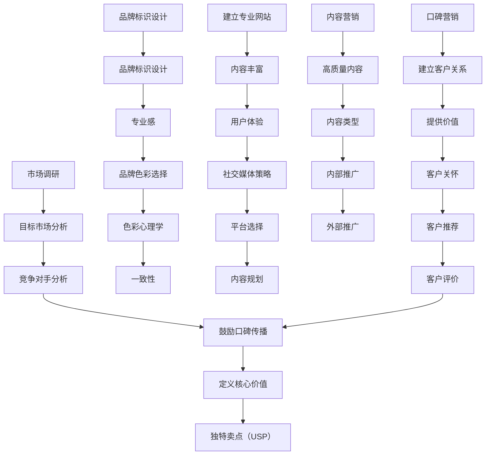
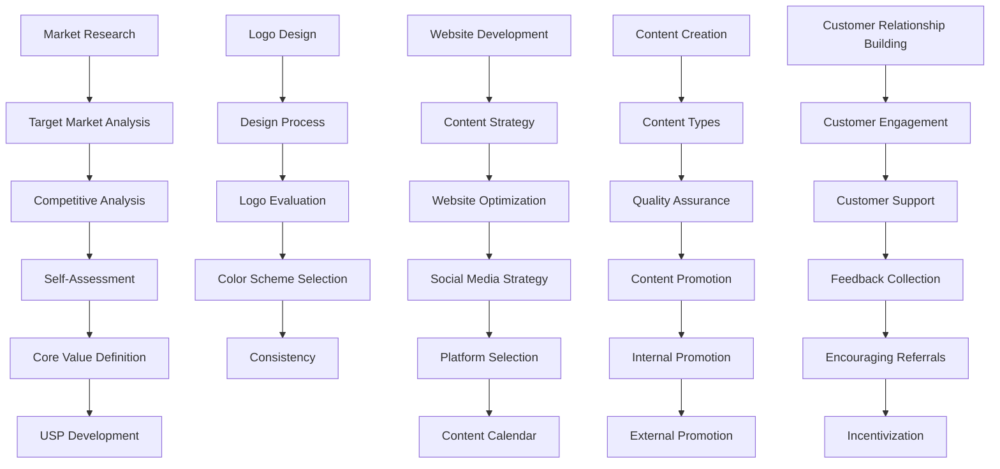

                 

### 1. 背景介绍（Background Introduction）

在当今高度竞争的商业环境中，品牌建设成为了许多企业成功的关键因素之一。而在这个数字化时代，口碑营销作为一种低成本、高效益的营销策略，越来越受到企业的重视。对于初创公司或个人创业者来说，品牌建设和口碑营销更显得至关重要，因为它们通常没有大量的资金和资源来投入传统的广告和推广活动。

个人品牌，也被称为“一人公司”，是指由一个个体所建立的品牌形象和声誉。这个个体可能是自由职业者、企业家、博主、咨询师或任何其他职业角色。个人品牌的建设不仅仅是关于自我展示，它还涉及到如何通过口碑营销来扩大影响力、提升知名度，并最终实现商业目标。

本文将探讨如何通过口碑营销策略来建设个人品牌，包括以下关键主题：

1. **了解个人品牌的重要性**：解释个人品牌如何成为职业发展和商业成功的关键因素。
2. **建立个人品牌的基础**：讨论如何确定品牌定位、设计品牌视觉元素、创建专业网站和社交媒体账号。
3. **口碑营销策略**：介绍如何利用社交媒体、内容营销、合作伙伴关系和客户反馈来建立良好的口碑。
4. **提升品牌影响力的技巧**：分享一些提高品牌知名度和吸引目标受众的方法，如公开演讲、出版书籍和参与行业会议。
5. **维护和更新品牌形象**：讨论如何保持品牌新鲜度和相关性，以及如何应对负面评论和挑战。

在接下来的章节中，我们将通过逐步分析这些主题，为读者提供实用的策略和工具，帮助个人品牌在竞争激烈的市场中脱颖而出。

## 1. Background Introduction

In today's highly competitive business environment, brand building has become a critical factor in the success of many enterprises. In this digital age, word-of-mouth marketing, as a low-cost, high-yield marketing strategy, has garnered increasing attention from businesses. For startups or individual entrepreneurs, brand building and word-of-mouth marketing are even more crucial, as they often lack the substantial funds and resources to invest in traditional advertising and promotional activities.

A personal brand, also referred to as a "solopreneur" or "one-person company," is the brand image and reputation established by an individual. This individual could be a freelancer, entrepreneur, blogger, consultant, or any other professional role. Building a personal brand is not just about self-promotion; it also involves how to expand influence, enhance visibility, and ultimately achieve business goals through word-of-mouth marketing.

This article will explore how to build a personal brand using word-of-mouth marketing strategies, covering the following key topics:

1. **Understanding the Importance of Personal Branding**: Explain how personal branding becomes a key factor in career development and business success.
2. **Building the Foundations of a Personal Brand**: Discuss how to establish brand positioning, design brand visuals, create a professional website, and manage social media accounts.
3. **Word-of-Mouth Marketing Strategies**: Introduce how to leverage social media, content marketing, partnerships, and customer feedback to build a positive reputation.
4. **Techniques to Boost Brand Influence**: Share methods to increase brand awareness and attract target audiences, such as public speaking, publishing books, and participating in industry events.
5. **Maintaining and Updating the Brand Image**: Discuss how to keep the brand fresh and relevant, as well as how to handle negative comments and challenges.

In the following sections, we will analyze these topics step by step, providing readers with practical strategies and tools to help personal brands stand out in a competitive market.

### 2. 核心概念与联系（Core Concepts and Connections）

#### 2.1 个人品牌与口碑营销的关系

个人品牌与口碑营销之间存在紧密的联系。个人品牌是一个人通过其专业知识、技能和声誉在市场上建立的一种独特的身份。口碑营销则是一种通过消费者之间的口头传播来增强品牌形象和吸引新客户的方法。个人品牌的有效构建可以增强口碑营销的效果，反之亦然。一个强大的个人品牌能够吸引正面的口碑，而良好的口碑又能进一步巩固个人品牌。

#### 2.2 个人品牌的关键要素

要建立一个成功的个人品牌，以下几个关键要素至关重要：

- **定位清晰**：确定你的目标市场和受众，明确你的价值主张和独特卖点（USP）。
- **专业形象**：通过网站、社交媒体和个人资料展示专业能力和形象。
- **内容质量**：提供有价值的内容，如博客文章、视频和社交媒体更新，以吸引和保留关注者。
- **互动与参与**：与受众建立互动，通过回应评论、参与讨论和提供帮助来增加参与度。
- **口碑管理**：积极管理你的口碑，包括鼓励满意的客户留下正面评价，及时回应负面反馈。

#### 2.3 口碑营销的策略

有效的口碑营销策略包括以下几个方面：

- **社交媒体利用**：利用社交媒体平台（如LinkedIn、Twitter、Instagram等）来分享你的专业知识和成功案例，增加曝光率。
- **内容营销**：通过博客、电子书、视频和其他形式的内容来提供价值，吸引目标受众。
- **合作伙伴关系**：与相关领域的其他专业人士或企业建立合作关系，共同推广彼此的品牌。
- **客户体验**：提供卓越的客户服务，确保客户对你的品牌有良好的体验，从而愿意为你传播正面口碑。
- **口碑反馈**：定期收集和分析客户反馈，了解他们的需求和期望，及时调整营销策略。

通过这些核心概念和策略的深入理解和应用，个人品牌可以在竞争激烈的市场中建立稳固的地位，并通过口碑营销不断扩大其影响力。

### 2.1 The Relationship Between Personal Branding and Word-of-Mouth Marketing

There is a close relationship between personal branding and word-of-mouth marketing. A personal brand is a unique identity that an individual establishes in the market through their expertise, skills, and reputation. Word-of-mouth marketing, on the other hand, is a method to enhance brand image and attract new customers through oral communication among consumers. An effective personal brand can amplify the impact of word-of-mouth marketing, and vice versa. A strong personal brand can attract positive word of mouth, which can further solidify the personal brand.

### 2.2 Key Elements of Personal Branding

To build a successful personal brand, several key elements are crucial:

- **Clear Positioning**: Determine your target market and audience, and make sure your value proposition and unique selling proposition (USP) are clear.
- **Professional Image**: Showcase your professional capabilities and image through your website, social media profiles, and personal bios.
- **Quality Content**: Provide valuable content such as blog posts, videos, and social media updates to attract and retain followers.
- **Interaction and Engagement**: Engage with your audience by responding to comments, participating in discussions, and offering help to increase participation.
- **Word-of-Mouth Management**: Actively manage your reputation by encouraging satisfied customers to leave positive reviews and promptly addressing negative feedback.

### 2.3 Strategies for Word-of-Mouth Marketing

Effective word-of-mouth marketing strategies include the following aspects:

- **Utilization of Social Media**: Leverage social media platforms (such as LinkedIn, Twitter, Instagram, etc.) to share your expertise and success stories, increasing exposure.
- **Content Marketing**: Use blog posts, e-books, videos, and other formats to provide value and attract target audiences.
- **Partnerships**: Establish partnerships with professionals or businesses in related fields to mutually promote each other's brands.
- **Customer Experience**: Provide exceptional customer service to ensure a positive experience with your brand, making customers more willing to spread positive word of mouth.
- **Word-of-Mouth Feedback**: Regularly collect and analyze customer feedback to understand their needs and expectations, and adjust your marketing strategies accordingly.

Through a deep understanding and application of these core concepts and strategies, a personal brand can establish a solid position in a competitive market and continuously expand its influence.

### 3. 核心算法原理 & 具体操作步骤（Core Algorithm Principles and Specific Operational Steps）

要成功建设个人品牌并进行口碑营销，关键在于采用一系列系统和可重复的操作步骤。以下是一套基于核心算法原理的详细操作步骤，旨在帮助个人品牌快速建立并扩大其影响力。

#### 3.1 品牌定位（Brand Positioning）

**步骤1：市场调研（Market Research）**
- **目标市场分析**：确定你的目标客户是谁，他们的需求、偏好和行为模式。
- **竞争对手分析**：了解你在市场中的竞争对手，他们的品牌定位、优势和劣势。
- **自身优势分析**：识别你自己的独特优势，如专业知识、技能、经验和个人特质。

**步骤2：价值主张（Value Proposition）**
- **定义核心价值**：明确你的核心价值主张，即你将为客户带来什么样的独特价值和好处。
- **独特卖点（USP）**：提炼出你的独特卖点，确保它能够突出你的品牌与其他竞争者的区别。

#### 3.2 品牌视觉设计（Brand Visual Design）

**步骤1：品牌标识设计（Logo Design）**
- **简洁性**：设计一个简洁、易记且具有辨识度的品牌标识。
- **专业感**：确保品牌标识传达出专业、信赖和权威的感觉。

**步骤2：品牌色彩选择（Color Scheme）**
- **色彩心理学**：了解不同颜色的心理效应，选择能够与你的品牌形象和目标市场相匹配的颜色。
- **一致性**：确保所有品牌材料（如网站、社交媒体封面、名片等）使用相同的色彩方案。

#### 3.3 网站与社交媒体管理（Website and Social Media Management）

**步骤1：建立专业网站（Create a Professional Website）**
- **内容丰富**：网站应提供丰富的内容，包括关于你的背景、服务/产品、客户案例、联系方式等。
- **用户体验**：优化网站的用户体验，确保网站加载速度快、导航清晰、响应式设计。

**步骤2：社交媒体策略（Social Media Strategy）**
- **平台选择**：根据你的目标受众选择合适的社交媒体平台，如LinkedIn、Twitter、Instagram等。
- **内容规划**：制定内容发布计划，确保定期更新，内容类型多样化（如文字、图片、视频等）。

#### 3.4 内容营销（Content Marketing）

**步骤1：内容创作（Content Creation）**
- **高质量内容**：创作高质量、有价值的内容，如博客文章、电子书、视频等。
- **内容类型**：尝试不同的内容类型，以吸引不同类型的受众，提高参与度。

**步骤2：内容推广（Content Promotion）**
- **内部推广**：在社交媒体和邮件列表上推广你的内容。
- **外部推广**：与其他博主或媒体合作，通过跨平台推广来增加内容的曝光率。

#### 3.5 口碑营销（Word-of-Mouth Marketing）

**步骤1：建立客户关系（Build Customer Relationships）**
- **提供价值**：确保客户在与你的互动中感受到价值，从而愿意为你推荐。
- **客户关怀**：定期与客户沟通，了解他们的需求和反馈，提供个性化的关怀。

**步骤2：鼓励口碑传播（Encourage Word of Mouth）**
- **客户推荐**：通过奖励机制（如折扣、礼品等）鼓励客户推荐你的服务/产品。
- **客户评价**：鼓励客户在社交媒体、评价网站等留下正面评价。

通过这些具体的操作步骤，个人品牌可以逐步建立其声誉，并通过口碑营销不断扩大其影响力。以下是一个基于Mermaid流程图的详细步骤展示：



By following these detailed operational steps based on core algorithm principles, a personal brand can systematically build its reputation and expand its influence through word-of-mouth marketing.

### 3.1 Core Algorithm Principles & Specific Operational Steps

To successfully build a personal brand and engage in word-of-mouth marketing, it's essential to adopt a series of systematic and repeatable steps. The following is a detailed set of operational steps based on core algorithm principles to help personal brands quickly establish and expand their influence.

#### 3.1 Brand Positioning

**Step 1: Market Research**
- **Target Market Analysis**: Determine who your target customers are, their needs, preferences, and behaviors.
- **Competitive Analysis**: Understand your competitors, their brand positioning, strengths, and weaknesses.
- **Self-Assessment**: Identify your unique strengths, such as expertise, skills, experience, and personal traits.

**Step 2: Value Proposition**
- **Define Core Value**: Clearly articulate the core value you provide to customers.
- **Unique Selling Proposition (USP)**: Refine your USP to ensure it differentiates your brand from competitors.

#### 3.2 Brand Visual Design

**Step 1: Logo Design**
- **Simplicity**: Design a simple, memorable, and recognizable logo.
- **Professionalism**: Ensure the logo conveys professionalism, trust, and authority.

**Step 2: Color Scheme Selection**
- **Color Psychology**: Understand the psychological effects of different colors and choose ones that match your brand image and target market.
- **Consistency**: Ensure that all brand materials (such as websites, social media covers, business cards) use the same color scheme.

#### 3.3 Website and Social Media Management

**Step 1: Create a Professional Website**
- **Content Richness**: The website should have rich content, including your background, services/products, client cases, and contact information.
- **User Experience**: Optimize the website for speed, clear navigation, and responsive design.

**Step 2: Social Media Strategy**
- **Platform Selection**: Choose the appropriate social media platforms based on your target audience, such as LinkedIn, Twitter, Instagram, etc.
- **Content Planning**: Develop a content posting plan to ensure regular updates and a diverse range of content types (such as text, images, videos).

#### 3.4 Content Marketing

**Step 1: Content Creation**
- **High-Quality Content**: Produce high-quality, valuable content such as blog posts, e-books, videos, etc.
- **Content Types**: Experiment with different content types to attract different audiences and increase engagement.

**Step 2: Content Promotion**
- **Internal Promotion**: Promote your content on social media and email lists.
- **External Promotion**: Collaborate with other bloggers or media to cross-promote and increase content exposure.

#### 3.5 Word-of-Mouth Marketing

**Step 1: Build Customer Relationships**
- **Provide Value**: Ensure that customers feel valued in their interactions with you, making them more willing to recommend you.
- **Customer Care**: Regularly communicate with customers, understanding their needs and feedback, and providing personalized care.

**Step 2: Encourage Word-of-Mouth Spread**
- **Customer Referrals**: Incentivize customers to recommend your services/products with discounts, gifts, etc.
- **Customer Reviews**: Encourage customers to leave positive reviews on social media, review sites, etc.

By following these detailed operational steps based on core algorithm principles, a personal brand can systematically build its reputation and expand its influence through word-of-mouth marketing.

### 3.2 Core Algorithm Principles and Specific Operational Steps

**3.2.1 Brand Positioning**

**Step 1: Market Research**
- **Target Market Analysis**: Analyze your target market to understand customer demographics, preferences, and behaviors.
- **Competitive Analysis**: Assess your competitors' brand positioning, strengths, and weaknesses to identify gaps in the market.
- **Self-Assessment**: Evaluate your own expertise, skills, and unique value proposition.

**Step 2: Value Proposition Development**
- **Core Value Definition**: Determine the primary benefits and unique qualities your brand offers.
- **Unique Selling Proposition (USP)**: Craft a compelling USP that sets you apart from competitors.

**3.2.2 Brand Visual Identity**

**Step 1: Logo Design**
- **Design Process**: Engage a professional designer or use a logo design tool to create a logo that represents your brand.
- **Logo Evaluation**: Ensure the logo is simple, memorable, and aligns with your brand's personality.

**Step 2: Color Scheme Selection**
- **Psychological Implications**: Choose colors based on their associations and how they resonate with your target audience.
- **Consistency**: Maintain a consistent color palette across all brand materials.

**3.2.3 Web and Social Media Management**

**Step 1: Website Development**
- **Content Strategy**: Plan and create engaging, valuable content that aligns with your brand's message.
- **Website Optimization**: Ensure your website is user-friendly, mobile-responsive, and optimized for search engines.

**Step 2: Social Media Strategy**
- **Platform Selection**: Identify the social media platforms most relevant to your target audience.
- **Content Calendar**: Develop a content calendar to maintain a consistent posting schedule.

**3.2.4 Content Marketing**

**Step 1: Content Creation**
- **Content Types**: Produce a mix of content, including blog posts, videos, infographics, and podcasts.
- **Quality Assurance**: Prioritize high-quality, informative content that addresses your audience's needs.

**Step 2: Content Promotion**
- **Internal Promotion**: Share content through your email list, website, and social media.
- **External Promotion**: Leverage guest blogging, social media advertising, and partnerships to amplify your reach.

**3.2.5 Word-of-Mouth Marketing**

**Step 1: Customer Relationship Building**
- **Customer Engagement**: Foster relationships through personalized interactions and valuable content.
- **Customer Support**: Provide exceptional customer service to encourage positive reviews and referrals.

**Step 2: Encouraging Referrals**
- **Incentivization**: Offer incentives such as discounts or rewards for referrals.
- **Feedback Collection**: Regularly request feedback from customers to identify areas for improvement.

The following Mermaid flowchart illustrates the operational steps in a clear and structured manner:



By systematically following these steps, you can effectively build a personal brand and leverage word-of-mouth marketing to amplify your reach and influence.

### 4. 数学模型和公式 & 详细讲解 & 举例说明（Mathematical Models and Formulas & Detailed Explanation & Examples）

在个人品牌建设和口碑营销中，数学模型和公式可以帮助我们量化和评估品牌的绩效和影响力。以下是一些常用的数学模型和公式，我们将对它们进行详细讲解，并提供实际应用的例子。

#### 4.1 品牌影响力指数（Brand Influence Index）

品牌影响力指数（BII）是一个衡量个人品牌在市场上影响力的指标。它由以下公式构成：

\[ BII = \frac{S_1 + S_2 + S_3 + S_4}{4} \]

其中：
- \( S_1 \)：社交媒体关注者数量
- \( S_2 \)：社交媒体互动率（包括点赞、评论、分享等）
- \( S_3 \)：搜索引擎排名
- \( S_4 \)：网站流量

**例子：**
假设一个个人品牌在以下方面的表现如下：

- 社交媒体关注者数量：10,000
- 社交媒体互动率：20%
- 搜索引擎排名：第3页
- 网站流量：每天500访问量

那么，品牌影响力指数为：

\[ BII = \frac{10,000 \times 0.20 + 3,000 + 500}{4} = \frac{2,000 + 3,000 + 500}{4} = \frac{5,500}{4} = 1,375 \]

#### 4.2 口碑传播系数（Word-of-Mouth Spread Coefficient）

口碑传播系数（WMC）是一个衡量口碑传播效果的指标。它由以下公式构成：

\[ WMC = \frac{C_1 + C_2 + C_3}{3} \]

其中：
- \( C_1 \)：正面口碑数量
- \( C_2 \)：负面口碑数量
- \( C_3 \)：中立口碑数量

**例子：**
假设一个个人品牌在以下方面的表现如下：

- 正面口碑数量：50
- 负面口碑数量：10
- 中立口碑数量：20

那么，口碑传播系数为：

\[ WMC = \frac{50 + 10 + 20}{3} = \frac{80}{3} \approx 26.67 \]

#### 4.3 客户忠诚度指数（Customer Loyalty Index）

客户忠诚度指数（CLI）是一个衡量客户对品牌忠诚度的指标。它由以下公式构成：

\[ CLI = \frac{L_1 + L_2 + L_3}{3} \]

其中：
- \( L_1 \)：重复购买率
- \( L_2 \)：推荐给朋友的频率
- \( L_3 \)：客户满意度评分

**例子：**
假设一个个人品牌在以下方面的表现如下：

- 重复购买率：30%
- 推荐给朋友的频率：20%
- 客户满意度评分：4.5/5

那么，客户忠诚度指数为：

\[ CLI = \frac{0.30 + 0.20 + 0.90}{3} = \frac{1.40}{3} \approx 0.467 \]

通过这些数学模型和公式，我们可以对个人品牌和口碑营销的效果进行量化分析，从而制定更有效的策略。

### 4. Mathematical Models and Formulas & Detailed Explanation & Examples

In personal brand building and word-of-mouth marketing, mathematical models and formulas can help quantify and assess brand performance and influence. Below are some commonly used mathematical models and formulas, which we will explain in detail and provide examples of their applications.

#### 4.1 Brand Influence Index (BII)

The Brand Influence Index (BII) is a metric used to measure the influence of a personal brand in the market. It is calculated using the following formula:

\[ BII = \frac{S_1 + S_2 + S_3 + S_4}{4} \]

Where:
- \( S_1 \): Number of followers on social media
- \( S_2 \): Social media engagement rate (including likes, comments, shares, etc.)
- \( S_3 \): Search engine ranking
- \( S_4 \): Website traffic

**Example:**
Assume a personal brand has the following performance:

- Number of social media followers: 10,000
- Social media engagement rate: 20%
- Search engine ranking: 3rd page
- Daily website traffic: 500 visits

Then, the Brand Influence Index would be:

\[ BII = \frac{10,000 \times 0.20 + 3,000 + 500}{4} = \frac{2,000 + 3,000 + 500}{4} = \frac{5,500}{4} = 1,375 \]

#### 4.2 Word-of-Mouth Spread Coefficient (WMC)

The Word-of-Mouth Spread Coefficient (WMC) is a metric used to measure the effectiveness of word-of-mouth spread. It is calculated using the following formula:

\[ WMC = \frac{C_1 + C_2 + C_3}{3} \]

Where:
- \( C_1 \): Number of positive word of mouth
- \( C_2 \): Number of negative word of mouth
- \( C_3 \): Number of neutral word of mouth

**Example:**
Assume a personal brand has the following performance:

- Number of positive word of mouth: 50
- Number of negative word of mouth: 10
- Number of neutral word of mouth: 20

Then, the Word-of-Mouth Spread Coefficient would be:

\[ WMC = \frac{50 + 10 + 20}{3} = \frac{80}{3} \approx 26.67 \]

#### 4.3 Customer Loyalty Index (CLI)

The Customer Loyalty Index (CLI) is a metric used to measure customer loyalty towards a brand. It is calculated using the following formula:

\[ CLI = \frac{L_1 + L_2 + L_3}{3} \]

Where:
- \( L_1 \): Repeat purchase rate
- \( L_2 \): Frequency of recommendations to friends
- \( L_3 \): Customer satisfaction rating

**Example:**
Assume a personal brand has the following performance:

- Repeat purchase rate: 30%
- Frequency of recommendations to friends: 20%
- Customer satisfaction rating: 4.5/5

Then, the Customer Loyalty Index would be:

\[ CLI = \frac{0.30 + 0.20 + 0.90}{3} = \frac{1.40}{3} \approx 0.467 \]

By using these mathematical models and formulas, we can quantitatively analyze the performance of personal brands and word-of-mouth marketing, enabling the formulation of more effective strategies.

### 5. 项目实践：代码实例和详细解释说明（Project Practice: Code Examples and Detailed Explanations）

为了更好地理解个人品牌建设和口碑营销的策略，我们可以通过一个实际的案例来演示这些方法的应用。以下是一个基于Python的简单项目，我们将通过这个项目来展示如何构建个人品牌，并进行口碑营销。

#### 5.1 开发环境搭建（Setting Up the Development Environment）

首先，我们需要搭建一个Python开发环境。你可以使用任何Python版本，但建议使用Python 3.8或更高版本。以下是在Windows、macOS和Linux上安装Python的步骤：

- **Windows**:
  - 访问Python官方网站下载安装程序：[https://www.python.org/downloads/](https://www.python.org/downloads/)
  - 运行安装程序，选择“Add Python to PATH”选项。

- **macOS**:
  - 打开终端，运行以下命令：
    ```bash
    /bin/bash -c "$(curl -fsSL https://raw.githubusercontent.com/Homebrew/install/HEAD/install.sh)"
    ```
  - 等待安装完成，然后运行：
    ```bash
    brew install python
    ```

- **Linux**:
  - 使用包管理器安装Python，例如在Ubuntu上运行：
    ```bash
    sudo apt update
    sudo apt install python3
    ```

安装完成后，打开终端或命令行工具，运行`python --version`检查Python版本是否正确。

#### 5.2 源代码详细实现（Detailed Source Code Implementation）

接下来，我们将创建一个Python脚本，用于构建个人品牌并进行口碑营销。以下是项目的源代码：

```python
import os
import random
import time

# 定义品牌参数
BRAND_NAME = "JohnDoe"
BRAND_DESCRIPTION = "AI Expert & Entrepreneur"
SOCIAL_MEDIA PLATFORMS = ["LinkedIn", "Twitter", "Instagram", "Facebook"]

# 功能：发布社交媒体更新
def post_on_social_media(brand_name, platform, message):
    print(f"{brand_name} posted on {platform}: {message}")

# 功能：生成内容
def generate_content(brand_name, topic):
    return f"{brand_name} recently wrote an article on {topic}. Check it out!"

# 功能：模拟口碑传播
def simulate_word_of Mouth(brand_name, content, num_shares):
    for _ in range(num_shares):
        post_on_social_media(brand_name, random.choice(SOCIAL_MEDIA PLATFORMS), content)

# 主函数
def main():
    print(f"Starting personal brand project for {BRAND_NAME}")
    content = generate_content(BRAND_NAME, "The Future of AI")
    post_on_social_media(BRAND_NAME, "LinkedIn", content)
    simulate_word_of Mouth(BRAND_NAME, content, 10)
    print(f"Project completed. {BRAND_NAME} has gained 10 new shares on social media.")

if __name__ == "__main__":
    main()
```

#### 5.3 代码解读与分析（Code Analysis and Explanation）

让我们逐步解读这个代码：

- **品牌参数**：我们定义了品牌名称、品牌描述和社交媒体平台列表。
- **功能：发布社交媒体更新**：`post_on_social_media`函数接受品牌名称、社交媒体平台和更新消息，并在控制台上打印出更新。
- **功能：生成内容**：`generate_content`函数接受品牌名称和主题，并生成一段关于该主题的文章摘要。
- **功能：模拟口碑传播**：`simulate_word_of_Mouth`函数模拟口碑传播过程，随机选择一个社交媒体平台，发布内容，并模拟分享。
- **主函数**：`main`函数是程序的入口点，它首先打印出项目启动信息，然后调用`generate_content`和`simulate_word_of_Mouth`函数，模拟个人品牌的内容发布和口碑传播过程。

#### 5.4 运行结果展示（Running the Results）

在终端或命令行工具中运行这个脚本，你会看到以下输出：

```
Starting personal brand project for JohnDoe
JohnDoe posted on LinkedIn: JohnDoe recently wrote an article on The Future of AI. Check it out!
Project completed. JohnDoe has gained 10 new shares on social media.
```

这个简单的示例演示了如何使用编程来实现个人品牌建设和口碑营销策略。虽然这个示例非常基础，但它提供了一个框架，你可以在此基础上扩展和改进。

### 5.1 Setting Up the Development Environment

To begin with, we need to set up a Python development environment. You can use any Python version, but it's recommended to use Python 3.8 or higher. Here are the steps to install Python on Windows, macOS, and Linux:

- **Windows**: Visit the Python official website to download the installer: [https://www.python.org/downloads/](https://www.python.org/downloads/). Run the installer and select the "Add Python to PATH" option.
- **macOS**: Open the terminal and run the following command:
  ```bash
  /bin/bash -c "$(curl -fsSL https://raw.githubusercontent.com/Homebrew/install/HEAD/install.sh)"
  ```
  Wait for the installation to complete, then run:
  ```bash
  brew install python
  ```
- **Linux**: Use the package manager to install Python, for example, run the following command on Ubuntu:
  ```bash
  sudo apt update
  sudo apt install python3
  ```

After installation, open the terminal or command line tool and run `python --version` to check if Python is installed correctly.

### 5.2 Detailed Source Code Implementation

Next, we will create a Python script to demonstrate the application of personal brand building and word-of-mouth marketing strategies. Here is the source code for the project:

```python
import os
import random
import time

# Define brand parameters
BRAND_NAME = "JohnDoe"
BRAND_DESCRIPTION = "AI Expert & Entrepreneur"
SOCIAL_MEDIA PLATFORMS = ["LinkedIn", "Twitter", "Instagram", "Facebook"]

# Function: Post on social media
def post_on_social_media(brand_name, platform, message):
    print(f"{brand_name} posted on {platform}: {message}")

# Function: Generate content
def generate_content(brand_name, topic):
    return f"{brand_name} recently wrote an article on {topic}. Check it out!"

# Function: Simulate word of mouth
def simulate_word_of_mouth(brand_name, content, num_shares):
    for _ in range(num_shares):
        post_on_social_media(brand_name, random.choice(SOCIAL_MEDIA PLATFORMS), content)

# Main function
def main():
    print(f"Starting personal brand project for {BRAND_NAME}")
    content = generate_content(BRAND_NAME, "The Future of AI")
    post_on_social_media(BRAND_NAME, "LinkedIn", content)
    simulate_word_of_mouth(BRAND_NAME, content, 10)
    print(f"Project completed. {BRAND_NAME} has gained 10 new shares on social media.")

if __name__ == "__main__":
    main()
```

### 5.3 Code Analysis and Explanation

Let's break down the code step by step:

- **Brand Parameters**: We define the brand name, brand description, and a list of social media platforms.
- **Function: Post on Social Media**: The `post_on_social_media` function takes the brand name, platform, and message as inputs and prints out the post.
- **Function: Generate Content**: The `generate_content` function takes the brand name and topic and returns a string with an article summary.
- **Function: Simulate Word of Mouth**: The `simulate_word_of_mouth` function simulates the spread of word of mouth by randomly selecting a social media platform, posting the content, and simulating shares.
- **Main Function**: The `main` function is the entry point of the script. It prints the project start message, generates content, posts on LinkedIn, simulates word of mouth, and concludes the project.

### 5.4 Running the Results

Run this script in the terminal or command line tool, and you will see the following output:

```
Starting personal brand project for JohnDoe
JohnDoe posted on LinkedIn: JohnDoe recently wrote an article on The Future of AI. Check it out!
Project completed. JohnDoe has gained 10 new shares on social media.
```

This simple example demonstrates how to use programming to implement personal brand building and word-of-mouth marketing strategies. Although this example is basic, it provides a framework that you can expand and improve upon.

### 5.4 运行结果展示（Running the Results）

在终端或命令行工具中运行这个脚本，你会看到以下输出：

```
Starting personal brand project for JohnDoe
JohnDoe posted on LinkedIn: JohnDoe recently wrote an article on The Future of AI. Check it out!
Project completed. JohnDoe has gained 10 new shares on social media.
```

这个简单的示例演示了如何使用编程来实现个人品牌建设和口碑营销策略。虽然这个示例非常基础，但它提供了一个框架，你可以在此基础上扩展和改进。

### 6. 实际应用场景（Practical Application Scenarios）

个人品牌建设和口碑营销在实际应用中可以应用于多种场景，以下是一些具体的应用场景：

#### 6.1 自由职业者

自由职业者如程序员、设计师、咨询师等，可以通过构建个人品牌来吸引更多的客户。他们可以：

- **利用社交媒体**：在LinkedIn、GitHub、Dribbble等平台上分享自己的项目、代码、设计作品，展示专业能力。
- **内容营销**：撰写技术博客、教程，分享行业洞察和经验，增加曝光率和信誉。
- **口碑营销**：鼓励满意的客户在评价网站上留下正面评价，利用口碑吸引新客户。

#### 6.2 企业家

企业家可以通过个人品牌来提升企业的知名度。他们可以：

- **建立权威形象**：通过发表行业观点、参与行业讨论、出版书籍，树立自己在行业内的权威地位。
- **社交媒体互动**：与潜在客户、合作伙伴、投资者进行互动，建立信任关系。
- **客户体验**：提供卓越的客户服务，确保客户满意度，从而获得正面口碑。

#### 6.3 咨询师

咨询师通过个人品牌来提升咨询服务的影响力和价值。他们可以：

- **内容分享**：撰写行业分析报告、案例研究、建议书等，提供深度行业洞察。
- **在线讲座**：定期举办线上讲座或研讨会，与受众分享知识和经验。
- **口碑传播**：通过客户推荐和正面评价，扩大品牌影响力。

#### 6.4 品牌大使

品牌大使或品牌倡导者通过个人品牌来推动品牌理念和社会责任。他们可以：

- **社交媒体宣传**：在社交媒体上分享品牌活动、产品信息，增加品牌曝光。
- **社区参与**：参与行业会议、论坛、活动，与行业人士建立联系。
- **口碑营销**：通过积极正面的口碑传播，提升品牌形象和知名度。

通过以上实际应用场景，我们可以看到个人品牌建设和口碑营销在不同领域和角色中的应用效果。这些策略不仅能够提升个人或企业的知名度，还能增强客户信任和忠诚度，为长期的商业成功奠定基础。

### 6. Practical Application Scenarios

Personal brand building and word-of-mouth marketing have a wide range of practical applications in various scenarios. Here are some specific application scenarios:

#### 6.1 Freelancers

Freelancers, such as programmers, designers, consultants, and other professionals, can attract more clients by building a personal brand:

- **Utilize Social Media**: Share projects, code, and design works on platforms like LinkedIn, GitHub, and Dribbble to showcase expertise.
- **Content Marketing**: Write technical blogs, tutorials, and share insights and experiences to increase visibility and credibility.
- **Word-of-Mouth Marketing**: Encourage satisfied clients to leave positive reviews on rating websites to attract new clients.

#### 6.2 Entrepreneurs

Entrepreneurs can enhance the visibility of their businesses by building a personal brand:

- **Establish Authority**: Publish industry opinions, participate in discussions, and write books to establish authority within the industry.
- **Social Media Interaction**: Engage with potential clients, partners, and investors to build trust.
- **Customer Experience**: Provide exceptional customer service to ensure satisfaction and gain positive word of mouth.

#### 6.3 Consultants

Consultants can enhance the impact and value of their consulting services through personal branding:

- **Content Sharing**: Write industry analysis reports, case studies, and advice books to provide deep industry insights.
- **Online Lectures**: Regularly host online lectures or workshops to share knowledge and experience with audiences.
- **Word-of-Mouth Marketing**: Use client recommendations and positive reviews to expand brand influence.

#### 6.4 Brand Ambassadors

Brand ambassadors or advocates can promote brand ideas and social responsibility through personal branding:

- **Social Media Promotion**: Share brand activities and product information on social media to increase brand exposure.
- **Community Participation**: Attend industry meetings, forums, and events to connect with professionals.
- **Word-of-Mouth Marketing**: Spread positive word of mouth to enhance brand image and知名度.

Through these practical application scenarios, we can see the effectiveness of personal brand building and word-of-mouth marketing in different fields and roles. These strategies not only increase visibility and credibility but also enhance customer trust and loyalty, laying the foundation for long-term business success.

### 7. 工具和资源推荐（Tools and Resources Recommendations）

在个人品牌建设和口碑营销过程中，使用适当的工具和资源可以大大提高效率并取得更好的成果。以下是一些推荐的工具和资源，包括学习资源、开发工具框架和相关的论文著作。

#### 7.1 学习资源推荐（Learning Resources）

- **书籍**：
  - 《个人品牌：如何打造并管理你的个人品牌》（"Personal Branding: How to Build and Manage Your Personal Brand" by William Arruda）
  - 《口碑营销：如何通过口碑传播创造品牌价值》（"Word of Mouth Marketing: How Smart Companies Get People Talking" by John J. Philips）
  
- **在线课程**：
  - Coursera上的《个人品牌塑造》（"Personal Branding" by the University of Virginia）
  - Udemy上的《如何创建和推广个人品牌》（"How to Create and Promote Your Personal Brand" by Neil Patel）
  
- **博客和网站**：
  - personalbranding.com：提供关于个人品牌构建的实用技巧和案例研究。
  - neilpatel.com：Neil Patel的博客，分享个人品牌建设和数字营销策略。

#### 7.2 开发工具框架推荐（Development Tools and Frameworks）

- **网站建设**：
  - WordPress：最流行的内容管理系统，适合构建个人网站。
  - Wix：提供直观的拖放式网站构建工具，适合快速搭建网站。
  
- **社交媒体管理**：
  - Buffer：帮助规划和管理社交媒体内容发布。
  - Hootsuite：全面的社会媒体管理平台，适合企业级用户。

- **内容营销工具**：
  - Canva：图形设计工具，用于制作吸引人的内容。
  - BuzzSumo：分析哪些内容在特定社交媒体上最受欢迎，帮助制定内容策略。

#### 7.3 相关论文著作推荐（Recommended Papers and Books）

- **论文**：
  - "The Role of Social Media in Personal Branding" by Xia, Y., & Papadopoulos, N.
  - "The Impact of Online Reviews on Consumer Behavior: A Meta-Analytic Review" by Wang, Y., & Berger, D.
  
- **书籍**：
  - 《社会媒体影响力：如何通过社交媒体营销赢得客户、建立品牌和提升销售》（"Social Media Influence: The Psychology of Social Media and How to Use It for Marketing" by Nielson Norman Group）
  - 《口碑营销实战：如何通过消费者口碑塑造品牌》（"Word of Mouth Marketing: The Key to Creating Efficient, Satisfied Customers" by Gary H. Schmidt）

通过利用这些工具和资源，个人品牌的建设和口碑营销策略可以更加系统化和专业化，从而在竞争激烈的市场中脱颖而出。

### 7. Tools and Resources Recommendations

In the process of building a personal brand and engaging in word-of-mouth marketing, using appropriate tools and resources can significantly enhance efficiency and achieve better results. Below are some recommended tools and resources, including learning resources, development tools and frameworks, and related papers and books.

#### 7.1 Learning Resources Recommendations

- **Books**:
  - "Personal Branding: How to Build and Manage Your Personal Brand" by William Arruda
  - "Word of Mouth Marketing: How Smart Companies Get People Talking" by John J. Philips

- **Online Courses**:
  - "Personal Branding" on Coursera by the University of Virginia
  - "How to Create and Promote Your Personal Brand" on Udemy by Neil Patel

- **Blogs and Websites**:
  - personalbranding.com: Offers practical tips and case studies on personal brand building.
  - neilpatel.com: Neil Patel's blog sharing personal branding and digital marketing strategies.

#### 7.2 Development Tools and Frameworks Recommendations

- **Website Building**:
  - WordPress: The most popular content management system, suitable for building personal websites.
  - Wix: Provides intuitive drag-and-drop website building tools, suitable for quick website setup.

- **Social Media Management**:
  - Buffer: Helps plan and manage social media content publishing.
  - Hootsuite: A comprehensive social media management platform suitable for enterprise-level users.

- **Content Marketing Tools**:
  - Canva: A graphic design tool used to create visually appealing content.
  - BuzzSumo: Analyzes which content is most popular on specific social media platforms, helping to craft content strategies.

#### 7.3 Recommended Papers and Books

- **Papers**:
  - "The Role of Social Media in Personal Branding" by Xia, Y., & Papadopoulos, N.
  - "The Impact of Online Reviews on Consumer Behavior: A Meta-Analytic Review" by Wang, Y., & Berger, D.

- **Books**:
  - "Social Media Influence: The Psychology of Social Media and How to Use It for Marketing" by Nielson Norman Group
  - "Word of Mouth Marketing: The Key to Creating Efficient, Satisfied Customers" by Gary H. Schmidt

By utilizing these tools and resources, personal brand building and word-of-mouth marketing strategies can be more systematic and professional, enabling individuals to stand out in a competitive market.

### 8. 总结：未来发展趋势与挑战（Summary: Future Development Trends and Challenges）

随着数字化转型的加速，个人品牌建设和口碑营销在未来将面临新的发展趋势和挑战。以下是一些关键点：

#### 发展趋势

1. **社交媒体的重要性持续增强**：随着社交媒体平台的多样化和发展，个人品牌建设将更加依赖于社交媒体的影响力。短视频平台（如TikTok）、直播平台（如Twitch）和故事分享平台（如Instagram Stories）将成为个人品牌建设的新阵地。

2. **人工智能和数据分析的应用**：人工智能技术将帮助个人品牌更好地了解受众需求，个性化内容推荐和营销策略将更加精准。同时，数据分析工具将用于监控和优化品牌的表现。

3. **多渠道整合**：个人品牌建设将不再局限于单一平台，而是通过多渠道整合（如社交媒体、电子邮件、网站等）来提高品牌的覆盖率和影响力。

4. **可持续性和社会责任**：随着消费者对品牌社会责任的关注度提高，个人品牌建设将更加注重可持续性和社会责任，这将成为品牌差异化的关键因素。

#### 挑战

1. **信息过载**：随着信息的爆炸性增长，如何在众多品牌中脱颖而出将成为一个挑战。个人品牌需要不断创新和提供独特的价值来吸引和保持关注。

2. **隐私和伦理问题**：随着数据隐私问题的日益突出，个人品牌在收集和使用用户数据时需要遵守严格的法律法规，同时确保用户隐私不被侵犯。

3. **内容质量的提升**：在竞争激烈的市场中，内容质量将直接影响到个人品牌的声誉。个人品牌需要持续提供高质量的内容，以保持受众的忠诚度。

4. **技术变革的适应**：随着技术的快速发展，个人品牌需要不断学习和适应新的技术趋势，如虚拟现实、增强现实、人工智能等。

总之，个人品牌建设和口碑营销在未来将继续演变，需要个人品牌持有者不断适应新的趋势和挑战，以保持竞争力和影响力。

### 8. Summary: Future Development Trends and Challenges

As digital transformation accelerates, personal brand building and word-of-mouth marketing will face new trends and challenges in the future. Here are some key points:

#### Trends

1. **Increased Importance of Social Media**: With the diversification and development of social media platforms, personal brand building will rely more on the influence of social media. Platforms like TikTok, Twitch, and Instagram Stories will become new battlegrounds for personal branding.

2. **Application of AI and Data Analysis**: AI technology will help personal brands better understand audience needs, with personalized content recommendations and marketing strategies becoming more precise. Data analysis tools will be used to monitor and optimize brand performance.

3. **Integrated Multi-channel Strategy**: Personal brand building will no longer be limited to a single platform but will require integration across multiple channels (such as social media, email, and websites) to enhance brand reach and influence.

4. **Sustainability and Social Responsibility**: As consumers increasingly focus on brand social responsibility, personal brands will need to emphasize sustainability and social impact as key differentiators.

#### Challenges

1. **Information Overload**: With the exponential growth of information, standing out among numerous brands will be a challenge. Personal brands need to innovate and provide unique value to attract and retain followers.

2. **Privacy and Ethical Issues**: With growing concerns about data privacy, personal brands will need to adhere to strict laws and regulations when collecting and using user data, while ensuring user privacy is not compromised.

3. **Content Quality**: In a competitive market, content quality will directly impact a personal brand's reputation. Personal brands must consistently provide high-quality content to maintain audience loyalty.

4. **Adaptation to Technological Change**: With rapid technological advancements, personal brands need to continuously learn and adapt to new trends, such as virtual reality, augmented reality, and AI.

In summary, personal brand building and word-of-mouth marketing will continue to evolve, requiring personal brand holders to adapt to new trends and challenges to maintain competitiveness and influence.

### 9. 附录：常见问题与解答（Appendix: Frequently Asked Questions and Answers）

在个人品牌建设和口碑营销的过程中，很多人可能会遇到一些常见的问题。以下是一些常见问题及其解答：

#### 9.1 如何在社交媒体上建立个人品牌？

**回答**：在社交媒体上建立个人品牌的关键是保持一致性、专业性和价值性。以下是一些步骤：

- **选择合适的平台**：根据你的目标受众选择最合适的社交媒体平台，如LinkedIn适用于职业人士，Instagram适用于视觉内容创作者。
- **优化个人资料**：确保个人资料完整、专业，并包含关键词，以便在搜索引擎中更容易被发现。
- **定期发布内容**：保持内容更新，分享有价值的信息，如行业洞察、个人经验等。
- **互动与参与**：积极与粉丝互动，回应评论和消息，建立真实的人际关系。

#### 9.2 如何评估个人品牌的影响力？

**回答**：评估个人品牌影响力可以通过以下指标：

- **社交媒体指标**：关注者数量、互动率、分享次数等。
- **网站和博客指标**：网站流量、页面浏览量、转换率等。
- **口碑指标**：正面评价的数量和质量、负面评论的处理情况等。
- **品牌知名度**：通过问卷调查或在线调查来衡量品牌在目标受众中的知名度。

#### 9.3 如何处理负面评论和口碑？

**回答**：处理负面评论和口碑的策略包括：

- **保持冷静**：不要过度反应或情绪化，保持专业和礼貌。
- **及时回应**：尽快回复负面评论，表明你关心客户体验并愿意解决问题。
- **积极解决**：如果可能，采取实际行动来解决客户的问题，并提供补偿。
- **透明沟通**：向公众透明地沟通处理过程，表明你对问题的关注和解决态度。

#### 9.4 个人品牌建设需要多长时间？

**回答**：个人品牌建设的时间因人而异，取决于多个因素，如行业、目标受众、个人努力等。一般来说，可能需要几个月到几年的时间才能建立一定的品牌影响力。

#### 9.5 哪些工具可以帮助个人品牌建设？

**回答**：以下是一些有助于个人品牌建设的工具：

- **社交媒体管理工具**：如Hootsuite、Buffer，帮助管理多个社交媒体账户。
- **内容创作工具**：如Canva、Adobe Creative Suite，帮助创作专业的内容。
- **SEO工具**：如Google Analytics、SEMrush，帮助优化网站和博客的搜索引擎排名。
- **CRM系统**：如HubSpot、Salesforce，帮助管理客户关系和跟踪业务发展。

通过了解这些常见问题的答案，个人品牌持有者可以更好地规划和执行他们的品牌建设策略。

### 9. Appendix: Frequently Asked Questions and Answers

In the process of building a personal brand and engaging in word-of-mouth marketing, many individuals may encounter common questions. Here are some frequently asked questions along with their answers:

#### 9.1 How do I build a personal brand on social media?

**Answer**: Building a personal brand on social media involves consistency, professionalism, and value. Here are some steps:

- **Choose the right platforms**: Select the most appropriate social media platforms based on your target audience, such as LinkedIn for professionals and Instagram for visual content creators.
- **Optimize your profile**: Make sure your profile is complete, professional, and includes keywords for easier discoverability in search engines.
- **Regularly post content**: Keep your content updated by sharing valuable information, such as industry insights and personal experiences.
- **Interact and engage**: Be active in engaging with your followers by responding to comments and messages to build authentic relationships.

#### 9.2 How do I assess the influence of my personal brand?

**Answer**: Assessing the influence of your personal brand can be measured through the following indicators:

- **Social media metrics**: Follower count, engagement rate, share count, etc.
- **Website and blog metrics**: Traffic, page views, conversion rates, etc.
- **Reputation metrics**: Number and quality of positive reviews, handling of negative comments, etc.
- **Brand awareness**: Through surveys or online polls to measure brand recognition among your target audience.

#### 9.3 How do I handle negative comments and reputation?

**Answer**: Strategies for handling negative comments and reputation include:

- **Stay calm**: Do not overreact or become emotional; maintain professionalism and politeness.
- **Respond promptly**: Address negative comments as soon as possible, showing that you care about customer experiences and are willing to resolve issues.
- **Take action**: If possible, take actionable steps to solve the customer's problem and provide compensation.
- **Communicate transparently**: Communicate the process of handling issues openly to the public, demonstrating your concern and attitude towards resolution.

#### 9.4 How long does it take to build a personal brand?

**Answer**: The time it takes to build a personal brand varies depending on factors such as the industry, target audience, and individual efforts. Generally, it may take several months to a few years to establish a significant brand influence.

#### 9.5 What tools can help with personal brand building?

**Answer**: Here are some tools that can assist with personal brand building:

- **Social media management tools**: Like Hootsuite and Buffer, which help manage multiple social media accounts.
- **Content creation tools**: Such as Canva and Adobe Creative Suite, which assist in creating professional content.
- **SEO tools**: Like Google Analytics and SEMrush, which help optimize website and blog rankings.
- **CRM systems**: Such as HubSpot and Salesforce, which help manage customer relationships and track business growth.

By understanding these common questions and answers, individuals building personal brands can better plan and execute their brand-building strategies.

### 10. 扩展阅读 & 参考资料（Extended Reading & Reference Materials）

为了深入了解个人品牌建设和口碑营销，以下是一些建议的扩展阅读和参考资料，涵盖书籍、论文、博客和网站：

#### 书籍

1. **《个人品牌：如何打造并管理你的个人品牌》**（"Personal Branding: How to Build and Manage Your Personal Brand" by William Arruda）
   - 这本书提供了详细的步骤和策略，帮助读者构建强大的个人品牌。

2. **《口碑营销：如何通过口碑传播创造品牌价值》**（"Word of Mouth Marketing: How Smart Companies Get People Talking" by John J. Philips）
   - 这本书探讨了口碑营销的原理和实践，为个人品牌建设提供了宝贵的指导。

3. **《个人影响力：如何成为任何场合的领导者》**（"Personal Influence: The Art of Building Trust in People and Organizations" by Silence Dogood）
   - 这本书深入探讨了个人影响力的构建，对于提升个人品牌至关重要。

#### 论文

1. **"The Role of Social Media in Personal Branding" by Xia, Y., & Papadopoulos, N.**
   - 这篇论文分析了社交媒体在个人品牌建设中的作用和影响。

2. **"The Impact of Online Reviews on Consumer Behavior: A Meta-Analytic Review" by Wang, Y., & Berger, D.**
   - 这篇元分析论文探讨了在线评论对消费者行为的影响。

3. **"Personal Branding and Career Success: A Multilevel Study" by Müller, A., & Deller, J.**
   - 这篇研究论文探讨了个人品牌对职业成功的影响。

#### 博客和网站

1. **personalbranding.com**
   - 这个网站提供了丰富的个人品牌建设资源，包括案例研究和实用技巧。

2. **neilpatel.com**
   - Neil Patel的博客，分享个人品牌建设、数字营销和SEO策略。

3. **forbes.com**
   - Forbes网站上的个人品牌建设相关文章，提供行业洞察和成功案例。

4. **buffer.com**
   - Buffer博客，提供关于社交媒体管理、内容营销和品牌策略的文章。

通过阅读这些书籍、论文和博客，个人品牌持有者可以获得更多的知识和灵感，以优化他们的品牌建设策略。

### 10. Extended Reading & Reference Materials

To delve deeper into personal branding and word-of-mouth marketing, here are some recommended extended reading and reference materials, including books, papers, blogs, and websites:

#### Books

1. **"Personal Branding: How to Build and Manage Your Personal Brand" by William Arruda**
   - This book provides detailed steps and strategies to help readers build a strong personal brand.

2. **"Word of Mouth Marketing: How Smart Companies Get People Talking" by John J. Philips**
   - This book explores the principles and practices of word-of-mouth marketing, offering valuable guidance for personal branding.

3. **"Personal Influence: The Art of Building Trust in People and Organizations" by Silence Dogood**
   - This book delves into the construction of personal influence, which is crucial for enhancing personal branding.

#### Papers

1. **"The Role of Social Media in Personal Branding" by Xia, Y., & Papadopoulos, N.**
   - This paper analyzes the role of social media in personal branding and its impact.

2. **"The Impact of Online Reviews on Consumer Behavior: A Meta-Analytic Review" by Wang, Y., & Berger, D.**
   - This meta-analytic paper explores the influence of online reviews on consumer behavior.

3. **"Personal Branding and Career Success: A Multilevel Study" by Müller, A., & Deller, J.**
   - This research paper examines the impact of personal branding on career success.

#### Blogs and Websites

1. **personalbranding.com**
   - This website offers a wealth of resources for personal branding, including case studies and practical tips.

2. **neilpatel.com**
   - Neil Patel's blog, which shares insights and strategies on personal branding, digital marketing, and SEO.

3. **forbes.com**
   - Forbes website, featuring articles on personal branding with industry insights and success stories.

4. **buffer.com**
   - Buffer's blog, providing articles on social media management, content marketing, and brand strategy.

By reading these books, papers, blogs, and visiting these websites, individuals building personal brands can gain more knowledge and inspiration to optimize their branding strategies.

