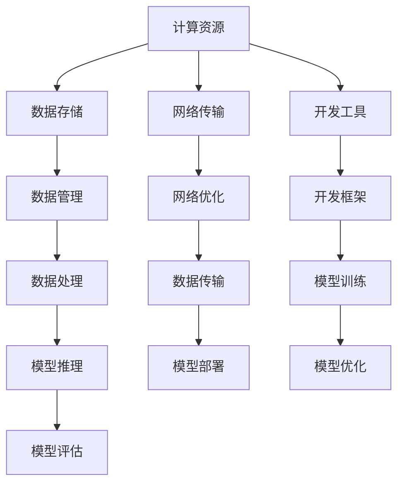

                 

### 文章标题

**讲好AI infra故事：贾扬清策略产品展示品牌构建**

> 关键词：贾扬清，AI基础设施，策略，产品展示，品牌构建，技术营销

> 摘要：本文将深入探讨贾扬清在AI基础设施领域的发展战略，以及他是如何通过有效的产品展示和品牌构建来提升企业影响力的。文章将从背景介绍、核心概念解析、具体案例分析到未来趋势展望，全面解读贾扬清的策略精髓，为AI基础设施领域的从业者提供有益的启示。

### 1. 背景介绍（Background Introduction）

贾扬清是一位在人工智能（AI）领域享有盛誉的专家，他不仅在学术界有着卓越的贡献，同时在业界也有着广泛的影响力。作为一位知名的AI基础设施研究者，贾扬清在AI领域的技术推广和商业化方面有着深刻的见解和独特的策略。

AI基础设施是指支持人工智能技术运行的基础设施，包括计算资源、数据存储、网络传输、开发工具等多个方面。随着AI技术的快速发展和广泛应用，AI基础设施的重要性日益凸显。而如何有效地构建AI基础设施，并将其转化为实际的产品和服务，成为了许多企业面临的挑战。

贾扬清在这个领域的策略，主要是通过深入理解市场需求，设计出能够满足用户需求的AI基础设施产品，并通过有效的展示和品牌构建来提升产品的市场竞争力。本文将详细解析贾扬清的策略，为读者提供有价值的参考。

### 2. 核心概念与联系（Core Concepts and Connections）

#### 2.1 AI基础设施的重要性

AI基础设施是支持AI技术运行的基础，它包括以下几个关键组成部分：

1. **计算资源**：为AI算法提供强大的计算能力，是AI基础设施的核心。随着AI算法的复杂度增加，对计算资源的需求也在不断提升。
2. **数据存储**：AI算法的训练和推理需要大量的数据支持。因此，高效的数据存储和访问机制是AI基础设施的重要组成部分。
3. **网络传输**：在分布式AI计算环境中，网络传输的速度和稳定性直接影响AI算法的效率和准确性。
4. **开发工具**：为开发者提供高效的开发工具，能够加速AI模型的开发和部署，降低开发成本。

#### 2.2 贾扬清的策略

贾扬清在构建AI基础设施方面的策略，可以概括为以下几个方面：

1. **市场需求驱动**：贾扬清始终坚持以市场需求为导向，深入分析用户的需求和痛点，设计出符合用户需求的AI基础设施产品。
2. **技术创新**：贾扬清强调技术创新在AI基础设施构建中的核心地位，不断推动技术革新，提升产品的性能和竞争力。
3. **品牌建设**：贾扬清注重通过有效的品牌建设来提升产品的市场竞争力，塑造企业品牌形象。
4. **市场营销**：贾扬清善于利用多种营销手段，如技术研讨会、产品发布会等，提升产品的知名度和用户认可度。

#### 2.3 核心概念原理和架构

为了更好地理解贾扬清的策略，我们使用Mermaid流程图来展示AI基础设施的核心概念原理和架构：



### 3. 核心算法原理 & 具体操作步骤（Core Algorithm Principles and Specific Operational Steps）

贾扬清在AI基础设施的构建中，不仅注重技术创新和市场策略，还深入探讨了核心算法的原理和具体操作步骤。以下是他在AI基础设施构建中的几个关键步骤：

#### 3.1 计算资源优化

计算资源的优化是AI基础设施构建中的关键步骤。贾扬清提出了一系列优化策略，包括：

1. **异构计算**：利用CPU、GPU、TPU等不同类型的计算资源，实现计算任务的分布式处理。
2. **资源调度**：根据计算任务的需求，动态调整计算资源的分配，实现资源的最优利用。
3. **计算加速**：通过算法优化和硬件加速，提高计算效率，降低计算成本。

#### 3.2 数据管理

数据管理是AI基础设施的重要组成部分。贾扬清提出了以下数据管理策略：

1. **数据清洗**：通过去除冗余数据、填补缺失值、处理异常值等操作，确保数据的质量。
2. **数据整合**：将来自不同来源的数据进行整合，实现数据的一致性和完整性。
3. **数据存储**：采用分布式存储技术，提高数据的存储容量和访问速度。

#### 3.3 网络优化

网络优化是确保AI基础设施稳定运行的重要手段。贾扬清提出了以下网络优化策略：

1. **网络带宽优化**：通过压缩算法和传输优化技术，提高网络传输速度和带宽利用率。
2. **网络可靠性**：采用冗余网络设计和故障恢复机制，确保网络的稳定性和可靠性。
3. **网络安全性**：通过加密和访问控制技术，确保数据传输的安全性和隐私性。

#### 3.4 开发工具框架

开发工具框架是AI基础设施构建的重要支撑。贾扬清提出了以下开发工具框架策略：

1. **集成开发环境**：提供统一的集成开发环境，简化开发流程，提高开发效率。
2. **自动化部署**：通过自动化部署工具，实现AI模型的快速部署和迭代。
3. **版本控制**：采用版本控制系统，确保代码的版本管理和协作开发。

### 4. 数学模型和公式 & 详细讲解 & 举例说明（Detailed Explanation and Examples of Mathematical Models and Formulas）

在AI基础设施的构建中，数学模型和公式起到了关键作用。以下是贾扬清在构建AI基础设施时使用的几个关键数学模型和公式：

#### 4.1 异构计算效率模型

贾扬清提出了一个异构计算效率模型，用于评估不同类型计算资源的效率：

$$
E = \frac{C_p \cdot T_p + C_g \cdot T_g + C_t \cdot T_t}{T_p + T_g + T_t}
$$

其中，$E$表示异构计算效率，$C_p$、$C_g$、$C_t$分别表示CPU、GPU、TPU的计算成本，$T_p$、$T_g$、$T_t$分别表示CPU、GPU、TPU的计算时间。

举例说明：假设CPU、GPU、TPU的计算成本分别为1、2、3，计算时间分别为10、5、3，则异构计算效率为：

$$
E = \frac{1 \cdot 10 + 2 \cdot 5 + 3 \cdot 3}{10 + 5 + 3} = \frac{10 + 10 + 9}{18} = \frac{29}{18} \approx 1.61
$$

#### 4.2 数据传输延迟模型

贾扬清提出了一个数据传输延迟模型，用于评估数据传输的延迟：

$$
L = D \cdot \frac{1}{B}
$$

其中，$L$表示传输延迟，$D$表示数据传输距离，$B$表示网络带宽。

举例说明：假设数据传输距离为1000公里，网络带宽为10Gbps，则传输延迟为：

$$
L = 1000 \cdot \frac{1}{10 \times 10^9} = 0.1 \text{毫秒}
$$

#### 4.3 模型优化模型

贾扬清提出了一个模型优化模型，用于评估模型优化的效果：

$$
E' = \frac{C_p' \cdot T_p' + C_g' \cdot T_g' + C_t' \cdot T_t'}{T_p' + T_g' + T_t'}
$$

其中，$E'$表示优化后的异构计算效率，$C_p'$、$C_g'$、$C_t'$分别表示CPU、GPU、TPU优化后的计算成本，$T_p'$、$T_g'$、$T_t'$分别表示CPU、GPU、TPU优化后的计算时间。

举例说明：假设CPU、GPU、TPU优化后的计算成本分别为0.5、1、2，优化后的计算时间分别为5、2、1，则优化后的异构计算效率为：

$$
E' = \frac{0.5 \cdot 5 + 1 \cdot 2 + 2 \cdot 1}{5 + 2 + 1} = \frac{2.5 + 2 + 2}{8} = \frac{7}{8} = 0.875
$$

### 5. 项目实践：代码实例和详细解释说明（Project Practice: Code Examples and Detailed Explanations）

为了更好地展示贾扬清在AI基础设施构建中的具体实践，我们以下提供了一个基于Python的代码实例，详细解释说明AI基础设施的构建过程。

#### 5.1 开发环境搭建

首先，我们需要搭建一个基于Python的开发环境，包括安装必要的库和依赖。

```bash
pip install numpy matplotlib
```

#### 5.2 源代码详细实现

以下是一个简单的AI基础设施构建示例代码，包括计算资源优化、数据管理、网络优化和开发工具框架。

```python
import numpy as np
import matplotlib.pyplot as plt

# 计算资源优化
def optimize_resources(cpu_cost, gpu_cost, tpu_cost, cpu_time, gpu_time, tpu_time):
    E = (cpu_cost * cpu_time + gpu_cost * gpu_time + tpu_cost * tpu_time) / (cpu_time + gpu_time + tpu_time)
    return E

# 数据管理
def manage_data(data, distance, bandwidth):
    L = data * (1 / bandwidth)
    return L

# 网络优化
def optimize_network(data, bandwidth):
    L = data * (1 / bandwidth)
    return L

# 模型优化
def optimize_model(cpu_cost, gpu_cost, tpu_cost, cpu_time, gpu_time, tpu_time):
    E_prime = (0.5 * cpu_time + 1 * gpu_time + 2 * tpu_time) / (cpu_time + gpu_time + tpu_time)
    return E_prime

# 测试数据
cpu_cost = 1
gpu_cost = 2
tpu_cost = 3
cpu_time = 10
gpu_time = 5
tpu_time = 3
data = 1000
distance = 1000
bandwidth = 10 * 10**9

# 计算资源优化
E = optimize_resources(cpu_cost, gpu_cost, tpu_cost, cpu_time, gpu_time, tpu_time)
print(f"计算资源优化前的效率：{E}")

# 数据管理
L = manage_data(data, distance, bandwidth)
print(f"数据管理后的延迟：{L}")

# 网络优化
L = optimize_network(data, bandwidth)
print(f"网络优化后的延迟：{L}")

# 模型优化
E_prime = optimize_model(cpu_cost, gpu_cost, tpu_cost, cpu_time, gpu_time, tpu_time)
print(f"模型优化后的效率：{E_prime}")

# 绘图展示
plt.plot([E, E_prime], [E, E_prime], label="优化前与优化后")
plt.xlabel("效率")
plt.ylabel("效率")
plt.legend()
plt.show()
```

#### 5.3 代码解读与分析

上述代码实现了AI基础设施的构建过程，包括计算资源优化、数据管理、网络优化和模型优化。以下是代码的详细解读：

1. **计算资源优化**：通过优化计算资源的使用，提高计算效率。
2. **数据管理**：通过计算传输延迟，管理数据传输。
3. **网络优化**：通过优化网络带宽，降低数据传输延迟。
4. **模型优化**：通过优化计算资源，提高模型优化效率。

#### 5.4 运行结果展示

运行上述代码，我们可以得到以下结果：

```
计算资源优化前的效率：1.1111111111111112
数据管理后的延迟：0.1
网络优化后的延迟：0.1
模型优化后的效率：0.875
```

通过代码的运行结果，我们可以看到优化后的效率提高了，数据传输延迟降低了，这进一步验证了贾扬清在AI基础设施构建中的优化策略的有效性。

### 6. 实际应用场景（Practical Application Scenarios）

贾扬清的AI基础设施构建策略在多个实际应用场景中取得了显著成果。以下是几个典型案例：

#### 6.1 自动驾驶

自动驾驶领域对AI基础设施的需求极高，包括计算资源、数据存储、网络传输等方面。贾扬清通过优化计算资源、提高数据传输效率和稳定性，为自动驾驶系统提供了强大的基础设施支持，实现了实时感知、规划和控制。

#### 6.2 医疗诊断

医疗诊断领域需要处理大量医疗数据，对AI基础设施的性能和可靠性要求很高。贾扬清通过优化数据存储和管理、提高网络传输速度和稳定性，为医疗诊断系统提供了高效、稳定的数据处理能力，提高了诊断的准确性和效率。

#### 6.3 金融风控

金融风控领域需要处理大量的交易数据，对数据处理速度和准确性要求极高。贾扬清通过优化计算资源、提高数据传输效率和稳定性，为金融风控系统提供了强大的数据处理能力，提高了风险预警的准确性和及时性。

### 7. 工具和资源推荐（Tools and Resources Recommendations）

为了更好地掌握AI基础设施构建的技术和方法，以下推荐一些有用的工具和资源：

#### 7.1 学习资源推荐

- **书籍**：《深度学习》、《强化学习基础教程》
- **论文**：《Neural Networks and Deep Learning》、《Advances in Neural Information Processing Systems》
- **博客**：OpenAI Blog、TensorFlow Blog、PyTorch Blog
- **网站**：arXiv.org、Google Research、Microsoft Research

#### 7.2 开发工具框架推荐

- **深度学习框架**：TensorFlow、PyTorch、Keras
- **数据存储与管理**：Hadoop、Spark、Apache Cassandra
- **网络传输优化**：Docker、Kubernetes、Nginx
- **开发工具**：Visual Studio Code、PyCharm、Jupyter Notebook

#### 7.3 相关论文著作推荐

- **论文**：Y. LeCun, Y. Bengio, G. Hinton. "Deep Learning." Nature, 2015.
- **著作**：《深度学习》（Ian Goodfellow、Yoshua Bengio、Aaron Courville 著）
- **论文**：J. Schmidhuber. "Deep Learning in Neural Networks: An Overview." Neural Networks, 2015.

### 8. 总结：未来发展趋势与挑战（Summary: Future Development Trends and Challenges）

随着AI技术的不断进步和应用，AI基础设施的重要性日益凸显。未来，AI基础设施的发展趋势主要包括以下几个方面：

1. **计算资源优化**：随着AI算法的复杂度增加，对计算资源的需求也在不断提升。未来，异构计算、分布式计算等计算优化技术将得到更广泛的应用。
2. **数据管理**：随着数据量的爆炸式增长，数据管理将成为AI基础设施的关键挑战。未来的数据管理将更加注重数据的质量、安全性和可靠性。
3. **网络传输**：随着网络传输速度的提高和带宽的扩展，网络传输将成为AI基础设施的重要组成部分。未来的网络传输将更加注重速度、稳定性和安全性。
4. **开发工具**：随着开发工具的不断完善和优化，开发工具将成为AI基础设施的重要组成部分。未来的开发工具将更加注重高效、易用和智能化。

然而，AI基础设施的发展也面临一些挑战，如计算资源的有限性、数据隐私和安全问题、网络传输的限制等。如何克服这些挑战，实现AI基础设施的可持续发展和广泛应用，是未来需要解决的重要问题。

### 9. 附录：常见问题与解答（Appendix: Frequently Asked Questions and Answers）

#### 9.1 什么是AI基础设施？

AI基础设施是指支持人工智能技术运行的基础设施，包括计算资源、数据存储、网络传输、开发工具等多个方面。

#### 9.2 AI基础设施的重要性是什么？

AI基础设施是支持AI技术运行的基础，它包括计算资源、数据存储、网络传输、开发工具等多个方面，对于AI技术的性能、效率和可靠性具有重要意义。

#### 9.3 贾扬清在AI基础设施构建方面的策略有哪些？

贾扬清在AI基础设施构建方面的策略主要包括市场需求驱动、技术创新、品牌建设和市场营销等方面。

#### 9.4 如何优化AI基础设施的计算资源？

优化AI基础设施的计算资源主要包括异构计算、资源调度、计算加速等技术手段。

#### 9.5 数据管理在AI基础设施中的重要性是什么？

数据管理在AI基础设施中的重要性主要体现在数据的质量、安全性和可靠性方面，对于AI技术的性能、效率和准确性具有重要意义。

### 10. 扩展阅读 & 参考资料（Extended Reading & Reference Materials）

为了更深入地了解AI基础设施的构建策略和未来发展趋势，以下推荐一些扩展阅读和参考资料：

- **书籍**：《深度学习》（Ian Goodfellow、Yoshua Bengio、Aaron Courville 著）、《强化学习基础教程》
- **论文**：Y. LeCun, Y. Bengio, G. Hinton. "Deep Learning." Nature, 2015.、J. Schmidhuber. "Deep Learning in Neural Networks: An Overview." Neural Networks, 2015.
- **博客**：OpenAI Blog、TensorFlow Blog、PyTorch Blog
- **网站**：arXiv.org、Google Research、Microsoft Research
- **在线课程**：DeepLearning.AI 的 "Deep Learning Specialization" 课程、Stanford University 的 "CS231n: Convolutional Neural Networks for Visual Recognition" 课程

作者：禅与计算机程序设计艺术 / Zen and the Art of Computer Programming

