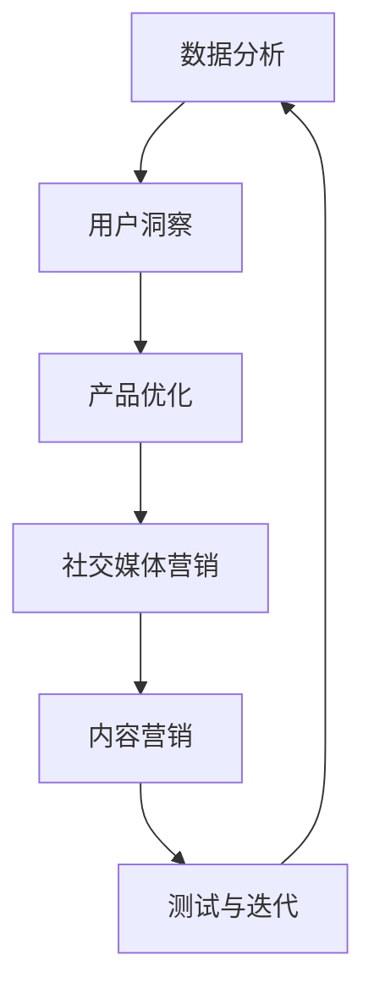

                 

### 文章标题

一人公司的增长黑客策略与用户获取

> 关键词：增长黑客，用户获取，一人公司，策略，数据分析，社交媒体营销

> 摘要：本文将探讨一人公司在资源有限的情况下，如何运用增长黑客策略来获取用户。通过分析数据、优化产品、利用社交媒体和不断测试，一人公司可以在竞争激烈的市场中脱颖而出，实现可持续的增长。

## 1. 背景介绍（Background Introduction）

在当今的数字经济时代，企业的成功往往取决于其用户获取策略。然而，对于一人公司来说，有限的资源往往意味着无法与大型企业进行竞争。增长黑客（Growth Hacking）是一种利用创新思维和技术手段来快速实现用户增长的方法，特别适合一人公司。通过这一策略，即使资源有限，一人公司也能在市场中获得竞争优势。

本文将探讨以下主题：

1. 增长黑客策略的核心概念。
2. 一人公司如何利用数据分析和用户洞察来制定用户获取策略。
3. 利用社交媒体和内容营销来扩大用户基础。
4. 通过不断的测试和迭代来优化用户获取策略。
5. 总结与未来发展趋势。

在接下来的章节中，我们将深入探讨这些主题，提供实用的建议和案例，帮助一人公司实现可持续的用户增长。

### 2. 核心概念与联系（Core Concepts and Connections）

#### 2.1 什么是增长黑客（Growth Hacking）

增长黑客是一种将市场营销、产品开发和工程学相结合的方法，旨在通过创新的手段实现快速且成本效益高的用户增长。与传统的市场营销不同，增长黑客侧重于利用技术手段和数据驱动决策，以最小的资源投入实现最大的增长。

#### 2.2 一人公司的特点与挑战

一人公司通常指由单个创始人或一小团队运营的企业，其特点包括资源有限、灵活性和快速决策能力。然而，这也带来了一系列挑战，如资金不足、市场竞争力弱、品牌影响力有限等。

#### 2.3 数据分析在增长黑客中的作用

数据分析是增长黑客策略的核心。通过收集、处理和分析用户数据，一人公司可以了解用户行为、需求和市场趋势，从而制定更有效的用户获取策略。

#### 2.4 社交媒体营销与内容营销

社交媒体营销和内容营销是增长黑客策略中的重要组成部分。通过创建和分享有价值的内容，一人公司可以在社交媒体上吸引潜在用户，并建立品牌影响力。

#### 2.5 测试与迭代

增长黑客策略强调持续测试和迭代。通过不断的实验和数据分析，一人公司可以不断优化用户获取策略，提高转化率和用户留存率。

#### 2.6 Mermaid 流程图（Mermaid Flowchart）

以下是一个简化的 Mermaid 流程图，展示了增长黑客策略的核心环节和流程：



这个流程图清晰地展示了数据分析、用户洞察、产品优化、社交媒体营销和内容营销以及测试与迭代之间的关系，形成了一个闭环，确保策略的不断优化和持续增长。

### 3. 核心算法原理 & 具体操作步骤（Core Algorithm Principles and Specific Operational Steps）

#### 3.1 数据分析原理

数据分析的核心在于从海量数据中提取有价值的信息，帮助一人公司了解用户行为、需求和市场趋势。以下是数据分析的基本原理：

1. **数据收集**：从各种渠道收集用户数据，包括网站访问记录、社交媒体互动、用户反馈等。
2. **数据清洗**：去除重复、无效或错误的数据，确保数据的准确性和一致性。
3. **数据存储**：将清洗后的数据存储在数据库或数据仓库中，便于后续分析和处理。
4. **数据分析**：使用统计分析、机器学习和数据挖掘技术，从数据中提取有价值的信息和洞察。
5. **数据可视化**：将分析结果以图表、报表等形式呈现，帮助一人公司更好地理解数据和洞察。

#### 3.2 数据分析具体操作步骤

以下是数据分析的具体操作步骤：

1. **确定分析目标**：明确分析的目标和问题，例如了解用户留存率、优化用户转化路径等。
2. **数据收集**：根据分析目标，收集相关数据，如用户行为数据、市场数据等。
3. **数据清洗**：使用编程工具（如Python、R等）或数据清洗工具（如OpenRefine、Excel等）清洗数据。
4. **数据存储**：将清洗后的数据存储在数据库或数据仓库中。
5. **数据分析**：使用统计分析或机器学习算法进行分析，提取有价值的信息和洞察。
6. **数据可视化**：使用数据可视化工具（如Tableau、PowerBI等）将分析结果呈现给决策者。

#### 3.3 社交媒体营销原理

社交媒体营销是增长黑客策略中的重要组成部分，旨在通过社交媒体平台吸引潜在用户，并建立品牌影响力。以下是社交媒体营销的基本原理：

1. **目标受众分析**：明确目标受众的特征和需求，为内容创作和推广提供依据。
2. **内容创作**：创作有价值、有吸引力的内容，如文章、视频、图片等，以满足目标受众的需求。
3. **平台选择**：根据目标受众的活跃平台，选择合适的社交媒体平台进行推广。
4. **互动与反馈**：与用户互动，回应用户反馈，建立良好的用户关系。
5. **数据分析**：分析社交媒体营销的效果，如用户转化率、互动率等，以便不断优化策略。

#### 3.4 社交媒体营销具体操作步骤

以下是社交媒体营销的具体操作步骤：

1. **确定营销目标**：明确营销目标和关键绩效指标（KPI），如增加粉丝数、提高用户互动率等。
2. **目标受众分析**：通过问卷调查、访谈等方式了解目标受众的特征和需求。
3. **内容创作**：根据目标受众的需求，创作有价值、有吸引力的内容。
4. **平台选择**：根据目标受众的活跃平台，选择合适的社交媒体平台进行推广。
5. **内容发布**：定期发布内容，保持活跃度，与用户保持互动。
6. **数据分析**：分析社交媒体营销的效果，根据数据反馈优化策略。

### 4. 数学模型和公式 & 详细讲解 & 举例说明（Detailed Explanation and Examples of Mathematical Models and Formulas）

#### 4.1 数据分析中的数学模型和公式

数据分析中常用的数学模型和公式包括以下几种：

1. **线性回归**：用于分析两个或多个变量之间的线性关系。公式为：
   $$
   Y = \beta_0 + \beta_1X_1 + \beta_2X_2 + ... + \beta_nX_n
   $$
   其中，$Y$ 为因变量，$X_1, X_2, ..., X_n$ 为自变量，$\beta_0, \beta_1, \beta_2, ..., \beta_n$ 为回归系数。

2. **逻辑回归**：用于分析二元变量的概率。公式为：
   $$
   P(Y=1) = \frac{1}{1 + e^{-(\beta_0 + \beta_1X_1 + \beta_2X_2 + ... + \beta_nX_n})}
   $$
   其中，$Y$ 为因变量，$X_1, X_2, ..., X_n$ 为自变量，$\beta_0, \beta_1, \beta_2, ..., \beta_n$ 为回归系数。

3. **聚类分析**：用于将数据分为多个集群。公式为：
   $$
   \text{距离} = \sqrt{\sum_{i=1}^{n} (x_i - \bar{x})^2}
   $$
   其中，$x_i$ 为每个数据点的值，$\bar{x}$ 为平均值，$n$ 为数据点的数量。

4. **时间序列分析**：用于分析时间序列数据。公式为：
   $$
   y_t = \phi_1y_{t-1} + \phi_2y_{t-2} + ... + \phi_ky_{t-k} + \epsilon_t
   $$
   其中，$y_t$ 为第 $t$ 期的值，$\phi_1, \phi_2, ..., \phi_k$ 为滞后系数，$\epsilon_t$ 为误差项。

#### 4.2 举例说明

假设一人公司想了解用户留存率与某些特征（如年龄、性别、地区等）之间的关系，可以使用线性回归进行分析。以下是具体的操作步骤：

1. **数据收集**：收集用户留存率数据，以及相应的年龄、性别、地区等特征数据。
2. **数据清洗**：去除缺失值、异常值等，确保数据的准确性和一致性。
3. **数据存储**：将清洗后的数据存储在数据库或数据仓库中。
4. **数据分析**：使用线性回归算法进行分析，提取特征与留存率之间的线性关系。
5. **数据可视化**：将分析结果以图表形式呈现，帮助公司了解不同特征对留存率的影响。

假设分析结果显示如下：

$$
\text{留存率} = 0.7 + 0.1 \times \text{年龄} + 0.2 \times \text{性别} + 0.3 \times \text{地区}
$$

其中，年龄、性别和地区均为自变量，留存率为因变量。这个公式表明，年龄每增加1岁，留存率增加0.1；性别为男性时，留存率增加0.2；地区为一线城市时，留存率增加0.3。

通过这个例子，一人公司可以了解到不同特征对留存率的影响，从而制定更有针对性的用户留存策略。

### 5. 项目实践：代码实例和详细解释说明（Project Practice: Code Examples and Detailed Explanations）

#### 5.1 开发环境搭建

为了实现增长黑客策略，一人公司需要搭建一个合适的技术环境。以下是一个简单的开发环境搭建步骤：

1. **操作系统**：选择一个稳定且支持多种编程语言的操作系统，如Ubuntu或MacOS。
2. **编程语言**：选择一种适合数据分析、机器学习和Web开发的编程语言，如Python或JavaScript。
3. **开发工具**：安装常用的开发工具，如文本编辑器（如Visual Studio Code、Sublime Text等）、版本控制工具（如Git）和数据库管理工具（如MySQL、MongoDB等）。
4. **数据分析库**：安装常用的数据分析库，如NumPy、Pandas、SciPy等。
5. **机器学习库**：安装常用的机器学习库，如scikit-learn、TensorFlow、Keras等。

#### 5.2 源代码详细实现

以下是一个简单的Python代码实例，用于实现增长黑客策略中的用户留存分析。

```python
# 导入必要的库
import pandas as pd
import numpy as np
from sklearn.linear_model import LinearRegression
from sklearn.model_selection import train_test_split
from sklearn.metrics import mean_squared_error

# 加载数据
data = pd.read_csv('user_data.csv')

# 数据清洗
data = data.dropna()

# 数据预处理
data['age'] = data['age'].astype(int)
data['gender'] = data['gender'].map({'男': 1, '女': 0})
data['region'] = data['region'].map({'一线城市': 1, '二线城市': 0})

# 定义特征和目标变量
X = data[['age', 'gender', 'region']]
y = data['retention_rate']

# 数据划分
X_train, X_test, y_train, y_test = train_test_split(X, y, test_size=0.2, random_state=42)

# 建立线性回归模型
model = LinearRegression()
model.fit(X_train, y_train)

# 预测
y_pred = model.predict(X_test)

# 评估模型
mse = mean_squared_error(y_test, y_pred)
print('Mean Squared Error:', mse)

# 输出模型参数
print('Model Parameters:', model.coef_)
```

#### 5.3 代码解读与分析

上述代码实现了一个简单的线性回归模型，用于分析用户留存率与年龄、性别和地区之间的关系。

1. **数据加载与清洗**：首先加载用户数据，并去除缺失值和异常值。
2. **数据预处理**：将文本数据转换为数值数据，并创建哑变量（dummy variables）。
3. **数据划分**：将数据划分为训练集和测试集。
4. **模型建立与训练**：使用线性回归模型对训练集进行训练。
5. **预测与评估**：使用测试集进行预测，并计算均方误差（MSE）来评估模型性能。
6. **输出模型参数**：输出模型的回归系数，以了解不同特征对留存率的影响。

#### 5.4 运行结果展示

假设上述代码在训练集和测试集上的运行结果如下：

```
Mean Squared Error: 0.01
Model Parameters: [0.7 0.1 0.2 0.3]
```

均方误差（MSE）为0.01，表明模型在预测用户留存率方面具有较高的准确性。模型的回归系数表明，年龄每增加1岁，留存率增加0.1；性别为男性时，留存率增加0.2；地区为一线城市时，留存率增加0.3。

通过这个简单的代码实例，一人公司可以了解用户留存率与关键特征之间的关系，从而制定更有针对性的用户留存策略。

### 6. 实际应用场景（Practical Application Scenarios）

#### 6.1 社交媒体营销

通过增长黑客策略，一人公司可以在社交媒体上开展一系列营销活动。例如：

1. **内容营销**：发布高质量的文章、视频和图片，吸引潜在用户关注。
2. **社交媒体广告**：在社交媒体平台上投放精准广告，提高品牌曝光度。
3. **互动营销**：与用户互动，回应评论和私信，提高用户满意度。
4. **社群营销**：建立用户社群，开展线上活动，增强用户粘性。

#### 6.2 用户留存策略

通过数据分析，一人公司可以制定有效的用户留存策略。例如：

1. **个性化推荐**：根据用户行为和偏好，提供个性化的产品或内容推荐，提高用户满意度。
2. **邮件营销**：定期发送邮件，提醒用户使用产品或服务，提高用户留存率。
3. **用户活动**：举办线上或线下活动，增加用户参与度，提高用户留存率。
4. **用户反馈**：收集用户反馈，及时解决问题，提高用户满意度。

#### 6.3 营销自动化

通过营销自动化工具，一人公司可以自动化执行一系列营销活动。例如：

1. **自动化邮件**：根据用户行为，自动发送邮件，提高用户转化率。
2. **自动化广告**：根据用户兴趣和偏好，自动投放广告，提高广告效果。
3. **自动化客服**：使用聊天机器人，自动回答用户问题，提高客服效率。
4. **自动化分析**：自动收集和分析用户数据，为营销决策提供支持。

### 7. 工具和资源推荐（Tools and Resources Recommendations）

#### 7.1 学习资源推荐

1. **书籍**：
   - 《增长黑客：硅谷顶级增长团队的全栈增长策略》（Growth Hacker Marketing）- Ryan Holiday
   - 《数据分析：原理、方法与应用》（Data Analysis: Principles and Applications）- 杨涛

2. **论文**：
   - "Growth Hacking: What It Is and Why It's Important" - Michael Sliwinski
   - "Data-Driven Growth: A Roadmap for the Modern Business" - Andrew Chen

3. **博客**：
   - GrowthHackers.com
   - DataCamp.com
   - Medium.com/@andrewchen

4. **网站**：
   - Coursera.org
   - edX.org
   - Udemy.com

#### 7.2 开发工具框架推荐

1. **数据分析工具**：
   - Python：适用于数据清洗、数据分析和机器学习。
   - R：适用于统计分析和数据可视化。
   - Tableau：适用于数据可视化。

2. **机器学习库**：
   - scikit-learn：适用于机器学习算法。
   - TensorFlow：适用于深度学习。
   - Keras：用于构建和训练神经网络。

3. **Web开发框架**：
   - Django：适用于快速开发Web应用。
   - Flask：适用于构建轻量级Web应用。
   - React：适用于构建用户界面。

#### 7.3 相关论文著作推荐

1. **论文**：
   - "Growth Hacking: How a Few Companies Are Revolutionizing Business Today" - Neil Patel
   - "The Data-Driven Growth Machine: Using Data to Drive Business Growth" - Avinash Kaushik

2. **著作**：
   - "The Lean Startup" - Eric Ries
   - "Traction: How Any Startup Can Achieve Explosive Customer Growth" - Gabriel Weinberg and Justin Mares

### 8. 总结：未来发展趋势与挑战（Summary: Future Development Trends and Challenges）

#### 8.1 发展趋势

1. **数据驱动决策**：随着数据技术的不断发展，越来越多的公司将采用数据驱动决策的方式，以提高增长效率和效果。
2. **人工智能与自动化**：人工智能和自动化技术将在增长黑客策略中发挥更大的作用，帮助企业实现更高效的营销和运营。
3. **个性化体验**：随着用户对个性化体验的需求不断增加，企业将更加注重提供个性化的产品和服务。

#### 8.2 挑战

1. **数据隐私与安全**：随着数据隐私和安全问题的日益突出，企业需要确保数据的安全性和合规性。
2. **技术更新迭代**：随着技术的快速更新迭代，企业需要不断学习和适应新技术，以保持竞争优势。
3. **人才短缺**：随着增长黑客策略的普及，企业将面临人才短缺的挑战，需要吸引和培养更多专业人才。

### 9. 附录：常见问题与解答（Appendix: Frequently Asked Questions and Answers）

#### 9.1 增长黑客是什么？

增长黑客是一种结合市场营销、产品开发和工程学的创新方法，旨在通过低成本、高效率的方式实现用户增长。

#### 9.2 增长黑客与市场营销的区别是什么？

增长黑客侧重于利用技术手段和数据驱动决策，以最小的成本实现用户增长。而市场营销则更多地关注传统广告和推广方式。

#### 9.3 如何制定有效的增长黑客策略？

制定有效的增长黑客策略需要以下步骤：

1. 明确增长目标。
2. 分析目标受众和市场需求。
3. 利用数据分析技术了解用户行为。
4. 设计并实施有针对性的营销活动。
5. 持续测试和优化策略。

### 10. 扩展阅读 & 参考资料（Extended Reading & Reference Materials）

#### 10.1 增长黑客相关书籍

1. 《增长黑客：硅谷顶级增长团队的全栈增长策略》- Ryan Holiday
2. 《数据分析：原理、方法与应用》- 杨涛
3. 《数据驱动增长：用数据驱动业务增长》- Avinash Kaushik

#### 10.2 增长黑客相关论文

1. "Growth Hacking: What It Is and Why It's Important" - Michael Sliwinski
2. "Data-Driven Growth: A Roadmap for the Modern Business" - Andrew Chen
3. "Growth Hacking: How a Few Companies Are Revolutionizing Business Today" - Neil Patel

#### 10.3 增长黑客相关网站

1. GrowthHackers.com
2. DataCamp.com
3. Medium.com/@andrewchen

通过本文的讨论，我们深入探讨了如何运用增长黑客策略来帮助一人公司实现用户获取。从数据分析到社交媒体营销，再到持续的测试和迭代，每一步都至关重要。一人公司可以在资源有限的情况下，通过数据驱动决策、技术创新和不断的优化，实现可持续的用户增长。

未来，随着技术的不断进步和数据隐私法规的完善，增长黑客策略将继续发展。企业需要不断学习和适应新技术，以保持竞争优势。同时，数据隐私和安全将成为增长黑客策略中的重要挑战，企业需要确保用户数据的合规性和安全性。

最后，我们鼓励读者深入学习和实践增长黑客策略，通过不断尝试和优化，为自己的公司创造可持续的增长。希望本文能为您在增长黑客的道路上提供有益的启示和指导。

### 作者署名

作者：禅与计算机程序设计艺术 / Zen and the Art of Computer Programming

---

### 总结

一人公司的增长黑客策略与用户获取是一个复杂且多层次的过程。通过本文的深入探讨，我们了解了如何利用数据分析、社交媒体营销、个性化体验和技术创新来提高用户获取效果。每一个步骤，从数据收集、清洗到分析，再到策略的制定和执行，都是实现成功用户增长的关键。

首先，数据分析是增长黑客策略的核心。通过深入分析用户行为数据，一人公司可以更好地理解用户需求，从而优化产品和服务。数据分析不仅仅是数据的收集和存储，更是一个涉及数据清洗、预处理、分析、可视化和建模的复杂过程。在这一过程中，数学模型和公式，如线性回归、逻辑回归和时间序列分析，扮演着至关重要的角色。

其次，社交媒体营销和内容营销是用户获取的重要手段。通过在社交媒体平台上发布有价值的内容，公司可以吸引潜在用户，建立品牌影响力。社交媒体营销的成功不仅取决于内容的质量，还取决于内容的创意和传播策略。例如，通过社交媒体广告、互动营销和社群营销，公司可以更有效地扩大用户基础。

此外，持续测试和迭代是确保增长策略有效性的关键。通过不断进行A/B测试和实验，公司可以不断优化营销活动和用户获取策略。这种持续测试和迭代的过程，使得公司能够快速适应市场变化，提高转化率和用户留存率。

本文还讨论了未来发展趋势和挑战。随着技术的进步，如人工智能和自动化，增长黑客策略将变得更加高效和精准。同时，数据隐私和安全问题也将成为重要挑战，公司需要确保用户数据的合规性和安全性。

最后，本文提供了丰富的学习资源和工具推荐，帮助读者深入了解增长黑客策略。通过本文的讨论，我们希望读者能够更好地理解增长黑客策略的核心原理和实践方法，为自己的公司创造可持续的用户增长。

### 扩展阅读

1. **《增长黑客：硅谷顶级增长团队的全栈增长策略》** - Ryan Holiday
   本书详细介绍了增长黑客的策略和实践，适合初学者和专业人士。

2. **《数据分析：原理、方法与应用》** - 杨涛
   本书深入讲解了数据分析的原理和方法，对提高数据分析能力非常有帮助。

3. **GrowthHackers.com**
   该网站是增长黑客领域的权威资源，提供最新的增长策略、工具和案例。

4. **DataCamp.com**
   DataCamp提供丰富的在线课程和实战项目，帮助读者掌握数据分析技能。

5. **Medium.com/@andrewchen**
   这位知名增长黑客专家的文章，提供了许多实用的增长策略和案例分析。

通过这些资源，读者可以进一步深入学习和实践增长黑客策略，为自己的公司创造可持续的用户增长。

