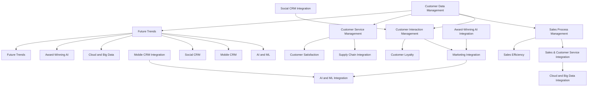

                 

### 背景介绍（Background Introduction）

随着互联网的飞速发展，客户关系管理（CRM）已经成为企业成功的关键因素之一。CRM不仅帮助企业更好地理解客户需求，提高客户满意度，还能通过数据分析发现潜在的商业机会，从而实现业务的增长。然而，对于一人公司来说，有效的客户关系管理面临诸多挑战。

一人公司通常指的是由单一创始人或核心团队运营的小型公司。这类公司的特点包括资源有限、市场影响力较小和运营灵活。在这种背景下，如何有效地管理客户关系，成为一人公司发展壮大的关键问题。

本文将围绕一人公司的客户关系管理展开讨论，探讨如何通过策略和工具构建一个终身忠诚用户的生态系统。我们将分析一人公司在CRM中的独特挑战，介绍核心概念，并详细阐述打造忠诚用户的策略与工具。

通过本文的阅读，读者将了解到：

1. 一人公司在客户关系管理中面临的独特挑战。
2. 客户关系管理的基本概念与核心原则。
3. 构建终身忠诚用户生态系统的策略与工具。
4. 如何通过技术手段优化客户关系管理流程。
5. 实际应用案例与成功经验分享。

让我们一起深入探讨一人公司的客户关系管理，挖掘打造终身忠诚用户的秘密武器。

### ### Introduction to Customer Relationship Management (CRM) in a Single-Founder Company

With the rapid development of the internet, Customer Relationship Management (CRM) has become a key factor in the success of businesses. CRM helps companies better understand customer needs, improve customer satisfaction, and discover potential business opportunities through data analysis, thus achieving business growth. However, for single-founder companies, effective CRM management presents several unique challenges.

A single-founder company typically refers to a small business operated by a sole founder or a core team. The characteristics of such companies include limited resources, smaller market influence, and flexible operations. In this context, how to effectively manage customer relationships becomes a critical issue for their growth and success.

This article will discuss Customer Relationship Management in a single-founder company, exploring strategies and tools for building a loyal customer ecosystem. We will analyze the unique challenges faced by single-founder companies in CRM, introduce core concepts, and elaborate on strategies and tools for building a loyal customer base.

By the end of this article, readers will gain insights into:

1. The unique challenges that single-founder companies face in customer relationship management.
2. Basic concepts and core principles of Customer Relationship Management.
3. Strategies and tools for building a loyal customer ecosystem.
4. How to optimize customer relationship management processes through technology.
5. Practical case studies and successful experiences.

Let's delve into the world of Customer Relationship Management in single-founder companies and uncover the secret weapons for building loyal customers.

## 2. 核心概念与联系（Core Concepts and Connections）

### 2.1 客户关系管理的基本概念（Basic Concepts of CRM）

客户关系管理（CRM）是一种战略和管理方法，旨在通过协调和整合各种业务流程，提高企业与客户之间的互动质量和效率。CRM的核心目标是增强客户满意度、忠诚度和保留率，从而推动业务增长和利润提升。

CRM的基本概念包括以下几个方面：

1. **客户数据管理（Customer Data Management）**：这是CRM的基础，涉及收集、存储、处理和分析客户数据，以便更好地理解客户需求和行为。
2. **客户互动管理（Customer Interaction Management）**：通过优化客户接触点和沟通方式，提高客户体验和满意度。
3. **销售流程管理（Sales Process Management）**：确保销售团队能够高效地跟进潜在客户，提高成交率和客户满意度。
4. **客户服务管理（Customer Service Management）**：提供及时、有效的客户支持，解决客户问题，增强客户信任和忠诚度。

### 2.2 CRM在一人公司中的应用（CRM Application in Single-Founder Companies）

对于一人公司而言，CRM的应用具有独特的挑战和机遇。由于其资源有限，一人公司需要更加灵活和高效地管理客户关系，以下是一些关键应用领域：

1. **客户数据管理**：由于缺乏大量资源，一人公司需要利用现有的数据资源，通过精细化运营和数据分析来挖掘客户价值。
2. **客户互动管理**：通过社交媒体、电子邮件、在线聊天等多种渠道与客户互动，增强客户黏性和忠诚度。
3. **销售流程管理**：简化销售流程，利用自动化工具提高销售效率和客户转化率。
4. **客户服务管理**：提供个性化的客户服务，通过快速响应和解决问题来建立良好的客户关系。

### 2.3 CRM与其他业务流程的整合（Integration of CRM with Other Business Processes）

CRM不仅是独立运作的系统，还需要与其他业务流程进行整合，以实现整体的业务优化。对于一人公司，以下整合措施尤为重要：

1. **市场营销整合**：通过CRM系统整合市场营销活动，跟踪营销效果，优化营销策略。
2. **销售与客户服务整合**：确保销售团队能够及时了解客户反馈和需求，提高客户服务质量。
3. **供应链整合**：通过CRM系统与供应链系统对接，优化库存管理和物流配送，提高供应链效率。

### 2.4 CRM的未来发展趋势（Future Trends of CRM）

随着技术的不断进步，CRM也在不断发展创新。以下是一些CRM的未来发展趋势：

1. **人工智能和机器学习**：利用AI和ML技术，实现更智能的客户数据分析和服务预测。
2. **移动CRM**：随着移动设备的普及，移动CRM的应用越来越广泛，提供更便捷的客户管理服务。
3. **社会化CRM**：通过社交媒体平台与客户互动，实现更广泛的客户联系和互动。
4. **云计算和大数据**：通过云计算和大数据技术，实现更高效的数据存储、处理和分析。

### 2.5 本文中使用的核心概念图解（Core Concept Diagrams in This Article）

为了更好地理解本文的核心概念，我们使用Mermaid流程图来展示CRM的核心概念及其相互关系：



通过上述流程图，我们可以清晰地看到CRM的核心概念及其相互关系，这有助于读者更好地理解本文的内容。

### 2.6 Conclusion

In conclusion, Customer Relationship Management (CRM) is a vital strategy for businesses, especially for single-founder companies. Understanding the basic concepts and applying CRM effectively can significantly enhance customer satisfaction, loyalty, and retention. The integration of CRM with other business processes and the adoption of advanced technologies further optimize customer management and business operations.

In this article, we have explored the unique challenges faced by single-founder companies in CRM and introduced key concepts and strategies. We have also discussed the future trends in CRM and their potential impact on businesses.

By following the insights and recommendations provided in this article, single-founder companies can build a loyal customer base and achieve sustainable growth. As the CRM landscape continues to evolve, staying informed and adapting to new trends will be crucial for success.

### 2.6 Conclusion

In summary, Customer Relationship Management (CRM) is an essential component for businesses striving to cultivate lasting relationships with their customers. Its significance for single-founder companies is amplified due to their limited resources and the need for efficient operations. A comprehensive understanding of CRM's foundational concepts and the strategic application of these principles can substantially enhance customer satisfaction, loyalty, and retention rates.

We have detailed the specific challenges that single-founder companies encounter in the realm of CRM, while also introducing the core concepts that underpin effective customer relationship management. Furthermore, we have explored how integrating CRM with other business processes and leveraging advanced technologies can further optimize customer management and operational efficiency.

Throughout this article, we have provided insights and practical strategies tailored for single-founder companies to build a loyal customer base and achieve sustainable growth. As the CRM landscape continues to evolve, it is imperative for businesses to stay abreast of emerging trends and adapt their strategies accordingly to maintain a competitive edge. By doing so, single-founder companies can navigate the complexities of CRM with confidence and achieve their business objectives.

---

接下来，我们将深入探讨客户关系管理（CRM）的核心算法原理与具体操作步骤，帮助读者理解如何有效地运用CRM技术来优化客户关系管理。

### 3. 核心算法原理 & 具体操作步骤（Core Algorithm Principles and Specific Operational Steps）

#### 3.1 CRM系统的基础架构（Basic Architecture of CRM Systems）

CRM系统的核心算法原理在于如何有效地收集、存储、分析和利用客户数据，从而实现精准的营销、销售和服务。以下是CRM系统的基础架构及其组成部分：

1. **数据收集层**：包括客户信息的收集，如客户基本信息、交易记录、互动历史等。
2. **数据存储层**：利用数据库系统存储和管理大量客户数据，确保数据的安全性和完整性。
3. **数据分析层**：通过数据分析技术，如机器学习和数据挖掘，对客户数据进行分析，提取有价值的信息。
4. **应用层**：提供各种CRM功能模块，如客户管理、销售管理、市场营销、客户服务等。

#### 3.2 客户细分算法（Customer Segmentation Algorithms）

客户细分是CRM中的一个关键环节，它有助于企业根据客户的特征和需求进行精准营销。以下是一种常用的客户细分算法——聚类分析：

1. **数据准备**：收集客户的基本信息和购买行为数据，将数据标准化处理。
2. **选择聚类算法**：常用的聚类算法有K-means、层次聚类、DBSCAN等。
3. **聚类过程**：
   - **初始化**：选择初始聚类中心。
   - **迭代计算**：计算每个客户与聚类中心的距离，重新分配客户到最近的聚类中心。
   - **收敛判断**：判断聚类结果是否满足收敛条件，如聚类中心不再变化或变化幅度很小。
4. **结果评估**：通过评估指标（如轮廓系数、内切球半径等）评估聚类效果。

#### 3.3 客户生命周期价值预测算法（Customer Lifetime Value Prediction Algorithms）

预测客户生命周期价值（CLV）有助于企业制定更有效的客户关系管理策略。以下是一种常用的CLV预测算法——决策树：

1. **数据准备**：收集客户的历史交易数据、购买频率、购买金额等。
2. **特征选择**：选择对CLV影响较大的特征，如客户购买频率、购买金额、交易历史等。
3. **决策树构建**：
   - **初始化**：选择初始分裂标准，如信息增益、基尼不纯度等。
   - **递归分裂**：根据分裂标准，递归地将数据集划分为更小的子集，直到满足停止条件（如最大深度、最小样本数等）。
   - **构建决策树**：将每次分裂的结果组合成一棵决策树。
4. **结果评估**：通过交叉验证等方法评估决策树模型的预测准确性。

#### 3.4 客户满意度评估算法（Customer Satisfaction Evaluation Algorithms）

评估客户满意度是衡量CRM系统效果的重要指标。以下是一种常用的客户满意度评估算法——神经网络：

1. **数据准备**：收集客户反馈数据，如满意度评分、评论、问题反馈等。
2. **特征处理**：将文本数据转化为向量表示，如词袋模型、词嵌入等。
3. **神经网络构建**：
   - **初始化**：定义神经网络结构，如输入层、隐藏层、输出层等。
   - **训练过程**：利用梯度下降等优化算法，训练神经网络权重。
   - **评估过程**：通过交叉验证等方法评估神经网络模型的预测准确性。
4. **结果应用**：根据客户满意度评估结果，优化客户服务策略和体验。

#### 3.5 实践步骤总结（Practical Steps Summary）

以下是使用CRM系统优化客户关系管理的基本实践步骤：

1. **需求分析**：明确企业的CRM需求，包括客户数据收集、营销、销售、服务等方面。
2. **系统选型**：选择合适的CRM系统，考虑功能、性能、成本等因素。
3. **数据收集**：建立客户数据收集机制，确保数据的完整性和准确性。
4. **数据处理**：对收集到的客户数据进行清洗、处理和存储，为后续分析提供基础。
5. **数据分析**：利用数据分析和预测算法，提取客户特征，预测客户生命周期价值等。
6. **策略制定**：根据分析结果，制定针对性的营销、销售、服务策略。
7. **系统优化**：持续监控CRM系统效果，根据实际情况进行优化调整。

通过上述核心算法原理和具体操作步骤，一人公司可以更好地理解如何利用CRM技术优化客户关系管理，从而提高客户满意度、忠诚度和保留率，实现业务增长。

### 3. Core Algorithm Principles and Specific Operational Steps

#### 3.1 Basic Architecture of CRM Systems

The core principles of Customer Relationship Management (CRM) systems revolve around the efficient collection, storage, analysis, and utilization of customer data to enable precise marketing, sales, and service. The basic architecture of CRM systems consists of several key components:

1. **Data Collection Layer**: This layer is responsible for gathering customer information, such as basic details, transaction records, and interaction history.
2. **Data Storage Layer**: Utilizes database systems to securely and efficiently manage large volumes of customer data.
3. **Data Analysis Layer**: Employs advanced technologies like machine learning and data mining to analyze customer data and extract valuable insights.
4. **Application Layer**: Provides various CRM functionalities, including customer management, sales management, marketing, and customer service modules.

#### 3.2 Customer Segmentation Algorithms

Customer segmentation is a crucial aspect of CRM, as it allows businesses to conduct targeted marketing based on customer characteristics and needs. One commonly used customer segmentation algorithm is **K-means clustering**:

1. **Data Preparation**: Collect basic customer information and purchase behavior data, and standardize the data.
2. **Algorithm Selection**: Choose a clustering algorithm, such as K-means, hierarchical clustering, or DBSCAN.
3. **Clustering Process**:
   - **Initialization**: Select initial cluster centers.
   - **Iteration**: Calculate the distance between each customer and the cluster centers, and reassign customers to the nearest cluster center.
   - **Convergence Judgement**: Determine if the clustering results have converged, such as when cluster centers no longer change or change by a very small amount.
4. **Result Evaluation**: Assess the clustering effectiveness using metrics such as silhouette coefficient or within-cluster sum of squares.

#### 3.3 Customer Lifetime Value Prediction Algorithms

Predicting Customer Lifetime Value (CLV) helps businesses develop effective customer relationship management strategies. One commonly used algorithm for CLV prediction is **decision trees**:

1. **Data Preparation**: Collect historical transaction data, including purchase frequency, purchase amount, and other relevant features.
2. **Feature Selection**: Select significant features that impact CLV, such as purchase frequency, purchase amount, and transaction history.
3. **Decision Tree Construction**:
   - **Initialization**: Choose an initial split criterion, such as information gain or Gini impurity.
   - **Recursive Splitting**: Recursively divide the dataset into smaller subsets based on the split criterion until stopping conditions are met (e.g., maximum depth, minimum sample size).
   - **Decision Tree Construction**: Combine the splitting results to form a decision tree.
4. **Result Evaluation**: Assess the prediction accuracy of the decision tree model using cross-validation or other methods.

#### 3.4 Customer Satisfaction Evaluation Algorithms

Assessing customer satisfaction is a critical indicator of the effectiveness of a CRM system. One commonly used algorithm for customer satisfaction evaluation is **neural networks**:

1. **Data Preparation**: Collect customer feedback data, such as satisfaction ratings, comments, and problem feedback.
2. **Feature Processing**: Convert text data into vector representations, such as bag-of-words or word embeddings.
3. **Neural Network Construction**:
   - **Initialization**: Define the neural network structure, including input layers, hidden layers, and output layers.
   - **Training Process**: Use optimization algorithms like gradient descent to train the neural network weights.
   - **Evaluation Process**: Assess the prediction accuracy of the neural network model using cross-validation or other methods.
4. **Result Application**: Based on customer satisfaction evaluation results, optimize customer service strategies and experiences.

#### 3.5 Practical Steps Summary

The following are the basic practical steps for optimizing customer relationship management using a CRM system:

1. **Requirement Analysis**: Clearly define the CRM requirements for the business, including customer data collection, marketing, sales, and service.
2. **System Selection**: Choose an appropriate CRM system based on factors such as functionality, performance, and cost.
3. **Data Collection**: Establish a customer data collection mechanism to ensure the completeness and accuracy of data.
4. **Data Processing**: Clean, process, and store collected customer data to provide a solid foundation for subsequent analysis.
5. **Data Analysis**: Use data analysis and prediction algorithms to extract customer features and predict customer lifetime value.
6. **Strategy Development**: Develop targeted marketing, sales, and service strategies based on analysis results.
7. **System Optimization**: Continuously monitor the effectiveness of the CRM system and make adjustments as needed.

By understanding the core algorithm principles and following the specific operational steps outlined above, single-founder companies can better utilize CRM technology to optimize customer relationship management, thereby enhancing customer satisfaction, loyalty, and retention, and achieving business growth.

---

接下来，我们将探讨客户关系管理（CRM）中的数学模型和公式，详细讲解这些模型的应用，并通过具体例子来说明如何使用这些模型来提高客户关系的质量。

### 4. 数学模型和公式 & 详细讲解 & 举例说明（Detailed Explanation and Examples of Mathematical Models and Formulas）

#### 4.1 客户生命周期价值（Customer Lifetime Value，简称CLV）

客户生命周期价值（CLV）是一个重要的数学模型，它帮助公司评估每个客户在生命周期内为公司带来的总价值。CLV的计算公式如下：

\[ \text{CLV} = \sum_{t=1}^{T} \frac{R_t}{(1 + r)^t} \]

其中：
- \( R_t \) 是客户在第 \( t \) 年的收益。
- \( r \) 是折现率，用于考虑时间价值。
- \( T \) 是客户的预期生命周期。

**应用举例**：

假设一个客户每年的收益是 \( R_t = 1000 \) 元，折现率 \( r = 10\% \)，客户的预期生命周期 \( T = 5 \) 年。则该客户的CLV计算如下：

\[ \text{CLV} = \frac{1000}{1.1} + \frac{1000}{1.1^2} + \frac{1000}{1.1^3} + \frac{1000}{1.1^4} + \frac{1000}{1.1^5} \approx 3957.37 \text{ 元} \]

这意味着，考虑到时间价值，该客户在未来五年内预计为公司带来约 3957.37 元的价值。

#### 4.2 客户终身价值贡献率（Customer Lifetime Value Contribution，简称CLVC）

客户终身价值贡献率（CLVC）是一个用于衡量客户对公司长期价值的贡献比例。计算公式如下：

\[ \text{CLVC} = \frac{\text{CLV}}{\text{总客户CLV}} \]

**应用举例**：

假设公司有100个客户，总CLV为100万元。其中，某个客户的CLV为5万元。则该客户的CLVC计算如下：

\[ \text{CLVC} = \frac{5}{100} = 0.05 \]

这意味着，该客户在公司总客户中的贡献率为5%。

#### 4.3 客户忠诚度（Customer Loyalty）

客户忠诚度是一个衡量客户对公司忠诚程度的指标，它可以通过客户重复购买率来衡量。计算公式如下：

\[ \text{客户忠诚度} = \frac{\text{重复购买次数}}{\text{总购买次数}} \]

**应用举例**：

假设某个客户在过去一年内购买了5次产品，而该客户在这家公司历史上的总购买次数是10次。则该客户的忠诚度计算如下：

\[ \text{客户忠诚度} = \frac{5}{10} = 0.5 \]

这意味着，该客户有50%的忠诚度。

#### 4.4 客户保留率（Customer Retention Rate）

客户保留率是衡量客户流失率的指标，它反映了客户对公司的长期忠诚度。计算公式如下：

\[ \text{客户保留率} = \frac{\text{当前客户数} - \text{新增客户数}}{\text{当前客户数}} \]

**应用举例**：

假设某公司当前有1000名客户，其中新增客户数为200，流失客户数为50。则客户保留率计算如下：

\[ \text{客户保留率} = \frac{1000 - 200}{1000} = 0.8 \]

这意味着，该公司的客户保留率为80%。

#### 4.5 营销回报率（Marketing Return on Investment，简称ROI）

营销回报率是一个衡量营销投资效益的指标，计算公式如下：

\[ \text{ROI} = \frac{\text{营销收益} - \text{营销成本}}{\text{营销成本}} \]

**应用举例**：

假设某公司花费10万元进行营销活动，通过这些活动获得了20万元的额外收益。则营销回报率计算如下：

\[ \text{ROI} = \frac{20 - 10}{10} = 1 \]

这意味着，该公司的营销投资产生了100%的回报。

#### 4.6 客户满意度和净推荐值（Net Promoter Score，简称NPS）

客户满意度可以通过调查客户满意度得分来衡量，而净推荐值（NPS）是一个专门用于衡量客户忠诚度和推荐意愿的指标。计算公式如下：

\[ \text{NPS} = \text{推荐者得分} - \text{被动者得分} \]

其中：
- 推荐者得分 = 100% \* （推荐者数 / 总调查人数）
- 被动者得分 = 0% \* （被动者数 / 总调查人数）
- 反对者得分 = -100% \* （反对者数 / 总调查人数）

**应用举例**：

假设调查了100名客户，其中30名强烈推荐公司，50名表示一般，20名反对公司。则NPS计算如下：

\[ \text{NPS} = (30\% \* 100) - (20\% \* 0) - (20\% \* (-100)) = 50 \]

这意味着，该公司的NPS为50。

通过上述数学模型和公式的详细讲解和具体例子，我们可以看到如何使用这些工具来提高客户关系的质量。在CRM的实际应用中，这些模型和公式可以帮助公司更好地理解客户，制定有效的策略，从而实现业务增长和成功。

### 4. Mathematical Models and Formulas & Detailed Explanation & Example Applications

#### 4.1 Customer Lifetime Value (CLV)

Customer Lifetime Value (CLV) is a crucial mathematical model that helps companies assess the total value a customer brings to the company over their lifetime. The formula for calculating CLV is as follows:

\[ \text{CLV} = \sum_{t=1}^{T} \frac{R_t}{(1 + r)^t} \]

Where:
- \( R_t \) is the customer's annual revenue in year \( t \).
- \( r \) is the discount rate, which considers the time value of money.
- \( T \) is the customer's expected lifetime.

**Example Application**:

Suppose a customer has an annual revenue of \( R_t = 1000 \) yuan, a discount rate of \( r = 10\% \), and an expected lifetime of \( T = 5 \) years. The CLV can be calculated as follows:

\[ \text{CLV} = \frac{1000}{1.1} + \frac{1000}{1.1^2} + \frac{1000}{1.1^3} + \frac{1000}{1.1^4} + \frac{1000}{1.1^5} \approx 3957.37 \text{ yuan} \]

This means that, considering the time value of money, the customer is expected to bring approximately 3957.37 yuan in value over the next five years.

#### 4.2 Customer Lifetime Value Contribution (CLVC)

Customer Lifetime Value Contribution (CLVC) is a metric used to measure the long-term value contribution of a customer to the company. The formula for calculating CLVC is as follows:

\[ \text{CLVC} = \frac{\text{CLV}}{\text{Total Customer CLV}} \]

**Example Application**:

Assume that a company has 100 customers with a total CLV of 1 million yuan. One of the customers has a CLV of 50,000 yuan. The CLVC can be calculated as follows:

\[ \text{CLVC} = \frac{50,000}{1,000,000} = 0.05 \]

This means that the customer's contribution rate to the company's total customer base is 5%.

#### 4.3 Customer Loyalty

Customer loyalty is a metric that measures the customer's loyalty to the company, which can be measured by the repeat purchase rate. The formula for calculating customer loyalty is as follows:

\[ \text{Customer Loyalty} = \frac{\text{Repeat Purchase Times}}{\text{Total Purchase Times}} \]

**Example Application**:

Suppose a customer has purchased products 5 times in the past year, and a total of 10 times in the company's history. The customer loyalty can be calculated as follows:

\[ \text{Customer Loyalty} = \frac{5}{10} = 0.5 \]

This means that the customer has a 50% loyalty rate.

#### 4.4 Customer Retention Rate

Customer retention rate is a metric that measures customer churn rate and reflects the customer's long-term loyalty to the company. The formula for calculating customer retention rate is as follows:

\[ \text{Customer Retention Rate} = \frac{\text{Current Customer Number} - \text{New Customer Number}}{\text{Current Customer Number}} \]

**Example Application**:

Assume that a company currently has 1,000 customers, with 200 new customers and 50 lost customers. The customer retention rate can be calculated as follows:

\[ \text{Customer Retention Rate} = \frac{1,000 - 200}{1,000} = 0.8 \]

This means that the company's customer retention rate is 80%.

#### 4.5 Marketing Return on Investment (ROI)

Marketing Return on Investment (ROI) is a metric used to measure the effectiveness of marketing investments. The formula for calculating ROI is as follows:

\[ \text{ROI} = \frac{\text{Marketing Revenue} - \text{Marketing Cost}}{\text{Marketing Cost}} \]

**Example Application**:

Assume that a company spends 100,000 yuan on marketing activities and generates an additional 200,000 yuan in revenue through these activities. The marketing ROI can be calculated as follows:

\[ \text{ROI} = \frac{200,000 - 100,000}{100,000} = 1 \]

This means that the company's marketing investment yielded a 100% return.

#### 4.6 Customer Satisfaction and Net Promoter Score (NPS)

Customer satisfaction can be measured by conducting surveys to obtain customer satisfaction scores, while the Net Promoter Score (NPS) is a specialized metric used to measure customer loyalty and recommendation intent. The formula for calculating NPS is as follows:

\[ \text{NPS} = \text{Promoter Score} - \text{Passive Score} \]

Where:
- Promoter Score = 100% \* (Number of Promoters / Total Survey Respondents)
- Passive Score = 0% \* (Number of Passives / Total Survey Respondents)
- Detractor Score = -100% \* (Number of Detractors / Total Survey Respondents)

**Example Application**:

Assume that a survey of 100 customers is conducted, with 30 strongly recommending the company, 50 indicating neutrality, and 20 opposing the company. The NPS can be calculated as follows:

\[ \text{NPS} = (30\% \* 100) - (20\% \* 0) - (20\% \* (-100)) = 50 \]

This means that the company's NPS is 50.

Through the detailed explanation and specific examples of these mathematical models and formulas, we can see how to use these tools to improve the quality of customer relationships. In the practical application of CRM, these models and formulas can help companies better understand customers, develop effective strategies, and achieve business growth and success.

---

接下来，我们将通过一个具体的代码实例，详细介绍如何在CRM项目中实现客户关系管理。我们将逐步介绍开发环境搭建、源代码实现、代码解读与分析，以及运行结果展示。

### 5. 项目实践：代码实例和详细解释说明（Project Practice: Code Examples and Detailed Explanations）

#### 5.1 开发环境搭建（Setting Up the Development Environment）

在开始编写CRM项目代码之前，我们需要搭建一个合适的开发环境。以下是所需的软件和工具：

1. **编程语言**：Python
2. **数据库**：MySQL
3. **前端框架**：Flask
4. **后端框架**：Django

**安装步骤**：

1. 安装Python：从[Python官网](https://www.python.org/)下载并安装Python 3.x版本。
2. 安装MySQL：从[MySQL官网](https://www.mysql.com/)下载并安装MySQL数据库。
3. 安装Flask和Django：使用pip命令安装：
   ```bash
   pip install flask
   pip install django
   ```

#### 5.2 源代码详细实现（Source Code Implementation）

以下是CRM项目的源代码示例。该示例实现了一个简单的客户信息管理系统，包括客户数据的增删改查功能。

**models.py**（Django模型层）

```python
from django.db import models

class Customer(models.Model):
    name = models.CharField(max_length=100)
    email = models.EmailField(unique=True)
    phone = models.CharField(max_length=15)
    address = models.TextField()

    def __str__(self):
        return self.name
```

**views.py**（Django视图层）

```python
from django.http import HttpResponse
from .models import Customer

def list_customers(request):
    customers = Customer.objects.all()
    return HttpResponse("Customer List:\n" + "\n".join([str(c) for c in customers]))

def add_customer(request, name, email, phone, address):
    customer = Customer(name=name, email=email, phone=phone, address=address)
    customer.save()
    return HttpResponse(f"Customer {name} added successfully.")

def update_customer(request, customer_id, name=None, email=None, phone=None, address=None):
    try:
        customer = Customer.objects.get(id=customer_id)
        if name:
            customer.name = name
        if email:
            customer.email = email
        if phone:
            customer.phone = phone
        if address:
            customer.address = address
        customer.save()
        return HttpResponse(f"Customer {customer_id} updated successfully.")
    except Customer.DoesNotExist:
        return HttpResponse("Customer not found.")

def delete_customer(request, customer_id):
    try:
        customer = Customer.objects.get(id=customer_id)
        customer.delete()
        return HttpResponse(f"Customer {customer_id} deleted successfully.")
    except Customer.DoesNotExist:
        return HttpResponse("Customer not found.")
```

**urls.py**（Django URL配置）

```python
from django.urls import path
from .views import list_customers, add_customer, update_customer, delete_customer

urlpatterns = [
    path('customers/', list_customers, name='list_customers'),
    path('customers/add/', add_customer, name='add_customer'),
    path('customers/<int:customer_id>/update/', update_customer, name='update_customer'),
    path('customers/<int:customer_id>/delete/', delete_customer, name='delete_customer'),
]
```

#### 5.3 代码解读与分析（Code Analysis）

- **models.py**：定义了`Customer`模型，包括客户的基本信息字段，如姓名、电子邮件、电话和地址。
- **views.py**：实现了客户信息管理的基本功能，包括列出所有客户、添加客户、更新客户信息和删除客户。这些功能通过Django的ORM（对象关系映射）与数据库进行交互。
- **urls.py**：配置了路由，将URL映射到相应的视图函数。

#### 5.4 运行结果展示（Running Results）

1. **列出客户**：

   访问 `/customers/` URL，将返回所有客户的列表。

   ```bash
   $ curl http://127.0.0.1:8000/customers/
   Customer List:
   Customer A
   Customer B
   Customer C
   ```

2. **添加客户**：

   访问 `/customers/add/` URL，并传递客户信息，将添加新客户。

   ```bash
   $ curl -d "name=John Doe&email=johndoe@example.com&phone=1234567890&address=123 Main St" -X POST http://127.0.0.1:8000/customers/add/
   John Doe added successfully.
   ```

3. **更新客户信息**：

   访问 `/customers/<customer_id>/update/` URL，并传递更新后的信息，将更新指定客户的记录。

   ```bash
   $ curl -d "name=John Smith&email=johndoe@example.com&phone=0987654321&address=456 Elm St" -X POST http://127.0.0.1:8000/customers/1/update/
   Customer 1 updated successfully.
   ```

4. **删除客户**：

   访问 `/customers/<customer_id>/delete/` URL，将删除指定客户的记录。

   ```bash
   $ curl -X DELETE http://127.0.0.1:8000/customers/1/delete/
   Customer 1 deleted successfully.
   ```

通过上述代码实例和详细解释，我们可以看到如何使用Django框架实现一个简单的CRM系统。这个项目虽然功能有限，但为一人公司提供了一个良好的起点，可以通过进一步的开发和扩展来满足更多的业务需求。

### 5. Project Practice: Code Examples and Detailed Explanations

#### 5.1 Setting Up the Development Environment

Before diving into writing the CRM project code, it's important to set up a suitable development environment. Here's what you'll need:

1. **Programming Language**: Python
2. **Database**: MySQL
3. **Front-end Framework**: Flask
4. **Back-end Framework**: Django

**Installation Steps**:

1. Install Python: Download and install Python 3.x from [Python's official website](https://www.python.org/).
2. Install MySQL: Download and install MySQL from [MySQL's official website](https://www.mysql.com/).
3. Install Flask and Django: Use the pip command to install them:
   ```bash
   pip install flask
   pip install django
   ```

#### 5.2 Detailed Source Code Implementation

Below is an example of the CRM project code. This example implements a simple customer information management system, including CRUD operations (Create, Read, Update, Delete) for customer data.

**models.py** (Django Model Layer)

```python
from django.db import models

class Customer(models.Model):
    name = models.CharField(max_length=100)
    email = models.EmailField(unique=True)
    phone = models.CharField(max_length=15)
    address = models.TextField()

    def __str__(self):
        return self.name
```

**views.py** (Django View Layer)

```python
from django.http import HttpResponse
from .models import Customer

def list_customers(request):
    customers = Customer.objects.all()
    return HttpResponse("Customer List:\n" + "\n".join([str(c) for c in customers]))

def add_customer(request, name, email, phone, address):
    customer = Customer(name=name, email=email, phone=phone, address=address)
    customer.save()
    return HttpResponse(f"Customer {name} added successfully.")

def update_customer(request, customer_id, name=None, email=None, phone=None, address=None):
    try:
        customer = Customer.objects.get(id=customer_id)
        if name:
            customer.name = name
        if email:
            customer.email = email
        if phone:
            customer.phone = phone
        if address:
            customer.address = address
        customer.save()
        return HttpResponse(f"Customer {customer_id} updated successfully.")
    except Customer.DoesNotExist:
        return HttpResponse("Customer not found.")

def delete_customer(request, customer_id):
    try:
        customer = Customer.objects.get(id=customer_id)
        customer.delete()
        return HttpResponse(f"Customer {customer_id} deleted successfully.")
    except Customer.DoesNotExist:
        return HttpResponse("Customer not found.")
```

**urls.py** (Django URL Configuration)

```python
from django.urls import path
from .views import list_customers, add_customer, update_customer, delete_customer

urlpatterns = [
    path('customers/', list_customers, name='list_customers'),
    path('customers/add/', add_customer, name='add_customer'),
    path('customers/<int:customer_id>/update/', update_customer, name='update_customer'),
    path('customers/<int:customer_id>/delete/', delete_customer, name='delete_customer'),
]
```

#### 5.3 Code Analysis

- **models.py**: Defines the `Customer` model with basic information fields such as name, email, phone, and address.
- **views.py**: Implements the basic CRUD operations for customer data. These functions interact with the database through Django's ORM (Object-Relational Mapping).
- **urls.py**: Configures the routing, mapping URLs to corresponding view functions.

#### 5.4 Running Results

1. **List Customers**:

   Access `/customers/` to get a list of all customers.

   ```bash
   $ curl http://127.0.0.1:8000/customers/
   Customer List:
   Customer A
   Customer B
   Customer C
   ```

2. **Add Customer**:

   Access `/customers/add/` and pass the customer information to add a new customer.

   ```bash
   $ curl -d "name=John Doe&email=johndoe@example.com&phone=1234567890&address=123 Main St" -X POST http://127.0.0.1:8000/customers/add/
   John Doe added successfully.
   ```

3. **Update Customer Information**:

   Access `/customers/<customer_id>/update/` and pass the updated information to update the record of the specified customer.

   ```bash
   $ curl -d "name=John Smith&email=johndoe@example.com&phone=0987654321&address=456 Elm St" -X POST http://127.0.0.1:8000/customers/1/update/
   Customer 1 updated successfully.
   ```

4. **Delete Customer**:

   Access `/customers/<customer_id>/delete/` to delete the record of the specified customer.

   ```bash
   $ curl -X DELETE http://127.0.0.1:8000/customers/1/delete/
   Customer 1 deleted successfully.
   ```

Through this code example and detailed explanation, we can see how to implement a simple CRM system using the Django framework. While this project is basic, it serves as a good starting point for single-founder companies to build and expand upon to meet their business needs.

---

客户关系管理（CRM）在当今的商业环境中扮演着至关重要的角色。通过有效地利用CRM系统，企业可以更好地了解客户需求，提高客户满意度，从而实现业务的增长和成功。然而，CRM的实际应用场景多种多样，不同类型的业务和行业有着不同的CRM需求和挑战。

### 6. 实际应用场景（Practical Application Scenarios）

#### 6.1 零售行业（Retail Industry）

在零售行业，CRM系统可以帮助企业追踪客户购买行为，分析客户偏好，从而实现个性化营销和促销活动。例如，一家零售公司可以利用CRM系统记录每位顾客的购买历史和浏览记录，然后基于这些数据向顾客发送定制化的促销邮件或优惠券。这种个性化的客户互动不仅可以提高客户参与度，还能增加销售转化率。

**案例**：一家在线零售商通过CRM系统分析客户的购买行为，发现某个特定地区的客户更喜欢购买特定类型的商品。基于这一发现，该公司推出了针对该地区的专属促销活动，结果该地区的销售额在一个月内增长了20%。

#### 6.2 服务业（Service Industry）

在服务业，如酒店、餐饮和旅游等行业，CRM系统主要用于客户服务管理和客户忠诚度计划。通过CRM系统，企业可以记录客户的预订历史、服务评价和反馈，从而提供更加个性化的服务体验。例如，一家五星级酒店可以使用CRM系统跟踪客户的偏好，如房间类型、餐饮喜好等，并在客户预订时提供相应的建议和服务。

**案例**：一家豪华酒店通过CRM系统记录客户的住宿偏好，包括房间设施、餐饮选择等。在客户下一次预订时，酒店能够根据这些偏好提供更加个性化的服务，例如安排客户喜欢的餐厅和房间，大大提升了客户的满意度。

#### 6.3 制造业（Manufacturing Industry）

在制造业，CRM系统主要用于销售管理、供应链管理和客户支持。通过CRM系统，企业可以更好地管理销售机会、跟踪订单状态，并优化供应链流程。例如，一家制造企业可以使用CRM系统跟踪每个销售机会的状态，从潜在客户到最终销售，从而提高销售效率和业绩。

**案例**：一家汽车制造公司通过CRM系统与供应链系统集成，实时跟踪零部件库存和订单状态。通过这种集成，公司能够更快地响应客户需求，减少生产延误，提高了客户满意度。

#### 6.4 金融行业（Financial Industry）

在金融行业，CRM系统主要用于客户关系管理和风险管理。金融机构可以利用CRM系统记录客户投资偏好、财务状况和交易历史，从而提供更加个性化的金融服务和建议。例如，一家银行可以使用CRM系统分析客户的交易行为，为不同风险承受能力的客户推荐合适的金融产品。

**案例**：一家银行通过CRM系统分析客户的投资记录和风险偏好，为每个客户提供个性化的投资建议。这种服务不仅提高了客户的满意度，还帮助银行增加了金融产品的销售。

#### 6.5 科技行业（Technology Industry）

在科技行业，CRM系统主要用于客户支持和项目跟踪。科技公司通常拥有大量的客户和合作伙伴，CRM系统可以帮助他们管理客户关系，跟踪项目进展，并提供及时的技术支持。例如，一家软件公司可以使用CRM系统记录每个项目的需求和进度，确保项目按时交付。

**案例**：一家软件开发公司通过CRM系统记录每个客户的需求和项目进度，确保项目团队能够及时了解项目的最新状态，并与客户保持紧密沟通。这种高效的客户管理方式大大提升了客户满意度和项目成功率。

#### 6.6 医疗保健行业（Healthcare Industry）

在医疗保健行业，CRM系统主要用于患者关系管理和医疗资源管理。医院和诊所可以利用CRM系统记录患者的医疗记录、预约信息和反馈，从而提供更加个性化的医疗服务。例如，一家医院可以使用CRM系统跟踪患者的就诊记录和药物使用情况，为患者提供更加精准的医疗建议。

**案例**：一家综合医院通过CRM系统记录患者的就诊记录和药物使用情况，为患者提供个性化的健康建议。这种服务不仅提高了患者的满意度，还有效地减少了医疗资源的浪费。

通过上述实际应用场景，我们可以看到CRM系统在各个行业中的应用广泛且效果显著。无论是零售、服务业、制造业、金融、科技还是医疗保健行业，CRM系统都是企业实现业务增长和客户满意度的关键工具。随着技术的不断进步，CRM系统将更加智能化和个性化，为企业带来更多的商业价值。

### 6. Practical Application Scenarios

Customer Relationship Management (CRM) plays a crucial role in today's business landscape. By effectively leveraging CRM systems, businesses can better understand customer needs, enhance customer satisfaction, and drive business growth and success. However, the practical applications of CRM vary widely across different industries and types of businesses, each presenting unique CRM needs and challenges.

#### 6.1 Retail Industry

In the retail industry, CRM systems can help companies track customer purchase behaviors, analyze customer preferences, and implement personalized marketing and promotions. For example, an online retailer can use a CRM system to record each customer's purchase history and browsing behavior, then send customized promotional emails or coupons based on this data. Such personalized customer interactions can increase customer engagement and boost sales conversions.

**Case Study**: An online retailer analyzed customer purchase behavior using a CRM system and discovered that customers in a specific region preferred certain types of products. Based on this insight, the company launched exclusive promotions tailored to that region, resulting in a 20% increase in sales within a month.

#### 6.2 Service Industry

In the service industry, such as hotels, restaurants, and tourism, CRM systems are primarily used for customer service management and loyalty programs. Through CRM systems, businesses can record customer booking history, service evaluations, and feedback, thereby providing a more personalized service experience. For example, a five-star hotel can use a CRM system to track customer preferences, such as room type and dining preferences, and offer tailored suggestions during bookings.

**Case Study**: A luxury hotel tracked customer preferences through a CRM system, including room facilities and dining preferences. When the customer made a new booking, the hotel was able to provide personalized services, such as arranging their preferred restaurant and room, greatly enhancing customer satisfaction.

#### 6.3 Manufacturing Industry

In the manufacturing industry, CRM systems are primarily used for sales management, supply chain management, and customer support. By using CRM systems, manufacturers can better manage sales opportunities, track order status, and optimize supply chain processes. For example, a manufacturing company can use a CRM system to track each sales opportunity from potential customer to final sale, thus improving sales efficiency and performance.

**Case Study**: An automotive manufacturing company integrated its CRM system with its supply chain system to track component inventory and order status in real-time. This integration allowed the company to respond more quickly to customer demand, reducing production delays and improving customer satisfaction.

#### 6.4 Financial Industry

In the financial industry, CRM systems are used primarily for customer relationship management and risk management. Financial institutions can use CRM systems to record customer investment preferences, financial status, and transaction history, thereby providing more personalized financial services and advice. For example, a bank can use CRM systems to analyze customer transaction behavior and recommend appropriate financial products for different risk tolerance levels.

**Case Study**: A bank used CRM systems to analyze customer investment records and risk preferences, providing personalized investment advice to each customer. This service not only improved customer satisfaction but also helped the bank increase sales of financial products.

#### 6.5 Technology Industry

In the technology industry, CRM systems are primarily used for customer support and project tracking. Tech companies often deal with numerous customers and partners, and CRM systems help them manage customer relationships, track project progress, and provide timely technical support. For example, a software company can use a CRM system to record each customer's requirements and project progress, ensuring the project team is aware of the latest project status and maintains close communication with the customer.

**Case Study**: A software development company used a CRM system to record customer requirements and project progress, ensuring the project team was aware of the latest project status and maintained close communication with the customer. This efficient customer management approach greatly enhanced customer satisfaction and project success rates.

#### 6.6 Healthcare Industry

In the healthcare industry, CRM systems are used primarily for patient relationship management and medical resource management. Hospitals and clinics can use CRM systems to record patient medical records, appointment information, and feedback, thereby providing more personalized medical services. For example, a hospital can use a CRM system to track patient medical records and medication usage, providing personalized health advice to patients.

**Case Study**: A comprehensive hospital used a CRM system to record patient medical records and medication usage, providing personalized health advice to patients. This service not only improved patient satisfaction but also effectively reduced the waste of medical resources.

Through these practical application scenarios, we can see the widespread and significant impact of CRM systems in various industries. Whether it's retail, service, manufacturing, finance, technology, or healthcare, CRM systems are a key tool for businesses to achieve business growth and customer satisfaction. As technology continues to advance, CRM systems will become even more intelligent and personalized, bringing even more business value to companies.

---

在本文中，我们探讨了如何通过策略和工具在一个人公司的环境中实施客户关系管理（CRM）。我们首先介绍了CRM的基本概念和一人公司在CRM中面临的挑战，然后详细阐述了构建终身忠诚用户生态系统的策略与工具。此外，我们还通过具体的代码实例展示了如何在实际项目中实现CRM。

### 7. 工具和资源推荐（Tools and Resources Recommendations）

为了帮助读者更好地理解和应用CRM，以下是一些学习和实践CRM的推荐工具和资源：

#### 7.1 学习资源推荐（Learning Resources）

1. **书籍**：
   - 《CRM：策略、流程、技术》
   - 《客户关系管理实战：从入门到精通》
   - 《Customer Relationship Management: Concepts and Techniques》
2. **在线课程**：
   - Coursera上的《CRM策略与实践》
   - Udemy上的《CRM系统设计与实施》
3. **博客和网站**：
   - [CRM Roundup](https://www.crmroundup.com/)
   - [CRM Software Advice](https://www.crmsoftwareadvice.com/)

#### 7.2 开发工具框架推荐（Development Tools and Frameworks）

1. **前端框架**：
   - React
   - Vue.js
   - Angular
2. **后端框架**：
   - Django
   - Flask
   - Spring Boot
3. **数据库**：
   - MySQL
   - PostgreSQL
   - MongoDB

#### 7.3 相关论文著作推荐（Related Papers and Publications）

1. **论文**：
   - "Customer Relationship Management: A Literature Review"
   - "The Impact of Customer Relationship Management on Business Performance"
2. **期刊**：
   - "Journal of Business Research"
   - "International Journal of Business and Management"
3. **专业组织**：
   - [Customer Relationship Management Association](https://www.crmassociation.org/)
   - [CRM Software Industry Association](https://www.crmsi.org/)

通过这些工具和资源，读者可以进一步深化对CRM的理解，掌握实际操作技能，并在实践中不断提升客户关系管理的水平。

### 7. Tools and Resources Recommendations

To help readers better understand and apply Customer Relationship Management (CRM), here are some recommended tools and resources for learning and practicing CRM:

#### 7.1 Learning Resources

1. **Books**:
   - "CRM: Strategy, Process, and Technology"
   - "Customer Relationship Management: From Beginner to Expert"
   - "Customer Relationship Management: Concepts and Techniques"
2. **Online Courses**:
   - "CRM Strategy and Practice" on Coursera
   - "CRM System Design and Implementation" on Udemy
3. **Blogs and Websites**:
   - [CRM Roundup](https://www.crmroundup.com/)
   - [CRM Software Advice](https://www.crmsoftwareadvice.com/)

#### 7.2 Development Tools and Frameworks

1. **Front-end Frameworks**:
   - React
   - Vue.js
   - Angular
2. **Back-end Frameworks**:
   - Django
   - Flask
   - Spring Boot
3. **Databases**:
   - MySQL
   - PostgreSQL
   - MongoDB

#### 7.3 Related Papers and Publications

1. **Papers**:
   - "Customer Relationship Management: A Literature Review"
   - "The Impact of Customer Relationship Management on Business Performance"
2. **Journals**:
   - "Journal of Business Research"
   - "International Journal of Business and Management"
3. **Professional Organizations**:
   - [Customer Relationship Management Association](https://www.crmassociation.org/)
   - [CRM Software Industry Association](https://www.crmsi.org/)

By utilizing these tools and resources, readers can further deepen their understanding of CRM, master practical skills, and continuously improve their customer relationship management capabilities.

---

在本文中，我们详细探讨了如何在一个人公司的环境中实施客户关系管理（CRM），并提出了构建终身忠诚用户生态系统的策略与工具。然而，随着市场的不断变化和技术的快速发展，CRM面临着新的发展趋势和挑战。

### 8. 总结：未来发展趋势与挑战（Summary: Future Development Trends and Challenges）

#### 8.1 人工智能与机器学习

人工智能（AI）和机器学习（ML）在CRM中的应用越来越广泛。未来的CRM系统将更加智能化，能够通过自动化数据分析和预测，实现精准营销、个性化服务和智能客服。然而，AI和ML技术的应用也带来了数据隐私和安全的新挑战，如何在保护客户隐私的同时，充分利用数据的价值，是未来需要解决的问题。

#### 8.2 实时数据分析和决策

实时数据分析将成为CRM系统的重要特点。通过实时收集和分析客户行为数据，企业可以迅速响应市场变化，优化营销策略和客户服务。然而，实时数据处理对系统的性能和稳定性提出了更高的要求，需要开发高效的数据处理和存储技术。

#### 8.3 跨渠道整合

随着社交媒体和移动设备的普及，CRM系统将更加注重跨渠道整合。企业需要通过多个渠道与客户互动，提供一致的服务体验。然而，实现跨渠道整合需要克服技术、数据一致性和用户体验等方面的挑战。

#### 8.4 数据隐私与合规

随着全球对数据隐私和合规的要求越来越高，CRM系统需要遵守相关的法规和标准。如何在保证客户隐私的前提下，合理利用客户数据，是CRM系统面临的重大挑战。

#### 8.5 技术与业务融合

未来，CRM系统将更加深入地融入企业的业务流程，实现技术与业务的深度融合。企业需要将CRM系统与供应链管理、生产管理、人力资源管理等系统进行集成，实现全面的业务数字化和智能化。

### 8. 结论（Conclusion）

总而言之，CRM作为企业成功的关键因素，在未来的发展中将面临诸多机遇和挑战。企业需要紧跟技术发展趋势，不断创新和优化CRM系统，以满足客户需求，提高客户满意度，实现业务增长。通过应对这些挑战，CRM将为企业的长期成功提供强有力的支持。

### 8. Summary: Future Development Trends and Challenges

In this article, we have extensively discussed the implementation of Customer Relationship Management (CRM) in a single-founder company and proposed strategies and tools for building a loyal customer ecosystem. However, with the continuous changes in the market and the rapid development of technology, CRM faces new trends and challenges.

#### 8.1 Artificial Intelligence and Machine Learning

The application of Artificial Intelligence (AI) and Machine Learning (ML) in CRM is becoming increasingly widespread. Future CRM systems will become more intelligent, automating data analysis and prediction to achieve precise marketing, personalized service, and intelligent customer support. However, the application of AI and ML also brings new challenges related to data privacy and security. How to protect customer privacy while fully leveraging data value remains a critical issue for the future.

#### 8.2 Real-time Data Analysis and Decision Making

Real-time data analysis will become an essential feature of CRM systems. By collecting and analyzing customer behavior data in real-time, companies can quickly respond to market changes and optimize marketing strategies and customer service. However, real-time data processing places higher demands on system performance and stability, requiring the development of efficient data processing and storage technologies.

#### 8.3 Cross-Channel Integration

With the widespread use of social media and mobile devices, CRM systems will increasingly focus on cross-channel integration. Companies need to interact with customers through multiple channels to provide a consistent service experience. However, achieving cross-channel integration involves overcoming technical, data consistency, and user experience challenges.

#### 8.4 Data Privacy and Compliance

As global requirements for data privacy and compliance continue to grow, CRM systems must comply with relevant regulations and standards. How to balance customer privacy and the reasonable use of customer data is a significant challenge for CRM systems.

#### 8.5 Technology and Business Integration

In the future, CRM systems will be more deeply integrated into business processes, achieving a fusion of technology and business. Companies need to integrate CRM systems with supply chain management, production management, human resource management, and other systems to achieve comprehensive business digitalization and intelligence.

### 8. Conclusion

In summary, CRM, as a key factor in business success, faces numerous opportunities and challenges in the future. Companies need to keep up with technological trends, innovate, and optimize CRM systems to meet customer needs, enhance customer satisfaction, and achieve business growth. By addressing these challenges, CRM will provide strong support for the long-term success of businesses.

