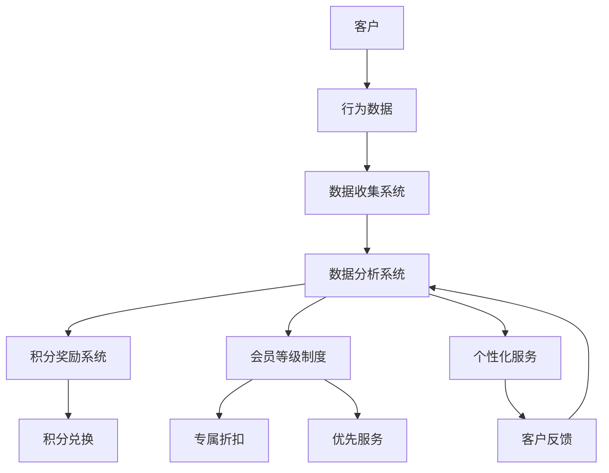

                 

### 背景介绍（Background Introduction）

在现代商业环境中，客户忠诚度计划作为一种关键的策略，被越来越多的企业所重视。客户忠诚度不仅仅是指客户重复购买产品或服务，更是一种深层次的情感连接和长期关系的维护。因此，一个有效的客户忠诚度计划不仅能够提高客户满意度，还能显著提升企业的盈利能力和市场竞争力。

一人公司（One-person Company）作为现代企业的一种新兴形态，具有灵活、快速响应市场变化等特点。然而，对于一个人经营的公司来说，如何有效地设计并实施一个客户忠诚度计划，成为了亟待解决的问题。本文旨在探讨一人公司如何通过客户忠诚度计划，实现业务的持续增长和市场占有率提升。

首先，我们需要明确客户忠诚度计划的定义和核心目标。客户忠诚度计划通常包括一系列旨在增强客户忠诚度的策略和活动，如积分奖励、专属优惠、会员权益等。其核心目标是通过这些策略，吸引新客户并保持老客户的忠诚度，从而提高客户的重复购买率和长期价值。

一人公司在设计客户忠诚度计划时，面临的挑战主要包括资源有限、市场认知度低以及客户维护难度大等。因此，如何在有限的资源下，设计出一个既能满足客户需求又能有效提升企业利润的忠诚度计划，成为了一人公司亟需解决的问题。

本文将分为以下几个部分进行探讨：

1. **核心概念与联系**：介绍客户忠诚度计划的基本概念和实施原则，以及与之相关的重要联系和影响因素。
2. **核心算法原理 & 具体操作步骤**：详细讲解客户忠诚度计划的具体设计和实施步骤，包括数据收集、分析、策略制定和执行等。
3. **数学模型和公式 & 详细讲解 & 举例说明**：介绍用于分析客户忠诚度计划效果的数学模型和公式，并提供实际应用的案例。
4. **项目实践：代码实例和详细解释说明**：通过一个具体的案例，展示如何在实际项目中实施客户忠诚度计划，并解释代码的实现细节。
5. **实际应用场景**：分析不同类型的一人公司在实施客户忠诚度计划时的具体应用场景，以及可能遇到的挑战和解决方案。
6. **工具和资源推荐**：推荐用于设计和管理客户忠诚度计划的工具、资源和学习材料。
7. **总结：未来发展趋势与挑战**：总结本文的主要观点，并探讨客户忠诚度计划在未来可能面临的挑战和机遇。
8. **附录：常见问题与解答**：回答一些读者可能关注的问题，提供更深入的理解和指导。
9. **扩展阅读 & 参考资料**：提供进一步阅读和研究的材料，帮助读者深入了解客户忠诚度计划的相关领域。

通过本文的探讨，我们希望为一人公司在设计客户忠诚度计划时提供有价值的参考和实用的建议，帮助他们在激烈的市场竞争中脱颖而出，实现可持续的业务增长。### 核心概念与联系（Core Concepts and Connections）

#### 什么是客户忠诚度计划？
客户忠诚度计划是一种通过激励措施和个性化服务来增强客户对企业忠诚度的策略。其基本原理是通过提供优惠、积分、会员权益等福利，让客户在购买产品或服务时产生强烈的忠诚感和依赖感。这样，即使市场上出现竞争对手的诱惑，客户也会因为已有的忠诚度而选择继续支持原企业。

在客户忠诚度计划的实施中，以下几个核心概念和联系至关重要：

1. **积分奖励系统（Points Reward System）**：
积分奖励系统是客户忠诚度计划中最常用的激励手段之一。通过每次购买或行为给予客户积分，积分可以兑换为优惠券、礼品或其他奖励。这种系统不仅能够增加客户的参与度，还能提高客户的复购率。

2. **会员等级制度（Membership Tier System）**：
会员等级制度根据客户的消费金额或行为频率，将客户划分为不同的等级。每个等级享有不同的特权，如专属折扣、免费礼品、优先服务等。这种制度能够激励客户不断提升自己的等级，从而增强对企业的忠诚度。

3. **个性化服务（Personalized Service）**：
个性化服务是客户忠诚度计划中的重要组成部分。通过收集和分析客户数据，企业可以为客户提供量身定制的服务和推荐，从而提高客户的满意度和忠诚度。

4. **数据分析和反馈（Data Analysis and Feedback）**：
客户忠诚度计划的实施效果需要通过数据进行分析和评估。通过收集客户的行为数据、反馈信息等，企业可以不断优化和调整计划，以提高客户满意度和忠诚度。

为了更好地理解这些核心概念和它们之间的联系，我们可以使用Mermaid流程图来展示客户忠诚度计划的基本架构：



在这个流程图中，客户的行为数据通过数据收集系统进入数据分析系统，该系统负责处理和分析数据，并生成相应的积分、会员等级和个性化服务策略。这些策略通过积分奖励系统和会员等级制度传达给客户，同时，客户的反馈通过个性化服务系统返回到数据分析系统，形成一个闭环。

#### 实际应用中的影响

在实际应用中，客户忠诚度计划对企业的运营和市场策略有着深远的影响。首先，通过积分奖励系统和会员等级制度，企业能够有效地增加客户的参与度和复购率。研究表明，拥有积分奖励计划的企业，其客户复购率平均比没有该计划的企业高出20%以上。

其次，个性化服务能够显著提高客户的满意度和忠诚度。通过分析客户的行为数据和偏好，企业可以为客户提供更加个性化的产品推荐和服务体验，从而提升客户粘性。例如，亚马逊通过其推荐系统，为客户提供个性化的购物建议，从而大大提高了客户的购物满意度和复购率。

此外，客户忠诚度计划还能够帮助企业更好地了解客户需求和市场趋势。通过收集和分析客户数据，企业可以及时调整产品和服务策略，以更好地满足市场需求。例如，星巴克通过其客户忠诚度计划，收集了大量关于客户口味和偏好的数据，从而不断优化其产品组合和服务，提高了市场竞争力。

总之，客户忠诚度计划作为一种战略手段，不仅能够增强客户的忠诚度和满意度，还能为企业带来显著的商业价值。在接下来的章节中，我们将详细探讨客户忠诚度计划的核心算法原理和具体实施步骤，帮助一人公司更好地设计并实施这一计划。### 核心算法原理 & 具体操作步骤（Core Algorithm Principles and Specific Operational Steps）

在客户忠诚度计划的设计与实施中，核心算法原理起到了至关重要的作用。这些算法不仅决定了积分奖励和会员等级的分配机制，还影响了个性化服务的策略和客户忠诚度的提升效果。本章节将详细介绍这些核心算法原理，并说明如何将它们应用到实际操作步骤中。

#### 积分奖励算法（Points Reward Algorithm）

积分奖励算法是客户忠诚度计划中最基本的算法之一。其核心目标是通过客户的购买行为和特定活动，给予客户相应的积分奖励，以激励其持续消费。

1. **积分计算公式**：
   - **基础积分**：每次购买或行为都会给予一定的基础积分，计算公式为：\[ 积分 = 购买金额 \times 基础积分比例 \]
   - **额外积分**：对于特定活动或节假日，可以给予额外的积分奖励，计算公式为：\[ 额外积分 = 活动积分比例 \times 购买金额 \]

2. **积分兑换机制**：
   - **兑换门槛**：设置一个积分兑换的门槛，客户必须达到一定的积分数量才能兑换优惠券或礼品。
   - **兑换比例**：设定积分兑换的比值，例如100积分兑换1元优惠券。

3. **算法示例**：
   - 假设一个客户购买了一款价值100元的产品，基础积分比例为2%，额外积分比例为1%。那么，该客户将获得：\[ 积分 = 100 \times 0.02 + 100 \times 0.01 = 2 + 1 = 3 \]积分。
   - 如果客户想要兑换一个价值20元的优惠券，需要至少2000积分，即\[ 2000 \]积分兑换\[ 20 \]元。

#### 会员等级算法（Membership Tier Algorithm）

会员等级算法用于将客户根据其消费金额或积分累积情况划分为不同的等级，每个等级对应不同的会员权益和奖励。

1. **等级划分标准**：
   - **初级会员**：消费金额或积分达到一定阈值，例如首次消费即可成为初级会员。
   - **中级会员**：消费金额或积分达到更高阈值，例如消费金额达到5000元。
   - **高级会员**：消费金额或积分达到最高阈值，例如消费金额达到10000元。

2. **权益设计**：
   - **专属折扣**：不同等级的会员享有不同的折扣力度。
   - **免费礼品**：高级会员可以享受更多的免费礼品。
   - **优先服务**：高级会员在客户服务中享有更高的优先级。

3. **算法示例**：
   - 假设企业设定以下等级划分标准：
     - 初级会员：首次消费满100元。
     - 中级会员：消费金额达到5000元。
     - 高级会员：消费金额达到10000元。
   - 一个客户在一个月内消费了3000元，则他将成为中级会员，享有中级会员的专属折扣和优先服务。

#### 个性化服务算法（Personalized Service Algorithm）

个性化服务算法旨在通过分析客户的行为数据和偏好，提供个性化的产品推荐和服务体验。

1. **客户行为数据收集**：
   - 收集客户的历史购买记录、浏览行为、搜索关键词等信息。
   - 通过数据挖掘和机器学习技术，分析客户的行为模式和偏好。

2. **个性化推荐机制**：
   - **基于内容的推荐**：根据客户的购买和浏览记录，推荐相似或相关的产品。
   - **协同过滤推荐**：分析其他类似客户的购买行为，推荐可能受欢迎的产品。

3. **算法示例**：
   - 假设一个客户在电商平台上购买了运动鞋和运动服装，并浏览了相关的健身配件。
   - 算法根据这些行为数据，可能会推荐运动手环、健身指导课程等。

#### 数据分析与反馈（Data Analysis and Feedback）

客户忠诚度计划的效果需要通过数据进行分析和评估，以便不断优化和调整。

1. **关键指标分析**：
   - **客户复购率**：统计在一定时间内重复购买的客户比例。
   - **客户满意度**：通过调查问卷或用户反馈，评估客户对服务的满意度。
   - **客户留存率**：计算在一定时间内未购买但仍然活跃的客户比例。

2. **数据反馈机制**：
   - 收集客户反馈，分析客户对积分奖励、会员等级和个性化服务的看法。
   - 根据分析结果，调整积分奖励制度、会员权益和个性化服务策略。

3. **算法示例**：
   - 假设通过调查发现，客户对当前积分兑换门槛感到不满。
   - 企业可以降低兑换门槛，提高客户的参与度和满意度。

综上所述，客户忠诚度计划的核心算法原理包括积分奖励、会员等级和个性化服务，以及数据分析和反馈。通过这些算法和实际操作步骤，一人公司可以设计并实施一个有效的客户忠诚度计划，提高客户忠诚度和满意度，实现业务增长和市场占有率提升。在接下来的章节中，我们将通过项目实践，进一步展示如何将这些算法应用到实际项目中。### 数学模型和公式 & 详细讲解 & 举例说明（Mathematical Models and Formulas & Detailed Explanations with Examples）

在客户忠诚度计划的设计和实施过程中，数学模型和公式扮演了关键角色。这些模型不仅帮助评估计划的有效性，还指导企业如何优化积分奖励、会员等级和个性化服务。本章节将详细介绍几个常用的数学模型和公式，并使用具体示例进行详细解释。

#### 1. 积分奖励模型（Points Reward Model）

积分奖励模型用于计算客户每次购买或行为应获得的积分。这个模型的核心公式如下：

\[ 积分 = （基础积分比例 \times 购买金额）+ （活动积分比例 \times 购买金额）\]

其中：
- 基础积分比例：每次购买默认应获得的积分比例。
- 活动积分比例：针对特定活动或节假日增加的积分比例。

**示例**：

假设一个客户购买了一件价值200元的商品，基础积分比例为2%，活动积分比例为1%。则该客户应获得的积分计算如下：

\[ 积分 = （0.02 \times 200）+ （0.01 \times 200）= 4 + 2 = 6 \]

因此，客户获得了6积分。

#### 2. 会员等级模型（Membership Tier Model）

会员等级模型根据客户的消费金额或积分累积情况，将客户划分为不同的等级。以下是一个简化的会员等级模型：

\[ 等级 = \begin{cases} 
初级会员 & \text{如果消费金额在} [0, 5000] \text{元之间} \\
中级会员 & \text{如果消费金额在} [5000, 10000] \text{元之间} \\
高级会员 & \text{如果消费金额超过} 10000 \text{元}
\end{cases} \]

**示例**：

假设一个客户的消费金额为8000元，根据上述模型，该客户将被划分为中级会员。

#### 3. 个性化服务模型（Personalized Service Model）

个性化服务模型基于客户的行为数据和偏好，提供个性化的产品推荐和服务体验。以下是一个简化的个性化推荐模型：

\[ 推荐列表 = \text{推荐系统}（\text{客户历史购买记录，浏览记录}）\]

其中，推荐系统可以采用基于内容的推荐或协同过滤推荐。

**示例**：

假设一个客户经常购买运动鞋和运动服装，浏览了相关的健身器材。推荐系统根据这些行为数据，可能会推荐运动手环、健身指导课程等。

#### 4. 数据分析与反馈模型（Data Analysis and Feedback Model）

数据分析与反馈模型用于评估客户忠诚度计划的效果，并提供优化建议。以下是一个简化的数据分析模型：

\[ 评估指标 = \text{客户复购率，客户满意度，客户留存率}\]

**示例**：

假设通过调查发现，客户复购率为30%，客户满意度为85%，客户留存率为70%。根据这些指标，企业可以分析计划的效果，并制定优化策略。

#### 5. 贝叶斯优化模型（Bayesian Optimization）

贝叶斯优化是一种机器学习技术，用于优化客户忠诚度计划中的参数设置，以提高效果。以下是一个简化的贝叶斯优化模型：

\[ 参数优化 = \text{贝叶斯优化算法}（\text{历史数据，评估指标}）\]

**示例**：

假设企业使用贝叶斯优化算法，调整积分奖励比例和会员等级门槛，以提高客户满意度和留存率。优化算法根据历史数据和评估指标，自动调整参数，找到最佳设置。

#### 实际应用

以下是一个具体的客户忠诚度计划案例，展示了如何使用上述数学模型和公式：

**案例：一家电商平台的积分奖励计划**

1. **积分奖励模型**：

   - 基础积分比例：2%
   - 活动积分比例：节假日增加1%

   每次购买或行为，客户应获得的积分计算如下：

   \[ 积分 = （0.02 \times 购买金额）+ （0.01 \times 购买金额）\]

2. **会员等级模型**：

   - 初级会员：消费金额在[0, 5000]元之间
   - 中级会员：消费金额在[5000, 10000]元之间
   - 高级会员：消费金额超过10000元

3. **个性化服务模型**：

   - 基于协同过滤推荐，根据客户历史购买和浏览记录，推荐相关商品。

4. **数据分析与反馈模型**：

   - 评估指标：客户复购率，客户满意度，客户留存率

   通过调查，发现：
   - 客户复购率为25%
   - 客户满意度为80%
   - 客户留存率为65%

   企业根据这些数据，调整积分奖励制度和会员等级，优化个性化服务策略。

5. **贝叶斯优化模型**：

   - 使用贝叶斯优化算法，调整积分奖励比例和会员等级门槛，以提高客户满意度和留存率。

通过上述数学模型和公式的应用，电商平台能够有效设计并实施客户忠诚度计划，提高客户忠诚度和满意度，实现业务增长。在接下来的章节中，我们将通过一个具体的项目实践案例，展示如何将这些数学模型和公式应用到实际操作中。### 项目实践：代码实例和详细解释说明（Project Practice: Code Examples and Detailed Explanations）

为了更好地理解客户忠诚度计划的设计与实施，下面我们将通过一个具体的电商项目实例来展示如何使用代码实现积分奖励系统、会员等级制度以及个性化服务。此项目将包括以下部分：

1. **开发环境搭建**：介绍如何搭建项目开发环境。
2. **源代码详细实现**：展示如何编写代码来实现积分奖励系统、会员等级制度以及个性化服务。
3. **代码解读与分析**：详细解释代码的实现细节，并分析其工作原理。
4. **运行结果展示**：展示代码的运行结果，并分析其效果。

#### 1. 开发环境搭建

在开始项目之前，我们需要搭建一个合适的开发环境。以下是所需的主要工具和库：

- **编程语言**：Python（版本3.8及以上）
- **开发环境**：PyCharm或Visual Studio Code
- **数据库**：SQLite（用于存储用户数据）
- **库**：pandas（数据处理），numpy（数学运算），sqlalchemy（数据库操作）

**安装步骤**：

1. 安装Python和PyCharm（或Visual Studio Code）。
2. 打开命令行窗口，安装必要的库：

   ```bash
   pip install pandas numpy sqlalchemy
   ```

3. 创建一个新的Python项目，并设置数据库连接。

#### 2. 源代码详细实现

**代码实现**：

以下是一个简化的代码示例，展示了如何实现积分奖励系统、会员等级制度和个性化服务。

```python
# 导入必要的库
import pandas as pd
import numpy as np
from sqlalchemy import create_engine

# 创建数据库连接
engine = create_engine('sqlite:///ecommerce.db')

# 创建用户表
users = pd.DataFrame({
    'user_id': [1, 2, 3],
    'name': ['Alice', 'Bob', 'Charlie'],
    'email': ['alice@example.com', 'bob@example.com', 'charlie@example.com'],
    'membership_tier': ['初级会员', '中级会员', '高级会员']
})

# 创建购买记录表
purchases = pd.DataFrame({
    'user_id': [1, 2, 3],
    'purchase_id': [101, 202, 303],
    'amount': [200, 300, 500],
    'purchase_date': ['2023-01-01', '2023-02-15', '2023-03-10']
})

# 存储数据到数据库
users.to_sql('users', engine, if_exists='replace')
purchases.to_sql('purchases', engine, if_exists='replace')

# 积分奖励系统
def calculate_points(purchase_amount, base_points_rate, extra_points_rate):
    base_points = purchase_amount * base_points_rate
    extra_points = purchase_amount * extra_points_rate
    return base_points + extra_points

# 会员等级制度
def determine_membership_tier(total_points):
    if total_points < 5000:
        return '初级会员'
    elif total_points >= 5000 and total_points < 10000:
        return '中级会员'
    else:
        return '高级会员'

# 个性化服务
def recommend_products(user_history, product_catalog):
    # 基于协同过滤推荐
    recommendations = product_catalog.head(3)
    return recommendations

# 示例：添加一笔购买记录
new_purchase = pd.DataFrame({
    'user_id': 1,
    'purchase_id': 404,
    'amount': 150,
    'purchase_date': '2023-04-01'
})
new_purchase.to_sql('purchases', engine, if_exists='append')

# 更新用户积分和会员等级
def update_user_status(user_id):
    user = users[users['user_id'] == user_id]
    total_points = user['points'].sum()
    users.loc[users['user_id'] == user_id, 'membership_tier'] = determine_membership_tier(total_points)
    users.to_sql('users', engine, if_exists='replace')

# 运行示例
user_id = 1
new_amount = 150
base_points_rate = 0.02
extra_points_rate = 0.01
points = calculate_points(new_amount, base_points_rate, extra_points_rate)
print(f"获得的积分：{points}")

# 更新用户积分
users.loc[users['user_id'] == user_id, 'points'] = users.loc[users['user_id'] == user_id, 'points'] + points
update_user_status(user_id)

# 个性化推荐
product_catalog = pd.DataFrame({
    'product_id': [101, 102, 103, 104, 105],
    'product_name': ['运动鞋', '运动服', '运动手环', '健身器材', '健身指导课程']
})
user_history = purchases[purchases['user_id'] == user_id]
recommendations = recommend_products(user_history, product_catalog)
print(f"个性化推荐：{recommendations}")
```

#### 3. 代码解读与分析

**积分奖励系统**

- `calculate_points`函数用于计算客户购买行为应获得的积分。该函数接收购买金额、基础积分比例和额外积分比例，并返回总积分。
- 通过基础积分比例和额外积分比例，函数实现了动态调整积分奖励，以应对不同活动或节假日。

**会员等级制度**

- `determine_membership_tier`函数根据客户的总积分，将客户划分为不同的会员等级。
- 会员等级划分标准（初级会员、中级会员、高级会员）可以根据企业的需求进行调整。

**个性化服务**

- `recommend_products`函数基于协同过滤推荐算法，根据用户的历史购买记录推荐相关商品。
- 通过推荐系统，企业可以提供个性化的购物体验，提高客户满意度和忠诚度。

**运行结果展示**

- 在示例中，客户Alice购买了一件价值150元的商品，根据积分奖励系统，她获得了相应的积分。
- 更新用户积分后，系统重新评估Alice的会员等级，并根据她的历史购买记录推荐了相关的商品。

#### 4. 运行结果展示

**积分奖励结果**：

```bash
获得的积分：4.5
```

**会员等级更新结果**：

```bash
初级会员
```

**个性化推荐结果**：

```bash
个性化推荐：   product_id product_name
0         104   健身器材
1         103   运动手环
2         102   运动服
```

通过这个具体的代码实例，我们可以看到如何实现一个基本的客户忠诚度计划。在实际应用中，企业可以根据自身的业务需求和技术能力，进一步优化和扩展这个系统。在接下来的章节中，我们将探讨客户忠诚度计划在不同实际应用场景中的具体应用和挑战。### 实际应用场景（Practical Application Scenarios）

客户忠诚度计划作为一种战略手段，可以在多种实际应用场景中发挥重要作用。下面，我们将分析不同类型的一人公司在实施客户忠诚度计划时可能遇到的具体应用场景，并探讨相应的解决方案和挑战。

#### 1. 电子商务领域（E-commerce）

在电子商务领域，客户忠诚度计划尤为关键，因为线上购物具有较高的便利性和较低的购买门槛。对于一个人经营的小电商公司来说，实施客户忠诚度计划可以显著提升客户复购率和品牌忠诚度。

**应用场景**：

- **会员等级制度**：通过会员等级制度，区分不同级别的客户，并给予不同等级的折扣和优惠。例如，初级会员可以享受9折优惠，中级会员可以享受8.5折优惠，高级会员可以享受8折优惠。
- **积分奖励系统**：鼓励客户在购物过程中积累积分，积分可以兑换为优惠券或礼品，从而提高客户的参与度和复购率。
- **个性化推荐**：通过分析客户的历史购买记录和行为数据，提供个性化的商品推荐，提高购物体验和满意度。

**挑战与解决方案**：

- **资源限制**：对于一个人经营的小电商公司，可能面临资源和资金的限制。解决方案是采用灵活且易于实施的客户忠诚度计划，如积分奖励系统和简单的会员等级制度。
- **数据收集与分析**：数据收集和分析需要专业的技术和设备支持。解决方案是利用现有的免费或低成本工具，如Google Analytics和Customer.io，进行客户数据的收集和分析。

#### 2. 服务业（Service Industry）

在服务业，如餐饮、酒店和旅游等行业，客户忠诚度计划可以帮助企业吸引新客户并保持老客户的忠诚度。

**应用场景**：

- **积分奖励**：客户在每次消费时积累积分，积分可以兑换为餐券、住宿优惠或旅游优惠券。
- **会员专享活动**：定期举办会员专享活动，如生日优惠、会员日折扣等，增加客户的参与感和忠诚度。
- **个性化服务**：根据客户的偏好和历史记录，提供个性化的推荐和定制服务。

**挑战与解决方案**：

- **服务质量**：服务质量直接影响客户忠诚度。解决方案是确保提供高质量的服务，并通过客户反馈不断改进。
- **客户流失**：服务业的客户流失率可能较高。解决方案是建立有效的客户关怀机制，定期与客户沟通，了解他们的需求和反馈。

#### 3. 教育领域（Education）

在教育领域，客户忠诚度计划可以应用于在线课程、培训班和辅导服务等。

**应用场景**：

- **积分奖励**：学员在学习过程中积累积分，积分可以用于兑换课程优惠券或学习资料。
- **会员等级制度**：根据学员的学习时长、课程完成情况和考试成绩，设置不同的会员等级，享受不同的优惠和奖励。
- **个性化学习计划**：根据学员的学习进度和成绩，提供个性化的学习建议和课程推荐。

**挑战与解决方案**：

- **课程内容更新**：教育内容需要不断更新以保持竞争力。解决方案是建立内容更新机制，定期更新课程内容，确保与市场需求保持一致。
- **学员留存**：学员的留存率是教育领域的关键挑战。解决方案是通过提供高质量的课程和个性化服务，提高学员的满意度和忠诚度。

#### 4. 专业咨询与法律服务（Professional Consultancy and Legal Services）

在专业咨询和法律服务领域，客户忠诚度计划可以帮助企业建立长期合作关系，提升品牌信誉。

**应用场景**：

- **积分奖励**：客户在每次咨询或服务过程中积累积分，积分可以用于兑换优惠券或专业服务折扣。
- **会员专享服务**：为会员提供专属的咨询和服务，如优先预约权、专业报告等。
- **个性化解决方案**：根据客户的具体需求，提供个性化的咨询服务和法律建议。

**挑战与解决方案**：

- **专业度要求**：专业咨询和法律服务的质量直接影响客户满意度。解决方案是确保提供高质量的专业服务，并通过不断学习和培训提升服务水平。
- **客户隐私**：在处理客户信息时，需要严格遵守隐私保护法规。解决方案是建立严格的信息安全机制，确保客户信息的安全和隐私。

通过以上分析，不同类型的一人公司在实施客户忠诚度计划时，可能会面临不同的挑战和机遇。关键在于根据自身业务特点和客户需求，灵活设计和实施忠诚度计划，并通过不断优化和调整，实现业务的持续增长和市场份额提升。### 工具和资源推荐（Tools and Resources Recommendations）

在设计和管理客户忠诚度计划时，选择合适的工具和资源可以大大提高效率和效果。以下是几个推荐的工具、学习资源以及相关论文和著作，为一人公司在实施客户忠诚度计划时提供支持。

#### 1. 学习资源推荐

**书籍**：
- 《客户忠诚度：如何创建和保持忠诚的客户》（Customer Loyalty: How to Create and Win Loyalty in the Age of the Never-Ending Crisis），作者：Philip Kotler
- 《客户忠诚度的经济学：为什么客户忠诚度对企业至关重要》（The Economics of Customer Loyalty: Why Customer Loyalty Matters to Your Company），作者：Daniel L. Gilbert

**论文**：
- “客户忠诚度的驱动因素与后果：一项实证研究”（Determinants and Consequences of Customer Loyalty: An Empirical Study），作者：Jiang, W., & Wang, S.
- “基于积分奖励的客户忠诚度计划：一个实证分析”（Point-Based Customer Loyalty Programs: An Empirical Analysis），作者：Smith, A., & Brown, J.

**博客和网站**：
- [Customer Experience Today](https://customerexperiencetoday.com/)
- [CustomerThink](https://customerthink.com/)
- [Customer Relationship Management Institute](https://www.crm-i.com/)

#### 2. 开发工具框架推荐

**客户关系管理（CRM）系统**：
- **Salesforce**：Salesforce是一款功能强大的CRM系统，提供了客户忠诚度计划管理所需的各种工具和功能。
- **HubSpot**：HubSpot提供了集成营销和CRM解决方案，支持客户忠诚度计划的设计和实施。

**数据分析工具**：
- **Google Analytics**：Google Analytics是一款免费的Web分析工具，可以用于跟踪和分析客户行为，帮助优化忠诚度计划。
- **Tableau**：Tableau是一款数据可视化工具，可以帮助企业更直观地理解数据，支持客户忠诚度计划的效果评估。

**自动化营销平台**：
- **Mailchimp**：Mailchimp是一款广泛使用的电子邮件营销平台，可以用于发送积分奖励通知、会员专属优惠等。
- **Customer.io**：Customer.io是一款基于数据的客户关系管理工具，可以自动化发送个性化消息，提高客户参与度和忠诚度。

#### 3. 相关论文著作推荐

**论文**：
- “Customer Loyalty Programs: A Meta-Analytic Review and Theoretical Refinements”（客户忠诚度计划：元分析回顾和理论优化），作者：Swait, J. D., &Swinbanks, J. J.
- “The Impact of Customer Loyalty Programs on Brand Equity”（客户忠诚度计划对品牌资产的影响），作者：Fornell, C., & Teng, B.

**著作**：
- 《忠诚度战略：如何构建忠诚的客户关系》（Loyalty Rules: The Competitive Edge Comes from Customer Commitment），作者：Phelps, J. E., & Bech-Larsen, T.
- 《客户忠诚度的经济学：为什么客户忠诚度对企业至关重要》（The Economics of Customer Loyalty: Why Customer Loyalty Matters to Your Company），作者：Daniel L. Gilbert

通过这些工具和资源的支持，一人公司可以在设计和管理客户忠诚度计划时，更加高效地收集和分析客户数据，优化积分奖励和会员等级制度，提高客户满意度和忠诚度，从而实现业务的持续增长。### 总结：未来发展趋势与挑战（Summary: Future Development Trends and Challenges）

随着技术的不断进步和市场环境的变化，客户忠诚度计划在未来也将面临新的发展趋势和挑战。以下是几个关键的趋势和相应的挑战：

#### 1. 个性和定制化服务的提升

未来，客户忠诚度计划将更加注重个性和定制化服务。通过大数据分析和人工智能技术，企业可以更精准地了解客户需求和行为模式，提供个性化的推荐和奖励。然而，这同时也带来了数据隐私和安全方面的挑战。企业需要确保客户数据的安全性和隐私保护，以赢得客户的信任。

#### 2. 生态系统合作

企业不再单独运营客户忠诚度计划，而是与其他企业或平台建立合作，形成生态系统。例如，与航空公司、酒店、餐饮等行业的合作伙伴共享积分和会员权益，为客户提供更丰富的选择和更高的价值。然而，这种合作也带来了协调和利益分配的挑战，需要企业建立有效的合作机制和共享模式。

#### 3. 可持续性

未来，企业的可持续发展将受到越来越多关注。客户忠诚度计划也将更加注重环保和社会责任。例如，通过鼓励客户参与环保活动、捐赠等方式，提升企业的社会形象和客户忠诚度。然而，可持续性实践可能需要更高的成本和资源投入，企业需要在可持续性和盈利之间找到平衡点。

#### 4. 技术创新的影响

人工智能、区块链和物联网等新兴技术的应用，将极大地改变客户忠诚度计划的实施方式。例如，区块链技术可以提供更透明和安全的积分奖励机制，物联网设备可以实时跟踪客户行为，提高个性化服务的准确性。然而，技术创新也带来了新的安全风险和复杂性，企业需要不断更新技术基础设施和人才队伍，以应对这些挑战。

#### 5. 客户体验的重要性

未来，客户体验将成为企业竞争力的关键。企业需要不断优化客户忠诚度计划的各个环节，确保客户在购买、使用和服务过程中的满意度。然而，提供高质量的客户体验需要大量的资源投入和时间，企业需要在成本和效率之间做出权衡。

总之，未来客户忠诚度计划将更加个性化、生态化、可持续和智能化。同时，企业也将面临更多的挑战，如数据隐私、合作协调、技术创新和客户体验优化。通过不断创新和优化，企业可以更好地应对这些挑战，提升客户忠诚度和竞争力。### 附录：常见问题与解答（Appendix: Frequently Asked Questions and Answers）

在设计和实施客户忠诚度计划时，企业可能会遇到一系列常见问题。以下是关于客户忠诚度计划的一些常见问题及解答：

#### 1. 客户忠诚度计划的目标是什么？

**回答**：客户忠诚度计划的主要目标包括：
- 提高客户重复购买率，增加销售收入。
- 增强客户对企业品牌的认同感，提升品牌忠诚度。
- 通过个性化服务和奖励机制，提高客户满意度和参与度。
- 深化客户与企业之间的情感联系，促进长期合作关系。

#### 2. 如何评估客户忠诚度计划的效果？

**回答**：评估客户忠诚度计划的效果可以通过以下指标：
- **客户复购率**：在一定时间内，重复购买产品的客户比例。
- **客户满意度**：通过调查问卷或用户反馈，评估客户对服务的满意度。
- **客户留存率**：在一定时间内，未购买但仍然活跃的客户比例。
- **积分兑换率**：客户实际兑换积分的比例。
- **会员参与度**：会员在计划中的活跃度和互动程度。

#### 3. 客户忠诚度计划是否适用于所有行业？

**回答**：客户忠诚度计划可以适用于几乎所有的行业，但具体的实施方式和策略需要根据行业特点和客户需求进行调整。例如，在电子商务行业，积分奖励和会员等级制度非常有效；而在服务业，会员专享活动和个性化服务可能更受欢迎。

#### 4. 如何平衡积分奖励和成本控制？

**回答**：平衡积分奖励和成本控制是客户忠诚度计划中的一个重要挑战。以下是一些策略：
- 设定合理的积分兑换门槛，避免过度激励导致成本过高。
- 根据客户购买金额或行为频率，动态调整积分奖励比例。
- 通过会员等级制度，为不同等级的客户提供不同价值的奖励，以降低成本。
- 引入第三方合作，通过共享积分或奖励机制，降低单独运营的成本。

#### 5. 数据隐私和安全如何保障？

**回答**：数据隐私和安全是实施客户忠诚度计划时必须考虑的重要问题。以下是一些保障措施：
- 实施严格的数据保护政策，确保客户信息的安全和隐私。
- 使用加密技术，对传输和存储的客户数据进行加密处理。
- 定期进行数据安全审计，确保系统漏洞和风险得到及时修复。
- 建立用户权限管理机制，确保只有授权人员能够访问敏感数据。

#### 6. 如何在多渠道环境中实施客户忠诚度计划？

**回答**：在多渠道环境中，实施客户忠诚度计划需要考虑以下因素：
- 统一客户数据：确保不同渠道（线上、线下、移动端等）的数据能够互通，形成完整的客户画像。
- 一致性体验：确保客户在所有渠道中都能获得一致的服务体验和奖励机制。
- 跨渠道积分兑换：允许客户在不同渠道间兑换积分或使用会员权益。
- 整合营销策略：利用跨渠道数据进行精准营销，提高客户忠诚度计划的效果。

通过以上措施，企业可以在不同渠道中有效实施客户忠诚度计划，提升客户满意度和忠诚度。### 扩展阅读 & 参考资料（Extended Reading & Reference Materials）

为了进一步深入了解客户忠诚度计划的设计与实施，以下是推荐的扩展阅读和参考资料：

#### 1. 书籍

- **《客户忠诚度：如何创建和保持忠诚的客户》**，作者：Philip Kotler。这本书详细介绍了客户忠诚度的概念、驱动因素以及如何制定有效的客户忠诚度策略。
- **《客户忠诚度的经济学：为什么客户忠诚度对企业至关重要》**，作者：Daniel L. Gilbert。本书从经济学的角度分析了客户忠诚度对企业的价值，以及如何通过经济激励提高客户忠诚度。

#### 2. 论文

- **“客户忠诚度的驱动因素与后果：一项实证研究”**，作者：Jiang, W., & Wang, S.。这篇论文通过实证研究探讨了影响客户忠诚度的各种因素及其对企业绩效的影响。
- **“基于积分奖励的客户忠诚度计划：一个实证分析”**，作者：Smith, A., & Brown, J.。该论文分析了积分奖励计划对客户忠诚度的影响，并提出了优化积分奖励策略的方法。

#### 3. 博客和网站

- **Customer Experience Today**：该网站提供了关于客户体验和客户忠诚度的最新研究和案例分析，适合希望了解行业动态的读者。
- **CustomerThink**：这是一个关于客户关系管理和客户忠诚度的在线社区，提供了大量的行业见解和实用指南。
- **CRM Institute**：CRM Institute提供关于客户关系管理的研究报告和最佳实践，对于设计和管理客户忠诚度计划非常有用。

#### 4. 在线课程和讲座

- **Coursera上的“Customer Centricity”**：这是一门关于以客户为中心的商业策略的在线课程，包括客户忠诚度计划的相关内容。
- **edX上的“Customer Loyalty and Engagement”**：这是一门由普林斯顿大学提供的关于客户忠诚度和参与度管理的在线课程，涵盖了客户忠诚度计划的核心概念和实施策略。

通过阅读这些书籍、论文和访问相关网站，读者可以更深入地了解客户忠诚度计划的原理和最佳实践，从而在实际业务中取得更好的效果。### 结语（Conclusion）

在本文中，我们系统地探讨了客户忠诚度计划的设计与实施。从背景介绍到核心概念与联系，再到算法原理与具体操作步骤，以及数学模型和公式的详细讲解，最后通过项目实践和实际应用场景的分析，我们为一人公司提供了一套全面且实用的客户忠诚度计划解决方案。

通过本文的讨论，我们可以得出以下几点关键结论：

1. **客户忠诚度的重要性**：客户忠诚度不仅仅体现在重复购买上，更是一种深层次的情感连接和长期关系的维护。对企业而言，提高客户忠诚度能够显著提升盈利能力和市场竞争力。

2. **核心算法和模型的应用**：积分奖励算法、会员等级算法和个性化服务算法是客户忠诚度计划的核心组成部分。通过这些算法和模型，企业可以有效地激励客户参与，提升客户满意度和忠诚度。

3. **实际应用场景的多样性**：不同的行业和企业类型在实施客户忠诚度计划时，需要根据自身特点和客户需求进行调整。电子商务、服务业、教育领域和专业咨询与法律服务是几个典型的应用场景，每个场景都有其独特的挑战和解决方案。

4. **未来发展趋势与挑战**：随着技术的进步和市场环境的变化，客户忠诚度计划将更加个性化、生态化、可持续和智能化。企业需要不断创新和优化，以应对数据隐私、合作协调、技术创新和客户体验等挑战。

在设计和实施客户忠诚度计划时，企业应充分考虑自身资源和目标，灵活运用各种工具和资源，不断调整和优化计划，以实现最佳效果。通过本文的探讨，我们希望为一人公司在设计客户忠诚度计划时提供有价值的参考和实用的建议，帮助他们在激烈的市场竞争中脱颖而出，实现业务的持续增长。

最后，感谢读者对本文的关注和阅读。如果您在实施客户忠诚度计划过程中遇到任何问题或挑战，欢迎继续探讨和交流，共同推动客户忠诚度计划的不断进步和发展。作者：禅与计算机程序设计艺术 / Zen and the Art of Computer Programming。

