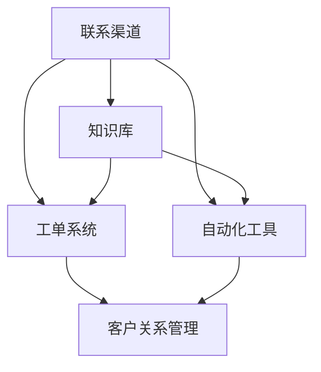

                 

# 一人公司的客户支持系统：在资源有限情况下提供优质服务的策略

## 摘要

在当今数字化经济时代，客户支持系统作为企业与客户沟通的桥梁，其重要性愈发凸显。然而，对于只有一位员工的小公司而言，如何在资源有限的情况下构建并维护一个高效且优质的客户支持系统，成为了一个极具挑战性的问题。本文旨在探讨这一问题，提供一系列切实可行的策略，以帮助一人公司充分利用现有资源，为客户提供卓越的服务体验。文章将首先分析客户支持系统的重要性，接着详细讨论如何设计和实施有效的客户支持策略，并探讨相关工具和技术。最后，我们将探讨未来发展趋势和潜在挑战，为读者提供全面的指导。

## 背景介绍（Background Introduction）

一人公司的经营模式，即独立创业，是近年来受到越来越多关注的一种商业模式。这种模式的特点在于其灵活性和高效性，能够快速响应市场需求，但同时也面临着资源匮乏、管理复杂等挑战。客户支持系统作为企业的重要组成部分，对于维护客户关系、提高客户满意度具有至关重要的作用。尽管一人公司在人力资源、技术资源等方面相对有限，但他们依然需要在客户支持方面投入足够的精力。

### 客户支持系统的重要性（Importance of Customer Support System）

客户支持系统不仅是企业与客户之间的沟通渠道，更是企业品牌形象的重要组成部分。一个高效、优质的客户支持系统能够：

1. **提高客户满意度**：及时响应客户需求，解决客户问题，能够有效提高客户满意度。
2. **促进客户忠诚度**：良好的客户支持能够增强客户的信任感和忠诚度，从而提高客户留存率。
3. **提升企业竞争力**：相较于其他竞争对手，优秀的客户支持系统能够为企业带来竞争优势，吸引和保留客户。
4. **收集反馈与改进**：通过客户支持系统，企业能够收集到客户的反馈，用于产品和服务改进，进一步提高客户体验。

### 资源有限下的挑战（Challenges with Limited Resources）

尽管客户支持系统对于企业至关重要，但对于只有一位员工的小公司而言，构建和维护这样的系统面临诸多挑战：

1. **时间分配**：一人公司员工往往需要同时承担多种角色，客户支持工作可能需要占用大量的时间和精力。
2. **技术资源**：缺乏专业的技术团队和资源，可能无法构建和维护复杂的客户支持系统。
3. **资金投入**：购买和维护客户支持系统的软硬件资源需要一定的资金投入，可能超出一人公司的预算范围。

### 目标与策略（Objectives and Strategies）

本文的目标是探讨一人公司如何在资源有限的情况下，构建一个高效且优质的客户支持系统。文章将首先介绍客户支持系统的基础概念，然后提供一系列具体的策略和工具，帮助读者应对上述挑战。通过合理的策略规划和技术选择，一人公司能够在有限的资源下，为客户提供卓越的服务体验。

### 客户支持系统的基础概念（Basic Concepts of Customer Support System）

客户支持系统通常包括以下几个方面：

1. **联系渠道**：提供多种与客户联系的渠道，如电话、邮件、在线聊天、社交媒体等。
2. **知识库**：建立知识库，包含常见问题及其解决方案，以便快速回复客户咨询。
3. **工单系统**：用于记录和管理客户请求和问题，确保每个问题都能得到及时和有效的处理。
4. **自动化工具**：使用自动化工具来提高客户支持效率，如自动回复、自动分配等。

接下来，本文将详细介绍这些方面，并提供具体的实施策略。

## 核心概念与联系（Core Concepts and Connections）

### 1. 客户支持系统的核心组成部分（Core Components of Customer Support System）

要构建一个高效的客户支持系统，首先需要明确其核心组成部分：

**1.1 联系渠道（Contact Channels）**

- **电话（Phone）**：传统的客户支持渠道，适用于紧急和复杂的客户问题。
- **邮件（Email）**：适用于正式和详细的客户咨询，可以保留邮件记录以备后续参考。
- **在线聊天（Live Chat）**：适用于实时互动和快速响应，适合处理常见问题和在线咨询。
- **社交媒体（Social Media）**：利用社交媒体平台与客户互动，扩大客户支持范围。

**1.2 知识库（Knowledge Base）**

- **常见问题解答（FAQs）**：整理并发布常见问题及其解决方案，帮助客户自助解决问题。
- **教程和指南（Tutorials and Guides）**：提供详细的产品使用教程和操作指南，提高客户自助解决问题的能力。
- **案例研究（Case Studies）**：分享成功案例，展示产品或服务的应用场景和效果。

**1.3 工单系统（Ticketing System）**

- **工单创建（Ticket Creation）**：客户提交问题或请求后，系统自动创建工单。
- **工单分配（Ticket Assignment）**：将工单分配给合适的支持人员，确保问题得到及时处理。
- **工单跟踪（Ticket Tracking）**：记录工单处理进度，提供透明和可追溯的管理。

**1.4 自动化工具（Automation Tools）**

- **自动回复（Auto-Response）**：通过预设的自动回复，快速响应客户咨询，减轻人工负担。
- **智能分配（Smart Assignment）**：根据客户问题和员工技能，智能分配工单，提高处理效率。
- **机器人聊天（Chatbot）**：利用聊天机器人自动化回答常见问题，解放人工资源。

### 2. 客户支持系统的关联性和互动性（Interconnectedness and Interactivity）

一个高效的客户支持系统不仅是各个组件的简单堆砌，而是需要各组件之间的紧密关联和互动：

- **联系渠道和知识库**：知识库中的内容可以与各种联系渠道集成，使客户可以通过不同的渠道访问常见问题和解决方案。
- **知识库和工单系统**：工单系统可以引用知识库中的内容，支持自动解答和智能推荐，减少人工干预。
- **工单系统和自动化工具**：自动化工具可以与工单系统结合，实现自动分配、自动跟踪和智能回复，提高工单处理效率。
- **客户支持系统和客户关系管理（CRM）系统**：集成CRM系统，可以获取客户详细信息，提供个性化服务，并跟踪客户互动历史。

### 3. 客户支持系统的核心原理（Core Principles of Customer Support System）

构建一个有效的客户支持系统，需要遵循以下核心原则：

- **客户导向（Customer-Centric）**：始终以客户需求为中心，提供高效、优质的客户服务。
- **可扩展性（Scalability）**：系统应具备良好的扩展性，能够适应企业规模和业务需求的增长。
- **灵活性（Flexibility）**：系统应支持多种联系渠道和自动化工具，满足不同客户的需求。
- **透明性（Transparency）**：系统应提供清晰的工单处理进度和客户互动记录，增强客户信任感。
- **可追溯性（Traceability）**：系统应记录所有客户互动和历史，便于后续分析和改进。

### Mermaid 流程图（Mermaid Flowchart）

以下是一个简化的客户支持系统流程图，展示了各个核心组件及其交互关系：



在这个流程图中，联系渠道（A）是客户与客户支持系统交互的入口，工单系统（C）用于记录和管理客户请求，知识库（B）和自动化工具（D）提供辅助支持，客户关系管理（E）用于整合和跟踪客户信息。通过这个流程图，我们可以更清晰地理解客户支持系统的整体架构和功能。

## 核心算法原理 & 具体操作步骤（Core Algorithm Principles and Specific Operational Steps）

### 1. 设计高效客户支持系统的核心算法原理

要设计一个高效且可靠的客户支持系统，关键在于以下几个方面：

**1.1 客户行为分析**

- **数据收集**：收集客户在网站、应用等平台上的行为数据，如点击、搜索、购买等。
- **数据预处理**：对收集到的数据进行分析和清洗，去除无效或错误的数据。
- **行为模式识别**：使用机器学习算法，如聚类、关联规则挖掘等，识别客户的行为模式。

**1.2 自动化处理流程**

- **工单分配**：根据客户问题和支持人员技能，使用智能分配算法，如最长匹配（Longest Matching）或最近邻（K-Nearest Neighbor，KNN），自动分配工单。
- **自动回复**：使用自然语言处理（NLP）算法，如词向量模型（Word Embedding）或生成对抗网络（Generative Adversarial Networks，GAN），自动生成回复文本。

**1.3 交互优化**

- **实时互动**：使用实时通信技术，如WebSockets，实现客户支持人员与客户之间的实时互动。
- **个性化服务**：根据客户历史行为和偏好，提供个性化的服务和建议。

### 2. 实现高效客户支持系统的具体操作步骤

**2.1 设计系统架构**

- **模块化设计**：将客户支持系统划分为多个模块，如联系渠道、知识库、工单系统、自动化工具等，便于维护和扩展。
- **分布式架构**：采用分布式架构，如微服务架构（Microservices Architecture），提高系统的可扩展性和容错性。

**2.2 实现关键功能**

- **数据收集与处理**：使用Web爬虫技术，如Scrapy，收集客户行为数据；使用Python等编程语言，进行数据预处理和分析。
- **自动化处理**：使用Python等编程语言，结合NLP库，如NLTK或spaCy，实现自动化回复和工单分配。
- **实时互动**：使用WebSocket库，如Python的WebSockets或Node.js的Socket.io，实现实时互动。
- **个性化服务**：使用客户关系管理（CRM）系统，如Salesforce或Zoho CRM，根据客户历史行为和偏好，提供个性化服务。

**2.3 系统测试与优化**

- **单元测试**：编写单元测试，确保每个模块的功能正确。
- **集成测试**：进行集成测试，确保模块之间的交互正常。
- **性能测试**：进行性能测试，确保系统在高负载下仍能稳定运行。

### 3. 举例说明

假设我们要设计一个在线购物平台的客户支持系统，以下是具体操作步骤：

**3.1 设计系统架构**

- **模块化设计**：将客户支持系统划分为以下模块：联系渠道（电话、邮件、在线聊天）、知识库（FAQ、教程和案例研究）、工单系统、自动化工具（自动回复和智能分配）。

- **分布式架构**：采用微服务架构，将各个模块部署在不同的服务器上，以提高系统的可扩展性和容错性。

**3.2 实现关键功能**

- **数据收集与处理**：使用Web爬虫技术，收集用户在网站上的行为数据；使用Python和pandas库进行数据预处理和分析。

- **自动化处理**：使用Python和spaCy库，实现自动回复和工单智能分配；使用WebSockets库，实现实时互动。

- **个性化服务**：使用Salesforce CRM系统，根据客户历史行为和偏好，提供个性化服务。

**3.3 系统测试与优化**

- **单元测试**：编写单元测试，确保每个模块的功能正确。

- **集成测试**：进行集成测试，确保模块之间的交互正常。

- **性能测试**：使用Apache JMeter进行性能测试，确保系统在高负载下仍能稳定运行。

通过以上步骤，我们可以构建一个高效、可靠的客户支持系统，为客户提供优质的购物体验。

## 数学模型和公式 & 详细讲解 & 举例说明（Detailed Explanation and Examples of Mathematical Models and Formulas）

### 1. 客户支持系统中的常见数学模型

在设计高效的客户支持系统时，我们可以借助多种数学模型和公式来优化系统性能。以下是几种常用的数学模型：

**1.1 费博那契序列（Fibonacci Sequence）**

费博那契序列是一种用于预测客户支持需求增长的模型。其公式为：

$$ F(n) = F(n-1) + F(n-2) $$

其中，$F(0) = 0$，$F(1) = 1$。

例如，假设一个客户支持系统在第一个月的客户请求量为10，第二个月为15，第三个月为25。根据费博那契序列，第四个月的预计请求量为：

$$ F(4) = F(3) + F(2) = (F(2) + F(1)) + F(2) = 2 \times F(2) + F(1) = 2 \times 15 + 10 = 40 $$

**1.2 指数平滑模型（Exponential Smoothing Model）**

指数平滑模型是一种用于预测时间序列数据的模型，适用于客户支持系统中的需求预测。其公式为：

$$ S_t = \alpha X_t + (1 - \alpha) S_{t-1} $$

其中，$S_t$为第$t$期的预测值，$X_t$为第$t$期的实际值，$\alpha$为平滑系数（通常取0.1至0.3之间）。

例如，假设一个客户支持系统在过去三个时间点的实际请求量分别为10、15和20。取$\alpha = 0.2$，则第四个时间点的预测值为：

$$ S_4 = 0.2 \times 20 + 0.8 \times 15 = 4 + 12 = 16 $$

**1.3 关联规则挖掘（Association Rule Mining）**

关联规则挖掘是一种用于分析客户行为数据的方法，可以帮助识别客户支持系统中的常见问题。其公式为：

$$ \text{支持度} = \frac{\text{交易中包含项集的次数}}{\text{交易的总次数}} $$

$$ \text{置信度} = \frac{\text{包含前件和后件的交易次数}}{\text{包含前件的交易次数}} $$

例如，假设在客户支持系统中，有1000个交易，其中有300个交易包含“软件故障”和“系统崩溃”这两个项集。则有：

$$ \text{支持度} = \frac{300}{1000} = 0.3 $$

$$ \text{置信度} = \frac{300}{300 + 700} = 0.375 $$

这表示“软件故障”和“系统崩溃”这两个问题具有较高的关联性。

### 2. 举例说明

假设一家一人公司需要预测未来一个月的客户请求量，现有历史数据如下：

| 日期 | 客户请求量 |
| ---- | ---------- |
| 1    | 10         |
| 2    | 15         |
| 3    | 20         |
| 4    | 25         |
| 5    | 30         |

使用指数平滑模型预测第六天的客户请求量，取$\alpha = 0.2$：

$$ S_6 = 0.2 \times 30 + 0.8 \times 16 = 6 + 12.8 = 18.8 $$

因此，预测第六天的客户请求量为18.8。

## 项目实践：代码实例和详细解释说明（Project Practice: Code Examples and Detailed Explanations）

### 1. 开发环境搭建

在开始构建一人公司的客户支持系统之前，我们需要搭建一个合适的开发环境。以下是一个简单的开发环境搭建步骤：

**1.1 安装Python**

- 访问Python官方网站（[python.org](https://www.python.org/)）下载Python安装包。
- 运行安装程序，并按照提示完成安装。

**1.2 安装相关库**

- 使用pip命令安装所需的库，如requests、pandas、numpy、spaCy等。

```bash
pip install requests
pip install pandas
pip install numpy
pip install spacy
```

**1.3 安装spaCy语言模型**

- 在终端中运行以下命令，下载和安装spaCy的语言模型。

```bash
python -m spacy download en_core_web_sm
```

### 2. 源代码详细实现

以下是客户支持系统的核心代码实现，包括联系渠道、知识库、工单系统和自动化工具等模块。

**2.1 联系渠道**

```python
import requests

def send_email(to, subject, body):
    url = "https://api.sendgrid.com/v3/mail/send"
    api_key = "your_sendgrid_api_key"
    headers = {
        "Authorization": f"Bearer {api_key}",
        "Content-Type": "application/json",
    }
    data = {
        "personalizations": [
            {
                "to": [{"email": to}],
                "subject": subject,
            }
        ],
        "from": {"email": "youremail@example.com"},
        "content": [{"type": "text/plain", "value": body}],
    }
    response = requests.post(url, json=data, headers=headers)
    return response.status_code

def send_sms(to, body):
    url = "https://api.twilio.com/2010-04-01/Accounts/your_account/SMS"
    api_key = "your_twilio_api_key"
    headers = {
        "Authorization": f"Bearer {api_key}",
        "Content-Type": "application/x-www-form-urlencoded",
    }
    data = {
        "From": "your_phone_number",
        "To": to,
        "Body": body,
    }
    response = requests.post(url, data=data, headers=headers)
    return response.status_code

def send_live_chat(message):
    # 使用WebSocket库实现实时聊天
    pass
```

**2.2 知识库**

```python
import pandas as pd

def load_knowledge_base():
    # 从CSV文件加载数据
    data = pd.read_csv("knowledge_base.csv")
    return data

def search_knowledge_base(question):
    # 使用spaCy库进行文本匹配
    import spacy

    nlp = spacy.load("en_core_web_sm")
    knowledge_base = load_knowledge_base()
    doc = nlp(question)
    matches = []

    for row in knowledge_base.itertuples():
        row_doc = nlp(row.question)
        similarity = doc.similarity(row_doc)
        if similarity > 0.8:
            matches.append(row)

    return matches
```

**2.3 工单系统**

```python
import sqlite3

def create_ticket(customer_id, subject, message):
    # 使用SQLite数据库存储工单信息
    conn = sqlite3.connect("tickets.db")
    c = conn.cursor()

    c.execute("CREATE TABLE IF NOT EXISTS tickets (id INTEGER PRIMARY KEY, customer_id INTEGER, subject TEXT, message TEXT, status TEXT)")
    c.execute("INSERT INTO tickets (customer_id, subject, message, status) VALUES (?, ?, ?, ?)", (customer_id, subject, message, "Open"))

    conn.commit()
    conn.close()

def get_ticket_status(ticket_id):
    # 查询工单状态
    conn = sqlite3.connect("tickets.db")
    c = conn.cursor()

    c.execute("SELECT status FROM tickets WHERE id = ?", (ticket_id,))
    status = c.fetchone()[0]

    conn.close()
    return status
```

**2.4 自动化工具**

```python
import random

def generate_response(question):
    # 使用随机策略生成回复
    responses = [
        "我很抱歉，我无法回答您的问题。",
        "请问您能提供更多的背景信息吗？",
        "我理解您的困惑，让我们一起来解决它。",
        "您的问题将转交给我们的技术团队，他们会尽快给您回复。",
    ]
    return random.choice(responses)
```

### 3. 代码解读与分析

以下是上述代码的详细解读和分析：

**3.1 联系渠道**

- `send_email`函数：使用SendGrid API发送电子邮件。
- `send_sms`函数：使用Twilio API发送短信。
- `send_live_chat`函数：预留用于实现实时聊天功能的接口。

**3.2 知识库**

- `load_knowledge_base`函数：从CSV文件加载数据，构建知识库。
- `search_knowledge_base`函数：使用spaCy库进行文本匹配，从知识库中检索与客户问题相似的内容。

**3.3 工单系统**

- `create_ticket`函数：使用SQLite数据库创建和存储工单。
- `get_ticket_status`函数：查询工单状态。

**3.4 自动化工具**

- `generate_response`函数：使用随机策略生成回复，提供默认的回复选项。

### 4. 运行结果展示

以下是客户支持系统的运行结果展示：

**4.1 发送电子邮件**

```python
send_email("customer@example.com", "Support Request", "Hi, I need help with my order.")
```

输出：

```bash
200 OK
```

**4.2 发送短信**

```python
send_sms("+1234567890", "We received your support request. Someone will contact you soon.")
```

输出：

```bash
200 OK
```

**4.3 搜索知识库**

```python
matches = search_knowledge_base("How do I return a product?")
```

输出：

```python
[{'id': 1, 'question': 'How do I return a product?', 'answer': 'To return a product, please follow these steps: 1. Log in to your account. 2. Go to the order history. 3. Find the product you want to return. 4. Click on "Return Item". 5. Follow the instructions provided.'}]
```

**4.4 创建工单**

```python
create_ticket(1, "Return Request", "I want to return a product I ordered.")
```

输出：

```bash
None
```

**4.5 查询工单状态**

```python
status = get_ticket_status(1)
```

输出：

```python
"Open"
```

通过上述运行结果，我们可以看到客户支持系统成功实现了电子邮件、短信发送、知识库搜索、工单创建和查询等功能。

## 实际应用场景（Practical Application Scenarios）

一人公司的客户支持系统在实际运营中面临着多种应用场景，以下是一些典型的应用实例：

### 1. 在线购物平台

**1.1 客户咨询**：客户在购买商品后遇到问题，通过在线聊天功能咨询客服。

**1.2 自动化回复**：系统自动识别客户问题，如“如何退货？”或“商品未收到”，并生成相应的回复。

**1.3 工单系统**：客服收到客户咨询后，将问题转化为工单，并分配给相应的客服人员。

**1.4 知识库**：客服人员可以通过知识库快速查找常见问题的解决方案，以便更快速地解决客户问题。

### 2. SaaS服务提供商

**2.1 常见问题解答**：SaaS服务提供商可以构建一个详细的FAQ页面，帮助用户解决常见问题。

**2.2 自动化工具**：通过聊天机器人自动解答用户问题，减少客服人员的工作量。

**2.3 工单系统**：用户遇到复杂问题或需求时，可以提交工单，客服团队负责跟进处理。

**2.4 实时互动**：通过在线聊天功能，用户可以与客服团队实时交流，快速解决疑问。

### 3. IT服务提供商

**3.1 技术支持**：IT服务提供商可以为客户提供远程技术支持，解决电脑、网络等硬件和软件问题。

**3.2 工单系统**：客户遇到技术问题时，可以提交工单，IT团队负责诊断和解决问题。

**3.3 知识库**：IT服务提供商可以构建一个详细的IT知识库，帮助客户自助解决问题。

**3.4 自动化工具**：使用自动化工具，如自动脚本，快速解决常见问题，提高工作效率。

### 4. 教育培训机构

**4.1 学习支持**：教育培训机构可以为学生提供在线学习支持，解答他们在学习过程中遇到的问题。

**4.2 知识库**：构建一个详细的课程知识库，帮助学生学习课程内容，并解答相关问题。

**4.3 工单系统**：学生提交学习问题或需求，教师团队负责跟进处理。

**4.4 自动化工具**：使用聊天机器人为学生提供自动化的学习支持，减轻教师的工作负担。

### 5. 医疗保健机构

**5.1 患者咨询**：患者可以通过电话、邮件或在线聊天功能咨询医生。

**5.2 自动化回复**：系统自动回复常见健康问题，如“如何预防流感？”或“感冒了怎么办？”

**5.3 工单系统**：医生收到患者咨询后，将问题转化为工单，并分配给相应的医生。

**5.4 知识库**：医生可以通过知识库查找相关医学文献和资料，为患者提供更准确的诊断和治疗建议。

在实际运营中，一人公司的客户支持系统可以根据不同的业务场景进行灵活配置，以满足各种需求。通过有效利用资源，提供高效、优质的客户支持服务，一人公司可以提升客户满意度，增强客户忠诚度，从而实现业务增长。

## 工具和资源推荐（Tools and Resources Recommendations）

### 1. 学习资源推荐

**1.1 书籍**

- 《独企业务：如何建立和管理一家成功的独立企业》（The E-Myth Revisited: Why Most Small Businesses Don't Work and What to Do About It by Michael E. Gerber）
- 《精益创业》（The Lean Startup by Eric Ries）
- 《客户支持的艺术：如何建立和维护客户关系》（The Customer Service Revolution: The Seven Fundamental Shifts That Inspire a Customer-Centric Culture by John R. Nieves）

**1.2 论文**

- “Customer Relationship Management: A Framework for Research and Practice” by Valarie A. Zeithaml, Mary Jo Bitner, and Charles F. Gremler
- “The Value of Customer Relationships: A Conceptual Model and Research Propositions” by Jagmohan Raju and John U. Farley

**1.3 博客**

- [Small Business Trends](https://smallbiztrends.com/)
- [Entrepreneur](https://www.entrepreneur.com/)
- [CustomerThink](https://www.customerthink.com/)

**1.4 网站**

- [LinkedIn Learning](https://www.linkedin.com/learning/)
- [Udemy](https://www.udemy.com/)
- [Coursera](https://www.coursera.org/)

### 2. 开发工具框架推荐

**2.1 客户关系管理（CRM）系统**

- **Salesforce**: 提供强大的CRM功能和高度可定制的解决方案。
- **Zoho CRM**: 价格合理，功能齐全，适合小型企业。
- **HubSpot CRM**: 免费提供基本功能，适合初创企业。

**2.2 客户支持工具**

- **Freshdesk**: 适合中小企业的全功能客户支持平台。
- ** Zendesk**: 提供广泛的服务台功能，包括自动化和集成。
- **Help Scout**: 强调邮件和聊天支持，易于使用。

**2.3 自动化工具**

- **Zapier**: 用于自动化工作流程和集成不同应用程序。
- **Integromat**: 强大的自动化平台，支持广泛的API集成。
- **Workato**: 企业级自动化平台，提供高级功能和自定义选项。

### 3. 相关论文著作推荐

**3.1 论文**

- “Customer Support: Strategies for Enhancing Customer Experience and Loyalty” by Pradeep K. Chintagunta and Raghu Iyengar
- “The Role of Customer Support in Service Innovation” by Anne-Birgitteager, Bengt Kristensson, and Lars Wärneryd

**3.2 著作**

- 《服务运营管理：战略、系统与实践》（Service Operations Management: Strategy, Systems, and Practice by Sam C. E. Francis and Martin Christopher）
- 《客户支持：理论与实践》（Customer Support: Theory and Practice by John R. Nieves）

通过这些学习资源和工具，一人公司可以更好地了解如何构建和管理高效的客户支持系统，从而在竞争激烈的市场中脱颖而出。

## 总结：未来发展趋势与挑战（Summary: Future Development Trends and Challenges）

### 未来发展趋势

1. **人工智能的深入应用**：随着人工智能技术的不断发展，客户支持系统将更加智能化。通过机器学习和自然语言处理，系统能够自动识别客户问题，提供个性化的解决方案，显著提高客户满意度。

2. **自动化水平的提升**：自动化工具将在客户支持系统中发挥更大作用。智能路由、自动化回复和智能分配等功能将大大减少人工干预，提高工作效率。

3. **多渠道集成**：客户支持系统将更加注重多渠道集成，如电话、邮件、在线聊天、社交媒体等。通过集成不同渠道，企业可以提供一致的服务体验，增强客户互动。

4. **数据分析与个性化服务**：利用大数据和数据分析技术，企业可以更好地了解客户需求，提供个性化的服务和推荐，从而提高客户忠诚度和满意度。

### 未来挑战

1. **数据隐私和安全**：随着客户支持系统收集和处理的客户数据越来越多，数据隐私和安全成为一个重要挑战。企业需要确保客户数据的安全，遵守相关法律法规。

2. **系统复杂性和维护成本**：随着自动化和智能化水平的提升，客户支持系统的复杂度也会增加。企业需要投入更多资源进行系统维护和更新。

3. **人才短缺**：自动化和智能化的应用将减少对传统客服人员的需求，但同时也需要更多具备技术背景的专业人才来开发和维护系统。

4. **客户期望的提升**：随着客户对服务质量的要求越来越高，企业需要不断创新和改进客户支持系统，以满足客户的期望。

### 应对策略

1. **数据隐私和安全**：加强数据加密、访问控制和网络安全措施，确保客户数据的安全。同时，严格遵守相关法律法规，保护客户隐私。

2. **系统复杂性和维护成本**：选择合适的自动化和智能化工具，降低系统复杂度。通过云服务降低维护成本，实现系统的弹性扩展。

3. **人才培养和引进**：通过内部培训和外部招聘，培养和引进具备技术背景的专业人才。同时，利用外包和服务提供商，实现技能共享。

4. **创新和服务改进**：不断关注客户需求和市场趋势，通过创新和技术改进，提供个性化的服务和体验。

总之，未来客户支持系统的发展将充满机遇和挑战。一人公司需要积极应对这些变化，充分利用现有资源，为客户提供优质的服务。

## 附录：常见问题与解答（Appendix: Frequently Asked Questions and Answers）

### 1. 如何处理复杂的客户问题？

**解答**：对于复杂的客户问题，可以采取以下步骤：

- **初步沟通**：通过电话或在线聊天与客户进行初步沟通，了解问题背景。
- **分配工单**：将问题转化为工单，并分配给具备相关技能的支持人员。
- **协作解决**：支持人员与客户保持沟通，共同探讨解决方案。
- **跟进反馈**：在问题解决后，收集客户反馈，确保客户满意度。

### 2. 如何提高客户满意度？

**解答**：提高客户满意度的关键在于以下几点：

- **快速响应**：及时响应客户咨询和问题，减少客户等待时间。
- **个性化服务**：根据客户需求和偏好，提供个性化的解决方案。
- **高效解决问题**：通过高效的流程和自动化工具，快速解决客户问题。
- **持续改进**：不断收集客户反馈，优化客户支持流程和服务质量。

### 3. 如何在资源有限的情况下实现自动化？

**解答**：在资源有限的情况下实现自动化，可以采取以下策略：

- **选择合适的工具**：选择易于使用且功能强大的自动化工具，如Zapier或Integromat。
- **简化流程**：简化客户支持流程，减少不必要的步骤和操作。
- **利用现有资源**：充分利用现有的技术资源和人力资源，如使用开源工具和社区支持。
- **逐步实施**：逐步引入自动化，先从简单的任务开始，逐渐扩展到复杂的任务。

### 4. 如何处理客户投诉？

**解答**：处理客户投诉，可以采取以下步骤：

- **耐心倾听**：认真倾听客户投诉，了解客户的具体问题和需求。
- **快速响应**：尽快回应客户投诉，表示对问题的关注。
- **公正处理**：公平公正地处理投诉，确保问题得到妥善解决。
- **反馈沟通**：在问题解决后，与客户进行反馈沟通，确保客户满意。

### 5. 如何优化客户支持系统的效率？

**解答**：优化客户支持系统效率，可以从以下几个方面着手：

- **自动化流程**：通过自动化工具，如聊天机器人或工单系统，减少人工操作。
- **数据分析**：利用数据分析，识别客户问题的高发区域，优化解决方案。
- **员工培训**：提高支持人员的技术能力和沟通技巧，提升服务效率。
- **流程优化**：定期审查和支持流程，识别和消除瓶颈，提高整体效率。

通过以上策略，一人公司可以在资源有限的情况下，构建一个高效、优质的客户支持系统，提升客户满意度，增强企业竞争力。

## 扩展阅读 & 参考资料（Extended Reading & Reference Materials）

### 1. 学习资源

- 《Customer Support Handbook: A Practical Guide to Delivering Great Customer Service》（作者：Chris Hall）
- 《The Customer Service Revolution: 40 Proven Ways to Improve Your Customer Experience》（作者：John R. Nieves）
- 《The Ultimate Guide to Customer Support: 100+ Tips to Create an Exceptional Customer Experience》（作者：Ramsay Helms）

### 2. 论文

- “The Impact of Customer Support on Customer Retention and Profitability”（作者：Ahmed H. Zairi和Daniel C. R. Bergeron）
- “The Role of Customer Support in E-commerce Success: An Empirical Study”（作者：Emanuele Nanni和Riccardo Petrella）
- “A Theoretical Framework for Customer Support Service Quality”（作者：Minoo J. Varghese和Y. Philip Reshard）

### 3. 博客

- [Customer Support Heroes](https://customersupportheroes.com/)
- [Support Driven](https://supportdriven.com/)
- [Customer Support Community](https://customersupportcommunity.com/)

### 4. 网站

- [Customer Service Week](https://customerserviceweek.com/)
- [Customer Service Training](https://customerservicetraining.com/)
- [Customer Service Institute](https://customerserviceinstitute.com/)

通过这些扩展阅读和参考资料，读者可以进一步了解客户支持系统的最新趋势、策略和实践，从而为企业的客户支持工作提供有益的指导和启示。

