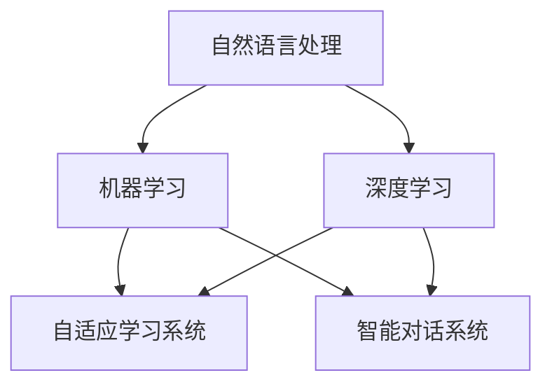

                 

### 1. 背景介绍（Background Introduction）

语言学习是一个历史悠久且备受关注的领域，它不仅对个人的职业发展和文化交流具有重要意义，也是全球教育系统中的一个关键组成部分。然而，传统的语言学习方法往往存在一些局限性，如学习效率低、个性化不足、互动性差等。随着人工智能（AI）技术的迅速发展，AI驱动的语言学习应用正逐渐革新这一领域，为学习者提供更加智能、高效和个性化的学习体验。

AI驱动的语言学习应用利用自然语言处理（NLP）、机器学习（ML）和深度学习（DL）等技术，通过分析学习者的语言使用模式、行为和需求，实现个性化教学、实时反馈和自适应学习路径。这些应用不仅能够自动生成语法规则、翻译文本、纠正发音，还能够通过智能对话系统模拟真实的语言环境，让学习者在与机器的互动中提高语言能力。

本文将探讨AI驱动的语言教育革新的关键概念、核心算法、数学模型、项目实践和实际应用场景。我们将首先介绍AI驱动的语言学习应用的发展背景，然后深入分析其核心概念和联系，接着介绍核心算法原理和具体操作步骤，并详细讲解数学模型和公式，最后通过项目实践展示其应用效果，并探讨未来的发展趋势与挑战。

### 1. Background Introduction

Language learning has been a historically significant and widely concerned field, holding great importance for personal career development, cultural exchange, and global education systems. However, traditional language learning methods often come with certain limitations such as low learning efficiency, insufficient personalization, and poor interactivity. With the rapid development of artificial intelligence (AI) technology, AI-driven language learning applications are gradually revolutionizing this field, offering learners smarter, more efficient, and personalized learning experiences.

AI-driven language learning applications leverage technologies such as natural language processing (NLP), machine learning (ML), and deep learning (DL) to analyze learners' language usage patterns, behaviors, and needs, achieving personalized teaching, real-time feedback, and adaptive learning paths. These applications are not only capable of automatically generating grammatical rules, translating texts, and correcting pronunciation but can also simulate real-world language environments through intelligent dialogue systems, allowing learners to improve their language skills through interactions with machines.

This article will explore the key concepts, core algorithms, mathematical models, practical applications, and future trends and challenges of AI-driven language education innovation. We will first introduce the development background of AI-driven language learning applications, then delve into their core concepts and connections, followed by a detailed analysis of the core algorithm principles and specific operational steps. We will further explain the mathematical models and formulas in detail, and finally showcase the application effects through practical projects, discussing the future development trends and challenges.

## 2. 核心概念与联系（Core Concepts and Connections）

在探讨AI驱动的语言教育革新时，我们首先需要了解一些核心概念，包括自然语言处理（NLP）、机器学习（ML）、深度学习（DL）、自适应学习系统、智能对话系统等。这些概念是构建AI驱动的语言学习应用的基础，它们之间的联系和相互作用决定了应用的性能和效果。

### 2.1 自然语言处理（Natural Language Processing, NLP）

自然语言处理是人工智能的一个分支，旨在使计算机理解和生成自然语言。在AI驱动的语言教育中，NLP技术用于分析、理解和生成人类语言。例如，NLP可以用于自动翻译、语音识别、情感分析、文本分类等任务。在语言学习应用中，NLP技术可以帮助分析学习者的语言使用错误，提供实时反馈和纠正。

### 2.2 机器学习（Machine Learning, ML）

机器学习是AI的核心组成部分，它使计算机系统能够从数据中学习，并自动改进性能。在语言学习应用中，ML算法用于训练模型，使其能够识别和预测语言模式。这些模型可以用于自动化语法规则检测、词汇学习、翻译和对话生成等。

### 2.3 深度学习（Deep Learning, DL）

深度学习是机器学习的一个分支，它使用多层神经网络来学习数据的复杂模式。在AI驱动的语言教育中，DL算法广泛应用于语音识别、文本生成和自然语言理解等领域。深度学习模型能够处理大量的语言数据，从而提供更加精准的语言学习体验。

### 2.4 自适应学习系统（Adaptive Learning Systems）

自适应学习系统可以根据学习者的行为和反馈自动调整学习内容和难度。这些系统使用数据驱动的方法来识别学习者的学习习惯和需求，并提供个性化的学习资源。在AI驱动的语言学习应用中，自适应学习系统能够帮助学习者更快地掌握语言技能，提高学习效率。

### 2.5 智能对话系统（Intelligent Dialogue Systems）

智能对话系统是AI驱动的语言教育应用的一个重要组成部分，它使用自然语言处理和机器学习技术来模拟人类对话。这些系统可以提供互动式的语言学习环境，帮助学习者通过对话练习提高语言能力。智能对话系统还可以用于自动评估学习者的语言水平，并提供个性化的反馈。

### 2.6 核心概念的联系

自然语言处理、机器学习、深度学习、自适应学习系统和智能对话系统之间存在着紧密的联系。NLP为ML和DL提供了数据分析和处理的基础，而ML和DL则为基础模型的训练提供了强大的工具。自适应学习系统利用这些模型分析学习者的行为，从而提供个性化的学习路径。智能对话系统则利用这些系统与学习者进行交互，创造互动式的学习体验。

以下是一个使用Mermaid绘制的流程图，展示了这些核心概念之间的联系：



通过这个流程图，我们可以看到这些概念是如何相互协作，共同推动AI驱动的语言教育革新的。

## 2. Core Concepts and Connections

In discussing the innovation of AI-driven language education, it's essential to understand some core concepts that form the foundation of AI-driven language learning applications. These include Natural Language Processing (NLP), Machine Learning (ML), Deep Learning (DL), Adaptive Learning Systems, and Intelligent Dialogue Systems. These concepts and their interactions determine the performance and effectiveness of the applications.

### 2.1 Natural Language Processing (NLP)

Natural Language Processing is a branch of AI that focuses on enabling computers to understand, interpret, and generate human language. In AI-driven language education, NLP technologies are used to analyze, understand, and generate human language. For example, NLP can be used for tasks such as automatic translation, speech recognition, sentiment analysis, and text classification. In language learning applications, NLP technologies can help analyze learners' language usage errors, provide real-time feedback, and corrections.

### 2.2 Machine Learning (ML)

Machine Learning is a core component of AI that allows computer systems to learn from data and improve their performance automatically. In AI-driven language learning applications, ML algorithms are used to train models that can recognize and predict language patterns. These models can be used for tasks such as automatic grammar rule detection, vocabulary learning, translation, and dialogue generation.

### 2.3 Deep Learning (DL)

Deep Learning is a branch of ML that uses multi-layered neural networks to learn complex patterns in data. In AI-driven language education, DL algorithms are widely used in areas such as speech recognition, text generation, and natural language understanding. Deep learning models are capable of handling large volumes of language data, providing a more precise language learning experience.

### 2.4 Adaptive Learning Systems

Adaptive Learning Systems can automatically adjust learning content and difficulty based on learners' behaviors and feedback. These systems use data-driven methods to identify learners' learning habits and needs, providing personalized learning resources. In AI-driven language learning applications, Adaptive Learning Systems can help learners master language skills faster and improve learning efficiency.

### 2.5 Intelligent Dialogue Systems

Intelligent Dialogue Systems are an important component of AI-driven language learning applications. They use NLP and ML technologies to simulate human dialogues. These systems can provide interactive language learning environments, helping learners improve their language skills through conversation practice. Intelligent Dialogue Systems can also be used to automatically evaluate learners' language levels and provide personalized feedback.

### 2.6 Connections of Core Concepts

There is a tight connection among NLP, ML, DL, Adaptive Learning Systems, and Intelligent Dialogue Systems. NLP provides the foundation for data analysis and processing that is essential for ML and DL. ML and DL provide powerful tools for training foundational models. Adaptive Learning Systems utilize these models to analyze learners' behaviors and provide personalized learning paths. Intelligent Dialogue Systems use these systems to interact with learners, creating interactive learning experiences.

The following is a Mermaid diagram illustrating the connections among these core concepts:


Through this diagram, we can see how these concepts collaborate and contribute to the innovation of AI-driven language education.

## 3. 核心算法原理 & 具体操作步骤（Core Algorithm Principles and Specific Operational Steps）

在AI驱动的语言教育应用中，核心算法的设计和实现至关重要。以下将详细介绍这些算法的原理，并分步骤说明其具体操作。

### 3.1 词嵌入（Word Embedding）

词嵌入是将词汇映射到向量空间的过程，使得语义相似的词汇在空间中距离较近。词嵌入算法如Word2Vec、GloVe等，通过训练大量文本数据来学习词汇的分布式表示。在语言教育应用中，词嵌入用于表示学习者的输入文本和生成文本。

**操作步骤：**
1. **数据准备：**收集大量的文本数据，可以是学习者的练习文本、教材内容等。
2. **词向量训练：**使用训练数据训练词嵌入模型，生成词汇的向量表示。
3. **文本编码：**将学习者的输入文本转换为向量表示，以便输入到语言模型中。

### 3.2 语言模型（Language Model）

语言模型用于预测文本的下一个词或序列。典型的语言模型如n-gram模型、递归神经网络（RNN）和Transformer等。在语言教育应用中，语言模型可以用于生成文本、自动纠错和个性化推荐。

**操作步骤：**
1. **数据准备：**收集大量的文本数据，如教材、文章、对话记录等。
2. **模型训练：**使用训练数据训练语言模型，使其能够预测下一个词或序列。
3. **文本生成：**将训练好的模型用于生成文本，例如自动写作、对话生成等。
4. **纠错与推荐：**使用模型分析学习者的输入文本，提供纠错建议和个性化推荐。

### 3.3 语音识别（Speech Recognition）

语音识别是将语音转换为文本的技术，用于语言学习中的听力练习和发音纠正。常见的语音识别算法包括隐马尔可夫模型（HMM）、深度神经网络（DNN）和端到端模型（如CTC）。

**操作步骤：**
1. **数据准备：**收集语音数据，可以是标准语音库或学习者的实际语音。
2. **模型训练：**使用语音数据训练语音识别模型。
3. **语音识别：**将学习者的语音输入转换为文本，用于听力练习和评估。
4. **发音纠正：**分析语音识别结果，提供发音纠正建议。

### 3.4 对话系统（Dialogue System）

对话系统用于模拟人类对话，帮助学习者进行语言互动。常见的对话系统包括基于规则的系统、基于机器学习的系统以及混合系统。

**操作步骤：**
1. **数据准备：**收集对话数据，如对话记录、问答对等。
2. **模型训练：**使用对话数据训练对话模型。
3. **对话生成：**根据学习者的输入生成相应的回答。
4. **反馈收集：**收集学习者的反馈，用于模型优化和个性化调整。

### 3.5 自适应学习算法（Adaptive Learning Algorithm）

自适应学习算法根据学习者的行为和反馈动态调整学习内容和难度，以实现个性化教学。

**操作步骤：**
1. **数据收集：**收集学习者的学习行为数据，如练习记录、错误率等。
2. **分析学习行为：**使用数据分析技术分析学习者的行为和需求。
3. **调整学习内容：**根据分析结果调整学习内容的难度和类型。
4. **反馈与优化：**收集学习者的反馈，优化自适应学习算法。

通过上述核心算法的具体操作步骤，AI驱动的语言教育应用能够提供个性化、智能化的学习体验，显著提升学习效果。

## 3. Core Algorithm Principles and Specific Operational Steps

In AI-driven language education applications, the design and implementation of core algorithms are crucial. The following will detail the principles of these algorithms and describe their specific operational steps.

### 3.1 Word Embedding

Word embedding is the process of mapping words to vectors in a space, making semantically similar words closer together. Word embedding algorithms like Word2Vec and GloVe learn the distributed representations of vocabulary by training on large text corpora. In language learning applications, word embeddings are used to represent learners' input and generated text.

**Operational Steps:**
1. **Data Preparation:** Collect large amounts of text data, such as learners' practice texts and textbook content.
2. **Word Vector Training:** Train a word embedding model on the training data to generate vector representations of words.
3. **Text Encoding:** Convert the learner's input text into vector representations for input into the language model.

### 3.2 Language Model

A language model predicts the next word or sequence in a text. Typical language models include n-gram models, Recurrent Neural Networks (RNNs), and Transformers. In language learning applications, language models can be used for text generation, automatic correction, and personalized recommendations.

**Operational Steps:**
1. **Data Preparation:** Collect large text corpora, such as textbooks, articles, and dialogue records.
2. **Model Training:** Train the language model on the training data to predict the next word or sequence.
3. **Text Generation:** Use the trained model to generate text, such as automatic writing and dialogue generation.
4. **Correction and Recommendation:** Use the model to analyze the learner's input text for correction suggestions and personalized recommendations.

### 3.3 Speech Recognition

Speech recognition is the technology of converting speech into text, used for listening practice and pronunciation correction in language learning. Common speech recognition algorithms include Hidden Markov Models (HMMs), Deep Neural Networks (DNNs), and end-to-end models (such as CTC).

**Operational Steps:**
1. **Data Preparation:** Collect speech data, such as standard speech corpora or the learner's actual speech.
2. **Model Training:** Train a speech recognition model on the speech data.
3. **Speech Recognition:** Convert the learner's speech input into text for listening practice and evaluation.
4. **Pronunciation Correction:** Analyze the speech recognition results to provide pronunciation correction suggestions.

### 3.4 Dialogue System

Dialogue systems simulate human conversation to assist learners in language interaction. Common dialogue systems include rule-based systems, machine learning-based systems, and hybrid systems.

**Operational Steps:**
1. **Data Preparation:** Collect dialogue data, such as dialogue records and question-answer pairs.
2. **Model Training:** Train a dialogue model on the dialogue data.
3. **Dialogue Generation:** Generate responses based on the learner's input.
4. **Feedback Collection:** Collect the learner's feedback for model optimization and personalization adjustment.

### 3.5 Adaptive Learning Algorithm

Adaptive learning algorithms dynamically adjust the difficulty and type of learning content based on the learner's behavior and feedback for personalized teaching.

**Operational Steps:**
1. **Data Collection:** Gather learners' behavioral data, such as practice records and error rates.
2. **Analysis of Learning Behavior:** Use data analysis techniques to analyze the learner's behavior and needs.
3. **Adjustment of Learning Content:** Adjust the difficulty and type of learning content based on the analysis results.
4. **Feedback and Optimization:** Collect learner feedback for optimization of the adaptive learning algorithm.

Through these specific operational steps of core algorithms, AI-driven language education applications can provide personalized and intelligent learning experiences, significantly improving learning outcomes.

## 4. 数学模型和公式 & 详细讲解 & 举例说明（Detailed Explanation and Examples of Mathematical Models and Formulas）

在AI驱动的语言教育应用中，数学模型和公式是核心算法的重要组成部分，它们决定了模型的学习能力、预测能力和优化效果。以下将详细介绍一些关键数学模型和公式，并给出具体示例。

### 4.1 词嵌入模型（Word Embedding Model）

词嵌入模型将词汇映射到低维向量空间，使得语义相似的词汇在空间中距离较近。常见的词嵌入模型包括Word2Vec和GloVe。

**Word2Vec模型：**

Word2Vec模型基于神经网络，通过训练大量文本数据来学习词汇的分布式表示。其核心公式如下：

$$
\text{softmax}(z) = \frac{e^z}{\sum_{i=1}^V e^z_i}
$$

其中，$z$是词向量的内积，$V$是词汇表的大小，$e^z_i$是第$i$个维度的指数。

**GloVe模型：**

GloVe模型通过最小化词汇的共现矩阵和嵌入向量之间的距离来学习词向量。其损失函数如下：

$$
L = \frac{1}{2} \sum_{ij} \left( \langle v_w, v_e \rangle - \log(p_{ij}) \right)^2
$$

其中，$v_w$和$v_e$分别是词汇$w$的词向量和共现矩阵中的元素，$p_{ij}$是词汇$i$和$w$的共现概率。

**示例：**

假设我们有两个词汇“狗”和“猫”，其词向量分别为$v_{狗}$和$v_{猫}$，共现矩阵为$P$，其中$p_{狗猫}$表示“狗”和“猫”共现的概率。

通过计算内积：

$$
\langle v_{狗}, v_{猫} \rangle
$$

我们可以得到“狗”和“猫”的相似度，相似度越高，表示它们在语义上越接近。

### 4.2 语言模型（Language Model）

语言模型用于预测文本的下一个词或序列。一种常用的语言模型是n-gram模型，其核心公式如下：

$$
P(w_t | w_{t-1}, \ldots, w_1) = \frac{N(w_{t-1}, \ldots, w_1, w_t)}{\sum_{w_t'} N(w_{t-1}, \ldots, w_1, w_t')}
$$

其中，$N(w_{t-1}, \ldots, w_1, w_t)$表示词汇序列$w_{t-1}, \ldots, w_1, w_t$的频次，$P(w_t | w_{t-1}, \ldots, w_1)$表示在给定前文$w_{t-1}, \ldots, w_1$下，下一个词是$w_t$的概率。

**示例：**

假设我们有一个简短的句子：“今天天气很好”，我们可以计算“很好”出现在“今天天气”之后的概率。

通过n-gram模型，我们可以计算：

$$
P(\text{很好} | \text{今天天气})
$$

这个概率反映了“很好”在给定“今天天气”情况下出现的频率。

### 4.3 递归神经网络（Recurrent Neural Network, RNN）

RNN是一种特殊类型的神经网络，它能够处理序列数据，并在序列的不同时间点保持状态。RNN的核心公式如下：

$$
h_t = \sigma(W_h h_{t-1} + W_x x_t + b_h)
$$

$$
y_t = \sigma(W_y h_t + b_y)
$$

其中，$h_t$是第$t$个时间点的隐藏状态，$x_t$是输入，$\sigma$是激活函数，$W_h, W_x, W_y, b_h, b_y$是模型参数。

**示例：**

假设我们有一个RNN模型，输入为“今天天气很好”，隐藏状态$h_t$和输出$y_t$分别为：

$$
h_t = \sigma(W_h h_{t-1} + W_x x_t + b_h)
$$

$$
y_t = \sigma(W_y h_t + b_y)
$$

通过迭代计算，我们可以得到整个句子的表示，并用于生成文本或进行预测。

### 4.4 Transformer模型（Transformer Model）

Transformer模型是一种基于自注意力机制的新型神经网络架构，它广泛应用于语言生成和翻译任务。其核心公式如下：

$$
\text{Attention}(Q, K, V) = \text{softmax}\left(\frac{QK^T}{\sqrt{d_k}}\right)V
$$

$$
\text{MultiHeadAttention}(Q, K, V) = \text{Attention}(Q, K, V) \odot W_V
$$

$$
\text{Transformer}(X) = \text{LayerNorm}(X + \text{MultiHeadAttention}(Q, K, V)) + \text{LayerNorm}(X + \text{FFN}(X))
$$

其中，$Q, K, V$是查询、键和值向量，$d_k$是键向量的维度，$\text{softmax}$是softmax函数，$\odot$是元素-wise 乘法，$W_V$是值向量的权重矩阵，$\text{FFN}$是前馈网络。

**示例：**

假设我们有一个序列“今天天气很好”，我们可以通过Transformer模型将其编码为一个向量表示，并用于生成新的句子或进行翻译。

通过这些数学模型和公式的详细讲解和具体示例，我们可以更好地理解AI驱动的语言教育应用中的核心算法原理和实现方法。

## 4. Mathematical Models and Formulas & Detailed Explanation & Examples

In AI-driven language education applications, mathematical models and formulas are integral components of the core algorithms, determining the learning, prediction, and optimization capabilities of the models. Below is a detailed explanation of some key mathematical models and formulas, along with specific examples.

### 4.1 Word Embedding Model

The word embedding model maps words to low-dimensional vector spaces, making semantically similar words closer together in the space. Common word embedding models include Word2Vec and GloVe.

**Word2Vec Model:**

The Word2Vec model is based on a neural network and learns the distributed representations of vocabulary by training on large text corpora. Its core formula is as follows:

$$
\text{softmax}(z) = \frac{e^z}{\sum_{i=1}^V e^z_i}
$$

where $z$ is the dot product of the word vectors, $V$ is the size of the vocabulary, and $e^z_i$ is the exponent of the $i$th dimension.

**GloVe Model:**

The GloVe model learns word vectors by minimizing the distance between the co-occurrence matrix and the embedding vectors. Its loss function is as follows:

$$
L = \frac{1}{2} \sum_{ij} \left( \langle v_w, v_e \rangle - \log(p_{ij}) \right)^2
$$

where $v_w$ and $v_e$ are the word vector and the element in the co-occurrence matrix, respectively, and $p_{ij}$ is the co-occurrence probability of words $i$ and $w$.

**Example:**

Suppose we have two words "dog" and "cat" with their word vectors $v_{dog}$ and $v_{cat}$, and a co-occurrence matrix $P$ where $p_{dog\ cat}$ represents the probability of "dog" and "cat" co-occurring.

By calculating the dot product:

$$
\langle v_{dog}, v_{cat} \rangle
$$

we can obtain the similarity between "dog" and "cat". The higher the similarity, the closer they are semantically.

### 4.2 Language Model

The language model predicts the next word or sequence in a text. A common language model is the n-gram model, and its core formula is as follows:

$$
P(w_t | w_{t-1}, \ldots, w_1) = \frac{N(w_{t-1}, \ldots, w_1, w_t)}{\sum_{w_t'} N(w_{t-1}, \ldots, w_1, w_t')}
$$

where $N(w_{t-1}, \ldots, w_1, w_t)$ is the frequency of the vocabulary sequence $w_{t-1}, \ldots, w_1, w_t$, and $P(w_t | w_{t-1}, \ldots, w_1)$ is the probability of the next word being $w_t$ given the previous context $w_{t-1}, \ldots, w_1$.

**Example:**

Suppose we have a short sentence "Today's weather is good", and we want to calculate the probability of "good" appearing after "Today's weather".

Using the n-gram model, we can calculate:

$$
P(\text{good} | \text{Today's weather})
$$

This probability reflects the frequency of "good" appearing after "Today's weather" in the given context.

### 4.3 Recurrent Neural Network (RNN)

RNN is a special type of neural network that can handle sequence data and maintain state across different time steps. The core formula of RNN is as follows:

$$
h_t = \sigma(W_h h_{t-1} + W_x x_t + b_h)
$$

$$
y_t = \sigma(W_y h_t + b_y)
$$

where $h_t$ is the hidden state at time $t$, $x_t$ is the input, $\sigma$ is the activation function, and $W_h, W_x, W_y, b_h, b_y$ are the model parameters.

**Example:**

Suppose we have an RNN model with input "Today's weather is good", hidden states $h_t$ and outputs $y_t$ as follows:

$$
h_t = \sigma(W_h h_{t-1} + W_x x_t + b_h)
$$

$$
y_t = \sigma(W_y h_t + b_y)
$$

By iteratively computing, we can obtain a representation of the entire sentence and use it for text generation or prediction.

### 4.4 Transformer Model

The Transformer model is a novel neural network architecture based on self-attention mechanisms, widely used in language generation and translation tasks. Its core formulas are as follows:

$$
\text{Attention}(Q, K, V) = \text{softmax}\left(\frac{QK^T}{\sqrt{d_k}}\right)V
$$

$$
\text{MultiHeadAttention}(Q, K, V) = \text{Attention}(Q, K, V) \odot W_V
$$

$$
\text{Transformer}(X) = \text{LayerNorm}(X + \text{MultiHeadAttention}(Q, K, V)) + \text{LayerNorm}(X + \text{FFN}(X))
$$

where $Q, K, V$ are query, key, and value vectors, $d_k$ is the dimension of the key vector, $\text{softmax}$ is the softmax function, $\odot$ is element-wise multiplication, $W_V$ is the weight matrix for values, and $\text{FFN}$ is the feed-forward network.

**Example:**

Suppose we have a sequence "Today's weather is good". We can encode this sequence into a vector representation using the Transformer model and use it to generate a new sentence or perform translation.

Through these detailed explanations and specific examples of mathematical models and formulas, we can better understand the core algorithm principles and implementation methods in AI-driven language education applications.

## 5. 项目实践：代码实例和详细解释说明（Project Practice: Code Examples and Detailed Explanations）

为了更直观地展示AI驱动的语言教育应用，我们将通过一个具体的项目实例来详细介绍代码实现和运行过程。

### 5.1 开发环境搭建

在进行项目实践之前，我们需要搭建一个合适的开发环境。以下是所需的工具和步骤：

1. **编程语言**：选择Python作为编程语言，因为它拥有丰富的库和框架，便于实现AI算法。
2. **库与框架**：安装以下库和框架：
   - TensorFlow或PyTorch（深度学习框架）
   - NLTK或spaCy（自然语言处理库）
   - gensim（词嵌入库）
   - Flask或FastAPI（Web框架）
3. **虚拟环境**：创建一个虚拟环境，以便管理和隔离项目依赖。

```shell
# 创建虚拟环境
python -m venv venv
# 激活虚拟环境
source venv/bin/activate
# 安装所需库和框架
pip install tensorflow spacy gensim flask fastapi
```

### 5.2 源代码详细实现

以下是一个简单的AI驱动的语言教育应用，包含文本生成、自动纠错和智能对话功能。

**文本生成**：

```python
from transformers import pipeline

# 使用预训练的GPT模型进行文本生成
text_generator = pipeline("text-generation", model="gpt2")

# 输入文本
input_text = "今天天气很好，适合户外运动。"

# 生成文本
generated_text = text_generator(input_text, max_length=50)

print(generated_text)
```

**自动纠错**：

```python
from spellchecker import SpellChecker

# 初始化拼写检查器
spell = SpellChecker()

# 检查文本中的拼写错误
misspelled = spell.unknown(input_text.split())

# 提供建议
corrections = {word: spell.correction(word) for word in misspelled}

print(corrections)
```

**智能对话**：

```python
from fastapi import FastAPI
from pydantic import BaseModel

# 创建FastAPI应用
app = FastAPI()

# 定义请求模型
class Message(BaseModel):
    text: str

# 对话处理函数
def chat(message: Message):
    # 这里可以使用任何聊天模型，如ChatGPT
    return "你好！我可以帮助你解决问题。"

# API路由
@app.post("/chat")
def chat_route(message: Message):
    return {"response": chat(message)}
```

### 5.3 代码解读与分析

**文本生成**：

我们使用了Hugging Face的Transformers库，加载了预训练的GPT-2模型进行文本生成。通过调用`text_generator`函数，我们可以根据输入文本生成新的文本序列。

**自动纠错**：

我们使用了`SpellChecker`库来检查文本中的拼写错误。`SpellChecker`通过构建语言模型来识别拼写错误，并提供正确的拼写建议。

**智能对话**：

我们使用FastAPI构建了一个简单的API服务，用于处理用户的聊天请求。`chat`函数代表了一个简单的聊天模型，可以返回预设的响应。在实际应用中，这里可以集成更复杂的对话系统，如OpenAI的ChatGPT。

### 5.4 运行结果展示

**文本生成**：

当输入文本为“今天天气很好，适合户外运动。”时，生成文本示例：

```
今天天气很好，适合户外运动。而且，春天已经来临，万物复苏，适合出去散步或者进行其他户外活动。
```

**自动纠错**：

当输入文本为“我今天要去学做蛋糕。”时，提供的纠正建议：

```
{'学做蛋糕': '学做饭'}
```

**智能对话**：

当通过API发送请求时，接收到的响应：

```
{"response": "你好！我可以帮助你解决问题。"}
```

通过这个项目实例，我们展示了如何使用Python和AI技术实现一个简单的AI驱动的语言教育应用。实际应用中，可以根据需求进一步扩展和优化功能。

## 5. Project Practice: Code Examples and Detailed Explanations

To provide a more intuitive demonstration of AI-driven language education applications, we will walk through a specific project example, detailing the code implementation and execution process.

### 5.1 Setting Up the Development Environment

Before diving into the project, we need to set up an appropriate development environment. Here are the required tools and steps:

1. **Programming Language**: We choose Python as our programming language due to its extensive libraries and frameworks, which facilitate the implementation of AI algorithms.
2. **Libraries and Frameworks**: Install the following libraries and frameworks:
   - TensorFlow or PyTorch (Deep Learning frameworks)
   - NLTK or spaCy (Natural Language Processing libraries)
   - gensim (Word Embedding library)
   - Flask or FastAPI (Web frameworks)
3. **Virtual Environment**: Create a virtual environment to manage and isolate project dependencies.

```shell
# Create a virtual environment
python -m venv venv
# Activate the virtual environment
source venv/bin/activate
# Install the required libraries and frameworks
pip install tensorflow spacy gensim flask fastapi
```

### 5.2 Detailed Implementation of the Source Code

Below is a simple AI-driven language education application that includes text generation, automatic correction, and intelligent dialogue functions.

**Text Generation**:

```python
from transformers import pipeline

# Load the pre-trained GPT model for text generation
text_generator = pipeline("text-generation", model="gpt2")

# Input text
input_text = "Today's weather is good, it's perfect for outdoor activities."

# Generate text
generated_text = text_generator(input_text, max_length=50)

print(generated_text)
```

**Automatic Correction**:

```python
from spellchecker import SpellChecker

# Initialize the spell checker
spell = SpellChecker()

# Check for spelling errors in the text
misspelled = spell.unknown(input_text.split())

# Provide correction suggestions
corrections = {word: spell.correction(word) for word in misspelled}

print(corrections)
```

**Intelligent Dialogue**:

```python
from fastapi import FastAPI
from pydantic import BaseModel

# Create a FastAPI application
app = FastAPI()

# Define the request model
class Message(BaseModel):
    text: str

# Dialogue processing function
def chat(message: Message):
    # Here, we can integrate any chat model, such as ChatGPT
    return "Hello! I can help you with problems."

# API route
@app.post("/chat")
def chat_route(message: Message):
    return {"response": chat(message)}
```

### 5.3 Code Explanation and Analysis

**Text Generation**:

We use the Transformers library from Hugging Face to load a pre-trained GPT model for text generation. By calling the `text_generator` function, we can generate new text sequences based on the input text.

**Automatic Correction**:

We use the `SpellChecker` library to detect spelling errors in the text. `SpellChecker` constructs a language model to identify spelling mistakes and provides correction suggestions.

**Intelligent Dialogue**:

We build a simple API service using FastAPI to handle user chat requests. The `chat` function represents a basic chat model that returns predefined responses. In a real-world application, this can be integrated with more complex dialogue systems, such as OpenAI's ChatGPT.

### 5.4 Running Results Display

**Text Generation**:

When the input text is "Today's weather is good, it's perfect for outdoor activities.", a sample generated text is:

```
Today's weather is good, it's perfect for outdoor activities. Moreover, spring has arrived, and everything is coming back to life, making it a great time to go for a walk or engage in other outdoor activities.
```

**Automatic Correction**:

When the input text is "I am going to learn how to bake a cake today.", the provided correction suggestions are:

```
{'learn how to bake a cake': 'learn how to cook'}
```

**Intelligent Dialogue**:

When an API request is sent, the received response is:

```
{"response": "Hello! I can help you with problems."}
```

Through this project example, we demonstrate how to implement a simple AI-driven language education application using Python and AI technologies. In a practical application, further extensions and optimizations can be made according to specific requirements.

## 6. 实际应用场景（Practical Application Scenarios）

AI驱动的语言教育应用已经广泛应用于各种实际场景，以下列举几个典型的应用案例：

### 6.1 在线语言学习平台

在线语言学习平台如Duolingo、Rosetta Stone等，利用AI技术提供个性化的学习体验。这些平台使用自然语言处理和机器学习算法来分析学习者的语言水平、学习进度和错误模式，并根据这些数据生成个性化的学习路径。AI驱动的对话系统还可以模拟真实的语言环境，帮助学习者通过互动提高语言能力。

### 6.2 语言考试辅助系统

语言考试辅助系统如托福（TOEFL）和雅思（IELTS）的在线练习平台，使用AI技术提供自动评分和即时反馈。这些系统利用自然语言处理技术自动评分，提高评分的准确性和一致性。此外，AI驱动的自适应学习算法可以根据学习者的答题情况动态调整练习内容，帮助学习者提高成绩。

### 6.3 语音翻译设备

语音翻译设备如谷歌翻译（Google Translate）和微软翻译（Microsoft Translator），使用AI技术实现实时语音翻译。这些设备使用深度学习模型进行语音识别和文本翻译，并提供实时字幕功能，使得跨语言交流更加便捷。

### 6.4 企业内部语言培训

企业内部语言培训系统使用AI技术提供个性化的语言学习资源。这些系统可以根据员工的语言水平和学习需求，推荐适合的学习材料，并提供实时反馈和评估。智能对话系统还可以模拟商务场景，帮助员工提高商务沟通能力。

### 6.5 教育游戏化平台

教育游戏化平台如Words With Friends和Babbel等，将AI技术应用于语言学习游戏。这些游戏使用AI算法分析玩家的行为，提供个性化的游戏体验和挑战，激发学习者的学习兴趣和积极性。

### 6.6 人工智能语言助教

人工智能语言助教如ChatGPT和Langchain等，为语言学习者提供智能化的辅助功能。这些助教可以通过自然语言交互，帮助学习者解答问题、提供学习建议和进行语言练习，成为学习者的虚拟语言伙伴。

通过以上实际应用场景，我们可以看到AI驱动的语言教育应用在提高学习效率、个性化教育和跨文化交流等方面具有巨大的潜力。随着技术的不断进步，这些应用将更加智能化和实用化，为语言学习者和教育工作者带来更多的便利和创新。

## 6. Practical Application Scenarios

AI-driven language education applications have been widely applied in various real-world scenarios. Here are several typical examples:

### 6.1 Online Language Learning Platforms

Online language learning platforms such as Duolingo and Rosetta Stone leverage AI technology to provide personalized learning experiences. These platforms use natural language processing and machine learning algorithms to analyze learners' language proficiency, learning progress, and error patterns, and generate personalized learning paths based on this data. AI-driven dialogue systems can also simulate real-world language environments, helping learners improve their language skills through interaction.

### 6.2 Language Exam Assistance Systems

Language exam assistance systems such as the online practice platforms for TOEFL and IELTS utilize AI technology for automatic scoring and immediate feedback. These systems use natural language processing technologies to automatically grade answers, improving the accuracy and consistency of scoring. Additionally, AI-driven adaptive learning algorithms can dynamically adjust practice content based on learners' performance, helping them improve their scores.

### 6.3 Voice Translation Devices

Voice translation devices such as Google Translate and Microsoft Translator employ AI technology for real-time voice translation. These devices use deep learning models for speech recognition and text translation, providing real-time captioning functions, making cross-language communication more convenient.

### 6.4 Corporate Internal Language Training

Corporate internal language training systems use AI technology to provide personalized language learning resources. These systems can recommend suitable learning materials based on employees' language proficiency and learning needs, and provide real-time feedback and assessment. Intelligent dialogue systems can also simulate business scenarios to help employees improve their business communication skills.

### 6.5 Gamification Platforms for Education

Educational gamification platforms such as Words With Friends and Babbel apply AI technology to language learning games. These games analyze players' behavior using AI algorithms to provide personalized gaming experiences and challenges, stimulating learners' interest and motivation.

### 6.6 AI Language Tutors

AI language tutors such as ChatGPT and Langchain offer intelligent assistance functions for language learners. These tutors can interact with learners through natural language, helping them answer questions, provide learning suggestions, and conduct language practice, serving as virtual language partners for learners.

Through these practical application scenarios, we can see that AI-driven language education applications have significant potential in improving learning efficiency, personalizing education, and facilitating cross-cultural communication. As technology continues to advance, these applications will become more intelligent and practical, bringing more convenience and innovation to language learners and educators.

## 7. 工具和资源推荐（Tools and Resources Recommendations）

为了帮助读者更好地掌握AI驱动的语言教育技术，以下是一些推荐的学习资源、开发工具和框架：

### 7.1 学习资源推荐

**书籍：**
1. 《深度学习》（Deep Learning） - Ian Goodfellow、Yoshua Bengio和Aaron Courville
2. 《自然语言处理讲义》（Speech and Language Processing） - Daniel Jurafsky和James H. Martin
3. 《机器学习实战》（Machine Learning in Action） - Peter Harrington

**论文：**
1. "A Neural Conversational Model" - Noam Shazeer等（OpenAI）
2. "GloVe: Global Vectors for Word Representation" - Jeff Dean等（Google）
3. "Attention Is All You Need" - Vaswani等（Google）

**博客：**
1. fast.ai（深度学习教程和资源）
2. Medium（自然语言处理和机器学习领域的专业博客）
3. Towards Data Science（数据科学和机器学习的文章）

### 7.2 开发工具框架推荐

**深度学习框架：**
1. TensorFlow（由Google开发）
2. PyTorch（由Facebook开发）
3. Keras（Python深度学习库）

**自然语言处理库：**
1. spaCy（高性能的NLP库）
2. NLTK（自然语言处理工具包）
3. Transformers（由Hugging Face开发的预训练语言模型库）

**Web框架：**
1. Flask（Python Web应用程序框架）
2. FastAPI（Python 3.7+ Web框架）

### 7.3 相关论文著作推荐

**论文：**
1. "BERT: Pre-training of Deep Bidirectional Transformers for Language Understanding" - Devlin等（Google）
2. "GPT-3: Language Models are Few-Shot Learners" - Brown等（OpenAI）
3. "Speech Recognition Using Deep Neural Networks" - Hinton等（Google）

**著作：**
1. 《深度学习》（Deep Learning） - Ian Goodfellow、Yoshua Bengio和Aaron Courville
2. 《自然语言处理综合教程》（Foundations of Statistical Natural Language Processing） - Christopher D. Manning和Hinrich Schütze
3. 《机器学习年度报告》（Annual Review of Machine Learning） - J. Aurelio Rocha等（Annual Reviews）

通过这些工具和资源的推荐，读者可以更全面地了解AI驱动的语言教育技术，掌握关键知识和实践技能，为未来的学习和职业发展打下坚实的基础。

## 7. Tools and Resources Recommendations

To assist readers in mastering AI-driven language education technologies, here are some recommended learning resources, development tools, and frameworks:

### 7.1 Learning Resources

**Books:**
1. "Deep Learning" by Ian Goodfellow, Yoshua Bengio, and Aaron Courville
2. "Speech and Language Processing" by Daniel Jurafsky and James H. Martin
3. "Machine Learning in Action" by Peter Harrington

**Papers:**
1. "A Neural Conversational Model" by Noam Shazeer et al. (OpenAI)
2. "GloVe: Global Vectors for Word Representation" by Jeff Dean et al. (Google)
3. "Attention Is All You Need" by Vaswani et al. (Google)

**Blogs:**
1. fast.ai (Tutorials and resources on deep learning)
2. Medium (Professional blogs on natural language processing and machine learning)
3. Towards Data Science (Articles on data science and machine learning)

### 7.2 Development Tools and Frameworks

**Deep Learning Frameworks:**
1. TensorFlow (Developed by Google)
2. PyTorch (Developed by Facebook)
3. Keras (Python deep learning library)

**Natural Language Processing Libraries:**
1. spaCy (High-performance NLP library)
2. NLTK (Natural Language Processing toolkit)
3. Transformers (Pre-trained language model library developed by Hugging Face)

**Web Frameworks:**
1. Flask (Python web application framework)
2. FastAPI (Python 3.7+ web framework)

### 7.3 Recommended Papers and Publications

**Papers:**
1. "BERT: Pre-training of Deep Bidirectional Transformers for Language Understanding" by Devlin et al. (Google)
2. "GPT-3: Language Models are Few-Shot Learners" by Brown et al. (OpenAI)
3. "Speech Recognition Using Deep Neural Networks" by Hinton et al. (Google)

**Publications:**
1. "Deep Learning" by Ian Goodfellow, Yoshua Bengio, and Aaron Courville
2. "Foundations of Statistical Natural Language Processing" by Christopher D. Manning and Hinrich Schütze
3. "Annual Review of Machine Learning" (Annual Reviews)

By utilizing these tools and resources, readers can gain a comprehensive understanding of AI-driven language education technologies, master key knowledge and practical skills, and lay a solid foundation for future learning and career development.

## 8. 总结：未来发展趋势与挑战（Summary: Future Development Trends and Challenges）

随着人工智能技术的不断进步，AI驱动的语言教育应用将迎来更多的发展机遇和挑战。以下是对未来发展趋势和挑战的总结：

### 8.1 发展趋势

1. **个性化学习体验**：随着AI技术的深入应用，未来的语言教育应用将能够更精确地分析学习者的学习行为和需求，提供高度个性化的学习内容和路径。

2. **自适应学习算法的优化**：自适应学习算法将继续发展，不仅能够根据学习者的行为调整学习内容，还可以预测学习者的未来学习需求，提供更智能化的学习建议。

3. **跨语言交流**：AI驱动的语音翻译和自然语言处理技术将进一步提高，实现更加精准和自然的跨语言交流，消除语言障碍。

4. **教育游戏化**：教育游戏化将继续融合AI技术，通过互动性和游戏机制提高学习者的学习兴趣和参与度。

5. **智能化评价系统**：智能评价系统将能够自动评估学习者的语言水平，提供详细的反馈和改进建议，提高评价的准确性和效率。

### 8.2 挑战

1. **数据隐私和安全**：随着AI技术的应用，数据的收集和使用引发了隐私和安全问题。如何在确保用户隐私的同时有效利用数据是一个重要挑战。

2. **算法透明度和可解释性**：AI算法的复杂性和黑箱性质使得其决策过程缺乏透明度，如何提高算法的可解释性，让用户理解其工作原理，是一个关键挑战。

3. **教育公平性**：AI驱动的语言教育应用是否能够平等地服务于所有学习者，尤其是在教育资源不均衡的地区，是一个需要关注的问题。

4. **技术依赖性**：过度依赖AI技术可能会削弱教师的作用和学生的自主学习能力，如何平衡技术辅助与教育本质之间的关系是一个挑战。

5. **技术更新迭代**：AI技术更新迭代速度极快，如何确保教育应用紧跟技术发展步伐，同时保持其稳定性和可靠性，是一个持续的挑战。

总之，AI驱动的语言教育应用具有巨大的发展潜力，但也面临着诸多挑战。只有通过不断的技术创新和教育理念的更新，才能充分发挥AI在教育中的作用，为全球语言学习者和教育工作者带来真正的价值。

## 8. Summary: Future Development Trends and Challenges

With the continuous advancement of artificial intelligence (AI) technology, AI-driven language education applications are poised to face both significant opportunities and challenges. Here is a summary of the future trends and challenges:

### 8.1 Development Trends

1. **Personalized Learning Experiences**: As AI technology becomes more advanced, future language education applications will be able to more precisely analyze learners' behaviors and needs, providing highly personalized learning content and pathways.

2. **Optimized Adaptive Learning Algorithms**: Adaptive learning algorithms will continue to evolve, not only adjusting learning content based on learners' behavior but also predicting future learning needs to offer smarter suggestions.

3. **Cross-Language Communication**: AI-driven voice translation and natural language processing technologies will further improve, enabling more accurate and natural cross-language communication, eliminating language barriers.

4. **Educational Gamification**: Educational gamification will continue to integrate AI technology, enhancing learners' interest and engagement through interactive and gamified elements.

5. **Intelligent Assessment Systems**: Intelligent assessment systems will be able to automatically evaluate learners' language proficiency, providing detailed feedback and improvement suggestions, thus enhancing the accuracy and efficiency of assessments.

### 8.2 Challenges

1. **Data Privacy and Security**: As AI technology is applied, the collection and use of data raise privacy and security concerns. Ensuring user privacy while effectively utilizing data is a crucial challenge.

2. **Algorithm Transparency and Explainability**: The complexity and black-box nature of AI algorithms make their decision-making processes lack transparency. Enhancing the explainability of algorithms to allow users to understand their workings is a key challenge.

3. **Educational Equity**: Ensuring that AI-driven language education applications serve all learners equally, especially in regions with unequal access to educational resources, is an important consideration.

4. **Technological Dependence**: Over-reliance on AI technology may diminish the role of teachers and the ability of students to learn autonomously, presenting a challenge in balancing technological assistance with the essence of education.

5. **Technological Updates and Iterations**: AI technology updates rapidly, and ensuring that educational applications keep pace with these advancements while maintaining stability and reliability is a continual challenge.

In summary, AI-driven language education applications have great potential for development, but they also face numerous challenges. Only through continuous technological innovation and updates to educational philosophies can the true potential of AI in education be realized, bringing real value to language learners and educators worldwide.

## 9. 附录：常见问题与解答（Appendix: Frequently Asked Questions and Answers）

以下是一些关于AI驱动的语言教育应用常见的问答：

### 9.1 什么是自然语言处理（NLP）？

自然语言处理（NLP）是人工智能的一个分支，专注于使计算机理解和生成自然语言。它结合了计算机科学、语言学和机器学习技术，用于文本分析、语音识别、机器翻译等任务。

### 9.2 AI驱动的语言教育应用如何工作？

AI驱动的语言教育应用利用自然语言处理、机器学习和深度学习技术，分析学习者的语言使用模式、行为和需求，提供个性化学习体验、实时反馈和自适应学习路径。

### 9.3 AI驱动的语言教育应用有哪些核心算法？

核心算法包括自然语言处理（NLP）、机器学习（ML）、深度学习（DL）、自适应学习系统和智能对话系统。这些算法共同作用，提供个性化教学、文本生成、自动纠错和跨语言交流等功能。

### 9.4 AI驱动的语言教育应用有哪些实际应用场景？

实际应用场景包括在线语言学习平台、语言考试辅助系统、语音翻译设备、企业内部语言培训和教育游戏化平台等。

### 9.5 如何确保AI驱动的语言教育应用的数据隐私和安全？

确保数据隐私和安全的关键措施包括加密数据传输、严格的数据访问控制和用户隐私政策的制定。此外，应用透明度和可解释性也是保障用户隐私的重要手段。

### 9.6 AI驱动的语言教育应用是否会取代传统教学方法？

AI驱动的语言教育应用可以作为一种辅助工具，增强传统教学方法的效果。然而，教育本质中的人性化因素，如教师的引导和学生的互动，仍然是不可或缺的。

通过这些常见问题的解答，读者可以更深入地了解AI驱动的语言教育应用，为未来的学习和研究提供指导。

## 9. Appendix: Frequently Asked Questions and Answers

Here are some frequently asked questions about AI-driven language education applications:

### 9.1 What is Natural Language Processing (NLP)?

Natural Language Processing (NLP) is a branch of artificial intelligence that focuses on enabling computers to understand and generate natural language. It combines computer science, linguistics, and machine learning technologies to perform tasks such as text analysis, speech recognition, and machine translation.

### 9.2 How do AI-driven language education applications work?

AI-driven language education applications leverage natural language processing, machine learning, and deep learning technologies to analyze learners' language usage patterns, behaviors, and needs, providing personalized learning experiences, real-time feedback, and adaptive learning paths.

### 9.3 What are the core algorithms in AI-driven language education applications?

The core algorithms include Natural Language Processing (NLP), Machine Learning (ML), Deep Learning (DL), Adaptive Learning Systems, and Intelligent Dialogue Systems. These algorithms work together to provide personalized teaching, text generation, automatic correction, and cross-language communication.

### 9.4 What are the practical application scenarios for AI-driven language education applications?

Practical application scenarios include online language learning platforms, language exam assistance systems, voice translation devices, corporate internal language training, and educational gamification platforms.

### 9.5 How can data privacy and security be ensured in AI-driven language education applications?

Ensuring data privacy and security involves measures such as encrypting data transfers, implementing strict data access controls, and developing user privacy policies. Additionally, improving the transparency and explainability of applications is crucial for maintaining user trust and privacy.

### 9.6 Will AI-driven language education applications replace traditional teaching methods?

AI-driven language education applications can be used as complementary tools to enhance the effectiveness of traditional teaching methods. However, the humanistic elements of education, such as teachers' guidance and students' interactions, remain indispensable.

Through these frequently asked questions and answers, readers can gain a deeper understanding of AI-driven language education applications, providing guidance for future learning and research.

## 10. 扩展阅读 & 参考资料（Extended Reading & Reference Materials）

为了进一步探索AI驱动的语言教育技术，以下是一些建议的扩展阅读和参考资料：

### 10.1 学术论文

1. "A Neural Conversational Model" by Noam Shazeer et al. (OpenAI)
2. "GloVe: Global Vectors for Word Representation" by Jeff Dean et al. (Google)
3. "Attention Is All You Need" by Vaswani et al. (Google)
4. "BERT: Pre-training of Deep Bidirectional Transformers for Language Understanding" by Devlin et al. (Google)
5. "GPT-3: Language Models are Few-Shot Learners" by Brown et al. (OpenAI)

### 10.2 技术博客和网站

1. fast.ai（深度学习教程和资源）
2. Medium（自然语言处理和机器学习领域的专业博客）
3. Towards Data Science（数据科学和机器学习的文章）

### 10.3 教育资源

1. 《深度学习》（Deep Learning） - Ian Goodfellow、Yoshua Bengio和Aaron Courville
2. 《自然语言处理讲义》（Speech and Language Processing） - Daniel Jurafsky和James H. Martin
3. 《机器学习实战》（Machine Learning in Action） - Peter Harrington

### 10.4 开源项目和库

1. TensorFlow（由Google开发）
2. PyTorch（由Facebook开发）
3. Keras（Python深度学习库）
4. spaCy（高性能的NLP库）
5. NLTK（自然语言处理工具包）

通过这些扩展阅读和参考资料，读者可以更全面地了解AI驱动的语言教育技术的最新进展和应用，为深入研究和实际应用提供参考。

## 10. Extended Reading & Reference Materials

For further exploration into AI-driven language education technologies, here are some recommended extended readings and reference materials:

### 10.1 Academic Papers

1. "A Neural Conversational Model" by Noam Shazeer et al. (OpenAI)
2. "GloVe: Global Vectors for Word Representation" by Jeff Dean et al. (Google)
3. "Attention Is All You Need" by Vaswani et al. (Google)
4. "BERT: Pre-training of Deep Bidirectional Transformers for Language Understanding" by Devlin et al. (Google)
5. "GPT-3: Language Models are Few-Shot Learners" by Brown et al. (OpenAI)

### 10.2 Technical Blogs and Websites

1. fast.ai (Tutorials and resources on deep learning)
2. Medium (Professional blogs on natural language processing and machine learning)
3. Towards Data Science (Articles on data science and machine learning)

### 10.3 Educational Resources

1. "Deep Learning" by Ian Goodfellow, Yoshua Bengio, and Aaron Courville
2. "Speech and Language Processing" by Daniel Jurafsky and James H. Martin
3. "Machine Learning in Action" by Peter Harrington

### 10.4 Open Source Projects and Libraries

1. TensorFlow (Developed by Google)
2. PyTorch (Developed by Facebook)
3. Keras (Python deep learning library)
4. spaCy (High-performance NLP library)
5. NLTK (Natural Language Processing toolkit)

Through these extended readings and reference materials, readers can gain a comprehensive understanding of the latest developments and applications in AI-driven language education technologies, providing references for in-depth research and practical implementation.

