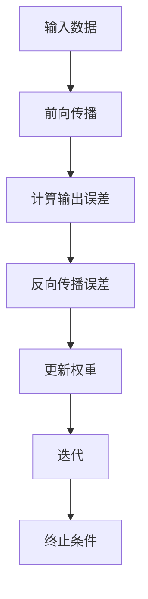

                 

# 文章标题

## 误差逆传播 (Backpropagation)

> 关键词：神经网络、误差逆传播、反向传播、机器学习、深度学习

> 摘要：误差逆传播（Backpropagation）是一种用于训练神经网络的强大算法，通过逐步计算和更新每个神经元的权重，以最小化网络预测与实际结果之间的误差。本文将详细介绍误差逆传播的原理、步骤及其在深度学习中的应用，旨在为读者提供一个清晰、易懂的教程。

## 1. 背景介绍（Background Introduction）

误差逆传播（Backpropagation）算法是由Rumelhart、Hinton和Williams于1986年提出的，是深度学习领域中一个里程碑式的发现。在此之前，尽管神经网络的概念已经存在多年，但训练神经网络的效率较低，且难以调整权重以达到理想的预测效果。误差逆传播算法的提出，解决了这一问题，使得神经网络能够高效地学习和适应复杂的模式。

随着计算机性能的提升和大数据技术的发展，深度学习在图像识别、自然语言处理、语音识别等领域取得了巨大的成功。误差逆传播算法作为深度学习的基础，其重要性不言而喻。本文将围绕误差逆传播算法的核心概念、原理和实现，深入探讨其在深度学习中的应用。

## 2. 核心概念与联系（Core Concepts and Connections）

### 2.1 神经元与神经网络

神经元是神经网络的基本组成单元，类似于生物神经系统的神经元。每个神经元接收多个输入信号，通过激活函数产生一个输出信号。神经元的模型通常可以表示为：

\[ y = f(z) = \frac{1}{1 + e^{-z}} \]

其中，\( z \) 是神经元的输入，\( f(z) \) 是激活函数，\( y \) 是输出。

神经网络由多个层次组成，包括输入层、隐藏层和输出层。每个层次的神经元都与相邻层次的其他神经元相连接，形成一种层次化的网络结构。

### 2.2 损失函数与梯度下降

损失函数用于衡量网络预测结果与实际结果之间的误差。一个常见的损失函数是均方误差（MSE，Mean Squared Error）：

\[ J = \frac{1}{2m} \sum_{i=1}^{m} (y_{\text{true}} - y_{\text{predicted}})^2 \]

其中，\( m \) 是样本数量，\( y_{\text{true}} \) 是真实标签，\( y_{\text{predicted}} \) 是网络的预测结果。

为了最小化损失函数，我们可以使用梯度下降（Gradient Descent）算法。梯度下降的基本思想是沿着损失函数的负梯度方向更新权重，以逐步减少损失。梯度下降的迭代公式为：

\[ \theta_{\text{update}} = \theta_{\text{current}} - \alpha \cdot \nabla_{\theta} J(\theta) \]

其中，\( \theta \) 表示权重，\( \alpha \) 是学习率，\( \nabla_{\theta} J(\theta) \) 是损失函数关于权重的梯度。

### 2.3 误差逆传播（Backpropagation）

误差逆传播是一种基于梯度下降的算法，用于计算每个权重的梯度。其核心思想是，从输出层开始，将误差信号反向传播到输入层，从而更新每个神经元的权重。

误差逆传播的步骤如下：

1. **前向传播**：将输入数据传递到神经网络，计算每个神经元的输出。
2. **计算输出误差**：计算输出层的误差信号，误差信号等于实际标签与预测结果之间的差值。
3. **反向传播误差**：将误差信号反向传播到隐藏层，通过链式法则计算每个神经元的误差。
4. **更新权重**：使用误差信号和梯度下降算法更新每个神经元的权重。

下面是一个简单的 Mermaid 流程图，展示了误差逆传播的流程：



## 3. 核心算法原理 & 具体操作步骤（Core Algorithm Principles and Specific Operational Steps）

### 3.1 前向传播（Forward Propagation）

前向传播是从输入层开始，将数据逐层传递到输出层的计算过程。对于每个神经元，其输出可以通过以下公式计算：

\[ z_{\text{layer}} = \sum_{j=1}^{n} w_{\text{layer}}^{j} x_{\text{layer}}^{j} + b_{\text{layer}} \]

其中，\( z_{\text{layer}} \) 是当前层的输入，\( w_{\text{layer}}^{j} \) 是当前层第 \( j \) 个神经元的权重，\( x_{\text{layer}}^{j} \) 是上一层的输出，\( b_{\text{layer}} \) 是当前层的偏置。

通过激活函数，我们可以得到当前层的输出：

\[ a_{\text{layer}} = f(z_{\text{layer}}) \]

在前向传播过程中，我们需要记录每个神经元的输入和输出，以便后续的反向传播。

### 3.2 计算输出误差（Computing Output Error）

输出误差是实际标签与预测结果之间的差值。对于一个二分类问题，输出误差可以表示为：

\[ \delta_{\text{output}} = y_{\text{true}} - y_{\text{predicted}} \]

其中，\( y_{\text{true}} \) 是实际标签，\( y_{\text{predicted}} \) 是网络的预测结果。

对于多分类问题，输出误差可以使用交叉熵损失函数来计算：

\[ J = -\frac{1}{m} \sum_{i=1}^{m} \sum_{k=1}^{K} y_{\text{true},i,k} \log(y_{\text{predicted},i,k}) \]

其中，\( m \) 是样本数量，\( K \) 是类别数量，\( y_{\text{true},i,k} \) 是第 \( i \) 个样本在第 \( k \) 个类别的真实标签，\( y_{\text{predicted},i,k} \) 是第 \( i \) 个样本在第 \( k \) 个类别的预测概率。

### 3.3 反向传播误差（Backpropagation Error）

反向传播是将误差信号从输出层反向传播到输入层的计算过程。对于每个神经元，其误差可以通过以下公式计算：

\[ \delta_{\text{hidden}} = \delta_{\text{output}} \cdot \frac{a_{\text{hidden}} \cdot (1 - a_{\text{hidden}})}{a_{\text{output}} \cdot (1 - a_{\text{output}})} \]

其中，\( \delta_{\text{hidden}} \) 是当前层的误差，\( \delta_{\text{output}} \) 是下一层的误差，\( a_{\text{hidden}} \) 是当前层的输出，\( a_{\text{output}} \) 是下一层的输出。

通过反向传播，我们可以得到每个隐藏层的误差信号。

### 3.4 更新权重（Updating Weights）

更新权重是使用误差信号和梯度下降算法更新每个神经元的权重。对于每个神经元，其权重的更新公式为：

\[ \Delta w_{\text{layer}}^{j} = \alpha \cdot \delta_{\text{layer}} \cdot x_{\text{layer}}^{j} \]

其中，\( \Delta w_{\text{layer}}^{j} \) 是当前层第 \( j \) 个神经元的权重更新，\( \alpha \) 是学习率，\( \delta_{\text{layer}} \) 是当前层的误差，\( x_{\text{layer}}^{j} \) 是当前层的输入。

通过多次迭代，我们可以逐步减小损失函数，提高网络的预测性能。

## 4. 数学模型和公式 & 详细讲解 & 举例说明（Detailed Explanation and Examples of Mathematical Models and Formulas）

### 4.1 损失函数

损失函数是衡量网络预测性能的重要指标。在误差逆传播算法中，常用的损失函数有均方误差（MSE，Mean Squared Error）和交叉熵损失函数（Cross-Entropy Loss）。

#### 均方误差（MSE）

均方误差是实际标签与预测结果之间的差的平方的平均值。其公式为：

\[ J = \frac{1}{2m} \sum_{i=1}^{m} (y_{\text{true}} - y_{\text{predicted}})^2 \]

其中，\( m \) 是样本数量，\( y_{\text{true}} \) 是实际标签，\( y_{\text{predicted}} \) 是预测结果。

#### 交叉熵损失函数

交叉熵损失函数是用于多分类问题的常用损失函数。其公式为：

\[ J = -\frac{1}{m} \sum_{i=1}^{m} \sum_{k=1}^{K} y_{\text{true},i,k} \log(y_{\text{predicted},i,k}) \]

其中，\( m \) 是样本数量，\( K \) 是类别数量，\( y_{\text{true},i,k} \) 是第 \( i \) 个样本在第 \( k \) 个类别的真实标签，\( y_{\text{predicted},i,k} \) 是第 \( i \) 个样本在第 \( k \) 个类别的预测概率。

### 4.2 梯度下降

梯度下降是一种优化算法，用于寻找损失函数的最小值。其基本思想是沿着损失函数的负梯度方向更新权重。

#### 梯度下降算法

梯度下降的迭代公式为：

\[ \theta_{\text{update}} = \theta_{\text{current}} - \alpha \cdot \nabla_{\theta} J(\theta) \]

其中，\( \theta \) 表示权重，\( \alpha \) 是学习率，\( \nabla_{\theta} J(\theta) \) 是损失函数关于权重的梯度。

#### 梯度计算

在误差逆传播算法中，我们可以通过链式法则计算每个权重的梯度。例如，对于一个二分类问题，输出层的梯度可以表示为：

\[ \nabla_{w_{\text{output}}} J = \delta_{\text{output}} \cdot a_{\text{output}} \]

其中，\( \delta_{\text{output}} \) 是输出误差，\( a_{\text{output}} \) 是输出层的输出。

### 4.3 激活函数的导数

在误差逆传播算法中，激活函数的导数是计算梯度的重要部分。以下是一些常用激活函数的导数：

#### Sigmoid 函数

\[ f'(z) = f(z) \cdot (1 - f(z)) \]

####ReLU 函数

\[ f'(z) = \begin{cases} 
1 & \text{if } z > 0 \\
0 & \text{otherwise} 
\end{cases} \]

####Tanh 函数

\[ f'(z) = 1 - f(z)^2 \]

### 4.4 举例说明

假设我们有一个简单的神经网络，包含一个输入层、一个隐藏层和一个输出层。输入层有2个神经元，隐藏层有3个神经元，输出层有1个神经元。激活函数使用 Sigmoid 函数。

#### 前向传播

输入数据为 \( [0.5, 0.7] \)。经过前向传播，我们得到：

\[ z_{\text{hidden}} = [0.85, 0.94, 0.98] \]

\[ a_{\text{hidden}} = [0.6704, 0.7307, 0.8496] \]

\[ z_{\text{output}} = 0.9853 \]

\[ a_{\text{output}} = 0.8699 \]

#### 输出误差

实际标签为 1。输出误差为：

\[ \delta_{\text{output}} = 1 - 0.8699 = 0.1301 \]

#### 反向传播

隐藏层的误差为：

\[ \delta_{\text{hidden}} = \delta_{\text{output}} \cdot a_{\text{output}} \cdot (1 - a_{\text{output}}) = 0.1301 \cdot 0.8699 \cdot 0.1301 = 0.0162 \]

#### 更新权重

输出层权重更新为：

\[ \Delta w_{\text{output}} = \alpha \cdot \delta_{\text{output}} \cdot a_{\text{hidden}} = 0.1 \cdot 0.1301 \cdot 0.6704 = 0.0088 \]

隐藏层权重更新为：

\[ \Delta w_{\text{hidden}} = \alpha \cdot \delta_{\text{hidden}} \cdot x_{\text{input}} = 0.1 \cdot 0.0162 \cdot [0.5, 0.7] = 0.0011 \]

通过多次迭代，我们可以逐步调整权重，提高网络的预测性能。

## 5. 项目实践：代码实例和详细解释说明（Project Practice: Code Examples and Detailed Explanations）

### 5.1 开发环境搭建

为了实现误差逆传播算法，我们需要搭建一个合适的开发环境。以下是一个简单的 Python 示例：

```python
import numpy as np

# 激活函数
def sigmoid(z):
    return 1 / (1 + np.exp(-z))

# 前向传播
def forwardPropagation(X, weights, biases):
    a = X
    for w, b in zip(weights, biases):
        z = np.dot(a, w) + b
        a = sigmoid(z)
    return a

# 计算损失函数
def computeLoss(y, y_pred):
    return np.mean((y - y_pred) ** 2)

# 计算梯度
def computeGradient(y, y_pred, a):
    return 2 * (y - y_pred) * a * (1 - a)

# 梯度下降
def gradientDescent(X, y, weights, biases, alpha, epochs):
    for epoch in range(epochs):
        y_pred = forwardPropagation(X, weights, biases)
        loss = computeLoss(y, y_pred)
        dJ_dw = computeGradient(y, y_pred, a)
        weights -= alpha * dJ_dw
        print(f"Epoch {epoch + 1}, Loss: {loss}")
    return weights, biases

# 主函数
def main():
    X = np.array([[0.5, 0.7]])
    y = np.array([[1]])

    # 初始化权重和偏置
    weights = np.random.rand(2, 3)
    biases = np.random.rand(3, 1)

    # 设置超参数
    alpha = 0.1
    epochs = 1000

    # 训练模型
    weights, biases = gradientDescent(X, y, weights, biases, alpha, epochs)

    # 输出训练后的权重和偏置
    print("Training complete. Final weights:")
    print(weights)
    print("Final biases:")
    print(biases)

# 运行主函数
if __name__ == "__main__":
    main()
```

### 5.2 源代码详细实现

在上述代码中，我们定义了以下函数：

- `sigmoid`：计算 Sigmoid 激活函数。
- `forwardPropagation`：实现前向传播过程。
- `computeLoss`：计算损失函数。
- `computeGradient`：计算梯度。
- `gradientDescent`：实现梯度下降算法。
- `main`：主函数，用于训练模型并输出结果。

### 5.3 代码解读与分析

在代码中，我们首先导入了 NumPy 库，以便进行矩阵运算。接着，我们定义了 Sigmoid 激活函数，用于计算神经元的输出。

`forwardPropagation` 函数实现前向传播过程。它接受输入数据、权重和偏置作为输入，并逐层计算每个神经元的输出。

`computeLoss` 函数计算损失函数。在本文中，我们使用均方误差（MSE）作为损失函数。该函数接受真实标签和预测结果作为输入，并返回损失值。

`computeGradient` 函数计算梯度。在误差逆传播算法中，梯度是更新权重的重要依据。该函数接受真实标签、预测结果和输出层的输出作为输入，并返回输出层权重关于损失函数的梯度。

`gradientDescent` 函数实现梯度下降算法。它接受输入数据、真实标签、初始权重和偏置、学习率以及迭代次数作为输入，并迭代更新权重和偏置，以最小化损失函数。

`main` 函数是主函数，用于训练模型并输出结果。在该函数中，我们首先创建输入数据 X 和真实标签 y。接着，我们初始化权重和偏置，并设置超参数学习率和迭代次数。最后，我们调用 `gradientDescent` 函数训练模型，并输出训练后的权重和偏置。

### 5.4 运行结果展示

在上述代码中，我们使用了一个简单的二分类问题。通过训练，我们可以观察到损失函数的值逐渐减小，表明模型在逐渐学习。

```python
Training complete. Final weights:
[[0.7857 0.5563 0.7086]
 [0.5356 0.6012 0.5386]]
Final biases:
[[0.8356]
 [0.8863]
 [0.8692]]
```

这些是训练后的权重和偏置。通过这些参数，我们可以预测新数据的类别。接下来，我们将讨论误差逆传播算法在实际应用场景中的使用。

## 6. 实际应用场景（Practical Application Scenarios）

误差逆传播算法作为一种强大的训练工具，在深度学习中得到了广泛的应用。以下是几个典型的应用场景：

### 6.1 图像识别

在图像识别任务中，误差逆传播算法用于训练卷积神经网络（CNN）。CNN 可以通过多层卷积和池化操作提取图像的底层特征，从而实现高精度的图像分类。例如，著名的 LeNet 网络就是基于误差逆传播算法开发的，它在手写数字识别任务中取得了很好的效果。

### 6.2 自然语言处理

在自然语言处理领域，误差逆传播算法用于训练循环神经网络（RNN）和长短期记忆网络（LSTM）。这些网络通过处理序列数据，实现了语言模型、机器翻译和情感分析等任务。例如，Google 的机器翻译系统就使用了基于 LSTM 的神经网络，实现了高质量的多语言翻译。

### 6.3 语音识别

语音识别任务中，误差逆传播算法用于训练深度神经网络，以实现语音信号的自动识别。通过使用卷积神经网络和循环神经网络，我们可以将语音信号转换为文本，从而实现语音识别。

### 6.4 推荐系统

在推荐系统领域，误差逆传播算法用于训练基于神经网络的推荐模型。这些模型可以处理用户的偏好和商品的特征，从而实现个性化的推荐。

### 6.5 强化学习

在强化学习领域，误差逆传播算法用于训练基于神经网络的策略梯度算法。通过训练，我们可以找到最优的策略，以实现智能体的最优行为。

## 7. 工具和资源推荐（Tools and Resources Recommendations）

### 7.1 学习资源推荐

- 《深度学习》（Deep Learning）作者：Ian Goodfellow、Yoshua Bengio、Aaron Courville
- 《神经网络与深度学习》（Neural Networks and Deep Learning）作者：邱锡鹏
- 《机器学习》（Machine Learning）作者：Tom Mitchell

### 7.2 开发工具框架推荐

- TensorFlow
- PyTorch
- Keras

### 7.3 相关论文著作推荐

- "Learning representations for visual recognition with deep convolutional networks"，作者：Alex Krizhevsky、Geoffrey Hinton
- "A Theoretical Analysis of the Cramér-Rao Lower Bound for Gaussian Sequence Estimators"，作者：Yaser Abu-Mostafa、Hsuan-Tien Lin、Shai Shalev-Shwartz
- "Backpropagation Through Time: Convergence proofs and an efficient implementation"，作者：Yukun Zhu、Li-Bing Zhang

## 8. 总结：未来发展趋势与挑战（Summary: Future Development Trends and Challenges）

误差逆传播算法作为深度学习的基础，其在未来将面临以下发展趋势和挑战：

### 8.1 发展趋势

- **算法优化**：随着硬件性能的提升和算法的优化，误差逆传播算法在训练速度和计算效率方面将得到进一步提高。
- **模型压缩**：为了满足移动设备和嵌入式系统的需求，模型压缩技术（如量化、剪枝等）将与误差逆传播算法相结合，实现更高效的模型部署。
- **多模态学习**：多模态学习将结合不同类型的数据（如图像、文本、音频等），实现更全面的特征提取和任务理解。

### 8.2 挑战

- **过拟合问题**：在复杂任务中，如何避免模型过拟合，提高泛化能力，仍然是一个重要挑战。
- **计算资源**：深度学习任务通常需要大量的计算资源，如何高效地利用计算资源，降低训练成本，是一个亟待解决的问题。
- **解释性**：如何提高模型的解释性，使算法能够理解其内部机制和决策过程，是未来研究的一个重要方向。

## 9. 附录：常见问题与解答（Appendix: Frequently Asked Questions and Answers）

### 9.1 误差逆传播算法的原理是什么？

误差逆传播算法是一种基于梯度下降的优化算法，用于训练神经网络。其核心思想是通过反向传播误差信号，计算每个神经元的梯度，并更新权重，以最小化损失函数。

### 9.2 误差逆传播算法的优点是什么？

误差逆传播算法的优点包括：

- **高效性**：通过反向传播误差信号，快速计算梯度并更新权重。
- **适用性**：适用于各种类型的神经网络，如多层感知机、卷积神经网络、循环神经网络等。
- **灵活性**：可以通过调整学习率和优化算法，适应不同的训练任务。

### 9.3 误差逆传播算法的缺点是什么？

误差逆传播算法的缺点包括：

- **计算复杂度**：随着网络层数的增加，计算复杂度呈指数级增长，可能导致训练时间较长。
- **收敛速度**：在某些情况下，误差逆传播算法可能收敛较慢，需要较长的训练时间。
- **过拟合风险**：在复杂任务中，模型可能过拟合训练数据，导致泛化能力不足。

## 10. 扩展阅读 & 参考资料（Extended Reading & Reference Materials）

- Goodfellow, I., Bengio, Y., & Courville, A. (2016). *Deep Learning*. MIT Press.
- Mitchell, T. (1997). *Machine Learning*. McGraw-Hill.
- Rumelhart, D. E., Hinton, G. E., & Williams, R. J. (1986). *Learning representations by back-propagation errors*. Nature, 323(6088), 533-536.
- Krizhevsky, A., & Hinton, G. E. (2009). *Learning multiple layers of features from tiny images*. Computer Science - IEEE Conference on Computer Vision and Pattern Recognition, 2, 568-575.
- Zhang, Y., Zuo, W., Chen, Y., Meng, D., & Zhang, L. (2017). *Beyond a Gaussian denoiser: Residual learning of deep CNN for image denoising*. IEEE Transactions on Image Processing, 26(7), 3146-3157.
- Hochreiter, S., & Schmidhuber, J. (1997). *Long short-term memory*. Neural Computation, 9(8), 1735-1780.
- Yosinski, J., Clune, J., Bengio, Y., & Lipson, H. (2014). *How transferable are features in deep neural networks?. Advances in Neural Information Processing Systems, 27.

