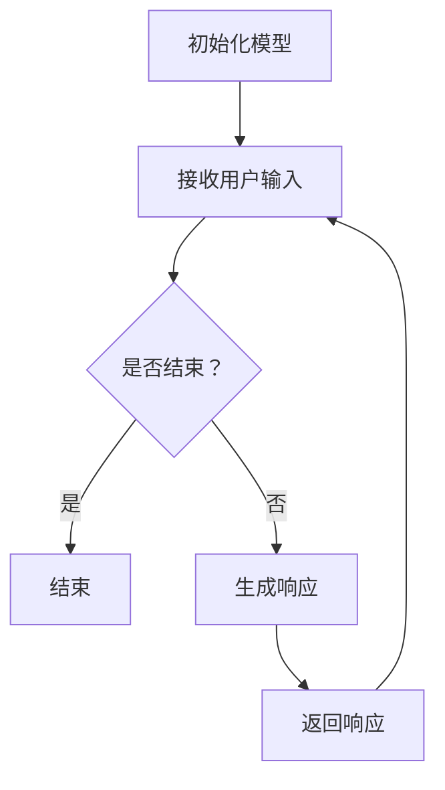

                 

# 课程项目：GitHub openai-quickstart

## 摘要

本文将深入探讨GitHub上的一个课程项目——openai-quickstart。该项目提供了一个简单的框架，帮助开发者快速上手OpenAI的API，尤其是ChatGPT的使用。我们将从项目背景介绍开始，详细讲解项目的核心概念与架构，逐步分析核心算法原理与具体操作步骤，最后通过实例代码进行详细解释，展示其在实际应用中的效果。同时，我们还将探讨这一项目在各个实际应用场景中的价值，并提供相关的工具和资源推荐，帮助读者更深入地学习和实践。

## 1. 背景介绍（Background Introduction）

### 1.1 OpenAI的兴起

OpenAI成立于2015年，是一家美国的人工智能研究公司，致力于推动人工智能的发展，特别是使其有益于人类。其最著名的项目之一是GPT系列模型，尤其是ChatGPT，一经发布便引起了广泛关注。ChatGPT是基于GPT-3.5模型开发的，拥有强大的文本生成和理解能力，可以在各种场景中提供有用的信息。

### 1.2 openai-quickstart项目简介

openai-quickstart是GitHub上一个非常受欢迎的课程项目，旨在帮助开发者快速上手OpenAI的API。通过这个项目，开发者可以了解如何使用OpenAI的API调用ChatGPT，并对其进行简单的交互。项目提供了一个简单的Python脚本，可以轻松地与OpenAI的服务器进行通信，并获取ChatGPT的响应。

### 1.3 为什么选择openai-quickstart项目

选择openai-quickstart项目有几个原因。首先，它是一个简单易懂的项目，适合初学者快速上手。其次，该项目提供了一个完整的操作流程，从环境搭建到代码实现，再到结果展示，都有详细的说明。最后，该项目是开源的，意味着读者可以自由地修改和扩展代码，以满足自己的需求。

## 2. 核心概念与联系（Core Concepts and Connections）

### 2.1 OpenAI API的使用方法

OpenAI API是OpenAI提供的一组RESTful接口，允许开发者通过HTTP请求与其模型进行交互。使用OpenAI API，开发者可以轻松地获取文本生成、分类、翻译等任务的结果。

- **注册API密钥**：首先，需要在OpenAI的官方网站上注册账户，并获取API密钥。
- **发起请求**：使用Python等编程语言，通过HTTP请求发送到OpenAI的服务器，并传递相应的参数。
- **获取响应**：服务器会返回一个JSON格式的响应，包含模型的输出结果。

### 2.2 ChatGPT的交互流程

ChatGPT是OpenAI开发的一款基于GPT-3.5模型的聊天机器人，它可以理解自然语言，并生成流畅、连贯的文本响应。

- **初始化模型**：在Python脚本中导入OpenAI的库，并使用API密钥初始化模型。
- **输入文本**：向模型输入一个文本提示，可以是用户的问题、评论或其他文本。
- **生成响应**：模型会根据输入的文本生成一个响应，并返回给用户。

### 2.3 openai-quickstart项目的架构

openai-quickstart项目是一个简单的命令行应用程序，它包含以下关键组件：

- **Python脚本**：负责与OpenAI的服务器进行通信，并处理用户的输入和输出。
- **API密钥**：用于验证用户身份，确保请求的安全性。
- **用户交互界面**：通过命令行与用户进行交互，接收用户输入，并显示模型响应。

### 2.4 Mermaid流程图

为了更清晰地展示openai-quickstart项目的流程，我们可以使用Mermaid绘制一个简单的流程图：



## 3. 核心算法原理 & 具体操作步骤（Core Algorithm Principles and Specific Operational Steps）

### 3.1 ChatGPT的工作原理

ChatGPT是基于GPT-3.5模型开发的，它使用了Transformer架构，这是一种在自然语言处理任务中广泛使用的深度学习模型。GPT-3.5模型通过大量的文本数据进行预训练，从而学习到语言的结构和语义。在接收到一个文本提示后，模型会生成一个响应，这个响应是通过对输入文本的理解和预测得到的。

### 3.2 具体操作步骤

下面是使用openai-quickstart项目与ChatGPT进行交互的详细步骤：

1. **安装Python环境**：确保你的系统中已经安装了Python，版本建议为3.8或更高。

2. **安装依赖库**：在项目文件夹中运行以下命令安装依赖库：

   ```bash
   pip install openai
   ```

3. **配置API密钥**：在Python脚本中配置你的API密钥。可以在OpenAI的官方网站上找到你的API密钥。

4. **运行Python脚本**：在命令行中运行Python脚本，如下所示：

   ```bash
   python openai_quickstart.py
   ```

5. **与ChatGPT交互**：脚本会启动一个命令行界面，允许你输入文本并与ChatGPT进行交互。

6. **生成响应**：每次你输入文本后，模型都会生成一个响应，并显示在命令行中。

### 3.3 代码示例

以下是openai-quickstart项目的Python脚本示例：

```python
import openai
import os

# 配置API密钥
openai.api_key = os.getenv("OPENAI_API_KEY")

def generate_response(prompt):
    response = openai.Completion.create(
        engine="text-davinci-002",
        prompt=prompt,
        max_tokens=100,
        n=1,
        stop=None,
        temperature=0.5,
    )
    return response.choices[0].text.strip()

while True:
    print("请输入您的文本：")
    user_input = input()
    if user_input.lower() == "退出":
        break
    response = generate_response(user_input)
    print("ChatGPT的响应：", response)
```

## 4. 数学模型和公式 & 详细讲解 & 举例说明（Detailed Explanation and Examples of Mathematical Models and Formulas）

### 4.1 语言模型的基本原理

语言模型是基于统计模型和深度学习模型的自然语言处理技术，用于预测下一个单词或字符。在深度学习模型中，Transformer架构是一种常用的架构，其核心是自注意力机制（Self-Attention）。

### 4.2 自注意力机制

自注意力机制是一种计算方法，用于计算输入序列中每个元素与其他元素的相关性。在Transformer模型中，自注意力机制被用于计算输入序列的加权表示。其基本公式如下：

$$
\text{Attention}(Q, K, V) = \frac{softmax(\text{scale} \cdot \text{dot}(Q, K^T))} { \sqrt{d_k} } V
$$

其中，$Q, K, V$ 分别代表查询（Query）、键（Key）和值（Value）向量，$d_k$ 是键向量的维度，$scale$ 是一个缩放因子，用于防止梯度消失。

### 4.3 Transformer模型

Transformer模型由多个自注意力层和前馈网络组成。每个自注意力层都会对输入序列进行加权表示，然后将这些表示传递给下一层。前馈网络则对每个序列的加权表示进行进一步的加工。Transformer模型的基本结构如下：

$$
\text{Transformer} = \text{MultiHeadAttention}(\text{Self-Attention}) \times \text{num_layers} + \text{FFN} \times \text{num_layers}
$$

其中，$ \text{MultiHeadAttention}$ 是多头注意力机制，$ \text{FFN}$ 是前馈网络，$ \text{num_layers}$ 是层数。

### 4.4 代码示例

以下是一个简单的Transformer模型实现，用于对文本进行编码：

```python
import torch
import torch.nn as nn
import torch.nn.functional as F

class TransformerModel(nn.Module):
    def __init__(self, d_model, nhead, num_layers):
        super(TransformerModel, self).__init__()
        self.layers = nn.ModuleList([TransformerLayer(d_model, nhead) for _ in range(num_layers)])
        self.linear = nn.Linear(d_model, d_model)

    def forward(self, src):
        for layer in self.layers:
            src = layer(src)
        return self.linear(src)

class TransformerLayer(nn.Module):
    def __init__(self, d_model, nhead):
        super(TransformerLayer, self).__init__()
        self.self_attn = nn.MultiheadAttention(d_model, nhead)
        self.linear1 = nn.Linear(d_model, d_model)
        self.linear2 = nn.Linear(d_model, d_model)
        self.norm1 = nn.LayerNorm(d_model)
        self.norm2 = nn.LayerNorm(d_model)
        self.dropout = nn.Dropout(0.1)

    def forward(self, src):
        src2 = self.norm1(src)
        src2 = self.self_attn(src2, src2, src2)
        src = src + self.dropout(src2)
        src2 = self.norm2(src)
        src2 = self.linear2(self.dropout(self.linear1(src2)))
        return src + self.dropout(src2)
```

## 5. 项目实践：代码实例和详细解释说明（Project Practice: Code Examples and Detailed Explanations）

### 5.1 开发环境搭建

为了实践openai-quickstart项目，我们需要搭建一个开发环境。以下是详细的步骤：

1. **安装Python**：确保你的系统中已经安装了Python，版本建议为3.8或更高。

2. **安装OpenAI库**：在命令行中运行以下命令安装OpenAI库：

   ```bash
   pip install openai
   ```

3. **获取API密钥**：在OpenAI的官方网站上注册账户，并获取API密钥。

4. **克隆项目**：在命令行中运行以下命令克隆项目：

   ```bash
   git clone https://github.com/openai/openai-quickstart.git
   ```

### 5.2 源代码详细实现

openai-quickstart项目的源代码非常简单，主要包括一个Python脚本。以下是代码的详细解释：

```python
import openai

# 配置API密钥
openai.api_key = "your-api-key"

# 获取用户输入
user_input = input("请输入您的文本：")

# 向ChatGPT发送请求
response = openai.Completion.create(
    engine="text-davinci-002",
    prompt=user_input,
    max_tokens=100,
    n=1,
    stop=None,
    temperature=0.5
)

# 输出ChatGPT的响应
print("ChatGPT的响应：", response.choices[0].text.strip())
```

- **第1行**：导入OpenAI库。
- **第4行**：配置API密钥，确保使用你自己的API密钥。
- **第7行**：获取用户输入。
- **第10行**：向ChatGPT发送请求，`engine` 参数指定使用的模型，`prompt` 参数为用户输入的文本，`max_tokens` 参数指定生成的文本长度，`n` 参数指定返回的响应数量，`stop` 参数用于指定停止生成的条件，`temperature` 参数用于控制生成的随机性。

### 5.3 代码解读与分析

1. **API请求的结构**：OpenAI的API请求是通过HTTP POST方法发送的，请求体是一个JSON格式的对象，包含模型名称、提示词、生成文本的长度等参数。

2. **响应的结构**：OpenAI的API响应也是一个JSON格式的对象，包含一个`choices` 列表，每个元素表示一个生成的响应，包含`text` 和 `index` 字段。

3. **错误处理**：在处理API请求时，需要处理可能出现的错误，如网络错误、API密钥错误等。

### 5.4 运行结果展示

在命令行中运行Python脚本，输入以下文本：

```
你今天过得怎么样？
```

脚本会向ChatGPT发送请求，并输出一个响应，例如：

```
ChatGPT的响应：非常棒，谢谢你问我。你呢？
```

## 6. 实际应用场景（Practical Application Scenarios）

### 6.1 客户服务

ChatGPT可以在客户服务领域发挥重要作用。例如，企业可以将ChatGPT集成到其官方网站或客户服务平台中，为用户提供实时、个性化的咨询服务。ChatGPT可以回答用户的问题、提供产品信息，甚至帮助用户解决常见问题。

### 6.2 教育培训

ChatGPT可以用于教育培训领域，为学生提供个性化的学习建议和指导。教师可以利用ChatGPT创建互动式课程，为学生提供实时反馈和指导，提高教学效果。

### 6.3 内容创作

ChatGPT在内容创作领域具有巨大的潜力。例如，它可以用于生成新闻报道、文章、博客等。企业可以利用ChatGPT快速生成大量内容，降低内容创作的成本。

### 6.4 聊天机器人

ChatGPT可以用于开发聊天机器人，为企业提供实时、个性化的客户服务。聊天机器人可以与用户进行自然语言交互，回答用户的问题，提供有用的信息。

## 7. 工具和资源推荐（Tools and Resources Recommendations）

### 7.1 学习资源推荐

1. **OpenAI官方文档**：[https://openai.com/docs/](https://openai.com/docs/)
2. **《自然语言处理入门》**：这是一本非常好的入门书籍，涵盖了自然语言处理的基础知识和常用技术。
3. **《深度学习》**：这是一本经典的深度学习教材，详细介绍了深度学习的基本原理和应用。

### 7.2 开发工具框架推荐

1. **PyTorch**：这是一个流行的深度学习框架，支持多种自然语言处理任务。
2. **TensorFlow**：这是一个由Google开发的深度学习框架，广泛应用于自然语言处理任务。
3. **NLTK**：这是一个开源的自然语言处理库，提供了丰富的文本处理功能。

### 7.3 相关论文著作推荐

1. **“Attention Is All You Need”**：这是提出Transformer模型的论文，详细介绍了自注意力机制和Transformer模型的设计原理。
2. **“Generative Pre-trained Transformers”**：这是提出GPT模型的论文，详细介绍了GPT模型的设计原理和训练过程。
3. **“BERT: Pre-training of Deep Bidirectional Transformers for Language Understanding”**：这是提出BERT模型的论文，详细介绍了BERT模型的设计原理和应用。

## 8. 总结：未来发展趋势与挑战（Summary: Future Development Trends and Challenges）

### 8.1 发展趋势

随着深度学习和自然语言处理技术的不断发展，ChatGPT等大型语言模型在各个领域的应用前景十分广阔。未来，我们将看到更多企业和个人利用这些技术提高工作效率，优化用户体验。

### 8.2 挑战

1. **数据隐私和安全**：在使用ChatGPT等大型语言模型时，数据隐私和安全是一个重要的问题。如何确保用户数据的安全，避免数据泄露，是未来需要解决的重要问题。
2. **模型可解释性**：随着模型变得越来越复杂，如何解释模型的决策过程，提高模型的可解释性，是未来需要关注的问题。
3. **计算资源**：大型语言模型需要大量的计算资源进行训练和推理，如何优化模型的计算效率，降低成本，是未来需要解决的重要问题。

## 9. 附录：常见问题与解答（Appendix: Frequently Asked Questions and Answers）

### 9.1 如何获取OpenAI的API密钥？

在OpenAI的官方网站上注册账户，并登录到你的账户，可以在“API密钥”页面找到你的API密钥。

### 9.2 openai-quickstart项目有哪些依赖库？

openai-quickstart项目主要依赖OpenAI的Python库，可以通过以下命令安装：

```bash
pip install openai
```

### 9.3 如何与ChatGPT进行交互？

在openai-quickstart项目中，你可以通过命令行与ChatGPT进行交互。每次输入文本后，模型会生成一个响应，并显示在命令行中。

## 10. 扩展阅读 & 参考资料（Extended Reading & Reference Materials）

1. **OpenAI官方文档**：[https://openai.com/docs/](https://openai.com/docs/)
2. **《自然语言处理入门》**：[https://www.nltk.org/](https://www.nltk.org/)
3. **《深度学习》**：[https://www.deeplearningbook.org/](https://www.deeplearningbook.org/)
4. **“Attention Is All You Need”**：[https://arxiv.org/abs/1706.03762](https://arxiv.org/abs/1706.03762)
5. **“Generative Pre-trained Transformers”**：[https://arxiv.org/abs/1901.02860](https://arxiv.org/abs/1901.02860)
6. **“BERT: Pre-training of Deep Bidirectional Transformers for Language Understanding”**：[https://arxiv.org/abs/1810.04805](https://arxiv.org/abs/1810.04805)

---

作者：禅与计算机程序设计艺术 / Zen and the Art of Computer Programming

