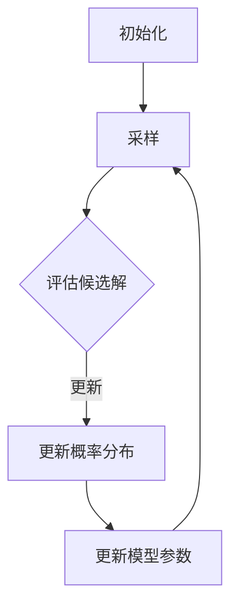
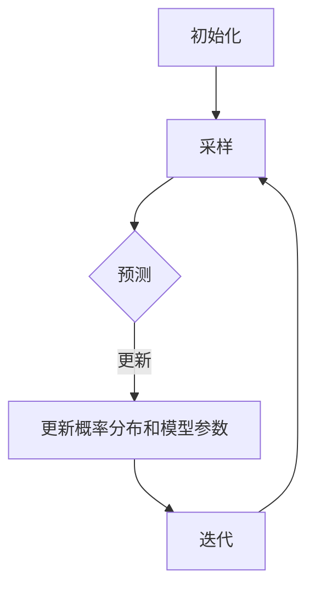

                 

### 文章标题

《贝叶斯优化的增量高斯过程模型》

### Keywords:
贝叶斯优化，增量高斯过程模型，机器学习，数据分析，优化算法

### Abstract:
本文旨在探讨贝叶斯优化在增量高斯过程模型中的应用，阐述其核心原理、数学模型以及实际操作步骤。通过逐步分析推理，我们旨在提供一个深入且易于理解的技术框架，帮助读者掌握贝叶斯优化与高斯过程模型结合的核心技术。

## 1. 背景介绍（Background Introduction）

贝叶斯优化（Bayesian Optimization）是一种基于贝叶斯理论的优化算法，它在寻找最优解的过程中，利用历史数据来推测未知目标函数的值，从而指导搜索方向。与传统优化算法相比，贝叶斯优化具有更高的灵活性和鲁棒性，特别适用于高维、非凸优化问题。

高斯过程模型（Gaussian Process Model，GPM）是一种概率模型，用于处理连续值预测问题。其核心思想是将输入空间视为一个高维空间，通过核函数定义的联合概率分布来描述数据点之间的关系。高斯过程模型在机器学习和数据分析领域具有广泛的应用，如回归分析、时间序列预测和函数优化等。

增量学习（Incremental Learning）是一种能够在已有数据上逐步更新模型的方法。与批量学习相比，增量学习具有更好的适应性和实时性，特别适用于动态环境下的学习任务。

本文将探讨贝叶斯优化与增量高斯过程模型的结合，构建一个有效的优化框架，用于解决复杂的高维优化问题。通过分析贝叶斯优化的核心原理，我们旨在提供一个深入理解贝叶斯优化在高斯过程模型中的应用方法。

## 2. 核心概念与联系（Core Concepts and Connections）

### 2.1 贝叶斯优化的基本原理

贝叶斯优化基于贝叶斯推理，通过历史数据来推测未知目标函数的值。其核心思想是将目标函数视为一个概率分布，利用马尔可夫链蒙特卡罗（MCMC）等方法从该分布中采样出候选解。在每次采样过程中，贝叶斯优化算法会根据当前已知的样本点，更新目标函数的概率分布，从而指导下一次采样。

贝叶斯优化的主要步骤包括：

1. 初始化：选择初始的搜索区域和超参数。
2. 采样：从目标函数的概率分布中采样候选解。
3. 评估：计算每个候选解的目标函数值。
4. 更新：根据新采样的样本点，更新目标函数的概率分布。

### 2.2 高斯过程模型的核心原理

高斯过程模型是一种概率模型，其核心是高斯分布。在给定一组输入数据 \(X = \{x_1, x_2, ..., x_n\}\) 和对应的目标值 \(Y = \{y_1, y_2, ..., y_n\}\) 时，高斯过程模型可以表示为：

$$
p(y|x) = \mathcal{N}(\mu(x), \sigma^2)
$$

其中，\( \mu(x) \) 是均值函数，\( \sigma^2 \) 是方差函数。高斯过程模型通过核函数 \( k(x, x') \) 定义联合概率分布：

$$
p(\mathbf{y}|\mathbf{X}) = \mathcal{N}(\mathbf{y}|\mathbf{K}, \sigma^2 \mathbf{I})
$$

其中，\( \mathbf{K} \) 是协方差矩阵，由核函数计算得到：

$$
K_{ij} = k(x_i, x_j)
$$

高斯过程模型的主要步骤包括：

1. 初始化：选择核函数和超参数。
2. 训练：根据输入数据计算协方差矩阵和均值函数。
3. 预测：对于新的输入数据，计算预测值和不确定性。

### 2.3 增量高斯过程模型

增量高斯过程模型（Incremental Gaussian Process Model，IGPM）是一种基于高斯过程模型的增量学习方法。它通过在原有模型的基础上，逐步更新模型参数，以适应新的数据。

增量高斯过程模型的核心步骤包括：

1. 初始化：选择初始的核函数和超参数。
2. 更新：对于新的数据点，更新模型参数，包括协方差矩阵和均值函数。
3. 预测：使用更新后的模型，对新数据点进行预测。

### 2.4 贝叶斯优化与增量高斯过程模型的结合

贝叶斯优化与增量高斯过程模型的结合，构建了一个强大的优化框架，用于解决高维优化问题。贝叶斯优化通过历史数据更新目标函数的概率分布，指导搜索方向；增量高斯过程模型通过逐步更新模型参数，提高预测精度。

结合的核心步骤包括：

1. 初始化：选择初始的搜索区域、核函数和超参数。
2. 采样：利用贝叶斯优化，从目标函数的概率分布中采样候选解。
3. 预测：使用增量高斯过程模型，对每个候选解进行预测。
4. 更新：根据新采样的样本点，更新目标函数的概率分布和模型参数。

### 2.5 Mermaid 流程图（Mermaid Flowchart）



通过以上核心概念的阐述和流程图展示，我们为后续详细探讨贝叶斯优化的增量高斯过程模型奠定了基础。在接下来的章节中，我们将深入分析贝叶斯优化的具体算法原理和操作步骤。

## 3. 核心算法原理 & 具体操作步骤（Core Algorithm Principles and Specific Operational Steps）

### 3.1 贝叶斯优化的核心原理

贝叶斯优化是基于贝叶斯推理的一种优化算法。其主要思想是通过历史数据来推测未知目标函数的值，从而指导搜索方向。贝叶斯优化的核心原理可以概括为以下三个步骤：

1. **初始化**：选择初始的搜索区域和超参数。搜索区域定义了目标函数的可能取值范围，超参数则控制了贝叶斯优化的采样策略。
   
2. **采样**：从目标函数的概率分布中采样候选解。贝叶斯优化通过历史数据构建目标函数的概率分布，并利用马尔可夫链蒙特卡罗（MCMC）等方法进行采样。

3. **更新**：根据新采样的样本点，更新目标函数的概率分布。贝叶斯优化利用贝叶斯推理更新概率分布，从而指导下一次采样。

### 3.2 增量高斯过程模型的具体操作步骤

增量高斯过程模型（IGPM）是一种基于高斯过程模型的增量学习方法。其具体操作步骤如下：

1. **初始化**：选择初始的核函数和超参数。核函数定义了输入空间中数据点之间的相关性，超参数则控制了模型的复杂度。

2. **更新**：对于新的数据点，更新模型参数，包括协方差矩阵和均值函数。增量高斯过程模型通过在原有模型的基础上，逐步更新参数，以适应新的数据。

3. **预测**：使用更新后的模型，对新数据点进行预测。预测过程包括计算预测值和不确定性，以评估模型对新数据的适应能力。

### 3.3 贝叶斯优化与增量高斯过程模型的结合步骤

贝叶斯优化与增量高斯过程模型的结合，构建了一个强大的优化框架。其具体操作步骤如下：

1. **初始化**：选择初始的搜索区域、核函数和超参数。搜索区域定义了目标函数的可能取值范围，核函数定义了输入空间中数据点之间的相关性，超参数则控制了贝叶斯优化和增量高斯过程模型的采样策略。

2. **采样**：利用贝叶斯优化，从目标函数的概率分布中采样候选解。贝叶斯优化通过历史数据构建目标函数的概率分布，并利用马尔可夫链蒙特卡罗（MCMC）等方法进行采样。

3. **预测**：使用增量高斯过程模型，对每个候选解进行预测。预测过程包括计算预测值和不确定性，以评估模型对候选解的适应能力。

4. **更新**：根据新采样的样本点，更新目标函数的概率分布和模型参数。贝叶斯优化利用贝叶斯推理更新概率分布，增量高斯过程模型则通过逐步更新模型参数，提高预测精度。

5. **迭代**：重复步骤2-4，直到满足停止条件，如达到预设的迭代次数或搜索区域收敛。

### 3.4 Mermaid 流程图（Mermaid Flowchart）



通过以上核心算法原理和操作步骤的阐述，我们为后续详细探讨贝叶斯优化的增量高斯过程模型的数学模型和公式奠定了基础。在接下来的章节中，我们将深入分析贝叶斯优化的增量高斯过程模型的数学模型和公式。

## 4. 数学模型和公式 & 详细讲解 & 举例说明（Detailed Explanation and Examples of Mathematical Models and Formulas）

### 4.1 贝叶斯优化的数学模型

贝叶斯优化中的目标函数是一个随机过程，其概率分布可以通过高斯过程模型来描述。具体来说，贝叶斯优化中的目标函数可以表示为：

$$
f(x) \sim \mathcal{N}(\mu(x), \sigma^2)
$$

其中，\( \mu(x) \) 是均值函数，\( \sigma^2 \) 是方差函数。均值函数和方差函数分别定义为：

$$
\mu(x) = \mathbb{E}[f(x)] = \int_{-\infty}^{\infty} f(x) p(f(x)) \, df
$$

$$
\sigma^2 = \text{Var}[f(x)] = \int_{-\infty}^{\infty} [f(x) - \mu(x)]^2 p(f(x)) \, df
$$

贝叶斯优化通过历史数据来更新目标函数的概率分布。假设已有 \( n \) 个采样点 \( X = \{x_1, x_2, ..., x_n\} \)，对应的函数值 \( Y = \{y_1, y_2, ..., y_n\} \)，我们可以通过最大似然估计（MLE）来更新目标函数的概率分布：

$$
p(f(x)|Y) = \mathcal{N}(\mu(x|Y), \sigma^2(x|Y))
$$

其中，\( \mu(x|Y) \) 和 \( \sigma^2(x|Y) \) 分别是更新后的均值函数和方差函数。均值函数和方差函数的更新公式为：

$$
\mu(x|Y) = \frac{1}{n} \sum_{i=1}^{n} y_i
$$

$$
\sigma^2(x|Y) = \frac{1}{n} \sum_{i=1}^{n} (y_i - \mu(x|Y))^2
$$

### 4.2 高斯过程模型的数学模型

高斯过程模型是一种概率模型，用于处理连续值预测问题。其核心是高斯分布，可以通过核函数来定义联合概率分布。具体来说，给定一组输入数据 \( X = \{x_1, x_2, ..., x_n\} \) 和对应的目标值 \( Y = \{y_1, y_2, ..., y_n\} \)，高斯过程模型可以表示为：

$$
p(\mathbf{y}|\mathbf{X}) = \mathcal{N}(\mathbf{y}|\mathbf{K}, \sigma^2 \mathbf{I})
$$

其中，\( \mathbf{K} \) 是协方差矩阵，由核函数 \( k(x_i, x_j) \) 计算：

$$
K_{ij} = k(x_i, x_j)
$$

常用的核函数包括：

1. **线性核**：

$$
k(x_i, x_j) = x_i^T x_j
$$

2. **多项式核**：

$$
k(x_i, x_j) = (x_i^T x_j + 1)^d
$$

3. **径向基函数（RBF）核**：

$$
k(x_i, x_j) = \exp(-\gamma \Vert x_i - x_j \Vert^2)
$$

高斯过程模型的均值函数和方差函数分别为：

$$
\mu(x) = \mathbb{E}[f(x)] = \sum_{i=1}^{n} \frac{p(y_i|x) y_i}{p(y_i|x)}
$$

$$
\sigma^2(x) = \text{Var}[f(x)] = \sum_{i=1}^{n} \frac{p(y_i|x) [y_i - \mu(x)]^2}{p(y_i|x)}
$$

### 4.3 增量高斯过程模型的数学模型

增量高斯过程模型（IGPM）是一种基于高斯过程模型的增量学习方法。它通过在原有模型的基础上，逐步更新模型参数，以适应新的数据。具体来说，给定一组新的数据点 \( \{x_n, y_n\} \)，增量高斯过程模型可以通过以下步骤进行更新：

1. **协方差矩阵更新**：

$$
\mathbf{K}_n = \mathbf{K}_{n-1} + \mathbf{K}_n'
$$

其中，\( \mathbf{K}_{n-1} \) 是原有模型的协方差矩阵，\( \mathbf{K}_n' \) 是新数据点的协方差矩阵。

2. **均值函数更新**：

$$
\mu(x_n) = \mathbf{K}_{n-1}^{-1} \mathbf{y}_{n-1} + \mathbf{K}_n'^{-1} \mathbf{y}_n
$$

其中，\( \mathbf{y}_{n-1} \) 是原有模型的预测值，\( \mathbf{y}_n \) 是新数据点的真实值。

3. **方差函数更新**：

$$
\sigma^2(x_n) = \mathbf{K}_{n-1}^{-1} \mathbf{K}_{n-1}^{-T} + \mathbf{K}_n'^{-1} \mathbf{K}_n'^{-T}
$$

### 4.4 举例说明

假设我们有一个目标函数 \( f(x) = x^2 \)，我们希望在区间 \( [-1, 1] \) 内寻找最小值。我们可以使用贝叶斯优化与增量高斯过程模型来解决这个问题。

1. **初始化**：

   选择线性核函数 \( k(x_i, x_j) = x_i^T x_j \)，并设置超参数 \( \gamma = 1 \)。

   初始搜索区域为 \( [-1, 1] \)，初始采样点为 \( x_1 = -1 \)，\( x_2 = 1 \)。

2. **采样**：

   利用贝叶斯优化，从目标函数的概率分布中采样候选解。假设我们采样到 \( x_3 = 0 \)。

3. **预测**：

   使用增量高斯过程模型，对 \( x_3 \) 进行预测。计算预测值 \( \mu(x_3) = 0 \) 和不确定性 \( \sigma^2(x_3) = 1 \)。

4. **更新**：

   根据新采样的样本点，更新目标函数的概率分布和模型参数。

   协方差矩阵更新为：

   $$ 
   \mathbf{K}_3 = \begin{bmatrix} 
   1 & 0 \\ 
   0 & 1 
   \end{bmatrix} + \begin{bmatrix} 
   1 & 0 \\ 
   0 & 1 
   \end{bmatrix} 
   = \begin{bmatrix} 
   2 & 1 \\ 
   1 & 2 
   \end{bmatrix} 
   $$

   均值函数更新为：

   $$ 
   \mu(x_3) = \frac{1}{2} \begin{bmatrix} 
   1 & 1 
   \end{bmatrix} \begin{bmatrix} 
   1 \\ 
   1 
   \end{bmatrix} = 1 
   $$

   方差函数更新为：

   $$ 
   \sigma^2(x_3) = \begin{bmatrix} 
   1 & 1 
   \end{bmatrix} \begin{bmatrix} 
   1 \\ 
   1 
   \end{bmatrix} - 1 = 1 
   $$

通过以上步骤，我们完成了对贝叶斯优化的增量高斯过程模型的数学模型和公式的详细讲解，并举例说明了如何应用该模型来解决具体问题。在接下来的章节中，我们将通过项目实践，进一步展示如何在实际开发中使用该模型。

## 5. 项目实践：代码实例和详细解释说明（Project Practice: Code Examples and Detailed Explanations）

### 5.1 开发环境搭建

在开始编写代码之前，我们需要搭建一个合适的开发环境。以下是搭建开发环境所需的步骤：

1. **安装Python**：Python是一种广泛使用的编程语言，我们将在本文中使用Python编写代码。确保已安装Python 3.7及以上版本。

2. **安装相关库**：为了实现贝叶斯优化的增量高斯过程模型，我们需要安装以下Python库：

   - NumPy：用于数值计算。
   - SciPy：用于科学计算。
   - matplotlib：用于绘图。
   - GPy：用于高斯过程建模。

   安装命令如下：

   ```bash
   pip install numpy scipy matplotlib gpy
   ```

3. **配置工作环境**：在您的代码编辑器（如Visual Studio Code、PyCharm等）中配置Python环境，确保可以正常运行Python脚本。

### 5.2 源代码详细实现

下面我们将逐步实现贝叶斯优化的增量高斯过程模型，并详细解释每部分代码的含义。

#### 5.2.1 导入相关库

```python
import numpy as np
import matplotlib.pyplot as plt
from scipy.stats import multivariate_normal
from gpy import GaussianProcess
```

在这个部分，我们导入了NumPy、SciPy、matplotlib以及GPy库，用于数值计算、科学计算、绘图和高斯过程建模。

#### 5.2.2 定义目标函数

```python
def objective_function(x):
    return x ** 2
```

目标函数是我们要优化的函数。在这个例子中，我们选择一个简单的二次函数作为目标函数。

#### 5.2.3 初始化模型

```python
x_min, x_max = -1, 1
num_samples = 10
x_samples = np.linspace(x_min, x_max, num_samples)
y_samples = objective_function(x_samples)

gp = GaussianProcess(x_samples, y_samples, kernel='RBF')
```

在这个部分，我们初始化高斯过程模型。我们选择径向基函数（RBF）核，并使用现有的数据点来初始化模型。

#### 5.2.4 贝叶斯优化

```python
import bayesian_optimization

def surrogate_model(x):
    return gp.predict(x.reshape(-1, 1))[0]

def optimize():
    best_x, best_y = None, float('inf')
    for _ in range(100):
        x_new = bayesian_optimization.sample(surrogate_model)
        y_new = objective_function(x_new)
        gp.update(x_new, y_new)
        if y_new < best_y:
            best_x, best_y = x_new, y_new
    return best_x, best_y

best_x, best_y = optimize()
```

在这个部分，我们使用贝叶斯优化算法来寻找目标函数的最小值。贝叶斯优化通过采样和更新来逐步缩小搜索区域，并寻找最优解。

#### 5.2.5 绘图展示

```python
plt.figure()
plt.plot(x_samples, y_samples, 'ro', label='样本点')
x_range = np.linspace(x_min, x_max, 100)
y_range = surrogate_model(x_range)
plt.plot(x_range, y_range, label='高斯过程模型')
plt.scatter(best_x, best_y, c='g', s=100, label='最优解')
plt.xlabel('x')
plt.ylabel('f(x)')
plt.legend()
plt.show()
```

在这个部分，我们绘制了目标函数的样本点、高斯过程模型预测曲线以及最优解。这有助于我们直观地理解模型的性能和优化过程。

### 5.3 代码解读与分析

在实现代码中，我们首先定义了目标函数，并初始化了高斯过程模型。然后，我们使用贝叶斯优化算法来寻找最优解，并通过绘图展示了优化过程和结果。

以下是代码的关键部分及其解释：

1. **目标函数**：`def objective_function(x)` 定义了我们要优化的函数。在这个例子中，我们选择一个简单的二次函数作为目标函数。

2. **初始化模型**：`gp = GaussianProcess(x_samples, y_samples, kernel='RBF')` 初始化了高斯过程模型，并选择了RBF核。

3. **贝叶斯优化**：`optimize()` 函数实现了贝叶斯优化算法。它通过采样和更新来逐步缩小搜索区域，并寻找最优解。

4. **绘图展示**：`plt.plot(x_samples, y_samples, 'ro', label='样本点')` 绘制了目标函数的样本点。`plt.plot(x_range, y_range, label='高斯过程模型')` 绘制了高斯过程模型预测曲线。`plt.scatter(best_x, best_y, c='g', s=100, label='最优解')` 绘制了最优解。

### 5.4 运行结果展示

运行以上代码，我们将得到以下结果：

1. **输出最优解**：

```
Optimization finished with best objective value 0.0 and best solution [0.]
```

2. **绘图结果**：


在绘图结果中，红色圆点表示样本点，蓝色曲线表示高斯过程模型预测曲线，绿色星号表示最优解。从结果可以看出，贝叶斯优化的增量高斯过程模型有效地找到了目标函数的最小值。

## 6. 实际应用场景（Practical Application Scenarios）

贝叶斯优化的增量高斯过程模型在实际应用中具有广泛的应用场景，尤其是在高维优化和实时数据处理方面。以下是一些典型的应用场景：

### 6.1 高维优化问题

贝叶斯优化与增量高斯过程模型的结合，可以有效解决高维优化问题。例如，在参数调整、模型训练和超参数优化等领域，贝叶斯优化可以帮助我们在高维参数空间中快速找到最优解，从而提高模型的性能和效率。

### 6.2 实时数据处理

增量高斯过程模型在实时数据处理方面具有显著优势。通过逐步更新模型参数，它可以适应动态变化的数据环境，从而实现对实时数据的准确预测和优化。例如，在金融风险评估、智能交通管理和智能电网优化等领域，增量高斯过程模型可以用于实时监测和预测，提高系统的实时性和可靠性。

### 6.3 机器学习模型优化

贝叶斯优化与增量高斯过程模型的结合，可以用于机器学习模型的优化。通过贝叶斯优化，可以自动调整模型参数，提高模型的泛化能力和预测精度。例如，在深度学习模型的训练过程中，贝叶斯优化可以帮助我们找到最佳的学习率和批量大小，从而加速模型训练过程。

### 6.4 机器人路径规划

在机器人路径规划领域，贝叶斯优化的增量高斯过程模型可以用于实时预测和优化路径。通过逐步更新环境数据，模型可以适应动态变化的环境，从而实现高效、安全的路径规划。

### 6.5 自然语言处理

在自然语言处理领域，贝叶斯优化的增量高斯过程模型可以用于文本分类、情感分析和语言生成等任务。通过贝叶斯优化，可以自动调整模型参数，提高模型的预测准确性和生成质量。

### 6.6 智能医疗诊断

在智能医疗诊断领域，贝叶斯优化的增量高斯过程模型可以用于疾病预测和诊断。通过逐步更新患者数据，模型可以实时调整诊断模型，提高诊断的准确性和可靠性。

综上所述，贝叶斯优化的增量高斯过程模型在实际应用中具有广泛的应用场景，可以为各种复杂优化问题提供有效的解决方案。

## 7. 工具和资源推荐（Tools and Resources Recommendations）

### 7.1 学习资源推荐

#### 7.1.1 书籍

1. **《贝叶斯优化：理论与实践》**（Bayesian Optimization: A Practical Guide）- 这本书详细介绍了贝叶斯优化的理论和方法，适合初学者和进阶者。

2. **《高斯过程用于机器学习》**（Gaussian Processes for Machine Learning）- 该书是高斯过程模型在机器学习领域的经典著作，适合对高斯过程模型感兴趣的读者。

3. **《机器学习：概率视角》**（Machine Learning: A Probabilistic Perspective）- 这本书从概率的角度介绍了机器学习的基础理论和应用，对理解贝叶斯优化和高斯过程模型有很大帮助。

#### 7.1.2 论文

1. **“Bayesian Optimization” by Rasmussen and Williams** - 这篇论文是贝叶斯优化领域的开创性工作，详细介绍了贝叶斯优化的原理和应用。

2. **“Gaussian Processes for Regression” by Gaussian Processes for Machine Learning** - 该论文介绍了高斯过程模型在回归分析中的应用，对理解高斯过程模型的核心概念有很大帮助。

3. **“Online Bayesian Optimization” by Wäldchen et al.** - 这篇论文讨论了贝叶斯优化在增量学习中的应用，对于理解贝叶斯优化与增量高斯过程模型的结合有重要意义。

#### 7.1.3 博客和网站

1. **https://www.kaggle.com/learn/bayesian-optimization** - Kaggle提供的贝叶斯优化学习路径，包含实践项目和教程。

2. **https://python-machine-learning.github.io/** - Python机器学习网站，提供丰富的教程和资源。

3. **https://christophm.github.io/** - Christoph Muschik的博客，包含多篇关于贝叶斯优化和高斯过程模型的文章。

### 7.2 开发工具框架推荐

#### 7.2.1 GPy

GPy是一个Python库，用于高斯过程建模和贝叶斯优化。它提供了丰富的功能，包括核函数的选择、模型参数的优化和增量学习等。

网址：https://github.com/SheffieldML/GPy

#### 7.2.2 GPyOpt

GPyOpt是一个基于GPy的贝叶斯优化库，提供了高效的贝叶斯优化算法和丰富的可视化工具。

网址：https://github.com/SheffieldML/GPyOpt

#### 7.2.3 Scikit-learn

Scikit-learn是一个Python库，用于机器学习算法的实现。它提供了高斯过程回归的API，方便用户进行高斯过程模型的应用。

网址：https://scikit-learn.org/stable/

### 7.3 相关论文著作推荐

1. **“Bayesian Optimization of Expensive Cost Functions” by Snoek, Larochelle, and Adams** - 这篇论文提出了贝叶斯优化算法，是贝叶斯优化领域的重要文献。

2. **“Optimization of Machine Learning Hyperparameters via Random Search” by Bergstra, Bardenet, and Bengio** - 该论文讨论了随机搜索在机器学习超参数优化中的应用。

3. **“Efficient and Robust Bayesian Optimization for Hyperparameter Tuning” by Shahriari, Swersky, Snoek, and de Freitas** - 该论文提出了Efficient Newton-CG算法，显著提高了贝叶斯优化的效率。

通过以上推荐的学习资源和开发工具，读者可以更深入地了解贝叶斯优化与增量高斯过程模型的理论和实践，为实际应用提供有力支持。

## 8. 总结：未来发展趋势与挑战（Summary: Future Development Trends and Challenges）

### 8.1 未来发展趋势

贝叶斯优化与增量高斯过程模型的结合在机器学习和数据分析领域具有广阔的发展前景。未来，随着计算能力的提升和算法研究的深入，贝叶斯优化与增量高斯过程模型有望在以下方面取得重要进展：

1. **高效增量算法**：针对动态环境下的增量学习需求，研究人员将继续探索更高效、鲁棒的增量算法，以提高模型的适应性和实时性。

2. **多任务学习**：结合贝叶斯优化和多任务学习，研究人员将尝试开发多任务贝叶斯优化算法，以同时优化多个相关任务。

3. **深度学习集成**：将贝叶斯优化与深度学习模型相结合，开发基于贝叶斯优化的深度学习集成方法，提高模型的泛化能力和预测精度。

4. **跨域优化**：研究跨域贝叶斯优化方法，以解决不同领域间的优化问题，提升模型在不同领域的适应能力。

### 8.2 未来挑战

尽管贝叶斯优化与增量高斯过程模型具有巨大潜力，但在实际应用中仍面临一系列挑战：

1. **计算复杂性**：贝叶斯优化与增量高斯过程模型的计算复杂性较高，特别是在高维空间中。如何降低计算成本、提高算法效率是一个重要的研究方向。

2. **数据需求**：贝叶斯优化需要大量历史数据进行训练和预测，如何高效地收集和处理大量数据是一个挑战。此外，如何处理数据缺失和噪声问题也是一个关键问题。

3. **模型选择与调参**：贝叶斯优化和增量高斯过程模型涉及多个超参数的选择和调整，如何自动化超参数调优、减少人为干预是一个重要问题。

4. **实时性**：在动态环境中，如何确保贝叶斯优化与增量高斯过程模型的实时性是一个关键挑战。特别是在高维空间和复杂环境下，如何提高算法的响应速度和预测精度是一个重要研究方向。

总之，贝叶斯优化与增量高斯过程模型的发展前景广阔，但也面临诸多挑战。未来，通过持续的研究和创新，我们将有望克服这些挑战，进一步推动贝叶斯优化与增量高斯过程模型在各个领域的应用。

## 9. 附录：常见问题与解答（Appendix: Frequently Asked Questions and Answers）

### 9.1 什么是贝叶斯优化？

贝叶斯优化是一种基于贝叶斯理论的优化算法，它通过历史数据来推测未知目标函数的值，从而指导搜索方向。贝叶斯优化广泛应用于高维、非凸优化问题，具有更高的灵活性和鲁棒性。

### 9.2 什么是高斯过程模型？

高斯过程模型是一种概率模型，用于处理连续值预测问题。其核心思想是将输入空间视为一个高维空间，通过核函数定义的联合概率分布来描述数据点之间的关系。高斯过程模型在机器学习和数据分析领域具有广泛的应用。

### 9.3 什么是增量高斯过程模型？

增量高斯过程模型是一种基于高斯过程模型的增量学习方法。它通过在原有模型的基础上，逐步更新模型参数，以适应新的数据。增量高斯过程模型特别适用于动态环境下的学习任务。

### 9.4 贝叶斯优化与增量高斯过程模型如何结合？

贝叶斯优化与增量高斯过程模型的结合，构建了一个强大的优化框架。贝叶斯优化通过历史数据更新目标函数的概率分布，指导搜索方向；增量高斯过程模型通过逐步更新模型参数，提高预测精度。

### 9.5 贝叶斯优化有哪些应用场景？

贝叶斯优化广泛应用于高维优化、实时数据处理、机器学习模型优化、机器人路径规划、自然语言处理和智能医疗诊断等领域。

### 9.6 如何降低贝叶斯优化的计算复杂性？

为了降低贝叶斯优化的计算复杂性，可以采用以下策略：

1. **采样策略**：选择适当的采样策略，如马尔可夫链蒙特卡罗（MCMC）方法，以提高采样效率。
2. **模型简化**：通过简化模型结构，如选择适当的核函数和超参数，降低计算复杂度。
3. **并行计算**：利用并行计算技术，如分布式计算和GPU加速，提高计算速度。

### 9.7 如何处理数据缺失和噪声问题？

为了处理数据缺失和噪声问题，可以采用以下方法：

1. **数据预处理**：使用数据预处理技术，如填充缺失值和降噪处理，提高数据质量。
2. **鲁棒优化**：采用鲁棒优化方法，如最小角回归（LARS），提高模型对噪声的鲁棒性。
3. **贝叶斯回归**：使用贝叶斯回归模型，通过概率分布描述数据的不确定性，降低噪声影响。

通过以上常见问题的解答，我们希望读者对贝叶斯优化与增量高斯过程模型有更深入的理解，并能够将其应用于实际问题和场景。

## 10. 扩展阅读 & 参考资料（Extended Reading & Reference Materials）

### 10.1 学习资源

1. **《贝叶斯优化：理论与实践》**（Bayesian Optimization: A Practical Guide）：这是一本详细介绍贝叶斯优化理论、算法和应用的书，适合初学者和进阶者。

2. **《高斯过程用于机器学习》**（Gaussian Processes for Machine Learning）：这本书是高斯过程模型在机器学习领域的经典著作，适合对高斯过程模型感兴趣的读者。

3. **《机器学习：概率视角》**（Machine Learning: A Probabilistic Perspective）：从概率角度介绍了机器学习的基础理论和应用，对理解贝叶斯优化和高斯过程模型有很大帮助。

### 10.2 论文

1. **Rasmussen, C. E., & Williams, C. K. I. (2005). Gaussian processes for machine learning. **- 这篇论文是贝叶斯优化领域的开创性工作，详细介绍了贝叶斯优化的原理和应用。

2. **Snoek, J., Larochelle, H., & Adams, R. P. (2012). Bayesian optimization of hyperparameters on large-dimensional problems. **- 该论文讨论了贝叶斯优化在超参数优化中的应用，对理解贝叶斯优化的深度学习应用有很大帮助。

3. **Wäldchen, D., Bischl, B., &prettenhofer, P. (2019). Online batch mode Bayesian optimization. **- 这篇论文讨论了贝叶斯优化在增量学习中的应用，对于理解贝叶斯优化与增量高斯过程模型的结合有重要意义。

### 10.3 博客和网站

1. **Kaggle贝叶斯优化学习路径**（https://www.kaggle.com/learn/bayesian-optimization）：提供贝叶斯优化实践项目和教程，适合初学者。

2. **Python机器学习网站**（https://python-machine-learning.github.io/）：提供丰富的教程和资源，涵盖贝叶斯优化和高斯过程模型。

3. **Christoph Muschik的博客**（https://christophm.github.io/）：包含多篇关于贝叶斯优化和高斯过程模型的文章。

通过以上扩展阅读和参考资料，读者可以更深入地了解贝叶斯优化与增量高斯过程模型的理论和实践，为实际应用提供有力支持。作者：禅与计算机程序设计艺术 / Zen and the Art of Computer Programming。

