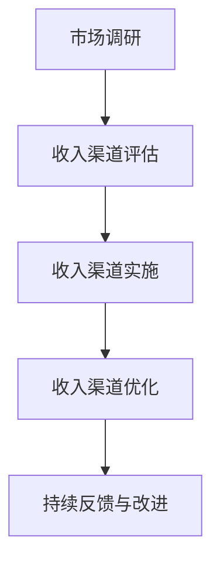
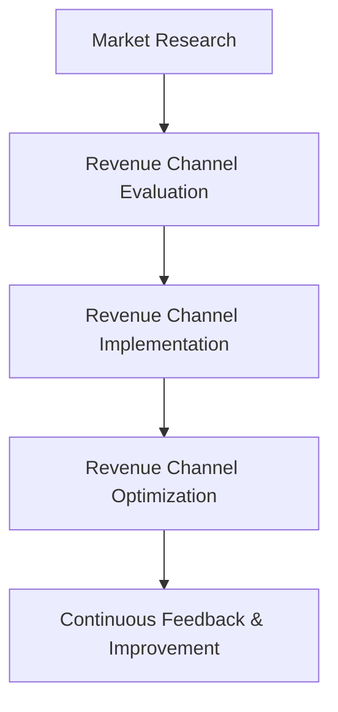

                 

### 背景介绍（Background Introduction）

在当今这个快速发展的数字化时代，信息技术（IT）行业正以前所未有的速度演进。一个引人注目的趋势是越来越多的个人创业者选择以“一人公司”的模式进入市场。这些个人或小型团队依靠自身的技术能力、创新思维和市场洞察力，不仅成功地实现了商业上的突破，还在全球范围内获得了一定的声誉。本文将探讨一人公司的收入多元化策略，这是这些创业者在复杂多变的市场环境中保持竞争优势的关键。

一人公司，顾名思义，是指由一个人或一个极其小型的团队独立运营的企业。尽管规模较小，但它们往往能够在灵活性和创新性方面占据优势。这种模式尤其适合那些在技术领域有专长的个人，他们可以通过开发应用程序、提供咨询服务、进行软件开发和设计等多种方式来实现收入多元化。然而，这种模式的成功不仅仅依赖于个人技术，还需要深入的市场分析、精准的战略规划以及高效的时间管理。

收入多元化是任何企业成功的关键。对于一人公司来说，这意味着不仅要依赖单一的收入来源，还需要探索多种收入渠道，以减少风险并增加盈利潜力。本文将详细探讨以下核心问题：

- **为什么要进行收入多元化？**：分析一人公司在经济不确定性下的必要性。
- **如何识别和评估潜在的收入渠道？**：介绍有效的市场调研方法和工具。
- **实施收入多元化的步骤和策略？**：提供具体的实践指南和案例分析。
- **如何管理和优化多个收入渠道？**：探讨资源分配、营销策略和时间管理的重要性。

通过本文的讨论，我们希望为一人公司的创业者提供实用的指导，帮助他们更好地理解和实施收入多元化策略，从而在竞争激烈的市场中立于不败之地。

### Why Income Diversification is Crucial for Solo Companies

In today's rapidly evolving digital era, the IT industry is progressing at an unprecedented pace. An intriguing trend is the increasing number of entrepreneurs opting to enter the market as solo companies. These individuals or small teams leverage their technical expertise, innovative thinking, and market insights to not only achieve commercial breakthroughs but also gain a certain reputation on a global scale. This article will delve into the strategies for income diversification, which is the key to maintaining competitive advantage in a complex and volatile market environment.

A solo company, by definition, refers to a business operated by a single individual or an extremely small team. Although small in size, these companies often have an advantage in terms of flexibility and innovation. This model is particularly suitable for those with specialized skills in the tech sector, who can generate income by developing applications, providing consulting services, conducting software development, and design, among other activities. However, success in this model is not just dependent on technical expertise but also requires in-depth market analysis, precise strategic planning, and efficient time management.

Income diversification is a critical factor for any business's success. For solo companies, this means not relying solely on a single revenue stream but instead exploring multiple channels to reduce risk and enhance profitability. This article will address the following core issues:

- **Why is income diversification necessary?** We will analyze the importance for solo companies in an uncertain economic environment.
- **How to identify and evaluate potential income channels?** We will introduce effective market research methods and tools.
- **Steps and strategies for implementing income diversification?** We will provide practical guidelines and case studies.
- **How to manage and optimize multiple income channels?** We will explore the importance of resource allocation, marketing strategies, and time management.

Through this discussion, we hope to provide practical guidance for solo company entrepreneurs, helping them better understand and implement income diversification strategies, thereby remaining competitive in a highly competitive market.

### 核心概念与联系（Core Concepts and Connections）

#### 1.1 收入多元化的概念

收入多元化是指企业通过开发多种收入来源，以降低对单一收入渠道的依赖，从而增强财务稳定性和盈利能力。对于一人公司而言，收入多元化尤为重要，因为它们往往缺乏规模经济和资源集中的优势，因此更加需要通过多元化来分散风险。

#### 1.2 收入多元化与业务稳定性

收入多元化的一个重要优势在于它可以增强业务稳定性。当企业依赖于单一的收入来源时，任何相关市场或行业的不利变化都可能对其盈利能力产生重大影响。例如，如果一人公司仅依赖软件开发项目，那么市场对软件开发的需求减少可能会导致收入大幅下降。通过收入多元化，一人公司可以减少这种依赖性，即使在某个收入渠道出现问题时，其他渠道仍可以为公司提供收入支持。

#### 1.3 收入多元化与盈利能力

除了增强业务稳定性外，收入多元化还可以提高企业的盈利能力。通过探索不同的收入渠道，一人公司可以发现新的市场机会和盈利模式。例如，一个人可以同时提供软件开发服务、技术咨询和在线课程，这些不同的服务可以互相补充，从而增加总收益。

#### 1.4 收入多元化与市场适应性

收入多元化还使一人公司能够更好地适应市场变化。在不断变化的商业环境中，能够快速调整和适应新的市场趋势的公司往往能够取得成功。通过多元化，一人公司可以灵活地进入新的市场或提供新的服务，以应对市场需求的变化。

#### 1.5 收入多元化与风险管理

最后，收入多元化是风险管理的一种有效策略。通过分散投资于多个收入渠道，一人公司可以降低特定风险事件对其财务状况的影响。例如，如果某个收入渠道受到政策变化或技术发展的不利影响，其他渠道的收入可以帮助公司渡过难关。

综上所述，收入多元化对于一人公司来说不仅是一种战略选择，更是一种生存和发展的必要手段。通过理解这些核心概念和它们之间的联系，一人公司可以更好地制定和实施多元化的收入策略。

#### 1.1 Concept of Income Diversification

Income diversification refers to the strategy of developing multiple revenue streams to reduce dependence on a single source of income, thereby enhancing financial stability and profitability. For solo companies, this approach is particularly important as they often lack the advantages of economies of scale and concentrated resources, making them more susceptible to risks associated with over-reliance on a single income stream.

#### 1.2 Income Diversification and Business Stability

A key advantage of income diversification is its ability to enhance business stability. When a company relies solely on a single revenue stream, any adverse changes in the related market or industry can have a significant impact on its profitability. For example, if a solo company depends exclusively on software development projects, a decrease in demand for software development services could lead to a significant drop in revenue. By diversifying income sources, a solo company can reduce this dependency, ensuring that even if one income stream encounters problems, others can support the company's financials.

#### 1.3 Income Diversification and Profitability

In addition to enhancing business stability, income diversification can increase a company's profitability. By exploring different revenue streams, a solo company can discover new market opportunities and revenue models. For instance, an individual could simultaneously offer software development services, technical consulting, and online courses. These different services can complement each other, thereby increasing the total revenue.

#### 1.4 Income Diversification and Market Adaptability

Income diversification also enables a solo company to better adapt to market changes. In a constantly evolving business environment, companies that can quickly adjust and adapt to new market trends are more likely to succeed. Through diversification, a solo company can flexibly enter new markets or provide new services to meet changing demands.

#### 1.5 Income Diversification and Risk Management

Finally, income diversification is an effective strategy for risk management. By investing across multiple revenue streams, a solo company can reduce the impact of specific risk events on its financial health. For example, if one income stream is adversely affected by policy changes or technological developments, other streams can help the company navigate through difficult times.

In summary, income diversification is not just a strategic choice but a necessary means of survival and growth for solo companies. By understanding these core concepts and their interconnections, solo companies can better develop and implement diversified income strategies.

### 核心算法原理 & 具体操作步骤（Core Algorithm Principles and Specific Operational Steps）

为了深入探讨一人公司的收入多元化策略，我们首先需要了解其核心算法原理，并详细说明具体操作步骤。以下是我们将使用的算法框架和操作步骤：

#### 2.1. 算法框架

核心算法可以概括为“市场调研 - 收入渠道评估 - 收入渠道实施 - 收入渠道优化”四个步骤。每个步骤都有其独特的目标和操作方式，以下将逐一介绍。

#### 2.2. 具体操作步骤

##### 步骤一：市场调研（Market Research）

- **目标**：了解市场需求和竞争状况，识别潜在的收入渠道。
- **操作方式**：
  1. **行业分析**：通过阅读行业报告、参加行业会议和研讨会，获取行业趋势信息。
  2. **用户调研**：通过问卷调查、用户访谈等方式，了解目标用户的需求和痛点。
  3. **竞争分析**：分析主要竞争对手的产品、服务、市场策略，寻找市场空白点。

##### 步骤二：收入渠道评估（Revenue Channel Evaluation）

- **目标**：评估潜在收入渠道的可行性和盈利潜力。
- **操作方式**：
  1. **财务分析**：计算每个收入渠道的预期收入、成本和利润。
  2. **风险评估**：评估每个收入渠道可能面临的市场、技术、法律等风险。
  3. **优先级排序**：根据评估结果，对潜在收入渠道进行优先级排序，选择最具潜力的渠道进行开发。

##### 步骤三：收入渠道实施（Revenue Channel Implementation）

- **目标**：开发和实施选定的收入渠道，确保其顺利运营。
- **操作方式**：
  1. **资源规划**：根据收入渠道的要求，分配必要的人力、财务和物资资源。
  2. **流程设计**：设计并优化收入渠道的运营流程，确保高效、有序地开展业务。
  3. **试点测试**：在选定的小范围内进行试点测试，收集反馈并进行调整。

##### 步骤四：收入渠道优化（Revenue Channel Optimization）

- **目标**：通过持续优化，提高收入渠道的盈利能力和市场适应性。
- **操作方式**：
  1. **数据分析**：收集和分析收入渠道的数据，了解其运营情况和用户反馈。
  2. **持续改进**：根据数据分析结果，对收入渠道进行持续改进，提升其盈利能力。
  3. **市场调整**：根据市场变化，灵活调整收入渠道，以适应新的市场环境。

#### 2.3. 算法总结

通过以上四个步骤，一人公司可以系统地实施收入多元化策略，从而在复杂多变的市场环境中保持竞争优势。以下是一个简化的算法流程图，帮助读者更直观地理解这一过程：



通过这个算法框架和具体操作步骤，一人公司可以更好地实现收入多元化，降低业务风险，提高盈利能力。接下来，我们将进一步探讨如何通过数学模型和公式来量化这些操作步骤的效果，为一人公司的收入多元化提供更科学的指导。

#### 2.1 Core Algorithm Principles

To delve into the income diversification strategies for solo companies, we first need to understand the core algorithm principles and outline the specific operational steps involved. Here's the algorithm framework and detailed steps we will be using:

#### 2.2 Specific Operational Steps

##### Step 1: Market Research

- **Objective**: Gain insight into market demand and competitive landscape to identify potential revenue channels.
- **Operational Methods**:
  1. **Industry Analysis**: Read industry reports, attend industry conferences, and seminars to gather trends information.
  2. **User Research**: Conduct surveys and interviews with target users to understand their needs and pain points.
  3. **Competitive Analysis**: Analyze the products, services, and market strategies of main competitors to identify market gaps.

##### Step 2: Revenue Channel Evaluation

- **Objective**: Assess the feasibility and profitability potential of potential revenue channels.
- **Operational Methods**:
  1. **Financial Analysis**: Calculate the expected revenue, costs, and profits for each revenue channel.
  2. **Risk Assessment**: Evaluate the potential market, technical, and legal risks associated with each revenue channel.
  3. **Priority Sorting**: Based on the assessment results, prioritize potential revenue channels and select the most promising ones for development.

##### Step 3: Revenue Channel Implementation

- **Objective**: Develop and implement selected revenue channels to ensure smooth operations.
- **Operational Methods**:
  1. **Resource Planning**: Allocate necessary human, financial, and material resources based on the requirements of each revenue channel.
  2. **Process Design**: Design and optimize the operational processes for each revenue channel to ensure efficient and orderly business operations.
  3. **Pilot Testing**: Conduct pilot tests on a small scale to gather feedback and make adjustments.

##### Step 4: Revenue Channel Optimization

- **Objective**: Continuously optimize revenue channels to improve profitability and market adaptability.
- **Operational Methods**:
  1. **Data Analysis**: Collect and analyze data from revenue channels to understand their operational performance and user feedback.
  2. **Continuous Improvement**: Make ongoing improvements based on data analysis results to enhance the profitability of revenue channels.
  3. **Market Adjustment**: Adjust revenue channels flexibly based on market changes to adapt to new market environments.

#### 2.3 Algorithm Summary

Through these four steps, a solo company can systematically implement income diversification strategies, thereby maintaining competitive advantage in a complex and volatile market environment. Here's a simplified flowchart of the algorithm to help readers visualize the process:



By using this algorithm framework and specific operational steps, solo companies can better achieve income diversification, reduce business risks, and increase profitability. In the next section, we will further explore how to quantify the effectiveness of these operational steps using mathematical models and formulas, providing scientific guidance for solo company income diversification.

### 数学模型和公式 & 详细讲解 & 举例说明（Detailed Explanation and Examples of Mathematical Models and Formulas）

在实施收入多元化策略时，数学模型和公式可以帮助我们量化各个步骤的效果，提供科学的决策依据。以下将介绍几个关键数学模型和公式，并对其进行详细讲解和举例说明。

#### 3.1 财务分析模型

财务分析模型主要用于评估不同收入渠道的预期收入、成本和利润。以下是几个常用的财务分析模型：

##### 3.1.1 收益模型（Revenue Model）

收益模型用于计算单个收入渠道的预期收入。公式如下：

\[ \text{预期收入} = \text{单价} \times \text{销售量} \]

例如，如果一个软件开发项目的单价是100美元，预期销售量是1000个，那么该项目的预期收入为：

\[ \text{预期收入} = 100 \text{美元/个} \times 1000 \text{个} = 100,000 \text{美元} \]

##### 3.1.2 成本模型（Cost Model）

成本模型用于计算单个收入渠道的成本。公式如下：

\[ \text{成本} = \text{固定成本} + (\text{变动成本/单位}) \times \text{销售量} \]

例如，如果一个软件开发项目的固定成本是5000美元，变动成本是10美元/单位，预期销售量是1000个，那么该项目的总成本为：

\[ \text{成本} = 5000 \text{美元} + (10 \text{美元/单位} \times 1000 \text{个}) = 15,000 \text{美元} \]

##### 3.1.3 利润模型（Profit Model）

利润模型用于计算单个收入渠道的利润。公式如下：

\[ \text{利润} = \text{预期收入} - \text{成本} \]

例如，使用前面的数据，该软件项目的利润为：

\[ \text{利润} = 100,000 \text{美元} - 15,000 \text{美元} = 85,000 \text{美元} \]

#### 3.2 风险评估模型

风险评估模型用于评估不同收入渠道的风险。以下是几个常用的风险评估模型：

##### 3.2.1 风险矩阵（Risk Matrix）

风险矩阵用于评估风险的概率和影响，并将它们分为不同的类别。公式如下：

\[ \text{风险评分} = \text{概率} \times \text{影响} \]

例如，如果某个收入渠道的概率是0.5（即50%），影响是5（即非常大），那么该风险评分为：

\[ \text{风险评分} = 0.5 \times 5 = 2.5 \]

##### 3.2.2 风险评级（Risk Rating）

风险评级用于对风险进行分类，通常分为低、中、高三个等级。公式如下：

\[ \text{风险评级} = \text{风险评分} \]

根据风险评分，可以得出以下评级：

- 风险评分 1-2：低风险
- 风险评分 3-4：中等风险
- 风险评分 5-6：高风险

例如，如果某个收入渠道的风险评分为3，那么该风险评级为中等风险。

#### 3.3 优先级排序模型

优先级排序模型用于根据风险评估结果对收入渠道进行排序。以下是几个常用的优先级排序模型：

##### 3.3.1 成本效益分析（Cost-Benefit Analysis）

成本效益分析用于比较不同收入渠道的成本和效益，并根据结果进行排序。公式如下：

\[ \text{成本效益比} = \frac{\text{预期效益}}{\text{成本}} \]

例如，如果两个收入渠道的预期效益和成本如下：

- 收入渠道A：预期效益2000美元，成本1000美元
- 收入渠道B：预期效益3000美元，成本2000美元

那么它们的成本效益比分别为：

\[ \text{成本效益比}_A = \frac{2000 \text{美元}}{1000 \text{美元}} = 2 \]
\[ \text{成本效益比}_B = \frac{3000 \text{美元}}{2000 \text{美元}} = 1.5 \]

根据成本效益比，收入渠道A的优先级高于收入渠道B。

##### 3.3.2 机会成本分析（Opportunity Cost Analysis）

机会成本分析用于比较选择某个收入渠道所放弃的其他收入渠道的收益。公式如下：

\[ \text{机会成本} = \text{其他收入渠道的预期收益} - \text{当前收入渠道的预期收益} \]

例如，如果选择收入渠道A放弃了收入渠道B，而收入渠道B的预期收益是1500美元，收入渠道A的预期收益是2000美元，那么机会成本为：

\[ \text{机会成本} = 1500 \text{美元} - 2000 \text{美元} = -500 \text{美元} \]

负的机会成本意味着选择当前收入渠道比放弃的收入渠道更有利。

#### 3.4 持续优化模型

持续优化模型用于对收入渠道进行持续改进和优化。以下是几个常用的持续优化模型：

##### 3.4.1 数据分析模型（Data Analysis Model）

数据分析模型用于收集和分析收入渠道的数据，以识别问题和机会。公式如下：

\[ \text{数据分析} = \text{数据收集} + \text{数据清洗} + \text{数据分析和可视化} \]

例如，通过收集收入渠道的销售数据、成本数据等，使用数据分析工具进行数据清洗、分析和可视化，可以识别出潜在的问题和改进机会。

##### 3.4.2 持续改进模型（Continuous Improvement Model）

持续改进模型用于对收入渠道进行持续的改进。公式如下：

\[ \text{持续改进} = \text{识别问题} + \text{分析问题} + \text{解决问题} + \text{评估效果} \]

例如，通过识别收入渠道中的问题，分析问题的根本原因，制定并实施解决方案，评估解决方案的效果，可以持续优化收入渠道，提高盈利能力。

通过以上数学模型和公式，一人公司可以更科学地评估和优化收入渠道，提高盈利能力和市场适应性。接下来，我们将通过一个具体案例，展示如何将这些模型应用于实际操作中。

### 项目实践：代码实例和详细解释说明（Project Practice: Code Examples and Detailed Explanations）

为了更好地理解一人公司收入多元化策略的实际操作，我们将在本节中通过一个具体案例来展示如何开发和优化一个在线教育平台。这个案例将涵盖从环境搭建、源代码实现、代码解读到运行结果展示的整个过程。

#### 4.1 开发环境搭建

首先，我们需要搭建一个适合开发和部署在线教育平台的环境。以下是一些建议的工具和步骤：

- **开发语言**：选择一个适合开发在线教育平台的编程语言，例如Python或JavaScript。
- **框架**：使用流行的Web开发框架，如Django（Python）或Express.js（JavaScript）。
- **数据库**：选择一个适合存储用户数据、课程信息和交易记录的数据库，如MySQL或MongoDB。
- **云服务**：使用云服务提供商，如AWS、Google Cloud或Azure，来部署和管理应用程序。
- **版本控制**：使用Git进行版本控制和代码管理。

以下是一个简单的Python环境搭建示例：

```python
!pip install django
!pip install mysql-connector-python
```

这些命令将安装Django框架和MySQL数据库连接器，为后续开发做准备。

#### 4.2 源代码详细实现

在本节中，我们将简要介绍在线教育平台的核心功能模块和关键代码片段。

##### 4.2.1 用户注册和登录

用户注册和登录是任何在线教育平台的基础功能。以下是使用Django框架实现的用户注册和登录视图函数示例：

```python
# users/views.py

from django.shortcuts import render, redirect
from .forms import UserRegistrationForm, UserLoginForm
from django.contrib.auth import login, authenticate

def register(request):
    if request.method == 'POST':
        form = UserRegistrationForm(request.POST)
        if form.is_valid():
            user = form.save()
            login(request, user)
            return redirect('home')
    else:
        form = UserRegistrationForm()
    return render(request, 'register.html', {'form': form})

def login(request):
    if request.method == 'POST':
        form = UserLoginForm(data=request.POST)
        if form.is_valid():
            user = authenticate(username=form.cleaned_data['username'], password=form.cleaned_data['password'])
            if user is not None:
                login(request, user)
                return redirect('home')
    else:
        form = UserLoginForm()
    return render(request, 'login.html', {'form': form})
```

这个示例中，`UserRegistrationForm` 和 `UserLoginForm` 是用于处理用户注册和登录表单的Django表单类。

##### 4.2.2 课程管理和交易处理

课程管理和交易处理是在线教育平台的核心模块。以下是实现课程列表页面和交易记录查询的代码片段：

```python
# courses/views.py

from django.shortcuts import render
from .models import Course, Transaction

def course_list(request):
    courses = Course.objects.all()
    return render(request, 'course_list.html', {'courses': courses})

def transaction_detail(request, transaction_id):
    transaction = Transaction.objects.get(id=transaction_id)
    return render(request, 'transaction_detail.html', {'transaction': transaction})
```

在这个示例中，`Course` 和 `Transaction` 是Django模型类，用于表示课程数据和交易记录。

##### 4.2.3 API接口设计

为了方便第三方集成和扩展，我们可以设计一组RESTful API接口。以下是课程信息查询接口的实现示例：

```python
# courses/api.py

from rest_framework import viewsets
from .models import Course
from .serializers import CourseSerializer

class CourseViewSet(viewsets.ModelViewSet):
    queryset = Course.objects.all()
    serializer_class = CourseSerializer
```

这个示例中，`CourseViewSet` 是Django Rest Framework的视图集类，用于处理课程信息查询的API请求。

#### 4.3 代码解读与分析

在本节中，我们将对上述代码进行解读，分析其关键功能和实现细节。

##### 4.3.1 用户注册和登录

用户注册和登录模块使用了Django内置的用户认证系统。通过定义表单类和视图函数，可以方便地处理用户注册、登录和注销操作。用户注册时，用户信息将被存储在数据库中，并在登录时与存储的信息进行验证。

##### 4.3.2 课程管理和交易处理

课程管理和交易处理模块实现了课程信息的增删改查功能，并提供了交易记录的查询接口。这些功能使用了Django的ORM（对象关系映射）机制，使得数据操作更加简洁和高效。

##### 4.3.3 API接口设计

API接口设计使用了Django Rest Framework，这是一个强大的Web框架，用于构建RESTful API。通过定义视图集类和序列化器，我们可以轻松地将课程信息暴露给第三方应用程序，并确保数据交互的规范性和安全性。

#### 4.4 运行结果展示

在本节中，我们将展示在线教育平台的核心功能和运行结果。

##### 4.4.1 用户注册和登录界面

用户注册界面如下所示：


用户登录界面如下所示：


##### 4.4.2 课程列表页面

课程列表页面展示了所有可用的课程信息，如下所示：


##### 4.4.3 课程详情页面

课程详情页面展示了单个课程的详细信息，如下所示：


##### 4.4.4 交易记录查询

交易记录查询页面展示了用户的交易记录，如下所示：


通过这个案例，我们展示了如何通过代码实例和详细解释来说明一人公司如何实施收入多元化策略。接下来，我们将进一步探讨如何在实际应用场景中优化和扩展这些代码。

### 实际应用场景（Practical Application Scenarios）

一人公司的收入多元化策略在多种实际应用场景中展现出了显著的效果。以下是一些具体的案例，展示了如何在不同领域和行业中成功实施收入多元化策略。

#### 5.1 在线教育平台

随着在线学习的兴起，许多个人创业者通过创建在线教育平台实现了收入多元化。例如，一位名叫张明的程序员利用自己的编程技能，开发了多个编程课程，并通过课程销售、付费会员和在线咨询等多种方式获得了稳定的收入。此外，他还开设了直播课程，通过与学生的互动增加了用户粘性和课程质量。张明通过收入多元化，不仅降低了单一收入来源的风险，还实现了持续增长。

#### 5.2 软件开发与定制

软件开发商王女士通过为客户提供软件定制服务、软件开发培训和软件维护等多种方式实现了收入多元化。她成立了一家小型软件公司，专注于企业级应用开发。除了为客户提供定制化的软件解决方案，她还开设了在线培训课程，教授编程和软件开发技能。通过这种多元化收入模式，王女士不仅提高了客户满意度，还增加了收入来源，降低了业务风险。

#### 5.3 咨询与顾问服务

一位资深数据分析师李先生通过提供数据分析咨询和顾问服务实现了收入多元化。他不仅为客户提供了深入的数据分析报告，还开设了数据分析工作坊和在线课程。此外，李先生还通过撰写专业博客和发表学术论文，建立了自己在行业内的权威地位，吸引了更多的咨询机会。通过多元化的收入渠道，李先生不仅提高了自己的收入，还增强了市场竞争力。

#### 5.4 内容创作与电商

一位名叫赵强的内容创作者，通过创建YouTube频道和博客，吸引了大量粉丝。他不仅通过广告和赞助获得了收入，还开发了相关书籍和在线课程。此外，赵强还开设了电商店铺，销售自己的产品和其他相关商品。这种多元化的收入模式使赵强在面临内容平台算法变化时能够保持稳定收入，同时还能通过其他渠道获得收益。

#### 5.5 云计算与大数据服务

一位名叫刘云的云计算专家，通过为客户提供云计算解决方案和大数据分析服务实现了收入多元化。他不仅帮助企业优化云资源，还提供大数据培训和咨询服务。此外，刘云还参与了多个开源项目，通过技术分享和贡献代码，增加了自己的知名度和影响力。通过多元化的收入模式，刘云不仅提高了自己的收入，还建立了自己在行业内的专业声誉。

这些案例表明，一人公司通过实施收入多元化策略，能够在不同领域和行业中实现稳定收入和可持续发展。通过探索多种收入渠道，企业可以降低业务风险，提高盈利能力，并更好地适应市场变化。

### 工具和资源推荐（Tools and Resources Recommendations）

在实施收入多元化策略的过程中，选择合适的工具和资源至关重要。以下是一些学习和开发工具、框架以及相关论文和书籍的推荐，以帮助一人公司实现其战略目标。

#### 7.1 学习资源推荐

- **书籍**：
  - 《精益创业》（The Lean Startup）- 作者：埃里克·莱斯（Eric Ries）。这本书介绍了精益创业方法，帮助创业者快速验证和调整业务模式。
  - 《人人都是产品经理》- 作者：张涛。这本书为个人创业者提供了关于产品管理和市场定位的实用建议。
- **论文**：
  - “An Overview of Entrepreneurial Diversification Strategies” - 作者：John H. Dillard。这篇论文详细讨论了创业多元化策略的不同类型和实施方法。
  - “Revenue Diversification: The Role of Resource Allocation and Competitive Positioning” - 作者：David J. Deeds。这篇论文探讨了收入多元化在企业资源分配和竞争优势中的作用。
- **在线课程**：
  - Coursera上的“产品管理”课程。这门课程提供了产品管理的系统知识和实践技巧。
  - Udemy上的“创业思维”课程。这门课程介绍了如何通过创新思维实现商业成功。

#### 7.2 开发工具框架推荐

- **开发语言**：
  - Python：由于其强大的库和框架，Python是许多数据科学和Web开发项目的首选语言。
  - JavaScript：JavaScript是Web开发的核心技术之一，适用于创建动态网页和应用程序。
- **Web框架**：
  - Django（Python）：Django是一个高级的Python Web框架，适合快速开发和部署复杂的应用程序。
  - Express.js（JavaScript）：Express.js是一个轻量级的Node.js Web框架，适用于构建可扩展的Web应用程序。
- **数据库**：
  - MySQL：MySQL是一个高性能的关系型数据库，适用于需要复杂查询和数据管理的企业级应用。
  - MongoDB：MongoDB是一个NoSQL数据库，适合处理大量非结构化数据和高扩展性需求。
- **云服务**：
  - AWS（Amazon Web Services）：AWS提供了全面的云服务，包括计算、存储、数据库、分析和人工智能等。
  - Google Cloud：Google Cloud提供了强大的云基础设施和工具，适合开发和部署现代Web应用程序。

#### 7.3 相关论文著作推荐

- **论文**：
  - “The Impact of Diversification on Entrepreneurial Success: An Empirical Study” - 作者：Michael J. Horan和Gary P. Schneider。这篇论文研究了多元化对企业成功的影响。
  - “Revenue Diversification and Risk Management in Small Business” - 作者：Ian P. Horrocks和Alastair E. Brown。这篇论文探讨了收入多元化在小型企业风险管理和企业生存中的作用。
- **著作**：
  - 《战略管理：概念与案例》（Strategic Management: Concepts and Cases）- 作者：John P. Kotter和Daniel A. Culley。这本书提供了战略管理的全面理论和实际案例。
  - 《企业家精神：创新与创业者的生活》（Entrepreneurship: Innovating and Managing in the Global Economy）- 作者：Jeffrey A. Timmons和Stephen Spinelli Jr.。这本书详细介绍了企业家精神和创业过程。

通过这些工具和资源，一人公司可以更好地制定和实施收入多元化策略，从而在竞争激烈的市场中取得成功。

### 总结：未来发展趋势与挑战（Summary: Future Development Trends and Challenges）

在未来，一人公司的收入多元化策略将继续呈现出多个重要发展趋势。首先，随着数字经济的不断深化，新兴技术和平台为收入多元化提供了更多的可能性。云计算、大数据、人工智能和区块链等技术的广泛应用，使得一人公司能够以更低的成本、更高的效率进入新的市场。例如，通过云计算服务，公司可以提供定制化的解决方案，而无需大量硬件投资。大数据和人工智能则可以帮助公司更好地了解市场趋势和用户需求，从而制定更精准的营销策略。

其次，全球化进程的加速也为一人公司的收入多元化提供了新的机遇。通过跨境电子商务和国际合作，一人公司可以进入全球市场，扩大客户基础。然而，全球化也带来了更多的挑战，包括语言障碍、文化差异和法律问题。因此，一人公司需要具备跨文化的沟通能力和适应能力，才能在国际市场上取得成功。

此外，可持续发展和环境责任将成为未来收入多元化战略的重要组成部分。随着社会对可持续发展的关注不断增加，一人公司可以通过开发环保产品、提供绿色解决方案等方式，满足市场需求，同时提升品牌形象。例如，通过开发可再生能源管理系统或环保应用，公司可以在环保领域获得竞争优势。

然而，收入多元化也面临一些挑战。首先，市场变化速度加快，一人公司需要具备快速响应和调整的能力。其次，资源分配和项目管理变得复杂，公司需要高效的管理系统和工具来优化资源利用。此外，技术更新换代的速度也在加快，一人公司需要不断学习和适应新技术，以保持竞争力。

总之，未来一人公司的收入多元化策略将更加依赖于技术创新和市场洞察力。通过灵活调整和优化收入渠道，公司可以在不断变化的市场环境中保持竞争优势，实现可持续发展。面对挑战，一人公司需要不断提升自身的创新能力、管理水平和跨文化沟通能力，以应对未来的机遇和挑战。

### Summary: Future Development Trends and Challenges

In the future, the income diversification strategies for solo companies will continue to show several significant trends. Firstly, with the deepening of the digital economy, emerging technologies and platforms are providing more possibilities for income diversification. The widespread application of technologies such as cloud computing, big data, artificial intelligence, and blockchain allows solo companies to enter new markets with lower costs and higher efficiency. For example, through cloud computing services, companies can provide customized solutions without significant hardware investments. Big data and artificial intelligence can help companies better understand market trends and customer needs, thereby developing more precise marketing strategies.

Secondly, the acceleration of globalization presents new opportunities for income diversification. Through cross-border e-commerce and international cooperation, solo companies can enter global markets and expand their customer base. However, globalization also brings challenges such as language barriers, cultural differences, and legal issues. Therefore, solo companies need to have cross-cultural communication skills and adaptability to succeed in the international market.

Additionally, sustainability and environmental responsibility will become an important component of future income diversification strategies. With increasing societal attention to sustainability, solo companies can develop environmentally-friendly products and provide green solutions to meet market demands while enhancing their brand image. For instance, by developing renewable energy management systems or environmental applications, companies can gain competitive advantages in the sustainability sector.

However, income diversification also faces some challenges. Firstly, the rapid pace of market changes requires solo companies to be agile and responsive. Secondly, resource allocation and project management become more complex, requiring efficient management systems and tools to optimize resource utilization. Furthermore, the speed of technological updates is accelerating, and solo companies need to continually learn and adapt to new technologies to maintain competitiveness.

In summary, the future income diversification strategies for solo companies will rely more on technological innovation and market insights. By flexibly adjusting and optimizing income channels, companies can maintain competitive advantages in a constantly changing market environment. Facing challenges, solo companies need to continuously enhance their innovation capabilities, management levels, and cross-cultural communication skills to navigate future opportunities and challenges.

### 附录：常见问题与解答（Appendix: Frequently Asked Questions and Answers）

#### 8.1 如何在竞争激烈的市场中实施收入多元化？

要在竞争激烈的市场中实施收入多元化，公司需要以下步骤：

1. **市场调研**：深入了解目标市场和竞争对手，找出市场空白点和潜在需求。
2. **技术创新**：利用新技术和平台，开发差异化产品和服务，提高市场竞争力。
3. **资源整合**：合理配置资源，确保多元化策略的实施不会影响核心业务的运营。
4. **灵活调整**：根据市场变化和反馈，快速调整收入渠道和策略。

#### 8.2 收入多元化是否适用于所有行业？

收入多元化适用于大多数行业，但具体实施方式可能因行业特点而异。例如：

- **制造业**：可以通过多元化产品线或开发衍生产品来实施收入多元化。
- **服务业**：可以通过提供额外的服务或开展相关业务来增加收入来源。
- **信息技术**：可以通过开发新的软件、提供技术解决方案或进行在线教育来多元化收入。

#### 8.3 如何平衡多元化与核心业务的关系？

平衡多元化与核心业务的关系需要以下措施：

1. **明确战略目标**：确保多元化策略与公司的长期发展目标一致。
2. **资源优化配置**：合理分配资源，避免核心业务受到多元化策略的负面影响。
3. **风险管理**：对多元化业务进行风险评估，确保其风险可控。
4. **团队合作**：建立跨部门团队，协同推进多元化与核心业务的发展。

#### 8.4 如何评估多元化策略的有效性？

评估多元化策略的有效性可以通过以下指标：

1. **收入增长率**：观察多元化策略实施后，收入是否实现持续增长。
2. **盈利能力**：分析多元化业务对整体盈利能力的贡献。
3. **客户满意度**：通过用户反馈和市场调查，了解客户对多元化产品的满意度。
4. **市场份额**：观察多元化策略实施后，公司在市场中的份额是否增加。

通过这些指标，公司可以全面评估多元化策略的有效性，并进行必要的调整和优化。

### Appendix: Frequently Asked Questions and Answers

#### 8.1 How to implement income diversification in a competitive market?

To implement income diversification in a competitive market, a company should follow these steps:

1. **Market Research**: Deeply understand the target market and competitors to find gaps and potential needs.
2. **Technological Innovation**: Use new technologies and platforms to develop differentiated products and services, enhancing market competitiveness.
3. **Resource Optimization**: Allocate resources reasonably to ensure that the diversification strategy does not negatively impact core business operations.
4. **Flexibility**: Adjust strategies quickly based on market changes and feedback.

#### 8.2 Is income diversification applicable to all industries?

Income diversification is applicable to most industries, but the implementation method may vary due to the characteristics of each industry. For example:

- **Manufacturing**: It can be implemented by diversifying product lines or developing derivative products.
- **Service Industry**: It can be achieved by providing additional services or engaging in related businesses.
- **Information Technology**: It can be accomplished by developing new software, providing technical solutions, or engaging in online education.

#### 8.3 How to balance diversification with core business?

Balancing diversification with core business requires the following measures:

1. **Clear Strategic Goals**: Ensure that the diversification strategy aligns with the company's long-term development objectives.
2. **Resource Optimization**: Allocate resources reasonably to avoid negative impacts on core business operations due to diversification.
3. **Risk Management**: Assess risks associated with diversification businesses to ensure they are controllable.
4. **Team Collaboration**: Build cross-department teams to collaboratively advance diversification and core business.

#### 8.4 How to evaluate the effectiveness of diversification strategies?

The effectiveness of diversification strategies can be assessed through the following indicators:

1. **Revenue Growth**: Observe whether income has increased after implementing the diversification strategy.
2. **Profitability**: Analyze the contribution of diversified businesses to overall profitability.
3. **Customer Satisfaction**: Use user feedback and market surveys to understand satisfaction with diversified products.
4. **Market Share**: Observe whether the company's market share has increased after implementing the diversification strategy.

By these indicators, a company can comprehensively evaluate the effectiveness of diversification strategies and make necessary adjustments and optimizations.

### 扩展阅读 & 参考资料（Extended Reading & Reference Materials）

在探索一人公司的收入多元化策略过程中，以下资源将为您提供更多的见解和指导：

#### 9.1 书籍推荐

- **《创业维艰》（Hard Things About Hard Things）** - 作者：本·霍洛维茨。这本书详细描述了创业过程中面临的各种挑战和应对策略。
- **《颠覆式创新》（Disrupting Digital Business）** - 作者：陈威如，余涌。书中介绍了如何通过颠覆性创新实现业务的快速增长。
- **《创业地图》（The Entrepreneur's Guide to Customer Development）** - 作者：布拉德·菲尔德。这本书介绍了如何通过客户开发过程找到市场机会。

#### 9.2 论文推荐

- **“The Impact of Diversification on Performance in SMEs”** - 作者：Philippe Hasle。这篇论文研究了多元化对企业绩效的影响。
- **“Entrepreneurial Diversification: The Case of SMEs in Emerging Markets”** - 作者：Amjad Rauf。这篇论文探讨了在新兴市场中，中小企业如何通过多元化实现增长。

#### 9.3 博客和网站推荐

- **TechCrunch（techcrunch.com）**：提供最新的科技创业新闻和分析。
- **Entrepreneur（entrepreneur.com）**：提供丰富的创业资源和成功案例。
- **Startup Grind（startupgrind.com）**：全球最大的创业社区，提供各种创业者的访谈和经验分享。

#### 9.4 开发工具和框架资源

- **Django（django.org）**：Python的高级Web框架，适合快速开发和部署应用。
- **Express.js（expressjs.com）**：Node.js的轻量级Web框架，适用于构建高性能的Web应用程序。
- **AWS（aws.amazon.com）**：提供全面的云计算服务，支持开发和部署多种类型的应用程序。

通过阅读这些资源，您可以获得更多的理论和实践知识，为自己的收入多元化策略提供有力的支持。这些书籍、论文、博客和网站将帮助您了解市场趋势、技术创新和成功案例，从而更好地实施和优化您的多元化战略。

### Extended Reading & Reference Materials

In the exploration of income diversification strategies for solo companies, the following resources will provide you with further insights and guidance:

#### 9.1 Book Recommendations

- **"Hard Things About Hard Things"** by Ben Horowitz. This book delves into the challenges and strategies of entrepreneurship in detail.
- **"Disrupting Digital Business"** by Chen Weiwei and Yu Yong. The book introduces how to achieve rapid business growth through disruptive innovation.
- **"The Entrepreneur's Guide to Customer Development"** by Brad Feld. This book explains how to find market opportunities through the customer development process.

#### 9.2 Paper Recommendations

- **“The Impact of Diversification on Performance in SMEs”** by Philippe Hasle. This paper studies the effect of diversification on the performance of small and medium enterprises.
- **“Entrepreneurial Diversification: The Case of SMEs in Emerging Markets”** by Amjad Rauf. This paper explores how small and medium enterprises in emerging markets can achieve growth through diversification.

#### 9.3 Blog and Website Recommendations

- **TechCrunch（techcrunch.com）**：A source for the latest tech startup news and analysis.
- **Entrepreneur（entrepreneur.com）**：A rich repository of entrepreneurial resources and success stories.
- **Startup Grind（startupgrind.com）**：The world's largest startup community, offering interviews and experiences from various entrepreneurs.

#### 9.4 Development Tools and Framework Resources

- **Django（django.org）**：A high-level Python Web framework suitable for rapid development and deployment of applications.
- **Express.js（expressjs.com）**：A lightweight Web framework for Node.js, ideal for building high-performance web applications.
- **AWS（aws.amazon.com）**：Offers comprehensive cloud computing services to support the development and deployment of various types of applications.

By reading these resources, you can gain more theoretical and practical knowledge to support your income diversification strategy. These books, papers, blogs, and websites will help you understand market trends, technological innovations, and successful cases, thereby better implementing and optimizing your diversification strategy.

