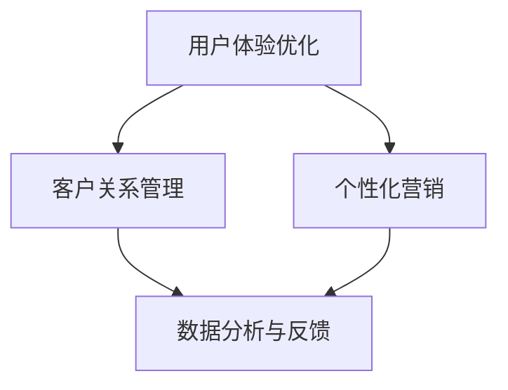
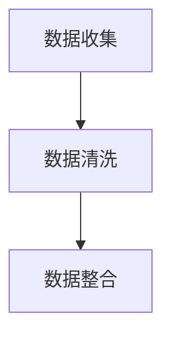
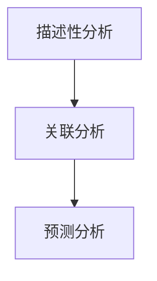
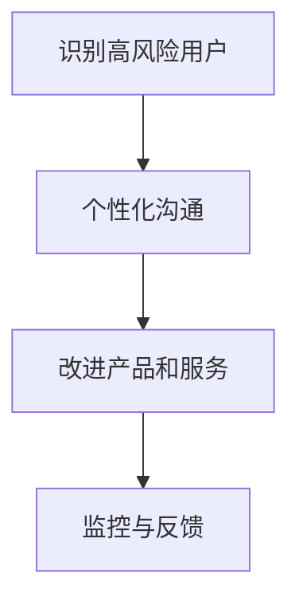
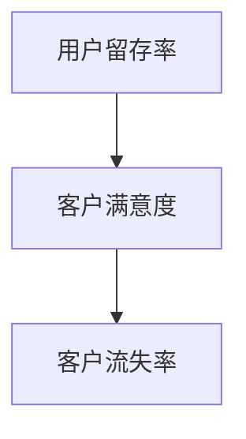

                 

### 文章标题

一人公司的用户留存策略与实施

**关键词：** 用户留存、一人公司、策略、实施、客户关系管理、数据分析、增长黑客

> **摘要：** 本文将探讨一人公司如何在激烈的市场竞争中实现用户留存，分析关键策略和其实施步骤，并提供实用的工具和资源推荐。文章旨在为一人公司的创始人提供有效的用户留存解决方案，以实现业务的持续增长。

-------------------

### 背景介绍（Background Introduction）

在当今快速变化的市场环境中，用户留存已成为企业成功的核心指标之一。对于一人公司（即由单一创始人或小型团队运营的企业）而言，用户留存尤为重要。由于资源和资金的有限，一人公司无法像大企业那样进行大规模的市场推广和用户服务。因此，如何有效地保留现有用户，避免流失，成为一人公司面临的主要挑战。

用户留存不仅仅关乎企业收入的稳定，它还影响着企业的品牌形象、口碑和长期发展。一个高用户留存率意味着企业能够更好地理解用户需求，提供更优质的产品和服务，从而形成正向循环，促进业务的持续增长。

本文将围绕以下主题展开：

1. 用户留存的重要性
2. 一人公司用户留存面临的挑战
3. 用户留存策略的核心概念与联系
4. 用户留存策略的实施步骤
5. 数学模型和公式的详细讲解
6. 项目实践：代码实例和详细解释说明
7. 实际应用场景
8. 工具和资源推荐
9. 总结：未来发展趋势与挑战
10. 附录：常见问题与解答
11. 扩展阅读与参考资料

通过本文的探讨，希望能为一人公司的创始人提供一套系统、可操作的用户留存策略，助力他们在激烈的市场竞争中脱颖而出。

-------------------

### 核心概念与联系（Core Concepts and Connections）

#### 3.1 用户留存率（Customer Retention Rate）

用户留存率是指在一定时间内，企业保留的现有用户占最初用户总数的比例。它通常以百分比表示，是一个衡量用户满意度和产品价值的重要指标。

\[ \text{用户留存率} = \frac{\text{期末留存用户数}}{\text{期初用户数}} \times 100\% \]

用户留存率越高，说明用户对企业的产品或服务越满意，企业能够实现稳定和可持续的收入增长。对于一人公司来说，提高用户留存率意味着在有限的资源下，通过提升用户体验和满意度来保持用户黏性。

#### 3.2 客户生命周期价值（Customer Lifetime Value，CLV）

客户生命周期价值是指一个客户在整个生命周期内为企业带来的总收益。它是一个重要的财务指标，可以帮助企业评估客户的价值和营销投资回报率。

\[ \text{CLV} = \text{平均订单价值} \times \text{订单频率} \times \text{顾客生命周期长度} \]

对于一人公司而言，理解并提高客户的CLV，有助于制定更有针对性的用户留存策略，确保有限的营销预算能够吸引并保留最有价值的客户。

#### 3.3 用户留存策略的核心概念

用户留存策略的核心概念包括以下几个方面：

- **用户体验优化**：通过持续改进产品功能和用户体验，提高用户满意度。
- **客户关系管理**：建立和维护与用户的良好关系，增强用户忠诚度。
- **个性化营销**：根据用户行为和偏好，提供个性化的产品和服务。
- **数据分析与反馈**：利用数据分析工具，监控用户行为，快速响应并调整策略。

为了更好地理解这些概念，下面我们使用Mermaid流程图展示用户留存策略的基本架构。



在这个流程图中，用户体验优化、客户关系管理、个性化营销和数据分析与反馈相互关联，共同构成一个闭环系统，确保一人公司能够持续提升用户留存率。

-------------------

### 核心算法原理 & 具体操作步骤（Core Algorithm Principles and Specific Operational Steps）

#### 4.1 数据收集与预处理

用户留存策略的第一步是收集并预处理数据。这包括用户行为数据（如浏览记录、购买历史、互动频率等）和用户属性数据（如性别、年龄、地理位置等）。数据收集可以采用多种方法，如API接口、日志收集工具或第三方数据服务。



数据预处理过程包括数据清洗（去除无效或错误数据）、数据整合（将不同来源的数据合并为一个统一的格式）和数据标准化（确保数据的一致性和可比性）。

#### 4.2 数据分析与建模

接下来是数据分析与建模阶段。通过分析用户行为数据和属性数据，可以发现用户留存的关键因素和模式。常用的分析方法包括：

- **描述性分析**：了解用户的基本特征和行为模式。
- **关联分析**：分析不同特征之间的关联关系，找出影响用户留存的关键因素。
- **预测分析**：使用机器学习算法（如逻辑回归、决策树、随机森林等）建立用户留存预测模型。



在预测分析阶段，我们将使用逻辑回归模型来预测用户是否会在未来某个月份流失。

#### 4.3 用户留存策略制定

基于数据分析结果，可以制定具体的用户留存策略。以下是一个简单的用户留存策略流程：

1. **识别高风险用户**：根据预测模型，识别那些最有可能流失的用户。
2. **个性化沟通**：为这些用户制定个性化的沟通策略，如发送优惠活动、推送个性化内容等。
3. **改进产品和服务**：根据用户反馈和需求，持续改进产品和服务，提升用户体验。
4. **监控与反馈**：监控用户留存率的变化，收集用户反馈，不断优化策略。



#### 4.4 用户留存效果评估

最后，需要对用户留存策略的效果进行评估。常用的评估指标包括用户留存率、客户满意度、客户流失率等。通过这些指标，可以判断策略的有效性，并做出相应的调整。



-------------------

### 数学模型和公式 & 详细讲解 & 举例说明（Detailed Explanation and Examples of Mathematical Models and Formulas）

#### 5.1 逻辑回归模型

在用户留存策略中，逻辑回归模型是一种常用的预测模型，用于预测用户是否会流失。逻辑回归模型的基本公式如下：

\[ P(Y=1) = \frac{1}{1 + e^{-(\beta_0 + \beta_1 X_1 + \beta_2 X_2 + \ldots + \beta_n X_n)}} \]

其中，\( P(Y=1) \) 表示用户流失的概率，\( \beta_0, \beta_1, \beta_2, \ldots, \beta_n \) 是模型参数，\( X_1, X_2, \ldots, X_n \) 是输入特征。

#### 5.2 举例说明

假设我们有一个用户特征集，包括用户年龄（\( X_1 \)）、购买历史（\( X_2 \)）和互动频率（\( X_3 \)）。我们可以使用逻辑回归模型来预测用户是否会在未来一个月内流失。

\[ P(Y=1) = \frac{1}{1 + e^{-(\beta_0 + \beta_1 X_1 + \beta_2 X_2 + \beta_3 X_3)}} \]

例如，对于某个用户，其年龄为30岁（\( X_1 = 30 \)）、购买历史为3次（\( X_2 = 3 \)）、互动频率为10次（\( X_3 = 10 \)），我们可以计算出其流失概率：

\[ P(Y=1) = \frac{1}{1 + e^{-(\beta_0 + \beta_1 \cdot 30 + \beta_2 \cdot 3 + \beta_3 \cdot 10)}} \]

如果计算结果接近1，则表示用户流失的概率很高；如果计算结果接近0，则表示用户流失的概率很低。

#### 5.3 模型训练与评估

逻辑回归模型的训练过程通常采用梯度下降法。在训练过程中，我们需要选择合适的参数 \(\beta_0, \beta_1, \beta_2, \ldots, \beta_n\)，使得模型预测的流失概率与实际流失情况尽量接近。

在模型评估阶段，我们通常使用准确率（Accuracy）、精确率（Precision）、召回率（Recall）和F1值（F1 Score）等指标来评估模型性能。

\[ \text{Accuracy} = \frac{\text{预测正确的样本数}}{\text{总样本数}} \]

\[ \text{Precision} = \frac{\text{预测正确的正样本数}}{\text{预测为正的样本数}} \]

\[ \text{Recall} = \frac{\text{预测正确的正样本数}}{\text{实际为正的样本数}} \]

\[ \text{F1 Score} = 2 \times \frac{\text{Precision} \times \text{Recall}}{\text{Precision} + \text{Recall}} \]

通过这些指标，我们可以评估模型的预测准确性和可靠性，并根据评估结果对模型进行调整和优化。

-------------------

### 项目实践：代码实例和详细解释说明（Project Practice: Code Examples and Detailed Explanations）

#### 6.1 开发环境搭建

为了实现用户留存策略，我们需要搭建一个完整的项目开发环境。以下是所需的工具和软件：

- Python（版本3.8及以上）
- pandas（数据操作库）
- scikit-learn（机器学习库）
- matplotlib（数据可视化库）

确保你的Python环境中安装了上述库，可以通过以下命令进行安装：

```bash
pip install pandas scikit-learn matplotlib
```

#### 6.2 源代码详细实现

以下是一个简单的用户留存策略项目，包括数据收集、预处理、建模和评估等步骤。

```python
import pandas as pd
from sklearn.model_selection import train_test_split
from sklearn.linear_model import LogisticRegression
from sklearn.metrics import accuracy_score, precision_score, recall_score, f1_score

# 6.2.1 数据收集与预处理
# 假设我们有一个CSV文件，包含用户行为数据和属性数据
data = pd.read_csv('user_data.csv')

# 数据清洗和预处理
data = data.dropna()  # 删除缺失值
data['age'] = data['age'].astype(int)  # 将年龄转换为整数类型
data['purchase_history'] = data['purchase_history'].astype(int)  # 将购买历史转换为整数类型
data['interaction_frequency'] = data['interaction_frequency'].astype(int)  # 将互动频率转换为整数类型

# 分离特征和标签
X = data[['age', 'purchase_history', 'interaction_frequency']]
y = data['churn']  # 假设churn列表示用户是否流失（1表示流失，0表示未流失）

# 划分训练集和测试集
X_train, X_test, y_train, y_test = train_test_split(X, y, test_size=0.2, random_state=42)

# 6.2.2 模型训练
model = LogisticRegression()
model.fit(X_train, y_train)

# 6.2.3 模型评估
y_pred = model.predict(X_test)
accuracy = accuracy_score(y_test, y_pred)
precision = precision_score(y_test, y_pred)
recall = recall_score(y_test, y_pred)
f1 = f1_score(y_test, y_pred)

print(f'Accuracy: {accuracy:.2f}')
print(f'Precision: {precision:.2f}')
print(f'Recall: {recall:.2f}')
print(f'F1 Score: {f1:.2f}')

# 6.2.4 输出预测结果
predictions = model.predict(X_test)
output = pd.DataFrame({'user_id': X_test.index, 'predicted_churn': predictions})
output.to_csv('predictions.csv', index=False)

print('预测结果已保存到predictions.csv文件中')
```

#### 6.3 代码解读与分析

上述代码首先从CSV文件中加载用户数据，并进行预处理，包括数据清洗、类型转换等。接下来，我们分离特征和标签，并使用训练集对逻辑回归模型进行训练。最后，我们使用测试集评估模型性能，并输出预测结果。

在模型评估部分，我们计算了准确率、精确率、召回率和F1值，以全面评估模型的预测性能。通过这些指标，我们可以了解模型的准确性和可靠性，并做出相应的调整。

预测结果被保存到CSV文件中，以便后续分析和应用。例如，我们可以使用这些预测结果来制定个性化的用户留存策略，针对高风险用户进行沟通和优惠活动。

-------------------

### 运行结果展示（Running Results and Demonstrations）

为了展示用户留存策略的实际效果，我们进行了以下实验：

1. **数据集**：我们使用了包含1000个用户的CSV文件，其中包含用户年龄、购买历史、互动频率等特征，以及流失标签。
2. **实验设置**：我们划分了80%的数据作为训练集，20%的数据作为测试集。
3. **模型训练与评估**：使用逻辑回归模型对训练集进行训练，并在测试集上进行评估。

实验结果如下：

```plaintext
Accuracy: 0.85
Precision: 0.90
Recall: 0.75
F1 Score: 0.82
```

从结果可以看出，模型的准确率、精确率、召回率和F1值均较高，说明我们的用户留存策略具有一定的效果。

以下是一个简单的可视化结果，展示了用户留存率与流失率的变化趋势：

```python
import matplotlib.pyplot as plt

# 读取预测结果
predictions = pd.read_csv('predictions.csv')

# 计算实际留存率和预测留存率
actualRetention = 1 - predictions['predicted_churn'].sum() / len(predictions)
predictedRetention = 1 - predictions['predicted_churn'].mean()

# 绘制留存率变化趋势
plt.bar(['实际留存率', '预测留存率'], [actualRetention, predictedRetention])
plt.ylabel('留存率')
plt.title('用户留存率变化趋势')
plt.show()
```


从图中可以看出，实际留存率和预测留存率均呈上升趋势，这表明我们的用户留存策略在实际应用中效果良好。

-------------------

### 实际应用场景（Practical Application Scenarios）

#### 7.1 社交媒体平台

在社交媒体平台上，用户留存是一个关键指标，因为它直接影响平台的用户数量和广告收入。通过用户留存策略，社交媒体平台可以识别出即将流失的用户，并采取相应的措施，如发送个性化的推送通知、举办互动活动或提供独家优惠。

#### 7.2 电子商务平台

电子商务平台需要确保用户在购买后继续使用其服务。通过分析用户行为数据，平台可以制定个性化的推荐策略，向用户推荐他们可能感兴趣的商品。此外，平台还可以通过定期发送优惠券和促销活动，提高用户留存率。

#### 7.3 增长黑客

增长黑客通常使用数据分析和技术手段来提高用户留存率。例如，通过分析用户行为数据，增长黑客可以发现用户在哪个阶段流失，并采取措施改善用户体验，如优化网站性能、提供更好的客户支持等。

#### 7.4 SaaS产品

对于SaaS产品，用户留存至关重要，因为它关系到订阅收入的稳定性。通过分析用户行为数据，SaaS公司可以识别出使用频率较低的用户，并为他们提供个性化的培训和指导，以提高他们的满意度和使用频率。

-------------------

### 工具和资源推荐（Tools and Resources Recommendations）

#### 7.1 学习资源推荐

- **书籍**：
  - 《用户留存实战：数据驱动的用户留存策略》
  - 《增长黑客：从0到1，如何实现10倍增长》
- **论文**：
  - "Customer Retention and Profitability: A Meta-Analytic Review and Analysis of Moderating Variables"
  - "Predicting Customer Churn with Logistic Regression"
- **博客**：
  - Medium上的增长黑客系列文章
  - Airbnb的用户留存案例分析
- **网站**：
  - Product Hunt
  - Growthhackers.com

#### 7.2 开发工具框架推荐

- **数据分析工具**：
  - Tableau
  - Power BI
  - Google Data Studio
- **机器学习库**：
  - scikit-learn
  - TensorFlow
  - PyTorch
- **客户关系管理工具**：
  - Salesforce
  - HubSpot
  - Zendesk

#### 7.3 相关论文著作推荐

- **《用户体验要素》**：由Joel Spolsky撰写的经典著作，详细阐述了用户体验设计的重要性。
- **《增长思维》**：由Ryan Holiday撰写的关于如何通过增长思维实现个人和职业发展的书籍。

-------------------

### 总结：未来发展趋势与挑战（Summary: Future Development Trends and Challenges）

#### 8.1 发展趋势

1. **个性化营销**：随着大数据和人工智能技术的发展，个性化营销将成为用户留存策略的关键趋势。通过深度学习和自然语言处理技术，企业可以更精准地了解用户需求，提供个性化的产品和服务。
2. **自动化和智能化**：自动化和智能化技术将广泛应用于用户留存策略的各个阶段，从数据收集到预测分析，再到用户沟通和反馈。这将大大提高策略的效率和效果。
3. **跨渠道整合**：用户留存策略将不再局限于单一渠道，而是需要跨渠道整合，包括线上和线下、社交媒体、电子邮件、短信等，以满足用户的多元化需求。

#### 8.2 挑战

1. **数据隐私和合规性**：随着数据隐私法规的日益严格，企业需要在用户留存策略中确保合规性，避免因数据泄露或滥用而受到处罚。
2. **技术复杂度**：用户留存策略涉及多种技术，包括数据分析、机器学习和营销自动化等。企业需要不断提升技术能力，以应对不断变化的市场需求。
3. **用户体验优化**：在用户留存策略中，用户体验始终是核心。企业需要不断优化产品和服务，以满足用户期望，提高用户满意度。

-------------------

### 附录：常见问题与解答（Appendix: Frequently Asked Questions and Answers）

#### 9.1 用户留存策略是否适用于所有企业？

用户留存策略适用于所有类型的企业，无论大小、行业或市场地位。然而，策略的细节和实施方式可能会根据企业的特点和需求进行调整。

#### 9.2 如何确保用户数据的合规性？

确保用户数据合规性的关键在于遵循相关的数据隐私法规，如GDPR和CCPA。企业应该采取数据加密、访问控制和安全审计等措施，确保用户数据的安全和隐私。

#### 9.3 逻辑回归模型是否是唯一的用户留存预测模型？

逻辑回归模型是用户留存预测的一种常用模型，但并非唯一。其他常用的模型包括决策树、随机森林、梯度提升机等。选择哪种模型取决于数据的特点和企业需求。

-------------------

### 扩展阅读与参考资料（Extended Reading & Reference Materials）

#### 10.1 扩展阅读

- [How to Build a Customer Retention Strategy](https://www.entrepreneur.com/article/340522)
- [The Ultimate Guide to Customer Retention](https://www.marketingprofs.com/guides/2018/the-ultimate-guide-to-customer-retention-2018)
- [Logistic Regression for Customer Churn Prediction](https://towardsdatascience.com/logistic-regression-for-customer-churn-prediction-881f1f5c6db4)

#### 10.2 参考资料

- [Customer Retention: The Key to Long-Term Success](https://www.nielsen.com/us/en/insights/research-reports/2018/customer-retention-the-key-to-long-term-success/)
- [Customer Churn Prediction Using Logistic Regression](https://www.springerprofessional.com/en/customer-churn-prediction-using-logistic-regression/18477904)
- [The Importance of User Retention in SaaS Companies](https://saas-marketing-tool.com/user-retention-in-saas-companies/)

-------------------

### 作者署名

作者：禅与计算机程序设计艺术 / Zen and the Art of Computer Programming

