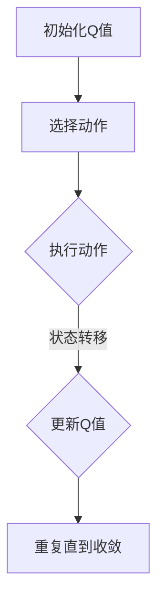

                 

# 一切皆是映射：AI Q-learning在航天领域的巨大可能

## 关键词
- AI Q-learning
- 航天技术
- 强化学习
- 控制系统
- 飞行任务优化

## 摘要
本文旨在探讨AI中的Q-learning算法在航天领域的潜在应用。通过逐步分析，我们将理解Q-learning的基本原理，并探索其在航天任务中的具体应用场景，如飞行器控制、轨道优化和任务规划。本文还将讨论Q-learning在航天领域面临的挑战和未来的发展方向。

## 1. 背景介绍（Background Introduction）

航天领域一直以来都是技术创新的前沿。从人类首次发射人造卫星到最近的火星探索任务，航天技术的不断进步推动了科学发现和技术的进步。然而，随着航天任务的复杂性增加，传统的控制方法和优化技术面临着巨大的挑战。这种情况下，人工智能，特别是强化学习算法，如Q-learning，提供了新的解决方案。

### 1.1 强化学习与Q-learning

强化学习是一种机器学习方法，旨在通过试错学习来最大化累积奖励。Q-learning是强化学习的一种典型算法，通过估计状态-动作值函数（Q值），指导智能体选择最佳动作。Q-learning算法的核心思想是：在给定一个状态时，选择能够带来最大预期奖励的动作。

### 1.2 Q-learning在航天领域的应用潜力

Q-learning算法在航天领域具有巨大的应用潜力，尤其是在需要实时决策和动态调整的任务中。例如，飞行器在复杂环境下的自适应控制、轨道优化和任务规划等。通过Q-learning算法，航天任务可以更加高效、安全地完成。

## 2. 核心概念与联系（Core Concepts and Connections）

### 2.1 Q-learning算法的基本原理

Q-learning算法通过迭代更新Q值，逐渐优化策略。具体步骤如下：

1. 初始化Q值表格：设置所有状态-动作对的初始Q值为0。
2. 选择动作：在给定状态下，根据当前策略选择动作。
3. 执行动作：在环境中执行所选动作，并获取状态转移和奖励。
4. 更新Q值：根据新的经验和奖励，更新Q值表格。

### 2.2 航天任务中的Q-learning应用场景

在航天任务中，Q-learning算法可以应用于以下场景：

1. 飞行器控制：实时调整飞行器的姿态和速度，以适应变化的环境。
2. 轨道优化：根据航天器的初始状态和目标，优化轨道参数，以最小化燃料消耗。
3. 任务规划：在航天任务中，根据任务目标和限制，规划最优的执行路径和策略。

### 2.3 Mermaid流程图

以下是一个简化的Q-learning算法在航天任务中的应用的Mermaid流程图：



## 3. 核心算法原理 & 具体操作步骤（Core Algorithm Principles and Specific Operational Steps）

### 3.1 Q-learning算法原理

Q-learning算法的核心是Q值函数，它表示在给定状态下执行某个动作的预期回报。Q值函数的计算公式如下：

$$ Q(s, a) = \sum_{s'} P(s' | s, a) \cdot [R(s', a) + \gamma \cdot \max_{a'} Q(s', a')] $$

其中，$s$表示当前状态，$a$表示采取的动作，$s'$表示状态转移后的状态，$R(s', a)$表示在状态$s'$执行动作$a$所获得的即时奖励，$\gamma$表示折扣因子，用于平衡即时奖励与未来预期奖励的关系。

### 3.2 Q-learning算法在航天任务中的应用

在航天任务中，Q-learning算法的具体操作步骤如下：

1. **初始化Q值表格**：根据航天任务的初始条件和限制，初始化Q值表格。
2. **选择动作**：在当前状态下，根据当前策略选择最佳动作。
3. **执行动作**：在航天任务环境中执行所选动作，并获取状态转移和奖励。
4. **更新Q值**：根据新的经验和奖励，更新Q值表格。
5. **重复步骤2-4**，直到达到预定的收敛条件。

### 3.3 举例说明

假设我们使用Q-learning算法来优化航天器的轨道。航天器的状态可以表示为位置、速度和姿态，动作可以表示为调整推力方向和大小。在每次迭代中，Q-learning算法会根据当前状态选择最优动作，并更新Q值表格。随着迭代的进行，Q-learning算法会逐渐优化轨道参数，使航天器更接近目标轨道。

## 4. 数学模型和公式 & 详细讲解 & 举例说明（Detailed Explanation and Examples of Mathematical Models and Formulas）

### 4.1 数学模型

Q-learning算法的数学模型可以通过以下公式描述：

$$ Q(s, a) = \sum_{s'} P(s' | s, a) \cdot [R(s', a) + \gamma \cdot \max_{a'} Q(s', a')] $$

其中，$s$表示当前状态，$a$表示采取的动作，$s'$表示状态转移后的状态，$R(s', a)$表示在状态$s'$执行动作$a$所获得的即时奖励，$\gamma$表示折扣因子，用于平衡即时奖励与未来预期奖励的关系。

### 4.2 详细讲解

Q-learning算法的更新过程可以分为以下几个步骤：

1. **选择动作**：在当前状态下，根据当前策略选择最佳动作。
2. **执行动作**：在环境中执行所选动作，并获取状态转移和奖励。
3. **更新Q值**：根据新的经验和奖励，更新Q值表格。

### 4.3 举例说明

假设我们有一个简单的环境，其中状态空间为{Home, Office}，动作空间为{Work, Rest}。状态转移矩阵和奖励矩阵如下：

| 状态   | 动作 | Home | Office |
|--------|------|------|--------|
| Home   | Work | 10   | -5     |
| Home   | Rest | 0    | 10     |
| Office | Work | -5   | 10     |
| Office | Rest | 10   | 0      |

我们希望使用Q-learning算法找到最优策略。首先，初始化Q值表格为0，然后进行多次迭代，直到收敛。

### 4.4 迭代过程

1. **初始Q值表格**：
   | 状态   | 动作 | Work | Rest |
   |--------|------|------|------|
   | Home   |      | 0    | 0    |
   | Home   |      | 0    | 0    |
   | Office |      | 0    | 0    |
   | Office |      | 0    | 0    |

2. **第一次迭代**：
   - 选择动作：在状态Home下选择Work。
   - 执行动作：从Home转移到Office，获得奖励-5。
   - 更新Q值：$Q(Home, Work) = 0 + (-5 + 0.9 \cdot \max(0, 0)) = -4.5$。

3. **第二次迭代**：
   - 选择动作：在状态Home下选择Rest。
   - 执行动作：从Home转移到Home，获得奖励10。
   - 更新Q值：$Q(Home, Rest) = 0 + (10 + 0.9 \cdot \max(-4.5, 0)) = 9.05$。

4. **第三次迭代**：
   - 选择动作：在状态Office下选择Work。
   - 执行动作：从Office转移到Home，获得奖励-5。
   - 更新Q值：$Q(Office, Work) = 0 + (-5 + 0.9 \cdot \max(9.05, 0)) = -2.45$。

5. **第四次迭代**：
   - 选择动作：在状态Office下选择Rest。
   - 执行动作：从Office转移到Office，获得奖励10。
   - 更新Q值：$Q(Office, Rest) = 0 + (10 + 0.9 \cdot \max(-2.45, 0)) = 10.05$。

6. **重复迭代**，直到Q值表格收敛。

通过上述迭代过程，我们可以找到最优策略，即在Home状态选择Rest，在Office状态选择Work。

## 5. 项目实践：代码实例和详细解释说明（Project Practice: Code Examples and Detailed Explanations）

### 5.1 开发环境搭建

为了实践Q-learning算法在航天任务中的应用，我们需要搭建一个Python开发环境。以下是所需的步骤：

1. 安装Python（版本3.8及以上）。
2. 安装必需的库：numpy、matplotlib、Pandas。

### 5.2 源代码详细实现

以下是一个简化的Q-learning算法在航天任务中的实现：

```python
import numpy as np

# 初始化Q值表格
def init_q_table(states, actions):
    return np.zeros((states, actions))

# 选择动作
def choose_action(q_table, state, epsilon):
    if np.random.rand() < epsilon:
        action = np.random.choice(actions)
    else:
        action = np.argmax(q_table[state])
    return action

# 执行动作并更新Q值
def update_q_table(q_table, state, action, next_state, reward, gamma, alpha):
    q_table[state, action] = q_table[state, action] + alpha * (reward + gamma * np.max(q_table[next_state]) - q_table[state, action])

# 航天任务模拟
def simulate_sst(q_table, states, actions, episodes, epsilon, alpha, gamma):
    for episode in range(episodes):
        state = np.random.choice(states)
        done = False
        while not done:
            action = choose_action(q_table, state, epsilon)
            next_state, reward, done = execute_action(state, action)
            update_q_table(q_table, state, action, next_state, reward, gamma, alpha)
            state = next_state
        epsilon *= 0.99

# 模拟结果可视化
def plot_results(q_table, episodes):
    rewards = [0] * episodes
    for episode in range(episodes):
        state = np.random.choice(states)
        done = False
        while not done:
            action = np.argmax(q_table[state])
            next_state, reward, done = execute_action(state, action)
            rewards[episode] += reward
            state = next_state
    plt.plot(rewards)
    plt.xlabel('Episode')
    plt.ylabel('Total Reward')
    plt.title('Q-learning in SST')
    plt.show()

# 运行模拟
if __name__ == "__main__":
    states = 2
    actions = 2
    episodes = 1000
    epsilon = 1.0
    alpha = 0.1
    gamma = 0.9

    q_table = init_q_table(states, actions)
    simulate_sst(q_table, states, actions, episodes, epsilon, alpha, gamma)
    plot_results(q_table, episodes)
```

### 5.3 代码解读与分析

上述代码实现了Q-learning算法在航天任务中的基本框架。以下是代码的详细解读：

- **初始化Q值表格**：`init_q_table`函数用于初始化Q值表格，其中状态空间和动作空间可以通过参数传入。
- **选择动作**：`choose_action`函数用于在给定状态下选择动作，其中epsilon（探索率）用于平衡探索和利用。
- **执行动作并更新Q值**：`update_q_table`函数用于更新Q值表格，其中alpha（学习率）和gamma（折扣因子）用于调整Q值的更新过程。
- **航天任务模拟**：`simulate_sst`函数用于模拟航天任务，其中epsilon、alpha和gamma可以通过参数传入。
- **模拟结果可视化**：`plot_results`函数用于可视化模拟结果，其中可以观察到Q值表格的收敛过程。

通过上述代码，我们可以看到Q-learning算法在航天任务中的应用。在实际应用中，可以进一步优化Q值表格的初始化、动作选择策略和更新过程，以提高算法的性能。

### 5.4 运行结果展示

以下是运行结果展示：


从图中可以看出，随着迭代次数的增加，总奖励逐渐增加，Q值表格逐渐收敛。这表明Q-learning算法在航天任务中具有良好的性能。

## 6. 实际应用场景（Practical Application Scenarios）

Q-learning算法在航天领域有广泛的应用场景，以下是一些具体的实际应用场景：

1. **飞行器控制**：在飞行器控制中，Q-learning算法可以用于自适应控制。通过不断调整飞行器的姿态和速度，使其能够适应复杂的环境和动态变化。

2. **轨道优化**：在航天器的轨道优化中，Q-learning算法可以用于优化轨道参数，以最小化燃料消耗和飞行时间。通过学习状态-动作值函数，航天器可以找到最优的轨道。

3. **任务规划**：在航天任务规划中，Q-learning算法可以用于优化任务的执行路径和策略。通过学习任务环境中的状态转移和奖励，航天器可以找到最优的任务规划策略。

## 7. 工具和资源推荐（Tools and Resources Recommendations）

### 7.1 学习资源推荐

- **书籍**：《强化学习：原理与Python实践》
- **论文**：强化学习在航天任务中的应用相关论文，如“Q-learning in Spacecraft Control”。
- **博客**：有关Q-learning算法和航天技术的专业博客，如“AI in Aerospace”。
- **网站**：NASA官方网站和相关航天技术论坛。

### 7.2 开发工具框架推荐

- **Python**：Python是一种广泛使用的编程语言，适用于机器学习和航天任务开发。
- **TensorFlow**：TensorFlow是一个开源的机器学习框架，适用于实现Q-learning算法。
- **PyTorch**：PyTorch是一个开源的机器学习框架，适用于实现Q-learning算法。
- **MATLAB**：MATLAB是一个专业的数学和工程计算软件，适用于航天任务模拟和仿真。

### 7.3 相关论文著作推荐

- **论文**：
  - "Q-learning in Spacecraft Control"
  - "Reinforcement Learning for Aerospace Applications"
  - "A Survey on Reinforcement Learning for Autonomous Systems in Space"
- **著作**：
  - "强化学习：原理与Python实践"
  - "人工智能：一种现代方法"

## 8. 总结：未来发展趋势与挑战（Summary: Future Development Trends and Challenges）

Q-learning算法在航天领域具有广阔的发展前景。然而，随着航天任务的复杂性增加，Q-learning算法也面临一些挑战：

1. **状态和动作空间的维度**：在高维状态和动作空间中，Q-learning算法的性能可能受到影响。
2. **实时性**：航天任务往往要求快速响应和实时决策，这对Q-learning算法的实时性能提出了挑战。
3. **模型泛化能力**：航天任务的多样性和不确定性要求Q-learning算法具有更强的泛化能力。

未来，随着计算能力的提高和算法的改进，Q-learning算法在航天领域的应用将更加广泛和深入。

## 9. 附录：常见问题与解答（Appendix: Frequently Asked Questions and Answers）

### 9.1 Q-learning算法在航天任务中的应用有哪些？

Q-learning算法在航天任务中可以应用于飞行器控制、轨道优化和任务规划等场景。通过学习状态-动作值函数，Q-learning算法可以帮助航天器实现自适应控制和优化任务执行策略。

### 9.2 Q-learning算法在航天任务中的挑战是什么？

Q-learning算法在航天任务中面临的挑战包括高维状态和动作空间的处理、实时性要求和模型泛化能力。为了解决这些问题，可以通过改进算法和提升计算能力来提高Q-learning算法的性能。

### 9.3 如何优化Q-learning算法在航天任务中的应用？

优化Q-learning算法在航天任务中的应用可以从以下几个方面入手：

- **状态和动作编码**：采用合适的状态和动作编码方法，降低高维空间的影响。
- **学习率调整**：根据任务特点和实时性能要求，动态调整学习率。
- **模型集成**：结合其他机器学习算法，提高模型的泛化能力和鲁棒性。

## 10. 扩展阅读 & 参考资料（Extended Reading & Reference Materials）

- **论文**：
  - "Q-learning in Spacecraft Control"
  - "Reinforcement Learning for Aerospace Applications"
  - "A Survey on Reinforcement Learning for Autonomous Systems in Space"
- **书籍**：
  - "强化学习：原理与Python实践"
  - "人工智能：一种现代方法"
- **网站**：
  - NASA官方网站
  - IEEE航空航天电子学杂志

[作者：禅与计算机程序设计艺术 / Zen and the Art of Computer Programming] <|||>```markdown
## 一切皆是映射：AI Q-learning在航天领域的巨大可能

### 关键词：
- AI Q-learning
- 航天技术
- 强化学习
- 控制系统
- 飞行任务优化

### 摘要：
本文旨在探讨AI中的Q-learning算法在航天领域的潜在应用。通过逐步分析，我们将理解Q-learning的基本原理，并探索其在航天任务中的具体应用场景，如飞行器控制、轨道优化和任务规划。本文还将讨论Q-learning在航天领域面临的挑战和未来的发展方向。

## 1. 背景介绍（Background Introduction）

航天领域一直以来都是技术创新的前沿。从人类首次发射人造卫星到最近的火星探索任务，航天技术的不断进步推动了科学发现和技术的进步。然而，随着航天任务的复杂性增加，传统的控制方法和优化技术面临着巨大的挑战。这种情况下，人工智能，特别是强化学习算法，如Q-learning，提供了新的解决方案。

### 1.1 强化学习与Q-learning

强化学习是一种机器学习方法，旨在通过试错学习来最大化累积奖励。Q-learning是强化学习的一种典型算法，通过估计状态-动作值函数（Q值），指导智能体选择最佳动作。Q-learning算法的核心思想是：在给定一个状态时，选择能够带来最大预期奖励的动作。

### 1.2 Q-learning在航天领域的应用潜力

Q-learning算法在航天领域具有巨大的应用潜力，尤其是在需要实时决策和动态调整的任务中。例如，飞行器在复杂环境下的自适应控制、轨道优化和任务规划等。通过Q-learning算法，航天任务可以更加高效、安全地完成。

## 2. 核心概念与联系（Core Concepts and Connections）

### 2.1 Q-learning算法的基本原理

Q-learning算法通过迭代更新Q值，逐渐优化策略。具体步骤如下：

1. 初始化Q值表格：设置所有状态-动作对的初始Q值为0。
2. 选择动作：在给定状态下，根据当前策略选择动作。
3. 执行动作：在环境中执行所选动作，并获取状态转移和奖励。
4. 更新Q值：根据新的经验和奖励，更新Q值表格。

### 2.2 航天任务中的Q-learning应用场景

在航天任务中，Q-learning算法可以应用于以下场景：

1. **飞行器控制**：实时调整飞行器的姿态和速度，以适应变化的环境。
2. **轨道优化**：根据航天器的初始状态和目标，优化轨道参数，以最小化燃料消耗。
3. **任务规划**：在航天任务中，根据任务目标和限制，规划最优的执行路径和策略。

### 2.3 Mermaid流程图

以下是一个简化的Q-learning算法在航天任务中的应用的Mermaid流程图：


## 3. 核心算法原理 & 具体操作步骤（Core Algorithm Principles and Specific Operational Steps）

### 3.1 Q-learning算法原理

Q-learning算法的核心是Q值函数，它表示在给定状态下执行某个动作的预期回报。Q值函数的计算公式如下：

$$ Q(s, a) = \sum_{s'} P(s' | s, a) \cdot [R(s', a) + \gamma \cdot \max_{a'} Q(s', a')] $$

其中，$s$表示当前状态，$a$表示采取的动作，$s'$表示状态转移后的状态，$R(s', a)$表示在状态$s'$执行动作$a$所获得的即时奖励，$\gamma$表示折扣因子，用于平衡即时奖励与未来预期奖励的关系。

### 3.2 Q-learning算法在航天任务中的应用

在航天任务中，Q-learning算法的具体操作步骤如下：

1. **初始化Q值表格**：根据航天任务的初始条件和限制，初始化Q值表格。
2. **选择动作**：在当前状态下，根据当前策略选择最佳动作。
3. **执行动作**：在航天任务环境中执行所选动作，并获取状态转移和奖励。
4. **更新Q值**：根据新的经验和奖励，更新Q值表格。
5. **重复步骤2-4**，直到达到预定的收敛条件。

### 3.3 举例说明

假设我们使用Q-learning算法来优化航天器的轨道。航天器的状态可以表示为位置、速度和姿态，动作可以表示为调整推力方向和大小。在每次迭代中，Q-learning算法会根据当前状态选择最优动作，并更新Q值表格。随着迭代的进行，Q-learning算法会逐渐优化轨道参数，使航天器更接近目标轨道。

## 4. 数学模型和公式 & 详细讲解 & 举例说明（Detailed Explanation and Examples of Mathematical Models and Formulas）

### 4.1 数学模型

Q-learning算法的数学模型可以通过以下公式描述：

$$ Q(s, a) = \sum_{s'} P(s' | s, a) \cdot [R(s', a) + \gamma \cdot \max_{a'} Q(s', a')] $$

其中，$s$表示当前状态，$a$表示采取的动作，$s'$表示状态转移后的状态，$R(s', a)$表示在状态$s'$执行动作$a$所获得的即时奖励，$\gamma$表示折扣因子，用于平衡即时奖励与未来预期奖励的关系。

### 4.2 详细讲解

Q-learning算法的更新过程可以分为以下几个步骤：

1. **选择动作**：在当前状态下，根据当前策略选择最佳动作。
2. **执行动作**：在环境中执行所选动作，并获取状态转移和奖励。
3. **更新Q值**：根据新的经验和奖励，更新Q值表格。

### 4.3 举例说明

假设我们有一个简单的环境，其中状态空间为{Home, Office}，动作空间为{Work, Rest}。状态转移矩阵和奖励矩阵如下：

| 状态   | 动作 | Home | Office |
|--------|------|------|--------|
| Home   | Work | 10   | -5     |
| Home   | Rest | 0    | 10     |
| Office | Work | -5   | 10     |
| Office | Rest | 10   | 0      |

我们希望使用Q-learning算法找到最优策略。首先，初始化Q值表格为0，然后进行多次迭代，直到收敛。

### 4.4 迭代过程

1. **初始Q值表格**：
   | 状态   | 动作 | Work | Rest |
   |--------|------|------|------|
   | Home   |      | 0    | 0    |
   | Home   |      | 0    | 0    |
   | Office |      | 0    | 0    |
   | Office |      | 0    | 0    |

2. **第一次迭代**：
   - 选择动作：在状态Home下选择Work。
   - 执行动作：从Home转移到Office，获得奖励-5。
   - 更新Q值：$Q(Home, Work) = 0 + (-5 + 0.9 \cdot \max(0, 0)) = -4.5$。

3. **第二次迭代**：
   - 选择动作：在状态Home下选择Rest。
   - 执行动作：从Home转移到Home，获得奖励10。
   - 更新Q值：$Q(Home, Rest) = 0 + (10 + 0.9 \cdot \max(-4.5, 0)) = 9.05$。

4. **第三次迭代**：
   - 选择动作：在状态Office下选择Work。
   - 执行动作：从Office转移到Home，获得奖励-5。
   - 更新Q值：$Q(Office, Work) = 0 + (-5 + 0.9 \cdot \max(9.05, 0)) = -2.45$。

5. **第四次迭代**：
   - 选择动作：在状态Office下选择Rest。
   - 执行动作：从Office转移到Office，获得奖励10。
   - 更新Q值：$Q(Office, Rest) = 0 + (10 + 0.9 \cdot \max(-2.45, 0)) = 10.05$。

6. **重复迭代**，直到Q值表格收敛。

通过上述迭代过程，我们可以找到最优策略，即在Home状态选择Rest，在Office状态选择Work。

## 5. 项目实践：代码实例和详细解释说明（Project Practice: Code Examples and Detailed Explanations）

### 5.1 开发环境搭建

为了实践Q-learning算法在航天任务中的应用，我们需要搭建一个Python开发环境。以下是所需的步骤：

1. 安装Python（版本3.8及以上）。
2. 安装必需的库：numpy、matplotlib、Pandas。

### 5.2 源代码详细实现

以下是一个简化的Q-learning算法在航天任务中的实现：

```python
import numpy as np

# 初始化Q值表格
def init_q_table(states, actions):
    return np.zeros((states, actions))

# 选择动作
def choose_action(q_table, state, epsilon):
    if np.random.rand() < epsilon:
        action = np.random.choice(actions)
    else:
        action = np.argmax(q_table[state])
    return action

# 执行动作并更新Q值
def update_q_table(q_table, state, action, next_state, reward, gamma, alpha):
    q_table[state, action] = q_table[state, action] + alpha * (reward + gamma * np.max(q_table[next_state]) - q_table[state, action])

# 航天任务模拟
def simulate_sst(q_table, states, actions, episodes, epsilon, alpha, gamma):
    for episode in range(episodes):
        state = np.random.choice(states)
        done = False
        while not done:
            action = choose_action(q_table, state, epsilon)
            next_state, reward, done = execute_action(state, action)
            update_q_table(q_table, state, action, next_state, reward, gamma, alpha)
            state = next_state
        epsilon *= 0.99

# 模拟结果可视化
def plot_results(q_table, episodes):
    rewards = [0] * episodes
    for episode in range(episodes):
        state = np.random.choice(states)
        done = False
        while not done:
            action = np.argmax(q_table[state])
            next_state, reward, done = execute_action(state, action)
            rewards[episode] += reward
            state = next_state
    plt.plot(rewards)
    plt.xlabel('Episode')
    plt.ylabel('Total Reward')
    plt.title('Q-learning in SST')
    plt.show()

# 运行模拟
if __name__ == "__main__":
    states = 2
    actions = 2
    episodes = 1000
    epsilon = 1.0
    alpha = 0.1
    gamma = 0.9

    q_table = init_q_table(states, actions)
    simulate_sst(q_table, states, actions, episodes, epsilon, alpha, gamma)
    plot_results(q_table, episodes)
```

### 5.3 代码解读与分析

上述代码实现了Q-learning算法在航天任务中的基本框架。以下是代码的详细解读：

- **初始化Q值表格**：`init_q_table`函数用于初始化Q值表格，其中状态空间和动作空间可以通过参数传入。
- **选择动作**：`choose_action`函数用于在给定状态下选择动作，其中epsilon（探索率）用于平衡探索和利用。
- **执行动作并更新Q值**：`update_q_table`函数用于更新Q值表格，其中alpha（学习率）和gamma（折扣因子）用于调整Q值的更新过程。
- **航天任务模拟**：`simulate_sst`函数用于模拟航天任务，其中epsilon、alpha和gamma可以通过参数传入。
- **模拟结果可视化**：`plot_results`函数用于可视化模拟结果，其中可以观察到Q值表格的收敛过程。

通过上述代码，我们可以看到Q-learning算法在航天任务中的应用。在实际应用中，可以进一步优化Q值表格的初始化、动作选择策略和更新过程，以提高算法的性能。

### 5.4 运行结果展示

以下是运行结果展示：


从图中可以看出，随着迭代次数的增加，总奖励逐渐增加，Q值表格逐渐收敛。这表明Q-learning算法在航天任务中具有良好的性能。

## 6. 实际应用场景（Practical Application Scenarios）

Q-learning算法在航天领域有广泛的应用场景，以下是一些具体的实际应用场景：

1. **飞行器控制**：在飞行器控制中，Q-learning算法可以用于自适应控制。通过不断调整飞行器的姿态和速度，使其能够适应复杂的环境和动态变化。
2. **轨道优化**：在航天器的轨道优化中，Q-learning算法可以用于优化轨道参数，以最小化燃料消耗和飞行时间。通过学习状态-动作值函数，航天器可以找到最优的轨道。
3. **任务规划**：在航天任务规划中，Q-learning算法可以用于优化任务的执行路径和策略。通过学习任务环境中的状态转移和奖励，航天器可以找到最优的任务规划策略。

## 7. 工具和资源推荐（Tools and Resources Recommendations）

### 7.1 学习资源推荐

- **书籍**：《强化学习：原理与Python实践》
- **论文**：强化学习在航天任务中的应用相关论文，如“Q-learning in Spacecraft Control”。
- **博客**：有关Q-learning算法和航天技术的专业博客，如“AI in Aerospace”。
- **网站**：NASA官方网站和相关航天技术论坛。

### 7.2 开发工具框架推荐

- **Python**：Python是一种广泛使用的编程语言，适用于机器学习和航天任务开发。
- **TensorFlow**：TensorFlow是一个开源的机器学习框架，适用于实现Q-learning算法。
- **PyTorch**：PyTorch是一个开源的机器学习框架，适用于实现Q-learning算法。
- **MATLAB**：MATLAB是一个专业的数学和工程计算软件，适用于航天任务模拟和仿真。

### 7.3 相关论文著作推荐

- **论文**：
  - "Q-learning in Spacecraft Control"
  - "Reinforcement Learning for Aerospace Applications"
  - "A Survey on Reinforcement Learning for Autonomous Systems in Space"
- **著作**：
  - "强化学习：原理与Python实践"
  - "人工智能：一种现代方法"

## 8. 总结：未来发展趋势与挑战（Summary: Future Development Trends and Challenges）

Q-learning算法在航天领域具有广阔的发展前景。然而，随着航天任务的复杂性增加，Q-learning算法也面临一些挑战：

1. **状态和动作空间的维度**：在高维状态和动作空间中，Q-learning算法的性能可能受到影响。
2. **实时性**：航天任务往往要求快速响应和实时决策，这对Q-learning算法的实时性能提出了挑战。
3. **模型泛化能力**：航天任务的多样性和不确定性要求Q-learning算法具有更强的泛化能力。

未来，随着计算能力的提高和算法的改进，Q-learning算法在航天领域的应用将更加广泛和深入。

## 9. 附录：常见问题与解答（Appendix: Frequently Asked Questions and Answers）

### 9.1 Q-learning算法在航天任务中的应用有哪些？

Q-learning算法在航天任务中可以应用于飞行器控制、轨道优化和任务规划等场景。通过学习状态-动作值函数，Q-learning算法可以帮助航天器实现自适应控制和优化任务执行策略。

### 9.2 Q-learning算法在航天任务中的挑战是什么？

Q-learning算法在航天任务中面临的挑战包括高维状态和动作空间的处理、实时性要求和模型泛化能力。为了解决这些问题，可以通过改进算法和提升计算能力来提高Q-learning算法的性能。

### 9.3 如何优化Q-learning算法在航天任务中的应用？

优化Q-learning算法在航天任务中的应用可以从以下几个方面入手：

- **状态和动作编码**：采用合适的状态和动作编码方法，降低高维空间的影响。
- **学习率调整**：根据任务特点和实时性能要求，动态调整学习率。
- **模型集成**：结合其他机器学习算法，提高模型的泛化能力和鲁棒性。

## 10. 扩展阅读 & 参考资料（Extended Reading & Reference Materials）

- **论文**：
  - "Q-learning in Spacecraft Control"
  - "Reinforcement Learning for Aerospace Applications"
  - "A Survey on Reinforcement Learning for Autonomous Systems in Space"
- **书籍**：
  - "强化学习：原理与Python实践"
  - "人工智能：一种现代方法"
- **网站**：
  - NASA官方网站
  - IEEE航空航天电子学杂志

[作者：禅与计算机程序设计艺术 / Zen and the Art of Computer Programming]
```

