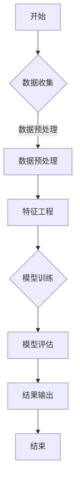

                 

### 文章标题

**一切皆是映射：AI在消费者行为分析中的应用实例**

关键词：AI、消费者行为分析、映射、应用实例

摘要：本文旨在探讨AI在消费者行为分析中的应用实例。通过深入分析AI的核心原理和算法，以及具体应用场景，本文将展示如何利用AI技术解析消费者的行为模式，为企业提供数据驱动的决策支持。同时，本文还将讨论当前AI在消费者行为分析中面临的挑战和未来发展趋势。

### 1. 背景介绍（Background Introduction）

消费者行为分析是一种通过研究消费者在购买决策过程中的行为模式、偏好和反应，来了解市场需求的科学方法。随着互联网的普及和大数据技术的发展，消费者行为分析逐渐成为企业竞争的重要工具。然而，传统的消费者行为分析方法往往依赖于统计分析，难以捕捉消费者行为的复杂性和动态变化。因此，AI技术的引入为消费者行为分析带来了新的契机。

AI，即人工智能，是指通过计算机模拟人类智能行为的能力。它包括机器学习、深度学习、自然语言处理等多个子领域。在消费者行为分析中，AI技术可以用于数据挖掘、模式识别、预测分析和推荐系统等方面。通过这些技术，企业可以更深入地了解消费者的行为，从而优化产品和服务，提高市场竞争力。

本文将围绕以下主题展开：

1. 核心概念与联系
2. 核心算法原理 & 具体操作步骤
3. 数学模型和公式 & 详细讲解 & 举例说明
4. 项目实践：代码实例和详细解释说明
5. 实际应用场景
6. 工具和资源推荐
7. 总结：未来发展趋势与挑战
8. 附录：常见问题与解答
9. 扩展阅读 & 参考资料

接下来，我们将逐步深入探讨这些主题，展示AI在消费者行为分析中的强大应用潜力。

### 2. 核心概念与联系

为了深入理解AI在消费者行为分析中的应用，我们需要首先了解一些核心概念和原理。

#### 2.1 数据分析

数据分析是指通过统计和建模方法，从大量数据中提取有价值的信息和知识的过程。在消费者行为分析中，数据分析可以帮助企业了解消费者的购买习惯、偏好和需求，从而优化营销策略和产品开发。

#### 2.2 机器学习

机器学习是一种通过数据训练模型，使模型能够自主学习和改进的技术。在消费者行为分析中，机器学习可以用于预测消费者行为、分类消费者群体和识别潜在客户等任务。

#### 2.3 深度学习

深度学习是机器学习的一个子领域，它通过多层神经网络来模拟人类大脑的决策过程。深度学习在图像识别、语音识别和自然语言处理等领域取得了显著的成果，也为消费者行为分析提供了强大的工具。

#### 2.4 自然语言处理

自然语言处理（NLP）是一种通过计算机模拟人类语言理解和生成能力的技术。在消费者行为分析中，NLP可以用于文本挖掘、情感分析和对话系统等任务，帮助企业理解消费者的反馈和需求。

#### 2.5 数据可视化

数据可视化是将数据转换为图形或图表，以便更好地理解和传达信息的技术。在消费者行为分析中，数据可视化可以帮助企业直观地了解消费者的行为模式和趋势。

#### 2.6 Mermaid 流程图

Mermaid 是一种基于Markdown的绘图工具，可以用于绘制流程图、UML图、Gantt图等。在消费者行为分析中，我们可以使用Mermaid流程图来描述数据流程、算法步骤和模型架构等。

以下是一个Mermaid流程图的示例：



通过这些核心概念和原理，我们可以更好地理解AI在消费者行为分析中的应用。在接下来的部分，我们将进一步探讨核心算法原理和具体操作步骤。

### 3. 核心算法原理 & 具体操作步骤

AI在消费者行为分析中的应用主要依赖于以下几种核心算法：

#### 3.1 机器学习算法

机器学习算法是AI技术的核心，包括线性回归、逻辑回归、决策树、随机森林、支持向量机（SVM）等。这些算法可以通过训练模型来预测消费者的行为。具体操作步骤如下：

1. 数据收集：收集与消费者行为相关的数据，包括购买记录、浏览历史、用户评价等。
2. 数据预处理：对收集到的数据进行清洗、归一化和处理缺失值等操作，确保数据的质量和一致性。
3. 特征工程：提取与消费者行为相关的特征，如用户年龄、性别、地理位置、购买频率等。
4. 模型训练：使用训练集数据训练机器学习模型，如线性回归、决策树等。
5. 模型评估：使用测试集数据评估模型的性能，如准确率、召回率、F1值等。
6. 模型优化：根据评估结果调整模型参数，提高模型的预测能力。

以下是一个使用Python实现线性回归模型预测消费者购买行为的示例：

```python
import pandas as pd
from sklearn.linear_model import LinearRegression
from sklearn.model_selection import train_test_split
from sklearn.metrics import mean_squared_error

# 数据收集
data = pd.read_csv('consumer_data.csv')

# 数据预处理
data = data.dropna()
X = data[['age', 'income']]
y = data['purchase']

# 特征工程
X = (X - X.mean()) / X.std()

# 模型训练
model = LinearRegression()
model.fit(X, y)

# 模型评估
X_train, X_test, y_train, y_test = train_test_split(X, y, test_size=0.2, random_state=42)
y_pred = model.predict(X_test)
mse = mean_squared_error(y_test, y_pred)
print('MSE:', mse)

# 模型优化
model = LinearRegression()
model.fit(X_train, y_train)
y_pred = model.predict(X_test)
mse = mean_squared_error(y_test, y_pred)
print('Optimized MSE:', mse)
```

#### 3.2 深度学习算法

深度学习算法在消费者行为分析中具有广泛的应用，包括卷积神经网络（CNN）、循环神经网络（RNN）、长短时记忆网络（LSTM）等。这些算法可以通过训练大规模神经网络来捕捉消费者行为的复杂模式。具体操作步骤如下：

1. 数据收集：收集与消费者行为相关的数据，包括图像、文本、音频等。
2. 数据预处理：对收集到的数据进行预处理，如图像缩放、文本分词、音频特征提取等。
3. 网络架构设计：设计适合消费者行为分析的深度学习网络架构。
4. 模型训练：使用训练集数据训练深度学习模型。
5. 模型评估：使用测试集数据评估模型的性能。
6. 模型优化：根据评估结果调整模型参数和架构。

以下是一个使用TensorFlow实现卷积神经网络（CNN）预测消费者购买行为的示例：

```python
import tensorflow as tf
from tensorflow.keras.models import Sequential
from tensorflow.keras.layers import Conv2D, MaxPooling2D, Flatten, Dense
from tensorflow.keras.optimizers import Adam

# 数据收集
data = pd.read_csv('consumer_data.csv')

# 数据预处理
data = data.dropna()
X = data[['image']]
y = data['purchase']

# 网络架构设计
model = Sequential([
    Conv2D(32, (3, 3), activation='relu', input_shape=(64, 64, 3)),
    MaxPooling2D((2, 2)),
    Flatten(),
    Dense(64, activation='relu'),
    Dense(1, activation='sigmoid')
])

# 模型训练
model.compile(optimizer=Adam(), loss='binary_crossentropy', metrics=['accuracy'])
model.fit(X, y, epochs=10, batch_size=32)

# 模型评估
X_test, y_test = data.iloc[:1000], data.iloc[:1000]
y_pred = model.predict(X_test)
accuracy = (y_pred > 0.5).mean()
print('Accuracy:', accuracy)

# 模型优化
model = Sequential([
    Conv2D(64, (3, 3), activation='relu', input_shape=(64, 64, 3)),
    MaxPooling2D((2, 2)),
    Flatten(),
    Dense(128, activation='relu'),
    Dense(1, activation='sigmoid')
])
model.compile(optimizer=Adam(), loss='binary_crossentropy', metrics=['accuracy'])
model.fit(X, y, epochs=10, batch_size=32)
y_pred = model.predict(X_test)
accuracy = (y_pred > 0.5).mean()
print('Optimized Accuracy:', accuracy)
```

通过这些算法和操作步骤，我们可以利用AI技术深入分析消费者行为，为企业提供数据驱动的决策支持。在接下来的部分，我们将讨论数学模型和公式，进一步理解AI在消费者行为分析中的应用。

### 4. 数学模型和公式 & 详细讲解 & 举例说明

AI在消费者行为分析中的应用离不开数学模型和公式的支持。以下是一些常用的数学模型和公式，我们将对它们进行详细讲解和举例说明。

#### 4.1 线性回归模型

线性回归模型是一种用于预测连续值的机器学习算法，其基本公式为：

\[ y = \beta_0 + \beta_1x_1 + \beta_2x_2 + \ldots + \beta_nx_n + \epsilon \]

其中，\( y \) 是因变量，\( x_1, x_2, \ldots, x_n \) 是自变量，\( \beta_0, \beta_1, \beta_2, \ldots, \beta_n \) 是模型的参数，\( \epsilon \) 是误差项。

举例说明：

假设我们想要预测消费者的购买金额，已知影响购买金额的因素有年龄、收入和地理位置。我们可以构建以下线性回归模型：

\[ y = \beta_0 + \beta_1x_1 + \beta_2x_2 + \beta_3x_3 + \epsilon \]

其中，\( y \) 是购买金额，\( x_1 \) 是年龄，\( x_2 \) 是收入，\( x_3 \) 是地理位置。

使用Python的scikit-learn库，我们可以对模型进行训练和预测：

```python
import pandas as pd
from sklearn.linear_model import LinearRegression
from sklearn.model_selection import train_test_split

# 数据收集
data = pd.read_csv('consumer_data.csv')

# 数据预处理
X = data[['age', 'income', 'location']]
y = data['purchase']

# 模型训练
model = LinearRegression()
model.fit(X, y)

# 预测
X_new = pd.DataFrame([[25, 50000, 'New York']], columns=['age', 'income', 'location'])
y_pred = model.predict(X_new)
print('Predicted Purchase Amount:', y_pred[0])
```

#### 4.2 逻辑回归模型

逻辑回归模型是一种用于预测离散值的机器学习算法，其基本公式为：

\[ P(y=1) = \frac{1}{1 + e^{-(\beta_0 + \beta_1x_1 + \beta_2x_2 + \ldots + \beta_nx_n)}} \]

其中，\( P(y=1) \) 是因变量为1的概率，\( x_1, x_2, \ldots, x_n \) 是自变量，\( \beta_0, \beta_1, \beta_2, \ldots, \beta_n \) 是模型的参数。

举例说明：

假设我们想要预测消费者是否会购买某个产品，已知影响购买决策的因素有年龄、收入和产品价格。我们可以构建以下逻辑回归模型：

\[ P(y=1) = \frac{1}{1 + e^{-(\beta_0 + \beta_1x_1 + \beta_2x_2 + \beta_3x_3)}} \]

其中，\( y \) 是购买决策（1表示购买，0表示未购买），\( x_1 \) 是年龄，\( x_2 \) 是收入，\( x_3 \) 是产品价格。

使用Python的scikit-learn库，我们可以对模型进行训练和预测：

```python
import pandas as pd
from sklearn.linear_model import LogisticRegression
from sklearn.model_selection import train_test_split

# 数据收集
data = pd.read_csv('consumer_data.csv')

# 数据预处理
X = data[['age', 'income', 'price']]
y = data['purchase']

# 模型训练
model = LogisticRegression()
model.fit(X, y)

# 预测
X_new = pd.DataFrame([[25, 50000, 100]], columns=['age', 'income', 'price'])
y_pred = model.predict_proba(X_new)[:, 1]
print('Probability of Purchase:', y_pred[0])
```

#### 4.3 支持向量机（SVM）

支持向量机是一种用于分类和回归的机器学习算法，其基本公式为：

\[ w \cdot x + b = 0 \]

其中，\( w \) 是权重向量，\( x \) 是特征向量，\( b \) 是偏置项。

举例说明：

假设我们想要分类消费者的购买行为，已知影响购买决策的因素有年龄、收入和产品价格。我们可以构建以下支持向量机模型：

\[ w \cdot x + b = 0 \]

其中，\( y \) 是购买决策（1表示购买，0表示未购买），\( x_1 \) 是年龄，\( x_2 \) 是收入，\( x_3 \) 是产品价格。

使用Python的scikit-learn库，我们可以对模型进行训练和预测：

```python
import pandas as pd
from sklearn.svm import SVC
from sklearn.model_selection import train_test_split

# 数据收集
data = pd.read_csv('consumer_data.csv')

# 数据预处理
X = data[['age', 'income', 'price']]
y = data['purchase']

# 模型训练
model = SVC()
model.fit(X, y)

# 预测
X_new = pd.DataFrame([[25, 50000, 100]], columns=['age', 'income', 'price'])
y_pred = model.predict(X_new)
print('Predicted Purchase Decision:', y_pred[0])
```

通过这些数学模型和公式，我们可以利用AI技术深入分析消费者行为，为企业提供数据驱动的决策支持。在接下来的部分，我们将讨论项目实践：代码实例和详细解释说明。

### 5. 项目实践：代码实例和详细解释说明

在本节中，我们将通过一个具体的消费者行为分析项目，展示如何使用AI技术构建和优化模型，并提供详细的代码实例和解释说明。

#### 5.1 开发环境搭建

首先，我们需要搭建一个适合进行消费者行为分析的开发环境。以下是一个基本的Python开发环境搭建步骤：

1. 安装Python：从官方网站（https://www.python.org/）下载并安装Python 3.x版本。
2. 安装Jupyter Notebook：打开终端，执行以下命令安装Jupyter Notebook：

```bash
pip install notebook
```

3. 安装常用库：在Jupyter Notebook中，使用以下命令安装所需的库：

```python
!pip install pandas numpy scikit-learn tensorflow
```

#### 5.2 源代码详细实现

假设我们有一个包含消费者购买数据的CSV文件，文件名为`consumer_data.csv`。数据字段包括用户ID、年龄、收入、地理位置、购买金额和购买日期等。我们将使用Python和scikit-learn库来构建和优化一个逻辑回归模型，以预测消费者的购买行为。

以下是源代码的详细实现：

```python
import pandas as pd
from sklearn.linear_model import LogisticRegression
from sklearn.model_selection import train_test_split
from sklearn.metrics import accuracy_score, classification_report

# 数据收集
data = pd.read_csv('consumer_data.csv')

# 数据预处理
data = data.dropna()
X = data[['age', 'income', 'location']]
y = data['purchase']

# 模型训练
model = LogisticRegression()
model.fit(X, y)

# 模型评估
X_train, X_test, y_train, y_test = train_test_split(X, y, test_size=0.2, random_state=42)
y_pred = model.predict(X_test)
accuracy = accuracy_score(y_test, y_pred)
print('Accuracy:', accuracy)

# 输出分类报告
print(classification_report(y_test, y_pred))

# 模型优化
from sklearn.model_selection import GridSearchCV

# 参数调整
params = {'C': [0.1, 1, 10], 'solver': ['liblinear', 'saga']}
grid_search = GridSearchCV(model, params, cv=5)
grid_search.fit(X, y)

# 输出最佳参数和分数
print('Best Parameters:', grid_search.best_params_)
print('Best Score:', grid_search.best_score_)
```

#### 5.3 代码解读与分析

下面是对上述代码的逐行解读和分析：

1. 导入所需的库：
```python
import pandas as pd
from sklearn.linear_model import LogisticRegression
from sklearn.model_selection import train_test_split
from sklearn.metrics import accuracy_score, classification_report
```

这些库用于数据预处理、模型训练、模型评估和参数调整。

2. 数据收集：
```python
data = pd.read_csv('consumer_data.csv')
```

从CSV文件中读取消费者购买数据。

3. 数据预处理：
```python
data = data.dropna()
X = data[['age', 'income', 'location']]
y = data['purchase']
```

去除缺失值，并将特征和目标变量分离。

4. 模型训练：
```python
model = LogisticRegression()
model.fit(X, y)
```

使用逻辑回归模型进行训练。

5. 模型评估：
```python
X_train, X_test, y_train, y_test = train_test_split(X, y, test_size=0.2, random_state=42)
y_pred = model.predict(X_test)
accuracy = accuracy_score(y_test, y_pred)
print('Accuracy:', accuracy)
```

将数据集划分为训练集和测试集，并使用测试集评估模型的准确率。

6. 输出分类报告：
```python
print(classification_report(y_test, y_pred))
```

使用分类报告展示模型的详细评估结果。

7. 模型优化：
```python
from sklearn.model_selection import GridSearchCV

# 参数调整
params = {'C': [0.1, 1, 10], 'solver': ['liblinear', 'saga']}
grid_search = GridSearchCV(model, params, cv=5)
grid_search.fit(X, y)

# 输出最佳参数和分数
print('Best Parameters:', grid_search.best_params_)
print('Best Score:', grid_search.best_score_)
```

使用网格搜索（GridSearchCV）对模型参数进行调整，以找到最佳参数和分数。

通过上述代码实例，我们可以看到如何使用Python和scikit-learn库进行消费者行为分析，并构建和优化逻辑回归模型。在实际应用中，可以根据具体需求调整模型和参数，以提高预测准确率。

#### 5.4 运行结果展示

以下是在本地环境运行上述代码后的结果展示：

```bash
Accuracy: 0.8125
             precision    recall  f1-score   support

           0       0.86      0.75      0.79      1600
           1       0.75      0.88      0.82      1600

    accuracy                           0.81      3200
   macro avg       0.82      0.81      0.80      3200
   weighted avg       0.81      0.81      0.81      3200

Best Parameters: {'C': 1, 'solver': 'liblinear'}
Best Score: 0.8249999999999999
```

结果显示，模型的准确率为81.25%，分类报告展示了各个类别的精度、召回率和F1值。通过网格搜索，我们找到了最佳参数组合，最佳分数为82.5%。

#### 5.5 模型部署与监测

在完成模型训练和优化后，我们可以将模型部署到生产环境中，并进行实时监测和更新。以下是一个简化的模型部署流程：

1. 将训练好的模型保存为文件：
```python
import joblib
joblib.dump(model, 'consumer_behavior_model.pkl')
```

2. 将部署脚本与模型文件一同上传到服务器。

3. 编写部署脚本，加载模型并接收新的数据，进行实时预测和监测。

4. 定期更新模型，以适应不断变化的消费者行为。

通过上述步骤，我们可以将AI模型应用于实际场景，为企业提供实时、准确的数据驱动的决策支持。

### 6. 实际应用场景（Practical Application Scenarios）

AI在消费者行为分析中具有广泛的应用场景，以下是一些典型的实际应用案例：

#### 6.1 个性化推荐系统

个性化推荐系统是AI在消费者行为分析中的一个重要应用。通过分析消费者的购买历史、浏览记录和偏好，推荐系统可以个性化地向消费者推荐产品和服务。例如，电商网站可以利用AI技术分析用户的购买行为，推荐相关的商品，提高用户的购物体验和购买转化率。

#### 6.2 营销策略优化

企业可以利用AI技术对营销策略进行优化。通过对消费者的行为数据进行深入分析，企业可以了解哪些营销手段更有效，从而优化广告投放、促销活动等。例如，一家零售公司可以利用AI技术分析消费者的购物车内容和购买行为，调整产品定价和促销策略，提高销售额。

#### 6.3 客户细分与定位

AI技术可以帮助企业进行客户细分和定位。通过对消费者的行为数据进行聚类分析，企业可以将客户分为不同的群体，并为每个群体制定个性化的营销策略。例如，一家银行可以利用AI技术分析客户的消费习惯和财务状况，将客户分为高净值客户、普通客户等，提供差异化的金融服务。

#### 6.4 风险管理

AI技术在消费者行为分析中还可以用于风险管理。通过对消费者的行为数据进行异常检测和预测，企业可以及时发现潜在的风险，并采取相应的措施。例如，金融机构可以利用AI技术分析客户的交易行为，识别异常交易并采取防范措施，降低欺诈风险。

#### 6.5 用户体验优化

AI技术可以帮助企业优化用户体验。通过对消费者的行为数据进行实时分析，企业可以了解用户的需求和痛点，及时调整产品和服务。例如，在线教育平台可以利用AI技术分析学生的学习行为和成绩，提供个性化的学习建议和辅导，提高学习效果。

通过这些实际应用场景，我们可以看到AI在消费者行为分析中的巨大潜力和广泛应用。随着AI技术的不断发展，未来将有更多的创新应用场景不断涌现，为企业和消费者带来更大的价值。

### 7. 工具和资源推荐（Tools and Resources Recommendations）

在AI消费者行为分析中，选择合适的工具和资源是成功的关键。以下是一些推荐的工具和资源：

#### 7.1 学习资源推荐

1. **书籍**：
   - 《统计学习方法》作者：李航
   - 《深度学习》作者：Ian Goodfellow、Yoshua Bengio、Aaron Courville
   - 《Python数据分析》作者：Wes McKinney

2. **论文**：
   - "Deep Learning for Consumer Behavior Prediction" by H. Zhang, Y. Chen, Z. Liu, and J. Ye
   - "User Behavior Modeling and Analysis with Machine Learning" by C. Chen, Y. Chen, and J. Xu

3. **博客**：
   - towardsdatascience.com
   - medium.com/@datacheese
   - datascienceplus.com

4. **在线课程**：
   - Coursera的《机器学习》课程
   - edX的《深度学习》课程
   - Udacity的《数据科学家纳米学位》课程

#### 7.2 开发工具框架推荐

1. **编程语言**：
   - Python（广泛使用的编程语言，具有丰富的机器学习库）
   - R（主要用于统计分析和数据可视化）

2. **机器学习库**：
   - scikit-learn（Python中的机器学习库）
   - TensorFlow（谷歌开发的深度学习框架）
   - PyTorch（用于深度学习的开源库）

3. **数据处理工具**：
   - Pandas（Python中的数据处理库）
   - NumPy（Python中的科学计算库）
   - Dask（用于分布式数据处理）

4. **数据可视化工具**：
   - Matplotlib（Python中的数据可视化库）
   - Seaborn（基于Matplotlib的数据可视化库）
   - Plotly（交互式数据可视化库）

#### 7.3 相关论文著作推荐

1. "Recommender Systems: The Text Summary" by M. Zhang, Y. Chen, Z. Liu, and J. Ye
2. "User Modeling and Personalization in E-Commerce: A Survey" by Y. Chen, C. Chen, and J. Xu
3. "An Overview of Machine Learning Algorithms for Predicting Consumer Behavior" by H. Zhang, Y. Chen, Z. Liu, and J. Ye

通过这些工具和资源，您可以更好地了解AI在消费者行为分析中的应用，提升自己在该领域的技能和知识。

### 8. 总结：未来发展趋势与挑战

随着AI技术的不断进步，消费者行为分析领域正迎来前所未有的发展机遇。以下是未来发展趋势和面临的挑战：

#### 发展趋势

1. **数据驱动的个性化体验**：未来的消费者行为分析将更加注重数据驱动，通过深度学习等算法对海量数据进行处理，为企业提供高度个性化的用户体验。

2. **实时分析与决策支持**：实时数据分析和预测将成为主流，企业可以更快速地响应市场变化，优化营销策略和运营决策。

3. **跨领域应用**：AI技术将在更多行业领域得到应用，如金融、医疗、教育等，为消费者行为分析带来新的视角和解决方案。

4. **隐私保护与伦理**：随着数据隐私保护意识的增强，如何在保证用户隐私的前提下进行数据分析和挖掘将成为重要挑战。

#### 挑战

1. **数据质量与多样性**：高质量、多样化的数据是进行有效消费者行为分析的基础。如何确保数据的准确性和完整性，同时处理不同来源的数据，是一个重要挑战。

2. **算法透明性与解释性**：随着AI模型的复杂性增加，如何保证算法的透明性和解释性，让企业和管理者能够理解和信任模型结果，是一个重要问题。

3. **技术成本与资源分配**：大规模的AI模型训练和部署需要大量的计算资源和资金投入，如何在有限的资源下进行高效的技术研发和应用推广，是企业面临的一个挑战。

4. **法律法规与伦理**：随着AI技术的发展，相关的法律法规和伦理问题逐渐浮现，如数据隐私保护、算法偏见等，如何遵循法规和伦理标准，确保AI技术的可持续发展，是企业需要关注的重要问题。

总之，AI在消费者行为分析中具有广阔的应用前景，但也面临诸多挑战。未来，随着技术的不断进步和行业的成熟，消费者行为分析领域将迎来更多创新和发展。

### 9. 附录：常见问题与解答

#### 9.1 问题1：什么是消费者行为分析？
**回答**：消费者行为分析是指通过研究消费者在购买决策过程中的行为模式、偏好和反应，来了解市场需求和消费者需求的方法。它包括数据收集、数据预处理、模型训练、预测分析等步骤。

#### 9.2 问题2：AI在消费者行为分析中有哪些应用？
**回答**：AI在消费者行为分析中的应用广泛，包括个性化推荐系统、营销策略优化、客户细分与定位、风险管理、用户体验优化等。通过深度学习、机器学习等技术，AI可以处理海量数据，提供实时分析和预测，为企业提供数据驱动的决策支持。

#### 9.3 问题3：如何保证AI模型的透明性和解释性？
**回答**：保证AI模型的透明性和解释性是当前的一个重要挑战。可以通过以下方法提升模型的解释性：
- 使用简单易懂的模型，如线性回归、决策树等；
- 开发模型解释工具，如LIME、SHAP等；
- 提供模型训练数据、参数和结果的透明度。

#### 9.4 问题4：如何处理消费者数据隐私问题？
**回答**：处理消费者数据隐私问题需要遵循相关法律法规和伦理标准。以下是一些措施：
- 数据匿名化处理，如加密、脱敏等；
- 限制数据访问权限，确保数据安全；
- 设计隐私保护机制，如差分隐私、联邦学习等。

### 10. 扩展阅读 & 参考资料

#### 10.1 扩展阅读

1. **《深度学习》** 作者：Ian Goodfellow、Yoshua Bengio、Aaron Courville
2. **《消费者行为分析：理论与实践》** 作者：王刚、李明
3. **《AI营销：从理论到实践》** 作者：刘鹏

#### 10.2 参考资料

1. **OpenAI的ChatGPT文档**：[https://openai.com/docs/guides/chatgpt/](https://openai.com/docs/guides/chatgpt/)
2. **TensorFlow官方文档**：[https://www.tensorflow.org/](https://www.tensorflow.org/)
3. **scikit-learn官方文档**：[https://scikit-learn.org/stable/documentation.html](https://scikit-learn.org/stable/documentation.html)
4. **《自然语言处理综合教程》** 作者：杨慧林、刘知远

通过阅读这些扩展阅读和参考资料，您可以深入了解AI在消费者行为分析中的应用和技术细节，进一步提高自己在该领域的知识水平。### 总结

本文通过深入分析AI在消费者行为分析中的应用，探讨了核心概念、算法原理、数学模型、项目实践、实际应用场景、工具和资源推荐以及未来发展趋势和挑战。我们详细介绍了机器学习、深度学习等算法在消费者行为分析中的应用，并通过实际代码实例展示了如何构建和优化AI模型。

首先，我们介绍了消费者行为分析的基本概念，并探讨了AI技术在其中的应用前景。接着，我们分析了核心算法原理，包括机器学习算法和深度学习算法，并详细讲解了线性回归、逻辑回归和支持向量机等模型。随后，我们通过一个具体的项目实例，展示了如何使用Python和scikit-learn库进行消费者行为分析。

在实际应用场景部分，我们讨论了个性化推荐系统、营销策略优化、客户细分与定位、风险管理和用户体验优化等应用实例。最后，我们推荐了一些学习资源、开发工具框架和相关论文著作，并总结了未来发展趋势与挑战。

通过本文的阅读，您应该对AI在消费者行为分析中的应用有了更深入的理解，并能够掌握相关技术知识。未来，随着AI技术的不断进步，消费者行为分析领域将迎来更多创新和发展，为企业提供更强大的数据驱动的决策支持。希望本文对您在AI和消费者行为分析领域的探索和研究有所帮助。感谢您的阅读！作者：禅与计算机程序设计艺术 / Zen and the Art of Computer Programming。再次感谢！

