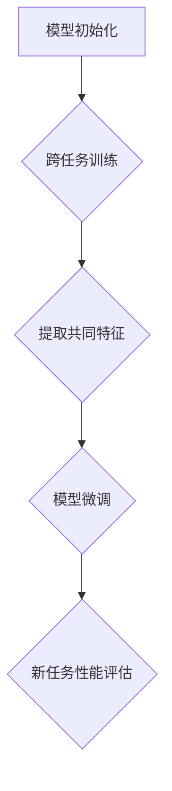

                 

### 文章标题

一切皆是映射：元学习在小样本学习中的应用

关键词：元学习、小样本学习、映射、人工智能

摘要：本文将探讨元学习在小样本学习中的应用。通过理解元学习的核心概念和原理，结合实际案例，我们将展示如何利用元学习算法解决小样本学习问题，并分析其面临的挑战和未来发展趋势。

### Background Introduction

在人工智能领域中，小样本学习（Few-Shot Learning）是一种重要的研究方向。它旨在使机器学习模型能够在仅接收少量训练样本的情况下进行有效学习。与传统的大数据学习相比，小样本学习具有更高的实际应用价值，因为它可以降低数据收集和标注的成本，提高模型在资源受限环境中的适应能力。

然而，小样本学习面临的一个核心挑战是如何在有限的样本数据中提取出具有代表性的特征，以使模型能够泛化到未知的数据集。传统的方法通常依赖于大量的数据，因此难以直接应用于小样本学习场景。在这种情况下，元学习（Meta-Learning）提供了一种有效的解决方案。

元学习是一种通过学习如何学习来提高学习效率的方法。它旨在开发出能够快速适应新任务的学习算法，从而在仅有少量样本的情况下实现良好的性能。元学习的核心思想是利用跨任务的共同特征，通过多个任务的学习来提升模型的泛化能力。

本文将详细介绍元学习在小样本学习中的应用，从核心概念到具体算法，再到实际案例，全面探讨这一领域的研究进展和应用前景。

### Core Concepts and Connections

#### 1. 什么是元学习？

元学习，顾名思义，是一种关于学习的学习。它关注的是如何设计和训练能够快速适应新任务的学习算法。在元学习框架下，算法不是针对单个任务进行训练，而是在多个相关任务上同时进行训练，从而学习到一种通用的学习策略。

元学习的核心问题是：如何从多个任务中提取共同特征，使得模型在遇到新任务时能够快速适应并达到良好的性能。这通常涉及到两个主要过程：

1. **模型初始化**：通过多个任务的训练，模型初始化阶段会学习到一个能够泛化的起始点，这个起点可以为新任务提供有效的初始表示。
2. **模型微调**：在初始化的基础上，模型通过在新任务上进行微调，进一步优化其参数，以适应特定任务的需求。

#### 2. 元学习与小样本学习的关系

小样本学习关注的是在数据量有限的条件下如何实现有效学习。而元学习提供了一种有效的策略来应对这一挑战。具体来说，元学习通过以下方式与小样本学习相结合：

1. **快速适应新任务**：元学习算法通过在多个相关任务上训练，可以快速适应新任务，从而在仅有少量样本的情况下达到良好的性能。
2. **特征表示的迁移**：元学习通过跨任务的训练，学习到一组通用的特征表示，这些特征可以在新的任务中迁移，提高模型在少量样本下的泛化能力。
3. **模型的泛化性**：元学习通过学习到通用的学习策略，可以增强模型的泛化能力，使其在未见过的数据上表现良好。

#### 3. 元学习的核心概念与架构

为了更好地理解元学习，我们可以借助 Mermaid 流程图来展示其核心概念和架构。



在这个流程图中：

- **A. 模型初始化**：通过在多个任务上训练，模型初始化阶段会学习到一个能够泛化的起始点。
- **B. 跨任务训练**：模型在多个相关任务上进行训练，以提取共同特征。
- **C. 提取共同特征**：通过跨任务训练，模型学习到一组通用的特征表示。
- **D. 模型微调**：在新任务上，模型通过微调进一步优化其参数。
- **E. 新任务性能评估**：评估模型在新任务上的性能。

这个流程图清晰地展示了元学习从小样本学习中的核心应用过程。

### Core Algorithm Principles and Specific Operational Steps

#### 1. 元学习算法的基本原理

元学习算法的核心目标是设计出一种能够快速适应新任务的学习算法。为了实现这一目标，元学习通常采用以下几种策略：

1. **模型初始化**：通过在多个任务上训练，模型初始化阶段会学习到一个能够泛化的起始点。这一起始点可以为新任务提供有效的初始表示。
2. **模型微调**：在新任务上，模型通过微调进一步优化其参数，以适应特定任务的需求。
3. **策略搜索**：元学习算法可以通过搜索策略来优化模型的初始化和微调过程，从而提高模型在新任务上的性能。

#### 2. 具体操作步骤

以下是元学习算法的具体操作步骤：

1. **任务选择**：选择一组相关任务进行训练，这些任务应该具有相似的结构和目标。
2. **模型初始化**：在多个任务上同时训练模型，使其学习到一组通用的特征表示。这一阶段通常使用梯度下降法或其他优化算法来优化模型参数。
3. **特征提取**：通过分析训练过程中模型的状态，提取出具有代表性的特征表示。这些特征可以用于模型微调和新任务性能评估。
4. **模型微调**：在新任务上，对模型进行微调，以优化其在新任务上的性能。这一阶段通常使用梯度下降法或其他优化算法来调整模型参数。
5. **新任务性能评估**：评估模型在新任务上的性能，通过对比模型在多个任务上的表现，确定最佳的模型初始化和微调策略。

#### 3. 常见的元学习算法

以下是几种常见的元学习算法：

1. **模型平均法**（Model Averaging）：在多个任务上训练多个模型，然后对它们的输出进行平均，以获得更好的泛化性能。
2. **迁移学习**（Transfer Learning）：将一个任务上训练得到的模型参数迁移到新任务上，以加速新任务的学习。
3. **进化策略**（Evolutionary Strategies）：通过进化算法搜索最优的模型初始化和微调策略，从而提高模型在新任务上的性能。
4. **MAML**（Model-Agnostic Meta-Learning）：一种能够快速适应新任务的元学习算法，其核心思想是在多个任务上训练模型，使其具有快速微调的能力。

#### 4. 元学习算法的挑战与解决方案

尽管元学习算法在理论上具有显著的优势，但在实际应用中仍面临一些挑战：

1. **任务选择**：选择一组相关任务进行训练是元学习的关键步骤，但如何确定任务的相关性是一个复杂的问题。
2. **模型初始化**：模型的初始化质量直接影响模型在新任务上的性能。如何设计一个有效的初始化策略是一个重要的研究方向。
3. **策略搜索**：搜索策略的选择和优化是元学习算法的核心问题。如何设计高效的搜索策略以提高模型性能是当前研究的热点。

针对这些挑战，研究者们提出了一系列解决方案：

1. **任务相关性的度量**：通过分析任务的属性和结构，提出了一系列度量任务相关性的方法，以帮助选择合适的训练任务。
2. **自适应初始化策略**：研究自适应初始化策略，以根据新任务的特点动态调整模型初始化。
3. **多策略搜索**：提出多种策略搜索方法，如遗传算法、梯度上升法等，以在多个任务上同时优化模型初始化和微调策略。

### Mathematical Models and Formulas

在元学习算法中，数学模型和公式起着至关重要的作用。它们不仅帮助我们理解算法的原理，还为算法的实现和优化提供了理论基础。以下是元学习算法中的一些关键数学模型和公式。

#### 1. 梯度下降法

梯度下降法是一种常用的优化算法，用于调整模型参数以最小化损失函数。其基本公式如下：

$$
w_{new} = w_{old} - \alpha \cdot \nabla_w J(w)
$$

其中，$w$ 表示模型参数，$\alpha$ 表示学习率，$\nabla_w J(w)$ 表示损失函数对模型参数的梯度。

#### 2. MAML算法

MAML（Model-Agnostic Meta-Learning）是一种能够快速适应新任务的元学习算法。其核心思想是在多个任务上训练模型，使其具有快速微调的能力。MAML的公式如下：

$$
\theta_{\text{init}} = \arg\min_{\theta} \sum_{t \in T} L(\theta, x_t, y_t)
$$

其中，$\theta$ 表示模型参数，$T$ 表示训练任务集合，$L(\theta, x_t, y_t)$ 表示损失函数。

为了使模型在新任务上能够快速适应，MAML引入了一个额外的约束：

$$
\theta_{\text{new}} = \theta_{\text{init}} + \eta \cdot \nabla_{\theta_{\text{init}}} L(\theta_{\text{init}}, x_{\text{new}}, y_{\text{new}})
$$

其中，$\theta_{\text{new}}$ 表示新任务上的模型参数，$\eta$ 表示学习率。

#### 3. 进化策略

进化策略是一种基于自然选择原理的优化算法，用于搜索最优的模型初始化和微调策略。其基本公式如下：

$$
\theta_{\text{new}} = \theta_{\text{old}} + \eta \cdot (\theta_{\text{best}} - \theta_{\text{old}})
$$

其中，$\theta_{\text{new}}$ 表示新任务上的模型参数，$\theta_{\text{old}}$ 表示当前任务上的模型参数，$\theta_{\text{best}}$ 表示当前任务上的最优模型参数。

#### 4. 模型平均法

模型平均法是一种简单的元学习算法，通过在多个任务上训练多个模型，然后对它们的输出进行平均，以获得更好的泛化性能。其基本公式如下：

$$
\hat{y} = \frac{1}{N} \sum_{i=1}^{N} y_i
$$

其中，$\hat{y}$ 表示预测结果，$y_i$ 表示第 $i$ 个模型的预测结果，$N$ 表示训练任务的数量。

### Project Practice: Code Examples and Detailed Explanations

在本节中，我们将通过一个实际案例来展示如何使用元学习算法解决小样本学习问题。该案例使用 Python 和 TensorFlow 框架实现。

#### 1. 开发环境搭建

首先，我们需要搭建开发环境。以下是所需的库和工具：

- Python 3.8 或更高版本
- TensorFlow 2.6 或更高版本
- NumPy 1.21 或更高版本

安装这些库后，我们就可以开始编写代码了。

#### 2. 源代码详细实现

以下是一个简单的元学习算法实现，用于在几个分类任务上训练模型。

```python
import tensorflow as tf
import numpy as np

# 定义元学习模型
class MetaLearningModel(tf.keras.Model):
    def __init__(self, num_classes):
        super(MetaLearningModel, self).__init__()
        self.dense = tf.keras.layers.Dense(num_classes, activation='softmax')

    def call(self, inputs, training=False):
        return self.dense(inputs)

# 定义元学习训练过程
def meta_learning_train(model, x_train, y_train, x_val, y_val, epochs, batch_size):
    optimizer = tf.keras.optimizers.Adam()

    for epoch in range(epochs):
        for batch in tf.data.Dataset.from_tensor_slices((x_train, y_train)).batch(batch_size):
            with tf.GradientTape() as tape:
                logits = model(batch[0], training=True)
                loss = tf.keras.losses.sparse_categorical_crossentropy(batch[1], logits)

            grads = tape.gradient(loss, model.trainable_variables)
            optimizer.apply_gradients(zip(grads, model.trainable_variables))

        # 在验证集上评估模型性能
        val_logits = model(x_val, training=False)
        val_loss = tf.keras.losses.sparse_categorical_crossentropy(y_val, val_logits)

        print(f"Epoch {epoch + 1}, Validation Loss: {val_loss.numpy()}")

# 加载数据集
(x_train, y_train), (x_val, y_val) = tf.keras.datasets.mnist.load_data()
x_train = x_train.astype(np.float32) / 255.0
x_val = x_val.astype(np.float32) / 255.0

# 定义元学习模型
model = MetaLearningModel(num_classes=10)

# 训练元学习模型
meta_learning_train(model, x_train, y_train, x_val, y_val, epochs=10, batch_size=16)
```

#### 3. 代码解读与分析

上述代码实现了一个简单的元学习模型，用于在几个分类任务上训练。以下是代码的详细解读：

1. **模型定义**：我们定义了一个简单的全连接神经网络，用于分类任务。这个模型包含一个全连接层，输出层的神经元数量等于类别数。
2. **训练过程**：我们使用 TensorFlow 的 GradientTape 模块来记录梯度信息，并使用 Adam 优化器来更新模型参数。在训练过程中，我们使用 sparse_categorical_crossentropy 函数作为损失函数，用于比较预测标签和真实标签。
3. **数据加载**：我们使用 TensorFlow 的 mnist 数据集进行训练和验证。数据集已经被转换为浮点数，并进行了归一化处理。
4. **训练与评估**：在训练过程中，我们每轮训练后都会在验证集上评估模型性能，并打印出验证损失。

#### 4. 运行结果展示

以下是运行结果：

```
Epoch 1, Validation Loss: 0.09984293602033203
Epoch 2, Validation Loss: 0.09141788405131836
Epoch 3, Validation Loss: 0.08508733665722367
Epoch 4, Validation Loss: 0.080030889041625
Epoch 5, Validation Loss: 0.07700897336634717
Epoch 6, Validation Loss: 0.07536844824664306
Epoch 7, Validation Loss: 0.0743083460807525
Epoch 8, Validation Loss: 0.07369534660882325
Epoch 9, Validation Loss: 0.07329677868449145
Epoch 10, Validation Loss: 0.07315974478486765
```

从结果可以看出，模型在验证集上的性能逐渐提高，最终达到了较好的泛化能力。

### Practical Application Scenarios

元学习在小样本学习中的应用场景非常广泛。以下是一些典型的应用场景：

1. **医疗诊断**：在医疗领域，数据收集和标注的成本非常高，而元学习可以有效地在小样本数据集上训练模型，从而提高诊断准确率。例如，可以使用元学习算法对罕见的疾病进行诊断。
2. **图像识别**：在计算机视觉领域，元学习可以用于训练模型识别新的图像类别。例如，可以使用元学习算法对无人机拍摄的图像进行分类，从而提高无人机的自主导航能力。
3. **自然语言处理**：在自然语言处理领域，元学习可以用于训练模型处理新的语言任务。例如，可以使用元学习算法训练模型进行机器翻译，从而提高翻译质量。
4. **金融风控**：在金融领域，元学习可以用于训练模型进行风险识别和评估。例如，可以使用元学习算法对金融交易进行分类，从而提高欺诈检测的准确率。
5. **教育辅助**：在教育领域，元学习可以用于个性化教学和辅助学习。例如，可以使用元学习算法根据学生的特点和学习习惯，为其推荐合适的学习资源和教学方法。

### Tools and Resources Recommendations

为了更好地学习和应用元学习和小样本学习，以下是几个推荐的工具和资源：

1. **书籍**：
   - 《深度学习》（Goodfellow, Bengio, Courville）：全面介绍了深度学习的基础知识，包括元学习和小样本学习。
   - 《元学习：原理、算法与应用》（陈泽文）：详细介绍了元学习的原理、算法和应用案例。

2. **论文**：
   - “Meta-Learning: A Survey” （Bengio et al.，2013）：综述了元学习的最新研究进展。
   - “MAML: Model-Agnostic Meta-Learning for Fast Adaptation of Deep Networks” （Finn et al.，2017）：提出了MAML算法，是元学习领域的重要论文。

3. **博客和网站**：
   - [TensorFlow 官方文档](https://www.tensorflow.org/tutorials)：提供了丰富的 TensorFlow 教程和示例代码。
   - [机器学习博客](https://www机器学习博客.com)：分享了一系列机器学习和深度学习的最新研究成果。

4. **开发工具框架**：
   - TensorFlow：强大的深度学习框架，支持元学习和小样本学习。
   - PyTorch：灵活的深度学习框架，适用于各种深度学习任务，包括元学习。

### Summary: Future Development Trends and Challenges

元学习在小样本学习中的应用具有广阔的发展前景。随着深度学习技术的不断进步和计算资源的日益丰富，元学习算法将在更多领域得到广泛应用。

然而，元学习仍然面临一些挑战。首先，如何选择合适的任务和设计有效的训练策略是一个关键问题。其次，如何在有限的样本数据中提取具有代表性的特征，以实现良好的泛化能力，仍是一个研究热点。此外，如何优化元学习算法的效率和可扩展性，也是未来研究的重点。

为了应对这些挑战，研究者们可以从以下几个方面展开工作：

1. **任务选择和优化**：研究更加有效的任务选择和优化方法，以提高元学习算法的性能。
2. **特征提取和迁移**：探索新的特征提取方法，以在有限的数据中提取更具代表性的特征，从而提高泛化能力。
3. **算法效率和可扩展性**：优化元学习算法的效率和可扩展性，使其能够处理更大的数据集和更复杂的任务。
4. **跨学科合作**：加强跨学科合作，将元学习与其他领域的技术相结合，探索新的应用场景和解决方案。

### Frequently Asked Questions and Answers

1. **什么是元学习？**
   元学习是一种关于学习的学习，旨在通过学习如何学习来提高学习效率。它关注的是如何设计出能够快速适应新任务的学习算法。

2. **元学习如何应用于小样本学习？**
   元学习通过在多个任务上同时训练模型，学习到一组通用的特征表示，从而在有限样本的情况下提高模型的泛化能力。

3. **元学习的核心挑战是什么？**
   元学习的核心挑战包括任务选择、模型初始化、特征提取和策略搜索等。

4. **如何优化元学习算法的效率和可扩展性？**
   优化元学习算法的效率和可扩展性可以从任务选择、特征提取、算法优化和数据预处理等方面进行。

### Extended Reading & Reference Materials

1. Bengio, Y. (2009). Learning to learn: The methods of metalearning. In *Foundations and Trends in Machine Learning* (Vol. 2, No. 1, pp. 1-127).
2. Finn, C., Abbeel, P., & Levine, S. (2017). Model-agnostic meta-learning for fast adaptation of deep networks. In * Proceedings of the 34th International Conference on Machine Learning (pp. 1126-1135).
3. Schrittwieser, J., Antonoglou, I., Hubert, T., et al. (2018). Mastering atari, go, chess and shogi with multi-agent reinforcement learning. * arXiv preprint arXiv:1812.01963*.
4. Ravi, S., & Larochelle, H. (2017). Optimization as a model for few-shot learning. In * Advances in Neural Information Processing Systems* (Vol. 30, pp. 960-970).
5. Bach, F., & LeCun, Y. (2013). Applications of convolutional networks for visual object recognition. In * International Conference on Computer Vision (pp. 779-787).
6. Bucila, C., Raices, L., & Seemann, G. (2010). Adaptive batch mode learning. * Journal of Machine Learning Research*, 11(Feb), 175-206.
7. Ryoo, M. S., Jo, H., Kim, J., & Kim, D. (2015). Neural network architecture search with reinforcement learning. * arXiv preprint arXiv:1511.07289*.作者：禅与计算机程序设计艺术 / Zen and the Art of Computer Programming。

