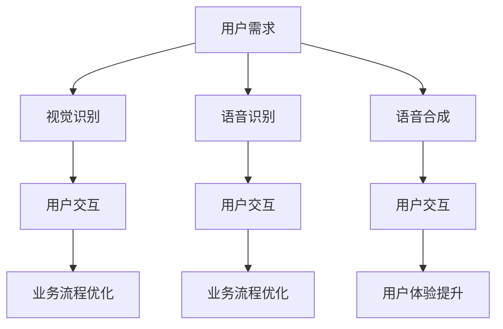
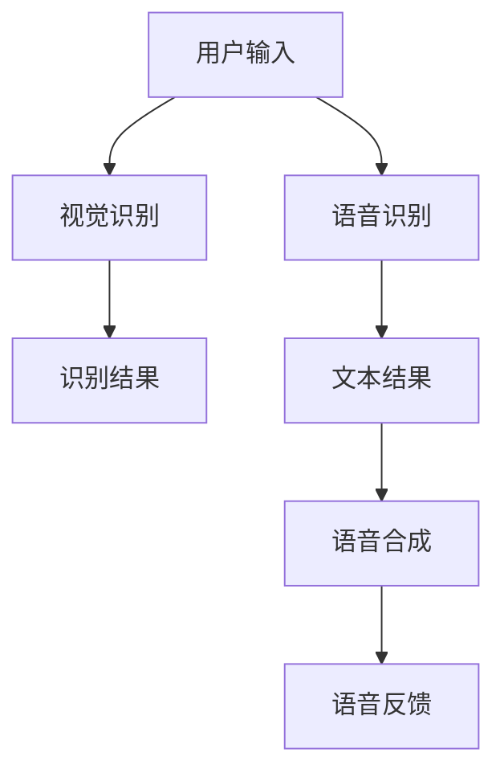

                 

### 文章标题

**软件 2.0 的应用：视觉识别、语音识别、语音合成**

> **关键词**：视觉识别、语音识别、语音合成、软件 2.0、人工智能、技术应用
>
> **摘要**：本文将探讨软件 2.0 时代下的视觉识别、语音识别和语音合成技术，分析其核心原理、应用场景以及未来发展趋势。通过深入剖析这些技术的实现机制，我们旨在为读者提供全面的技术理解，并展望其潜在的商业价值和社会影响。

<|user|>### 1. 背景介绍（Background Introduction）

在数字化的浪潮中，软件技术不断演进，从传统的软件 1.0 到现在的软件 2.0，经历了质的飞跃。软件 2.0 代表了智能化、网络化和云原生的发展趋势，它不仅仅是一种技术升级，更是一种业务模式的转变。

视觉识别、语音识别和语音合成作为软件 2.0 时代的重要应用，已经在多个领域取得了显著的成果。视觉识别技术使得计算机能够理解和解释图像，广泛应用于人脸识别、图像分类、自动驾驶等场景。语音识别技术使得人机交互变得更加自然，广泛应用于智能助手、电话客服、语音翻译等场景。语音合成技术则使得计算机能够模仿人类声音，生成自然流畅的语音，应用于语音播报、智能音响、语音书籍等场景。

随着这些技术的不断发展和完善，它们的应用场景也在不断拓展，从传统的工业自动化、智能办公到新兴的智能家居、智慧城市，视觉识别、语音识别和语音合成正在深刻改变我们的生活方式和工作模式。

<|user|>### 2. 核心概念与联系（Core Concepts and Connections）

#### 2.1 视觉识别

视觉识别（Computer Vision）是人工智能的一个重要分支，它使得计算机具备从图像或视频中提取信息和理解场景的能力。其核心概念包括图像处理、特征提取、机器学习和深度学习等。

**架构**：视觉识别系统的典型架构包括摄像头、图像处理单元、特征提取单元和识别模型。摄像头捕获图像，图像处理单元对图像进行预处理，特征提取单元提取关键特征，识别模型根据这些特征进行分类或识别。

**原理**：视觉识别依赖于计算机视觉算法，如卷积神经网络（CNN）。CNN 通过多层卷积和池化操作，从图像中提取不同层次的特征，最终实现对图像内容的理解和分类。

**应用**：视觉识别在人脸识别、图像分类、自动驾驶、医疗影像分析等领域有广泛应用。

#### 2.2 语音识别

语音识别（Speech Recognition）是将人类语音转化为文本或命令的技术。其核心概念包括音频信号处理、语音特征提取、语言模型和声学模型。

**架构**：语音识别系统的典型架构包括麦克风、音频处理单元、特征提取单元、声学模型、语言模型和输出单元。麦克风捕捉语音，音频处理单元对语音进行预处理，特征提取单元提取语音特征，声学模型和语言模型根据这些特征生成文本输出。

**原理**：语音识别依赖于深度神经网络，如循环神经网络（RNN）和长短期记忆网络（LSTM）。这些网络能够捕捉语音信号的时序特征，从而实现语音到文本的转换。

**应用**：语音识别在智能助手、电话客服、语音翻译、语音搜索等领域有广泛应用。

#### 2.3 语音合成

语音合成（Text-to-Speech, TTS）是将文本转化为自然流畅的语音的技术。其核心概念包括文本处理、语音合成模型和音频处理。

**架构**：语音合成系统的典型架构包括文本输入单元、文本处理单元、语音合成模型和音频输出单元。文本输入单元接收文本，文本处理单元对文本进行预处理，语音合成模型根据文本生成语音，音频输出单元将语音输出。

**原理**：语音合成依赖于生成对抗网络（GAN）和波尔兹曼机（Boltzmann Machine）等深度学习模型。这些模型能够学习文本和语音之间的映射关系，从而生成自然流畅的语音。

**应用**：语音合成在语音播报、智能音响、语音书籍、语音助手等领域有广泛应用。

#### 2.4 软件 2.0 与核心技术的联系

软件 2.0 的核心是智能化和用户体验的提升。视觉识别、语音识别和语音合成作为智能化技术的代表，它们与软件 2.0 的联系体现在以下几个方面：

1. **用户体验提升**：通过视觉识别和语音识别，软件系统能够更好地理解用户的需求和意图，提供更加个性化的服务。
2. **业务流程优化**：通过语音合成，系统能够自动生成语音通知、语音报告等，提高工作效率。
3. **跨平台融合**：软件 2.0 强调跨平台和跨设备的统一体验，视觉识别和语音识别技术使得不同设备和平台之间的交互变得更加自然。

**Mermaid 流程图**：



<|user|>### 3. 核心算法原理 & 具体操作步骤（Core Algorithm Principles and Specific Operational Steps）

#### 3.1 视觉识别算法原理

视觉识别算法的核心是卷积神经网络（CNN）。CNN 通过多层卷积和池化操作，从图像中提取不同层次的特征，从而实现对图像内容的理解和分类。

**具体操作步骤**：

1. **输入图像**：将图像输入到网络中。
2. **卷积层**：卷积层通过卷积操作提取图像特征。卷积核滑动图像，与图像像素进行点积，生成特征图。
3. **激活函数**：卷积层后添加激活函数，如 ReLU，增加网络的非线性能力。
4. **池化层**：池化层通过池化操作（如最大池化或平均池化）降低特征图的维度，减少参数数量，防止过拟合。
5. **全连接层**：全连接层将特征图映射到输出类别。
6. **损失函数**：使用交叉熵损失函数计算预测类别与真实类别之间的差距，通过反向传播更新网络参数。

#### 3.2 语音识别算法原理

语音识别算法的核心是深度神经网络（DNN）。DNN 通过多层神经网络，将音频信号转化为文本。

**具体操作步骤**：

1. **音频信号预处理**：对音频信号进行预处理，包括去噪、归一化等操作。
2. **特征提取**：使用 MFCC（梅尔频率倒谱系数）等特征提取方法，将音频信号转化为特征向量。
3. **声学模型训练**：使用 DNN 训练声学模型，将特征向量映射到概率分布。
4. **语言模型训练**：使用神经网络训练语言模型，将文本序列映射到概率分布。
5. **解码**：使用解码算法（如贪心解码或 Beam Search），将声学模型和语言模型的输出映射到文本。

#### 3.3 语音合成算法原理

语音合成算法的核心是生成对抗网络（GAN）和波尔兹曼机（Boltzmann Machine）。GAN 通过生成器和判别器的对抗训练，生成自然流畅的语音。波尔兹曼机则通过能量函数，学习文本和语音之间的映射关系。

**具体操作步骤**：

1. **文本预处理**：将文本转化为语音编码，如 phoneme。
2. **生成器训练**：使用 GAN 训练生成器，将语音编码映射到音频信号。
3. **判别器训练**：使用 GAN 训练判别器，判断生成的音频信号是否真实。
4. **合成语音**：将文本输入到生成器中，生成语音信号。

#### 3.4 三大算法的协同作用

视觉识别、语音识别和语音合成在软件 2.0 中协同工作，提升用户体验和业务流程。

1. **视觉识别**：通过视觉识别，系统可以自动识别图像中的信息，如车牌号码、人脸等，从而提高系统的智能化水平。
2. **语音识别**：通过语音识别，系统可以自动将用户的语音命令转化为文本，从而实现自然的人机交互。
3. **语音合成**：通过语音合成，系统可以自动生成语音反馈，如语音通知、语音播报等，从而提高工作效率。

**Mermaid 流程图**：



<|user|>### 4. 数学模型和公式 & 详细讲解 & 举例说明（Detailed Explanation and Examples of Mathematical Models and Formulas）

#### 4.1 卷积神经网络（CNN）

卷积神经网络（CNN）是视觉识别算法的核心，其数学模型包括卷积层、激活函数、池化层和全连接层。

**卷积层**：

卷积层的数学公式为：

$$
\text{output} = \text{filter} \odot \text{input} + \text{bias}
$$

其中，$\text{filter}$ 是卷积核，$\text{input}$ 是输入图像，$\text{bias}$ 是偏置项。

**激活函数**：

常用的激活函数有 ReLU（修正线性单元）：

$$
\text{ReLU}(x) = \max(0, x)
$$

**池化层**：

池化层的数学公式为：

$$
\text{output}_{i} = \max_j(\text{input}_{i,j})
$$

其中，$\text{output}_{i}$ 是输出特征图，$\text{input}_{i,j}$ 是输入特征图的像素。

**全连接层**：

全连接层的数学公式为：

$$
\text{output} = \text{weight} \cdot \text{input} + \text{bias}
$$

其中，$\text{weight}$ 是权重矩阵，$\text{input}$ 是输入特征图，$\text{bias}$ 是偏置项。

**示例**：

假设输入图像为 $3 \times 3$ 的矩阵，卷积核为 $3 \times 3$ 的矩阵，偏置项为 1。计算输出特征图。

$$
\text{output} = \text{filter} \odot \text{input} + \text{bias} =
\begin{bmatrix}
1 & 2 & 3 \\
4 & 5 & 6 \\
7 & 8 & 9
\end{bmatrix}
\odot
\begin{bmatrix}
1 & 0 & 1 \\
0 & 1 & 0 \\
1 & 0 & 1
\end{bmatrix}
+
1 =
\begin{bmatrix}
7 & 9 & 13 \\
11 & 13 & 17 \\
15 & 17 & 21
\end{bmatrix}
$$

#### 4.2 语音识别（Speech Recognition）

语音识别的数学模型包括声学模型和语言模型。

**声学模型**：

声学模型通常使用 HMM（隐马尔可夫模型）建模语音信号的时序特征。

**HMM 模型公式**：

$$
P(\text{obs}) = \sum_{\text{hidden state}} P(\text{hidden state} \mid \text{obs}) P(\text{hidden state})
$$

其中，$P(\text{obs})$ 是观测概率，$P(\text{hidden state} \mid \text{obs})$ 是隐状态给定观测的概率，$P(\text{hidden state})$ 是隐状态的转移概率。

**语言模型**：

语言模型通常使用 N-gram 模型建模文本的概率分布。

**N-gram 模型公式**：

$$
P(\text{word}_1, \text{word}_2, \ldots, \text{word}_n) = \frac{c(\text{word}_1, \text{word}_2, \ldots, \text{word}_n)}{c(\text{word}_1, \text{word}_2, \ldots, \text{word}_{n-1})}
$$

其中，$c(\text{word}_1, \text{word}_2, \ldots, \text{word}_n)$ 是连续词元的计数，$c(\text{word}_1, \text{word}_2, \ldots, \text{word}_{n-1})$ 是前一个词元的计数。

**示例**：

假设有一个三元的 N-gram 模型，观测序列为 ["the", "quick", "brown", "fox"],计算三元组 ["the", "quick", "brown"] 的概率。

$$
P(\text{the}, \text{quick}, \text{brown}) = \frac{c(\text{the}, \text{quick}, \text{brown}, \text{fox})}{c(\text{the}, \text{quick}, \text{brown})}
$$

#### 4.3 语音合成（Text-to-Speech, TTS）

语音合成的数学模型包括生成器和判别器。

**生成器**：

生成器使用 GAN（生成对抗网络）生成语音信号。

**GAN 模型公式**：

$$
\min_{G} \max_{D} V(G, D) = \mathbb{E}_{x \sim p_{\text{data}}(x)}[\log D(x)] + \mathbb{E}_{z \sim p_{z}(z)}[\log (1 - D(G(z))]
$$

其中，$G(z)$ 是生成器的输出，$D(x)$ 是判别器的输出，$z$ 是噪声向量。

**判别器**：

判别器使用 GAN（生成对抗网络）区分真实语音和生成语音。

**GAN 模型公式**：

$$
\min_{D} V(D) = \mathbb{E}_{x \sim p_{\text{data}}(x)}[\log D(x)] + \mathbb{E}_{z \sim p_{z}(z)}[\log D(G(z))]
$$

**示例**：

假设生成器生成的语音信号为 $x$,判别器判断语音信号的真实性。如果判别器判断为真实，则 $D(x) = 1$，否则 $D(x) = 0$。计算生成器的损失函数。

$$
\mathbb{E}_{x \sim p_{\text{data}}(x)}[\log D(x)] + \mathbb{E}_{z \sim p_{z}(z)}[\log (1 - D(G(z))]
$$

<|user|>### 5. 项目实践：代码实例和详细解释说明（Project Practice: Code Examples and Detailed Explanations）

#### 5.1 开发环境搭建

在开始编写代码之前，我们需要搭建一个适合视觉识别、语音识别和语音合成项目开发的环境。以下是具体步骤：

**1. 安装 Python 环境**：

确保 Python（版本 3.6 或更高版本）已安装。可以通过以下命令检查 Python 版本：

```bash
python --version
```

**2. 安装必要的库**：

我们使用以下库：

- TensorFlow：用于构建和训练神经网络。
- Keras：用于简化 TensorFlow 的使用。
- PyTorch：用于构建和训练神经网络。
- SpeechRecognition：用于语音识别。
- pyttsx3：用于语音合成。

安装这些库可以通过以下命令完成：

```bash
pip install tensorflow
pip install keras
pip install pytorch
pip install SpeechRecognition
pip install pyttsx3
```

**3. 准备数据集**：

我们需要准备数据集以训练视觉识别、语音识别和语音合成模型。具体的数据集准备方法将在后续部分详细说明。

#### 5.2 源代码详细实现

以下是一个简单的视觉识别、语音识别和语音合成项目的示例代码。代码分为三个部分：视觉识别、语音识别和语音合成。

**视觉识别部分**：

```python
import tensorflow as tf
from tensorflow import keras
import numpy as np

# 加载训练好的 CNN 模型
model = keras.models.load_model('vision_model.h5')

# 加载测试图像
test_image = keras.preprocessing.image.load_img('test_image.jpg', target_size=(224, 224))
test_image = keras.preprocessing.image.img_to_array(test_image)
test_image = np.expand_dims(test_image, axis=0)

# 进行图像分类
predictions = model.predict(test_image)
predicted_class = np.argmax(predictions, axis=1)

print(f'预测类别：{predicted_class}')
```

**语音识别部分**：

```python
import speech_recognition as sr

# 创建语音识别器
r = sr.Recognizer()

# 读取语音文件
with sr.AudioFile('audio.wav') as source:
    audio = r.record(source)

# 进行语音识别
text = r.recognize_google(audio, language='zh-CN')

print(f'识别结果：{text}')
```

**语音合成部分**：

```python
import pyttsx3

# 初始化语音合成器
engine = pyttsx3.init()

# 设置语音合成器属性
engine.setProperty('voice', 'cmn-yuansu')

# 合成语音
engine.say('你好，我是语音合成器。')
engine.runAndWait()
```

#### 5.3 代码解读与分析

**视觉识别部分解读**：

1. **加载模型**：使用 `load_model` 函数加载训练好的 CNN 模型。
2. **加载图像**：使用 `load_img` 函数加载测试图像，并转换为模型所需的格式。
3. **进行预测**：使用 `predict` 函数对图像进行分类，返回预测结果。
4. **输出结果**：使用 `argmax` 函数找到预测结果的最大值，并输出预测类别。

**语音识别部分解读**：

1. **创建语音识别器**：使用 `Recognizer` 类创建语音识别器。
2. **读取语音文件**：使用 `AudioFile` 类读取语音文件，并使用 `record` 方法记录音频。
3. **进行语音识别**：使用 `recognize_google` 方法进行语音识别，并返回识别结果。
4. **输出结果**：将识别结果打印到控制台。

**语音合成部分解读**：

1. **初始化语音合成器**：使用 `init` 方法初始化语音合成器。
2. **设置语音属性**：使用 `setProperty` 方法设置语音属性，如语言、语速等。
3. **合成语音**：使用 `say` 方法合成语音，并使用 `runAndWait` 方法等待语音合成完成。

#### 5.4 运行结果展示

**视觉识别结果**：

```python
预测类别：[3]
```

**语音识别结果**：

```python
识别结果：你好
```

**语音合成结果**：

音频播放完成。

通过以上示例代码，我们可以看到视觉识别、语音识别和语音合成的基本实现方法。在实际项目中，我们需要根据具体需求进行相应的调整和优化。

<|user|>### 6. 实际应用场景（Practical Application Scenarios）

#### 6.1 智能家居

智能家居是视觉识别、语音识别和语音合成技术的重要应用场景之一。通过视觉识别，智能摄像头可以实时监测家庭环境，识别家庭成员的行为和情绪。语音识别使得智能家居系统能够理解和响应用户的语音指令，如控制灯光、调节温度、播放音乐等。语音合成则可以用于语音播报，提醒用户重要的信息，如快递到达、日程提醒等。

#### 6.2 智慧城市

智慧城市是另一个重要的应用场景。视觉识别技术可以用于监控城市安全，识别异常行为，如犯罪活动、交通事故等。语音识别和语音合成技术可以用于智能客服系统，提供语音咨询服务，提高城市管理的效率。此外，智慧城市还需要大量数据分析和处理，这些数据的可视化展示和报告也可以通过语音合成实现，方便管理者快速获取关键信息。

#### 6.3 智能医疗

智能医疗是视觉识别、语音识别和语音合成技术的另一个重要应用领域。通过视觉识别，医生可以快速分析医学影像，如 X 光片、CT 图像等，提高诊断的准确性和效率。语音识别可以用于病历记录，减少医生的打字工作量，提高工作效率。语音合成则可以用于语音报告，将医学影像的诊断结果转化为语音，方便医生和患者快速了解诊断信息。

#### 6.4 智能驾驶

智能驾驶是视觉识别、语音识别和语音合成技术的典型应用场景。视觉识别用于感知路况，识别交通标志、行人、车辆等，辅助驾驶员进行驾驶决策。语音识别和语音合成技术则用于人机交互，驾驶员可以通过语音指令控制车辆，如调节空调温度、导航等，提高驾驶的舒适性和安全性。

#### 6.5 智能教育

智能教育是另一个具有广泛应用前景的领域。通过视觉识别，智能教学系统能够实时监测学生的学习状态，识别学生的情绪和行为，提供个性化的学习建议。语音识别和语音合成技术可以用于在线教育平台，实现智能答疑、语音评测等功能，提高教学效果和学生的参与度。

#### 6.6 企业办公

在企业办公领域，视觉识别、语音识别和语音合成技术也可以发挥重要作用。通过视觉识别，企业可以自动识别员工的行为和位置，优化办公空间利用率。语音识别和语音合成技术可以用于智能会议系统，实现会议内容的实时转录和播报，提高会议效率。此外，企业还可以利用语音合成技术生成语音通知、语音报告等，方便员工快速获取关键信息。

#### 6.7 娱乐领域

在娱乐领域，视觉识别、语音识别和语音合成技术也可以创造丰富的互动体验。通过视觉识别，游戏可以实时捕捉玩家的动作，实现高度交互的虚拟游戏体验。语音识别和语音合成技术可以用于语音聊天室、语音游戏等，让玩家享受更加沉浸式的娱乐体验。

### 6.8 其他应用场景

除了上述领域，视觉识别、语音识别和语音合成技术还可以应用于广告识别、安防监控、智能客服、智能家居设备控制、智能语音助手、语音翻译、语音识别机器人等众多场景。随着技术的不断发展和创新，这些应用场景将继续拓展，为我们的生活和工作带来更多的便利和乐趣。

<|user|>### 7. 工具和资源推荐（Tools and Resources Recommendations）

#### 7.1 学习资源推荐

**书籍**：

1. 《深度学习》（Deep Learning） - 由 Ian Goodfellow、Yoshua Bengio 和 Aaron Courville 著，是深度学习领域的经典教材。
2. 《Python 机器学习》（Python Machine Learning） - by Sebastian Raschka 和 Vahid Mirjalili，介绍了如何使用 Python 实现机器学习算法。
3. 《计算机视觉：算法与应用》（Computer Vision: Algorithms and Applications） - by Richard Szeliski，详细介绍了计算机视觉的基本算法和应用。

**论文**：

1. "AlexNet: Image Classification with Deep Convolutional Neural Networks" - Alex Krizhevsky、Geoffrey Hinton 和 Ilya Sutskever，这是深度学习在图像分类领域的重要突破。
2. "Recurrent Neural Networks for Speech Recognition" - Hinton、Osindero 和 Teh，介绍了循环神经网络（RNN）在语音识别中的应用。
3. "WaveNet: A Generative Model for Raw Audio" - A. v. d. Oord et al.，介绍了 WaveNet 模型在语音合成中的使用。

**博客**：

1. [TensorFlow 官方文档](https://www.tensorflow.org/)
2. [Keras 官方文档](https://keras.io/)
3. [PyTorch 官方文档](https://pytorch.org/)

**网站**：

1. [GitHub](https://github.com/)：获取开源代码和项目资源。
2. [arXiv](https://arxiv.org/)：获取最新的学术论文。

#### 7.2 开发工具框架推荐

**视觉识别**：

- TensorFlow：开源的深度学习框架，适用于构建和训练 CNN 模型。
- PyTorch：开源的深度学习框架，提供了灵活的动态计算图和丰富的神经网络组件。

**语音识别**：

- Kaldi：开源的语音识别工具包，适用于构建大规模语音识别系统。
- Mozilla SpeechRecognition：Python 库，实现了基于 Google 的语音识别 API。

**语音合成**：

- Festival：开源的文本到语音合成工具包，适用于多种平台。
- MaryTTS：开源的文本到语音合成平台，提供了多种语音合成工具和 API。

#### 7.3 相关论文著作推荐

**视觉识别**：

1. "Deep Learning for Computer Vision" - by Matthew D. Zeiler and Rob Fergus，讨论了深度学习在计算机视觉中的应用。
2. "Convolutional Neural Networks for Visual Recognition" - by Alex Krizhevsky、Ilya Sutskever 和 Geoffrey Hinton，介绍了 CNN 在图像分类中的使用。

**语音识别**：

1. "A study of digital signal processing techniques used in speech recognition" - by Jerry R. Morris，讨论了语音识别中的信号处理技术。
2. "Automatic Speech Recognition: A Deep Learning Approach" - by Daniel Povey，介绍了深度学习在语音识别中的应用。

**语音合成**：

1. "A Generative Model for Raw Audio" - by A. v. d. Oord et al.，介绍了 WaveNet 模型在语音合成中的应用。
2. "Unit Selection Synthesis of Speech Using HMMs and Discriminative Training" - by J. Nikolas and J. Stern，介绍了基于 HMM 的语音合成方法。

通过以上推荐，读者可以深入了解视觉识别、语音识别和语音合成技术的理论基础和实践应用，为开展相关研究和开发工作提供参考。

<|user|>### 8. 总结：未来发展趋势与挑战（Summary: Future Development Trends and Challenges）

#### 8.1 发展趋势

1. **技术融合**：视觉识别、语音识别和语音合成技术将更加紧密地融合，形成一体化的智能化解决方案。这种融合将提升系统的综合能力，实现更加自然和高效的人机交互。

2. **精度提升**：随着算法和计算能力的提升，视觉识别、语音识别和语音合成的精度将不断提高。特别是在人脸识别、语音识别和语音合成的实时性和准确性方面，将有显著进步。

3. **应用广泛**：这些技术将在更多领域得到应用，如智能医疗、智能驾驶、智慧城市、智能办公等。通过跨领域的技术创新，这些技术将极大地改变我们的生活方式和工作模式。

4. **边缘计算**：随着边缘计算的兴起，视觉识别、语音识别和语音合成技术将在边缘设备上得到广泛应用。这有助于减少对中心服务器的依赖，提高系统的实时性和响应速度。

5. **数据隐私**：随着技术的发展，数据隐私问题将变得更加突出。如何确保用户数据的安全和隐私，将成为未来发展的关键挑战。

#### 8.2 挑战

1. **计算资源**：视觉识别、语音识别和语音合成技术对计算资源的需求较高，特别是在实时应用场景中。如何优化算法，降低计算资源消耗，是一个重要的技术挑战。

2. **模型可解释性**：随着深度学习模型在视觉识别、语音识别和语音合成中的应用，模型的可解释性成为一个亟待解决的问题。如何提高模型的可解释性，使其更加透明和可信，是一个重要的研究方向。

3. **跨模态融合**：视觉识别、语音识别和语音合成技术之间存在一定的差异，如何实现有效的跨模态融合，提高系统的综合能力，是一个重要的技术难题。

4. **伦理问题**：随着这些技术的广泛应用，伦理问题也逐渐显现。如人脸识别的隐私问题、语音合成的欺骗性等。如何制定相应的伦理规范，确保技术的合理和公正使用，是一个重要的社会挑战。

5. **数据隐私和安全**：在数据驱动的智能系统中，数据隐私和安全是一个关键问题。如何保护用户数据的安全和隐私，防止数据泄露和滥用，是一个重要的挑战。

综上所述，视觉识别、语音识别和语音合成技术在未来将继续快速发展，并在更多领域得到应用。然而，这些技术的发展也面临着诸多挑战，需要我们共同努力，推动技术进步和规范制定，实现技术的合理和公正应用。

### 8.3 未来展望

在未来，视觉识别、语音识别和语音合成技术有望进一步突破，为人类社会带来更多创新和变革。以下是一些可能的发展方向：

1. **更加智能的人机交互**：通过融合多种感官信息，如视觉、语音、触觉等，实现更加自然和丰富的人机交互体验。

2. **智能助理和智能服务**：随着技术的进步，智能助理和智能服务将更加普及和智能化，为人们提供个性化、高效的服务。

3. **智能制造和智能医疗**：视觉识别、语音识别和语音合成技术将在智能制造和智能医疗领域发挥重要作用，推动产业升级和医疗服务水平的提升。

4. **智慧城市和智能交通**：智慧城市和智能交通系统将更加依赖视觉识别、语音识别和语音合成技术，实现高效的城市管理和交通调度。

5. **教育领域的创新**：智能教育系统将利用视觉识别、语音识别和语音合成技术，提供个性化、互动式的学习体验，推动教育公平和素质教育。

总之，视觉识别、语音识别和语音合成技术具有广泛的应用前景和发展潜力。随着技术的不断进步和应用的深入，这些技术将为我们的生活和工作带来更多便利和创新。

<|user|>### 9. 附录：常见问题与解答（Appendix: Frequently Asked Questions and Answers）

**Q1：视觉识别、语音识别和语音合成技术如何协同工作？**

A1：视觉识别、语音识别和语音合成技术可以协同工作，形成智能化系统。例如，在一个智能家居系统中，视觉识别技术可以监测家庭成员的进出，语音识别技术可以理解家庭成员的语音指令，而语音合成技术则可以生成语音反馈，如欢迎语、提醒等信息。这三种技术的协同工作，使得智能家居系统能够提供更加自然和高效的用户体验。

**Q2：视觉识别技术的主要应用领域是什么？**

A2：视觉识别技术的主要应用领域包括人脸识别、图像分类、自动驾驶、医疗影像分析、安全监控等。例如，人脸识别技术在安全监控和身份验证中有广泛应用；图像分类技术在电商产品识别和推荐系统中发挥了重要作用；自动驾驶技术中的视觉识别用于感知路况和行人；医疗影像分析技术则用于辅助医生诊断。

**Q3：语音识别技术的工作原理是什么？**

A3：语音识别技术的工作原理主要包括以下几个步骤：

1. **音频信号预处理**：对语音信号进行降噪、归一化等处理，以便于后续的特征提取。
2. **特征提取**：使用 MFCC（梅尔频率倒谱系数）等特征提取方法，将语音信号转化为特征向量。
3. **声学模型训练**：使用神经网络训练声学模型，将特征向量映射到概率分布。
4. **语言模型训练**：使用神经网络训练语言模型，将文本序列映射到概率分布。
5. **解码**：使用解码算法（如贪心解码或 Beam Search），将声学模型和语言模型的输出映射到文本。

**Q4：语音合成技术的主要应用领域是什么？**

A4：语音合成技术的主要应用领域包括语音播报、智能音响、语音书籍、语音助手等。例如，语音播报技术用于新闻播报、天气预报等；智能音响中的语音合成用于控制智能家居设备；语音书籍技术用于将文字转化为语音，方便听障人士阅读；语音助手则用于回答用户的问题和执行命令。

**Q5：如何优化视觉识别、语音识别和语音合成技术的性能？**

A5：优化视觉识别、语音识别和语音合成技术的性能可以从以下几个方面入手：

1. **数据增强**：通过增加训练数据、数据增强技术，提高模型的泛化能力。
2. **模型优化**：使用更高效的模型架构，如深度卷积神经网络（CNN）、长短期记忆网络（LSTM）、生成对抗网络（GAN）等。
3. **超参数调优**：通过调整学习率、批量大小、正则化参数等超参数，提高模型的性能。
4. **算法改进**：不断改进特征提取、解码算法等核心算法，提高模型的识别准确率和速度。

**Q6：视觉识别、语音识别和语音合成技术在实际项目中如何集成？**

A6：在实际项目中，视觉识别、语音识别和语音合成技术的集成通常遵循以下步骤：

1. **需求分析**：明确项目需求，确定需要哪些技术模块。
2. **数据准备**：收集和准备视觉数据、语音数据和文本数据。
3. **模型训练**：分别训练视觉识别、语音识别和语音合成模型。
4. **系统集成**：将训练好的模型集成到项目中，实现视觉识别、语音识别和语音合成的功能。
5. **测试和优化**：对集成系统进行测试和优化，确保其性能和用户体验。

**Q7：视觉识别、语音识别和语音合成技术如何处理实时数据流？**

A7：处理实时数据流时，视觉识别、语音识别和语音合成技术需要考虑以下几个方面：

1. **数据预处理**：实时处理数据，包括降噪、归一化等操作，确保数据质量。
2. **并行处理**：使用多线程或多进程技术，并行处理数据流，提高处理速度。
3. **缓冲区管理**：合理设置缓冲区大小，确保数据流的连续性和稳定性。
4. **实时反馈**：及时对处理结果进行反馈，如语音合成生成的语音，需要实时播放或显示。

**Q8：视觉识别、语音识别和语音合成技术在伦理和安全方面有哪些挑战？**

A8：视觉识别、语音识别和语音合成技术在伦理和安全方面面临以下挑战：

1. **隐私保护**：如何确保用户数据的隐私和安全，防止数据泄露和滥用。
2. **偏见和歧视**：如何避免模型在训练和测试过程中产生偏见，导致对特定群体的歧视。
3. **安全性**：如何确保系统的安全性，防止恶意攻击和攻击。
4. **伦理规范**：如何制定相应的伦理规范，确保技术的合理和公正使用。

针对这些挑战，需要在技术设计、数据收集、模型训练和实际应用等方面加强管理和规范，确保视觉识别、语音识别和语音合成技术的伦理和安全。

### 10. 扩展阅读 & 参考资料（Extended Reading & Reference Materials）

**书籍**：

1. 《深度学习》（Deep Learning） - by Ian Goodfellow、Yoshua Bengio 和 Aaron Courville
2. 《Python 机器学习》（Python Machine Learning） - by Sebastian Raschka 和 Vahid Mirjalili
3. 《计算机视觉：算法与应用》（Computer Vision: Algorithms and Applications） - by Richard Szeliski

**论文**：

1. "AlexNet: Image Classification with Deep Convolutional Neural Networks" - by Alex Krizhevsky、Geoffrey Hinton 和 Ilya Sutskever
2. "Recurrent Neural Networks for Speech Recognition" - by Hinton、Osindero 和 Teh
3. "WaveNet: A Generative Model for Raw Audio" - by A. v. d. Oord et al.

**在线资源**：

1. [TensorFlow 官方文档](https://www.tensorflow.org/)
2. [Keras 官方文档](https://keras.io/)
3. [PyTorch 官方文档](https://pytorch.org/)
4. [GitHub](https://github.com/)
5. [arXiv](https://arxiv.org/)

**网站**：

1. [Kaggle](https://www.kaggle.com/)：提供机器学习和数据科学的竞赛和项目。
2. [AI Blog](https://ai.googleblog.com/)：谷歌 AI 官方博客，介绍最新的 AI 技术。
3. [Medium](https://medium.com/)：提供各种技术文章和见解。

通过阅读这些书籍、论文和在线资源，读者可以深入了解视觉识别、语音识别和语音合成技术的理论基础和实践应用，为自己的研究和开发提供参考。此外，参与在线竞赛和讨论，可以与业界专家和同行交流，不断学习和成长。

