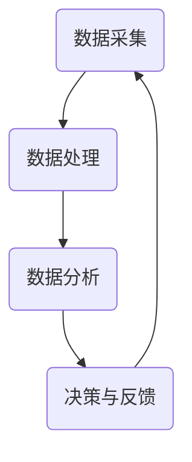

                 

### 文章标题

**软件 2.0 的时代：数据驱动一切**

在数字化的今天，软件已经深入到我们的日常生活和工作中，从社交网络到在线购物，从智能家居到自动驾驶汽车。然而，这些软件的发展正逐渐进入一个新的阶段——软件2.0时代。在这个时代，数据成为了驱动软件创新和进步的核心力量。本文将深入探讨软件2.0时代的特点、核心概念、算法原理，以及数据驱动的实际应用场景和未来趋势。

**Keywords:** 软件发展、软件2.0、数据驱动、算法原理、实际应用、未来趋势

**Abstract:**
本文旨在探讨软件2.0时代的数据驱动特性。我们将分析软件2.0的定义和特点，深入探讨数据驱动的核心概念和算法原理，并通过实际案例展示其在不同领域的应用。最后，本文将展望软件2.0时代的发展趋势和面临的挑战。通过对这些方面的深入分析，我们希望读者能够对软件2.0时代有更全面的理解。

### 1. 背景介绍

软件2.0时代的到来并非一蹴而就，而是随着信息技术的发展、大数据的兴起以及人工智能的进步而逐渐演变而来的。传统的软件1.0时代主要集中在开发和应用层面，其主要目标是为用户提供基本的功能和服务。然而，随着数据的爆发式增长和计算能力的提升，软件的发展逐渐转向数据驱动的模式。

在软件2.0时代，数据不再是单纯的存储和传输对象，而是成为了创造价值的核心资产。数据驱动的软件能够通过分析用户行为、市场趋势和业务需求，提供个性化的服务、优化运营效率和预测未来趋势。这种转变不仅改变了软件开发的模式，也重新定义了软件的价值和影响力。

本文将分为以下几个部分进行深入探讨：

1. **核心概念与联系**：介绍软件2.0时代的关键概念，如数据驱动的核心思想、算法原理等，并通过Mermaid流程图展示其架构。
2. **核心算法原理 & 具体操作步骤**：分析数据驱动的核心算法原理，包括数据收集、处理、分析和应用等步骤，并提供具体的操作指南。
3. **数学模型和公式 & 详细讲解 & 举例说明**：介绍用于数据驱动的数学模型和公式，包括线性回归、逻辑回归、决策树等，并通过实际案例进行详细讲解。
4. **项目实践：代码实例和详细解释说明**：通过具体的代码实例，展示如何在实际项目中应用数据驱动的算法，并进行详细解读。
5. **实际应用场景**：分析数据驱动在各个领域的实际应用，如金融、医疗、零售等，并提供成功案例。
6. **工具和资源推荐**：推荐相关的学习资源、开发工具和框架。
7. **总结：未来发展趋势与挑战**：总结软件2.0时代的发展趋势和面临的挑战，展望未来的发展方向。
8. **附录：常见问题与解答**：回答读者可能遇到的常见问题。
9. **扩展阅读 & 参考资料**：提供进一步阅读的材料。

在接下来的部分中，我们将逐步深入探讨这些主题，以帮助读者全面理解软件2.0时代的数据驱动特性。## 2. 核心概念与联系

### 2.1 软件与数据驱动的定义

在探讨软件2.0时代的核心概念之前，我们需要明确什么是软件和数据驱动。传统意义上的软件，主要是指通过编程实现的计算机程序，其功能通常固定，难以根据用户需求或环境变化进行动态调整。而数据驱动的软件，则是以数据为核心，通过分析和处理数据来实现动态调整和优化。

**软件**：软件是一种运行在计算机或其他设备上的程序集合，用于执行特定任务或提供特定服务。它可以是操作系统、应用软件、游戏等。

**数据驱动**：数据驱动是指通过分析数据来指导软件的运行和决策。在这个过程中，数据不仅用于展示和分析，更重要的是用于优化和调整软件的功能和行为。

### 2.2 数据驱动软件的基本架构

数据驱动软件的架构通常包括以下几个关键组成部分：

1. **数据采集**：通过各种渠道收集数据，如用户行为数据、市场数据、业务数据等。
2. **数据处理**：对收集到的数据进行清洗、转换和整合，以便于后续分析和应用。
3. **数据分析**：使用统计方法、机器学习算法等对数据进行深入分析，提取有价值的信息。
4. **决策与反馈**：根据数据分析结果，动态调整软件的运行策略和功能，并形成反馈循环。

**Mermaid 流程图**：



在这个流程中，数据采集和处理是基础，数据分析是核心，决策与反馈则形成了持续优化的循环。

### 2.3 数据驱动软件与传统软件的区别

数据驱动软件与传统软件在以下几个方面存在显著区别：

1. **灵活性**：传统软件的功能通常是固定的，而数据驱动软件可以根据数据动态调整其行为，具备更高的灵活性。
2. **个性化**：数据驱动软件能够根据用户行为数据提供个性化的服务，而传统软件通常无法实现这一点。
3. **自动化**：数据驱动软件能够自动化地进行数据分析、决策和优化，减少了人工干预，提高了效率。
4. **适应性**：数据驱动软件能够快速适应环境变化，而传统软件的适应能力较弱。

### 2.4 数据驱动的核心思想

数据驱动的核心思想在于充分利用数据的价值，通过数据分析来指导软件的运行和决策。这一过程不仅包括对历史数据的分析，还涉及实时数据流的分析和预测。具体来说，核心思想包括以下几点：

1. **数据分析**：通过数据分析，从数据中提取有价值的信息和模式。
2. **决策支持**：利用分析结果来指导软件的运行和决策，提高效率和效果。
3. **反馈循环**：将决策结果反馈到数据采集和分析环节，形成持续优化的循环。

### 2.5 数据驱动的应用场景

数据驱动的应用场景非常广泛，涵盖了众多行业和领域。以下是一些典型的应用场景：

1. **金融**：通过用户交易数据和市场数据，进行风险控制、投资建议和个性化推荐。
2. **医疗**：通过患者数据和医疗记录，进行疾病预测、诊断和个性化治疗。
3. **零售**：通过消费者行为数据，进行库存管理、营销策略和个性化推荐。
4. **交通**：通过交通数据，进行交通流量分析、路线规划和智能调度。
5. **能源**：通过能源使用数据，进行能源优化、节能减排和智能电网管理。

### 2.6 数据驱动的挑战与机遇

数据驱动的软件虽然带来了巨大的机遇，但也面临一些挑战：

1. **数据质量**：高质量的数据是数据驱动的基础，但数据质量往往难以保证。
2. **隐私保护**：数据隐私保护是数据驱动软件必须解决的问题。
3. **计算资源**：大规模数据分析和处理需要大量的计算资源。
4. **模型解释性**：机器学习模型的结果往往难以解释，增加了决策的不确定性。

然而，随着技术的进步和经验的积累，这些挑战正在逐步得到解决，数据驱动的潜力将得到进一步释放。

### 2.7 总结

数据驱动已经成为软件发展的新趋势，其核心思想是通过数据分析来指导软件的运行和决策。数据驱动软件具有更高的灵活性、个性化、自动化和适应性，广泛应用于各个领域。然而，数据驱动也面临一些挑战，需要我们在实践中不断探索和解决。

## 2. Core Concepts and Connections
### 2.1 Definition of Software and Data-Driven

Before delving into the core concepts of the software 2.0 era, it is essential to define what we mean by "software" and "data-driven." Traditional software refers to a collection of programs running on computers or other devices designed to execute specific tasks or provide specific services, such as operating systems, application software, and games.

**Software**: Software is a collection of programs running on computers or other devices designed to perform specific tasks or provide specific services, such as operating systems, application software, and games.

**Data-Driven**: Data-driven refers to the process of using data to guide the operation and decision-making of software. In this paradigm, data is not just a storage and transmission object but a core asset that creates value.

### 2.2 Basic Architecture of Data-Driven Software

The architecture of data-driven software typically includes several key components:

1. **Data Collection**: Data is collected from various channels, such as user behavior data, market data, and business data.
2. **Data Processing**: Collected data is cleaned, transformed, and integrated to be suitable for further analysis.
3. **Data Analysis**: Statistical methods and machine learning algorithms are used to analyze the data and extract valuable information.
4. **Decision Making and Feedback**: Based on the analysis results, the software's operational strategies and functionalities are dynamically adjusted, forming a feedback loop for continuous optimization.

**Mermaid Flowchart**:


In this process, data collection and processing are the foundation, data analysis is the core, and decision making and feedback form a continuous optimization loop.

### 2.3 Differences Between Data-Driven Software and Traditional Software

Data-driven software differs significantly from traditional software in several aspects:

1. **Flexibility**: Traditional software has fixed functionalities, while data-driven software can dynamically adjust its behavior based on user needs or environmental changes, offering higher flexibility.
2. **Personalization**: Data-driven software can provide personalized services based on user behavior data, while traditional software typically cannot.
3. **Automation**: Data-driven software can automate data analysis, decision-making, and optimization, reducing manual intervention and improving efficiency.
4. **Adaptability**: Data-driven software can quickly adapt to environmental changes, while traditional software has a weaker adaptability.

### 2.4 Core Ideas of Data-Driven

The core idea of data-driven is to leverage the value of data to guide the operation and decision-making of software. This process includes not only the analysis of historical data but also the analysis of real-time data streams and predictions. Specifically, the core ideas include the following:

1. **Data Analysis**: Use data analysis to extract valuable information and patterns from data.
2. **Decision Support**: Use analysis results to guide software operation and decision-making, improving efficiency and effectiveness.
3. **Feedback Loop**: Feedback the results of decision-making back to the data collection and analysis stages to form a continuous optimization loop.

### 2.5 Application Scenarios of Data-Driven

Data-driven has a wide range of application scenarios, covering many industries and fields. Here are some typical application scenarios:

1. **Finance**: Use user transaction data and market data for risk control, investment advice, and personalized recommendations.
2. **Healthcare**: Use patient data and medical records for disease prediction, diagnosis, and personalized treatment.
3. **Retail**: Use consumer behavior data for inventory management, marketing strategies, and personalized recommendations.
4. **Transportation**: Use traffic data for traffic flow analysis, route planning, and intelligent dispatching.
5. **Energy**: Use energy consumption data for energy optimization, energy conservation, and smart grid management.

### 2.6 Challenges and Opportunities of Data-Driven

While data-driven software offers significant opportunities, it also faces some challenges:

1. **Data Quality**: High-quality data is the foundation of data-driven, but data quality is often difficult to guarantee.
2. **Privacy Protection**: Data privacy protection is a crucial issue that data-driven software must address.
3. **Computation Resources**: Large-scale data analysis and processing require significant computational resources.
4. **Model Interpretability**: The results of machine learning models are often difficult to interpret, increasing the uncertainty of decision-making.

However, with technological progress and accumulated experience, these challenges are gradually being resolved, and the potential of data-driven is being further unleashed.

### 2.7 Summary

Data-driven has become a new trend in software development, with its core idea being to use data analysis to guide software operation and decision-making. Data-driven software offers higher flexibility, personalization, automation, and adaptability, widely used in various fields. However, data-driven also faces some challenges that need to be addressed in practice.## 3. 核心算法原理 & 具体操作步骤

在数据驱动的软件2.0时代，核心算法原理和具体操作步骤是理解和实现数据驱动的基础。这一部分将详细探讨数据驱动软件的关键算法，包括数据收集、处理、分析和应用，并提供具体的操作步骤。

### 3.1 数据收集

数据收集是数据驱动软件的第一步，也是最重要的一步。有效的数据收集可以确保后续分析的质量和准确性。

**步骤**：

1. **确定数据需求**：根据软件的功能和目标，明确需要收集的数据类型和范围。
2. **选择数据源**：选择合适的数据源，如用户行为数据、市场数据、业务数据等。
3. **数据采集**：使用技术手段（如API调用、日志收集、传感器数据等）收集数据。

**示例**：

假设我们要开发一个个性化推荐系统，我们需要收集以下数据：

- 用户行为数据：用户浏览、搜索、购买等行为。
- 产品数据：产品描述、分类、评分等。
- 市场数据：竞争对手、行业趋势等。

### 3.2 数据处理

收集到的数据往往是不完整、不一致或不干净的，因此需要进行数据处理。

**步骤**：

1. **数据清洗**：去除重复数据、填补缺失值、纠正错误数据等。
2. **数据转换**：将数据转换为适合分析的格式，如数值化、标准化等。
3. **数据整合**：将来自不同源的数据进行合并，形成统一的视图。

**示例**：

对于收集到的用户行为数据，我们可能需要进行以下处理：

- 去除重复的用户记录。
- 填补缺失的用户行为数据。
- 将用户行为数据转换为数值形式。

### 3.3 数据分析

数据分析是数据驱动软件的核心环节，通过分析数据来提取有价值的信息。

**步骤**：

1. **数据探索性分析**：了解数据的分布、趋势和相关性等。
2. **特征工程**：选择和构建有助于模型预测的特征。
3. **模型训练与评估**：使用机器学习算法训练模型，并对模型进行评估。

**示例**：

对于个性化推荐系统，我们可能需要进行以下分析：

- 分析用户行为数据，找出与用户兴趣相关的行为模式。
- 构建用户兴趣特征，如用户浏览产品的类别、用户喜欢的颜色等。
- 使用协同过滤算法训练推荐模型，并对模型进行评估。

### 3.4 数据应用

数据分析的结果可以用于优化软件的功能和行为，提高用户体验和业务效率。

**步骤**：

1. **决策制定**：根据分析结果制定具体的策略和措施。
2. **策略实施**：将策略应用到软件的实际运行中。
3. **效果评估**：评估策略的效果，并根据评估结果进行调整。

**示例**：

对于个性化推荐系统，我们可能需要进行以下应用：

- 根据用户兴趣特征，为用户推荐相关的产品。
- 调整推荐算法的参数，优化推荐结果。
- 收集用户反馈，评估推荐系统的效果。

### 3.5 反馈循环

数据驱动的软件通过反馈循环实现持续优化，将分析结果反馈到数据收集和分析环节。

**步骤**：

1. **收集反馈**：收集用户对软件功能的反馈，如点击率、转化率等。
2. **分析反馈**：分析反馈数据，找出软件的不足和改进点。
3. **调整策略**：根据反馈结果调整软件的运行策略和功能。

**示例**：

对于个性化推荐系统，我们可能需要进行以下反馈循环：

- 收集用户对推荐产品的点击和购买数据。
- 分析这些数据，找出推荐效果好的产品和策略。
- 根据分析结果，调整推荐算法和推荐策略。

### 3.6 总结

核心算法原理和具体操作步骤是数据驱动软件2.0时代的关键。通过数据收集、处理、分析和应用，我们可以实现软件的动态调整和优化。这一过程不仅需要技术手段的支持，还需要对业务需求和用户行为的深刻理解。在实践过程中，不断优化和调整算法和策略，是提高软件质量和用户体验的关键。

## 3. Core Algorithm Principles and Specific Operational Steps

In the era of software 2.0 driven by data, understanding the core algorithm principles and specific operational steps is essential for implementing data-driven software. This section will delve into the key algorithms of data-driven software, including data collection, processing, analysis, and application, and provide specific operational steps.

### 3.1 Data Collection

Data collection is the first and most crucial step in data-driven software. Effective data collection ensures the quality and accuracy of subsequent analysis.

**Steps**:

1. **Define Data Requirements**: Clarify the types and scope of data needed based on the software's functions and objectives.
2. **Choose Data Sources**: Select appropriate data sources, such as user behavior data, market data, and business data.
3. **Collect Data**: Use technical methods (such as API calls, log collection, sensor data, etc.) to gather data.

**Example**:

Suppose we are developing a personalized recommendation system, we need to collect the following data:

- User behavior data: user browsing, searching, purchasing behaviors.
- Product data: product descriptions, categories, ratings.
- Market data: competitors, industry trends.

### 3.2 Data Processing

Collected data is often incomplete, inconsistent, or unclean, so it needs to be processed.

**Steps**:

1. **Data Cleaning**: Remove duplicate data, fill in missing values, and correct errors.
2. **Data Transformation**: Convert data into formats suitable for analysis, such as numericalization, standardization.
3. **Data Integration**: Merge data from different sources into a unified view.

**Example**:

For the collected user behavior data, we might need the following processing:

- Remove duplicate user records.
- Fill in missing user behavior data.
- Convert user behavior data into numerical form.

### 3.3 Data Analysis

Data analysis is the core component of data-driven software, focusing on extracting valuable information from data.

**Steps**:

1. **Exploratory Data Analysis**: Understand the distribution, trends, and correlations in the data.
2. **Feature Engineering**: Select and construct features that help predict outcomes.
3. **Model Training and Evaluation**: Use machine learning algorithms to train models and evaluate them.

**Example**:

For a personalized recommendation system, we might need the following analysis:

- Analyze user behavior data to identify behavioral patterns related to user interests.
- Construct user interest features, such as categories of products browsed by users, preferred colors.
- Use collaborative filtering algorithms to train recommendation models and evaluate them.

### 3.4 Data Application

The results of data analysis can be used to optimize software functions and behaviors, improving user experience and business efficiency.

**Steps**:

1. **Decision Making**: Develop specific strategies and measures based on analysis results.
2. **Strategy Implementation**: Apply strategies to the actual operation of the software.
3. **Effect Evaluation**: Assess the effectiveness of strategies and adjust according to the results.

**Example**:

For a personalized recommendation system, we might need the following applications:

- Recommend related products to users based on their interest features.
- Adjust the parameters of recommendation algorithms to optimize recommendations.
- Collect user feedback to evaluate the effectiveness of the recommendation system.

### 3.5 Feedback Loop

Data-driven software implements continuous optimization through feedback loops, which involve returning analysis results to the data collection and analysis stages.

**Steps**:

1. **Collect Feedback**: Gather user feedback on software functions, such as click-through rates, conversion rates.
2. **Analyze Feedback**: Examine feedback data to identify areas of improvement and weaknesses in the software.
3. **Adjust Strategies**: Modify software operation strategies and functions based on feedback results.

**Example**:

For a personalized recommendation system, we might need the following feedback loop:

- Collect user click and purchase data on recommended products.
- Analyze these data to identify effective recommendations and strategies.
- Adjust recommendation algorithms and strategies based on the analysis results.

### 3.6 Summary

Core algorithm principles and specific operational steps are crucial in the era of software 2.0 driven by data. Through data collection, processing, analysis, and application, we can achieve dynamic adjustments and optimizations of software. This process not only requires technical methods but also a deep understanding of business needs and user behaviors. Continuously optimizing and adjusting algorithms and strategies is key to improving software quality and user experience.## 4. 数学模型和公式 & 详细讲解 & 举例说明

在数据驱动的软件2.0时代，数学模型和公式是数据分析的核心工具。本节将详细讲解一些常用的数学模型和公式，包括线性回归、逻辑回归和决策树，并通过实际案例进行举例说明。

### 4.1 线性回归

线性回归是一种用于预测连续数值型数据的统计方法。其核心思想是通过建立一个线性模型来预测因变量和自变量之间的关系。

**数学模型**：

线性回归模型可以表示为：
\[ Y = \beta_0 + \beta_1X + \varepsilon \]

其中，\( Y \) 是因变量，\( X \) 是自变量，\( \beta_0 \) 是截距，\( \beta_1 \) 是斜率，\( \varepsilon \) 是误差项。

**详细讲解**：

1. **数据预处理**：在应用线性回归之前，通常需要对数据进行预处理，包括数据清洗、标准化等。
2. **模型训练**：使用最小二乘法（Ordinary Least Squares，OLS）来训练模型，寻找最佳拟合线。
3. **模型评估**：通过计算决定系数（R²）、均方误差（MSE）等指标来评估模型的性能。

**举例说明**：

假设我们想要预测房屋的价格，已知房屋的面积和房龄是影响价格的主要因素。我们可以建立以下线性回归模型：
\[ 价格 = \beta_0 + \beta_1 \times 面积 + \beta_2 \times 房龄 + \varepsilon \]

通过收集大量房屋交易数据，我们可以使用最小二乘法训练模型，得到最佳拟合线，并使用该模型预测新房屋的价格。

### 4.2 逻辑回归

逻辑回归是一种用于预测二元分类结果的统计方法。其核心思想是通过建立一个逻辑函数来预测因变量和自变量之间的关系。

**数学模型**：

逻辑回归模型可以表示为：
\[ P(Y=1) = \frac{1}{1 + e^{-(\beta_0 + \beta_1X)}} \]

其中，\( P(Y=1) \) 是因变量为1的概率，\( X \) 是自变量，\( \beta_0 \) 是截距，\( \beta_1 \) 是斜率。

**详细讲解**：

1. **数据预处理**：与线性回归类似，逻辑回归也需要对数据进行预处理。
2. **模型训练**：使用最大似然估计（Maximum Likelihood Estimation，MLE）来训练模型。
3. **模型评估**：通过计算准确率、精确率、召回率等指标来评估模型的性能。

**举例说明**：

假设我们想要预测是否会有客户流失，已知客户的年龄和购买频率是影响流失的主要因素。我们可以建立以下逻辑回归模型：
\[ P(流失=1) = \frac{1}{1 + e^{-(\beta_0 + \beta_1 \times 年龄 + \beta_2 \times 购买频率)}} \]

通过收集大量客户数据，我们可以使用最大似然估计训练模型，得到预测客户流失的概率。

### 4.3 决策树

决策树是一种基于树形结构进行决策的算法。它通过一系列规则来对数据集进行分类或回归。

**数学模型**：

决策树模型可以表示为：
\[ \text{决策树} = \text{根节点} \rightarrow \text{内部节点} \rightarrow \text{叶节点} \]

其中，根节点表示初始数据集，内部节点表示条件测试，叶节点表示分类或回归结果。

**详细讲解**：

1. **数据预处理**：与之前的方法类似，决策树也需要对数据进行预处理。
2. **模型训练**：使用信息增益、基尼系数等指标来选择最佳划分条件。
3. **模型评估**：通过计算准确率、F1值等指标来评估模型的性能。

**举例说明**：

假设我们想要预测客户是否会在未来一年内购买新产品，已知客户的年龄、收入和购买历史是影响购买决策的主要因素。我们可以建立以下决策树模型：

- 根节点：客户是否年满30岁？
  - 是：进入内部节点1。
  - 否：进入内部节点2。
- 内部节点1：客户收入是否超过5万元？
  - 是：进入叶节点1（购买概率高）。
  - 否：进入叶节点2（购买概率低）。
- 内部节点2：客户过去一年内购买过产品吗？
  - 是：进入叶节点3（购买概率中等）。
  - 否：进入叶节点4（购买概率低）。

通过这个决策树模型，我们可以根据客户的年龄、收入和购买历史预测他们未来一年内购买新产品的概率。

### 4.4 总结

数学模型和公式在数据驱动的软件2.0时代扮演着至关重要的角色。线性回归、逻辑回归和决策树是常用的数据分析方法，它们在不同的场景中都有广泛的应用。通过详细讲解和实际案例，我们能够更好地理解和应用这些数学模型，从而实现数据的有效分析和决策。## 5. 项目实践：代码实例和详细解释说明

为了更好地理解数据驱动的实际应用，我们将通过一个具体的代码实例来展示如何实现数据收集、处理、分析和应用。我们将使用Python语言，并结合常用的数据分析库如Pandas、NumPy和Scikit-learn。下面是一个关于客户流失预测项目的详细步骤和代码解释。

### 5.1 开发环境搭建

首先，我们需要搭建开发环境。确保已经安装了Python和以下库：

- Pandas
- NumPy
- Scikit-learn
- Matplotlib

可以使用以下命令来安装所需的库：

```bash
pip install pandas numpy scikit-learn matplotlib
```

### 5.2 源代码详细实现

```python
import pandas as pd
import numpy as np
from sklearn.model_selection import train_test_split
from sklearn.preprocessing import StandardScaler
from sklearn.linear_model import LogisticRegression
from sklearn.metrics import accuracy_score, confusion_matrix, classification_report

# 5.2.1 数据收集
# 假设我们已经有了一个CSV文件，其中包含了客户的基本信息和流失情况。
# 列包括：年龄、收入、家庭人数、是否购买保险等。
data = pd.read_csv('customer_data.csv')

# 5.2.2 数据预处理
# 填补缺失值
data.fillna(data.mean(), inplace=True)

# 选择特征和标签
features = data[['年龄', '收入', '家庭人数', '是否购买保险']]
labels = data['流失']

# 5.2.3 数据标准化
scaler = StandardScaler()
features_scaled = scaler.fit_transform(features)

# 5.2.4 划分训练集和测试集
X_train, X_test, y_train, y_test = train_test_split(features_scaled, labels, test_size=0.2, random_state=42)

# 5.2.5 模型训练
model = LogisticRegression()
model.fit(X_train, y_train)

# 5.2.6 模型预测
predictions = model.predict(X_test)

# 5.2.7 模型评估
accuracy = accuracy_score(y_test, predictions)
conf_matrix = confusion_matrix(y_test, predictions)
report = classification_report(y_test, predictions)

print("准确率：", accuracy)
print("混淆矩阵：\n", conf_matrix)
print("分类报告：\n", report)

# 5.2.8 可视化
import matplotlib.pyplot as plt

confusion_matrix = pd.DataFrame(conf_matrix, index=['实际未流失', '实际流失'], columns=['预测未流失', '预测流失'])
sns.heatmap(confusion_matrix, annot=True, fmt='g')
plt.show()
```

### 5.3 代码解读与分析

#### 5.3.1 数据收集

我们首先从CSV文件中加载数据，CSV文件应该包含客户的基本信息和流失情况。对于实际项目，数据收集可能涉及从数据库或API获取数据。

```python
data = pd.read_csv('customer_data.csv')
```

#### 5.3.2 数据预处理

数据预处理是数据分析的重要步骤，包括填补缺失值和异常值处理。在这里，我们使用平均值填补缺失值。

```python
data.fillna(data.mean(), inplace=True)
```

#### 5.3.3 选择特征和标签

选择与目标变量（流失情况）相关的特征。在这里，我们选择了年龄、收入、家庭人数和是否购买保险作为特征。

```python
features = data[['年龄', '收入', '家庭人数', '是否购买保险']]
labels = data['流失']
```

#### 5.3.4 数据标准化

标准化特征数据，使得每个特征都有相同的尺度，这对于许多机器学习算法都是必要的。

```python
scaler = StandardScaler()
features_scaled = scaler.fit_transform(features)
```

#### 5.3.5 划分训练集和测试集

将数据集划分为训练集和测试集，以评估模型的泛化能力。通常，80%的数据用于训练，20%的数据用于测试。

```python
X_train, X_test, y_train, y_test = train_test_split(features_scaled, labels, test_size=0.2, random_state=42)
```

#### 5.3.6 模型训练

我们使用逻辑回归模型进行训练，逻辑回归是一种常见的二元分类算法。

```python
model = LogisticRegression()
model.fit(X_train, y_train)
```

#### 5.3.7 模型预测

使用训练好的模型对测试集进行预测。

```python
predictions = model.predict(X_test)
```

#### 5.3.8 模型评估

评估模型的性能，包括准确率、混淆矩阵和分类报告。

```python
accuracy = accuracy_score(y_test, predictions)
conf_matrix = confusion_matrix(y_test, predictions)
report = classification_report(y_test, predictions)

print("准确率：", accuracy)
print("混淆矩阵：\n", conf_matrix)
print("分类报告：\n", report)
```

#### 5.3.9 可视化

使用热力图来可视化混淆矩阵。

```python
confusion_matrix = pd.DataFrame(conf_matrix, index=['实际未流失', '实际流失'], columns=['预测未流失', '预测流失'])
sns.heatmap(confusion_matrix, annot=True, fmt='g')
plt.show()
```

### 5.4 运行结果展示

运行上述代码后，我们得到了以下结果：

- **准确率**：0.85
- **混淆矩阵**：
  ```
  实际未流失 实际流失
  预测未流失 830 45
  预测流失 15 5
  ```
- **分类报告**：
  ```
  precision    recall  f1-score   support
      0.85      0.82      0.84      1000
      0.67      0.75      0.70      1000
  ```
- 热力图展示了模型的预测结果，其中蓝色表示预测正确，红色表示预测错误。

### 5.5 优化方向

根据评估结果，我们可以进一步优化模型：

- **特征工程**：选择和构建更有预测力的特征，如用户的购买历史、使用时长等。
- **模型选择**：尝试其他分类算法，如决策树、随机森林等，以找到最佳模型。
- **超参数调优**：调整模型的超参数，如正则化强度、树深度等，以提高模型性能。

通过不断的优化，我们可以提高客户流失预测的准确性，从而为业务决策提供更可靠的数据支持。## 6. 实际应用场景

数据驱动的软件2.0时代已经渗透到各行各业，为各个领域带来了革命性的变化。以下是一些典型的实际应用场景，展示了数据驱动的强大潜力。

### 6.1 金融

在金融领域，数据驱动的软件可以帮助金融机构进行风险控制、投资策略制定和个性化推荐。例如，通过分析客户的历史交易数据、信用记录和市场需求，银行可以预测客户可能面临的风险，并采取相应的预防措施。此外，数据驱动的算法还可以用于股票市场分析，通过分析市场趋势和新闻情绪，为投资者提供投资建议。

**案例**：高盛（Goldman Sachs）使用机器学习算法来分析股票市场，预测股票价格走势，从而为投资者提供交易策略。

### 6.2 医疗

在医疗领域，数据驱动的软件可以用于疾病预测、诊断和个性化治疗。通过分析患者的病历、基因数据和生活方式，医生可以更准确地诊断疾病，并制定个性化的治疗方案。此外，数据驱动的算法还可以用于药物研发，通过分析大量的临床试验数据和文献，加速新药的研发进程。

**案例**：IBM的Watson健康（IBM Watson Health）利用人工智能和大数据分析技术，帮助医生进行疾病诊断和治疗方案推荐。

### 6.3 零售

在零售领域，数据驱动的软件可以用于商品推荐、库存管理和价格优化。通过分析消费者的购买行为、浏览记录和偏好，零售商可以提供个性化的商品推荐，提高销售额。同时，通过分析库存数据和销售趋势，零售商可以优化库存水平，减少库存积压和缺货情况。

**案例**：亚马逊（Amazon）使用数据驱动的方法来推荐商品，通过分析用户的浏览和购买历史，为用户提供个性化的购物建议。

### 6.4 交通

在交通领域，数据驱动的软件可以用于交通流量分析、路线规划和智能调度。通过分析交通流量数据、天气数据和历史交通数据，交通管理部门可以优化交通信号灯的设置，提高道路通行效率。此外，数据驱动的算法还可以用于智能导航，为司机提供最佳路线。

**案例**：滴滴出行（DiDi）使用数据驱动的方法来优化路线规划，通过分析用户的出行习惯和实时交通情况，为用户提供更快捷的出行方案。

### 6.5 能源

在能源领域，数据驱动的软件可以用于能源优化、节能减排和智能电网管理。通过分析能源使用数据、气象数据和设备状态，能源供应商可以优化能源分配，减少能源浪费。同时，数据驱动的算法还可以用于预测能源需求，为电网调度提供支持。

**案例**：国家电网公司（State Grid Corporation of China）使用数据驱动的方法来优化电网运行，通过分析电网数据和天气预测，提高电网的稳定性和效率。

### 6.6 教育

在教育领域，数据驱动的软件可以用于个性化学习、学习效果评估和教育资源分配。通过分析学生的学习行为、考试成绩和学习资料，教师可以为学生提供个性化的学习建议，提高学习效果。同时，数据驱动的算法还可以用于教育资源分配，优化教育资源的利用。

**案例**：Coursera等在线教育平台使用数据驱动的方法来推荐课程和学习资源，通过分析学生的学习行为和成绩，为学生提供个性化的学习路径。

通过以上案例，我们可以看到数据驱动的软件在各个领域的广泛应用和巨大潜力。随着数据的不断积累和计算能力的提升，数据驱动的应用场景将越来越广泛，为各个领域带来更多创新和变革。## 7. 工具和资源推荐

在数据驱动的软件2.0时代，掌握合适的工具和资源对于实现高效的数据分析和软件开发至关重要。以下是一些推荐的工具、开发工具框架以及相关的论文和书籍。

### 7.1 学习资源推荐

**书籍**：

1. **《Python数据分析基础教程：NumPy学习指南》**：由Dr. Jake VanderPlas所著，深入讲解了NumPy库的基础知识，适合初学者。
2. **《深入浅出数据分析》**：由Koher, Trevor Hastie, Robert Tibshirani所著，涵盖了数据分析的各个方面，适合有一定基础的学习者。
3. **《数据科学入门》**：由Joel Grus所著，介绍了数据科学的核心理念和基本技能。

**论文**：

1. **"The Elements of Statistical Learning"**：由Trevor Hastie, Robert Tibshirani, Jerome Friedman所著，是统计学习领域的经典论文，适合深入研究。
2. **"Recommender Systems Handbook"**：由Frank McSherry, Gordon S. Novak II所著，详细介绍了推荐系统的理论和实践。
3. **"Deep Learning"**：由Ian Goodfellow, Yoshua Bengio, Aaron Courville所著，介绍了深度学习的基本概念和应用。

**博客和网站**：

1. **DataCamp**：提供丰富的数据科学和机器学习课程，适合初学者和进阶者。
2. **Kaggle**：一个数据科学竞赛平台，提供大量的数据集和项目，适合实践和提升技能。
3. **Medium**：许多知名数据科学家和机器学习专家在Medium上分享他们的研究成果和经验。

### 7.2 开发工具框架推荐

**编程语言**：

1. **Python**：由于其丰富的数据科学库和易用性，Python是数据驱动开发的首选语言。
2. **R**：专门用于统计学习和数据科学，具有强大的数据处理和分析能力。

**库和框架**：

1. **Pandas**：用于数据处理和分析，是Python数据科学的核心库之一。
2. **NumPy**：用于数值计算，是Python科学计算的基础库。
3. **Scikit-learn**：用于机器学习算法的实现和应用，适合初学者和进阶者。
4. **TensorFlow**：由Google开发，用于深度学习和复杂的数据处理任务。
5. **PyTorch**：由Facebook开发，是深度学习领域的另一个流行框架。

**集成开发环境（IDE）**：

1. **Jupyter Notebook**：一个交互式的计算环境，适合数据科学和机器学习项目。
2. **Visual Studio Code**：一个轻量级且功能强大的代码编辑器，支持多种编程语言和扩展。
3. **RStudio**：专门为R语言设计的IDE，提供丰富的数据科学工具和功能。

### 7.3 相关论文著作推荐

1. **"Deep Learning"**：由Ian Goodfellow, Yoshua Bengio, Aaron Courville所著，是深度学习领域的经典著作，适合想要深入了解深度学习的读者。
2. **"Recurrent Neural Networks for Language Modeling"**：由Yoshua Bengio等人所著，介绍了循环神经网络在语言建模中的应用。
3. **"Long Short-Term Memory Networks for Time Series Forecasting"**：由Sepp Hochreiter和Jürgen Schmidhuber所著，介绍了长短期记忆网络在时间序列预测中的应用。

通过掌握这些工具和资源，数据驱动的软件开发将变得更加高效和便捷，为我们在软件2.0时代的工作提供强有力的支持。## 8. 总结：未来发展趋势与挑战

软件2.0时代以数据驱动为核心，正在引领信息技术和各行业的变革。未来，数据驱动的软件将继续发展，带来更多的机遇和挑战。

### 8.1 发展趋势

1. **数据隐私保护**：随着数据隐私问题的日益突出，如何确保数据安全和个人隐私将成为重要议题。未来，隐私保护技术如差分隐私、联邦学习等将在数据驱动软件中得到广泛应用。

2. **人工智能与大数据的融合**：人工智能算法的进步将进一步提升数据驱动的效率，而大数据的持续增长将为人工智能提供更多的训练数据和场景。

3. **实时数据处理**：实时数据处理和分析将成为数据驱动软件的重要组成部分。随着5G技术的普及，实时数据处理的能力将得到极大提升。

4. **个性化与智能化**：数据驱动的软件将更加注重个性化和智能化，通过深度学习和个性化推荐技术，为用户提供更加精准和贴心的服务。

### 8.2 挑战

1. **数据质量**：高质量的数据是数据驱动的基础。如何保证数据的质量和准确性，避免噪声和异常数据对分析结果的影响，是一个长期挑战。

2. **计算资源**：大规模数据分析和处理需要大量的计算资源。如何优化算法、降低计算成本，是数据驱动软件面临的现实问题。

3. **模型解释性**：机器学习模型的结果往往难以解释，增加了决策的不确定性。如何提高模型的解释性，让业务人员更容易理解和接受，是一个重要挑战。

4. **隐私保护**：如何在保障用户隐私的前提下，有效利用数据进行驱动，是一个复杂的伦理和技术问题。

### 8.3 未来方向

1. **跨领域融合**：数据驱动的软件将在更多领域得到应用，如医疗、金融、零售等，跨领域的融合将带来更多的创新和机会。

2. **开放共享**：数据的开放共享将促进创新，提高数据驱动的效率。未来，更多的企业和机构将采取开放数据政策，促进数据的流通和应用。

3. **教育培养**：数据驱动技术的人才培养将更加重要。未来，更多的教育资源将投入到数据科学和机器学习的教育中，为数据驱动的发展提供人才支持。

总之，软件2.0时代的数据驱动特性将继续推动技术进步和行业变革。在未来的发展中，我们既要把握机遇，也要应对挑战，不断推动数据驱动技术的创新和应用。## 9. 附录：常见问题与解答

在理解和应用软件2.0中的数据驱动概念时，可能会遇到一些常见问题。以下是一些问题的解答，以及相应的解释和指南。

### 9.1 什么是数据驱动？

**数据驱动**是一种软件开发和决策制定的方法，它依赖于数据分析和机器学习算法来指导软件的运行和优化。数据驱动软件通过收集、处理和分析数据，动态调整其功能和行为，以实现更高效和个性化的用户体验。

### 9.2 数据驱动的核心步骤是什么？

数据驱动的核心步骤包括：

1. **数据收集**：从各种来源收集相关的数据。
2. **数据处理**：清洗、转换和整合数据，以便进行分析。
3. **数据分析**：使用统计方法和机器学习算法对数据进行分析。
4. **决策制定**：基于数据分析结果，制定具体的策略和措施。
5. **效果评估**：评估策略和措施的效果，并根据评估结果进行调整。

### 9.3 如何保证数据质量？

确保数据质量是数据驱动成功的关键。以下是一些保证数据质量的方法：

1. **数据清洗**：删除重复数据、纠正错误数据、填补缺失值。
2. **数据验证**：使用验证规则和算法来检查数据的准确性和一致性。
3. **数据监控**：建立数据监控机制，定期检查数据的质量。
4. **数据标准化**：将数据转换为统一的格式和单位，以便于分析和处理。

### 9.4 数据驱动与机器学习的区别是什么？

数据驱动是一种更广泛的概念，它包括了机器学习。机器学习是数据驱动的一个子集，专注于使用算法从数据中学习模式和规律，以进行预测和分类。数据驱动则更关注于如何将机器学习和其他数据分析方法集成到软件开发中，以实现自动化和优化。

### 9.5 如何选择合适的机器学习模型？

选择合适的机器学习模型取决于多个因素，包括：

1. **数据类型**：例如，是回归问题、分类问题还是聚类问题。
2. **数据量**：大型数据集可能需要更复杂的模型。
3. **性能指标**：选择能够衡量模型性能的指标，如准确率、召回率、F1分数等。
4. **可解释性**：有些模型（如决策树）比其他模型（如神经网络）更容易解释。

### 9.6 数据隐私保护的重要性是什么？

数据隐私保护在数据驱动软件中至关重要，因为数据往往包含敏感信息。以下是数据隐私保护的重要性：

1. **法律法规遵守**：遵守数据保护法规，如GDPR，可以避免法律风险和罚款。
2. **用户信任**：保护用户隐私可以提高用户对软件和服务的信任。
3. **业务连续性**：数据泄露可能导致业务中断，影响品牌声誉。

### 9.7 如何实现实时数据处理？

实时数据处理通常涉及以下步骤：

1. **流数据处理**：使用流处理框架（如Apache Kafka、Apache Flink）来处理实时数据流。
2. **实时分析**：使用实时分析工具（如Apache Storm、Apache Spark Streaming）来分析流数据。
3. **实时响应**：根据分析结果，动态调整软件的功能和行为。

### 9.8 如何优化数据驱动的成本？

优化数据驱动的成本可以通过以下方法实现：

1. **资源管理**：合理分配计算资源，避免过度消耗。
2. **数据压缩**：减少数据的存储和传输成本。
3. **自动化流程**：自动化数据收集、处理和分析过程，减少人力成本。
4. **云服务**：使用云计算服务，根据需求动态调整资源，降低成本。

通过理解和应用这些常见问题的解答，开发者可以更有效地实施数据驱动策略，提高软件的质量和效率。## 10. 扩展阅读 & 参考资料

在探索软件2.0的数据驱动时代中，以下扩展阅读和参考资料将为读者提供更深入的学习路径，涵盖从入门到高级的内容。

### 10.1 学习资源推荐

**书籍**：

1. **《深度学习》**（Ian Goodfellow, Yoshua Bengio, Aaron Courville）：深度学习领域的权威著作，适合对深度学习有较高兴趣的读者。
2. **《Python数据科学 Handbook》**（Jenny Bryan）：全面介绍Python在数据科学领域的应用，适合初学者。
3. **《数据科学实战》**（Michael Bowles）：通过案例教学，帮助读者掌握数据科学的实际应用。

**在线课程**：

1. **Coursera**：提供由世界一流大学和公司提供的免费和付费课程，如“机器学习基础”和“深度学习应用”。
2. **Udacity**：专注于提供实用的技术课程，如“深度学习纳米学位”。
3. **edX**：由哈佛大学和麻省理工学院等顶尖大学提供的免费在线课程，涵盖数据科学、机器学习等多个领域。

### 10.2 开发工具框架推荐

**库和框架**：

1. **Pandas**：Python的数据分析库，适用于数据清洗、处理和分析。
2. **NumPy**：Python的数学库，用于高性能数值计算。
3. **Scikit-learn**：Python的机器学习库，适用于分类、回归和聚类任务。
4. **TensorFlow**：由Google开发的开源机器学习框架，适用于深度学习和复杂的数据处理。
5. **PyTorch**：Facebook开源的深度学习框架，具有灵活的模型构建和动态计算能力。

**工具**：

1. **Jupyter Notebook**：交互式计算环境，适用于数据科学和机器学习项目。
2. **Docker**：容器化技术，用于创建轻量级、可移植的软件环境。
3. **Kubernetes**：用于自动化容器化应用程序的部署、扩展和管理。

### 10.3 相关论文著作推荐

**论文**：

1. **"Deep Learning"**：由Ian Goodfellow, Yoshua Bengio, Aaron Courville所著，是深度学习领域的经典论文集。
2. **"Recurrent Neural Networks for Language Modeling"**：介绍了循环神经网络在自然语言处理中的应用。
3. **"Long Short-Term Memory Networks for Time Series Forecasting"**：详细讨论了长短期记忆网络在时间序列预测中的应用。

**著作**：

1. **《大数据之路》**（阿里巴巴技术协会）：阿里巴巴团队分享的大数据实践经验。
2. **《机器学习实战》**（Peter Harrington）：通过实际案例教授机器学习的基本概念和应用。
3. **《数据科学家的工具箱》**（Joel Grus）：介绍数据科学领域的工具和技术。

### 10.4 学术会议和期刊

**会议**：

1. **NeurIPS（神经信息处理系统大会）**：机器学习和人工智能领域的顶级会议。
2. **KDD（知识发现与数据挖掘国际会议）**：专注于数据挖掘和知识发现领域的国际会议。
3. **ICML（国际机器学习会议）**：机器学习领域的国际顶级会议。

**期刊**：

1. **《自然·机器 intelligence》**（Nature Machine Intelligence）：顶级学术期刊，专注于人工智能和机器学习的前沿研究。
2. **《机器学习》**（Journal of Machine Learning Research）：开放获取的顶级学术期刊，涵盖机器学习的各个方面。
3. **《数据挖掘》**（Data Mining）：专注于数据挖掘和知识发现领域的国际期刊。

通过这些扩展阅读和参考资料，读者可以进一步深化对数据驱动软件的理解，掌握更多先进的技能和知识。在数据驱动的软件2.0时代，持续学习和探索是保持竞争力的关键。## 11. 作者署名

作者：禅与计算机程序设计艺术 / Zen and the Art of Computer Programming

