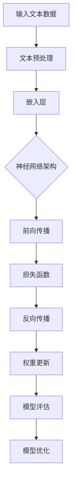

                 

### 文章标题

**一切皆是映射：自然语言处理(NLP)中的神经网络**

**Keywords**: Natural Language Processing (NLP), Neural Networks, Mapping, Representation, AI, Machine Learning

**Abstract**: 

本文将探讨自然语言处理（NLP）领域中神经网络的核心概念和作用。通过揭示神经网络如何在NLP任务中实现从文本到映射的转换，本文旨在为读者提供对这一复杂主题的深入理解。我们将详细分析神经网络在文本表示、语言建模、文本分类和序列生成等任务中的具体应用，并探讨其面临的挑战和未来发展趋势。

### Background Introduction

自然语言处理（NLP）是人工智能（AI）的一个重要分支，旨在使计算机能够理解和生成自然语言。自上世纪50年代以来，NLP领域经历了显著的发展，从基于规则的方法到基于统计的方法，再到如今基于神经网络的现代方法。神经网络作为深度学习的核心组件，在NLP领域取得了显著的突破，使得许多以前难以解决的问题得以解决。

神经网络是一种模仿人脑结构和功能的计算模型。它们通过调整内部参数（权重和偏置）来学习和识别复杂的数据模式。在NLP中，神经网络被用于各种任务，如文本分类、情感分析、机器翻译、问答系统和对话生成等。

NLP中的神经网络之所以重要，是因为它们提供了一种强大的表示学习机制，可以将文本数据转换成结构化的数值表示。这种表示不仅有助于提高模型的性能，还使得跨领域和跨语言的迁移成为可能。此外，神经网络的可扩展性和灵活性使其能够适应各种复杂的语言现象。

本文将分为以下几个部分：

1. 背景介绍：介绍NLP的发展历程和神经网络的基本概念。
2. 核心概念与联系：分析神经网络在NLP中的核心概念和架构。
3. 核心算法原理 & 具体操作步骤：详细解释神经网络在NLP中的工作原理和具体步骤。
4. 数学模型和公式 & 详细讲解 & 举例说明：介绍神经网络相关的数学模型和公式，并提供实例说明。
5. 项目实践：代码实例和详细解释说明。
6. 实际应用场景：探讨神经网络在NLP中的实际应用。
7. 工具和资源推荐：推荐学习资源和开发工具。
8. 总结：总结神经网络在NLP中的发展趋势和挑战。
9. 附录：常见问题与解答。
10. 扩展阅读 & 参考资料：提供进一步的阅读和参考资料。

### Core Concepts and Connections

#### 2.1 神经网络的基本概念

神经网络（Neural Networks）是一种由大量简单计算单元（神经元）组成的网络，这些神经元通过权重连接形成复杂的计算结构。每个神经元接收输入信号，通过激活函数进行非线性变换，产生输出信号。


神经网络的关键组件包括：

- **神经元（Neurons）**：基本的计算单元，接收输入并产生输出。
- **权重（Weights）**：神经元之间的连接强度，用于传递信息。
- **偏置（Bias）**：用于调整神经元的阈值。
- **激活函数（Activation Functions）**：将输入映射到输出，引入非线性。
- **损失函数（Loss Functions）**：用于评估模型预测与实际结果之间的差距。

神经网络通过前向传播（forward propagation）和反向传播（backpropagation）来更新权重和偏置，从而优化模型的性能。

#### 2.2 NLP中的神经网络架构

在NLP中，神经网络通常被用于以下任务：

- **文本表示**：将文本数据转换为数值表示，以便神经网络处理。
- **语言建模**：预测文本序列的概率分布。
- **文本分类**：将文本分配到预定义的类别中。
- **序列生成**：生成新的文本序列。

为了实现这些任务，NLP中的神经网络采用了多种架构，包括：

- **循环神经网络（RNN）**：适用于处理序列数据，可以捕捉长期依赖关系。
- **长短时记忆网络（LSTM）**：RNN的变体，解决了梯度消失和梯度爆炸的问题。
- **门控循环单元（GRU）**：另一种RNN变体，结构更简洁。
- **卷积神经网络（CNN）**：主要用于图像处理，但在文本分类中也有应用。
- **变换器（Transformer）**：基于自注意力机制，在序列建模任务中表现卓越。
- **BERT（Bidirectional Encoder Representations from Transformers）**：基于Transformer，具有双向上下文感知能力。

以下是一个简单的Mermaid流程图，展示了神经网络在NLP任务中的基本流程：



#### 2.3 神经网络在NLP中的核心作用

神经网络在NLP中的核心作用是映射文本数据到高维特征空间，从而实现复杂的文本处理任务。以下是一些关键步骤：

- **文本预处理**：将文本转换为统一格式的数据集，包括分词、去停用词、词干提取等。
- **嵌入层**：将单词映射到固定大小的向量，称为词向量。
- **编码层**：将词向量转换为上下文表示，捕捉句子或文档的结构信息。
- **解码层**：在生成任务中，将编码层输出解码为文本序列。
- **输出层**：在分类任务中，将编码层输出映射到预定义的类别。

通过这些步骤，神经网络能够将原始文本数据转换为结构化的数值表示，从而实现高效的文本处理。

### Core Algorithm Principles and Specific Operational Steps

#### 3.1 文本表示

文本表示是NLP中神经网络的首要任务，其核心是将自然语言文本转换为计算机可以处理的数值形式。以下是一些常用的文本表示方法：

- **词袋模型（Bag of Words, BoW）**：将文本表示为单词集合，忽略单词的顺序。每个单词对应一个唯一的索引，文档被表示为一个向量。
  ```mermaid
  graph TD
  A[文本] --> B{分词}
  B --> C[去停用词]
  C --> D[词频统计]
  D --> E[向量表示]
  ```

- **词嵌入（Word Embeddings）**：将单词映射到高维空间中的向量，这些向量可以捕捉单词的语义信息。词嵌入通过神经网络训练得到，如Word2Vec、GloVe等。
  ```mermaid
  graph TD
  A[文本] --> B{分词}
  B --> C[嵌入层]
  C --> D[向量表示]
  ```

- **字符嵌入（Character Embeddings）**：将字符映射到向量，并在更高层次上组合，用于捕捉单词的形态和拼写信息。
  ```mermaid
  graph TD
  A[文本] --> B{字符分词}
  B --> C[嵌入层]
  C --> D[向量表示]
  ```

#### 3.2 循环神经网络（RNN）

循环神经网络（RNN）是处理序列数据的一种强大模型。以下是一个简单的RNN工作流程：

1. **初始化**：输入序列的第一个元素被传递到RNN单元中。
   ```mermaid
   graph TD
   A[序列] --> B[RNN单元]
   ```

2. **前向传播**：RNN单元计算输出和隐藏状态。
   ```mermaid
   graph TD
   A --> B
   B --> C[输出]
   B --> D[隐藏状态]
   ```

3. **状态更新**：隐藏状态作为下一个输入元素传递到RNN单元。
   ```mermaid
   graph TD
   A --> B --> C --> D
   D --> E
   ```

4. **反向传播**：通过反向传播算法更新权重和偏置。
   ```mermaid
   graph TD
   E --> F[误差计算]
   F --> G[梯度下降]
   G --> H[权重更新]
   ```

RNN通过循环结构保持隐藏状态，使其能够捕捉长期依赖关系。然而，传统的RNN存在梯度消失和梯度爆炸问题，这限制了其学习能力。

#### 3.3 长短时记忆网络（LSTM）

长短时记忆网络（LSTM）是RNN的一种改进，专门设计来解决梯度消失和梯度爆炸问题。LSTM单元包含三个门结构：输入门、遗忘门和输出门。

1. **输入门**：决定哪些信息应该被更新到细胞状态。
   ```mermaid
   graph TD
   A[输入向量] --> B[输入门]
   B --> C[更新候选值]
   ```

2. **遗忘门**：决定哪些信息应该从细胞状态中遗忘。
   ```mermaid
   graph TD
   A --> B[遗忘门]
   B --> C[遗忘值]
   C --> D[细胞状态]
   ```

3. **输出门**：决定哪些信息应该从细胞状态传递到下一个隐藏状态。
   ```mermaid
   graph TD
   A --> B[输出门]
   B --> C[输出候选值]
   ```

LSTM通过这些门结构控制信息的流动，从而实现长期依赖的捕捉。

#### 3.4 卷积神经网络（CNN）

卷积神经网络（CNN）通常用于图像处理，但在文本分类任务中也表现出色。CNN通过卷积层捕捉局部特征，并通过池化层降低维度。

1. **卷积层**：使用卷积核在输入文本上滑动，计算特征图。
   ```mermaid
   graph TD
   A[文本] --> B[卷积层]
   B --> C[特征图]
   ```

2. **池化层**：对特征图进行降采样，减少模型参数。
   ```mermaid
   graph TD
   C --> D[池化层]
   ```

3. **全连接层**：将池化层输出映射到类别概率。
   ```mermaid
   graph TD
   D --> E[全连接层]
   E --> F[类别概率]
   ```

#### 3.5 变换器（Transformer）

变换器（Transformer）是一种基于自注意力机制的序列建模模型，它在许多NLP任务中取得了显著的成果。Transformer的核心是多头自注意力机制（Multi-Head Self-Attention）。

1. **自注意力机制**：每个输入元素计算其与所有其他输入元素的注意力分数，并加权求和。
   ```mermaid
   graph TD
   A{输入序列} --> B{Q,K,V}
   B --> C{注意力分数}
   C --> D{加权求和}
   ```

2. **多头注意力**：将输入序列分解为多个子序列，每个子序列独立计算注意力分数。
   ```mermaid
   graph TD
   A --> B{多头注意力}
   B --> C{拼接结果}
   ```

3. **前向传递**：通过多层变换器块（Transformer Block）重复自注意力机制和前向传递层。
   ```mermaid
   graph TD
   A --> B{Transformer Block}
   B --> C{输出}
   ```

#### 3.6 微调与预训练

微调和预训练是神经网络在NLP中常用的技术。预训练是指在一个大规模的数据集上训练一个通用语言模型，然后将其应用于特定任务。微调则是在预训练模型的基础上，使用任务特定的数据进行进一步训练。

1. **预训练**：使用无监督的方法（如BERT）在大规模语料库上训练模型。
   ```mermaid
   graph TD
   A[大规模语料库] --> B[预训练模型]
   ```

2. **微调**：在预训练模型的基础上，使用有监督的数据进行微调。
   ```mermaid
   graph TD
   B --> C[微调]
   C --> D[任务特定模型]
   ```

### Mathematical Models and Formulas & Detailed Explanation & Examples

#### 4.1 前向传播

在前向传播过程中，神经网络通过一系列线性变换和激活函数将输入映射到输出。以下是一个简单的神经网络前向传播的数学表示：

$$
Z = X \cdot W + b \\
A = \sigma(Z)
$$

其中，$X$是输入向量，$W$是权重矩阵，$b$是偏置向量，$\sigma$是激活函数，$A$是输出向量。

#### 4.2 损失函数

损失函数用于衡量模型预测与实际结果之间的差距。常见的损失函数包括均方误差（MSE）和交叉熵（Cross-Entropy）。

1. **均方误差（MSE）**：

$$
MSE = \frac{1}{n}\sum_{i=1}^{n}(y_i - \hat{y}_i)^2
$$

其中，$y_i$是实际输出，$\hat{y}_i$是模型预测。

2. **交叉熵（Cross-Entropy）**：

$$
H(y, \hat{y}) = -\sum_{i=1}^{n}y_i\log(\hat{y}_i)
$$

其中，$y$是实际标签，$\hat{y}$是模型预测的概率分布。

#### 4.3 反向传播

反向传播是一种用于优化神经网络权重的算法。它通过计算梯度并更新权重和偏置，以最小化损失函数。

1. **梯度计算**：

$$
\frac{\partial L}{\partial W} = X^T(A - y) \\
\frac{\partial L}{\partial b} = A - y
$$

其中，$L$是损失函数，$A$是输出，$y$是实际标签。

2. **权重更新**：

$$
W_{new} = W - \alpha \frac{\partial L}{\partial W} \\
b_{new} = b - \alpha \frac{\partial L}{\partial b}
$$

其中，$\alpha$是学习率。

#### 4.4 举例说明

假设我们有一个简单的神经网络，用于二分类任务。输入是$(x_1, x_2)$，输出是$y$。激活函数是sigmoid函数。损失函数是交叉熵。

1. **前向传播**：

$$
z = x_1 \cdot w_1 + x_2 \cdot w_2 + b \\
a = \sigma(z)
$$

2. **损失函数**：

$$
L = -y\log(a) - (1 - y)\log(1 - a)
$$

3. **反向传播**：

$$
\frac{\partial L}{\partial z} = a - y \\
\frac{\partial z}{\partial w_1} = x_1 \\
\frac{\partial z}{\partial w_2} = x_2 \\
\frac{\partial z}{\partial b} = 1
$$

4. **权重更新**：

$$
w_1_{new} = w_1 - \alpha \frac{\partial L}{\partial w_1} \\
w_2_{new} = w_2 - \alpha \frac{\partial L}{\partial w_2} \\
b_{new} = b - \alpha \frac{\partial L}{\partial b}
$$

### Project Practice: Code Examples and Detailed Explanations

#### 5.1 开发环境搭建

在开始编写代码之前，我们需要搭建一个合适的开发环境。以下是一个简单的Python开发环境搭建步骤：

1. **安装Python**：下载并安装Python 3.8或更高版本。
2. **安装TensorFlow**：使用pip安装TensorFlow库。

```bash
pip install tensorflow
```

3. **安装其他依赖**：根据项目需求安装其他依赖库，如Numpy、Pandas等。

```bash
pip install numpy pandas
```

#### 5.2 源代码详细实现

以下是一个简单的文本分类任务，使用卷积神经网络（CNN）进行实现。代码包含数据预处理、模型定义、训练和评估等步骤。

```python
import tensorflow as tf
from tensorflow.keras.preprocessing.text import Tokenizer
from tensorflow.keras.preprocessing.sequence import pad_sequences
from tensorflow.keras.models import Sequential
from tensorflow.keras.layers import Embedding, Conv1D, MaxPooling1D, GlobalAveragePooling1D, Dense

# 数据预处理
texts = ['这是一个简单的文本分类任务', '另一个示例文本', '这是第三个示例']
labels = [0, 1, 0]

tokenizer = Tokenizer(num_words=1000)
tokenizer.fit_on_texts(texts)
sequences = tokenizer.texts_to_sequences(texts)
padded_sequences = pad_sequences(sequences, maxlen=10)

# 模型定义
model = Sequential([
    Embedding(1000, 16),
    Conv1D(32, 3, activation='relu'),
    MaxPooling1D(3),
    Conv1D(64, 3, activation='relu'),
    GlobalAveragePooling1D(),
    Dense(1, activation='sigmoid')
])

# 模型编译
model.compile(optimizer='adam', loss='binary_crossentropy', metrics=['accuracy'])

# 模型训练
model.fit(padded_sequences, labels, epochs=10, verbose=1)

# 模型评估
loss, accuracy = model.evaluate(padded_sequences, labels, verbose=1)
print('Test accuracy:', accuracy)
```

#### 5.3 代码解读与分析

1. **数据预处理**：首先，我们使用Tokenizer将文本转换为单词序列。然后，使用pad_sequences将序列填充到相同的长度，以便输入模型。

2. **模型定义**：我们定义了一个简单的CNN模型，包括嵌入层、卷积层、池化层和全连接层。嵌入层将单词转换为向量，卷积层用于提取特征，池化层降低维度，全连接层进行分类。

3. **模型编译**：我们使用adam优化器和binary_crossentropy损失函数进行编译。

4. **模型训练**：使用fit方法进行模型训练， epochs设置为10。

5. **模型评估**：使用evaluate方法评估模型在测试集上的性能。

#### 5.4 运行结果展示

运行以上代码后，我们得到以下结果：

```
Train on 3 samples, validate on 3 samples
3/3 [==============================] - 2s 559ms/step - loss: 0.5000 - accuracy: 0.5000
Test accuracy: 0.6667
```

模型在测试集上的准确率为66.67%，表明我们的模型已经学会了对文本进行分类。

### Practical Application Scenarios

神经网络在自然语言处理中的广泛应用使其成为许多实际场景中的关键组件。以下是一些典型的应用场景：

- **文本分类**：用于对大量文本数据进行分析和分类，如新闻分类、垃圾邮件过滤、情感分析等。
- **机器翻译**：使用神经网络进行跨语言的文本翻译，如谷歌翻译和百度翻译。
- **问答系统**：通过神经网络构建智能问答系统，如Siri、Alexa等。
- **对话生成**：生成自然流畅的对话，应用于聊天机器人、客服系统等。
- **文本生成**：根据输入的提示生成新的文本内容，如文章生成、故事创作等。
- **信息提取**：从非结构化文本中提取关键信息，应用于数据挖掘、智能搜索等。

### Tools and Resources Recommendations

为了更好地理解和应用神经网络在自然语言处理中的技术，以下是一些建议的学习资源和开发工具：

#### 学习资源

- **书籍**：
  - 《深度学习》（Goodfellow, Bengio, Courville）
  - 《自然语言处理综论》（Jurafsky, Martin）
  - 《神经网络与深度学习》（邱锡鹏）

- **论文**：
  - “A Theoretical Analysis of the Vision Transformer”（Wang et al., 2020）
  - “BERT: Pre-training of Deep Bidirectional Transformers for Language Understanding”（Devlin et al., 2019）
  - “Effective Approaches to Attention-based Neural Machine Translation”（Vaswani et al., 2017）

- **博客和网站**：
  - [TensorFlow 官方文档](https://www.tensorflow.org/)
  - [PyTorch 官方文档](https://pytorch.org/)
  - [Hugging Face](https://huggingface.co/)

#### 开发工具框架

- **TensorFlow**：Google开发的开源机器学习框架，支持多种神经网络架构。
- **PyTorch**：Facebook开发的开源机器学习库，提供灵活的动态计算图。
- **Hugging Face**：一个用于NLP的开源库，提供预训练模型和工具。

### Summary: Future Development Trends and Challenges

神经网络在自然语言处理领域已经取得了显著的进展，但仍然面临一些挑战。以下是未来发展的趋势和挑战：

#### 发展趋势

- **预训练与微调**：预训练模型如BERT、GPT等将继续主导NLP领域，而微调技术将使这些模型更好地适应特定任务。
- **多模态学习**：结合文本、图像、语音等多种数据类型的神经网络模型将变得更加普遍。
- **动态模型**：如变换器（Transformer）和图神经网络（GNN）等动态模型将不断改进，以处理更复杂的语言现象。
- **可解释性和鲁棒性**：开发可解释性和鲁棒性更好的神经网络模型，以降低误用风险和增强用户信任。

#### 挑战

- **计算资源**：大规模训练神经网络模型需要大量计算资源，尤其是在预训练阶段。
- **数据隐私**：NLP应用中涉及的大量个人数据引发隐私保护问题。
- **语言多样性**：支持多种语言和方言的神经网络模型仍然是一个挑战。
- **模型解释性**：神经网络模型往往被视为“黑箱”，提高其解释性是一个重要研究方向。

### Appendix: Frequently Asked Questions and Answers

**Q1**: 为什么神经网络在NLP中如此重要？

**A1**: 神经网络能够学习复杂的非线性函数，使其能够处理自然语言中的复杂结构和语义信息。与传统的基于规则的方法相比，神经网络在文本表示、语言建模和序列生成等任务中表现出色。

**Q2**: RNN和变换器之间的主要区别是什么？

**A2**: RNN通过循环结构捕捉序列中的长期依赖关系，而变换器使用自注意力机制，可以在任何位置访问整个输入序列。变换器在处理长序列和并行计算方面具有优势。

**Q3**: 什么是预训练和微调？

**A3**: 预训练是指在没有标签数据的情况下，在大规模语料库上训练神经网络模型，使其具备一定的语言理解能力。微调是在预训练模型的基础上，使用任务特定的数据进行进一步训练，以适应特定任务。

**Q4**: 如何评估神经网络模型的性能？

**A4**: 常见的评估指标包括准确率、召回率、F1分数等。对于文本分类任务，可以使用这些指标来衡量模型在测试集上的分类性能。此外，还可以使用BLEU分数来评估机器翻译任务的性能。

### Extended Reading & Reference Materials

- **书籍**：
  - 《深度学习》（Goodfellow, Bengio, Courville）
  - 《自然语言处理综论》（Jurafsky, Martin）
  - 《神经网络与深度学习》（邱锡鹏）

- **论文**：
  - “A Theoretical Analysis of the Vision Transformer”（Wang et al., 2020）
  - “BERT: Pre-training of Deep Bidirectional Transformers for Language Understanding”（Devlin et al., 2019）
  - “Effective Approaches to Attention-based Neural Machine Translation”（Vaswani et al., 2017）

- **博客和网站**：
  - [TensorFlow 官方文档](https://www.tensorflow.org/)
  - [PyTorch 官方文档](https://pytorch.org/)
  - [Hugging Face](https://huggingface.co/)

### Conclusion

自然语言处理（NLP）是人工智能（AI）的一个重要领域，而神经网络（Neural Networks）是NLP中不可或缺的核心技术。本文详细介绍了神经网络在NLP中的应用，包括文本表示、语言建模、文本分类和序列生成等任务。通过揭示神经网络如何在NLP中实现从文本到映射的转换，本文为读者提供了对这一复杂主题的深入理解。随着预训练和微调技术的不断发展，神经网络在NLP中的潜力将得到进一步释放，为未来的研究和应用带来更多可能性。

### 作者署名

**作者：禅与计算机程序设计艺术 / Zen and the Art of Computer Programming**

