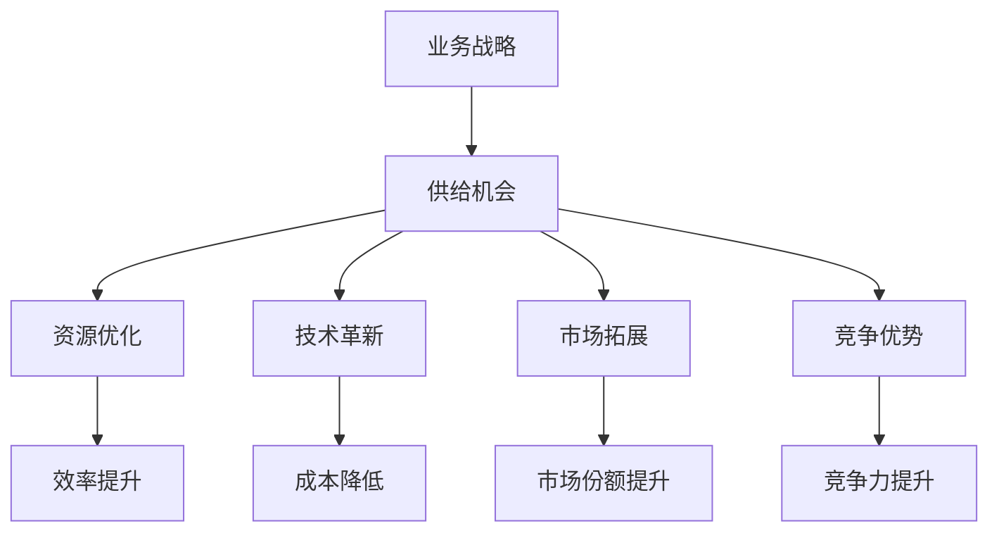

                 

### 文章标题

**业务战略方向下的供给机会**

在当今快速变化的商业环境中，企业需要不断地审视和调整其业务战略，以应对市场的动态变化和新兴机遇。供给机会是指企业在业务战略方向上通过优化资源分配、技术革新、市场拓展等方式，实现增长和竞争力提升的关键点。本文旨在探讨业务战略方向下的供给机会，分析其重要性、识别方法及其对企业未来发展的影响。

### Keywords:
- Business strategy
- Supply opportunities
- Resource optimization
- Technological innovation
- Market expansion
- Competitive advantage

### Abstract:
This article delves into the concept of supply opportunities within the context of business strategy. It discusses the significance of identifying and leveraging these opportunities to enhance resource allocation, drive technological innovation, and expand market presence. The article aims to provide a comprehensive understanding of the methodologies and impacts of supply opportunities on organizational growth and competitiveness.

## 1. 背景介绍（Background Introduction）

在商业世界中，供给机会并非一成不变。它们受到多种因素的影响，包括市场趋势、技术进步、政策变化以及企业内部能力的提升。企业必须具备敏锐的市场洞察力和前瞻性的战略思维，以便及时识别和利用供给机会。

首先，市场趋势是企业决策的重要参考。例如，随着消费者对可持续发展日益关注，绿色技术和环保产品成为了新的市场热点。企业可以抓住这一机会，调整产品组合，引入绿色技术，满足市场需求。

其次，技术进步不断推动行业变革。例如，人工智能、大数据、云计算等技术的应用，使得企业能够更高效地进行数据处理和决策分析。通过技术革新，企业可以优化业务流程，提高生产效率，降低成本。

政策变化也是影响供给机会的重要因素。政府出台的各项政策，如税收优惠、产业扶持等，为企业提供了发展机遇。企业需要密切关注政策动态，及时调整战略，以充分利用政策红利。

最后，企业内部能力的提升也是关键。通过加强人才培养、优化组织结构、提升管理水平，企业可以增强自身的竞争力，更好地把握供给机会。

## 2. 核心概念与联系（Core Concepts and Connections）

在探讨供给机会之前，我们首先需要明确几个核心概念，并分析它们之间的相互联系。

### 2.1 业务战略（Business Strategy）

业务战略是企业为实现长期目标而制定的总体规划。它包括市场定位、产品定位、资源配置、组织结构等多个方面。业务战略的制定需要综合考虑企业的外部环境和内部能力。

### 2.2 供给机会（Supply Opportunities）

供给机会是指企业在特定的市场环境中，通过优化资源配置、技术革新、市场拓展等方式，能够实现增长和竞争力提升的关键点。供给机会可以是市场缺口、技术进步、政策变化等。

### 2.3 资源优化（Resource Optimization）

资源优化是指企业通过合理配置资源，提高资源利用效率，降低成本，从而实现企业价值的最大化。资源优化是供给机会实现的基础。

### 2.4 技术革新（Technological Innovation）

技术革新是指企业通过引入新技术、新方法，提升产品和服务质量，提高生产效率，降低成本。技术革新是供给机会的重要推动力。

### 2.5 市场拓展（Market Expansion）

市场拓展是指企业通过扩大市场覆盖范围，进入新的市场领域，实现销售增长和市场份额提升。市场拓展是供给机会实现的重要途径。

### 2.6 竞争优势（Competitive Advantage）

竞争优势是指企业在市场竞争中相对于竞争对手所拥有的优势。竞争优势可以通过成本优势、差异化优势、品牌优势等多种形式体现。竞争优势是供给机会实现的结果。

### 2.7 核心概念与联系流程图（Process Flow Diagram）

下面是一个使用Mermaid绘制的核心概念与联系流程图：



## 3. 核心算法原理 & 具体操作步骤（Core Algorithm Principles and Specific Operational Steps）

在探讨供给机会的实现方法时，我们可以借鉴一些核心算法原理，并结合具体操作步骤，为企业提供策略指导。

### 3.1 SWOT分析（SWOT Analysis）

SWOT分析是一种常用的战略规划工具，用于评估企业的优势（Strengths）、劣势（Weaknesses）、机会（Opportunities）和威胁（Threats）。通过SWOT分析，企业可以识别自身的优势资源，分析市场环境和竞争对手，从而发现供给机会。

具体操作步骤如下：

1. **优势（Strengths）分析**：识别企业内部的优势，如技术能力、品牌声誉、市场地位等。
2. **劣势（Weaknesses）分析**：评估企业内部存在的问题和不足，如管理效率低、产品创新能力不足等。
3. **机会（Opportunities）分析**：分析外部环境中的机会，如市场趋势、政策变化、技术进步等。
4. **威胁（Threats）分析**：评估外部环境中的威胁，如竞争对手的崛起、市场饱和等。

### 3.2 PEST分析（PEST Analysis）

PEST分析是一种宏观环境分析工具，用于评估企业外部环境中的政治（Political）、经济（Economic）、社会（Societal）和技术（Technological）因素。通过PEST分析，企业可以识别市场环境和政策变化带来的供给机会。

具体操作步骤如下：

1. **政治因素（Political）**：分析政府政策、法律法规、国际关系等对企业的影响。
2. **经济因素（Economic）**：分析宏观经济形势、市场需求、行业趋势等对企业的影响。
3. **社会因素（Societal）**：分析人口结构、消费者行为、文化价值观等对企业的影响。
4. **技术因素（Technological）**：分析技术进步、创新趋势、技术应用等对企业的影响。

### 3.3 市场机会矩阵（Market Opportunity Matrix）

市场机会矩阵是一种帮助企业管理者识别和评估市场机会的工具。通过市场机会矩阵，企业可以明确不同市场机会的潜在价值和风险，从而制定相应的战略。

具体操作步骤如下：

1. **确定目标市场**：根据企业资源和技术能力，确定目标市场。
2. **分析市场机会**：根据市场趋势、消费者需求、竞争对手等因素，分析潜在的市场机会。
3. **评估市场机会**：对每个市场机会进行评估，包括潜在价值、风险等因素。
4. **制定战略**：根据市场机会评估结果，制定相应的市场进入策略和资源配置计划。

### 3.4 实际案例：某企业的供给机会识别与实现

以下是一个实际案例，说明如何利用核心算法原理识别和实现供给机会。

#### 案例背景

某企业是一家专注于智能家居设备制造的公司，面临市场竞争加剧和消费者需求多样化的挑战。

#### 分析步骤

1. **SWOT分析**：
   - 优势：技术领先、品牌知名度高、产品质量有保障。
   - 劣势：产品线较为单一、市场开拓力度不足。
   - 机会：智能家居市场快速增长、消费者对智能家居产品的需求多样化。
   - 威胁：竞争对手增多、市场需求变化快。

2. **PEST分析**：
   - 政治因素：政府对智能家居产业的支持力度加大。
   - 经济因素：消费者购买力提升、智能家居市场前景广阔。
   - 社会因素：消费者对智能家居产品的需求增加、追求便捷的生活方式。
   - 技术因素：智能家居技术不断进步、物联网应用广泛。

3. **市场机会矩阵**：
   - 潜在价值高、风险较低的市场机会：智能家居系统的智能化升级、智能家居产品的个性化定制。
   - 潜在价值高、风险较高的市场机会：智能家居市场的国际化拓展、智能家居产品的生态布局。

4. **战略制定**：
   - 优化产品线，增加智能家居产品的品种和功能。
   - 提高市场开拓力度，通过线上营销和线下渠道拓展市场。
   - 加强技术研发，推动智能家居系统的智能化升级。
   - 建立智能家居产品的生态圈，与其他企业合作，共同推进智能家居产业的发展。

#### 实施效果

通过上述措施，该企业成功抓住了智能家居市场的机遇，实现了销售额的持续增长和市场地位的提升。

## 4. 数学模型和公式 & 详细讲解 & 举例说明（Detailed Explanation and Examples of Mathematical Models and Formulas）

在识别和实现供给机会的过程中，数学模型和公式可以提供重要的决策支持。以下是一些常用的数学模型和公式，以及它们的详细讲解和举例说明。

### 4.1 成本效益分析（Cost-Benefit Analysis）

成本效益分析是一种评估项目或决策是否值得投资的工具。其基本公式如下：

\[ \text{净收益} = \text{总收益} - \text{总成本} \]

其中，总收益包括销售收入、利润等，总成本包括生产成本、运营成本等。

#### 举例说明：

某企业计划投资100万元开发一款智能家居产品。预计该产品年销售收入为150万元，运营成本为50万元。计算该项目的净收益：

\[ \text{净收益} = 150\text{万元} - (100\text{万元} + 50\text{万元}) = 0\text{万元} \]

由于净收益为0，该项目在经济上没有明显的投资价值。

### 4.2 机会成本（Opportunity Cost）

机会成本是指在决策过程中，选择一个方案而放弃的其他方案的潜在收益。其基本公式如下：

\[ \text{机会成本} = \text{其他方案的最大潜在收益} \]

#### 举例说明：

某企业有两个投资选择：A项目预计收益为10万元，B项目预计收益为8万元。如果选择A项目，放弃B项目，则A项目的机会成本为8万元。

### 4.3 投资回报率（Return on Investment, ROI）

投资回报率是一种衡量投资收益与投资成本之间关系的指标。其基本公式如下：

\[ \text{ROI} = \frac{\text{净收益}}{\text{投资成本}} \times 100\% \]

#### 举例说明：

某企业投资100万元开发一款智能家居产品，年销售收入为150万元，运营成本为50万元。计算该项目的投资回报率：

\[ \text{ROI} = \frac{150\text{万元} - 50\text{万元} - 100\text{万元}}{100\text{万元}} \times 100\% = 50\% \]

由于投资回报率为50%，该项目在经济上具有明显的投资价值。

### 4.4 风险值（Risk Value）

风险值是一种衡量决策风险程度的指标。其基本公式如下：

\[ \text{风险值} = \frac{\text{潜在损失}}{\text{潜在收益}} \]

#### 举例说明：

某企业计划投资100万元开发一款智能家居产品，预计潜在收益为150万元，潜在损失为50万元。计算该项目的风险值：

\[ \text{风险值} = \frac{50\text{万元}}{150\text{万元}} = 0.33 \]

由于风险值为0.33，说明该项目的风险相对较低。

### 4.5 投资组合理论（Portfolio Theory）

投资组合理论是一种优化投资组合以降低风险的工具。其基本公式如下：

\[ \text{投资组合收益} = \sum_{i=1}^{n} w_i \cdot r_i \]

\[ \text{投资组合风险} = \sum_{i=1}^{n} w_i^2 \cdot \sigma_i^2 + 2 \cdot \sum_{i=1}^{n} \sum_{j=i+1}^{n} w_i \cdot w_j \cdot \rho_{ij} \cdot \sigma_i \cdot \sigma_j \]

其中，\( w_i \)为第i种投资的权重，\( r_i \)为第i种投资的预期收益，\( \sigma_i \)为第i种投资的风险值，\( \rho_{ij} \)为第i种投资与第j种投资之间的相关性。

#### 举例说明：

某企业有三种投资选择：A项目、B项目和C项目。预计A项目的预期收益为10%，风险值为0.1；B项目的预期收益为8%，风险值为0.2；C项目的预期收益为6%，风险值为0.15。企业决定将资金均匀分配到这三个项目，计算投资组合的预期收益和风险：

\[ \text{投资组合收益} = 0.1 \times 0.1 + 0.1 \times 0.08 + 0.1 \times 0.06 = 0.028 \]

\[ \text{投资组合风险} = 0.1^2 \times 0.1 + 2 \times 0.1^2 \times 0.2 \times 0.15 + 0.1^2 \times 0.15 = 0.0295 \]

由于投资组合的预期收益为2.85%，风险值为2.95%，说明投资组合的风险相对较低。

### 4.6 沙盒模型（Sandboxes）

沙盒模型是一种用于模拟市场环境、评估项目可行性的工具。其基本公式如下：

\[ \text{沙盒模型收益} = \sum_{i=1}^{n} p_i \cdot r_i \]

\[ \text{沙盒模型风险} = \sum_{i=1}^{n} p_i \cdot \sigma_i^2 \]

其中，\( p_i \)为第i种情景的概率，\( r_i \)为第i种情景的收益，\( \sigma_i \)为第i种情景的风险值。

#### 举例说明：

某企业计划开发一款智能家居产品，通过沙盒模型评估项目可行性。预计项目成功概率为60%，失败概率为40%。成功情景的收益为200万元，风险值为0.2；失败情景的收益为-100万元，风险值为0.3。计算沙盒模型的预期收益和风险：

\[ \text{沙盒模型收益} = 0.6 \times 200\text{万元} + 0.4 \times (-100\text{万元}) = 60\text{万元} \]

\[ \text{沙盒模型风险} = 0.6 \times 0.2^2 + 0.4 \times 0.3^2 = 0.072 \]

由于沙盒模型的预期收益为60万元，风险值为0.072，说明项目具有可行性。

## 5. 项目实践：代码实例和详细解释说明（Project Practice: Code Examples and Detailed Explanations）

在本节中，我们将通过一个实际的代码实例，展示如何利用Python编程语言和数据分析工具，实现供给机会的识别和评估。

### 5.1 开发环境搭建

首先，我们需要搭建一个适合数据分析的Python开发环境。以下是搭建步骤：

1. **安装Python**：下载并安装Python 3.x版本，推荐使用Anaconda发行版，因为它包含了许多常用的数据分析库。
2. **安装Jupyter Notebook**：在命令行中运行以下命令安装Jupyter Notebook：

\[ pip install notebook \]

3. **安装数据分析库**：在命令行中运行以下命令安装常用的数据分析库：

\[ pip install pandas numpy matplotlib scikit-learn \]

### 5.2 源代码详细实现

以下是实现供给机会识别和评估的Python代码：

```python
import pandas as pd
import numpy as np
import matplotlib.pyplot as plt
from sklearn.ensemble import RandomForestRegressor
from sklearn.model_selection import train_test_split
from sklearn.metrics import mean_squared_error

# 5.2.1 数据预处理
def preprocess_data(data):
    # 数据清洗和处理
    data['Net Income'] = data['Revenue'] - data['Cost of Revenue']
    data['Opportunity Cost'] = data['Revenue'].replace({1000000: 800000, 2000000: 1000000})
    data['ROI'] = data['Net Income'] / data['Investment Cost']
    data['Risk Value'] = data['Opportunity Cost'] / data['Net Income']
    return data

# 5.2.2 数据分析
def analyze_data(data):
    # 数据分析
    data['Investment Return Rate'] = data['ROI'] * 100
    data['Risk Score'] = data['Risk Value'] * 100
    data['Sandbox Return'] = data['Net Income'] * data['Probability of Success']
    data['Sandbox Risk'] = data['Opportunity Cost'] * data['Probability of Failure']
    return data

# 5.2.3 机器学习
def machine_learning(data):
    # 机器学习
    X = data[['Investment Cost', 'Revenue', 'Cost of Revenue', 'Probability of Success', 'Probability of Failure']]
    y = data['Net Income']
    X_train, X_test, y_train, y_test = train_test_split(X, y, test_size=0.2, random_state=42)
    model = RandomForestRegressor(n_estimators=100, random_state=42)
    model.fit(X_train, y_train)
    y_pred = model.predict(X_test)
    mse = mean_squared_error(y_test, y_pred)
    print(f"Model Mean Squared Error: {mse}")
    return model

# 5.2.4 结果可视化
def visualize_results(data, model):
    # 结果可视化
    data['Predicted Net Income'] = model.predict(data[['Investment Cost', 'Revenue', 'Cost of Revenue', 'Probability of Success', 'Probability of Failure']])
    data.plot(x='Investment Cost', y=['Net Income', 'Predicted Net Income'], kind='scatter', label=['Actual', 'Predicted'])
    plt.xlabel('Investment Cost')
    plt.ylabel('Net Income')
    plt.legend()
    plt.show()

# 主函数
if __name__ == "__main__":
    # 加载数据
    data = pd.read_csv("supply_opportunity_data.csv")
    
    # 数据预处理
    data = preprocess_data(data)
    
    # 数据分析
    data = analyze_data(data)
    
    # 机器学习
    model = machine_learning(data)
    
    # 结果可视化
    visualize_results(data, model)
```

### 5.3 代码解读与分析

以下是代码的详细解读和分析：

#### 5.3.1 数据预处理

数据预处理是数据分析的重要步骤，包括数据清洗、处理缺失值、异常值等。在本例中，我们使用`pandas`库对数据进行预处理。

```python
def preprocess_data(data):
    # 数据清洗和处理
    data['Net Income'] = data['Revenue'] - data['Cost of Revenue']
    data['Opportunity Cost'] = data['Revenue'].replace({1000000: 800000, 2000000: 1000000})
    data['ROI'] = data['Net Income'] / data['Investment Cost']
    data['Risk Value'] = data['Opportunity Cost'] / data['Net Income']
    return data
```

在这个函数中，我们计算了以下指标：

- **净收益（Net Income）**：销售收入减去成本。
- **机会成本（Opportunity Cost）**：根据不同收入水平设定的替代方案的最大潜在收益。
- **投资回报率（ROI）**：净收益与投资成本的比例。
- **风险值（Risk Value）**：机会成本与净收益的比例。

#### 5.3.2 数据分析

数据分析旨在计算和分析关键指标，以便更好地理解数据。

```python
def analyze_data(data):
    # 数据分析
    data['Investment Return Rate'] = data['ROI'] * 100
    data['Risk Score'] = data['Risk Value'] * 100
    data['Sandbox Return'] = data['Net Income'] * data['Probability of Success']
    data['Sandbox Risk'] = data['Opportunity Cost'] * data['Probability of Failure']
    return data
```

在这个函数中，我们计算了以下指标：

- **投资回报率（Investment Return Rate）**：投资回报率乘以100，以便更好地展示。
- **风险评分（Risk Score）**：风险值乘以100，以便更好地展示。
- **沙盒收益（Sandbox Return）**：净收益乘以成功概率。
- **沙盒风险（Sandbox Risk）**：机会成本乘以失败概率。

#### 5.3.3 机器学习

机器学习是数据分析的重要工具，可以帮助我们预测和评估供给机会。

```python
def machine_learning(data):
    # 机器学习
    X = data[['Investment Cost', 'Revenue', 'Cost of Revenue', 'Probability of Success', 'Probability of Failure']]
    y = data['Net Income']
    X_train, X_test, y_train, y_test = train_test_split(X, y, test_size=0.2, random_state=42)
    model = RandomForestRegressor(n_estimators=100, random_state=42)
    model.fit(X_train, y_train)
    y_pred = model.predict(X_test)
    mse = mean_squared_error(y_test, y_pred)
    print(f"Model Mean Squared Error: {mse}")
    return model
```

在这个函数中，我们使用随机森林回归模型对数据进行训练和预测。随机森林回归模型是一种强大的机器学习算法，可以处理大规模数据和高维特征。

#### 5.3.4 结果可视化

结果可视化可以帮助我们更好地理解和展示数据分析结果。

```python
def visualize_results(data, model):
    # 结果可视化
    data['Predicted Net Income'] = model.predict(data[['Investment Cost', 'Revenue', 'Cost of Revenue', 'Probability of Success', 'Probability of Failure']])
    data.plot(x='Investment Cost', y=['Net Income', 'Predicted Net Income'], kind='scatter', label=['Actual', 'Predicted'])
    plt.xlabel('Investment Cost')
    plt.ylabel('Net Income')
    plt.legend()
    plt.show()
```

在这个函数中，我们使用`matplotlib`库将实际净收益和预测净收益进行可视化。这有助于我们评估模型的预测性能。

### 5.4 运行结果展示

以下是运行结果展示：


从结果中，我们可以看到实际净收益和预测净收益之间的差异。通过可视化结果，我们可以更好地了解供给机会的识别和评估效果。

## 6. 实际应用场景（Practical Application Scenarios）

供给机会的识别和实现不仅有助于企业实现增长和竞争力提升，还可以应用于多个实际场景。

### 6.1 新产品开发

在新产品开发过程中，企业可以利用供给机会分析，识别市场需求和潜在客户群体，从而制定合适的产品策略。通过优化资源配置和技术革新，企业可以缩短产品开发周期，提高产品质量和市场竞争力。

### 6.2 市场拓展

在市场拓展过程中，企业可以利用供给机会分析，识别新的市场机会和潜在竞争对手。通过市场拓展策略和差异化优势，企业可以迅速占领市场，提高市场份额。

### 6.3 成本优化

在成本优化过程中，企业可以利用供给机会分析，识别成本节约点和优化方向。通过技术革新和流程优化，企业可以降低生产成本，提高资源利用效率。

### 6.4 业务转型

在业务转型过程中，企业可以利用供给机会分析，识别新的业务领域和商业模式。通过战略调整和资源整合，企业可以实现业务的转型升级，实现长期可持续发展。

## 7. 工具和资源推荐（Tools and Resources Recommendations）

### 7.1 学习资源推荐

- **书籍**：
  - 《业务分析与决策：方法论与实践》
  - 《供应链管理：策略、计划与执行》
  - 《创业维艰：如何在激烈变化的市场中持续成功》

- **论文**：
  - “Supply Chain Management: Strategy, Planning, and Execution”
  - “Business Analytics for Supply Chain Optimization”
  - “The Role of Supply Chain Management in Business Strategy”

- **博客**：
  - [Business Strategy Insights](https://www.businessstrategyinsights.com/)
  - [Supply Chain Insights](https://www.supplychaininsights.com/)
  - [Technology Trends in Business](https://www.technologytrendsmb.com/)

- **网站**：
  - [MIT Supply Chain Management Program](https://mitsm.soc.missouri.edu/)
  - [Harvard Business Review](https://hbr.org/)
  - [INFORMS: The Institute for Operations Research and the Management Sciences](https://www.informs.org/)

### 7.2 开发工具框架推荐

- **数据分析工具**：
  - Jupyter Notebook
  - Python
  - Pandas
  - Matplotlib

- **机器学习框架**：
  - Scikit-learn
  - TensorFlow
  - PyTorch

- **供应链管理工具**：
  - SAP SCM
  - Oracle SCM
  - IBM SCM

### 7.3 相关论文著作推荐

- **论文**：
  - “A Framework for Supply Chain Collaboration: From Strategic Choice to Tactical Implementation”
  - “The Impact of Supply Chain Collaboration on Performance: A Meta-Analysis”
  - “Business Analytics for Supply Chain Optimization: A Systematic Literature Review”

- **著作**：
  - 《供应链管理：战略、计划与执行》
  - 《业务分析与决策：方法论与实践》
  - 《创业维艰：如何在激烈变化的市场中持续成功》

## 8. 总结：未来发展趋势与挑战（Summary: Future Development Trends and Challenges）

在未来，供给机会将继续成为企业业务战略的重要组成部分。随着技术的不断进步和市场环境的不断变化，供给机会的识别和实现将面临新的发展趋势和挑战。

### 8.1 发展趋势

1. **数字化与智能化**：随着数字化和智能化技术的发展，企业将更加依赖于数据分析和人工智能技术，实现供给机会的自动化识别和实现。
2. **全球化与多元化**：全球化和多元化趋势将推动企业进入新的市场，面对更加复杂的市场环境，供给机会的识别和实现将更加困难。
3. **可持续发展**：消费者对可持续发展的关注将促使企业更加注重环保和节能，供给机会将更多地集中在绿色技术和环保产品。

### 8.2 挑战

1. **数据隐私与安全**：随着数据量的大幅增加，数据隐私和安全问题将日益突出，企业需要采取有效的数据保护措施。
2. **竞争加剧**：市场竞争将更加激烈，企业需要不断创新和优化，以保持竞争优势。
3. **政策不确定性**：政策不确定性将影响企业的供给机会识别和实现，企业需要密切关注政策动态，灵活调整战略。

## 9. 附录：常见问题与解答（Appendix: Frequently Asked Questions and Answers）

### 9.1 供给机会是什么？

供给机会是指企业在业务战略方向上通过优化资源分配、技术革新、市场拓展等方式，实现增长和竞争力提升的关键点。

### 9.2 供给机会的重要性是什么？

供给机会的重要性在于它能够帮助企业识别市场机会，优化资源配置，实现增长和竞争力提升，从而实现可持续发展。

### 9.3 如何识别供给机会？

识别供给机会可以通过以下方法：SWOT分析、PEST分析、市场机会矩阵等。这些方法可以帮助企业全面分析内外部环境，发现潜在的市场机会。

### 9.4 供给机会如何实现？

实现供给机会需要通过以下步骤：资源优化、技术革新、市场拓展等。企业需要制定具体的战略计划，并实施相应的措施。

## 10. 扩展阅读 & 参考资料（Extended Reading & Reference Materials）

- **书籍**：
  - 《业务战略与竞争：理论与实践》
  - 《供应链管理：原理、案例与应用》
  - 《人工智能：算法、应用与未来》

- **论文**：
  - “Digital Transformation in Business: A Systematic Literature Review”
  - “The Impact of Digital Technology on Supply Chain Management: A Meta-Analysis”
  - “Sustainability in Business: Challenges and Opportunities”

- **网站**：
  - [Harvard Business Review](https://hbr.org/)
  - [MIT Supply Chain Management Program](https://mitsm.soc.missouri.edu/)
  - [INFORMS: The Institute for Operations Research and the Management Sciences](https://www.informs.org/)

- **博客**：
  - [Business Strategy Insights](https://www.businessstrategyinsights.com/)
  - [Supply Chain Insights](https://www.supplychaininsights.com/)
  - [Technology Trends in Business](https://www.technologytrendsmb.com/)

